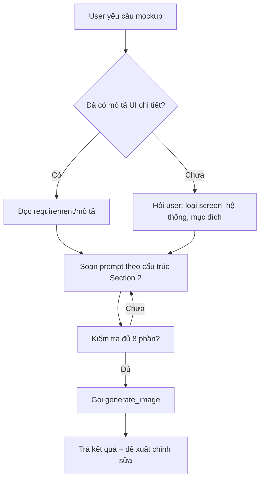

# 🎨 Mockup Image Generator – Tạo mockup siêu chi tiết bằng Nano Banana Pro

> **Khi nào dùng:** Mỗi khi cần tạo mockup UI, wireframe, hình minh họa giao diện, screenshot giả lập cho requirement, slide, hoặc document. Dùng tool `generate_image` với prompt cực kỳ chi tiết.

---

## 1. NGUYÊN TẮC CỐT LÕI

| # | Nguyên tắc                                   | Giải thích                                                                                            |
| - | ---------------------------------------------- | ------------------------------------------------------------------------------------------------------- |
| 1 | **Prompt phải CỰC KỲ chi tiết**      | Tận dụng tối đa Gemini 3 Pro – mô tả từng pixel, từng element, từng màu, từng khoảng cách |
| 2 | **Không bao giờ dùng prompt ngắn**   | ❌ "Login page" → ✅ Mô tả đầy đủ 15–30 dòng                                                   |
| 3 | **Luôn mô tả layout structure**       | Grid, columns, spacing, alignment, padding                                                              |
| 4 | **Luôn chỉ định màu sắc cụ thể** | Hex code, gradient direction, opacity                                                                   |
| 5 | **Luôn mô tả typography**             | Font name, size, weight, color, line-height                                                             |
| 6 | **Luôn mô tả trạng thái**           | Hover, active, disabled, empty state, loading                                                           |
| 7 | **Realistic data**                       | Dùng dữ liệu thực tế tiếng Việt, không "Lorem ipsum"                                            |

---

## 1.1 🔴 BẮT BUỘC: CHỈ DÙNG Nano Banana Pro (generate_image tool)

> **CRITICAL – KHÔNG NGOẠI LỆ:**

| Quy tắc                     | Chi tiết                                                                                |
| ---------------------------- | ---------------------------------------------------------------------------------------- |
| ✅**CHỈ DÙNG**       | Tool `generate_image` (Nano Banana Pro)                                                |
| ❌**CẤM HOÀN TOÀN** | Gemini 3.1 Flash, Gemini 3 Flash, hoặc bất kỳ model nào KHÔNG phải Nano Banana Pro |
| ❌**CẤM**             | Dùng Stitch MCP hoặc bất kỳ tool/service nào khác để tạo mockup image           |

**Lý do:** Nano Banana Pro cho chất lượng hình ảnh tốt nhất, chi tiết nhất, phù hợp nhất cho mockup UI/UX production-ready. Các model khác (Flash) cho chất lượng thấp hơn, thiếu chi tiết, không đạt chuẩn.

> 🔴 **Tự kiểm tra trước mỗi lần tạo mockup:** "Mình có đang dùng đúng `generate_image` tool (Nano Banana Pro) không?" → Nếu KHÔNG → DỪNG LẠI, chuyển sang đúng tool.

---

## 2. CẤU TRÚC PROMPT CHUẨN (BẮT BUỘC)

> 🔴 **Mỗi prompt PHẢI có đủ 8 phần sau, theo đúng thứ tự:**

```
[1. LOẠI OUTPUT]
Mô tả loại hình: UI screenshot, wireframe, mobile screen, desktop dashboard, form mockup...

[2. BỐI CẢNH & MỤC ĐÍCH]
Đây là giao diện gì, thuộc hệ thống nào (ERP/MES/QMS/DMS), dùng cho ai, trong workflow nào.

[3. LAYOUT & CẤU TRÚC]
- Kích thước canvas (ví dụ: 1440x900 desktop, 390x844 mobile)
- Chia cột/grid như thế nào
- Sidebar, header, content area, footer
- Spacing, padding, margin cụ thể

[4. BẢNG MÀU]
- Background: mã hex + gradient nếu có
- Primary color: hex
- Secondary color: hex
- Accent color: hex
- Text colors: heading, body, muted, link
- Border, shadow, divider colors

[5. TYPOGRAPHY]
- Heading: font, size, weight, color
- Subheading: font, size, weight
- Body text: font, size, line-height
- Labels, captions: size, color
- Button text: size, weight, case

[6. THÀNH PHẦN UI CHI TIẾT]
Liệt kê TỪNG element trên screen:
- Header/Navbar: logo ở đâu, menu items, avatar, notification bell...
- Sidebar: menu items cụ thể, icon, active state
- Content: cards, tables, charts, forms...
- Mỗi element: kích thước, màu sắc, border-radius, shadow, padding
- Buttons: text, màu nền, màu chữ, border-radius, size
- Input fields: placeholder text, border, focus state
- Tables: header row style, alternating rows, column widths

[7. DỮ LIỆU MẪU THỰC TẾ]
- Dùng tên tiếng Việt thật: "Nguyễn Văn A", "Công ty TNHH ABC"
- Số liệu thực tế: "1,234,567 VNĐ", "Đơn hàng #DH-2026-0001"
- Ngày tháng Việt Nam: "23/03/2026"
- Status badges: "Đang xử lý", "Hoàn thành", "Chờ duyệt"

[8. PHONG CÁCH TỔNG THỂ]
Modern, clean, professional, flat design / glassmorphism / neumorphism...
Không có device frame (trừ khi user yêu cầu).
High-fidelity, pixel-perfect, production-ready look.
```

---

## 3. MẪU PROMPT THEO LOẠI MOCKUP

### 3.1 Desktop Dashboard

```
A high-fidelity UI screenshot of a modern manufacturing ERP dashboard (desktop, 1440x900px).

LAYOUT: Full-width with a 260px dark sidebar on the left (#1E293B) and main content area on the right with 32px padding, light gray background (#F8FAFC).

SIDEBAR: At the top, a logo mark (abstract geometric shape) in bright blue (#3B82F6) with text "iMES" in white bold 20px. Below, vertical navigation menu with items: "📊 Dashboard" (active, highlighted with blue-left-border and light blue background #EFF6FF), "📦 Sản xuất", "✅ Kiểm tra chất lượng", "📋 Đơn hàng", "📈 Báo cáo", "⚙️ Cài đặt". Each item: white text 14px, 12px left padding, 44px row height, subtle hover effect. At bottom: user avatar circle (40px) with name "Trần Minh Đức" and role "Quản đốc" in gray.

HEADER: Top bar with search input (rounded, 40px height, placeholder "Tìm kiếm...", gray border #E2E8F0), notification bell icon with red badge "3", and date display "Thứ 2, 23/03/2026".

MAIN CONTENT: 
Row 1 – Four stat cards in a row (equal width, 16px gap):
  - Card 1: "Sản lượng hôm nay" → "1,247 sản phẩm" (large blue number 32px bold), up arrow green icon "+12.5%"
  - Card 2: "Đơn hàng chờ" → "34" (orange #F59E0B), down arrow
  - Card 3: "Tỷ lệ đạt QC" → "98.7%" (green #10B981)
  - Card 4: "Máy đang chạy" → "12/15" (blue #3B82F6)
  Each card: white background, rounded-xl (12px radius), subtle shadow, 24px padding.

Row 2 – Left: Line chart "Sản lượng 7 ngày qua" (blue gradient line, dots at data points, x-axis: T2→CN, y-axis: 0→2000). Right: Donut chart "Phân bổ lỗi" (4 segments: "Ngoại quan 45%", "Kích thước 25%", "Vật liệu 20%", "Khác 10%").

Row 3 – Table "Đơn hàng gần đây": columns [Mã ĐH, Khách hàng, Sản phẩm, Số lượng, Trạng thái, Ngày giao]. 5 rows with realistic Vietnamese data. Status badges: green "Hoàn thành", yellow "Đang sản xuất", blue "Mới tạo". Table: white background, rounded corners, header row light blue #F0F9FF, alternating row colors.

STYLE: Modern, clean, professional. Inter/Roboto font. Soft shadows (0 1px 3px rgba(0,0,0,0.1)). No device frame.
```

### 3.2 Mobile App Screen

```
A high-fidelity mobile app UI screenshot (iPhone 15 Pro dimensions 393x852px, no device frame).

CONTEXT: Mobile sales app for field sales representatives, showing the customer visit checklist screen.

BACKGROUND: White #FFFFFF with subtle warm gray sections #FAFAF9.

STATUS BAR: iOS-style, time "09:41" left, signal/wifi/battery icons right, dark text.

NAVIGATION: Back arrow "←" left, title "Checklist thăm viếng" center (17px semibold #1C1C1E), "Lưu" button right (blue #007AFF, 17px).

CUSTOMER INFO CARD (top, 16px margin horizontal):
  - Avatar circle 48px with initials "NT" on blue gradient background
  - Name "NPP Nguyễn Thành" bold 17px
  - Subtitle "Quận 7, TP.HCM" gray 13px
  - Badge "Hạng Vàng ⭐" small yellow pill

CHECKLIST ITEMS (vertical list, each item 56px height, white card with 1px bottom border #E5E5EA):
  - ✅ "Kiểm tra hàng tồn kho" – green checkmark, strikethrough text
  - ✅ "Chụp ảnh quầy trưng bày" – green checkmark, "3 ảnh" blue badge
  - ⬜ "Ghi nhận đơn hàng mới" – empty checkbox, normal text
  - ⬜ "Báo cáo đối thủ cạnh tranh" – empty checkbox
  - ⬜ "Kiểm tra chương trình khuyến mãi" – empty checkbox
  Each item: 16px left padding, text 15px regular #1C1C1E, right chevron "›" gray.

PROGRESS BAR (below checklist): 
  Rounded bar, 40% filled blue gradient (#007AFF → #5AC8FA), text "2/5 hoàn thành" center 13px.

BOTTOM SECTION: 
  Photo thumbnails row (3 small 72x72 rounded-lg images of store shelves)
  Note input: "Thêm ghi chú..." placeholder, rounded gray border, 44px height.

FLOATING BUTTON: Bottom right, 56px circle, blue #007AFF, white camera icon, subtle shadow.

TAB BAR (bottom, iOS style): 5 tabs with icons: "Trang chủ" (house), "Tuyến" (map pin, active blue), "Đơn hàng" (cart), "Báo cáo" (chart), "Tôi" (person).

STYLE: Native iOS feel, SF Pro font, clean, bright, no device frame.
```

### 3.3 Form / Data Entry Screen

```
A high-fidelity UI screenshot of a web form for creating a new Quality Control inspection record (desktop, 1440x900px).

LAYOUT: Centered content card (max-width 960px) on light gray background #F1F5F9. Top navigation bar 56px with logo "iMES QMS" left, breadcrumb "QC > Kiểm tra > Tạo mới" center.

FORM CARD: White background, rounded-2xl (16px), shadow-lg, 48px padding.

FORM TITLE: "Tạo phiếu kiểm tra chất lượng" – 24px bold #0F172A, subtitle "Điền đầy đủ thông tin bên dưới" 14px #64748B.

FORM SECTIONS (separated by thin divider #E2E8F0 + 32px spacing):

Section 1 – "Thông tin cơ bản":
  - Row: [Mã phiếu: auto-generated "QC-2026-0347" gray disabled input] [Ngày kiểm tra: date picker showing "23/03/2026"]
  - Row: [Lệnh sản xuất: dropdown showing "LSX-2026-0089 – Máy lọc nước RO"] [Công đoạn: dropdown "Lắp ráp hoàn chỉnh"]
  - Row: [Người kiểm tra: dropdown with avatar "👤 Lê Thị Hoa – QC Inspector"]

Section 2 – "Kết quả kiểm tra" (table format):
  Table headers: [STT, Tiêu chí, Tiêu chuẩn, Kết quả đo, Đạt/Không đạt]
  Row 1: "1, Áp suất bơm, 3.5–4.0 bar, [input: 3.8], [green toggle: Đạt ✓]"
  Row 2: "2, Độ TDS nước đầu ra, < 50 ppm, [input: 42], [green toggle: Đạt ✓]"  
  Row 3: "3, Kiểm tra rò rỉ, Không rò rỉ, [input: ], [red toggle: Không đạt ✗]"
  Row 4: "+ Thêm tiêu chí" blue text button

Section 3 – "Hình ảnh & Ghi chú":
  - Photo upload area: dashed border #CBD5E1, 120px height, cloud upload icon, "Kéo thả hoặc click để tải ảnh"
  - 2 thumbnail previews already uploaded (72x72, rounded, with X delete button)
  - Textarea "Ghi chú": 3 rows, placeholder "Nhập ghi chú nếu có...", gray border

FORM ACTIONS (bottom, right-aligned, 16px gap):
  - "Hủy" button: outlined gray, 40px height, rounded-lg
  - "Lưu nháp" button: light blue background #EFF6FF, blue text
  - "Hoàn thành kiểm tra" button: solid blue #3B82F6, white text, rounded-lg, 40px height

STYLE: Clean, professional, Inter font. Form inputs: 40px height, rounded-lg (8px), 1px border #D1D5DB, focus border blue #3B82F6 with ring. Labels: 14px medium #374151, above input with 6px gap.
```

### 3.4 ERPNext-style List View

```
A high-fidelity UI screenshot of an ERPNext-style list view showing Sales Orders (desktop, 1440x900px).

LAYOUT: ERPNext standard layout – 56px top navbar (dark #1B2A4A), 240px left sidebar, main content right.

NAVBAR: ERPNext logo + "KBiz" text left, search bar center (rounded, placeholder "Tìm kiếm hoặc nhập lệnh..."), notification bell + avatar "SA" right.

SIDEBAR: White background, sections with collapsible headers:
  - "Modules" header 12px uppercase gray
  - Menu items vertical: "Bán hàng" (active, blue left border + light blue bg), "Mua hàng", "Kho", "Sản xuất", "Kế toán"
  - "Shortcuts" section: "Đơn hàng hôm nay", "Khách hàng mới"

CONTENT AREA (24px padding, #F4F5F6 background):

Page header: 
  - Title "Đơn đặt hàng" 20px bold
  - Breadcrumb "Trang chủ > Bán hàng > Đơn đặt hàng" 12px gray
  - Right side: "+ Thêm mới" blue button, "⋮" more menu

Filters bar: Row of filter pills – "Trạng thái: Tất cả ▼", "Từ ngày: 01/03/2026", "Đến ngày: 23/03/2026", "Khách hàng ▼", blue "Áp dụng" button, gray "Xóa lọc" text.

Result count: "Hiển thị 1–20 / 156 kết quả" 13px gray.

DATA TABLE:
  Header: light gray #F8F9FA, 13px semibold uppercase, sticky
  Columns: [☐, Mã ĐH, Khách hàng, Ngày đặt, Tổng tiền, Trạng thái, Nhân viên]
  
  10 rows with realistic data:
  "SO-2026-0156, NPP Minh Phát, 23/03/2026, 45,600,000₫, [blue pill: Đã duyệt], Nguyễn Hải"
  "SO-2026-0155, Đại lý Thành Công, 22/03/2026, 12,800,000₫, [green pill: Đã giao], Trần Lan"
  "SO-2026-0154, NPP Hoàng Long, 22/03/2026, 78,350,000₫, [yellow pill: Chờ duyệt], Lê Minh"
  ... etc.
  
  Row hover: light blue tint. Checkbox column 40px. Amount right-aligned. Status pills: rounded-full, 12px, colored bg + text.

PAGINATION: Bottom right – "‹ 1 2 3 ... 8 ›" style, active page blue circle.

STYLE: ERPNext Frappe UI feel, clean, gray-blue palette, Inter/System font. Subtle borders 1px #E5E7EB.
```

---

## 4. QUY TẮC ĐẶT TÊN IMAGE

Dùng snake_case, tối đa 3 từ, mô tả nội dung:

| Loại         | Ví dụ ImageName             |
| ------------- | ----------------------------- |
| Dashboard     | `erp_dashboard_mockup`      |
| Mobile screen | `mobile_checklist_screen`   |
| Form          | `qc_inspection_form`        |
| List view     | `sales_order_list`          |
| Login page    | `login_page_mockup`         |
| Flow diagram  | `approval_workflow_diagram` |
| Report        | `monthly_report_mockup`     |

---

## 5. QUY TẮC CHẤT LƯỢNG

### ✅ PHẢI làm

- Prompt tối thiểu **15 dòng** cho mỗi image
- Mô tả **từng element** trên screen (vị trí, kích thước, màu, font, nội dung)
- Dùng **dữ liệu tiếng Việt thực tế** (tên người, công ty, số tiền VNĐ, ngày tháng)
- Chỉ rõ **pixel dimensions** cho canvas
- Chỉ rõ **hex color codes** cho mọi màu
- Chỉ rõ **font size** cho mọi text element
- Mô tả **trạng thái hiện tại** (active tab, selected row, filled form...)
- Cuối prompt luôn ghi: `"No device frame. High-fidelity, pixel-perfect, production-ready."`

### ❌ KHÔNG được

- Prompt dưới 10 dòng
- Dùng từ mơ hồ: "nice", "beautiful", "good-looking"
- Placeholder data: "Lorem ipsum", "John Doe", "$99.99"
- Thiếu hex codes, dùng "blue" thay vì "#3B82F6"
- Thiếu font sizes, dùng "large text" thay vì "24px bold"
- Tạo image có device frame (laptop, phone) trừ khi user yêu cầu

---

## 6. PHONG CÁCH THEO HỆ THỐNG

| Hệ thống              | Primary Color                                 | Style Reference                                       |
| ----------------------- | --------------------------------------------- | ----------------------------------------------------- |
| **ERP / ERPNext** | `#1B2A4A` navbar, `#2490EF` blue          | Frappe UI, clean corporate                            |
| **MES**           | `#3B82F6` blue, `#10B981` green           | Industrial dashboard, data-heavy                      |
| **QMS**           | `#059669` green, `#DC2626` red alerts     | Inspection forms, pass/fail                           |
| **DMS**           | `#7C3AED` purple accent, `#F59E0B` orange | Field sales, mobile-first                             |
| **IoT**           | `#06B6D4` cyan, `#8B5CF6` violet          | Real-time monitoring, gauges                          |
| **KBiz**          | `#00BFFF` xanh dương, `#FF9500` cam     | Modern, tươi sáng (xem skill notebooklm-presenter) |

---

## 7. WORKFLOW TẠO MOCKUP



### Bước chi tiết

1. **Xác định context:** Đọc requirement file / mô tả giao diện từ user
2. **Xác định loại screen:** Desktop dashboard? Mobile app? Form? List view?
3. **Xác định hệ thống:** ERP / MES / QMS / DMS / KBiz → chọn bảng màu (Section 6)
4. **Soạn prompt:** Theo cấu trúc 8 phần (Section 2), tham khảo mẫu (Section 3)
5. **Kiểm tra chất lượng:** Đảm bảo prompt ≥ 15 dòng, có đủ hex codes, font sizes, real data
6. **Generate:** Gọi `generate_image` với prompt chi tiết + ImageName theo quy tắc Section 4
7. **Sau khi tạo:** Đề xuất chỉnh sửa hoặc tạo thêm screen liên quan

---

## 8. SAU KHI TẠO XONG

> Luôn đề xuất tiếp:

```
✅ Đã tạo mockup [tên screen]! 🎨

Bạn muốn mình:
1. 🔄 Chỉnh sửa element nào trên screen?
2. 📱 Tạo thêm phiên bản mobile / tablet?
3. ➡️ Tạo screen tiếp theo trong flow (ví dụ: detail view, edit form)?
4. 🌙 Tạo phiên bản dark mode?

Cứ nói mình biết nha! 🚀
```
