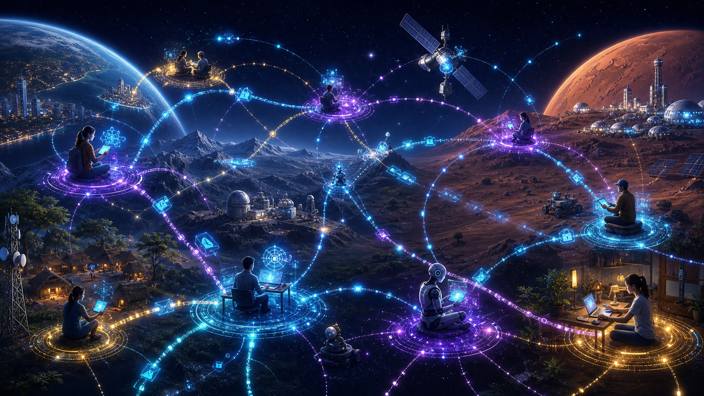
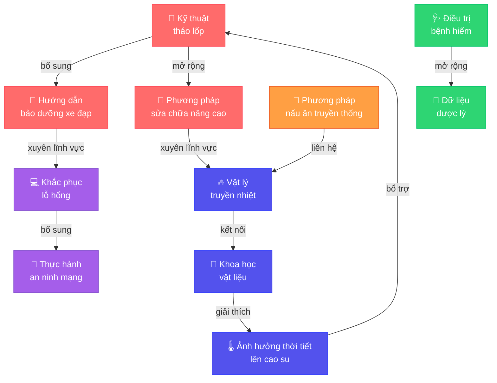
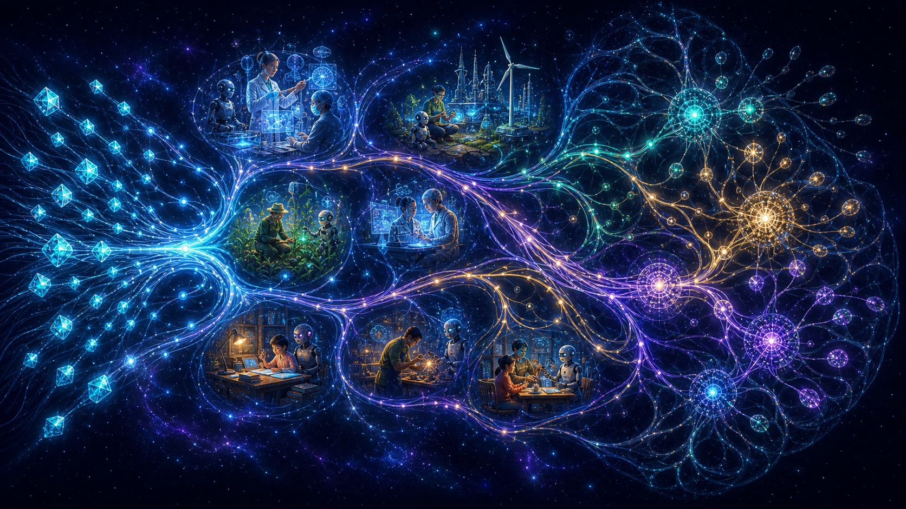
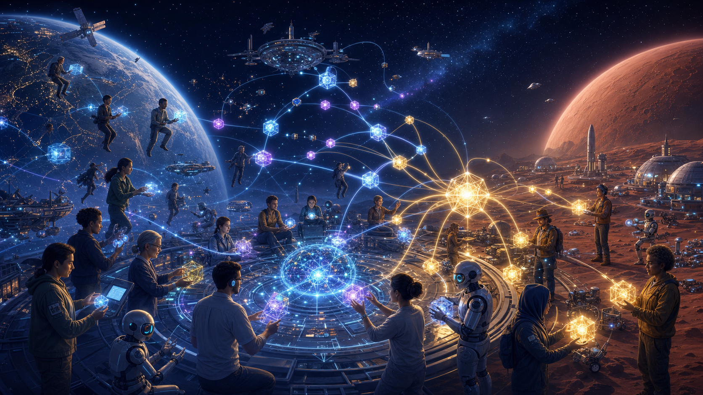
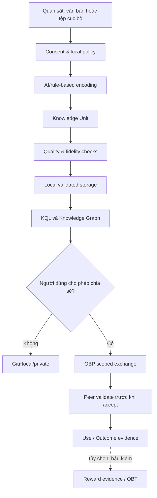
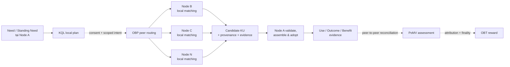

# 🧠 OneBrain

**Mạng tri thức phi tập trung dành cho con người và AI**

<p align="center">
  
</p>

> **Nếu máy móc có thể chia sẻ điều chúng học được gần như tức thời, tại sao tri thức của con người vẫn bị cô lập trong từng bộ não, tổ chức và ngôn ngữ?**

OneBrain là một dự án mã nguồn mở nhằm xây dựng **lớp tri thức chung, phi tập trung và có thể kiểm chứng** cho con người, Personal AI và các thiết bị trong tương lai.

Dự án mã hóa tri thức thành những **Knowledge Unit (KU)** nhỏ gọn, có định danh nội dung, ngữ nghĩa, nguồn gốc và trạng thái nhận thức. Các KU có thể được lưu cục bộ, truy vấn, kết nối thành đồ thị và trao đổi giữa những node ngang hàng mà không cần một máy chủ trung tâm giữ vai trò nguồn chân lý.

> [!IMPORTANT]
> OneBrain hiện là một dự án nghiên cứu và kỹ thuật đang phát triển. KU local, KQL, lưu trữ, AI qua Ollama, CLI, API, Web và Desktop đã có đường chạy thực tế. OBP vNext, PoMV phân tán, OBT vận hành và BCI vẫn đang ở các mức tích hợp, thử nghiệm hoặc nghiên cứu khác nhau. Dự án chưa phải mainnet hay một hệ thống tài chính hoàn chỉnh.

Ngày nay, một vấn đề lớn có thể cần hàng nghìn con người ở nhiều lĩnh vực, nhưng tri thức của họ vẫn bị ngăn cách bởi tổ chức, ngôn ngữ, định dạng dữ liệu và thời gian. Hãy hình dung nếu mỗi người không còn phải bắt đầu từ con số không; nếu một phát hiện nhỏ ở nơi này có thể gặp đúng câu hỏi ở nơi khác; nếu hàng triệu bộ não độc lập có thể cùng suy nghĩ về một vấn đề mà không phải giao quyền kiểm soát cho một “siêu não” trung tâm.

Đó là tương lai OneBrain muốn góp phần kiến tạo: **mỗi bộ não là một node tự chủ, nhưng toàn mạng có thể học hỏi và giải quyết vấn đề như một bộ não chung của nhân loại**.

---

## Mục lục

- [OneBrain là gì?](#onebrain-là-gì)
- [Nguồn gốc của dự án](#nguồn-gốc-của-dự-án)
- [Vì sao OneBrain cần được xây dựng ngay bây giờ?](#vì-sao-onebrain-cần-được-xây-dựng-ngay-bây-giờ)
- [Tầm nhìn](#tầm-nhìn)
- [Mục tiêu](#mục-tiêu)
- [Những nguyên tắc cốt lõi](#những-nguyên-tắc-cốt-lõi)
- [Các khái niệm nền tảng](#các-khái-niệm-nền-tảng)
- [Kiến trúc 10 trụ cột](#kiến-trúc-10-trụ-cột)
- [OneBrain hoạt động như thế nào?](#onebrain-hoạt-động-như-thế-nào)
- [OneBrain hiện làm được gì?](#onebrain-hiện-làm-được-gì)
- [Bắt đầu nhanh](#bắt-đầu-nhanh)
- [Cấu trúc mã nguồn](#cấu-trúc-mã-nguồn)
- [Tài liệu](#tài-liệu)
- [Lộ trình](#lộ-trình)
- [Lời mời cùng xây dựng OneBrain](#lời-mời-cùng-xây-dựng-onebrain)

---

## OneBrain là gì?

OneBrain không phải là một kho tài liệu tập trung, một mạng xã hội hỏi đáp hay một blockchain tài chính được đổi tên.

OneBrain hướng tới một **mạng tri thức sống**:

- Mỗi người và mỗi Personal AI có thể vận hành một node độc lập.
- Tri thức được lưu dưới dạng đối tượng có cấu trúc thay vì chỉ là văn bản dài.
- Mỗi mảnh tri thức có định danh nội dung, nguồn gốc, bằng chứng và quan hệ với các mảnh khác.
- Node vẫn có thể ghi nhớ, tìm kiếm và tạo tri thức khi offline hoặc khi mạng bị phân mảnh.
- Khi các node gặp lại nhau, chúng đối soát và hợp nhất phần tri thức phù hợp mà không cần một trung tâm quyết định chân lý.
- AI hỗ trợ quan sát, mã hóa, truy hồi và đề xuất; AI không mặc nhiên được trao quyền xuất bản hay thay người dùng quyết định.

Mục tiêu cuối cùng không phải tạo ra một “bộ não duy nhất” kiểm soát mọi người. Đó là tạo ra **một năng lực nhận thức chung**, được hình thành từ nhiều bộ não và nhiều AI vẫn giữ quyền tự chủ của riêng mình.

---

## Nguồn gốc của dự án

OneBrain bắt đầu từ một nghịch lý đơn giản.

Một mô hình AI có thể được cập nhật và triển khai cho hàng triệu máy. Một robot học được thao tác mới có thể truyền kết quả cho cả đội. Nhưng khi một con người khám phá ra một mẹo hữu ích, giải được một vấn đề khó hoặc chứng kiến một hiện tượng hiếm, tri thức đó thường chỉ tồn tại trong trí nhớ cá nhân, một nhóm nhỏ, một ngôn ngữ hoặc một tài liệu không ai tìm thấy.

Phần lớn tri thức của nhân loại không biến mất vì nó sai. Nó biến mất vì:

- người biết không có cách diễn đạt hoặc chia sẻ thuận tiện;
- người cần không biết ai đang sở hữu mảnh ghép phù hợp;
- các hệ thống hiện tại ưu tiên nội dung hoàn chỉnh, nổi tiếng hoặc dễ tìm kiếm;
- tri thức đời thường bị xem là quá nhỏ để ghi lại;
- nghiên cứu dở dang không gặp được mảnh ghép bổ sung;
- ngôn ngữ, địa lý, tổ chức và thời gian chia cắt những người có thể giúp nhau.

### Tri thức không có gì cao siêu

Với OneBrain, tri thức không chỉ là công thức khoa học hay phát minh lớn. Tri thức còn có thể là:

- một mẹo tháo lốp xe nhanh hơn;
- cách xử lý một lỗi phần mềm hiếm;
- kinh nghiệm chăm sóc cây trong một loại đất cụ thể;
- bí quyết nấu ăn được truyền qua nhiều thế hệ;
- một quan sát chưa thể giải thích;
- một giả thuyết mới chỉ đúng một phần;
- một thất bại giúp người khác tránh lặp lại sai lầm.

### Tri thức trùng lặp vẫn có giá trị

Hai người cùng mô tả một kỹ thuật không tạo ra hai bản sao vô nghĩa. Họ có thể mang đến góc nhìn, điều kiện, công cụ, bằng chứng và giới hạn khác nhau. Nhiều quan sát độc lập còn giúp hệ thống hiểu khi nào một tri thức hữu ích, khi nào nó không còn đúng và nó liên quan đến điều gì.

### Tri thức dở dang là lời mời cộng tác

Một nhà nghiên cứu có thể thiếu dữ liệu. Một kỹ sư có thể có dữ liệu nhưng không biết nó giải được bài toán nào. Một người thợ có thể quan sát một hiện tượng mà giới học thuật chưa từng đo trong bối cảnh thực tế.

OneBrain được sinh ra từ niềm tin rằng **không ai phải hoàn thiện một mình**. Mỗi người chỉ cần đóng góp mảnh ghép mình có; hệ thống phải giúp những mảnh ghép phù hợp tìm thấy nhau.

---

## Vì sao OneBrain cần được xây dựng ngay bây giờ?

Trong phần lớn lịch sử, công cụ giúp con người mạnh hơn nhưng không tự học, tự suy luận hay tự hành động. AI và robot đang thay đổi điều đó. Chúng có thể học, sao chép kỹ năng và phối hợp với tốc độ vượt xa một cá nhân. Đây có thể là bước nhảy vọt lớn nhất của văn minh — đồng thời cũng đặt ra câu hỏi quan trọng nhất của thế hệ chúng ta:

> **Khi trí tuệ máy móc phát triển nhanh hơn từng con người, nhân loại sẽ cùng tiến hóa với nó, hay dần phụ thuộc vào những hệ thống mà mình không còn hiểu và kiểm soát?**

Vấn đề không nằm ở việc AI trở nên thông minh. Nguy cơ xuất hiện khi tri thức của hàng tỷ con người vẫn phân mảnh, trong khi năng lực AI và quyền truy cập dữ liệu tập trung vào một số ít nền tảng. Một cá nhân không thể cạnh tranh với máy móc bằng tốc độ tính toán hay dung lượng nhớ. Nhưng nhân loại sở hữu điều không một hệ thống đơn lẻ nào có: hàng tỷ cuộc đời, góc nhìn, nền văn hóa, kinh nghiệm thực địa, hệ giá trị và khả năng chịu trách nhiệm.

Nếu những năng lực đó tiếp tục bị cô lập, chúng là những mảnh nhỏ rời rạc. Nếu chúng có thể kết nối mà không đánh mất quyền tự chủ, chúng trở thành một **trí tuệ tập thể có sức cân bằng với bất kỳ hệ AI tập trung nào**.

<p align="center">
  
</p>

<p align="center"><i>Không phải con người chống lại máy móc — mà là con người có đủ năng lực để cùng AI định hình tương lai.</i></p>

OneBrain chọn con đường cộng sinh. Personal AI và robot có thể trở thành những cộng sự mạnh mẽ, nhưng chúng tham gia mạng với identity, capability, provenance và giới hạn quyền hạn có thể kiểm chứng. AI có thể quan sát, mã hóa, tìm kiếm và đề xuất; nó không mặc nhiên trở thành nguồn chân lý, không âm thầm xuất bản thay người dùng và không nắm quyền kiểm soát ký ức chung.

Vì vậy, OneBrain là một **công cuộc chuẩn bị cho tương lai của nhân loại**. Chúng ta cần đặt nền móng cho một hạ tầng nhận thức mở trước khi giao diện tới tri thức, AI và BCI bị khóa trong những hệ sinh thái độc quyền. Mục tiêu không phải giữ con người đứng yên trước tiến bộ, mà giúp loài người tiến lên cùng AI trong khi vẫn giữ tay trên vô-lăng.

Đây không phải công việc của riêng một công ty, một quốc gia hay một nhóm lập trình viên. Những giao thức định hình quyền tự chủ nhận thức của các thế hệ sau phải được xây dựng công khai, phản biện bởi nhiều ngành và thuộc về tất cả mọi người.

---

## Tầm nhìn

### Từ những bộ não phân tán đến một năng lực nhận thức chung

OneBrain hình dung một mạng lưới nơi mỗi con người, Personal AI và thiết bị là một node nhận thức độc lập. Mỗi node có ký ức, góc nhìn, quyền riêng tư và quyền tự quyết riêng; không ai phải giao toàn bộ dữ liệu hay bản sắc của mình cho một máy chủ trung tâm.

Khi một vấn đề xuất hiện, mạng OBP có thể giúp vấn đề đó tìm đến đúng tri thức, đúng chuyên gia và đúng AI. Những node phù hợp có thể hình thành một **assembly nhận thức tạm thời**: chia sẻ các mảnh ghép cần thiết, kiểm chứng lẫn nhau, tạo giả thuyết và hợp nhất kết quả. Assembly giải tán khi nhiệm vụ kết thúc, nhưng tri thức được chứng minh có thể ở lại để toàn mạng tiếp tục học.

Đó không phải là một “hive mind” xóa nhòa cá nhân. Đó là **một bộ não chung được tạo nên từ nhiều bộ não vẫn hoàn toàn tự chủ** — giống như các neuron có thể phối hợp tạo nên tư duy, nhưng ở quy mô con người, AI và cuối cùng là cả một nền văn minh.

> **Một người có thể không sở hữu toàn bộ lời giải. Nhưng cả mạng lưới có thể đưa những mảnh lời giải tìm thấy nhau.**

### KQL trên OBP — để nhu cầu tự tìm đến tri thức

> **KQL không đưa mọi tri thức về một nơi; nó đưa nhu cầu đến đúng nơi tri thức đang sống.**

Trong đích đến OBP vNext, một câu hỏi — hoặc một **Standing Need** tồn tại lâu dài — được xử lý local-first. Chỉ khi người dùng cho phép, node mới gửi một biểu diễn tối thiểu của nhu cầu qua các peer. Mỗi peer tự matching trên kho và đồ thị cục bộ, tự quyết định mức tiết lộ, rồi có thể trả về một KU, bằng chứng hoặc lời mời cộng tác từ chuyên gia, Personal AI hay robot phù hợp.

Không cần một chỉ mục trung tâm biết ai đang biết gì. Không node nào phải công khai toàn bộ vault để được tìm thấy. Một câu hỏi y học có thể gặp quan sát của bác sĩ ở quốc gia khác; một bài toán năng lượng có thể gặp dữ liệu từ robot trên Sao Hỏa; một giả thuyết dang dở có thể tiếp tục tìm mảnh ghép ngay cả khi người đặt câu hỏi đang offline.

Kết quả trả về là **candidate hoặc proposal có provenance và evidence**, không phải chân lý hay quyết định tự động. KQL có thể tìm và đề xuất; materialize, adopt, use và publish vẫn là những ranh giới riêng, cần consent và authority phù hợp.

**Trạng thái hiện tại:** KQL local đã chạy trong runtime sản phẩm. Typed matching, Standing Need, private multipath/disclosure và partition–reunion đã có ở foundation vNext và test harness; định tuyến query ngang hàng qua OBP chưa phải đường live end-to-end mặc định.

### BCI — cánh cổng giữa tư duy và mạng tri thức

<p align="center">
  
</p>

Giao diện não–máy tính (BCI) đang tiến từ phòng thí nghiệm đến những ứng dụng đầu tiên trong giao tiếp, vận động và phục hồi chức năng. Trong tương lai gần, khi BCI trở nên đủ an toàn, chính xác và phổ biến, OneBrain hướng tới việc để con người kết nối trực tiếp với mạng OBP bằng ý định — tìm kiếm, đóng góp và tiếp nhận tri thức mà không bị giới hạn bởi bàn phím hay màn hình.

Hình ảnh **Neo học một kỹ năng trong _The Matrix_** là phép ẩn dụ dễ hiểu cho đích đến dài hạn: một ngày nào đó, việc tiếp nhận một cấu trúc tri thức mới có thể trực tiếp và tự nhiên hơn rất nhiều so với cách chúng ta học hiện nay. Nhưng để đi từ phép ẩn dụ đến hiện thực, khoa học còn phải giải quyết những bài toán cực khó: giải mã ý định, biểu diễn tri thức thần kinh, khả năng ghi có chọn lọc, tính toàn vẹn, consent, khả năng đảo ngược và an toàn lâu dài.

OneBrain không tuyên bố những bài toán đó đã được giải. Dự án muốn chuẩn bị **knowledge protocol, identity, provenance, permission và safety boundary** từ hôm nay, để nếu neural I/O trưởng thành, con người có một mạng tri thức mở và do chính mình kiểm soát để kết nối vào — thay vì một cánh cổng độc quyền thuộc về một công ty.

### Không gian tri thức và bước tiến hóa tiếp theo

Nhân loại từng tổ chức xã hội quanh đất đai, rồi máy móc, năng lượng và thông tin. OneBrain tin rằng tầng nền tiếp theo sẽ là **không gian tri thức**: một môi trường sống nơi tri thức có thể được định danh, liên kết, kiểm chứng, tái sử dụng và chuyển hóa liên tục giữa con người với AI.

Khi đó, tiến hóa không chỉ còn là thay đổi sinh học qua nhiều thế hệ. Năng lực của một cá nhân và cộng đồng có thể tăng lên nhờ khả năng kết nối với kho kinh nghiệm chung, tìm đúng mảnh ghép và cộng tác ở tốc độ chưa từng có. Một đứa trẻ không chỉ thừa hưởng gene và tài sản; em còn có thể bước vào một không gian tri thức sống, nơi kinh nghiệm đã được kiểm chứng của nhiều thế hệ luôn sẵn sàng để tiếp tục phát triển.

OneBrain muốn đặt một viên gạch nền cho bước tiến hóa ấy — không thay thế bộ não con người, không hòa tan cá nhân vào máy móc, mà mở rộng khả năng để các bộ não **cùng nhớ, cùng học, cùng sáng tạo và cùng bảo vệ tương lai của mình**.

### OBT — đơn vị giá trị của nền kinh tế tri thức

Các nền kinh tế trước đây định giá chủ yếu từ hàng hóa khan hiếm, tài nguyên và sức lao động. Nhưng khi AI và robot đảm nhiệm ngày càng nhiều lao động vật chất lẫn trí óc lặp lại, những thước đo cũ sẽ không còn đủ để phân phối giá trị. Trong một nền văn minh nơi tri thức là hạ tầng sản xuất quan trọng nhất, người tạo ra một phát hiện, kiểm chứng một giả thuyết, kết nối hai mảnh ghép hoặc lưu giữ tri thức cho cộng đồng cũng cần được ghi nhận bằng giá trị có thể chuyển giao.

**OneBrain Token (OBT)** được hình dung như đơn vị thanh toán gốc của nền kinh tế kế tiếp của nhân loại: giá trị được tạo ra từ tri thức đã chứng minh tác dụng, thay vì từ quyền kiểm soát tri thức. Nếu Internet làm thông tin có thể truyền đi, OBT hướng tới làm cho lợi ích do tri thức tạo ra có thể được chứng minh, quy công và quyết toán — để giá trị quay trở lại những người và hệ thống đã thực sự giúp tri thức tạo nên tác động.

OBT hướng tới khả năng hoạt động xuyên biên giới, xuyên nền tảng và cuối cùng xuyên hành tinh. Một đơn vị OBT không bị giao thức định nghĩa lại chỉ vì chủ sở hữu đang ở Trái Đất, trên quỹ đạo hay Sao Hỏa; cùng các quy tắc định danh, phát hành và quyết toán phải có thể được kiểm chứng ở mọi nơi mạng tồn tại.

Khoảng cách liên hành tinh đặt ra độ trễ lớn, partition dài hạn và khác biệt thị trường địa phương, nên sức mua thực tế có thể khác nhau. Thách thức của OneBrain là giữ cho **định danh, quyền sở hữu, quy tắc phát hành và giá trị quyết toán của OBT nhất quán** dù các khu vực của mạng phải hoạt động tự chủ trong thời gian dài.

Đây là tầm nhìn giao thức, không phải cam kết đầu tư hay mô tả một đồng tiền đã vận hành. OBT hiện vẫn là prototype; tri thức phải tồn tại độc lập, còn reward chỉ được tạo sau bằng chứng về lợi ích thực.

---

## Mục tiêu

### Mục tiêu kỹ thuật

- Xây dựng định dạng Knowledge Unit nhỏ gọn, có thể xác định nội dung và độc lập với cách trình bày.
- Cung cấp ngôn ngữ truy vấn tri thức có kiểu, có giới hạn và có thể giải thích.
- Đưa KQL từ truy vấn local đến discovery ngang hàng qua OBP mà không cần global index hoặc công khai toàn bộ query intent.
- Cho phép node hoạt động độc lập, chịu được phân mảnh và hội tụ khi tái kết nối.
- Tách rõ ngữ nghĩa, quyền hạn, khả dụng, danh tiếng và phần thưởng.
- Bảo vệ query intent, dữ liệu quan sát và tri thức riêng tư bằng disclosure policy và local vault.
- Xây dựng đồ thị tri thức có khả năng tiến hóa theo bằng chứng, thời gian và mức sử dụng.
- Đưa PoMV thành lớp bằng chứng ngang hàng: use, derivation và outcome có nguồn gốc, có thể đối soát mà không tạo một điểm chân lý toàn cầu.
- Xây chuỗi Benefit → Attribution → RewardClaim → Finality để OBT chỉ được tạo sau lợi ích có thể kiểm chứng.
- Cung cấp các giao diện dùng chung: CLI, REST/WebSocket API, Web và Desktop.

### Mục tiêu xã hội

- Giảm lượng tri thức hữu ích bị thất lạc.
- Giúp tri thức đời thường được ghi nhận ngang hàng với tri thức chuyên môn.
- Tạo điều kiện để các mảnh nghiên cứu dở dang tìm được người và dữ liệu bổ sung.
- Giữ Personal AI dưới quyền kiểm soát của người dùng.
- Xây dựng một commons tri thức mở mà không biến một tổ chức trung tâm thành người gác cổng.
- Tạo nền móng để nhiều bộ não phân tán có thể phối hợp giải quyết những vấn đề vượt quá năng lực của bất kỳ cá nhân hay tổ chức đơn lẻ nào.
- Chuẩn bị một knowledge plane mở cho thời đại BCI và cho một nền văn minh có thể mở rộng ra ngoài Trái Đất.

### Những điều OneBrain không muốn trở thành

- Một nguồn chân lý toàn cầu do một bên kiểm soát.
- Một hệ thống chấm điểm con người bằng một con số duy nhất.
- Một mạng buộc người dùng công khai dữ liệu riêng tư để được tham gia.
- Một token economy có quyền can thiệp ngược vào tính đúng đắn của tri thức.
- Một lời hứa BCI vượt quá bằng chứng khoa học hiện có.

---

## Những nguyên tắc cốt lõi

| Nguyên tắc | Ý nghĩa |
|---|---|
| **Local-first** | Node phải hữu ích khi offline; mạng mở rộng năng lực chứ không phải điều kiện để tồn tại. |
| **Không có root authority** | Seed hỗ trợ discovery/relay nhưng không cấp danh tính, finality hay chân lý. |
| **Content-addressed** | Nội dung xác định danh tính; thay đổi nội dung tạo ra định danh mới. |
| **Validate before accept** | Dữ liệu nhận từ mạng phải được kiểm tra trước khi trở thành tri thức có thể thực thi. |
| **Unknown không có nghĩa là false** | Thiếu bằng chứng được giữ là chưa biết, không bị ép thành đúng hoặc sai. |
| **Proposal không phải quyết định** | AI và KQL có thể đề xuất; materialize, adopt, use và publish là các ranh giới riêng. |
| **Consent không được suy diễn** | Quyền quan sát, định tuyến, chia sẻ và nhận thức từ xa phải được cấp rõ ràng. |
| **Exposure không phải use** | Việc một kết quả được hiển thị không tự động chứng minh nó hữu ích. |
| **Reward đi sau knowledge** | OBT chỉ được xử lý sau khi knowledge operation đã commit; reward không tạo authority. |
| **Partition autonomy** | Một “đảo” mạng vẫn là OneBrain hợp lệ và có thể hội tụ khi gặp lại phần còn lại. |

---

## Các khái niệm nền tảng

### Knowledge Unit — KU

KU là đơn vị tri thức cơ bản của OneBrain. Kiến trúc KU hiện tại gồm ba lớp:

```text
CoreDna                 Epigenetics                    Expression
Ngữ nghĩa lõi      +    bằng chứng, trust, bonds   +   cách trình bày cho người
```

- **CoreDna** biểu diễn cấu trúc ngữ nghĩa và các instruction.
- **Epigenetics** lưu trạng thái có thể tiến hóa: bằng chứng, quan hệ, độ tin cậy và tín hiệu sử dụng.
- **Expression** giữ cách diễn đạt bằng ngôn ngữ tự nhiên hoặc định dạng phục vụ giao diện.

### OneBrain Protocol — OBP Network

<p align="center">
  
</p>

<p align="center"><i>Mỗi node giữ quyền tự chủ; mạng mở rộng khả năng tiếp cận tri thức chứ không tạo ra một trung tâm quyền lực mới.</i></p>

OBP là lớp giao tiếp giúp các node độc lập tìm thấy nhau, thương lượng capability, trao đổi inventory, đối soát khác biệt và truyền đúng phần tri thức được phép chia sẻ. Mạng được thiết kế để tiếp tục hoạt động khi offline, bị partition hoặc phải đi qua carrier có độ trễ lớn; khi kết nối trở lại, các node hội tụ bằng evidence và validation thay vì tin vào một root authority.

**Trạng thái hiện tại:** live node vẫn sử dụng TCP/JSON legacy cho kết nối peer cơ bản. Authenticated session, scoped inventory, reconciliation journal, partition–reunion và các carrier vNext đã có ở protocol/library/test harness nhưng chưa thay thế transport mặc định end-to-end.

### Receptor, Affordance, Assembly và Mapping

Foundation vNext mở rộng mô hình KU bằng bốn khái niệm:

- **Receptor** mô tả một “vị trí còn thiếu” hoặc một nhu cầu tri thức có kiểu.
- **Affordance** mô tả một KU có thể đóng vai trò gì, với input và giới hạn nào.
- **Assembly** gom nhiều Receptor thành một cấu trúc tri thức lớn hơn.
- **Mapping** mô tả cách một nguồn tri thức có thể tương ứng với một Receptor.

KQL có thể tạo proposal cho Mapping, nhưng proposal không tự trở thành tri thức chính thức. Materialization và adoption cần những hành động, quyền hạn và bằng chứng riêng.

### OneBrain Knowledge Graph — OBKG

Tri thức trong OneBrain không được tổ chức thành một chuỗi tuyến tính. Nó hình thành một **đồ thị sống**, nơi mỗi mảnh tri thức có thể kết nối với nhiều mảnh khác theo những quan hệ có kiểu:

- **Node** đại diện cho Knowledge Unit, khái niệm hoặc projection đã được kiểm tra.
- **Edge** mô tả quan hệ như bổ sung, ủng hộ, phản biện, mở rộng, phụ thuộc, dẫn xuất hoặc liên kết xuyên lĩnh vực.



<p align="center">
  
</p>

<p align="center"><i>Một đóng góp nhỏ có thể trở thành cây cầu giữa những miền tri thức tưởng như không liên quan.</i></p>

Đồ thị cho phép OneBrain:

- 🔍 tìm tri thức liên quan dựa trên cấu trúc và ngữ cảnh, không chỉ từ khóa;
- 🧩 phát hiện những “khoảng trống tri thức” dưới dạng Receptor cần được lấp đầy;
- 🌐 kết nối các phát hiện xuyên lĩnh vực để tạo ra Assembly và giả thuyết mới;
- 🔗 giải thích vì sao một KU được đề xuất, nó phụ thuộc vào đâu và bằng chứng nào đang ủng hộ hoặc phản biện nó;
- 🧠 cung cấp ngữ cảnh cho KQL, Personal AI và quá trình đánh giá PoMV.

OBKG không phải một bản đồ chân lý bất biến. Các projection được dựng từ object và evidence đã validate; quan hệ có thể được bổ sung, phản biện hoặc thay đổi theo frontier và policy của từng node. Hai node có thể nhìn thấy những phần đồ thị khác nhau mà vẫn trao đổi và hội tụ khi có consent.

**Trạng thái hiện tại:** graph index, graph browsing và KQL local đã hoạt động trong runtime. Foundation vNext đã có projection, mapping, resolution và các contract liên quan; graph gossip, distributed learning và discovery xuyên mạng chưa phải đường live end-to-end mặc định.

### Proof of Metabolic Value — PoMV

<p align="center">
  
</p>

<p align="center"><i>Giá trị của tri thức không đến từ độ nổi tiếng, mà từ những dấu vết cho thấy nó đã được sử dụng, chuyển hóa và tạo ra kết quả.</i></p>

PoMV không hỏi “tri thức nào nổi tiếng nhất?” mà hỏi “tri thức nào thực sự sống, được sử dụng và tạo ra kết quả?”. Framework đánh giá sáu nhóm tín hiệu quan sát được:

1. Mức sử dụng và chuyển hóa.
2. Khả năng dự đoán.
3. Tính mới và entropy.
4. Khả năng tồn tại trước phản biện/thời gian.
5. Vị trí và hoạt hóa trong đồ thị.
6. Giá trị đối với một niche cụ thể.

Đích đến của PoMV là một **lớp bằng chứng ngang hàng cho mạng tri thức**. Các dấu vết sử dụng, chuyển hóa và outcome được ký, gắn provenance, ngữ cảnh và giới hạn; chúng có thể được đối soát giữa những peer để mỗi node dựng assessment theo policy và frontier của mình. Không node nào sở hữu một điểm chân lý toàn cầu, và đa số không thể bỏ phiếu để biến điều sai thành đúng.

Evidence được quyền tồn tại ngang hàng không có nghĩa mọi evidence có trọng lượng như nhau. Authority, independence, context, contradiction và limitation vẫn phải được đánh giá. Exposure không phải Use; Use không tự chứng minh Benefit; PoMV không phải mint authority.

PoMV hiện là một **assessment framework** ở cấp thư viện và local runtime; các contract Use/Derivation/Outcome/Benefit đã có ở foundation vNext, nhưng distributed evidence flow chưa được tích hợp end-to-end vào mạng sản phẩm.

### OneBrain Token — OBT

<p align="center">
  
</p>

<p align="center"><i>Tri thức tạo ra lợi ích; bằng chứng xác nhận đóng góp; giá trị quay trở lại những người và hệ thống đã làm nên tác động.</i></p>

OBT được thiết kế như lớp điều phối kinh tế hậu kiểm cho đóng góp, mã hóa, xác minh và lưu trữ tri thức. Thiết kế hiện có account-chain, bốn reward stream, anti-gaming, penalty và storage reward. Mục tiêu dài hạn là tạo một đơn vị giá trị dựa trên tri thức có ích, có thể được sở hữu và quyết toán nhất quán ở bất kỳ nơi nào OBP hoạt động.

Trên mạng tương lai, reward không bắt đầu từ một lượt đăng hay lượt xem. Nó phải đi qua chuỗi bằng chứng **Use → Outcome → Benefit → Attribution → RewardClaim → PendingMint → Final OBT**. Các peer có thể kiểm tra claim và bằng chứng theo cùng contract; reward plane chỉ hoạt động sau knowledge operation và không có quyền sửa nội dung hay quyết định tri thức nào là đúng.

OBT hiện vẫn là protocol/economic prototype. Wallet trong ứng dụng chưa phải một mạng token có giao dịch và finality thực; OBT không phải sản phẩm đầu tư và không được dùng để quyết định tri thức nào là đúng.

---

## Kiến trúc 10 trụ cột

OneBrain tổ chức hệ thống theo 10 trụ cột. README này dùng một thứ tự thống nhất cho toàn dự án:

| # | Trụ cột | Vai trò | Thành phần chính |
|---:|---|---|---|
| **P1** | **Knowledge Unit — KU** | Định dạng và vòng đời của tri thức | `ku-core`, `ku-encoder` |
| **P2** | **OneBrain Protocol — OBP** | Identity, discovery, transport, inventory và reconciliation | `onebrain-protocol`, `ku-net`, `onebrain-node`, `onebrain-seed` |
| **P3** | **Knowledge Query Language — KQL** | Truy vấn local-first, discovery ngang hàng, planning và Standing Need | `ku-kql` |
| **P4** | **Proof of Metabolic Value — PoMV** | Bằng chứng use/outcome ngang hàng, assessment và epistemic lifecycle | `ku-core` |
| **P5** | **OneBrain Token — OBT** | Nền kinh tế tri thức, ledger, reward và anti-gaming | `ku-core`, `ku-net` |
| **P6** | **AI Layer** | Local AI, encoding, mediation và fidelity | `ku-ai`, `ku-encoder`, `ku-mediator` |
| **P7** | **OneBrain Knowledge Graph — OBKG** | Quan hệ, projection, graph learning và discovery | `ku-core`, `ku-kql` |
| **P8** | **OneBrain Storage — OBS** | KU, graph, blob, vault, quarantine và migration | `ku-core`, `ku-kql` |
| **P9** | **BCI Protocol** | Hướng nghiên cứu I/O thần kinh an toàn | Research / future adapters |
| **P10** | **User Interface** | CLI, API, Web, Desktop và các client tương lai | `onebrain-cli`, `onebrain-api`, `onebrain-web`, `onebrain-desktop` |


---

## OneBrain hoạt động như thế nào?

Một vòng đời tri thức điển hình:



Các bước không bị gộp vào nhau: encode không đồng nghĩa publish; proposal không đồng nghĩa materialize; materialize không đồng nghĩa adopt; một lần hiển thị không đồng nghĩa tri thức đã được sử dụng hay mang lại lợi ích.

### Đích đến kỹ thuật: một vòng nhận thức ngang hàng



Đây là **target architecture**, không phải mô tả rằng mọi cạnh trong sơ đồ đã chạy trên live network. Mỗi node vẫn tự quyết định dữ liệu nào được quan sát, query nào được phát, evidence nào được chấp nhận và proposal nào được sử dụng. “Toàn mạng” luôn có nghĩa là phần mạng có thể tiếp cận trong điều kiện partition hiện tại — không phải một lời hứa về global completeness hay đồng bộ tức thời.

---

## OneBrain hiện làm được gì?

### Đang chạy trong runtime sản phẩm

- Mã hóa văn bản thành KU thông qua Ollama.
- Lưu KU, graph index và blob bằng redb/filesystem.
- Tìm kiếm theo từ khóa, duyệt KU và thực thi KQL local.
- Xem chi tiết KU, instruction, trust, PoMV và các quan hệ graph hiện có.
- Chat với local AI khi Ollama và model đã sẵn sàng.
- Kết nối TCP peer thủ công, gửi/nhận KU và phát sự kiện runtime.
- Import/export, backup/restore và quản lý blob.
- Chạy node qua CLI hoặc API; sử dụng Web Dashboard và Tauri Desktop.

### Đã có ở foundation vNext và test harness

- Canonical codec, typed CID, full-width identity và signed event/feed.
- Authority, delegation, revocation và capability permits.
- Validated storage, encrypted Vault, Quarantine và rollback-safe migration.
- Receptor/Affordance/Assembly/Mapping workflow.
- Typed KQL matcher, structural alignment, assembly search và private multipath.
- Authenticated session, scoped inventory, persisted reconciliation journal và partition/reunion canary.
- Use/Derivation/Outcome/Benefit evidence và reward firewall.
- Checkpoint proofs, restore drill, local retention/GC policy và bounded formal models.

### Chưa phải đường production hoàn chỉnh

- Live node vẫn dùng TCP/JSON legacy; OBP vNext chưa thay transport mặc định.
- KQL trong runtime hiện truy vấn local; Standing Need, private multipath và discovery tri thức/chuyên gia qua OBP mới ở foundation vNext/test harness.
- Distributed PoMV/fidelity chưa được nối end-to-end.
- OBT wallet, transfer và finality chưa vận hành thực.
- Identity recovery và multi-device sync của giao diện còn chưa hoàn thiện.
- Dream/FedR/STDP orchestration chưa chạy thường trực trong node.
- Mobile, browser extension, bot và glasses mới ở mức scaffold.
- BCI mới là research direction.

### Giao diện hiện có

| Giao diện | Trạng thái | Khả năng chính |
|---|---|---|
| **CLI** | Hoạt động | Encode, search, KQL, graph, peer, blob, backup, tags, watch, workflow |
| **REST/WebSocket API** | Hoạt động local | API cho knowledge, AI, network, graph, data và runtime events |
| **Web Dashboard** | Hoạt động | Dashboard, Explorer, Encode, Chat, Graph, PoMV, Network, Files, Analytics... |
| **Desktop** | Hoạt động ở source | Tauri nhúng node/API, system tray, setup wizard và event bridge |
| **Mobile / Extension / Bot / Glasses** | Scaffold | Thiết kế và điểm tích hợp tương lai |

---

## Một vài kịch bản sử dụng

### Người thợ chia sẻ kinh nghiệm thực tế

Một người thợ xe đạp phát hiện cách tháo lốp nhanh hơn trong điều kiện thiếu dụng cụ. Personal AI giúp mô tả thao tác, điều kiện và giới hạn, sau đó tạo một KU. Những hướng dẫn tương tự không bị xóa như “duplicate”; chúng trở thành các quan sát bổ sung cho cùng một kỹ thuật.

### Nhóm nghiên cứu tìm thấy mảnh ghép còn thiếu

Một nhà nghiên cứu công bố giả thuyết chưa hoàn chỉnh. KQL có thể biểu diễn phần còn thiếu bằng Receptor, sau đó tìm những Affordance phù hợp từ các KU ở lĩnh vực khác. Hệ thống tạo proposal có giải thích; con người vẫn quyết định materialize và adopt kết nối đó.

### Personal AI hoạt động local-first

Personal AI quan sát hoặc đọc tài liệu theo consent, giữ dữ liệu gốc trong local Vault, tạo Need riêng tư và truy vấn kho local trước. Chỉ khi được cho phép, nó mới tạo route sketch tối thiểu để tìm tri thức từ các peer.

### Mạng bị chia cắt rồi tái hợp

Các nhóm node tiếp tục tạo và sử dụng tri thức trong thời gian mất kết nối. Khi có carrier hoặc bridge mới, chúng đối chiếu inventory theo scope, truyền manifest trước payload và chỉ accept dữ liệu đã validate. Không thành phần nào được phép tuyên bố toàn bộ mạng đã “đóng” hoặc hoàn tất tuyệt đối.

---

## Bắt đầu nhanh

### Yêu cầu

- Rust stable, Cargo và toolchain phù hợp hệ điều hành.
- Node.js/npm nếu muốn xây Web Dashboard.
- [Ollama](https://ollama.com/) và một model tương thích nếu muốn dùng AI encode/chat.

### Build workspace

```powershell
cd src
cargo build --workspace
```

### Chạy CLI node

```powershell
cd src
cargo run -p onebrain-cli -- start --name "My Brain"
```

Node vẫn có thể duyệt dữ liệu local khi Ollama hoặc mạng không sẵn sàng; các thao tác encode/chat bằng AI cần Ollama hoạt động.

### Chạy cùng Web Dashboard

```powershell
cd src/onebrain-web
npm ci
npm run build

cd ..
cargo run -p onebrain-cli -- start --api --web-dir onebrain-web/dist
```

Mở `http://127.0.0.1:4280`. API mặc định chỉ bind vào loopback.

### Kiểm tra mã nguồn

```powershell
cd src
cargo fmt --all -- --check
cargo check --workspace --locked
```

Kiểm tra contract vNext từ thư mục gốc:

```powershell
python scripts/ci/validate_vnext_contracts.py
```

> [!NOTE]
> Repo đang thay đổi nhanh. Một số integration test legacy có thể cần được cập nhật sau khi type/API vNext thay đổi. Hãy xem CI và issue hiện tại trước khi coi toàn bộ workspace test là release gate xanh.

---

## Cấu trúc mã nguồn

```text
OneBrain/
├── src/
│   ├── ku-core/              # KU, PoMV, OBT, OBKG và foundation vNext
│   ├── ku-kql/               # KQL local và typed discovery vNext
│   ├── ku-net/               # DHT, gossip, transport và reconciliation
│   ├── ku-ai/                # Local AI backends và model policies
│   ├── ku-encoder/           # Text/observation → KU/Receptor
│   ├── ku-mediator/          # Intent → retrieve → synthesize
│   ├── onebrain-protocol/    # Shared wire types và codec
│   ├── onebrain-node/        # Runtime dùng chung cho các giao diện
│   ├── onebrain-cli/         # CLI full node
│   ├── onebrain-api/         # Local REST/WebSocket API
│   ├── onebrain-desktop/     # Tauri Desktop
│   ├── onebrain-web/         # React/Vite Web Dashboard
│   └── onebrain-seed/        # Discovery/relay seed prototype
├── docs/
│   ├── specs/                # Đặc tả legacy và vNext
│   ├── research/             # Research baseline và implementation plan
│   ├── paper/                # Các paper theo trụ cột
│   └── features/             # Feature tree và feature details
├── formal/tla/               # Các bounded formal model TLA+
├── scripts/                  # Contract validation và Concept Registry tools
├── installer/                # Build/install scripts
└── release/                  # Các artifact phát hành
```

---

## Tài liệu

| Tài liệu | Nội dung |
|---|---|
| [Tổng quan kỹ thuật](docs/README.md) | Crate, module và liên kết code ↔ spec |
| [Research Baseline v7.1](docs/research/ONEBRAIN_RESEARCH_BASELINE_V7_1.md) | Nền tảng nghiên cứu và các quyết định kiến trúc |
| [Foundation Implementation Plan](docs/research/ONEBRAIN_FOUNDATION_IMPLEMENTATION_PLAN_V7_1.md) | Milestone, task, gate và evidence |
| [vNext Foundation Contracts](docs/specs/vnext/README.md) | Contract canonical, identity, storage, KQL, OBP, AI và security |
| [Feature Tree](docs/features/FEATURE_TREE.md) | Bản đồ tính năng của hệ thống |
| [UI Feature Tree](docs/features/UI_FEATURE_TREE_DETAIL.md) | Tính năng và hành trình người dùng trên các nền tảng |
| [Formal Models](formal/tla/README.md) | Checkpoint, resolution, lease, revocation và reconciliation |
| [Contributing Guide](CONTRIBUTING.md) | Cách tham gia phát triển dự án |

---

## Lộ trình

### Giai đoạn 1 — Foundation

- Chuẩn hóa KU, typed identity, object/event/feed và storage boundary.
- Hoàn thiện local KU/KQL/AI vertical slice.
- Đóng băng contract vNext và evidence gates.

### Giai đoạn 2 — Runtime integration

- Nối foundation vNext vào `OneBrainNode` sau feature flag/canary.
- Thay live TCP demo bằng authenticated OBP reconciliation.
- Nối KQL Standing Need với OBP scoped routing, peer-local matching và evidence-bearing proposal.
- Hoàn thiện identity, persistence và multi-device semantics.
- Bổ sung end-to-end test cho node, seed, API, Web và Desktop.

### Giai đoạn 3 — Open network

- Vận hành test network qua nhiều carrier và điều kiện partition thực tế.
- Hoàn thiện provider discovery, reconciliation, fidelity và observability.
- Kiểm chứng discovery không cần global index với privacy budget, partial coverage và partition–reunion.
- Đưa Use/Derivation/Outcome evidence vào luồng đối soát PoMV ngang hàng.
- Mở rộng Personal AI SDK và client đa nền tảng.

### Giai đoạn 4 — Knowledge economy

- Xây Benefit/Attribution/RewardClaim có bằng chứng.
- Hoàn thiện OBT ledger, transfer, challenge và partition-safe finality.
- Vận hành thử nền kinh tế tri thức trên test network với reward có thể audit và chống đầu cơ thao túng authority.
- Giữ reward plane tách khỏi knowledge authority.

### Giai đoạn 5 — BCI readiness

- Xây BCI adapter và safety model khi có bằng chứng khoa học phù hợp.
- Ưu tiên intent input, communication restoration và sensory feedback.
- Không triển khai semantic neural write nếu chưa chứng minh consent, integrity và reversibility.

### Giai đoạn 6 — Interplanetary knowledge commons

- Thử nghiệm OBP trên carrier có độ trễ cao và partition dài giữa Trái Đất, quỹ đạo, Mặt Trăng và Sao Hỏa.
- Giữ identity, KU provenance và OBT claim có thể kiểm chứng mà không cần một kết nối liên hành tinh liên tục.
- Xây một không gian tri thức nơi cộng đồng ở mỗi thế giới có thể tự chủ nhưng vẫn tái hợp được với phần còn lại của nhân loại.

---

## Lời mời cùng xây dựng OneBrain

> **Chúng ta không chỉ đang xây một sản phẩm. Chúng ta đang lựa chọn xem hạ tầng nhận thức của tương lai sẽ thuộc về một số ít hệ thống đóng — hay thuộc về nhân loại.**

Internet đã kết nối máy tính. OneBrain muốn giúp kết nối tri thức mà vẫn bảo toàn con người đứng phía sau tri thức đó. Nếu làm đúng, đây có thể là một phần nền móng để loài người cộng tác ở quy mô hành tinh, phát triển cân bằng cùng AI và bước vào thời đại BCI mà không đánh đổi quyền tự chủ nhận thức.

Nếu làm sai — hoặc không bắt đầu đủ sớm — tương lai đó có thể được định nghĩa hoàn toàn bởi những giao thức độc quyền mà công chúng không có quyền kiểm tra, thay đổi hay rời bỏ. Vì thế **mã nguồn mở ở đây không chỉ là mô hình phát triển; nó là một yêu cầu đạo đức**.

OneBrain không thể và không nên được xây dựng chỉ bởi một nhóm kỹ sư phần mềm. Để biến tầm nhìn này thành hạ tầng đáng tin cậy cho nhân loại, dự án cần những người hiểu sâu về bộ não, tri thức, hệ phân tán, kinh tế và xã hội — đặc biệt là những người sẵn sàng chỉ ra điều dự án đang hiểu sai.

| Nếu bạn là… | Những bài toán OneBrain cần bạn cùng giải |
|---|---|
| **Nhà khoa học thần kinh / chuyên gia BCI** | Neural intent, safe read/write, consent, reversibility và giới hạn sinh học thực tế. |
| **Nhà nghiên cứu AI** | Personal AI, knowledge encoding, semantic fidelity, reasoning có nguồn gốc và human-in-the-loop. |
| **Chuyên gia distributed systems** | Reconciliation, Byzantine resistance, partition autonomy và mạng có độ trễ liên hành tinh. |
| **Chuyên gia mật mã / an toàn thông tin** | Identity, capability, selective disclosure, private query và chống chiếm quyền nhận thức. |
| **Nhà kinh tế học / game theorist** | PoMV, attribution, OBT, anti-gaming và nền kinh tế tri thức không biến thành đầu cơ. |
| **Nhà tri thức học / knowledge graph** | Biểu diễn uncertainty, provenance, contradiction, context và sự tiến hóa của tri thức. |
| **Chuyên gia trong mọi lĩnh vực** | Định nghĩa thế nào là tri thức hữu ích, bằng chứng đáng tin và giá trị thực trong domain của bạn. |
| **Kỹ sư sản phẩm / nhà thiết kế** | Biến một kiến trúc phức tạp thành trải nghiệm mà bất kỳ ai cũng có thể sử dụng và kiểm soát. |

OneBrain đang ở giai đoạn mà một contract đúng, một phản ví dụ tốt, một bộ dữ liệu thật hoặc một nguyên tắc an toàn được đặt ra hôm nay có thể định hình nhiều năm phát triển sau này. Đây là thời điểm chuyên môn của bạn tạo ra ảnh hưởng lớn nhất.

Bạn không cần tin rằng toàn bộ viễn cảnh sẽ xuất hiện ngay ngày mai. Bạn chỉ cần tin rằng tri thức của nhân loại có thể được tổ chức tốt hơn hôm nay — và một phần hiểu biết của bạn có thể giúp chúng ta tiến thêm một bước.

- Bắt đầu từ [CONTRIBUTING.md](CONTRIBUTING.md) và chọn một vấn đề phù hợp với chuyên môn của bạn.
- Đọc spec liên quan trước khi thay đổi public type, wire format hoặc authority boundary.
- Đưa vào dự án test, dữ liệu, phản biện và bằng chứng — không chỉ mã nguồn.
- Tuân thủ [CODE_OF_CONDUCT.md](CODE_OF_CONDUCT.md).
- Không biến OBT, seed hoặc bất kỳ AI model nào thành nguồn chân lý của knowledge plane.

Nếu bạn muốn công trình của mình không chỉ giải quyết một ticket, mà góp phần giúp nhân loại **cùng học nhanh hơn, đứng vững hơn trước thay đổi và đi xa hơn khỏi Trái Đất**, hãy bắt đầu một discussion, mở issue, gửi pull request hoặc liên hệ **shpy2001@gmail.com**.

> **OneBrain cần người viết code. Nhưng hơn hết, OneBrain cần những người sẵn sàng đặt chuyên môn của mình vào một mục tiêu lớn hơn chính dự án: tương lai tự chủ, cộng tác và tiến hóa của loài người.**

---

## Tuyên ngôn

> **Tri thức là sức mạnh. Tri thức được chia sẻ là sức mạnh được nhân lên.**
>
> Mỗi bộ não đều chứa những quan sát, kinh nghiệm và mảnh ghép mà không ai khác có chính xác theo cùng một cách. Trở ngại lớn của nhân loại không chỉ là thiếu tri thức, mà còn là việc tri thức không tìm được đúng người vào đúng thời điểm.
>
> OneBrain được xây dựng để giảm khoảng cách đó — không bằng cách đặt mọi người dưới một bộ não trung tâm, mà bằng cách giúp nhiều bộ não tự chủ kết nối, kiểm chứng và bổ sung cho nhau, cho tới khi nhân loại có thể cùng đối diện những vấn đề lớn như một trí tuệ chung.

**Không có tri thức lãng phí. Không có ý tưởng bị bỏ quên. Không ai phải hoàn thiện một mình. Không khoảng cách nào — kể cả giữa các hành tinh — nên chia cắt tri thức của chúng ta.**

---

## Giấy phép

OneBrain được phát hành theo [MIT License](LICENSE).

<p align="center">
  <i>Built for Humanity. Powered by Knowledge. Secured by Trust.</i>
  <br /><br />
  <b>🧠 One Brain. Shared Knowledge. Unlimited Potential. 🧠</b>
</p>
