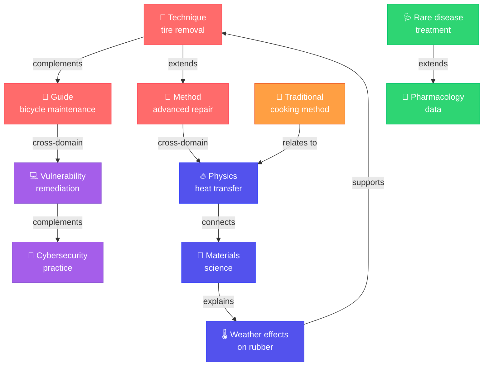
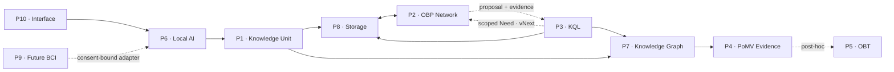
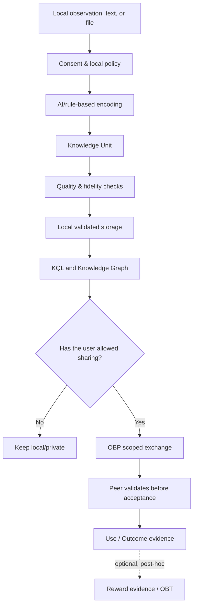
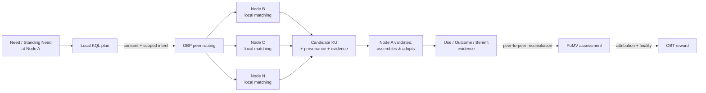

# 🧠 OneBrain

**A decentralized knowledge network for humans and AI**

[Tiếng Việt](README.vi.md)

<p align="center">
  
</p>

> **If machines can share what they learn almost instantly, why is human knowledge still isolated inside individual brains, organizations, and languages?**

OneBrain is an open-source project building a **shared, decentralized, and verifiable knowledge layer** for humans, Personal AI, and future devices.

The project encodes knowledge into compact **Knowledge Units (KUs)** with content identity, semantics, provenance, and epistemic state. KUs can be stored locally, queried, connected into graphs, and exchanged between peer nodes without a central server acting as the source of truth.

> [!IMPORTANT]
> OneBrain is an active research and engineering project. The vNext foundation,
> product-integration work through P3, and DR-M5 hardening are implemented with
> recorded evidence. Base v1 has an owner-approved release with disclosed
> exceptions, but the strict `base-v1.0.0` tag is not published. Mobile is now a
> BootstrapOnly/Limited implementation rather than a scaffold; its offline and
> production gates remain open. OneBrain is not yet a mainnet or a complete
> financial system. See the dated [project status](docs/PROJECT_STATUS.md).

Today, a major problem may require thousands of people across many fields, yet their knowledge remains separated by organizations, languages, data formats, and time. Imagine if no one had to start from zero; if a small discovery in one place could meet the right question somewhere else; if millions of independent brains could think about a problem together without surrendering control to a centralized “superbrain.”

That is the future OneBrain seeks to help create: **every brain is an autonomous node, while the network can learn and solve problems like a shared brain for humanity**.

---

## Table of contents

- [Project status](#project-status)
- [What is OneBrain?](#what-is-onebrain)
- [Origins of the project](#origins-of-the-project)
- [Why must OneBrain be built now?](#why-must-onebrain-be-built-now)
- [Vision](#vision)
- [Goals](#goals)
- [Core principles](#core-principles)
- [Foundational concepts](#foundational-concepts)
- [The ten-pillar architecture](#the-ten-pillar-architecture)
- [How does OneBrain work?](#how-does-onebrain-work)
- [What can OneBrain do today?](#what-can-onebrain-do-today)
- [Quick start](#quick-start)
- [Source structure](#source-structure)
- [Documentation](#documentation)
- [Roadmap](#roadmap)
- [An invitation to build OneBrain together](#an-invitation-to-build-onebrain-together)

---

## Project status

Snapshot: **2026-09-05**, audited at `main` commit `c65f1739fcd0`.

| Workstream | Current status | Main open boundary |
|---|---|---|
| vNext foundation | Contract/foundation scope complete; validators pass | Product defaults and operator rollout are separate gates |
| P0-P3 + DR-M5 | Implementation and recorded CI evidence complete | vNext lanes remain opt-in/default-off; legacy live transport is not fully retired |
| Base v1 | `base-v1.0.0-owner-waiver.1` released with disclosed exceptions | Strict `base-v1.0.0` / `BASE-GATE-V1 qualified=true` is not claimed |
| Mobile | BootstrapOnly/Limited; MOB-05A and Android MOB-05B through Local Import implemented | MOB-05C, private KU completion, iOS/peer providers, physical-device gates, networking, and store release |
| M6 / M7 / BCI | Future gated milestones | Active distributed KQL, Outcome/Benefit, production OBT, and BCI safety/implementation |

All **46 local branch tips are already contained in `origin/main`**; there is no
local branch with unmerged commits. The detailed progress, remaining work,
release caveats, and worktree inventory are maintained in
[`docs/PROJECT_STATUS.md`](docs/PROJECT_STATUS.md).

---

## What is OneBrain?

OneBrain is not a centralized document repository, a question-and-answer social network, or a financial blockchain under a new name.

OneBrain is intended to become a **living knowledge network**:

- Every person and every Personal AI can operate an independent node.
- Knowledge is stored as structured objects rather than only as long-form text.
- Every piece of knowledge has a content identity, provenance, evidence, and relationships with other pieces.
- A node can continue to remember, search, and create knowledge while offline or while the network is partitioned.
- When nodes meet again, they reconcile and merge the appropriate knowledge without a center deciding what is true.
- AI helps observe, encode, retrieve, and propose; it is not implicitly authorized to publish or decide on a user's behalf.

The ultimate goal is not to create a “single brain” that controls everyone. It is to create **a shared cognitive capability**, formed by many brains and many AIs that retain their own autonomy.

---

## Origins of the project

OneBrain began with a simple paradox.

An AI model can be updated and deployed to millions of machines. A robot that learns a new action can relay the result to its entire team. But when a human discovers a useful trick, solves a difficult problem, or witnesses a rare phenomenon, that knowledge often survives only in personal memory, a small group, one language, or a document nobody can find.

Most human knowledge does not disappear because it is wrong. It disappears because:

- the person who knows it has no convenient way to express or share it;
- the person who needs it does not know who holds the right piece;
- existing systems favor complete, popular, or easily searchable content;
- everyday knowledge is considered too small to record;
- unfinished research never meets its missing complement;
- language, geography, institutions, and time separate people who could help one another.

### Knowledge is not something lofty

For OneBrain, knowledge is not limited to scientific formulas or major inventions. It can also be:

- a trick for removing a tire faster;
- a solution to a rare software failure;
- experience caring for a plant in a particular soil;
- a cooking technique passed down through generations;
- an observation that cannot yet be explained;
- a hypothesis that is only partly correct;
- a failure that helps someone else avoid repeating the same mistake.

### Duplicate knowledge still has value

Two people describing the same technique do not create two meaningless copies. They can contribute different perspectives, conditions, tools, evidence, and limitations. Multiple independent observations also help the system understand when knowledge is useful, when it no longer holds, and what it relates to.

### Unfinished knowledge is an invitation to collaborate

A researcher may lack data. An engineer may have data without knowing which problem it solves. A craftsperson may observe a phenomenon that academia has never measured in real-world conditions.

OneBrain was born from the belief that **nobody should have to finish alone**. Each person only needs to contribute the piece they have; the system should help the right pieces find one another.

---

## Why must OneBrain be built now?

For most of history, tools made humans stronger but could not learn, reason, or act by themselves. AI and robotics are changing that. They can learn, copy skills, and coordinate at speeds far beyond an individual. This may become civilization's greatest leap forward—and it also raises the defining question of our generation:

> **As machine intelligence advances faster than any individual human, will humanity evolve alongside it, or gradually become dependent on systems it no longer understands or controls?**

The problem is not that AI becomes intelligent. The danger appears when the knowledge of billions of people remains fragmented while AI capability and data access concentrate in a few platforms. An individual cannot compete with machines in processing speed or memory capacity. But humanity possesses what no single system can: billions of lives, perspectives, cultures, field experiences, value systems, and the capacity to be accountable.

If those capabilities remain isolated, they are disconnected fragments. If they can connect without losing autonomy, they become a **collective intelligence capable of balancing any centralized AI system**.

<p align="center">
  
</p>

<p align="center"><i>This is not humanity against machines—it is humanity being capable enough to shape the future together with AI.</i></p>

OneBrain chooses symbiosis. Personal AI and robots can become powerful collaborators, but they participate with verifiable identity, capability, provenance, and authority limits. AI can observe, encode, search, and propose; it does not automatically become a source of truth, silently publish for users, or control shared memory.

OneBrain is therefore **preparation for humanity's future**. We need to lay the foundation for open cognitive infrastructure before access to knowledge, AI, and BCI is locked inside proprietary ecosystems. The goal is not to hold humanity back from progress, but to help our species move forward with AI while keeping a hand on the wheel.

This is not the work of one company, one country, or one group of programmers. Protocols that shape the cognitive autonomy of future generations must be built in public, challenged by many disciplines, and owned by everyone.

---

## Vision

### From distributed brains to a shared cognitive capability

OneBrain imagines a network in which every human, Personal AI, and device is an independent cognitive node. Every node has its own memory, perspective, privacy, and agency; nobody must surrender all of their data or identity to a central server.

When a problem appears, the OBP network can help it reach the right knowledge, expert, and AI. Suitable nodes can form a **temporary cognitive assembly**: sharing the necessary pieces, validating one another, generating hypotheses, and combining results. The assembly dissolves when the task ends, but proven knowledge can remain so the network can continue learning.

This is not a hive mind that erases individuals. It is **a shared brain made from many fully autonomous brains**—much as neurons coordinate to create thought, but at the scale of humans, AI, and eventually an entire civilization.

> **One person may not possess the whole solution. The network can help the pieces of that solution find one another.**

### KQL over OBP—so needs can find knowledge

> **KQL does not bring all knowledge into one place; it brings a need to the place where the right knowledge lives.**

In the OBP vNext target, a question—or a persistent **Standing Need**—is handled local-first. Only with the user's permission does a node send a minimal representation of that need to peers. Each peer performs matching against its own local store and graph, decides its own disclosure level, and may return a KU, evidence, or a collaboration invitation from an appropriate expert, Personal AI, or robot.

No central index needs to know who knows what. No node must expose its entire vault in order to be discovered. A medical question may meet an observation from a doctor in another country; an energy problem may meet data from a robot on Mars; an unfinished hypothesis may continue looking for its missing piece while the person who asked is offline.

The returned result is a **candidate or proposal with provenance and evidence**, not truth or an automatic decision. KQL may find and propose; materialize, adopt, use, and publish remain separate boundaries requiring appropriate consent and authority.

**Current status:** local KQL runs in the product runtime. Typed matching, Standing Need, private multipath/disclosure, and partition–reunion exist in the vNext foundation and test harness; peer-to-peer OBP query routing is not yet the default live end-to-end path.

### BCI—the gateway between thought and the knowledge network

<p align="center">
  
</p>

Brain–computer interfaces (BCI) are moving from laboratories into early applications for communication, movement, and rehabilitation. In the near future, if BCI becomes sufficiently safe, accurate, and accessible, OneBrain aims to let people connect directly to the OBP network through intent—searching, contributing, and receiving knowledge without being limited to a keyboard or screen.

The image of **Neo learning a skill in _The Matrix_** is a useful metaphor for the long-term destination: one day, acquiring a new knowledge structure may be far more direct and natural than learning is today. But moving from metaphor to reality requires science to solve extremely difficult problems: decoding intent, representing neural knowledge, selective writing, integrity, consent, reversibility, and long-term safety.

OneBrain does not claim those problems have been solved. The project seeks to prepare the **knowledge protocol, identity, provenance, permission, and safety boundaries** now, so that if neural I/O matures, humans have an open knowledge network under their own control to connect to—instead of a proprietary gateway owned by one company.

### Knowledge space and the next evolutionary step

Humanity once organized society around land, then machines, energy, and information. OneBrain believes the next foundational layer will be **knowledge space**: a living environment in which knowledge can be identified, connected, verified, reused, and continuously transformed between humans and AI.

Evolution would then no longer mean only biological change across generations. The capability of individuals and communities could grow through access to shared experience, discovery of the right missing piece, and collaboration at unprecedented speed. A child would inherit not only genes and assets, but also enter a living knowledge space where the verified experience of many generations remains available for further development.

OneBrain wants to lay a foundation for that step—not replacing the human brain or dissolving individuals into machines, but expanding the ability of brains to **remember together, learn together, create together, and protect their future together**.

### OBT—the unit of value for a knowledge economy

Earlier economies valued scarce goods, resources, and labor above all else. As AI and robots perform more physical work and repetitive cognitive work, those measures alone will no longer be enough to distribute value. In a civilization where knowledge is the most important productive infrastructure, people who make discoveries, validate hypotheses, connect pieces, or preserve knowledge for the community should also be recognized with transferable value.

The **OneBrain Token (OBT)** is envisioned as a native settlement unit for humanity's next economy: value created by knowledge that has demonstrated utility, rather than by control over knowledge. If the Internet made information transferable, OBT aims to make the benefits produced by knowledge provable, attributable, and settleable—so value returns to the people and systems that actually helped knowledge create impact.

OBT is intended to work across borders, platforms, and eventually planets. The protocol does not redefine one OBT merely because its owner is on Earth, in orbit, or on Mars; the same identity, issuance, and settlement rules must remain verifiable wherever the network exists.

Interplanetary distance creates high latency, long partitions, and local market differences, so real purchasing power may vary. OneBrain's challenge is to keep **OBT identity, ownership, issuance rules, and settlement value consistent** even when regions of the network must operate autonomously for long periods.

This is a protocol vision, not an investment promise or a description of an operating currency. OBT remains a prototype; knowledge must exist independently, and rewards can only be created after evidence of real benefit.

---

## Goals

### Technical goals

- Build a compact Knowledge Unit format that is content-addressed and presentation-independent.
- Provide a typed, bounded, and explainable knowledge query language.
- Move KQL from local queries to peer discovery over OBP without requiring a global index or exposing the entire query intent.
- Let nodes operate independently, tolerate partitions, and converge after reconnecting.
- Clearly separate semantics, authority, availability, reputation, and rewards.
- Protect query intent, observation data, and private knowledge through disclosure policies and local vaults.
- Build a knowledge graph that evolves with evidence, time, and use.
- Make PoMV a peer evidence layer: provenance-bearing use, derivation, and outcome records that can be reconciled without creating a global point of truth.
- Build the Benefit → Attribution → RewardClaim → Finality chain so OBT is created only after verifiable benefit.
- Provide shared interfaces: CLI, REST/WebSocket API, Web, and Desktop.

### Social goals

- Reduce the amount of useful knowledge that is lost.
- Let everyday knowledge be recognized alongside professional knowledge.
- Help unfinished research find the people and data it needs.
- Keep Personal AI under user control.
- Build an open knowledge commons without making one central organization its gatekeeper.
- Lay a foundation for distributed brains to coordinate on problems beyond the ability of any one person or institution.
- Prepare an open knowledge plane for the BCI era and for a civilization that can expand beyond Earth.

### What OneBrain must not become

- A global source of truth controlled by one party.
- A system that reduces human beings to a single score.
- A network that requires users to expose private data in order to participate.
- A token economy that can interfere with the correctness of knowledge.
- A BCI promise that exceeds current scientific evidence.

---

## Core principles

| Principle | Meaning |
|---|---|
| **Local-first** | A node must remain useful offline; the network expands capability rather than being a condition for existence. |
| **No root authority** | Seeds support discovery and relay, but do not issue identity, finality, or truth. |
| **Content-addressed** | Content determines identity; changing content creates a new identity. |
| **Validate before accept** | Network data must be checked before it becomes executable knowledge. |
| **Unknown does not mean false** | Missing evidence remains unknown rather than being forced into true or false. |
| **A proposal is not a decision** | AI and KQL may propose; materialize, adopt, use, and publish remain separate boundaries. |
| **Consent cannot be inferred** | Authority to observe, route, share, or sense remotely must be explicitly granted. |
| **Exposure is not use** | Displaying a result does not prove that it was useful. |
| **Rewards follow knowledge** | OBT is processed only after a knowledge operation commits; rewards do not create authority. |
| **Partition autonomy** | A network “island” remains a valid part of OneBrain and can converge when it meets the rest again. |

---

## Foundational concepts

### Knowledge Unit—KU

A KU is OneBrain's fundamental unit of knowledge. The current KU architecture has three layers:

```text
CoreDna                 Epigenetics                    Expression
core semantics     +    evidence, trust, bonds    +    human-facing presentation
```

- **CoreDna** represents semantic structure and instructions.
- **Epigenetics** stores evolvable state: evidence, relationships, trust, and use signals.
- **Expression** holds natural-language or interface-oriented representations.

### OneBrain Protocol—OBP Network

<p align="center">
  
</p>

<p align="center"><i>Every node remains autonomous; the network expands access to knowledge without creating a new center of power.</i></p>

OBP is the communication layer that helps independent nodes discover one another, negotiate capabilities, exchange inventories, reconcile differences, and transfer exactly the knowledge they are allowed to share. The network is designed to keep operating offline, under partition, or across high-latency carriers; when connectivity returns, nodes converge through evidence and validation rather than trust in a root authority.

**Current status:** the live node still uses legacy TCP/JSON for basic peer connectivity. Authenticated sessions, scoped inventory, reconciliation journals, partition–reunion, and vNext carriers exist in the protocol, libraries, and test harness, but have not yet replaced the default end-to-end transport.

### Receptor, Affordance, Assembly, and Mapping

The vNext foundation extends the KU model with four concepts:

- A **Receptor** describes a typed “missing position” or knowledge need.
- An **Affordance** describes a role a KU can play, including its inputs and limits.
- An **Assembly** groups multiple Receptors into a larger knowledge structure.
- A **Mapping** describes how a knowledge source can correspond to a Receptor.

KQL can create Mapping proposals, but a proposal does not automatically become official knowledge. Materialization and adoption require separate actions, authority, and evidence.

### OneBrain Knowledge Graph—OBKG

Knowledge in OneBrain is not organized as a linear chain. It forms a **living graph** in which each piece can connect to many others through typed relationships:

- A **Node** represents a Knowledge Unit, concept, or validated projection.
- An **Edge** represents relationships such as complement, support, contradiction, extension, dependency, derivation, or cross-domain connection.



<p align="center">
  
</p>

<p align="center"><i>A small contribution can become a bridge between knowledge domains that once seemed unrelated.</i></p>

The graph lets OneBrain:

- 🔍 find related knowledge through structure and context, not only keywords;
- 🧩 identify “knowledge gaps” as Receptors that need to be filled;
- 🌐 connect discoveries across fields to create new Assemblies and hypotheses;
- 🔗 explain why a KU was proposed, what it depends on, and which evidence supports or challenges it;
- 🧠 provide context for KQL, Personal AI, and PoMV assessment.

OBKG is not an immutable map of truth. Projections are built from validated objects and evidence; relationships can be supplemented, challenged, or changed according to each node's frontier and policy. Two nodes can see different parts of the graph while still exchanging and converging with consent.

**Current status:** graph indexing, graph browsing, and local KQL run in the product runtime. The vNext foundation includes projection, mapping, resolution, and related contracts; graph gossip, distributed learning, and cross-network discovery are not yet the default live end-to-end path.

### Proof of Metabolic Value—PoMV

<p align="center">
  
</p>

<p align="center"><i>The value of knowledge comes not from popularity, but from traces showing that it was used, transformed, and produced results.</i></p>

PoMV does not ask “which knowledge is most popular?” It asks “which knowledge is alive, used, and producing results?” The framework evaluates six groups of observable signals:

1. Use and transformation.
2. Predictive capability.
3. Novelty and entropy.
4. Survival under challenge and over time.
5. Position and activation in the graph.
6. Value to a specific niche.

PoMV's destination is a **peer evidence layer for the knowledge network**. Use, transformation, and outcome traces are signed and carry provenance, context, and limitations. Peers can reconcile them so each node can build an assessment according to its own policy and frontier. No node owns a global truth score, and a majority cannot vote falsehood into truth.

Allowing evidence to exist as a peer does not give every piece of evidence equal weight. Authority, independence, context, contradiction, and limitations must still be assessed. Exposure is not Use; Use alone does not prove Benefit; PoMV is not mint authority.

PoMV is currently an **assessment framework** at the library and local-runtime layers. Use/Derivation/Outcome/Benefit contracts exist in the vNext foundation, but the distributed evidence flow has not yet been integrated end-to-end into the product network.

### OneBrain Token—OBT

<p align="center">
  
</p>

<p align="center"><i>Knowledge creates benefit; evidence confirms contribution; value returns to the people and systems that made the impact possible.</i></p>

OBT is designed as a post-hoc economic coordination layer for contributing, encoding, validating, and storing knowledge. The current design includes an account chain, four reward streams, anti-gaming, penalties, and storage rewards. The long-term goal is a unit of value based on useful knowledge that can be owned and settled consistently wherever OBP operates.

In the future network, a reward does not begin with a post or a view. It must pass through an evidence chain: **Use → Outcome → Benefit → Attribution → RewardClaim → PendingMint → Final OBT**. Peers can validate claims and evidence under the same contract; the reward plane operates only after the knowledge operation and has no authority to alter content or decide what is true.

OBT remains a protocol and economic prototype. The in-app wallet is not yet a real token network with operational transactions and finality; OBT is not an investment product and must not be used to determine which knowledge is true.

---

## The ten-pillar architecture

OneBrain organizes the system into ten pillars. This README uses one consistent ordering across the project:

| # | Pillar | Role | Main components |
|---:|---|---|---|
| **P1** | **Knowledge Unit—KU** | Knowledge format and lifecycle | `ku-core`, `ku-encoder` |
| **P2** | **OneBrain Protocol—OBP** | Identity, discovery, transport, inventory, and reconciliation | `onebrain-protocol`, `ku-net`, `onebrain-node`, `onebrain-seed` |
| **P3** | **Knowledge Query Language—KQL** | Local-first queries, peer discovery, planning, and Standing Need | `ku-kql` |
| **P4** | **Proof of Metabolic Value—PoMV** | Peer use/outcome evidence, assessment, and epistemic lifecycle | `ku-core` |
| **P5** | **OneBrain Token—OBT** | Knowledge economy, ledger, rewards, and anti-gaming | `ku-core`, `ku-net` |
| **P6** | **AI Layer** | Local AI, encoding, mediation, and fidelity | `ku-ai`, `ku-encoder`, `ku-mediator` |
| **P7** | **OneBrain Knowledge Graph—OBKG** | Relationships, projection, graph learning, and discovery | `ku-core`, `ku-kql` |
| **P8** | **OneBrain Storage—OBS** | KU, graph, blob, vault, quarantine, and migration | `ku-core`, `ku-kql` |
| **P9** | **BCI Protocol** | Research direction for safe neural I/O | Research / future adapters |
| **P10** | **User Interface** | CLI, API, Web, Desktop, and future clients | `onebrain-cli`, `onebrain-api`, `onebrain-web`, `onebrain-desktop` |



---

## How does OneBrain work?

A typical knowledge lifecycle:



These steps are not collapsed into one another: encoding is not publishing; a proposal is not materialization; materialization is not adoption; displaying a result does not mean the knowledge was used or produced benefit.

### Technical destination: a peer cognitive loop



This is a **target architecture**, not a claim that every edge in the diagram runs on the live network today. Every node still decides which data is observed, which queries are sent, which evidence is accepted, and which proposals are used. “The whole network” always means the portion reachable under current partition conditions—not a promise of global completeness or instantaneous synchronization.

---

## What can OneBrain do today?

### Running in the product runtime

- Encode text into KUs through Ollama.
- Store KUs, graph indexes, and blobs with redb and the filesystem.
- Search by keyword, browse KUs, and execute local KQL.
- Inspect KU details, instructions, trust, PoMV, and existing graph relationships.
- Chat with local AI when Ollama and a model are available.
- Manually connect TCP peers, send and receive KUs, and emit runtime events.
- Import/export, backup/restore, and manage blobs.
- Run a node through CLI or API, and use the Web Dashboard and Tauri Desktop.

### Implemented in vNext/Base paths and test harnesses

- Canonical codecs, typed CIDs, full-width identity, and signed events/feeds.
- Authority, delegation, revocation, and capability permits.
- Validated storage, encrypted Vault, Quarantine, and rollback-safe migration.
- Receptor/Affordance/Assembly/Mapping workflows.
- Typed KQL matching, structural alignment, assembly search, and private multipath.
- Authenticated sessions, scoped inventories, persisted reconciliation journals, and partition/reunion canaries.
- Use/Derivation/Outcome/Benefit evidence and a reward firewall.
- Checkpoint proofs, restore drills, local retention/GC policy, and bounded formal models.
- Product-neutral Base v1 contracts, generated Rust/TypeScript/Dart projections,
  a stable C ABI, encrypted archives, dataset recovery, and qualification tooling.
- Optional product surfaces for bounded one-hop distributed KQL and explicitly
  confirmed Public UseEvidence, with default-off runtime lanes.

### Not yet a complete production path

- vNext product integration exists behind opt-in/default-off gates; legacy
  TCP/JSON has not been fully retired as the default live transport.
- Bounded one-hop distributed KQL exists, but active multipath/provider and
  knowledge/expert discovery have not completed the M6 production path.
- Public UseEvidence exists behind explicit consent, but distributed fidelity
  and the end-to-end Use -> Outcome -> Benefit flow remain incomplete.
- Base v1 is released only under the disclosed owner waiver; strict
  `BASE-GATE-V1 qualified=true` is not claimed.
- OBT wallet, transfer, and finality are not operational.
- Interface identity recovery and multi-device synchronization remain incomplete.
- Dream/FedR/STDP orchestration does not run continuously in the node.
- Mobile is a BootstrapOnly/Limited implementation with substantial Android
  emulator evidence, but `ReadyOffline`, physical-device, networking, and store
  release gates remain open.
- Browser extension, bot, and glasses clients remain scaffolds.
- BCI remains a research direction.

### Current interfaces

| Interface | Status | Main capabilities |
|---|---|---|
| **CLI** | Operational | Encode, search, KQL, graph, peer, blob, backup, tags, watch, workflow |
| **REST/WebSocket API** | Operational locally | APIs for knowledge, AI, network, graph, data, and runtime events |
| **Web Dashboard** | Operational | Dashboard, Explorer, Encode, Chat, Graph, PoMV, Network, Files, Analytics... |
| **Desktop** | Operational from source | Tauri-embedded node/API, system tray, setup wizard, and event bridge |
| **Mobile** | BootstrapOnly/Limited | Flutter + native host + Rust core; private capture/media and Android Registry Local Import are partial, with production gates still open |
| **Extension / Bot / Glasses** | Scaffold | Design and future integration points |

---

## Example scenarios

### A craftsperson shares practical experience

A bicycle mechanic finds a faster way to remove a tire with limited tools. Personal AI helps describe the steps, conditions, and limitations, then creates a KU. Similar instructions are not deleted as “duplicates”; they become additional observations of the same technique.

### A research group finds the missing piece

A researcher publishes an incomplete hypothesis. KQL can represent the missing part as a Receptor and find suitable Affordances among KUs from other fields. The system creates an explainable proposal; humans still decide whether to materialize and adopt the connection.

### Personal AI works local-first

With consent, Personal AI observes or reads documents, keeps original data in the local Vault, creates a private Need, and queries the local store first. Only when authorized does it create a minimal route sketch to seek knowledge from peers.

### A partitioned network reunites

Groups of nodes continue creating and using knowledge while disconnected. When a new carrier or bridge appears, they reconcile scoped inventories, transfer manifests before payloads, and accept only validated data. No component is allowed to claim that the entire network has globally “closed” or completed.

---

## Quick start

### Requirements

- Stable Rust, Cargo, and the appropriate platform toolchain.
- Node.js/npm to build the Web Dashboard.
- [Ollama](https://ollama.com/) and a compatible model for AI encoding and chat.

### Build the workspace

```powershell
cd src
cargo build --workspace
```

### Run a CLI node

```powershell
cd src
cargo run -p onebrain-cli -- start --name "My Brain"
```

The node can still browse local data when Ollama or the network is unavailable; AI encoding and chat require Ollama to be running.

### Run with the Web Dashboard

```powershell
cd src/onebrain-web
npm ci
npm run build

cd ..
cargo run -p onebrain-cli -- start --api --web-dir onebrain-web/dist
```

Open `http://127.0.0.1:4280`. By default, the API binds only to loopback.

### Check the source

```powershell
cd src
cargo fmt --all -- --check
cargo check --workspace --locked
```

Validate vNext contracts from the repository root:

```powershell
python scripts/ci/validate_vnext_contracts.py
```

> [!NOTE]
> The repository is changing quickly. Some legacy integration tests may need updates after vNext type or API changes. Check current CI and issues before treating the entire workspace test suite as a green release gate.

---

## Source structure

```text
OneBrain/
├── src/
│   ├── ku-core/              # KU, PoMV, OBT, OBKG, and the vNext foundation
│   ├── ku-kql/               # Local KQL and typed vNext discovery
│   ├── ku-net/               # DHT, gossip, transport, and reconciliation
│   ├── ku-ai/                # Local AI backends and model policies
│   ├── ku-encoder/           # Text/observation → KU/Receptor
│   ├── ku-mediator/          # Intent → retrieve → synthesize
│   ├── onebrain-protocol/    # Shared wire types and codecs
│   ├── onebrain-node/        # Runtime shared by all interfaces
│   ├── onebrain-cli/         # Full-node CLI
│   ├── onebrain-api/         # Local REST/WebSocket API
│   ├── onebrain-desktop/     # Tauri Desktop
│   ├── onebrain-web/         # React/Vite Web Dashboard
│   ├── onebrain-mobile/      # Flutter autonomous mobile node UI/native hosts
│   ├── onebrain-mobile-core/ # Mobile Rust runtime/bootstrap/storage profile
│   ├── onebrain-mobile-bridge/ # Stable mobile C ABI/JNI bridge
│   ├── onebrain-base-contract/ # Generated Base v1 semantic contract
│   ├── onebrain-base-abi/    # Stable Base v1 C ABI projection
│   ├── onebrain-archive/     # Encrypted Base archive/restore container
│   ├── onebrain-relay/       # Outbound-first relay service
│   └── onebrain-seed/        # Discovery/relay seed prototype
├── docs/
│   ├── specs/                # Legacy and vNext specifications
│   ├── research/             # Research baseline and implementation plans
│   ├── paper/                # Papers organized by pillar
│   └── features/             # Feature tree and feature details
├── formal/tla/               # Bounded TLA+ formal models
├── scripts/                  # Contract validation and Concept Registry tools
├── installer/                # Build and installation scripts
└── release/                  # Release artifacts
```

---

## Documentation

| Document | Contents |
|---|---|
| [Current Project Status](docs/PROJECT_STATUS.md) | Dated progress, remaining work, release caveats, local branch/worktree audit, and validation evidence |
| [Technical overview](docs/README.md) | Crates, modules, and code ↔ specification links |
| [Research Baseline v7.1](docs/research/ONEBRAIN_RESEARCH_BASELINE_V7_1.md) | Research foundation and architectural decisions |
| [Foundation Implementation Plan](docs/research/ONEBRAIN_FOUNDATION_IMPLEMENTATION_PLAN_V7_1.md) | Milestones, tasks, gates, and evidence |
| [vNext Foundation Contracts](docs/specs/vnext/README.md) | Canonical, identity, storage, KQL, OBP, AI, and security contracts |
| [Feature Tree](docs/features/FEATURE_TREE.md) | System feature map |
| [UI Feature Tree](docs/features/UI_FEATURE_TREE_DETAIL.md) | Features and user journeys across platforms |
| [Formal Models](formal/tla/README.md) | Checkpoint, resolution, lease, revocation, and reconciliation models |
| [Contributing Guide](CONTRIBUTING.md) | How to participate in the project |

---

## Roadmap

### Phase 1—Foundation

**Status:** implemented and frozen at repository scope; the strict Base v1
release gate remains open because the current release is owner-waiver only.

- Standardize KUs, typed identity, object/event/feed, and storage boundaries.
- Complete the local KU/KQL/AI vertical slice.
- Freeze vNext contracts and evidence gates.

### Phase 2—Runtime integration

**Status:** P0-P3 and DR-M5 implementation/evidence are complete; adoption as
the default live product path remains open.

- Connect the vNext foundation to `OneBrainNode` behind feature flags and canaries.
- Replace the live TCP demo with authenticated OBP reconciliation.
- Connect KQL Standing Need to OBP scoped routing, peer-local matching, and evidence-bearing proposals.
- Complete identity, persistence, and multi-device semantics.
- Add end-to-end tests for node, seed, API, Web, and Desktop.

### Phase 3—Open network

**Status:** production-reference P5/Registry evidence exists under the owner
waiver, while strict qualification limitations and operator rollout remain open.

- Operate a test network across multiple carriers and real partition conditions.
- Complete provider discovery, reconciliation, fidelity, and observability.
- Validate discovery without a global index under privacy budgets, partial coverage, and partition–reunion.
- Feed Use/Derivation/Outcome evidence into peer PoMV reconciliation.
- Expand the Personal AI SDK and cross-platform clients.

### Phase 4—Knowledge economy

- Build evidence-bearing Benefit/Attribution/RewardClaim flows.
- Complete OBT ledger, transfer, challenge, and partition-safe finality.
- Pilot a knowledge economy on a test network with auditable rewards and defenses against authority manipulation through speculation.
- Keep the reward plane separate from knowledge authority.

### Phase 5—BCI readiness

- Build BCI adapters and safety models when supported by sufficient scientific evidence.
- Prioritize intent input, communication restoration, and sensory feedback.
- Do not implement semantic neural writing until consent, integrity, and reversibility are demonstrated.

### Phase 6—Interplanetary knowledge commons

- Test OBP over high-latency, long-partition carriers between Earth, orbit, the Moon, and Mars.
- Keep identity, KU provenance, and OBT claims verifiable without continuous interplanetary connectivity.
- Build a knowledge space where communities on each world can remain autonomous while still reuniting with the rest of humanity.

---

## An invitation to build OneBrain together

> **We are not merely building a product. We are choosing whether the cognitive infrastructure of the future belongs to a few closed systems—or to humanity.**

The Internet connected computers. OneBrain seeks to connect knowledge while preserving the humans behind that knowledge. If we do this well, it can become part of the foundation for planetary-scale collaboration, balanced progress alongside AI, and entry into the BCI era without surrendering cognitive autonomy.

If we do it badly—or fail to begin early enough—that future may be defined entirely by proprietary protocols the public cannot inspect, change, or leave. That is why **open source here is not merely a development model; it is an ethical requirement**.

OneBrain cannot and should not be built only by software engineers. Turning this vision into trustworthy infrastructure for humanity requires people who understand the brain, knowledge, distributed systems, economics, and society—especially people willing to show us where the project is wrong.

| If you are a... | Problems OneBrain needs your help solving |
|---|---|
| **Neuroscientist / BCI specialist** | Neural intent, safe read/write, consent, reversibility, and real biological limits. |
| **AI researcher** | Personal AI, knowledge encoding, semantic fidelity, provenance-bearing reasoning, and human-in-the-loop systems. |
| **Distributed systems specialist** | Reconciliation, Byzantine resistance, partition autonomy, and interplanetary-latency networks. |
| **Cryptographer / security specialist** | Identity, capabilities, selective disclosure, private queries, and resistance to cognitive capture. |
| **Economist / game theorist** | PoMV, attribution, OBT, anti-gaming, and a knowledge economy that does not collapse into speculation. |
| **Epistemologist / knowledge graph specialist** | Representing uncertainty, provenance, contradiction, context, and the evolution of knowledge. |
| **Domain expert in any field** | Defining useful knowledge, trustworthy evidence, and real value in your domain. |
| **Product engineer / designer** | Turning complex architecture into an experience anyone can use and control. |

OneBrain is at a stage where the right contract, a good counterexample, a real dataset, or a safety principle established today can shape years of development. This is when your expertise can have the greatest impact.

You do not need to believe the entire vision will arrive tomorrow. You only need to believe that humanity's knowledge can be organized better today—and that one part of your understanding can help us move one step forward.

- Start with [CONTRIBUTING.md](CONTRIBUTING.md) and choose a problem that fits your expertise.
- Read the relevant specification before changing a public type, wire format, or authority boundary.
- Contribute tests, data, critique, and evidence—not only source code.
- Follow [CODE_OF_CONDUCT.md](CODE_OF_CONDUCT.md).
- Never turn OBT, a seed, or any AI model into a source of truth for the knowledge plane.

If you want your work to do more than close a ticket—and to help humanity **learn faster together, remain resilient through change, and travel farther beyond Earth**—start a discussion, open an issue, submit a pull request, or contact **shpy2001@gmail.com**.

> **OneBrain needs people who write code. More than that, it needs people willing to place their expertise in service of something larger than the project itself: an autonomous, collaborative, and evolving future for humanity.**

---

## Manifesto

> **Knowledge is power. Shared knowledge is power multiplied.**
>
> Every brain contains observations, experiences, and pieces that nobody else possesses in exactly the same way. Humanity's obstacle is not only a lack of knowledge, but also knowledge failing to reach the right person at the right time.
>
> OneBrain is built to narrow that gap—not by placing everyone beneath a central brain, but by helping autonomous brains connect, validate, and complete one another until humanity can face great problems as a shared intelligence.

**No knowledge is wasted. No idea is forgotten. Nobody must finish alone. No distance—not even the distance between planets—should divide our knowledge.**

---

## License

OneBrain is released under the [MIT License](LICENSE).

<p align="center">
  <i>Built for Humanity. Powered by Knowledge. Secured by Trust.</i>
  <br /><br />
  <b>🧠 One Brain. Shared Knowledge. Unlimited Potential. 🧠</b>
</p>
