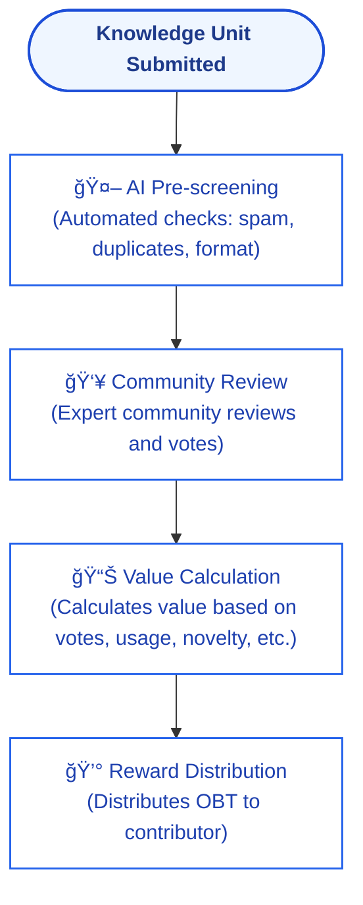
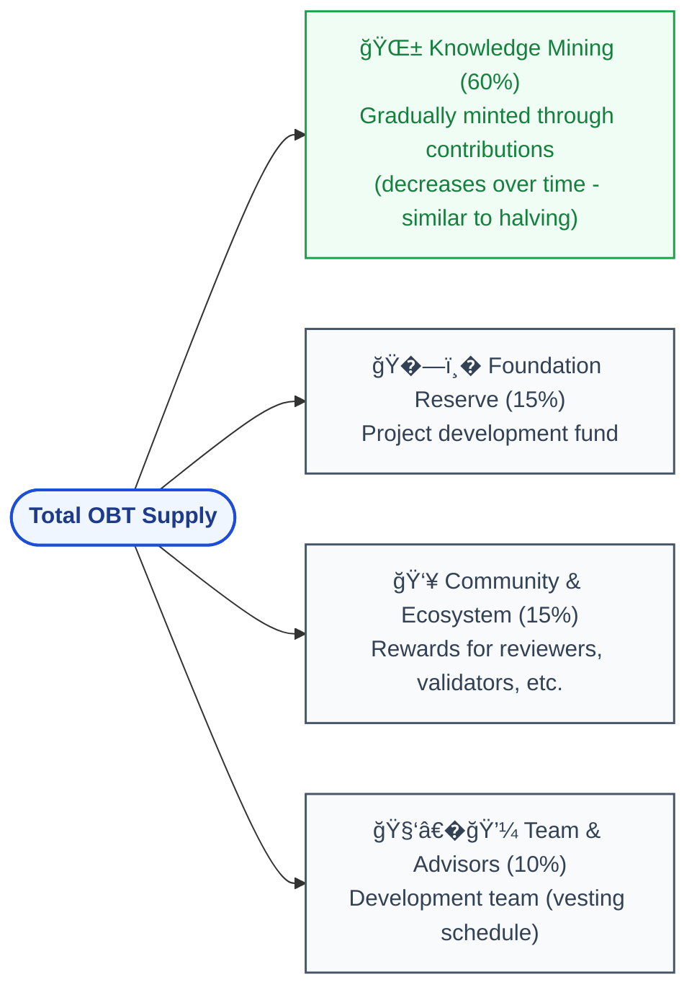
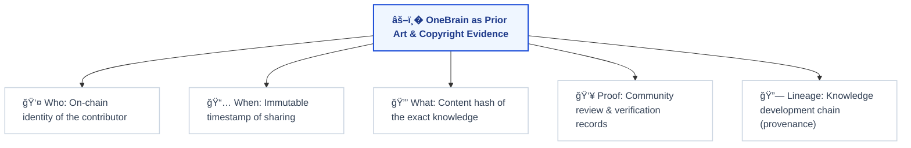

```mermaid
flowchart TD
    subgraph Stage1 ["STAGE 1: Manual Input (Phase 1-2) 📱💻"]
        direction TB
        S1_Desc["The user directly creates and submits knowledge:"]
        S1_Items["• Text: Articles, notes, how-to guides<br/>• Photos & Video: Visual demonstrations<br/>• Voice: Dictated explanations (AI transcribes & structures)<br/>• Screen capture: Workflows, tutorials<br/>• Structured forms: Step-by-step templates"]
        S1_Summary["→ Similar to writing a blog post, but with AI assistance for formatting & classification"]
        S1_Desc --> S1_Items --> S1_Summary
    end

    subgraph Stage2 ["STAGE 2: AI-Assisted Capture (Phase 3-4) 🤖📷"]
        direction TB
        S2_Desc["Personal AI observes and helps package knowledge:"]
        S2_Items["• AI watches you work and suggests: 'That was clever. Want me to package it?'<br/>• AI auto-records via phone camera, smart glasses, or wearables<br/>• AI generates descriptions, guides, and tags from raw footage<br/>• User reviews & approves before publishing<br/>• Voice command: 'Hey AI, share what I just did'"]
        S2_Summary["→ You do the work, AI does the documenting"]
        S2_Desc --> S2_Items --> S2_Summary
    end

    subgraph Stage3 ["STAGE 3: Thought-to-Knowledge (Phase 5) 🧠⚡"]
        direction TB
        S3_Desc["BCI enables direct brain-to-network sharing:"]
        S3_Items["• Think 'share this' → AI captures the experience<br/>• Sensory data (sight, sound, emotion) encoded directly<br/>• Near-zero friction between knowing and sharing"]
        S3_Summary["→ You think it, the world knows it"]
        S3_Desc --> S3_Items --> S3_Summary
    end

    Stage1 --> Stage2 --> Stage3

    classDef stageClass fill:#f8fafc,stroke:#cbd5e1,stroke-width:1.5px,color:#0f172a;
    classDef descClass fill:#ffffff,stroke:none,color:#334155,text-align:left;
    classDef itemsClass fill:#ffffff,stroke:#e2e8f0,stroke-width:1px,color:#475569,text-align:left;
    classDef sumClass fill:#eff6ff,stroke:#bfdbfe,stroke-width:1px,color:#1e40af,font-weight:bold,text-align:left;
    
    class Stage1,Stage2,Stage3 stageClass;
    class S1_Desc,S2_Desc,S3_Desc descClass;
    class S1_Items,S2_Items,S3_Items itemsClass;
    class S1_Summary,S2_Summary,S3_Summary sumClass;
```

# 🧠 OneBrain

**A Decentralized Knowledge-Sharing Network for Humanity**

> *"If machines can share knowledge instantly through networks, why can't humans?"*

---

## 1. Vision

In the world of AI, intelligent systems share knowledge with each other almost instantly through network connections. A robot learns to open a door — all other robots know immediately. An AI model trained on new data can distribute that knowledge to millions of other systems in the blink of an eye.

**But humans can't.**

Human knowledge is fragmented, trapped inside individual brains, limited by language, geography, and time. A doctor in Kenya discovers a new treatment method — it may take years for that knowledge to reach a colleague in Brazil. An engineer solves a complex problem, but thousands of other engineers are still struggling with the exact same problem, completely unaware.

**OneBrain was created to change this.**

OneBrain is a decentralized network inspired by blockchain, designed for humans to share, contribute, and absorb knowledge efficiently — just like how AI systems share knowledge with each other over the network.

### 1.1. Philosophy: Knowledge Is Not Something Lofty

When people hear "knowledge," they tend to think of academic things — mathematical formulas, scientific theories, breakthrough inventions. **OneBrain sees it differently.**

**Knowledge is everything humans observe, experience, and learn in daily life.** It can be:

- 🌅 A beautiful view you stumble upon during your commute
- 🔧 A clever trick to remove a bicycle tire that you accidentally discovered
- � A family recipe passed down for generations, not found in any cookbook
- 🌿 A rare wildflower you spotted on a forest trail that you'd never seen before
- 🛠� A plumbing fix you figured out at midnight on your own
- 🚗 A shortcut to avoid traffic that only locals know

Imagine:

> **Marco, a bicycle mechanic in Rome**, is working and discovers a faster, less strenuous way to remove a tire. He doesn't need to write a scientific paper. He just needs to **think** — commanding his Personal AI. The Personal AI automatically processes: records the footage, analyzes hand movements, identifies tools used, generates detailed descriptions with step-by-step instructions — then packages everything as a Knowledge Unit and shares it on OneBrain. Marco earns OBT. And somewhere in the world, someone struggling with a broken bicycle will receive this knowledge through their Personal AI.

> **Priya is hiking in the Himalayas**, standing on a ridge watching the sunset paint the valley gold. She feels breathless. She thinks: *"Share this."* Her Personal AI immediately captures everything — GPS coordinates, viewing direction, time of day, weather conditions, and visual perception via BCI — packaging it as experiential knowledge on OneBrain. Others can "see" the Himalayas through Priya's eyes, from that exact angle, at that exact moment.

### 1.2. "Duplicate" Knowledge Still Has Value

A natural question: *"If someone already shared how to remove a tire, what's the point of sharing again?"*

**Answer: Very much worth it.**

In the real world, no two experiences are exactly alike. Each person brings:

- **A different perspective** — the same technique explained differently, suited to different people
- **Supplementary experience** — "this works better in the rain," "with this type of bike, you need to adjust like this"
- **Cumulative reliability** — when 100 people confirm the same knowledge, it becomes far more trustworthy than when only 1 person says it
- **Data richness** — multiple angles, multiple ways of expression, multiple contexts help AI synthesize knowledge better

OneBrain treats each contribution like a **neuron** in the shared brain. A single neuron is weak, but thousands of neurons firing together for the same knowledge create **deep, reliable understanding** — just like how the real human brain actually works.

### 1.3. Incomplete Knowledge — Puzzle Pieces Waiting to Be Completed

Beyond everyday knowledge, **academic knowledge, hard knowledge, even unfinished knowledge** is incredibly valuable on OneBrain — perhaps even more valuable than complete knowledge.

**Why?** Because human history shows that the greatest leaps forward usually don't come from a single brain, but from the **connection between many brains** — even when they don't know each other.

Imagine:

> **Professor Ayumi, a physicist in Tokyo**, feels she's on the right track in her research on anti-gravity engines. She has a theory, a few equations, a strong intuition — but can't fully prove it. In the old world, she'd keep this unfinished research in a drawer, waiting for someday to complete it — and perhaps that day would never come.
>
> But on OneBrain, she shares that unfinished knowledge.
>
> The magic happens: **Her knowledge is not alone.** On the Knowledge Graph, AI discovers that:
> - A materials engineer in Germany contributed data on room-temperature superconducting alloys — exactly what Professor Ayumi's theory needs
> - A mathematician in Brazil solved a differential equation she was stuck on — but in a completely different context
> - A **bicycle mechanic in Nairobi** shared observations about strange magnetic phenomena when spinning wheels under certain conditions — empirical evidence Professor Ayumi never thought of
>
> Each piece of knowledge seemed unrelated. But when **connected in one shared brain**, they complete the picture.

This is the true power of OneBrain: **nobody needs to finish alone.** You just need to contribute your piece — however small, incomplete, or seemingly unimportant. The collective brain will find ways to connect it with other pieces.

This approach solves one of humanity's greatest tragedies of knowledge: **how much unfinished research has died with its creators**, how many brilliant ideas have been forgotten in drawers, how many breakthroughs never happened — simply because two right brains never found each other.

OneBrain ensures that **no knowledge is wasted. No idea is forgotten. No brain fights alone.**

---

## 2. Context & Trends

OneBrain is built on the convergence of three technology trends:

### 2.1. Personal AI — The Second Brain

In the near future, every person will own a **Personal AI** — an intelligent assistant that deeply understands you: your knowledge, how you think, what you need to learn, and what you can contribute. Personal AI is the **second brain** of every individual.

### 2.2. Brain-Computer Interface (BCI)

**BCI (Brain-Computer Interface)** technology is rapidly advancing with projects like Neuralink, Synchron, and many other research initiatives. Two-way communication between the human brain and computers — where humans can **export** thoughts into digital form and **import** new knowledge directly — will become a common reality.

### 2.3. The Need for a Global Knowledge Layer

As Personal AI and BCI become widespread, an urgent need will emerge for a **Global Knowledge Layer** — where knowledge is:
- **Standardized** so both machines and humans can understand
- **Verified** to ensure quality and reliability
- **Valued** so contributors are recognized and rewarded
- **Distributed** fairly and efficiently

**OneBrain is that layer.**

---

## 3. Core Concept

### 3.1. Comparison with Traditional Blockchain

| Aspect | Blockchain (Bitcoin) | OneBrain |
|---|---|---|
| **Core unit** | Transaction | Knowledge Unit |
| **How to earn tokens** | Mining — solving mathematical puzzles | Contributing — sharing valuable knowledge |
| **Consensus mechanism** | Proof of Work / Proof of Stake | **Proof of Knowledge (PoK)** |
| **Intrinsic value** | Scarcity and trust | Real value of contributed knowledge |
| **Network** | Peer-to-peer | Brain-to-brain |
| **Goal** | Decentralized finance | Decentralized knowledge |

### 3.2. Proof of Knowledge (PoK)

Instead of "mining" coins with computing power, OneBrain users **"mine" coins with knowledge**. The value of the reward depends on:

- **Novelty:** Is this knowledge new? Has anyone contributed something similar before?
- **Accuracy:** Is the knowledge correct and reliable?
- **Utility:** How many people have used and benefited from this knowledge?
- **Depth:** Is the knowledge surface-level or in-depth?
- **Connectivity:** How many other pieces of knowledge does it connect to and complement?

### 3.3. OneBrain Token (OBT)

**OBT** is the cryptocurrency of the OneBrain ecosystem:

- � **Earn OBT** by contributing valuable knowledge
- 🔓 **Spend OBT** to access in-depth, premium knowledge
- 🗳� **Stake OBT** to participate in governanc```mermaid
flowchart TD
    subgraph USER_LAYER ["👤 USER LAYER"]
        direction LR
        WebApp["Web App"]
        MobileApp["Mobile App"]
        BCI["BCI / AR / VR"]
        PersonalAI["Personal AI"]
    end

    subgraph AI_LAYER ["🤖 AI LAYER"]
        direction TB
        subgraph AI_Engines ["AI Engines"]
            direction LR
            Classifier["Knowledge Classifier"]
            Assessor["Quality Assessor"]
            RewardCalc["Reward Calculator"]
        end
        subgraph AI_Helpers ["AI Helpers"]
            direction LR
            DupDetector["Duplicate Detector"]
            ConnMapper["Connection Mapper"]
            Mediator["Personal AI Mediator"]
        end
        AI_Engines --- AI_Helpers
    end

    subgraph CONSENSUS_LAYER ["⛓� CONSENSUS LAYER"]
        PoK["Proof of Knowledge (PoK) Engine\n• Voting & Validation   • Reputation Scoring\n• Knowledge Valuation   • Dispute Resolution"]
    end

    subgraph DATA_LAYER ["📦 DATA LAYER"]
        direction TB
        subgraph CoreData ["Core Data"]
            direction LR
            KGraph["Knowledge Graph"]
            Profiles["User Profiles & Reputation"]
            Ledger["Token Ledger"]
        end
        Storage["Decentralized Storage (IPFS / Custom)"]
        CoreData --- Storage
    end

    USER_LAYER --> AI_LAYER
    AI_LAYER --> CONSENSUS_LAYER
    CONSENSUS_LAYER --> DATA_LAYER

    %% Styling
    classDef layerClass fill:#f8fafc,stroke:#334155,stroke-width:2px,color:#0f172a,font-weight:bold;
    classDef nodeClass fill:#ffffff,stroke:#2563eb,stroke-width:1px,color:#1e40af;
    
    class USER_LAYER,AI_LAYER,CONSENSUS_LAYER,DATA_LAYER layerClass;
    class WebApp,MobileApp,BCI,PersonalAI,Classifier,Assessor,RewardCalc,DupDetector,ConnMapper,Mediator,PoK,KGraph,Profiles,Ledger,Storage nodeClass;
```€â”€â”€â”€â”€â”€â”€â”€â”€â”€â”€â”€â”€â”€â”€â”€â”€â”€â”€â”€â”€â”€â–¼â”€â”€â”€â”€â”€â”€â”€â”€â”€â”€â”€â”€â”€â”€â”€â”€â”€â”€â”€â”€â”€â”€â”€â”€â”€â”€â”€â”€â”€â”€â”€â”€â”€â”€â”�
│              ⛓� CONSENSUS LAYER                                  │
│                                                                 │
│   ┌───────────────────────────────────────────────────────────� │
│   │              Proof of Knowledge (PoK) Engine              │ │
│   │                                                           │ │
│   │  • Voting & Validation   • Reputation Scoring             │ │
│   │  • Knowledge Valuation   • Dispute Resolution             │ │
│   └───────────────────────────────────────────────────────────┘ │
└──────────────────────────────┬──────────────────────────────────┘
                               │
┌──────────────────────────────▼──────────────────────────────────�
│              📦 DATA LAYER                                      │
│                                                                 │
│   ┌───────────────�  ┌────────────────�  ┌─────────────────�   │
│   │  Knowledge     │  │  User           │  │  Token           │   │
│   │  Graph         │  │  Profiles &     │  │  Ledger          │   │
│   │                │  │  Reputation     │  │                  │   │
│   └───────────────┘  └────────────────┘  └─────────────────┘   │
│   ┌─────────────────────────────────────────────────────────�   │
│   │           Decentralized Storage (IPFS / Custom)         │   │
│   └─────────────────────────────────────────────────────────┘   │
└─────────────────────────────────────────────────────────────────┘
```

---

## 5. Core Components

### 5.1. Knowledge Unit

The most basic unit in OneBrain — equivalent to a "transaction" in blockchain. Each Knowledge Unit contains:

```
Knowledge Unit {
    id:             Unique identifier (hash)
    author:         Contributor (wallet address)
    timestamp:      Creation time
    content:        Knowledge content
    category:       Classification (science, engineering, arts, ...)
    tags:           Related labels
    references:     Referenced Knowledge Units
    evidence:       Verification evidence / sources
    language:       Original language
    difficulty:     Difficulty / depth level
    
    // Automatically computed metadata
    votes:          Vote count (upvote / downvote)
    usage_count:    Access / usage count
    novelty_score:  Novelty score
    value_score:    Composite value score
    connections:    Links to other Knowledge Units
}
```

### 5.2. Knowledge Graph

All knowledge in OneBrain is organized as a **graph** — not a linear chain like blockchain:

- **Nodes** = Knowledge Units
- **Edges** = Relationships between Knowledge Units (supplements, refutes, extends, depends on, ...)

The graph structure enables:
- � Intelligent search for related knowledge
- 🧩 Detection of knowledge "gaps" that need to be filled
- � Building a global "knowledge map"
- 🔗 Automatic recommendation of related knowledge to users

### 5.3. Voting & Evaluation System

```

```

### 5.4. Reputation System

Each user has a **Reputation Score** that affects:

- **Vote weight:** High-reputation users' votes carry more weight
- **Access:** Unlocks advanced features and knowledge areas
- **Reward multiplier:** Higher multiplier for contributions
- **Governance rights:** Participation in important network decisions

Reputation is built through:
- ✅ Contributing high-quality knowledge
- ✅ Accurately reviewing others' knowledge
- ✅ Being recognized by the community for expertise
- � Decreased when contributing misleading content or spam

### 5.5. How Knowledge Is Shared — From Keyboard to Thought

BCI is the ultimate vision, but OneBrain must work **today**, long before brain-computer interfaces become mainstream. Knowledge sharing evolves through three stages:

```

```

**The key principle:** At every stage, the barrier to sharing should be as low as possible. A bicycle mechanic shouldn't need to be a writer. A grandmother shouldn't need to understand technology. The system meets people where they are.

> **Example — Marco the mechanic in Stage 1:** Marco doesn't have BCI. He doesn't even have a Personal AI yet. But he can open the OneBrain app on his phone, record a 2-minute video of his tire removal trick, add a brief text description, and submit. The platform's AI auto-generates tags, classifies the category, creates thumbnail illustrations, and translates the description into 40 languages. Marco's contribution is live within minutes.
>
> **Example — Marco in Stage 2:** A year later, Marco has a Personal AI running on his phone. As he works, the AI watches through the phone camera mounted on his workbench. When Marco does something the AI recognizes as novel, it gently suggests: *"That's a technique I haven't seen before. Want me to package it?"* Marco says "Yes" — and the AI handles everything. Marco doesn't even stop working.
>
> **Example — Marco in Stage 3:** In 2035, Marco wears a lightweight BCI headband. He doesn't even need to speak. He discovers a new trick, feels satisfied, and thinks: *"Others should know this."* Done.

---

## 6. Use Cases

### � Everyday Knowledge — The Backbone of OneBrain

### 🚲 Scenario 1: The Bicycle Mechanic's Trick

> Marco, a bicycle mechanic in Rome, discovers a faster tire removal technique by tilting the bike at a 30-degree angle. He thinks: *"Nice, let me share this."* His Personal AI immediately takes action: records first-person video via camera/BCI, analyzes each hand movement, identifies tools, measures the tilt angle, and auto-generates step-by-step instructions with illustrations. The Knowledge Unit is packaged and uploaded to OneBrain. Although 47 tire removal guides already exist on the network, Marco's contribution still has value — it adds the perspective of a 20-year veteran mechanic, using simple tools in real-world conditions.

### 🌅 Scenario 2: A Breathtaking Moment in the Alps

> Sarah, standing on a ridge in the Swiss Alps, watches the sunset paint the valley gold. Her heart races. She simply thinks: *"Share."* Her Personal AI via BCI captures everything — exact coordinates, viewing direction, eye angle, biometric emotions, light, wind sounds, temperature — and packages it as an experience that can be "relived" by anyone in the world. It's not just a photo. It's **experiential knowledge** — knowing that at these coordinates, in September, at 5:45 PM, when the sky is clear, you'll witness something magical.

### 👵 Scenario 3: Grandmother's Secret Recipe

> Rosa, 78 years old, in a small town in Tuscany, makes a ragù that the whole neighborhood loves. She doesn't know how to blog or use social media. But she has a Personal AI. As she cooks, the AI observes — recording ingredients, timing, temperature, step sequences, and all those "secret" details she usually says by mouth — *"simmer on low heat until the sauce thickens just right."* This culinary knowledge, which would vanish when she passes, is now preserved forever on OneBrain.

---

### � Professional Knowledge — Amplified Value

### 🩺 Scenario 4: A Doctor Sharing a Rare Clinical Case

> Dr. Amara in Nairobi encounters a rare disease and discovers an effective treatment. She contributes this knowledge to OneBrain. The AI system classifies it, checks novelty, and sends it for review by specialist doctors worldwide. Once confirmed, the knowledge is automatically distributed to doctors' Personal AIs across the globe. Dr. Amara earns OBT proportional to the value of her contribution.

### 💻 Scenario 5: A Developer Solving a Critical Bug

> A developer finds a way to fix a critical security vulnerability. Instead of only fixing it in her own project, she contributes the knowledge to OneBrain. Thousands of other developers' Personal AIs automatically receive and integrate this knowledge, preventing similar bugs before they happen.

### � Scenario 6: Personalized Learning

> Alex wants to learn quantum physics. His Personal AI connects to OneBrain, searches and synthesizes Knowledge Units that match his level and learning style, creating a personalized learning path. Every piece of knowledge has been verified and evaluated by the community.

### 🧠 Scenario 7: The BCI Future

> Year 2035. Kai wears a BCI device, connected directly to his Personal AI. When Kai faces a technical problem, his Personal AI automatically queries OneBrain, finds related knowledge, and "transmits" it into Kai's awareness almost instantly — like how Neo learned kung fu in The Matrix, but in real life.

---

## 7. Reward Source

A critical question: **Where does OBT come from?**

### 7.1. Minting Mechanism



### 7.2. Token Circulation

- **Contributors** → earn OBT when knowledge is accepted
- **Users** → spend OBT to access premium knowledge
- **Enterprises** → buy OBT to access knowledge for employees
- **Reviewers** → earn OBT for accurate knowledge reviews
- **Stakers** → earn OBT from transaction fees when staking

---

## 8. Copyright & Intellectual Property

### 8.1. Core Principle: Shared Knowledge Is Free

OneBrain follows a clear philosophy:

> **Knowledge, once shared on OneBrain, belongs to humanity.**

Contributors receive OBT rewards at the moment of sharing — that is the recognition and compensation for their effort. Knowledge then flows freely — anyone can access, learn from, and build upon it.

**Why?** Because if knowledge is locked behind copyright, OneBrain would be no different from the old world — where knowledge is fragmented, imprisoned, and unable to connect into a shared brain.

### 8.2. OneBrain as Copyright Evidence

However, **freedom within OneBrain does not mean anyone can exploit it outside OneBrain.**

If an individual or organization takes knowledge from OneBrain to **profit commercially outside the network** (e.g., filing patents, commercializing products, publishing books...), the original contributor has every right to claim copyright.

And at that point, OneBrain becomes **irrefutable evidence:**



In other words: **Within OneBrain, knowledge is free. Outside OneBrain, contributors are protected.**

### 8.3. Not Everyone "Owns" What They Share

This is the most subtle point in OneBrain's copyright framework.

When Rosa shares her ragù recipe — **is she truly the "owner" of that recipe?** Probably not. That recipe may have existed for hundreds of years, passed down from generation to generation. Rosa is **the sharer**, contributing her **personal perspective and experience** — but she didn't "invent" ragù.

Conversely, if Professor Ayumi shares a completely new equation she developed herself — that is clearly her **original creation**.

How to differentiate? Through the **Originality Voting mechanism:**

### 8.4. Originality Voting

When a Knowledge Unit is shared, the network of Personal AIs on OneBrain **automatically assesses its originality:**

```mermaid
flowchart TD
    Start([Knowledge Unit Shared]) --> Analysis["🧠 AI Network Analysis<br/>• Compare with existing Knowledge Graph<br/>• Analyze novelty & check provenance<br/>• Evaluate creativity vs. resharing"]
    Analysis --> Score["â­� Originality Score"]
    
    Score --> S5["����� (90-100%)<br/>Fully original creation<br/>(e.g., new equation)"]
    Score --> S3["���☆☆ (50-70%)<br/>Creative improvement<br/>(e.g., improved technique)"]
    Score --> S2["��☆☆☆ (20-40%)<br/>Experience sharing<br/>(e.g., family recipe)"]
    Score --> S1["�☆☆☆☆ (0-20%)<br/>Resharing / observation<br/>(e.g., beautiful scenery)"]

    S5 & S3 --> HighRights["⚖� High score → Strong copyright claim<br/>if commercialized outside"]
    S2 & S1 --> LowRights["� Low score → Contribution acknowledged,<br/>but no exclusive copyright claim"]

    classDef startClass fill:#eff6ff,stroke:#1d4ed8,stroke-width:2px,color:#1e3a8a,font-weight:bold;
    classDef analysisClass fill:#ffffff,stroke:#2563eb,stroke-width:1.5px,color:#1e40af;
    classDef scoreClass fill:#fafaf9,stroke:#d6d3d1,stroke-width:1.5px,color:#44403c;
    classDef rightClass fill:#f8fafc,stroke:#cbd5e1,stroke-width:1.5px,color:#1e293b;

    class Start startClass;
    class Analysis analysisClass;
    class Score,S5,S3,S2,S1 scoreClass;
    class HighRights,LowRights rightClass;
```



This mechanism operates **automatically and in a decentralized manner** — performed by the network of Personal AIs, similar to how nodes in a blockchain validate transactions. No central authority decides who has copyright — the AI community decides.

### 8.5. Copyright Philosophy Summary

| Situation | Handling |
|---|---|
| Learning from OneBrain for yourself | ✅ Completely free |
| Using knowledge for work or problem-solving | ✅ Completely free |
| Building upon and developing further | ✅ Completely free, encouraged |
| Commercializing outside OneBrain | ⚠� Original contributor may claim rights |
| Filing patents from OneBrain knowledge | ⚠� OneBrain serves as prior art evidence |
| Claiming copyright for non-original knowledge | � Low Originality Score = insufficient basis |

---

## 9. Differentiators

| Comparison | Wikipedia | Stack Overflow | OneBrain |
|---|---|---|---|
| **Structure** | Long articles | Q&A | Knowledge Graph |
| **Rewards** | None | Reputation points | Cryptocurrency (OBT) with real value |
| **AI Integration** | No | No | AI classifies, evaluates, distributes |
| **Personalization** | No | No | Personal AI customizes knowledge |
| **BCI Ready** | No | No | Designed for BCI |
| **Decentralized** | Centralized | Centralized | Decentralized |
| **Ownership** | Platform owns | Platform owns | Contributors own |
| **Copyright** | CC BY-SA | Platform owns | Free in network, protected outside |

## 10. Feature Tree Overview

Before building, we map every feature. OneBrain comprises **122 features** across **9 branches:**

```
OneBrain
├── 1. 🧩 Knowledge Management ─── KU, Knowledge Graph, classification, search, duplicates (20)
├── 2. 📥 Knowledge Input ──────── Manual → AI-Assisted → BCI (13)
├── 3. ✅ Evaluation & Consensus ── Screening, voting, value scoring, originality, PoK (17)
├── 4. 👤 User System ──────────── Identity, reputation, personalization (13)
├── 5. 💰 Token Economy ────────── Minting, rewards, spending, governance (13)
├── 6. 🛡� Copyright & IP ────────── On-chain proof, originality, disputes (10)
├── 7. �� Governance (DAO) ──────── Proposals, parameters, treasury (9)
├── 8. 🖥� Platform & Infra ──────── Web, mobile, API/SDK, blockchain, i18n (16)
└── 9. 🔮 Future Capabilities ──── BCI, advanced AI, Global Knowledge Map (11)
```

**Priority Matrix:**

| Priority | Features | When |
|---|---|---|
| 🔴 P0 — Must Have | KU CRUD, Manual Input, Screening, Voting, Wallet, Minting, Web App | Phase 2 |
| 🟠 P1 — Should Have | Knowledge Graph, Classification, Search, Originality, Reputation, Copyright | Phase 3 |
| 🟡 P2 — Nice to Have | Personalization, Governance, Disputes, Mobile, API/SDK | Phase 3-4 |
| 🔵 P3 — Future | AI-Assisted Capture, BCI, Global Knowledge Map | Phase 4-5 |

> 📄 **Full details:** [Feature Tree](docs/features/FEATURE_TREE.md) | [Feature Details & Specifications](docs/features/FEATURE_DETAILS.md)

---

## 11. Roadmap

### Phase 1 — Foundation ��
> *Design the blueprint of the shared brain*

- [ ] Detailed system architecture design
- [ ] Knowledge Unit schema & Knowledge Graph data model
- [ ] Proof of Knowledge (PoK) protocol specification
- [ ] OBT tokenomics design (minting, circulation, halving model)
- [ ] Copyright & IP framework specification
- [ ] Originality Voting algorithm design
- [ ] Whitepaper v1.0 publication
- [ ] Open-source community setup (GitHub, Discord, governance docs)

### Phase 2 — Alpha Network 🧪
> *Build the first neurons*

- [ ] Testnet deployment
- [ ] Basic voting & reputation system
- [ ] AI knowledge classification and evaluation v1
- [ ] Duplicate detection with value stacking (recognize "duplicate" contributions as valuable)
- [ ] Originality Scoring engine v1
- [ ] Knowledge Unit contribution & browsing web app (prototype)
- [ ] Early adopter community (researchers, educators, developers)

### Phase 3 — Beta Network 🚀
> *The brain starts thinking*

- [ ] Mainnet launch with OBT token
- [ ] Knowledge Graph v1 — connection mapping, gap detection, knowledge visualization
- [ ] Incomplete knowledge linking — AI-powered discovery of complementary knowledge across contributors
- [ ] Copyright evidence system — immutable on-chain proof of contribution (timestamp, hash, lineage)
- [ ] Mobile applications (iOS & Android)
- [ ] Multi-language real-time translation
- [ ] Community governance foundation (DAO v1)

### Phase 4 — AI Integration 🤖
> *Personal AIs join the network*

- [ ] SDK & API for Personal AI to connect with OneBrain
- [ ] Automated knowledge contribution — AI observes, packages, and shares on behalf of users
- [ ] Automated knowledge consumption — AI finds, synthesizes, and delivers relevant knowledge to users
- [ ] AI-powered knowledge discovery & recommendation engine
- [ ] Cross-domain knowledge connection — linking knowledge across unrelated fields (e.g., bicycle mechanics ↔ physics)
- [ ] Originality Voting v2 — decentralized assessment by Personal AI network
- [ ] Copyright dispute resolution protocol

### Phase 5 — BCI Ready 🧠
> *Brain-to-brain knowledge transfer*

- [ ] Brain-computer interface protocol specification
- [ ] Neural knowledge encoding/decoding standards
- [ ] Real-time knowledge streaming (live experience sharing)
- [ ] "Thought-to-knowledge" pipeline — think it, share it
- [ ] Experiential knowledge format — capturing not just data but sensory context (sight, sound, emotion)
- [ ] Global Knowledge Map — a living, navigable visualization of all human knowledge

---

## 12. Manifesto

> **Knowledge is power. Shared knowledge is power multiplied.**
>
> We believe that every human brain holds unique and valuable knowledge. We believe that the greatest barrier to human progress is not the lack of knowledge, but the lack of ability to share it.
>
> OneBrain was created to break that barrier.
>
> In the future we envision, each person carries not just their own brain, but is connected to **a shared brain** — where all of humanity's knowledge is stored, verified, and shared. Where when one person learns something new, the whole world grows wiser.
>
> **One Brain. Shared Knowledge. Unlimited Potential.**

---

## 13. Contact & Contributing

OneBrain is an **open-source** project. We welcome all contributions from the community.

- 📧 **Email:** shpy2001@gmail.com
- � **Website:** Coming Soon
- 💬 **Community:** Coming Soon
- 📄 **Whitepaper:** [Coming Soon](docs/whitepaper.md)

### � Start Contributing

- Read the [Contributing Guide](CONTRIBUTING.md) to learn how to participate
- Review the [Code of Conduct](CODE_OF_CONDUCT.md) to understand our community culture
- Check [Issues](../../issues) to find work that needs to be done
- See [CONTRIBUTORS.md](CONTRIBUTORS.md) — the list of brains that have contributed

### 📜 License

This project is distributed under the [MIT License](LICENSE) — free to use, modify, and distribute, true to the spirit of OneBrain.

---

<p align="center">
  <i>Built for Humanity. Powered by Knowledge. Secured by Trust.</i>
  <br><br>
  <b>🧠 One Brain. Shared Knowledge. Unlimited Potential. 🧠</b>
</p>
