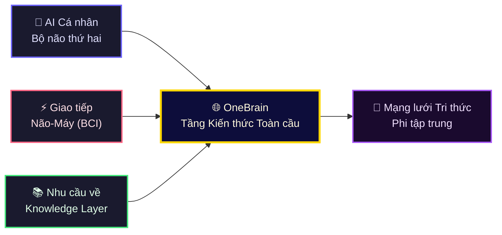
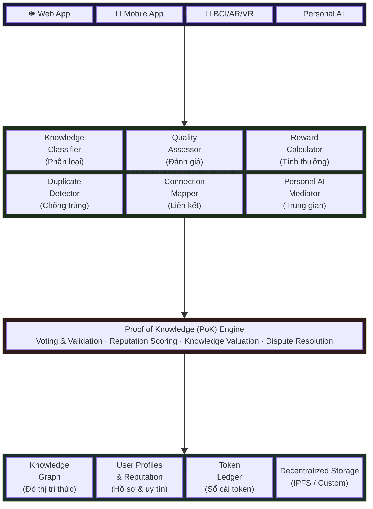
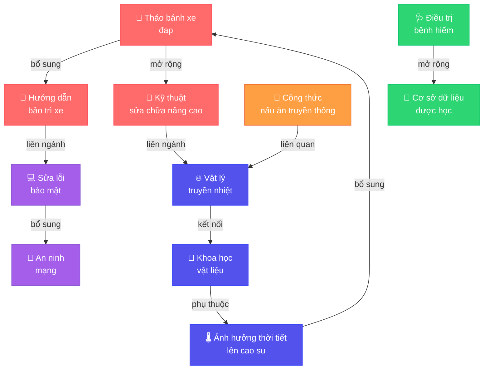
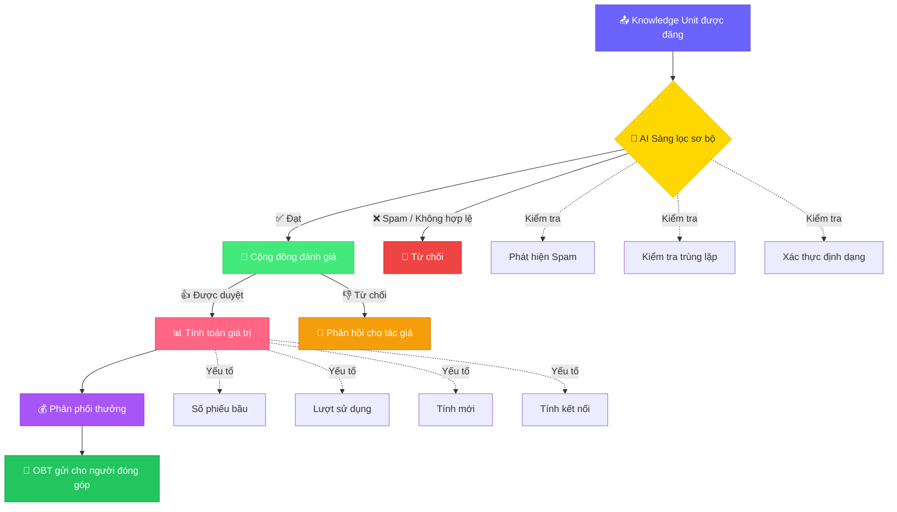
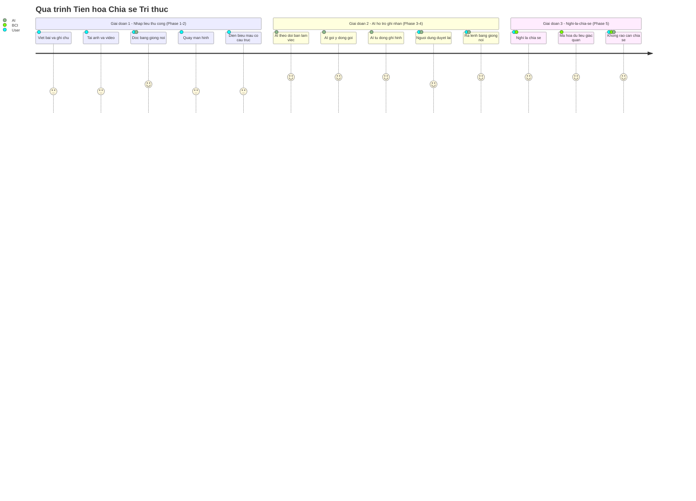
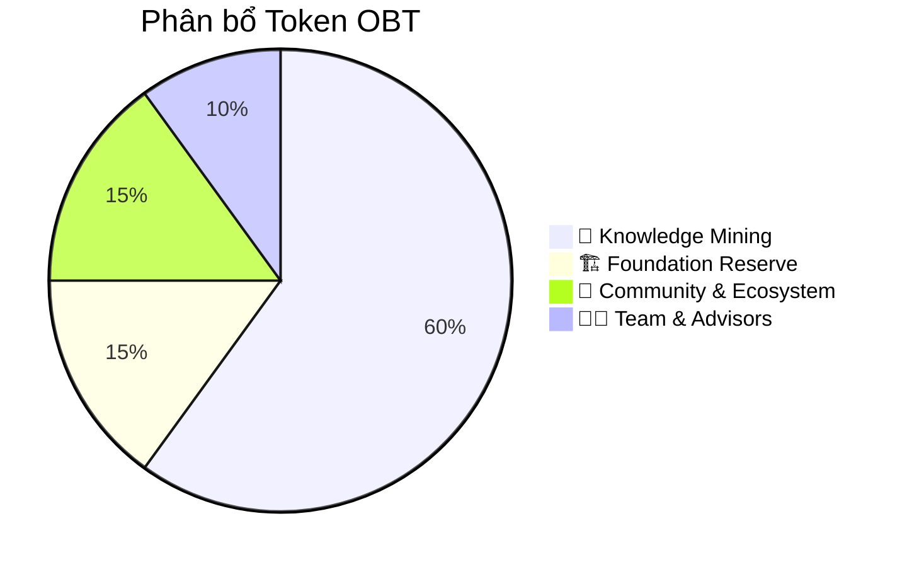
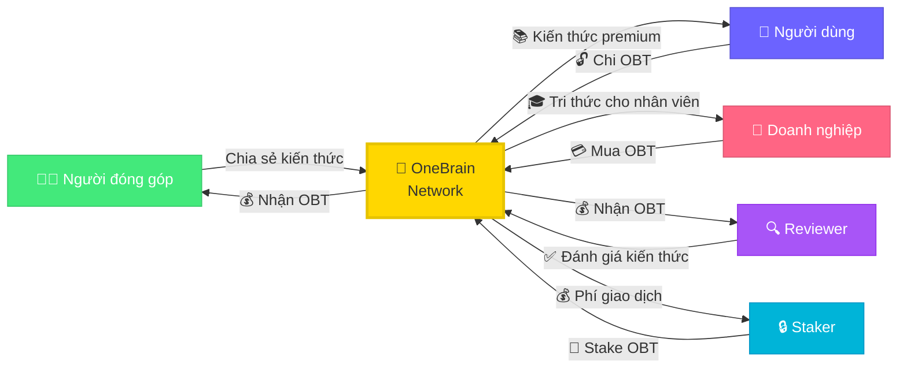
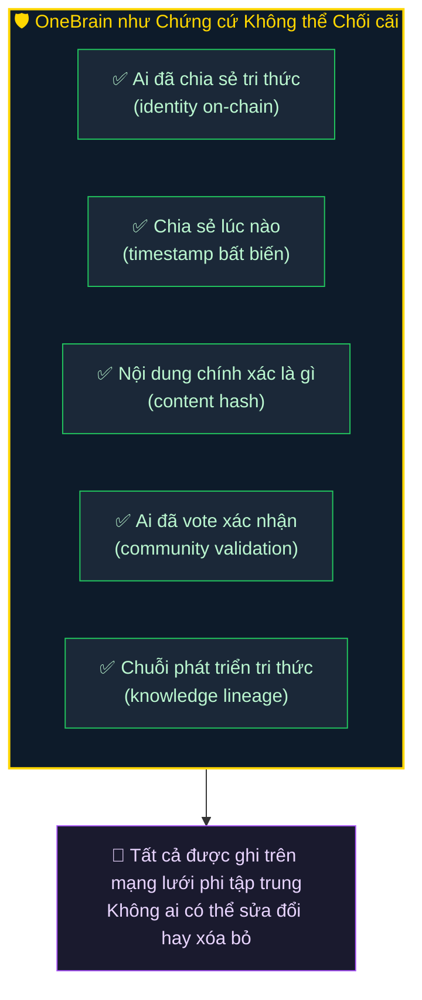
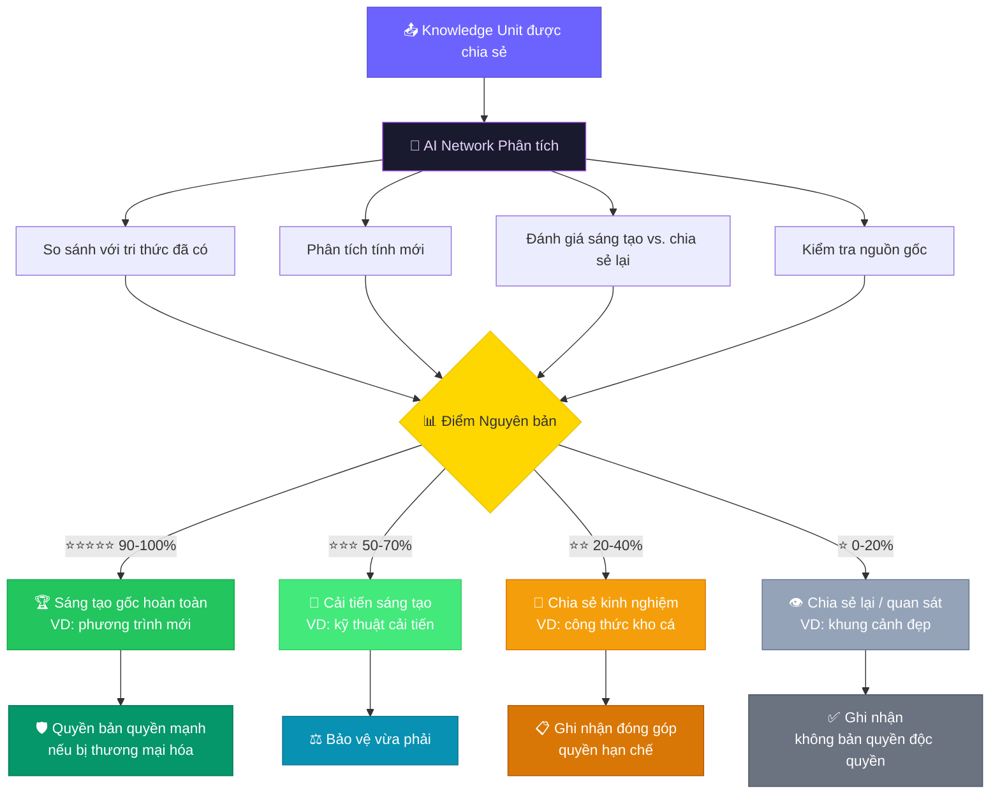
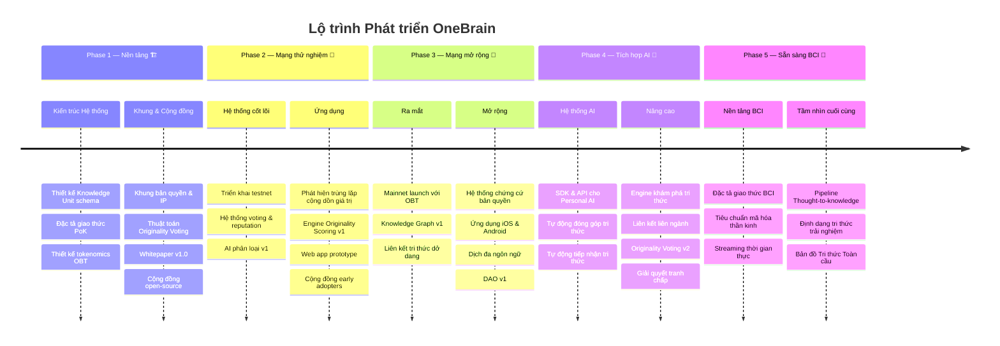

# 🧠 OneBrain

**A Decentralized Knowledge-Sharing Network for Humanity**

<p align="center">
  
</p>

> *"If machines can share knowledge instantly through networks, why can't humans?"*

---

## 1. Tầm nhìn (Vision)

Trong thế giới AI, các hệ thống trí tuệ nhân tạo có thể chia sẻ tri thức cho nhau gần như tức thời thông qua kết nối mạng. Một robot học được cách mở cánh cửa, tất cả các robot khác cũng biết ngay lập tức. Một mô hình AI được huấn luyện trên dữ liệu mới, kiến thức đó có thể được phân phối đến hàng triệu hệ thống khác trong tích tắc.

**Nhưng con người thì không.**

Kiến thức của loài người bị phân mảnh, bị giam cầm trong từng bộ não riêng lẻ, bị giới hạn bởi ngôn ngữ, địa lý, và thời gian. Một bác sĩ ở Việt Nam phát hiện ra phương pháp điều trị mới, có thể mất hàng năm để kiến thức đó đến được với đồng nghiệp ở Brazil. Một kỹ sư giải được bài toán phức tạp, nhưng hàng nghìn kỹ sư khác vẫn đang vật lộn với chính bài toán đó mà không hề hay biết.

**OneBrain ra đời để thay đổi điều này.**

OneBrain là một mạng lưới phi tập trung (decentralized network) lấy cảm hứng từ blockchain, được thiết kế để con người có thể chia sẻ, đóng góp, và tiếp nhận tri thức một cách hiệu quả — giống như cách các AI chia sẻ kiến thức cho nhau qua mạng.

### 1.1. Triết lý: Tri thức không có gì cao siêu

Khi nói đến "tri thức" hay "kiến thức", người ta thường nghĩ đến những thứ hàn lâm — công thức toán học, lý thuyết khoa học, phát minh đột phá. Nhưng **OneBrain không nghĩ vậy.**

**Tri thức là mọi thứ con người quan sát, trải nghiệm, và học được trong cuộc sống hàng ngày.** Nó có thể là:

- 🌅 Một khung cảnh đẹp mà bạn bắt gặp trên đường đi làm
- 🔧 Một mẹo hay để tháo bánh xe đạp mà bạn vô tình phát hiện ra
- 🍜 Một cách nấu phở mà bà bạn truyền lại, không có trong bất kỳ sách dạy nấu ăn nào
- 🌿 Một loài hoa lạ bạn thấy trong rừng mà bạn chưa từng thấy trước đó
- 🛠️ Cách sửa ống nước bị rò mà bạn tự mày mò ra lúc nửa đêm
- 🚗 Con đường tắt tránh kẹt xe mà chỉ dân địa phương mới biết

Hãy tưởng tượng:

> **Anh Tùng, một thợ sửa xe đạp ở Huế**, đang làm việc và phát hiện ra một cách tháo bánh xe nhanh hơn, ít tốn sức hơn. Anh không cần phải viết bài báo khoa học. Anh chỉ cần **nghĩ** — ra lệnh cho AI cá nhân của mình. AI cá nhân tự động xử lý: quay lại hình ảnh, phân tích động tác tay, ghi nhận dụng cụ được dùng, tạo ra mô tả chi tiết kèm chỉ dẫn từng bước — rồi đóng gói tất cả thành một Knowledge Unit và chia sẻ lên OneBrain. Anh Tùng nhận được OBT. Và ở đâu đó trên thế giới, một người đang loay hoay với chiếc xe đạp hỏng sẽ nhận được kiến thức này qua AI cá nhân của họ.

> **Chị Lan đi du lịch Sapa**, đứng trên đỉnh đồi nhìn xuống thung lũng lúa chín vàng lúc hoàng hôn. Chị cảm thấy khung cảnh đẹp đến nghẹt thở. Chị nghĩ: *"Chia sẻ điều này."* AI cá nhân lập tức ghi nhận — tọa độ GPS, hướng nhìn, thời điểm trong ngày, điều kiện thời tiết, và cảm nhận thị giác qua BCI — đóng gói thành tri thức trải nghiệm và đưa lên OneBrain. Những người khác có thể "nhìn thấy" Sapa qua đôi mắt của chị Lan, từ chính góc nhìn đó, vào chính khoảnh khắc đó.

### 1.2. Tri thức "trùng lặp" vẫn có giá trị

Một câu hỏi tự nhiên: *"Nếu đã có người chia sẻ cách tháo bánh xe rồi, thì đóng góp thêm có ý nghĩa gì?"*

**Câu trả lời: Rất có ý nghĩa.**

Trong thế giới thực, không có hai trải nghiệm nào giống hệt nhau. Mỗi người mang đến:

- **Góc nhìn khác biệt** — cùng một kỹ thuật nhưng được giải thích theo cách khác, phù hợp với nhóm người khác
- **Kinh nghiệm bổ sung** — "cách này hiệu quả hơn khi trời mưa", "dùng với loại xe này thì cần điều chỉnh thế này"
- **Độ tin cậy cộng dồn** — khi 100 người xác nhận cùng một kiến thức, nó trở nên đáng tin hơn rất nhiều so với khi chỉ 1 người nói
- **Sự phong phú của dữ liệu** — nhiều góc quay, nhiều cách diễn đạt, nhiều ngữ cảnh giúp AI tổng hợp kiến thức tốt hơn

OneBrain coi mỗi đóng góp như một **neuron** trong bộ não chung. Một neuron đơn lẻ thì yếu, nhưng hàng nghìn neuron cùng kích hoạt cho một kiến thức thì tạo nên **sự hiểu biết sâu sắc và đáng tin cậy** — giống cách bộ não con người thực sự hoạt động.

### 1.3. Tri thức dở dang — Mảnh ghép chờ được hoàn thiện

Bên cạnh tri thức đời thường, những **tri thức hàn lâm, tri thức khó, thậm chí tri thức còn dở dang** cũng là thứ vô cùng quý giá trên OneBrain — có lẽ còn quý giá hơn cả tri thức đã hoàn chỉnh.

**Vì sao?** Vì lịch sử loài người cho thấy những bước nhảy vĩ đại nhất thường không đến từ một bộ não duy nhất, mà từ sự **kết nối giữa nhiều bộ não** — dù họ không hề biết nhau.

Hãy tưởng tượng:

> **Giáo sư Khoa, một nhà vật lý ở Hà Nội**, cảm thấy mình đang đi đúng hướng trong nghiên cứu về động cơ phản trọng lực. Ông có một lý thuyết, một vài phương trình, một trực giác mạnh mẽ — nhưng chưa thể chứng minh hoàn chỉnh. Trong thế giới cũ, ông sẽ giữ nghiên cứu dở dang này trong ngăn kéo, chờ ngày nào đó hoàn thiện — và có thể ngày đó không bao giờ đến.
>
> Nhưng trên OneBrain, ông chia sẻ tri thức dở dang đó.
>
> Điều kỳ diệu xảy ra: **tri thức của ông không đơn độc.** Trên Knowledge Graph, AI phát hiện ra rằng:
> - Một kỹ sư vật liệu ở Đức đã đóng góp dữ liệu về hợp kim siêu dẫn ở nhiệt độ phòng — chính xác là thứ lý thuyết của Giáo sư Khoa cần
> - Một nhà toán học ở Nhật đã giải một phương trình vi phân mà ông đang bế tắc — nhưng trong ngữ cảnh hoàn toàn khác
> - Một **thợ sửa xe đạp ở Cần Thơ** đã chia sẻ quan sát về hiện tượng từ trường kỳ lạ khi xoay bánh xe trong điều kiện nhất định — một bằng chứng thực nghiệm mà Giáo sư Khoa chưa bao giờ nghĩ tới
>
> Mỗi mảnh tri thức riêng lẻ tưởng như không liên quan. Nhưng khi được **kết nối trong cùng một bộ não chung**, chúng ghép lại thành bức tranh hoàn chỉnh.

Đây chính là sức mạnh thực sự của OneBrain: **không ai cần phải hoàn thiện một mình.** Bạn chỉ cần đóng góp mảnh ghép của bạn — dù nó nhỏ bé, dở dang, hay có vẻ không quan trọng. Bộ não chung sẽ tìm ra cách kết nối nó với những mảnh ghép khác.

Cách tiếp cận này giải quyết một trong những bi kịch lớn nhất của tri thức nhân loại: **biết bao nhiêu nghiên cứu dở dang đã chết theo người tạo ra chúng**, biết bao nhiêu ý tưởng thiên tài đã bị lãng quên trong ngăn kéo, biết bao nhiêu bước đột phá đã không xảy ra — chỉ vì hai bộ não đúng không tìm thấy nhau.

OneBrain đảm bảo rằng **không tri thức nào bị lãng phí. Không ý tưởng nào bị bỏ quên. Không bộ não nào phải chiến đấu một mình.**

---

## 2. Bối cảnh & Xu hướng (Context & Trends)

OneBrain được xây dựng trên nền tảng của ba xu hướng công nghệ đang hội tụ:



### 2.1. AI cá nhân — Bộ não thứ hai

Trong tương lai gần, mỗi người sẽ sở hữu một **AI cá nhân (Personal AI)** — một trợ lý trí tuệ nhân tạo hiểu sâu về bạn: kiến thức của bạn, cách bạn tư duy, những gì bạn cần học, và những gì bạn có thể đóng góp. AI cá nhân chính là **bộ não thứ hai** của mỗi người.

### 2.2. Giao tiếp não — máy hai chiều (Brain-Computer Interface)

<p align="center">
  
</p>

Công nghệ **BCI (Brain-Computer Interface)** đang phát triển nhanh chóng với các dự án như Neuralink, Synchron, và nhiều nghiên cứu khác. Việc giao tiếp hai chiều giữa não người và máy tính — nơi con người có thể **xuất** suy nghĩ ra dạng số và **nhập** kiến thức mới trực tiếp — sẽ trở thành hiện thực phổ biến.

### 2.3. Nhu cầu về một "Knowledge Layer" toàn cầu

Khi AI cá nhân và BCI trở nên phổ biến, sẽ xuất hiện nhu cầu cấp thiết về một **tầng kiến thức toàn cầu (Global Knowledge Layer)** — nơi tri thức được:
- **Chuẩn hóa** để máy và người đều có thể hiểu
- **Xác minh** để đảm bảo chất lượng và độ tin cậy
- **Định giá** để người đóng góp được công nhận và trả thưởng
- **Phân phối** một cách công bằng và hiệu quả

**OneBrain chính là tầng kiến thức đó.**

---

## 3. Ý tưởng cốt lõi (Core Concept)

### 3.1. So sánh với Blockchain truyền thống

| Khía cạnh | Blockchain (Bitcoin) | OneBrain |
|---|---|---|
| **Đơn vị cốt lõi** | Transaction (giao dịch) | Knowledge Unit (đơn vị kiến thức) |
| **Cách kiếm token** | Mining — giải bài toán toán học | Contributing — đóng góp kiến thức có giá trị |
| **Cơ chế đồng thuận** | Proof of Work / Proof of Stake | **Proof of Knowledge (PoK)** — chứng minh bằng tri thức |
| **Giá trị nội tại** | Sự khan hiếm và niềm tin | Giá trị thực của tri thức được đóng góp |
| **Mạng lưới** | Ngang hàng (peer-to-peer) | Ngang hàng (brain-to-brain) |
| **Mục tiêu** | Hệ thống tài chính phi tập trung | Hệ thống tri thức phi tập trung |

### 3.2. Proof of Knowledge (PoK) — Chứng minh bằng Tri thức

Thay vì "đào" coin bằng sức mạnh tính toán, người dùng OneBrain **"đào" coin bằng tri thức**. Giá trị của phần thưởng phụ thuộc vào:

- **Tính mới (Novelty):** Kiến thức này có mới không? Đã ai đóng góp trước đó chưa?
- **Tính đúng đắn (Accuracy):** Kiến thức có chính xác, đáng tin cậy không?
- **Tính hữu ích (Utility):** Bao nhiêu người đã sử dụng và hưởng lợi từ kiến thức này?
- **Chiều sâu (Depth):** Kiến thức ở mức độ nông hay sâu?
- **Tính kết nối (Connectivity):** Kiến thức này liên kết và bổ sung cho bao nhiêu tri thức khác?

### 3.3. OneBrain Token (OBT)

**OBT** là đồng tiền số (cryptocurrency) của hệ sinh thái OneBrain:

- 🎁 **Kiếm OBT** bằng cách đóng góp kiến thức có giá trị
- 🔓 **Chi OBT** để truy cập kiến thức chuyên sâu, premium
- 🗳️ **Stake OBT** để tham gia quản trị và bỏ phiếu trong mạng lưới
- 💱 **Giao dịch OBT** trên các sàn trao đổi (tương lai)

---

## 4. Kiến trúc tổng quan (High-Level Architecture)



---

## 5. Các thành phần chính (Core Components)

### 5.1. Knowledge Unit (Đơn vị Kiến thức)

Đây là đơn vị cơ bản nhất trong OneBrain — tương đương với "transaction" trong blockchain. Mỗi Knowledge Unit chứa:

```
Knowledge Unit {
    id:             Mã định danh duy nhất (hash)
    author:         Người đóng góp (địa chỉ ví)
    timestamp:      Thời điểm tạo
    content:        Nội dung kiến thức
    category:       Phân loại (khoa học, kỹ thuật, nghệ thuật, ...)
    tags:           Các nhãn liên quan
    references:     Các Knowledge Unit được tham chiếu
    evidence:       Bằng chứng / nguồn xác minh
    language:       Ngôn ngữ gốc
    difficulty:     Độ khó / chuyên sâu
    
    // Metadata tự động tính toán
    votes:          Số phiếu bầu (upvote / downvote)
    usage_count:    Số lần được truy cập / sử dụng
    novelty_score:  Điểm tính mới
    value_score:    Điểm giá trị tổng hợp
    connections:    Các liên kết đến Knowledge Unit khác
}
```

### 5.2. Knowledge Graph (Đồ thị Tri thức)

Toàn bộ kiến thức trong OneBrain được tổ chức dưới dạng **đồ thị (graph)** — không phải chuỗi tuyến tính như blockchain:

- **Nodes** = Knowledge Units
- **Edges** = Mối quan hệ giữa các Knowledge Units (bổ sung, phản bác, mở rộng, phụ thuộc, ...)



<p align="center">
  
</p>

Cấu trúc đồ thị cho phép:
- 🔍 Tìm kiếm kiến thức liên quan một cách thông minh
- 🧩 Phát hiện các "lỗ hổng" tri thức cần được lấp đầy
- 🌐 Xây dựng "bản đồ tri thức" toàn cầu
- 🔗 Tự động gợi ý kiến thức liên quan cho người dùng

### 5.3. Hệ thống Bỏ phiếu & Đánh giá (Voting & Evaluation)



### 5.4. Hệ thống Danh tiếng (Reputation System)

Mỗi người dùng có một **Reputation Score (Điểm uy tín)** ảnh hưởng đến:

- **Trọng lượng vote:** Người có uy tín cao, vote có trọng lượng lớn hơn
- **Quyền truy cập:** Mở khóa các tính năng và khu vực kiến thức nâng cao
- **Mức thưởng:** Hệ số nhân thưởng cao hơn cho đóng góp
- **Quyền quản trị:** Tham gia các quyết định quan trọng của mạng lưới

Uy tín được xây dựng qua:
- ✅ Đóng góp kiến thức chất lượng cao
- ✅ Review chính xác kiến thức của người khác
- ✅ Được cộng đồng công nhận chuyên môn
- ❌ Bị giảm khi đóng góp sai lệch hoặc spam

### 5.5. Cách chia sẻ Tri thức — Từ bàn phím đến ý nghĩ

BCI là tầm nhìn cuối cùng, nhưng OneBrain phải hoạt động **ngay hôm nay**, rất lâu trước khi giao tiếp não-máy trở nên phổ biến. Việc chia sẻ tri thức tiến hóa qua ba giai đoạn:



<p align="center">
  
</p>
<p align="center"><em>Concept: OneBrain Mobile App — Giao diện Đóng góp Tri thức</em></p>

**Nguyên tắc then chốt:** Ở mọi giai đoạn, rào cản chia sẻ phải thấp nhất có thể. Một thợ sửa xe đạp không cần phải biết viết văn. Một bà ngoại không cần phải hiểu công nghệ. Hệ thống phải đến gặp con người ở nơi họ đang đứng.

> **Ví dụ — Anh Tùng giai đoạn 1:** Anh Tùng chưa có BCI. Anh thậm chí chưa có AI cá nhân. Nhưng anh có thể mở ứng dụng OneBrain trên điện thoại, quay video 2 phút về mẹo tháo bánh xe, thêm vài dòng mô tả, rồi gửi. AI của nền tảng tự động gắn thẻ, phân loại, tạo hình minh họa, và dịch mô tả sang 40 ngôn ngữ. Đóng góp của anh Tùng có mặt trên OneBrain trong vài phút.
>
> **Ví dụ — Anh Tùng giai đoạn 2:** Một năm sau, anh Tùng có AI cá nhân chạy trên điện thoại. Khi anh làm việc, AI theo dõi qua camera đặt trên bàn sửa xe. Khi anh Tùng làm điều gì mà AI nhận ra là mới lạ, nó nhẹ nhàng gợi ý: *"Kỹ thuật đó tôi chưa thấy ai làm. Để tôi đóng gói lại nhé?"* Anh Tùng nói "Ừ" — AI lo hết. Anh Tùng không cần dừng tay.
>
> **Ví dụ — Anh Tùng giai đoạn 3:** Năm 2035, anh Tùng đeo một chiếc băng đô BCI nhẹ. Anh không cần nói. Anh phát hiện mẹo mới, cảm thấy hài lòng, và nghĩ: *"Mọi người nên biết cái này."* Xong.

---

## 6. Kịch bản sử dụng (Use Cases)

### 🌍 Tri thức đời thường — Xương sống của OneBrain

### 🚲 Kịch bản 1: Người thợ sửa xe và mẹo tháo bánh

> Anh Tùng, thợ sửa xe đạp ở Huế, phát hiện ra cách tháo bánh xe nhanh hơn bằng cách đặt nghiêng xe một góc 30 độ. Anh nghĩ: *"Hay đấy, chia sẻ cái này."* AI cá nhân của anh lập tức hành động: ghi lại video góc nhìn thứ nhất qua camera/BCI, phân tích từng động tác tay, nhận diện dụng cụ, đo góc nghiêng, và tự động tạo ra hướng dẫn từng bước kèm hình minh họa. Knowledge Unit được đóng gói và đưa lên OneBrain. Dù đã có 47 hướng dẫn tháo bánh xe trên mạng lưới, đóng góp của anh Tùng vẫn có giá trị — vì nó bổ sung thêm góc nhìn từ một người thợ lành nghề 20 năm kinh nghiệm, với dụng cụ đơn giản và điều kiện thực tế.

### 🌅 Kịch bản 2: Khoảnh khắc đẹp ở Sapa

> Chị Lan đứng trên đỉnh đồi Sapa, nhìn xuống thung lũng lúa chín vàng trong ánh hoàng hôn. Tim chị đập nhanh hơn. Chị chỉ cần nghĩ: *"Chia sẻ."* AI cá nhân qua BCI ghi nhận toàn bộ — tọa độ chính xác, hướng nhìn, góc mắt, cảm xúc sinh học, ánh sáng, âm thanh gió, nhiệt độ — và đóng gói thành một trải nghiệm có thể được "sống lại" bởi bất kỳ ai trên thế giới. Đó không chỉ là một bức ảnh. Đó là một **trải nghiệm tri thức** — biết rằng ở tọa độ này, vào tháng 9, lúc 5:45 chiều, khi trời trong, bạn sẽ thấy điều kỳ diệu.

### 👵 Kịch bản 3: Bí quyết nấu ăn của bà

> Bà Năm, 78 tuổi, ở Cần Thơ, có công thức kho cá bằng nồi đất mà cả xóm ai cũng khen ngon. Bà không biết viết blog, không có mạng xã hội. Nhưng bà có AI cá nhân. Khi bà nấu, AI quan sát, ghi nhận nguyên liệu, thời gian, nhiệt độ, thứ tự các bước, và cả những chi tiết "bí truyền" mà bà thường nói bằng miệng — *"kho lửa liu riu cho tới khi nước sánh lại là được."* Tri thức ẩm thực này, vốn sẽ mất đi khi bà qua đời, giờ được bảo tồn vĩnh viễn trên OneBrain.

---

### 🏢 Tri thức chuyên môn — Nâng tầm giá trị

### 🩺 Kịch bản 4: Bác sĩ chia sẻ ca lâm sàng

> Bác sĩ Minh ở TP.HCM gặp một ca bệnh hiếm và tìm ra phương pháp điều trị hiệu quả. Anh đóng góp kiến thức này lên OneBrain. Hệ thống AI phân loại, kiểm tra tính mới, và đưa vào review bởi các bác sĩ chuyên khoa trên toàn cầu. Sau khi được xác nhận, kiến thức tự động được phân phối đến AI cá nhân của các bác sĩ trên khắp thế giới. Bác sĩ Minh nhận OBT tương xứng với giá trị đóng góp.

### 💻 Kịch bản 5: Lập trình viên giải quyết bug phức tạp

> Một lập trình viên tìm ra cách giải quyết một lỗi bảo mật nghiêm trọng. Thay vì chỉ sửa trong dự án của mình, cô ấy đóng góp kiến thức lên OneBrain. AI cá nhân của hàng nghìn lập trình viên khác tự động nhận và tích hợp kiến thức này, ngăn chặn lỗi tương tự trước khi nó xảy ra.

### 🎓 Kịch bản 6: Học tập cá nhân hóa

> Sinh viên Hùng muốn học về vật lý lượng tử. AI cá nhân của Hùng kết nối với OneBrain, tìm kiếm và tổng hợp các Knowledge Units phù hợp với trình độ và phong cách học của Hùng, tạo ra một lộ trình học tập cá nhân hóa. Mỗi kiến thức đã được xác minh và đánh giá bởi cộng đồng.

### 🧠 Kịch bản 7: Tương lai với BCI

> Năm 2035. An đeo thiết bị BCI, kết nối trực tiếp với AI cá nhân. Khi An gặp một vấn đề kỹ thuật, AI cá nhân tự động truy vấn OneBrain, tìm kiến thức liên quan, và "truyền" kiến thức đó vào nhận thức của An gần như tức thời — giống như cách Neo học kung fu trong The Matrix, nhưng là đời thực.

---

## 7. Nguồn phần thưởng (Reward Source)

Một câu hỏi quan trọng: **OBT đến từ đâu?**

### 7.1. Cơ chế phát hành (Minting)



| Phân bổ | % | Mô tả |
|---|---|---|
| 🌱 Knowledge Mining | 60% | Phát hành dần qua đóng góp kiến thức (giảm dần theo thời gian — tương tự Bitcoin halving) |
| 🏗️ Foundation Reserve | 15% | Quỹ phát triển dự án |
| 👥 Community & Ecosystem | 15% | Thưởng cho reviewer, validator, và hệ sinh thái |
| 🧑‍💼 Team & Advisors | 10% | Đội ngũ phát triển (vesting schedule) |

### 7.2. Cơ chế tuần hoàn (Token Circulation)



---

## 8. Bản quyền & Quyền sở hữu tri thức (Copyright & Intellectual Property)

### 8.1. Nguyên tắc cốt lõi: Tri thức đã chia sẻ là tự do

OneBrain đi theo triết lý rõ ràng:

> **Tri thức một khi đã được chia sẻ lên OneBrain, nó thuộc về nhân loại.**

Người đóng góp đã nhận phần thưởng OBT tại thời điểm chia sẻ — đó là sự ghi nhận và đền đáp cho công sức của họ. Tri thức sau đó được tự do lưu thông, ai cũng có thể tiếp cận, học hỏi, và xây dựng tiếp.

**Tại sao?** Vì nếu tri thức bị khóa sau bản quyền, OneBrain sẽ không khác gì thế giới cũ — nơi kiến thức bị phân mảnh, bị giam cầm, và không thể kết nối thành bộ não chung.

### 8.2. OneBrain như chứng cứ bản quyền

Tuy nhiên, **tự do trong OneBrain không có nghĩa là bất kỳ ai cũng được lợi dụng bên ngoài OneBrain.**

Nếu một cá nhân hoặc tổ chức lấy tri thức từ OneBrain để **kiếm lợi thương mại bên ngoài mạng lưới** (ví dụ: đăng ký bằng sáng chế, thương mại hóa sản phẩm, xuất bản sách...), thì người đóng góp gốc hoàn toàn có quyền yêu cầu bản quyền.

Và lúc này, OneBrain trở thành **bằng chứng không thể chối cãi:**



Nói cách khác: **Trong OneBrain, tri thức tự do. Ra ngoài OneBrain, người đóng góp được bảo vệ.**

### 8.3. Không phải ai cũng "sở hữu" cái mình chia sẻ

Đây là điểm tinh tế nhất trong cơ chế bản quyền của OneBrain.

Khi bà Năm chia sẻ công thức kho cá — **bà có thực sự là "chủ sở hữu" công thức đó không?** Có lẽ không. Công thức đó có thể đã tồn tại hàng trăm năm, được truyền từ đời này sang đời khác. Bà Năm là **người chia sẻ**, đóng góp **góc nhìn và kinh nghiệm cá nhân** của bà — nhưng bà không "phát minh" ra món kho cá.

Ngược lại, nếu Giáo sư Khoa chia sẻ một phương trình hoàn toàn mới mà ông tự phát triển — đó rõ ràng là **sáng tạo gốc** của ông.

Vậy làm sao phân biệt? Bằng **cơ chế bỏ phiếu tính nguyên bản (Originality Voting):**

### 8.4. Originality Voting — Bỏ phiếu tính nguyên bản

Khi một Knowledge Unit được chia sẻ, mạng lưới AI cá nhân tham gia OneBrain sẽ **tự động đánh giá mức độ nguyên bản** của nó:



Cơ chế này hoạt động **tự động và phi tập trung** — được thực hiện bởi mạng lưới AI cá nhân, tương tự cách các node trong blockchain xác nhận giao dịch. Không có một tổ chức trung ương nào quyết định ai có bản quyền — cộng đồng AI quyết định.

### 8.5. Tóm tắt triết lý bản quyền

| Tình huống | Xử lý |
|---|---|
| Học hỏi từ OneBrain cho bản thân | ✅ Hoàn toàn tự do |
| Sử dụng tri thức để làm việc, giải quyết vấn đề | ✅ Hoàn toàn tự do |
| Xây dựng tiếp, phát triển tri thức | ✅ Hoàn toàn tự do, khuyến khích |
| Thương mại hóa bên ngoài OneBrain | ⚠️ Người đóng góp gốc có thể yêu cầu quyền lợi |
| Đăng ký bằng sáng chế từ tri thức OneBrain | ⚠️ OneBrain là chứng cứ prior art chống lại |
| Claim bản quyền cho tri thức không nguyên bản | ❌ Originality Score thấp → không đủ cơ sở |

---

## 9. Điểm khác biệt (Differentiators)

| So sánh | Wikipedia | Stack Overflow | OneBrain |
|---|---|---|---|
| **Cấu trúc** | Bài viết dài | Hỏi & Đáp | Đồ thị tri thức (Knowledge Graph) |
| **Phần thưởng** | Không có | Điểm danh tiếng | Tiền số (OBT) có giá trị thật |
| **AI tích hợp** | Không | Không | AI phân loại, đánh giá, phân phối |
| **Cá nhân hóa** | Không | Không | AI cá nhân tùy chỉnh kiến thức |
| **BCI Ready** | Không | Không | Thiết kế sẵn sàng cho BCI |
| **Phi tập trung** | Tập trung | Tập trung | Phi tập trung (decentralized) |
| **Ownership** | Nền tảng sở hữu | Nền tảng sở hữu | Người đóng góp sở hữu |
| **Bản quyền** | CC BY-SA | Nền tảng sở hữu | Tự do trong mạng, bảo vệ bên ngoài |

---

## 10. Lộ trình phát triển (Roadmap)



### Phase 1 — Foundation (Nền tảng) 🏗️
> *Thiết kế bản thiết kế của bộ não chung*

- [ ] Thiết kế chi tiết kiến trúc hệ thống
- [ ] Xây dựng Knowledge Unit schema & mô hình dữ liệu Knowledge Graph
- [ ] Đặc tả giao thức Proof of Knowledge (PoK)
- [ ] Thiết kế tokenomics OBT (phát hành, tuần hoàn, mô hình halving)
- [ ] Đặc tả khung bản quyền & sở hữu trí tuệ (Copyright & IP)
- [ ] Thiết kế thuật toán Originality Voting (bỏ phiếu tính nguyên bản)
- [ ] Xuất bản Whitepaper v1.0
- [ ] Thiết lập cộng đồng open-source (GitHub, Discord, tài liệu quản trị)

### Phase 2 — Alpha Network (Mạng thử nghiệm) 🧪
> *Xây dựng những neuron đầu tiên*

- [ ] Triển khai mạng lưới thử nghiệm (testnet)
- [ ] Hệ thống voting & reputation cơ bản
- [ ] AI phân loại và đánh giá kiến thức v1
- [ ] Hệ thống phát hiện trùng lặp kèm cộng dồn giá trị (ghi nhận đóng góp "trùng" vẫn có giá trị)
- [ ] Engine chấm điểm Originality Scoring v1
- [ ] Web app đóng góp & duyệt Knowledge Unit (prototype)
- [ ] Cộng đồng early adopters (nhà nghiên cứu, giáo viên, lập trình viên)

### Phase 3 — Beta Network (Mạng mở rộng) 🚀
> *Bộ não bắt đầu suy nghĩ*

- [ ] Mainnet launch với OBT token
- [ ] Knowledge Graph v1 — liên kết tri thức, phát hiện lỗ hổng, trực quan hóa bản đồ tri thức
- [ ] Liên kết tri thức dở dang — AI tự động phát hiện tri thức bổ sung nhau giữa các người đóng góp
- [ ] Hệ thống chứng cứ bản quyền — bằng chứng đóng góp bất biến trên chain (timestamp, hash, lineage)
- [ ] Ứng dụng di động (iOS & Android)
- [ ] Dịch đa ngôn ngữ thời gian thực
- [ ] Nền tảng quản trị cộng đồng (DAO v1)

### Phase 4 — AI Integration (Tích hợp AI) 🤖
> *AI cá nhân gia nhập mạng lưới*

- [ ] SDK & API cho Personal AI kết nối OneBrain
- [ ] Tự động đóng góp tri thức — AI quan sát, đóng gói, và chia sẻ thay cho người dùng
- [ ] Tự động tiếp nhận tri thức — AI tìm kiếm, tổng hợp, và truyền tải tri thức phù hợp
- [ ] Engine khám phá & đề xuất tri thức bằng AI
- [ ] Liên kết tri thức liên ngành — kết nối tri thức giữa các lĩnh vực không liên quan (ví dụ: thợ xe đạp ↔ vật lý)
- [ ] Originality Voting v2 — đánh giá phi tập trung bởi mạng lưới AI cá nhân
- [ ] Giao thức giải quyết tranh chấp bản quyền

### Phase 5 — BCI Ready (Sẵn sàng BCI) 🧠
> *Truyền tri thức não-tới-não*

- [ ] Đặc tả giao thức giao tiếp não-máy (BCI)
- [ ] Tiêu chuẩn mã hóa / giải mã tri thức thần kinh
- [ ] Streaming tri thức thời gian thực (chia sẻ trải nghiệm trực tiếp)
- [ ] Pipeline "Thought-to-knowledge" — nghĩ là chia sẻ
- [ ] Định dạng tri thức trải nghiệm — ghi lại không chỉ dữ liệu mà cả ngữ cảnh giác quan (hình ảnh, âm thanh, cảm xúc)
- [ ] Bản đồ Tri thức Toàn cầu — trực quan hóa sống động, có thể duyệt, toàn bộ tri thức nhân loại

---

## 11. Tuyên ngôn (Manifesto)

> **Tri thức là sức mạnh. Tri thức được chia sẻ là sức mạnh nhân lên.**
>
> Chúng tôi tin rằng mỗi bộ não con người chứa đựng những tri thức độc đáo và có giá trị. Chúng tôi tin rằng rào cản lớn nhất của tiến bộ nhân loại không phải là thiếu kiến thức, mà là thiếu khả năng chia sẻ kiến thức.
>
> OneBrain được tạo ra để phá bỏ rào cản đó.
>
> Trong tương lai mà chúng tôi hình dung, mỗi người không chỉ mang bộ não của riêng mình, mà còn được kết nối với **một bộ não chung** — nơi tri thức của toàn nhân loại được lưu trữ, xác minh, và chia sẻ. Nơi mà khi một người học được điều gì mới, cả thế giới cùng khôn lên.
>
> **One Brain. Shared Knowledge. Unlimited Potential.**

---

## 12. Liên hệ & Đóng góp

OneBrain là dự án **mã nguồn mở**. Chúng tôi hoan nghênh mọi đóng góp từ cộng đồng.

- 📧 **Email:** shpy2001@gmail.com
- 🌐 **Website:** Coming Soon
- 💬 **Community:** Coming Soon
- 📄 **Whitepaper:** [Coming Soon](docs/whitepaper.md)

### 🤝 Bắt đầu đóng góp

- Đọc [Hướng dẫn Đóng góp](CONTRIBUTING.md) để biết cách tham gia
- Xem [Quy tắc Ứng xử](CODE_OF_CONDUCT.md) để hiểu văn hóa cộng đồng
- Kiểm tra [Issues](../../issues) để tìm việc cần làm
- Xem [CONTRIBUTORS.md](CONTRIBUTORS.md) — danh sách những bộ não đã đóng góp

### 📜 Giấy phép

Dự án này được phân phối dưới giấy phép [MIT License](LICENSE) — tự do sử dụng, sửa đổi, và phân phối, đúng tinh thần OneBrain.

---

<p align="center">
  <i>Built for Humanity. Powered by Knowledge. Secured by Trust.</i>
  <br><br>
  <b>🧠 One Brain. Shared Knowledge. Unlimited Potential. 🧠</b>
</p>
