```mermaid
flowchart TD
    Start([Knowledge Unit �ược �ăng]) --> PreScreen["🤖 AI Pre-screening<br/>(Sàng l�c sơ bộ tự động: spam, trùng lặp, định dạng)"]
    PreScreen --> CommReview["👥 Community Review<br/>(�ánh giá và b� phiếu từ cộng đồng chuyên gia)"]
    CommReview --> ValueCalc["📊 Value Calculation<br/>(Tính toán giá trị dựa trên phiếu bầu, lượt dùng, tính mới...)"]
    ValueCalc --> RewardDist["💰 Reward Distribution<br/>(Phân phối token OBT cho ngư�i đóng góp)"]

    classDef stepClass fill:#ffffff,stroke:#2563eb,stroke-width:1.5px,color:#1e40af;
    classDef startClass fill:#eff6ff,stroke:#1d4ed8,stroke-width:2px,color:#1e3a8a,font-weight:bold;
    class PreScreen,CommReview,ValueCalc,RewardDist stepClass;
    class Start startClass;
```

```mermaid
flowchart TD
    subgraph Stage1 ["GIAI �OẠN 1: Nhập liệu thủ công (Phase 1-2) 📱💻"]
        direction TB
        S1_Desc["Ngư�i dùng trực tiếp tạo và gửi tri thức:"]
        S1_Items["• Văn bản: Viết bài, ghi chú, tài liệu hướng dẫn<br/>• Ảnh & Video: Tải lên minh h�a trực quan<br/>• Gi�ng nói: ��c giải thích (AI chuyển thành text & cấu trúc hóa)<br/>• Quay màn hình: Ghi lại quy trình, thao tác mẫu<br/>• Biểu mẫu có cấu trúc: �i�n theo các template có sẵn"]
        S1_Summary["→ Tương tự viết blog hay Stack Overflow, nhưng có AI hỗ trợ định dạng & phân loại"]
        S1_Desc --> S1_Items --> S1_Summary
    end

    subgraph Stage2 ["GIAI �OẠN 2: AI hỗ trợ ghi nhận (Phase 3-4) 🤖📷"]
        direction TB
        S2_Desc["AI cá nhân quan sát và giúp đóng gói tri thức:"]
        S2_Items["• AI theo dõi bạn làm việc và gợi ý: 'Cách đó hay đấy. �ể tôi đóng gói nhé?'<br/>• AI tự động quay video qua điện thoại, kính thông minh, thiết bị đeo<br/>• AI tự tạo mô tả, hướng dẫn từng bước và gắn thẻ từ video gốc<br/>• Ngư�i dùng chỉ cần xem lại và duyệt trước khi xuất bản<br/>• Ra lệnh bằng gi�ng nói: 'AI ơi, chia sẻ cái tôi vừa làm đi'"]
        S2_Summary["→ Bạn tập trung làm việc, AI lo phần lập tài liệu"]
        S2_Desc --> S2_Items --> S2_Summary
    end

    subgraph Stage3 ["GIAI �OẠN 3: Nghĩ-là-chia-sẻ (Phase 5) 🧠⚡"]
        direction TB
        S3_Desc["Thiết bị BCI cho phép chia sẻ trực tiếp từ não bộ:"]
        S3_Items["• Chỉ cần nghĩ 'chia sẻ cái này' → AI tự động ghi nhận trải nghiệm<br/>• Dữ liệu giác quan (hình ảnh, âm thanh, cảm xúc) được mã hóa trực tiếp<br/>• Gần như loại b� hoàn toàn khoảng cách giữa suy nghĩ và chia sẻ"]
        S3_Summary["→ Bạn nghĩ, thế giới lập tức thấu hiểu"]
        S3_Desc --> S3_Items --> S3_Summary
    end

    Stage1 --> Stage2 --> Stage3

    classDef stageClass fill:#f8fafc,stroke:#cbd5e1,stroke-width:1.5px,color:#0f172a;
    classDef descClass fill:#ffffff,stroke:none,color:#334155,text-align:left;
    classDef itemsClass fill:#ffffff,stroke:#e2e8f0,stroke-width:1px,color:#475569,text-align:left;
    classDef sumClass fill:#eff6ff,stroke:#bfdbfe,stroke-width:1px,color:#1e40af,font-weight:bold,text-align:left;
    
    class Stage1,Stage2,Stage3 stageClass;
    class S1_Desc,S2_Desc,S3_Desc descClass;
    class S1_Items,S2_Items,S3_Items itemsClass;
    class S1_Summary,S2_Summary,S3_Summary sumClass;
```

# 🧠 OneBrain

**A Decentralized Knowledge-Sharing Network for Humanity**

> *"If machines can share knowledge instantly through networks, why can't humans?"*

---

## 1. Tầm nhìn (Vision)

Trong thế giới AI, các hệ thống trí tuệ nhân tạo có thể chia sẻ tri thức cho nhau gần như tức th�i thông qua kết nối mạng. Một robot h�c được cách mở cánh cửa, tất cả các robot khác cũng biết ngay lập tức. Một mô hình AI được huấn luyện trên dữ liệu mới, kiến thức đó có thể được phân phối đến hàng triệu hệ thống khác trong tích tắc.

**Nhưng con ngư�i thì không.**

Kiến thức của loài ngư�i bị phân mảnh, bị giam cầm trong từng bộ não riêng lẻ, bị giới hạn bởi ngôn ngữ, địa lý, và th�i gian. Một bác sĩ ở Việt Nam phát hiện ra phương pháp đi�u trị mới, có thể mất hàng năm để kiến thức đó đến được với đồng nghiệp ở Brazil. Một kỹ sư giải được bài toán phức tạp, nhưng hàng nghìn kỹ sư khác vẫn đang vật lộn với chính bài toán đó mà không h� hay biết.

**OneBrain ra đ�i để thay đổi đi�u này.**

OneBrain là một mạng lưới phi tập trung (decentralized network) lấy cảm hứng từ blockchain, được thiết kế để con ngư�i có thể chia sẻ, đóng góp, và tiếp nhận tri thức một cách hiệu quả — giống như cách các AI chia sẻ kiến thức cho nhau qua mạng.

### 1.1. Triết lý: Tri thức không có gì cao siêu

Khi nói đến "tri thức" hay "kiến thức", ngư�i ta thư�ng nghĩ đến những thứ hàn lâm — công thức toán h�c, lý thuyết khoa h�c, phát minh đột phá. Nhưng **OneBrain không nghĩ vậy.**

**Tri thức là m�i thứ con ngư�i quan sát, trải nghiệm, và h�c được trong cuộc sống hàng ngày.** Nó có thể là:

- 🌅 Một khung cảnh đẹp mà bạn bắt gặp trên đư�ng đi làm
- 🔧 Một mẹo hay để tháo bánh xe đạp mà bạn vô tình phát hiện ra
- � Một cách nấu phở mà bà bạn truy�n lại, không có trong bất kỳ sách dạy nấu ăn nào
- 🌿 Một loài hoa lạ bạn thấy trong rừng mà bạn chưa từng thấy trước đó
- 🛠� Cách sửa ống nước bị rò mà bạn tự mày mò ra lúc nửa đêm
- 🚗 Con đư�ng tắt tránh kẹt xe mà chỉ dân địa phương mới biết

Hãy tưởng tượng:

> **Anh Tùng, một thợ sửa xe đạp ở Huế**, đang làm việc và phát hiện ra một cách tháo bánh xe nhanh hơn, ít tốn sức hơn. Anh không cần phải viết bài báo khoa h�c. Anh chỉ cần **nghĩ** — ra lệnh cho AI cá nhân của mình. AI cá nhân tự động xử lý: quay lại hình ảnh, phân tích động tác tay, ghi nhận dụng cụ được dùng, tạo ra mô tả chi tiết kèm chỉ dẫn từng bước — rồi đóng gói tất cả thành một Knowledge Unit và chia sẻ lên OneBrain. Anh Tùng nhận được OBT. Và ở đâu đó trên thế giới, một ngư�i đang loay hoay với chiếc xe đạp h�ng sẽ nhận được kiến thức này qua AI cá nhân của h�.

> **Chị Lan đi du lịch Sapa**, đứng trên đỉnh đồi nhìn xuống thung lũng lúa chín vàng lúc hoàng hôn. Chị cảm thấy khung cảnh đẹp đến nghẹt thở. Chị nghĩ: *"Chia sẻ đi�u này."* AI cá nhân lập tức ghi nhận — t�a độ GPS, hướng nhìn, th�i điểm trong ngày, đi�u kiện th�i tiết, và cảm nhận thị giác qua BCI — đóng gói thành tri thức trải nghiệm và đưa lên OneBrain. Những ngư�i khác có thể "nhìn thấy" Sapa qua đôi mắt của chị Lan, từ chính góc nhìn đó, vào chính khoảnh khắc đó.

### 1.2. Tri thức "trùng lặp" vẫn có giá trị

Một câu h�i tự nhiên: *"Nếu đã có ngư�i chia sẻ cách tháo bánh xe rồi, thì đóng góp thêm có ý nghĩa gì?"*

**Câu trả l�i: Rất có ý nghĩa.**

Trong thế giới thực, không có hai trải nghiệm nào giống hệt nhau. Mỗi ngư�i mang đến:

- **Góc nhìn khác biệt** — cùng một kỹ thuật nhưng được giải thích theo cách khác, phù hợp với nhóm ngư�i khác
- **Kinh nghiệm bổ sung** — "cách này hiệu quả hơn khi tr�i mưa", "dùng với loại xe này thì cần đi�u chỉnh thế này"
- **�ộ tin cậy cộng dồn** — khi 100 ngư�i xác nhận cùng một kiến thức, nó trở nên đáng tin hơn rất nhi�u so với khi chỉ 1 ngư�i nói
- **Sự phong phú của dữ liệu** — nhi�u góc quay, nhi�u cách diễn đạt, nhi�u ngữ cảnh giúp AI tổng hợp kiến thức tốt hơn

OneBrain coi mỗi đóng góp như một **neuron** trong bộ não chung. Một neuron đơn lẻ thì yếu, nhưng hàng nghìn neuron cùng kích hoạt cho một kiến thức thì tạo nên **sự hiểu biết sâu sắc và đáng tin cậy** — giống cách bộ não con ngư�i thực sự hoạt động.

### 1.3. Tri thức dở dang — Mảnh ghép ch� được hoàn thiện

Bên cạnh tri thức đ�i thư�ng, những **tri thức hàn lâm, tri thức khó, thậm chí tri thức còn dở dang** cũng là thứ vô cùng quý giá trên OneBrain — có lẽ còn quý giá hơn cả tri thức đã hoàn chỉnh.

**Vì sao?** Vì lịch sử loài ngư�i cho thấy những bước nhảy vĩ đại nhất thư�ng không đến từ một bộ não duy nhất, mà từ sự **kết nối giữa nhi�u bộ não** — dù h� không h� biết nhau.

Hãy tưởng tượng:

> **Giáo sư Khoa, một nhà vật lý ở Hà Nội**, cảm thấy mình đang đi đúng hướng trong nghiên cứu v� động cơ phản tr�ng lực. Ông có một lý thuyết, một vài phương trình, một trực giác mạnh mẽ — nhưng chưa thể chứng minh hoàn chỉnh. Trong thế giới cũ, ông sẽ giữ nghiên cứu dở dang này trong ngăn kéo, ch� ngày nào đó hoàn thiện — và có thể ngày đó không bao gi� đến.
>
> Nhưng trên OneBrain, ông chia sẻ tri thức dở dang đó.
>
> �i�u kỳ diệu xảy ra: **tri thức của ông không đơn độc.** Trên Knowledge Graph, AI phát hiện ra rằng:
> - Một kỹ sư vật liệu ở �ức đã đóng góp dữ liệu v� hợp kim siêu dẫn ở nhiệt độ phòng — chính xác là thứ lý thuyết của Giáo sư Khoa cần
> - Một nhà toán h�c ở Nhật đã giải một phương trình vi phân mà ông đang bế tắc — nhưng trong ngữ cảnh hoàn toàn khác
> - Một **thợ sửa xe đạp ở Cần Thơ** đã chia sẻ quan sát v� hiện tượng từ trư�ng kỳ lạ khi xoay bánh xe trong đi�u kiện nhất định — một bằng chứng thực nghiệm mà Giáo sư Khoa chưa bao gi� nghĩ tới
>
> Mỗi mảnh tri thức riêng lẻ tưởng như không liên quan. Nhưng khi được **kết nối trong cùng một bộ não chung**, chúng ghép lại thành bức tranh hoàn chỉnh.

�ây chính là sức mạnh thực sự của OneBrain: **không ai cần phải hoàn thiện một mình.** Bạn chỉ cần đóng góp mảnh ghép của bạn — dù nó nh� bé, dở dang, hay có vẻ không quan tr�ng. Bộ não chung sẽ tìm ra cách kết nối nó với những mảnh ghép khác.

Cách tiếp cận này giải quyết một trong những bi kịch lớn nhất của tri thức nhân loại: **biết bao nhiêu nghiên cứu dở dang đã chết theo ngư�i tạo ra chúng**, biết bao nhiêu ý tưởng thiên tài đã bị lãng quên trong ngăn kéo, biết bao nhiêu bước đột phá đã không xảy ra — chỉ vì hai bộ não đúng không tìm thấy nhau.

OneBrain đảm bảo rằng **không tri thức nào bị lãng phí. Không ý tưởng nào bị b� quên. Không bộ não nào phải chiến đấu một mình.**

---

## 2. Bối cảnh & Xu hướng (Context & Trends)

OneBrain được xây dựng trên n�n tảng của ba xu hướng công nghệ đang hội tụ:

### 2.1. AI cá nhân — Bộ não thứ hai

Trong tương lai gần, mỗi ngư�i sẽ sở hữu một **AI cá nhân (Personal AI)** — một trợ lý trí tuệ nhân tạo hiểu sâu v� bạn: kiến thức của bạn, cách bạn tư duy, những gì bạn cần h�c, và những gì bạn có thể đóng góp. AI cá nhân chính là **bộ não thứ hai** của mỗi ngư�i.

### 2.2. Giao tiếp não — máy hai chi�u (Brain-Computer Interface)

Công nghệ **BCI (Brain-Computer Interface)** đang phát triển nhanh chóng với các dự án như Neuralink, Synchron, và nhi�u nghiên cứu khác. Việc giao tiếp hai chi�u giữa não ngư�i và máy tính — nơi con ngư�i có thể **xuất** suy nghĩ ra dạng số và **nhập** kiến thức mới trực tiếp — sẽ trở thành hiện thực phổ biến.

### 2.3. Nhu cầu vá»```mermaid
flowchart TD
    subgraph USER_LAYER ["👤 USER LAYER (Tầng Ngư�i dùng)"]
        direction LR
        WebApp["Web App"]
        MobileApp["Mobile App"]
        BCI["BCI / AR / VR"]
        PersonalAI["Personal AI"]
    end

    subgraph AI_LAYER ["🤖 AI LAYER (Tầng Trí tuệ nhân tạo)"]
        direction TB
        subgraph AI_Engines ["�ộng cơ AI"]
            direction LR
            Classifier["Knowledge Classifier<br/>(Phân loại)"]
            Assessor["Quality Assessor<br/>(�ánh giá)"]
            RewardCalc["Reward Calculator<br/>(Tính thưởng)"]
        end
        subgraph AI_Helpers ["Trợ lý AI"]
            direction LR
            DupDetector["Duplicate Detector<br/>(Chống trùng)"]
            ConnMapper["Connection Mapper<br/>(Liên kết)"]
            Mediator["Personal AI Mediator<br/>(Trung gian)"]
        end
        AI_Engines --- AI_Helpers
    end

    subgraph CONSENSUS_LAYER ["⛓� CONSENSUS LAYER (Tầng �ồng thuận)"]
        PoK["Proof of Knowledge (PoK) Engine<br/>• B� phiếu & Xác minh   • Tính điểm uy tín<br/>• �ịnh giá kiến thức     • Giải quyết tranh chấp"]
    end

    subgraph DATA_LAYER ["📦 DATA LAYER (Tầng Dữ liệu)"]
        direction TB
        subgraph CoreData ["Dữ liệu cốt lõi"]
            direction LR
            KGraph["Knowledge Graph<br/>(�ồ thị tri thức)"]
            Profiles["User Profiles & Reputation<br/>(Hồ sơ & Uy tín)"]
            Ledger["Token Ledger<br/>(Sổ cái token)"]
        end
        Storage["Decentralized Storage<br/>(Lưu trữ phi tập trung IPFS / Tùy chỉnh)"]
        CoreData --- Storage
    end

    USER_LAYER --> AI_LAYER
    AI_LAYER --> CONSENSUS_LAYER
    CONSENSUS_LAYER --> DATA_LAYER

    %% Styling
    classDef layerClass fill:#f8fafc,stroke:#334155,stroke-width:2px,color:#0f172a,font-weight:bold;
    classDef nodeClass fill:#ffffff,stroke:#2563eb,stroke-width:1px,color:#1e40af;
    
    class USER_LAYER,AI_LAYER,CONSENSUS_LAYER,DATA_LAYER layerClass;
    class WebApp,MobileApp,BCI,PersonalAI,Classifier,Assessor,RewardCalc,DupDetector,ConnMapper,Mediator,PoK,KGraph,Profiles,Ledger,Storage nodeClass;
```BCI/AR/VR│  │ Personal AI  │   │
│   └────┬─────┘  └────┬─────┘  └────┬─────┘  └──────┬───────┘   │
│        └──────────────┴─────────────┴───────────────┘           │
└──────────────────────────────┬──────────────────────────────────┘
                               │
┌──────────────────────────────▼──────────────────────────────────�
│                 🤖 AI LAYER (Tầng Trí tuệ nhân tạo)            │
│                                                                 │
│   ┌───────────────�  ┌────────────────�  ┌─────────────────�   │
│   │  Knowledge     │  │  Quality        │  │  Reward          │   │
│   │  Classifier    │  │  Assessor       │  │  Calculator      │   │
│   │  (Phân loại)   │  │  (�ánh giá)     │  │  (Tính thưởng)   │   │
│   └───────────────┘  └────────────────┘  └─────────────────┘   │
│   ┌───────────────�  ┌────────────────�  ┌─────────────────�   │
│   │  Duplicate     │  │  Connection     │  │  Personal AI     │   │
│   │  Detector      │  │  Mapper         │  │  Mediator        │   │
│   │  (Chống trùng) │  │  (Liên kết)     │  │  (Trung gian)    │   │
│   └───────────────┘  └────────────────┘  └─────────────────┘   │
└──────────────────────────────┬──────────────────────────────────┘
                               │
┌──────────────────────────────▼──────────────────────────────────�
│              ⛓� CONSENSUS LAYER (Tầng �ồng thuận)               │
│                                                                 │
│   ┌───────────────────────────────────────────────────────────� │
│   │              Proof of Knowledge (PoK) Engine              │ │
│   │                                                           │ │
│   │  • Voting & Validation   • Reputation Scoring             │ │
│   │  • Knowledge Valuation   • Dispute Resolution             │ │
│   └───────────────────────────────────────────────────────────┘ │
└──────────────────────────────┬──────────────────────────────────┘
                               │
┌──────────────────────────────▼──────────────────────────────────�
│             📦 DATA LAYER (Tầng Dữ liệu)                       │
│                                                                 │
│   ┌───────────────�  ┌────────────────�  ┌─────────────────�   │
│   │  Knowledge     │  │  User           │  │  Token           │   │
│   │  Graph         │  │  Profiles &     │  │  Ledger          │   │
│   │  (�ồ thị      │  │  Reputation     │  │  (Sổ cái         │   │
│   │   tri thức)    │  │  (Hồ sơ &      │  │   token)         │   │
│   │                │  │   uy tín)       │  │                  │   │
│   └───────────────┘  └────────────────┘  └─────────────────┘   │
│   ┌─────────────────────────────────────────────────────────�   │
│   │           Decentralized Storage (IPFS / Custom)         │   │
│   └─────────────────────────────────────────────────────────┘   │
└─────────────────────────────────────────────────────────────────┘
```

---

## 5. Các thành phần chính (Core Components)

### 5.1. Knowledge Unit (�ơn vị Kiến thức)

�ây là đơn vị cơ bản nhất trong OneBrain — tương đương với "transaction" trong blockchain. Mỗi Knowledge Unit chứa:

```
Knowledge Unit {
    id:             Mã định danh duy nhất (hash)
    author:         Ngư�i đóng góp (địa chỉ ví)
    timestamp:      Th�i điểm tạo
    content:        Nội dung kiến thức
    category:       Phân loại (khoa h�c, kỹ thuật, nghệ thuật, ...)
    tags:           Các nhãn liên quan
    references:     Các Knowledge Unit được tham chiếu
    evidence:       Bằng chứng / nguồn xác minh
    language:       Ngôn ngữ gốc
    difficulty:     �ộ khó / chuyên sâu
    
    // Metadata tự động tính toán
    votes:          Số phiếu bầu (upvote / downvote)
    usage_count:    Số lần được truy cập / sử dụng
    novelty_score:  �iểm tính mới
    value_score:    �iểm giá trị tổng hợp
    connections:    Các liên kết đến Knowledge Unit khác
}
```

### 5.2. Knowledge Graph (�ồ thị Tri thức)

Toàn bộ kiến thức trong OneBrain được tổ chức dưới dạng **đồ thị (graph)** — không phải chuỗi tuyến tính như blockchain:

- **Nodes** = Knowledge Units
- **Edges** = Mối quan hệ giữa các Knowledge Units (bổ sung, phản bác, mở rộng, phụ thuộc, ...)

Cấu trúc đồ thị cho phép:
- � Tìm kiếm kiến thức liên quan một cách thông minh
- 🧩 Phát hiện các "lỗ hổng" tri thức cần được lấp đầy
- � Xây dựng "bản đồ tri thức" toàn cầu
- 🔗 Tự động gợi ý kiến thức liên quan cho ngư�i dùng

### 5.3. Hệ thống B� phiếu & �ánh giá (Voting & Evaluation)

```

```

### 5.4. Hệ thống Danh tiếng (Reputation System)

Mỗi ngư�i dùng có một **Reputation Score (�iểm uy tín)** ảnh hưởng đến:

- **Tr�ng lượng vote:** Ngư�i có uy tín cao, vote có tr�ng lượng lớn hơn
- **Quy�n truy cập:** Mở khóa các tính năng và khu vực kiến thức nâng cao
- **Mức thưởng:** Hệ số nhân thưởng cao hơn cho đóng góp
- **Quy�n quản trị:** Tham gia các quyết định quan tr�ng của mạng lưới

Uy tín được xây dựng qua:
- ✅ �óng góp kiến thức chất lượng cao
- ✅ Review chính xác kiến thức của ngư�i khác
- ✅ �ược cộng đồng công nhận chuyên môn
- � Bị giảm khi đóng góp sai lệch hoặc spam

### 5.5. Cách chia sẻ Tri thức — Từ bàn phím đến ý nghĩ

BCI là tầm nhìn cuối cùng, nhưng OneBrain phải hoạt động **ngay hôm nay**, rất lâu trước khi giao tiếp não-máy trở nên phổ biến. Việc chia sẻ tri thức tiến hóa qua ba giai đoạn:

```

```

**Nguyên tắc then chốt:** � m�i giai đoạn, rào cản chia sẻ phải thấp nhất có thể. Một thợ sửa xe đạp không cần phải biết viết văn. Một bà ngoại không cần phải hiểu công nghệ. Hệ thống phải đến gặp con ngư�i ở nơi h� đang đứng.

> **Ví dụ — Anh Tùng giai đoạn 1:** Anh Tùng chưa có BCI. Anh thậm chí chưa có AI cá nhân. Nhưng anh có thể mở ứng dụng OneBrain trên điện thoại, quay video 2 phút v� mẹo tháo bánh xe, thêm vài dòng mô tả, rồi gửi. AI của n�n tảng tự động gắn thẻ, phân loại, tạo hình minh h�a, và dịch mô tả sang 40 ngôn ngữ. �óng góp của anh Tùng có mặt trên OneBrain trong vài phút.
>
> **Ví dụ — Anh Tùng giai đoạn 2:** Một năm sau, anh Tùng có AI cá nhân chạy trên điện thoại. Khi anh làm việc, AI theo dõi qua camera đặt trên bàn sửa xe. Khi anh Tùng làm đi�u gì mà AI nhận ra là mới lạ, nó nhẹ nhàng gợi ý: *"Kỹ thuật đó tôi chưa thấy ai làm. �ể tôi đóng gói lại nhé?"* Anh Tùng nói "Ừ" — AI lo hết. Anh Tùng không cần dừng tay.
>
> **Ví dụ — Anh Tùng giai đoạn 3:** Năm 2035, anh Tùng đeo một chiếc băng đô BCI nhẹ. Anh không cần nói. Anh phát hiện mẹo mới, cảm thấy hài lòng, và nghĩ: *"M�i ngư�i nên biết cái này."* Xong.

---

## 6. Kịch bản sử dụng (Use Cases)

### � Tri thức đ�i thư�ng — Xương sống của OneBrain

### 🚲 Kịch bản 1: Ngư�i thợ sửa xe và mẹo tháo bánh

> Anh Tùng, thợ sửa xe đạp ở Huế, phát hiện ra cách tháo bánh xe nhanh hơn bằng cách đặt nghiêng xe một góc 30 độ. Anh nghĩ: *"Hay đấy, chia sẻ cái này."* AI cá nhân của anh lập tức hành động: ghi lại video góc nhìn thứ nhất qua camera/BCI, phân tích từng động tác tay, nhận diện dụng cụ, đo góc nghiêng, và tự động tạo ra hướng dẫn từng bước kèm hình minh h�a. Knowledge Unit được đóng gói và đưa lên OneBrain. Dù đã có 47 hướng dẫn tháo bánh xe trên mạng lưới, đóng góp của anh Tùng vẫn có giá trị — vì nó bổ sung thêm góc nhìn từ một ngư�i thợ lành ngh� 20 năm kinh nghiệm, với dụng cụ đơn giản và đi�u kiện thực tế.

### 🌅 Kịch bản 2: Khoảnh khắc đẹp ở Sapa

> Chị Lan đứng trên đỉnh đồi Sapa, nhìn xuống thung lũng lúa chín vàng trong ánh hoàng hôn. Tim chị đập nhanh hơn. Chị chỉ cần nghĩ: *"Chia sẻ."* AI cá nhân qua BCI ghi nhận toàn bộ — t�a độ chính xác, hướng nhìn, góc mắt, cảm xúc sinh h�c, ánh sáng, âm thanh gió, nhiệt độ — và đóng gói thành một trải nghiệm có thể được "sống lại" bởi bất kỳ ai trên thế giới. �ó không chỉ là một bức ảnh. �ó là một **trải nghiệm tri thức** — biết rằng ở t�a độ này, vào tháng 9, lúc 5:45 chi�u, khi tr�i trong, bạn sẽ thấy đi�u kỳ diệu.

### 👵 Kịch bản 3: Bí quyết nấu ăn của bà

> Bà Năm, 78 tuổi, ở Cần Thơ, có công thức kho cá bằng nồi đất mà cả xóm ai cũng khen ngon. Bà không biết viết blog, không có mạng xã hội. Nhưng bà có AI cá nhân. Khi bà nấu, AI quan sát, ghi nhận nguyên liệu, th�i gian, nhiệt độ, thứ tự các bước, và cả những chi tiết "bí truy�n" mà bà thư�ng nói bằng miệng — *"kho lửa liu riu cho tới khi nước sánh lại là được."* Tri thức ẩm thực này, vốn sẽ mất đi khi bà qua đ�i, gi� được bảo tồn vĩnh viễn trên OneBrain.

---

### � Tri thức chuyên môn — Nâng tầm giá trị

### 🩺 Kịch bản 4: Bác sĩ chia sẻ ca lâm sàng

> Bác sĩ Minh ở TP.HCM gặp một ca bệnh hiếm và tìm ra phương pháp đi�u trị hiệu quả. Anh đóng góp kiến thức này lên OneBrain. Hệ thống AI phân loại, kiểm tra tính mới, và đưa vào review bởi các bác sĩ chuyên khoa trên toàn cầu. Sau khi được xác nhận, kiến thức tự động được phân phối đến AI cá nhân của các bác sĩ trên khắp thế giới. Bác sĩ Minh nhận OBT tương xứng với giá trị đóng góp.

### 💻 Kịch bản 5: Lập trình viên giải quyết bug phức tạp

> Một lập trình viên tìm ra cách giải quyết một lỗi bảo mật nghiêm tr�ng. Thay vì chỉ sửa trong dự án của mình, cô ấy đóng góp kiến thức lên OneBrain. AI cá nhân của hàng nghìn lập trình viên khác tự động nhận và tích hợp kiến thức này, ngăn chặn lỗi tương tự trước khi nó xảy ra.

### � Kịch bản 6: H�c tập cá nhân hóa

> Sinh viên Hùng muốn h�c v� vật lý lượng tử. AI cá nhân của Hùng kết nối với OneBrain, tìm kiếm và tổng hợp các Knowledge Units phù hợp với trình độ và phong cách h�c của Hùng, tạo ra một lộ trình h�c tập cá nhân hóa. Mỗi kiến thức đã được xác minh và đánh giá bởi cộng đồng.

### 🧠 Kịch bản 7: Tương lai với BCI

> Năm 2035. An đeo thiết bị BCI, kết nối trực tiếp với AI cá nhân. Khi An gặp một vấn đ� kỹ thuật, AI cá nhân tự động truy vấn OneBrain, tìm kiến thức liên quan, và "truy�n" kiến thức đó vào nhận thức của An gần như tức th�i — giống như cách Neo h�c kung fu trong The Matrix, nhưng là đ�i thực.

---

## 7. Nguồn phần thưởng (Reward Source)

Một câu h�i quan tr�ng: **OBT đến từ đâu?**

### 7.1. Cơ chế phát hành (Minting)

```mermaid
flowchart LR
    Supply([Tổng Cung OBT]) --> KM["🌱 Knowledge Mining (60%)<br/>Phát hành dần qua đóng góp tri thức<br/>(giảm dần theo th�i gian - tương tự Bitcoin halving)"]
    Supply --> FR["�� Foundation Reserve (15%)<br/>Quỹ phát triển dự án"]
    Supply --> CE["👥 Community & Ecosystem (15%)<br/>Thưởng cho reviewer, validator & hệ sinh thái"]
    Supply --> TA["🧑�💼 Team & Advisors (10%)<br/>�ội ngũ phát triển (lịch trình vesting)"]

    classDef supplyClass fill:#eff6ff,stroke:#1d4ed8,stroke-width:2px,color:#1e3a8a,font-weight:bold;
    classDef kmClass fill:#f0fdf4,stroke:#16a34a,stroke-width:1.5px,color:#15803d;
    classDef normalClass fill:#f8fafc,stroke:#475569,stroke-width:1.5px,color:#334155;
    
    class Supply supplyClass;
    class KM kmClass;
    class FR,CE,TA normalClass;
```



### 7.2. Cơ chế tuần hoàn (Token Circulation)

- **Ngư�i đóng góp** → nhận OBT khi kiến thức được chấp nhận
- **Ngư�i sử dụng** → chi OBT để truy cập kiến thức premium
- **Doanh nghiệp** → mua OBT để truy cập tri thức cho nhân viên
- **Reviewer** → nhận OBT khi đánh giá kiến thức chính xác
- **Staker** → nhận OBT từ phí giao dịch khi stake token

---

## 8. Bản quy�n & Quy�n sở hữu tri thức (Copyright & Intellectual Property)

### 8.1. Nguyên tắc cốt lõi: Tri thức đã chia sẻ là tự do

OneBrain đi theo triết lý rõ ràng:

> **Tri thức một khi đã được chia sẻ lên OneBrain, nó thuộc v� nhân loại.**

Ngư�i đóng góp đã nhận phần thưởng OBT tại th�i điểm chia sẻ — đó là sự ghi nhận và đ�n đáp cho công sức của h�. Tri thức sau đó được tự do lưu thông, ai cũng có thể tiếp cận, h�c h�i, và xây dựng tiếp.

**Tại sao?** Vì nếu tri thức bị khóa sau bản quy�n, OneBrain sẽ không khác gì thế giới cũ — nơi kiến thức bị phân mảnh, bị giam cầm, và không thể kết nối thành bộ não chung.

### 8.2. OneBrain như chứng cứ bản quy�n

Tuy nhiên, **tự do trong OneBrain không có nghĩa là bất kỳ ai cũng được lợi dụng bên ngoài OneBrain.**

Nếu một cá nhân hoặc tổ chức lấy tri thức từ OneBrain để **kiếm lợi thương mại bên ngoài mạng lưới** (ví dụ: đăng ký bằng sáng chế, thương mại hóa sản phẩm, xuất bản sách...), thì ngư�i đóng góp gốc hoàn toàn có quy�n yêu cầu bản quy�n.

Và lúc này, OneBrain trở thành **bằng chứng không thể chối cãi:**

```mermaid
flowchart TD
    Evidence["⚖� OneBrain làm Chứng cứ bản quy�n & Ti�n lệ nghệ thuật"] --> ID["👤 Ai chia sẻ: �ịnh danh on-chain của ngư�i đóng góp"]
    Evidence --> Time["📅 Khi nào: Dấu th�i gian bất biến (immutable timestamp)"]
    Evidence --> Hash["🔒 Cái gì: Nội dung tri thức chính xác thông qua content hash"]
    Evidence --> Proof["👥 Bằng chứng: Lịch sử b� phiếu & xác minh từ cộng đồng"]
    Evidence --> Lineage["🔗 Nguồn gốc: Chuỗi liên kết phát triển tri thức (knowledge lineage)"]

    classDef mainClass fill:#eff6ff,stroke:#1d4ed8,stroke-width:2px,color:#1e3a8a,font-weight:bold;
    classDef subClass fill:#ffffff,stroke:#cbd5e1,stroke-width:1.5px,color:#334155,text-align:left;
    class Evidence mainClass;
    class ID,Time,Hash,Proof,Lineage subClass;
```



Nói cách khác: **Trong OneBrain, tri thức tự do. Ra ngoài OneBrain, ngư�i đóng góp được bảo vệ.**

### 8.3. Không phải ai cũng "sở hữu" cái mình chia sẻ

�ây là điểm tinh tế nhất trong cơ chế bản quy�n của OneBrain.

Khi bà Năm chia sẻ công thức kho cá — **bà có thực sự là "chủ sở hữu" công thức đó không?** Có lẽ không. Công thức đó có thể đã tồn tại hàng trăm năm, được truy�n từ đ�i này sang đ�i khác. Bà Năm là **ngư�i chia sẻ**, đóng góp **góc nhìn và kinh nghiệm cá nhân** của bà — nhưng bà không "phát minh" ra món kho cá.

Ngược lại, nếu Giáo sư Khoa chia sẻ một phương trình hoàn toàn mới mà ông tự phát triển — đó rõ ràng là **sáng tạo gốc** của ông.

Vậy làm sao phân biệt? Bằng **cơ chế b� phiếu tính nguyên bản (Originality Voting):**

### 8.4. Originality Voting — B� phiếu tính nguyên bản

Khi một Knowledge Unit được chia sẻ, mạng lưới AI cá nhân tham gia OneBrain sẽ **tự động đánh giá mức độ nguyên bản** của nó:

```mermaid
flowchart TD
    Start([Knowledge Unit �ược Chia Sẻ]) --> Analysis["🧠 AI Network Analysis<br/>• So sánh với tri thức sẵn có trên Knowledge Graph<br/>• Phân tích tính mới & kiểm tra nguồn gốc<br/>• �ánh giá mức độ sáng tạo thực tế vs. chia sẻ lại"]
    Analysis --> Score["� Originality Score (�iểm nguyên bản)"]
    
    Score --> S5["����� (90-100%)<br/>Sáng tạo gốc hoàn toàn<br/>(Ví dụ: phương trình mới)"]
    Score --> S3["���☆☆ (50-70%)<br/>Có yếu tố sáng tạo, cải tiến<br/>(Ví dụ: kỹ thuật cải tiến từ cái cũ)"]
    Score --> S2["��☆☆☆ (20-40%)<br/>Chia sẻ góc nhìn/kinh nghiệm cá nhân<br/>(Ví dụ: công thức kho cá của bà Năm)"]
    Score --> S1["�☆☆☆☆ (0-20%)<br/>Quan sát / chia sẻ lại đơn thuần<br/>(Ví dụ: ảnh chụp cảnh hoàng hôn đẹp)"]

    S5 & S3 --> HighRights["⚖� Score cao → Quy�n yêu cầu bản quy�n mạnh<br/>nếu bị thương mại hóa trái phép bên ngoài"]
    S2 & S1 --> LowRights["� Score thấp → Ghi nhận đóng góp vào mạng lưới,<br/>nhưng không đủ cơ sở yêu cầu độc quy�n bên ngoài"]

    classDef startClass fill:#eff6ff,stroke:#1d4ed8,stroke-width:2px,color:#1e3a8a,font-weight:bold;
    classDef analysisClass fill:#ffffff,stroke:#2563eb,stroke-width:1.5px,color:#1e40af;
    classDef scoreClass fill:#fafaf9,stroke:#d6d3d1,stroke-width:1.5px,color:#44403c;
    classDef rightClass fill:#f8fafc,stroke:#cbd5e1,stroke-width:1.5px,color:#1e293b;

    class Start startClass;
    class Analysis analysisClass;
    class Score,S5,S3,S2,S1 scoreClass;
    class HighRights,LowRights rightClass;
```



Cơ chế này hoạt động **tự động và phi tập trung** — được thực hiện bởi mạng lưới AI cá nhân, tương tự cách các node trong blockchain xác nhận giao dịch. Không có một tổ chức trung ương nào quyết định ai có bản quy�n — cộng đồng AI quyết định.

### 8.5. Tóm tắt triết lý bản quy�n

| Tình huống | Xử lý |
|---|---|
| H�c h�i từ OneBrain cho bản thân | ✅ Hoàn toàn tự do |
| Sử dụng tri thức để làm việc, giải quyết vấn đ� | ✅ Hoàn toàn tự do |
| Xây dựng tiếp, phát triển tri thức | ✅ Hoàn toàn tự do, khuyến khích |
| Thương mại hóa bên ngoài OneBrain | ⚠� Ngư�i đóng góp gốc có thể yêu cầu quy�n lợi |
| �ăng ký bằng sáng chế từ tri thức OneBrain | ⚠� OneBrain là chứng cứ prior art chống lại |
| Claim bản quy�n cho tri thức không nguyên bản | � Originality Score thấp → không đủ cơ sở |

---

## 9. �iểm khác biệt (Differentiators)

| So sánh | Wikipedia | Stack Overflow | OneBrain |
|---|---|---|---|
| **Cấu trúc** | Bài viết dài | H�i & �áp | �ồ thị tri thức (Knowledge Graph) |
| **Phần thưởng** | Không có | �iểm danh tiếng | Ti�n số (OBT) có giá trị thật |
| **AI tích hợp** | Không | Không | AI phân loại, đánh giá, phân phối |
| **Cá nhân hóa** | Không | Không | AI cá nhân tùy chỉnh kiến thức |
| **BCI Ready** | Không | Không | Thiết kế sẵn sàng cho BCI |
| **Phi tập trung** | Tập trung | Tập trung | Phi tập trung (decentralized) |
| **Ownership** | N�n tảng sở hữu | N�n tảng sở hữu | Ngư�i đóng góp sở hữu |
| **Bản quy�n** | CC BY-SA | N�n tảng sở hữu | Tự do trong mạng, bảo vệ bên ngoài |

## 10. Tổng quan Cây tính năng (Feature Tree)

Trước khi xây dựng, chúng ta cần vẽ bản đồ toàn bộ tính năng. OneBrain bao gồm **122 tính năng** trên **9 nhánh chính:**

```
OneBrain
├── 1. 🧩 Quản lý Tri thức ──────── KU, Knowledge Graph, phân loại, tìm kiếm, trùng lặp (20)
├── 2. 📥 Nhập liệu Tri thức ────── Thủ công → AI hỗ trợ → BCI (13)
├── 3. ✅ �ánh giá & �ồng thuận ──── Sàng l�c, b� phiếu, chấm điểm, tính nguyên bản, PoK (17)
├── 4. 👤 Hệ thống Ngư�i dùng ────── Danh tính, uy tín, cá nhân hóa (13)
├── 5. 💰 Kinh tế Token ──────────── Phát hành, phần thưởng, chi tiêu, quản trị (13)
├── 6. 🛡� Bản quy�n & SHTT ─────── Chứng cứ on-chain, tính nguyên bản, tranh chấp (10)
├── 7. �� Quản trị (DAO) ──────── �� xuất, tham số, ngân quỹ (9)
├── 8. 🖥� N�n tảng & Hạ tầng ────── Web, mobile, API/SDK, blockchain, đa ngôn ngữ (16)
└── 9. 🔮 Khả năng Tương lai ────── BCI, AI nâng cao, Bản đồ Tri thức Toàn cầu (11)
```

**Ma trận Ưu tiên:**

| Ưu tiên | Tính năng | Khi nào |
|---|---|---|
| 🔴 P0 — Phải có | KU CRUD, Nhập thủ công, Sàng l�c, B� phiếu, Ví, Phát hành token, Web App | Phase 2 |
| 🟠 P1 — Nên có | Knowledge Graph, Phân loại, Tìm kiếm, Tính nguyên bản, Uy tín, Bản quy�n | Phase 3 |
| 🟡 P2 — Tốt nếu có | Cá nhân hóa, Quản trị, Tranh chấp, Mobile, API/SDK | Phase 3-4 |
| 🔵 P3 — Tương lai | AI hỗ trợ ghi nhận, BCI, Bản đồ Tri thức Toàn cầu | Phase 4-5 |

> 📄 **Chi tiết đầy đủ:** [Cây tính năng](docs/features/FEATURE_TREE.md) | [�ặc tả tính năng](docs/features/FEATURE_DETAILS.md)

---

## 11. Lộ trình phát triển (Roadmap)

### Phase 1 — Foundation (N�n tảng) ��
> *Thiết kế bản thiết kế của bộ não chung*

- [ ] Thiết kế chi tiết kiến trúc hệ thống
- [ ] Xây dựng Knowledge Unit schema & mô hình dữ liệu Knowledge Graph
- [ ] �ặc tả giao thức Proof of Knowledge (PoK)
- [ ] Thiết kế tokenomics OBT (phát hành, tuần hoàn, mô hình halving)
- [ ] �ặc tả khung bản quy�n & sở hữu trí tuệ (Copyright & IP)
- [ ] Thiết kế thuật toán Originality Voting (b� phiếu tính nguyên bản)
- [ ] Xuất bản Whitepaper v1.0
- [ ] Thiết lập cộng đồng open-source (GitHub, Discord, tài liệu quản trị)

### Phase 2 — Alpha Network (Mạng thử nghiệm) 🧪
> *Xây dựng những neuron đầu tiên*

- [ ] Triển khai mạng lưới thử nghiệm (testnet)
- [ ] Hệ thống voting & reputation cơ bản
- [ ] AI phân loại và đánh giá kiến thức v1
- [ ] Hệ thống phát hiện trùng lặp kèm cộng dồn giá trị (ghi nhận đóng góp "trùng" vẫn có giá trị)
- [ ] Engine chấm điểm Originality Scoring v1
- [ ] Web app đóng góp & duyệt Knowledge Unit (prototype)
- [ ] Cộng đồng early adopters (nhà nghiên cứu, giáo viên, lập trình viên)

### Phase 3 — Beta Network (Mạng mở rộng) 🚀
> *Bộ não bắt đầu suy nghĩ*

- [ ] Mainnet launch vá»›i OBT token
- [ ] Knowledge Graph v1 — liên kết tri thức, phát hiện lỗ hổng, trực quan hóa bản đồ tri thức
- [ ] Liên kết tri thức dở dang — AI tự động phát hiện tri thức bổ sung nhau giữa các ngư�i đóng góp
- [ ] Hệ thống chứng cứ bản quy�n — bằng chứng đóng góp bất biến trên chain (timestamp, hash, lineage)
- [ ] Ứng dụng di động (iOS & Android)
- [ ] Dịch đa ngôn ngữ th�i gian thực
- [ ] N�n tảng quản trị cộng đồng (DAO v1)

### Phase 4 — AI Integration (Tích hợp AI) 🤖
> *AI cá nhân gia nhập mạng lưới*

- [ ] SDK & API cho Personal AI kết nối OneBrain
- [ ] Tự động đóng góp tri thức — AI quan sát, đóng gói, và chia sẻ thay cho ngư�i dùng
- [ ] Tự động tiếp nhận tri thức — AI tìm kiếm, tổng hợp, và truy�n tải tri thức phù hợp
- [ ] Engine khám phá & đ� xuất tri thức bằng AI
- [ ] Liên kết tri thức liên ngành — kết nối tri thức giữa các lĩnh vực không liên quan (ví dụ: thợ xe đạp ↔ vật lý)
- [ ] Originality Voting v2 — đánh giá phi tập trung bởi mạng lưới AI cá nhân
- [ ] Giao thức giải quyết tranh chấp bản quy�n

### Phase 5 — BCI Ready (Sẵn sàng BCI) 🧠
> *Truy�n tri thức não-tới-não*

- [ ] �ặc tả giao thức giao tiếp não-máy (BCI)
- [ ] Tiêu chuẩn mã hóa / giải mã tri thức thần kinh
- [ ] Streaming tri thức th�i gian thực (chia sẻ trải nghiệm trực tiếp)
- [ ] Pipeline "Thought-to-knowledge" — nghĩ là chia sẻ
- [ ] �ịnh dạng tri thức trải nghiệm — ghi lại không chỉ dữ liệu mà cả ngữ cảnh giác quan (hình ảnh, âm thanh, cảm xúc)
- [ ] Bản đồ Tri thức Toàn cầu — trực quan hóa sống động, có thể duyệt, toàn bộ tri thức nhân loại

---

## 12. Tuyên ngôn (Manifesto)

> **Tri thức là sức mạnh. Tri thức được chia sẻ là sức mạnh nhân lên.**
>
> Chúng tôi tin rằng mỗi bộ não con ngư�i chứa đựng những tri thức độc đáo và có giá trị. Chúng tôi tin rằng rào cản lớn nhất của tiến bộ nhân loại không phải là thiếu kiến thức, mà là thiếu khả năng chia sẻ kiến thức.
>
> OneBrain được tạo ra để phá b� rào cản đó.
>
> Trong tương lai mà chúng tôi hình dung, mỗi ngư�i không chỉ mang bộ não của riêng mình, mà còn được kết nối với **một bộ não chung** — nơi tri thức của toàn nhân loại được lưu trữ, xác minh, và chia sẻ. Nơi mà khi một ngư�i h�c được đi�u gì mới, cả thế giới cùng khôn lên.
>
> **One Brain. Shared Knowledge. Unlimited Potential.**

---

## 13. Liên hệ & �óng góp

OneBrain là dự án **mã nguồn mở**. Chúng tôi hoan nghênh m�i đóng góp từ cộng đồng.

- 📧 **Email:** shpy2001@gmail.com
- � **Website:** Coming Soon
- 💬 **Community:** Coming Soon
- 📄 **Whitepaper:** [Coming Soon](docs/whitepaper.md)

### � Bắt đầu đóng góp

- ��c [Hướng dẫn �óng góp](CONTRIBUTING.md) để biết cách tham gia
- Xem [Quy tắc Ứng xử](CODE_OF_CONDUCT.md) để hiểu văn hóa cộng đồng
- Kiểm tra [Issues](../../issues) để tìm việc cần làm
- Xem [CONTRIBUTORS.md](CONTRIBUTORS.md) — danh sách những bộ não đã đóng góp

### 📜 Giấy phép

Dự án này được phân phối dưới giấy phép [MIT License](LICENSE) — tự do sử dụng, sửa đổi, và phân phối, đúng tinh thần OneBrain.

---

<p align="center">
  <i>Built for Humanity. Powered by Knowledge. Secured by Trust.</i>
  <br><br>
  <b>🧠 One Brain. Shared Knowledge. Unlimited Potential. 🧠</b>
</p>
