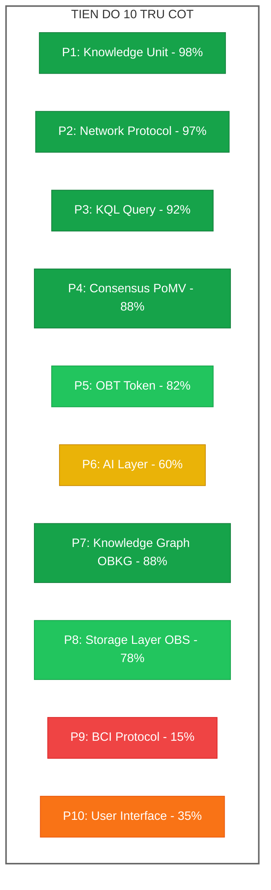
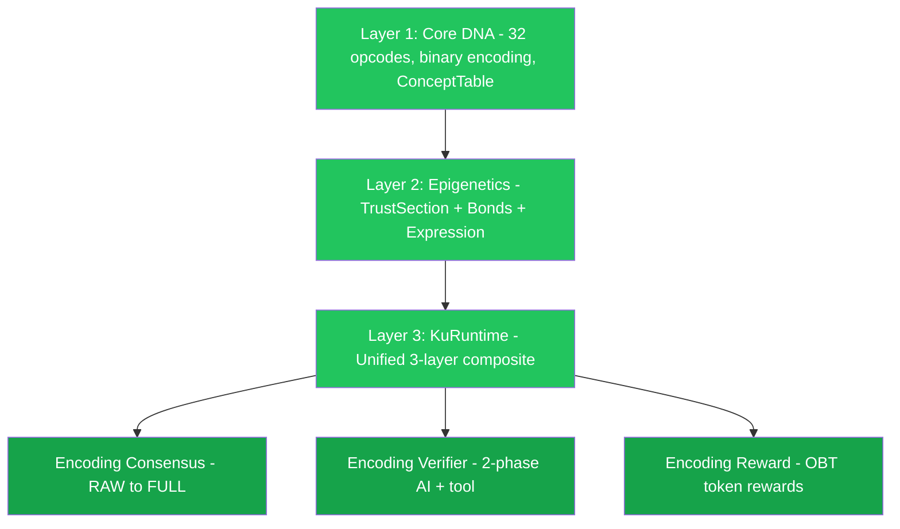
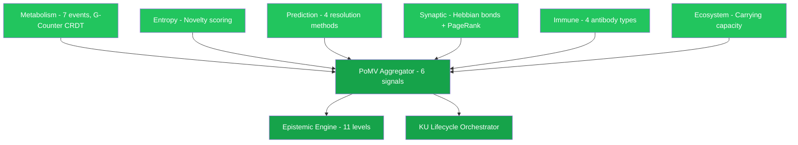
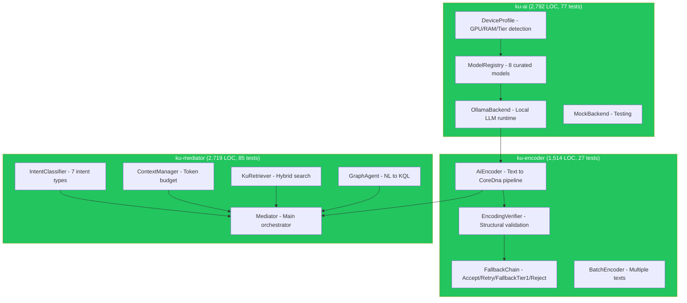
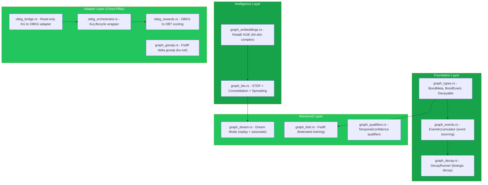

# 🧠 OneBrain — Tổng quan Trụ cột & Tiến độ

> **Review toàn diện dự án OneBrain — 10 trụ cột chính và mức độ hoàn thiện**
> Ngày review: 07/07/2026 | Codebase: ~65,300 dòng Rust | 1,413 tests | 155+ tài liệu nghiên cứu | 8 academic papers | 10 crates

---

## Tổng quan nhanh

OneBrain là **mạng chia sẻ tri thức phi tập trung** lấy cảm hứng từ sinh học, nơi con người đóng góp, xác thực và hấp thụ tri thức — giống cách tế bào trao đổi chất qua mạng lưới. Dự án được viết bằng **Rust**, sử dụng kiến trúc **4 tầng** với 10 trụ cột chính và **10 crates** trong workspace.



---

## Bảng tổng hợp tiến độ

| # | Trụ cột | Tài liệu | Nghiên cứu | Code | Tests | Tiến độ |
|---|---------|-----------|-------------|------|-------|---------|
| 1 | **Knowledge Unit** | ⬛⬛⬛⬛⬛ | ⬛⬛⬛⬛⬛ | ⬛⬛⬛⬛⬛ | 353 | 🟢 **Hoàn thiện** |
| 2 | **Network Protocol** | ⬛⬛⬛⬛⬛ | ⬛⬛⬛⬛⬛ | ⬛⬛⬛⬛⬛ | 276 | 🟢 **Hoàn thiện** |
| 3 | **KQL (Query Language)** | ⬛⬛⬛⬛⬛ | ⬛⬛⬛⬛⬛ | ⬛⬛⬛⬛⬜ | 126 | 🟢 **Gần hoàn thiện** |
| 4 | **Consensus (PoMV)** | ⬛⬛⬛⬛⬛ | ⬛⬛⬛⬛⬛ | ⬛⬛⬛⬛⬜ | 167 | 🟢 **Gần hoàn thiện** |
| 5 | **OBT Token** | ⬛⬛⬛⬛⬛ | ⬛⬛⬛⬛⬛ | ⬛⬛⬛⬛⬜ | 240+ | 🟢 **Gần hoàn thiện** |
| 6 | **AI Layer** | ⬛⬛⬛⬛⬛ | ⬛⬛⬛⬛⬜ | ⬛⬛⬛⬜⬜ | 189 | 🟡 **Đang phát triển** |
| 7 | **Knowledge Graph (OBKG)** | ⬛⬛⬛⬛⬛ | ⬛⬛⬛⬛⬛ | ⬛⬛⬛⬛⬜ | 280 | 🟢 **Gần hoàn thiện** |
| 8 | **Storage Layer (OBS)** | ⬛⬛⬛⬛⬛ | ⬛⬛⬛⬛⬛ | ⬛⬛⬛⬛⬜ | 73 | 🟢 **Gần hoàn thiện** |
| 9 | **BCI Protocol** | ⬛⬛⬜⬜⬜ | ⬛⬛⬜⬜⬜ | ⬜⬜⬜⬜⬜ | — | 🔴 **Tầm nhìn xa** |
| 10 | **User Interface** | ⬛⬛⬜⬜⬜ | ⬛⬜⬜⬜⬜ | ⬛⬛⬜⬜⬜ | 4 | 🟠 **Đang bắt đầu** |

---

## Chi tiết từng trụ cột

---

### 🟢 Pillar 1: Knowledge Unit (KU) — Nền tảng dữ liệu

> **Trạng thái: ✅ Hoàn thiện | ~17,600 dòng Rust | 353 tests | 9-chapter paper**

Knowledge Unit là **đơn vị cơ bản nhất** của OneBrain — tương đương "transaction" trong blockchain. Mỗi KU đại diện cho một mẩu tri thức, được mã hóa bằng **Core DNA v7** — định dạng nhị phân tự mô tả với ConceptTable self-contained.

#### Kiến trúc 3 tầng KuRuntime (v7)



#### Code đã triển khai (35+ modules)

> [!NOTE]
> v7 thêm 4 modules mới: `ccid`, `tier0_concepts`, `concept_registry`, `blob_store`

| Module | File | Nội dung | Tests |
|--------|------|---------|-------|
| Core DNA | [core_dna.rs](file:///c:/Users/shpy2/Documents/OneBrain/src/ku-core/src/core_dna.rs) | 32 opcodes, binary encode/decode, ConceptTable (v7), 2,078+ LOC | 13 |
| Types | [types.rs](file:///c:/Users/shpy2/Documents/OneBrain/src/ku-core/src/types.rs) | KU struct, **13 Gene types** (v7), 33 BondType, TrustSection (1,314 LOC) | — |
| KuRuntime | [ku_runtime.rs](file:///c:/Users/shpy2/Documents/OneBrain/src/ku-core/src/ku_runtime.rs) | Unified 3-layer composite, 25+ extractable fields (1,140 LOC) | 33 |
| Epigenetics | [epigenetics.rs](file:///c:/Users/shpy2/Documents/OneBrain/src/ku-core/src/epigenetics.rs) | TrustSection, Bonds, Expression (260 LOC) | 8 |
| Text Parser | [text_parser.rs](file:///c:/Users/shpy2/Documents/OneBrain/src/ku-core/src/text_parser.rs) | Rule-based text → CoreDna Tier 1 (1,101 LOC) | 24 |
| Encoding Consensus | [encoding_consensus.rs](file:///c:/Users/shpy2/Documents/OneBrain/src/ku-core/src/encoding_consensus.rs) | RAW→SELF→PART→FULL lifecycle (681 LOC) | 12 |
| Encoding Verifier | [encoding_verifier.rs](file:///c:/Users/shpy2/Documents/OneBrain/src/ku-core/src/encoding_verifier.rs) | 2-phase: AI decomposition + tool round-trip (354 LOC) | 8 |
| Encoding Reward | [encoding_reward.rs](file:///c:/Users/shpy2/Documents/OneBrain/src/ku-core/src/encoding_reward.rs) | OBT token rewards for encoding participation (253 LOC) | 9 |
| ConceptDict | [concept_dict.rs](file:///c:/Users/shpy2/Documents/OneBrain/src/ku-core/src/concept_dict.rs) | ~~Bilingual name ↔ ID lookup~~ (deprecated → ConceptRegistry) (331 LOC) | 9 |
| Persistent ConceptDict | [persistent_concept_dict.rs](file:///c:/Users/shpy2/Documents/OneBrain/src/ku-core/src/persistent_concept_dict.rs) | ~~redb-backed persistence~~ (deprecated → ConceptRegistry) (427 LOC) | 6 |
| **★ CCID** | [ccid.rs](file:///c:/Users/shpy2/Documents/OneBrain/src/ku-core/src/ccid.rs) | **v7**: Content-Addressed Concept Identity, 128-bit BLAKE3 (128 LOC) | 6 |
| **★ Tier 0** | [tier0_concepts.rs](file:///c:/Users/shpy2/Documents/OneBrain/src/ku-core/src/tier0_concepts.rs) | **v7**: 80 universal concept constants (231 LOC) | — |
| **★ ConceptRegistry** | [concept_registry.rs](file:///c:/Users/shpy2/Documents/OneBrain/src/ku-core/src/concept_registry.rs) | **v7**: Offline name→CCID lookup, ~8M concepts (316 LOC) | — |
| **★ BlobStore** | [blob_store.rs](file:///c:/Users/shpy2/Documents/OneBrain/src/ku-core/src/blob_store.rs) | **v7**: Media storage types, OB-CID (34B), BlobMeta (397 LOC) | — |
| KU Tools | [ku_tools.rs](file:///c:/Users/shpy2/Documents/OneBrain/src/ku-core/src/ku_tools.rs) | Tool definitions for AI encoding (454 LOC) | 8 |
| KU Tool Executor | [ku_tool_executor.rs](file:///c:/Users/shpy2/Documents/OneBrain/src/ku-core/src/ku_tool_executor.rs) | Tool execution engine (754 LOC) | 5 |
| KU System Prompt | [ku_system_prompt.rs](file:///c:/Users/shpy2/Documents/OneBrain/src/ku-core/src/ku_system_prompt.rs) | AI system prompt generation (521 LOC) | 20 |
| CRDT | [crdt.rs](file:///c:/Users/shpy2/Documents/OneBrain/src/ku-core/src/crdt.rs) | GCounter, PNCounter, LWWRegister, ORSet, VectorClock (584 LOC) | 19 |
| Encoder | [encoder.rs](file:///c:/Users/shpy2/Documents/OneBrain/src/ku-core/src/encoder.rs) | Legacy CBOR encoder, v5 bridge (231 LOC) | — |
| Decoder | [decoder.rs](file:///c:/Users/shpy2/Documents/OneBrain/src/ku-core/src/decoder.rs) | Legacy CBOR decoder + CRC (196 LOC) | — |
| Varint | [varint.rs](file:///c:/Users/shpy2/Documents/OneBrain/src/ku-core/src/varint.rs) | 5-tier variable-length integer encoding (267 LOC) | 8 |
| Benchmark | [benchmark.rs](file:///c:/Users/shpy2/Documents/OneBrain/src/ku-core/src/benchmark.rs) | Performance benchmarks (1,109 LOC) | 6 |
| Tests | [tests.rs](file:///c:/Users/shpy2/Documents/OneBrain/src/ku-core/src/tests.rs) | Integration tests (1,756 LOC) | 26 |
| Demo | [demo.rs](file:///c:/Users/shpy2/Documents/OneBrain/src/ku-core/src/demo.rs) | Interactive demos (1,134 LOC) | 8 |

**+ 16 PoMV modules** (xem Pillar 4)

#### Điểm nổi bật
- **Core DNA v7**: 32 opcodes, binary encoding, 6-byte universal header + ConceptTable
- **13 Gene types** (v7): Fact, Procedure, Experience, Creative, MediaExperience, Testimony, Formal, Hypothesis, Narrative, Sensory, Composite, **Normative**, **Definition**
- **CCID**: 128-bit content-addressed concept identity — global, decentralized, deterministic
- **Tier 0**: 80 universal concept constants (1-byte varint)
- **ConceptRegistry**: Offline ~200MB concept lookup file (~8M concepts)
- **33 Bond types**: Causal, Spatial, Temporal, Analogical, etc.
- **11 Epistemic Status levels**: Rumor → Hearsay → Testimony → ... → Formally Proven
- **Encoding Consensus**: 4-phase distributed encoding (RAW→SELF→PART→FULL)
- **Wire efficiency**: ~264 bytes/fact KU, varint encoding, CRC-16 validation
- **BlobStore**: Media attachment types (Image/Video/Audio/Document), 34B OB-CID
- **Academic paper**: [9 chapters](file:///c:/Users/shpy2/Documents/OneBrain/docs/paper/ku/) — complete formal specification

> [!TIP]
> KU system đã hoàn thiện Phase 1 và sẵn sàng cho production. Đây là trụ cột vững nhất của dự án.

---

### 🟢 Pillar 2: Network Protocol (OBP) — Hạ tầng P2P

> **Trạng thái: ✅ Hoàn thiện | ~13,100 dòng Rust (ku-net) + 2,100 LOC (onebrain + protocol + seed) | 276 tests | 7-chapter paper**

OneBrain Protocol (OBP) cho phép các node kết nối phi tập trung, chia sẻ KU, và đồng bộ tri thức — không cần server trung tâm. **Phiên bản mới** bổ sung 3 crate sản xuất: `onebrain` node, `onebrain-protocol` shared protocol, và `onebrain-seed` seed node.

#### Stack 9 tầng giao thức (đã triển khai)


#### Code đã triển khai — ku-net (38 files, 13,127 LOC)

| Module | File | Nội dung | Tests |
|--------|------|---------|-------|
| Identity | [identity.rs](file:///c:/Users/shpy2/Documents/OneBrain/src/ku-net/src/identity.rs) | `NodeId` (BLAKE3), `KeyPair` (Ed25519), crypto puzzle, DID format (245 LOC) | — |
| Transport | [transport.rs](file:///c:/Users/shpy2/Documents/OneBrain/src/ku-net/src/transport.rs) | **Real QUIC** transport, self-signed certs, bi-directional streams (457 LOC) | 2 |
| Messages | [messages.rs](file:///c:/Users/shpy2/Documents/OneBrain/src/ku-net/src/messages.rs) | **74 message types** across 9 layers, 6-byte header, compression modes (495 LOC) | — |
| Membership | [membership.rs](file:///c:/Users/shpy2/Documents/OneBrain/src/ku-net/src/membership.rs) | **SWIM protocol**, 7 node tiers, fitness scoring (7 weights), promotion/demotion (491 LOC) | 4 |
| Discovery | [discovery.rs](file:///c:/Users/shpy2/Documents/OneBrain/src/ku-net/src/discovery.rs) | **6-layer cascade**: Social → Local → HTTP → DHT → DNS → Hardcoded (309 LOC) | — |
| DHT | [dht.rs](file:///c:/Users/shpy2/Documents/OneBrain/src/ku-net/src/dht.rs) | **Kademlia** routing table (256 buckets, k=20), store/find/closest (818 LOC) | 18 |
| DHT Store | [dht_store.rs](file:///c:/Users/shpy2/Documents/OneBrain/src/ku-net/src/dht_store.rs) | redb-backed DHT persistence (568 LOC) | 15 |
| Stigmergy | [stigmergy.rs](file:///c:/Users/shpy2/Documents/OneBrain/src/ku-net/src/stigmergy.rs) | **Bio-inspired** pheromone routing: reinforce/evaporate/best_hop (302 LOC) | 7 |
| Vacuum | [vacuum.rs](file:///c:/Users/shpy2/Documents/OneBrain/src/ku-net/src/vacuum.rs) | Bloom filter for content routing (BLAKE3-based) (314 LOC) | 6 |
| PubSub | [pubsub.rs](file:///c:/Users/shpy2/Documents/OneBrain/src/ku-net/src/pubsub.rs) | Topic subscription, interest vectors (128-bit Bloom) (283 LOC) | 6 |
| Sync | [sync.rs](file:///c:/Users/shpy2/Documents/OneBrain/src/ku-net/src/sync.rs) | **Delta-state CRDT sync** with VectorClock (383 LOC) | 6 |
| Encoding Gossip | [encoding_gossip.rs](file:///c:/Users/shpy2/Documents/OneBrain/src/ku-net/src/encoding_gossip.rs) | Encoding Consensus protocol messages (278 LOC) | 3 |
| Encoding Job | [encoding_job.rs](file:///c:/Users/shpy2/Documents/OneBrain/src/ku-net/src/encoding_job.rs) | Distributed encoding job management (238 LOC) | 4 |
| Encoding Stigmergy | [encoding_stigmergy.rs](file:///c:/Users/shpy2/Documents/OneBrain/src/ku-net/src/encoding_stigmergy.rs) | Pheromone-based encoder selection (270 LOC) | 8 |
| Metabolism Gossip | [metabolism_gossip.rs](file:///c:/Users/shpy2/Documents/OneBrain/src/ku-net/src/metabolism_gossip.rs) | CRDT metabolism propagation (325 LOC) | 6 |
| Replication | [replication.rs](file:///c:/Users/shpy2/Documents/OneBrain/src/ku-net/src/replication.rs) | R=7 tier-aware replication (663 LOC) | 20 |
| Constants | [constants.rs](file:///c:/Users/shpy2/Documents/OneBrain/src/ku-net/src/constants.rs) | Full constant registry (QUIC, SWIM, DHT, fitness weights) (210 LOC) | — |
| Tests | [tests.rs](file:///c:/Users/shpy2/Documents/OneBrain/src/ku-net/src/tests.rs) | 32 unit tests (493 LOC) | 32 |

**+ 12 Distributed Query Engine modules** (xem Pillar 3)

#### 🆕 Production Network Stack (3 crate mới)

| Crate | File chính | Nội dung | LOC |
|-------|-----------|---------|-----|
| **onebrain** | [main.rs](file:///c:/Users/shpy2/Documents/OneBrain/src/onebrain/src/main.rs) | Full node binary: TCP listener, REPL CLI, peer discovery (mDNS + UPnP + seed), KU encode/store pipeline, cross-node verification | 1,981 |
| **onebrain-protocol** | [lib.rs](file:///c:/Users/shpy2/Documents/OneBrain/src/onebrain-protocol/src/lib.rs) | Shared P2P message types: PeerMessage (Hello/KuPush/Verify), SeedMessage (Register/Heartbeat/Relay), length-prefixed JSON wire format | 129 |
| **onebrain-seed** | [main.rs](file:///c:/Users/shpy2/Documents/OneBrain/src/onebrain-seed/src/main.rs) | Lightweight seed node: peer registry (10K peers), relay service, stale cleanup, deployable to VPS (n1.onebrain.live) | 331 |

##### onebrain node — 13 modules

| Module | File | Nội dung |
|--------|------|---------|
| Node | [node.rs](file:///c:/Users/shpy2/Documents/OneBrain/src/onebrain/src/node.rs) | OneBrainNode: owns Mediator + AI backend + storage + networking (658 LOC) |
| CLI | [cli.rs](file:///c:/Users/shpy2/Documents/OneBrain/src/onebrain/src/cli.rs) | Interactive REPL: encode, search, connect, status, peers, help (252 LOC) |
| Seed Client | [seed_client.rs](file:///c:/Users/shpy2/Documents/OneBrain/src/onebrain/src/seed_client.rs) | Connect to seed nodes for WAN peer discovery (205 LOC) |
| Verifier | [verifier_service.rs](file:///c:/Users/shpy2/Documents/OneBrain/src/onebrain/src/verifier_service.rs) | Cross-node KU verification service (129 LOC) |
| Network | [network.rs](file:///c:/Users/shpy2/Documents/OneBrain/src/onebrain/src/network.rs) | TCP wire protocol + NetMessage/NodeEvent types (117 LOC) |
| Anti-Gaming | [anti_gaming_guard.rs](file:///c:/Users/shpy2/Documents/OneBrain/src/onebrain/src/anti_gaming_guard.rs) | Rate limiter + quality gates for encoding (100 LOC) |
| Peer Memory | [peer_memory.rs](file:///c:/Users/shpy2/Documents/OneBrain/src/onebrain/src/peer_memory.rs) | Remember peers across sessions (79 LOC) |
| mDNS | [mdns_discovery.rs](file:///c:/Users/shpy2/Documents/OneBrain/src/onebrain/src/mdns_discovery.rs) | LAN peer auto-discovery (35 LOC) |
| UPnP | [upnp.rs](file:///c:/Users/shpy2/Documents/OneBrain/src/onebrain/src/upnp.rs) | Automatic port mapping (36 LOC) |

#### Integration Tests

| File | Nội dung |
|------|---------|
| [integration.rs](file:///c:/Users/shpy2/Documents/OneBrain/src/ku-net/tests/integration.rs) | 6 end-to-end tests: 3-node transfer, bootstrap, tamper detection, CID, XOR routing, full pipeline |
| [test_vectors.rs](file:///c:/Users/shpy2/Documents/OneBrain/src/ku-net/tests/test_vectors.rs) | 12 wire format test vectors: MessageHeader, IPv4/IPv6, BLAKE3, CRC, Ed25519 |

#### Đặc biệt: Bio-inspired Design
- **Stigmergy** (lấy cảm hứng từ kiến): Query routing dựa trên "pheromone trails" — routes thành công được reinforced, routes thất bại bị penalty
- **7-tier node hierarchy**: Leaf → Contributor → LocalSP → RegionalSP → CountrySP → ContinentalSP → GlobalBackbone
- **Fitness scoring**: 7 components (uptime, battery, bandwidth, storage, latency, availability, reliability) → auto-promote/demote
- **3-tier P2P discovery**: mDNS (LAN) → UPnP (port mapping) → Seed node (WAN relay)
- **Academic paper**: [7 chapters](file:///c:/Users/shpy2/Documents/OneBrain/docs/paper/network/) — complete formal specification

> [!IMPORTANT]
> Đây là trụ cột **hoàn thiện nhất** và **độc đáo nhất** — kết hợp QUIC + Kademlia + SWIM + Stigmergy + Encoding Consensus trong protocol thống nhất. **Phiên bản mới** có thêm production node binary, seed server, và real TCP networking.
>
> **v7**: OBP wire-format agnostic — no breaking changes. Planned additions: BlobStore sync protocol (BlobPush/BlobPull), ConceptRegistry distribution via gossip.

---

### 🟢 Pillar 3: Knowledge Query Language (KQL)

> **Trạng thái: Gần hoàn thiện | ~6,179 dòng Rust (ku-kql) + Distributed Query Engine | 126 tests (core) | 8-chapter paper**

KQL là **ngôn ngữ truy vấn riêng** cho OneBrain — tương tự SQL cho database, nhưng chuyên biệt cho Knowledge Graph. Bao gồm **local executor** và **distributed query engine**.

#### Core KQL (ku-kql crate, 6,179 LOC, 6 files)

| Module | File | Nội dung | Tests |
|--------|------|---------|-------|
| AST | [ast.rs](file:///c:/Users/shpy2/Documents/OneBrain/src/ku-kql/src/ast.rs) | 6 query types: Find, Create, Update, Deprecate, Watch, Explain (435 LOC) | — |
| Parser | [parser.rs](file:///c:/Users/shpy2/Documents/OneBrain/src/ku-kql/src/parser.rs) | **nom-based parser** (1,835 LOC): FIND, CREATE, EXPLAIN, WHERE, SCOPE, RETURN, ORDER BY, LIMIT | 49 |
| Executor | [executor.rs](file:///c:/Users/shpy2/Documents/OneBrain/src/ku-kql/src/executor.rs) | `LocalExecutor` with 25+ extractable fields, aggregation engine, graph traversal (1,863 LOC) | 36 |
| Storage | [storage.rs](file:///c:/Users/shpy2/Documents/OneBrain/src/ku-kql/src/storage.rs) | **redb-backed** persistent storage (BLAKE3 CID, ACID) (735 LOC) | 14 |
| Graph Storage | [graph_storage.rs](file:///c:/Users/shpy2/Documents/OneBrain/src/ku-kql/src/graph_storage.rs) | redb-backed edge persistence, adjacency queries (1,289 LOC) | 27 |

#### Distributed Query Engine (ku-net/query, ~3,298 LOC, 12 modules)

| Module | File | Nội dung | Tests |
|--------|------|---------|-------|
| QueryRouter | [router.rs](file:///c:/Users/shpy2/Documents/OneBrain/src/ku-net/src/query/router.rs) | 6-layer scope escalation (417 LOC) | 6 |
| ResultMerger | [merger.rs](file:///c:/Users/shpy2/Documents/OneBrain/src/ku-net/src/query/merger.rs) | Trust × Scope ranking, dedup (252 LOC) | 7 |
| WatchEngine | [watch.rs](file:///c:/Users/shpy2/Documents/OneBrain/src/ku-net/src/query/watch.rs) | Standing queries + TTL propagation (392 LOC) | 9 |
| QueryCache | [cache.rs](file:///c:/Users/shpy2/Documents/OneBrain/src/ku-net/src/query/cache.rs) | LRU + BLAKE3-keyed (301 LOC) | 10 |
| PheromoneLearner | [learning.rs](file:///c:/Users/shpy2/Documents/OneBrain/src/ku-net/src/query/learning.rs) | ACO feedback (314 LOC) | 8 |
| ConceptIndex | [index.rs](file:///c:/Users/shpy2/Documents/OneBrain/src/ku-net/src/query/index.rs) | VacuumFilter + DHT (178 LOC) | 7 |
| GapDetector | [gaps.rs](file:///c:/Users/shpy2/Documents/OneBrain/src/ku-net/src/query/discovery/gaps.rs) | Missing knowledge detection (303 LOC) | 6 |
| BridgeFinder | [bridges.rs](file:///c:/Users/shpy2/Documents/OneBrain/src/ku-net/src/query/discovery/bridges.rs) | Swanson ABC cross-domain (198 LOC) | 3 |
| SerendipityEngine | [serendipity.rs](file:///c:/Users/shpy2/Documents/OneBrain/src/ku-net/src/query/discovery/serendipity.rs) | Unknown unknowns discovery (272 LOC) | 6 |

#### Ví dụ KQL

```sql
-- Tìm knowledge với scope và limit
FIND (ku:KU) WHERE ku.trust_score > 8000 SCOPE cluster LIMIT 10

-- Tìm với aggregation
FIND (ku:KU) RETURN COUNT(ku), AVG(ku.trust_score)

-- Tìm theo encoding status
FIND (ku:KU) WHERE ku.encoding_status = "Full"

-- Tạo KU mới
CREATE (ku:KU {body: "Water boils at 100°C"}) SIGNED BY "author_id"

-- Giải thích query plan
EXPLAIN FIND (ku:KU) WHERE ku.confidence > 50
```

#### Scopes (6 levels)

| Scope | Phạm vi |
|-------|---------|
| `Local` | Chỉ node hiện tại |
| `Neighbors` | Peers trực tiếp |
| `Cluster` | Cluster gần |
| `Dht` | Toàn mạng DHT |
| `Global` | Toàn bộ mạng |
| `Auto` | Tự chọn tối ưu |

> [!TIP]
> KQL đã có cả local executor lẫn distributed query engine với 3 discovery engines (Gap, Bridge, Serendipity). Academic paper 8 chapters đã hoàn thành.

> [!NOTE]
> **Còn lại để lên "Hoàn thiện":**
> 1. Parser hỗ trợ 3/6 query types (`FIND`, `CREATE`, `EXPLAIN`). Cần implement parser cho `UPDATE`, `DEPRECATE`, `WATCH` (AST đã có sẵn).
> 2. Distributed Query Engine cần end-to-end integration test qua network thực.
> 3. **v7**: Gene type numbering đã thay đổi (13 types, renumbered). Parser/executor cần cập nhật gene type literals.
> 4. **v7**: `storage.rs` vẫn v5 (Critical C1) — cần rewrite cho KuRuntime v7 với ConceptTable.
> 5. **v7**: ConceptDict → ConceptRegistry migration trong CREATE execution flow.

---

### 🟢 Pillar 4: Consensus — Proof-of-Metabolic-Value (PoMV)

> **Trạng thái: ✅ Gần hoàn thiện | ~5,143 dòng Rust | 167 tests | 9-chapter paper**

PoMV là cơ chế đồng thuận **hoàn toàn mới** — thay vì vote hay đào coin, PoMV đo lường **giá trị qua quan sát**: usage, entropy, prediction, survival, synaptic bonds, và ecological niche.

#### 6 tín hiệu quan sát được



#### Code đã triển khai (16 modules, 5,143 LOC)

| Module | File | LOC | Tests |
|--------|------|----:|------:|
| Metabolism | [metabolism.rs](file:///c:/Users/shpy2/Documents/OneBrain/src/ku-core/src/metabolism.rs) | 453 | 16 |
| Metabolism Store | [metabolism_store.rs](file:///c:/Users/shpy2/Documents/OneBrain/src/ku-core/src/metabolism_store.rs) | 283 | 7 |
| Epistemic Engine | [epistemic_engine.rs](file:///c:/Users/shpy2/Documents/OneBrain/src/ku-core/src/epistemic_engine.rs) | 349 | 10 |
| Entropy | [entropy.rs](file:///c:/Users/shpy2/Documents/OneBrain/src/ku-core/src/entropy.rs) | 328 | 15 |
| Prediction | [prediction.rs](file:///c:/Users/shpy2/Documents/OneBrain/src/ku-core/src/prediction.rs) | 406 | 12 |
| Synaptic | [synaptic.rs](file:///c:/Users/shpy2/Documents/OneBrain/src/ku-core/src/synaptic.rs) | 456 | 14 |
| Immune | [immune.rs](file:///c:/Users/shpy2/Documents/OneBrain/src/ku-core/src/immune.rs) | 667 | 22 |
| Ecosystem | [ecosystem.rs](file:///c:/Users/shpy2/Documents/OneBrain/src/ku-core/src/ecosystem.rs) | 342 | 8 |
| PoMV Aggregator | [pomv.rs](file:///c:/Users/shpy2/Documents/OneBrain/src/ku-core/src/pomv.rs) | 290 | 9 |
| EigenTrust | [eigentrust.rs](file:///c:/Users/shpy2/Documents/OneBrain/src/ku-core/src/eigentrust.rs) | 320 | 9 |
| Spread Analysis | [spread_analysis.rs](file:///c:/Users/shpy2/Documents/OneBrain/src/ku-core/src/spread_analysis.rs) | 354 | 11 |
| Runtime | [pomv_runtime.rs](file:///c:/Users/shpy2/Documents/OneBrain/src/ku-core/src/pomv_runtime.rs) | 550 | 9 |
| CRDT | [crdt.rs](file:///c:/Users/shpy2/Documents/OneBrain/src/ku-core/src/crdt.rs) | 584 | 19 |
| KU Lifecycle | [ku_lifecycle.rs](file:///c:/Users/shpy2/Documents/OneBrain/src/ku-core/src/ku_lifecycle.rs) | 292 | 5 |
| Epigenetics | [epigenetics.rs](file:///c:/Users/shpy2/Documents/OneBrain/src/ku-core/src/epigenetics.rs) | 260 | 8 |
| Metabolism Gossip | [metabolism_gossip.rs](file:///c:/Users/shpy2/Documents/OneBrain/src/ku-net/src/metabolism_gossip.rs) | 325 | 6 |
| **Tổng** | | **~6,259** | **180** |

#### Epistemic Status Ladder (11 levels, observable thresholds)

```
Rumor → Hearsay → Testimony → Observation → Hypothesis → Evidence → Corroborated → Peer-Reviewed → Consensus → Established → Formally Proven
```

Mỗi bước chuyển đổi dựa trên **ngưỡng quan sát được** (metabolic rate, citation count, node diversity, etc.) — **không có voting**.

> [!IMPORTANT]
> PoMV là **đột phá lớn nhất** của dự án — cơ chế đồng thuận content-agnostic, non-punitive, dựa hoàn toàn trên quan sát. Paper 9 chapters hoàn chỉnh, 43 types, 62 constants, 167 tests.

> [!NOTE]
> **Còn lại để lên "Hoàn thiện":**
> 1. PoMV modules chạy local — cần wire full orchestration loop qua network (metabolism_gossip có nhưng chưa end-to-end).
> 2. EigenTrust cần test distributed với nhiều node thực.
> 3. **v7**: `prediction.rs` cần thêm ResolutionMethod mapping cho 2 gene types mới: Normative(11), Definition(12).

---

### 🟢 Pillar 5: Token Economics (OBT)

> **Trạng thái: ✅ Gần hoàn thiện | ~8,000 dòng Rust | 240+ tests (OBT-specific) | 7-chapter paper 🆕 | 9 spec documents**

OBT là utility token của OneBrain — phần thưởng cho việc đóng góp tri thức, encoding, verification, và storage. Sử dụng Account-Chain ledger (Nano-style), mint-on-demand, không pre-allocation.

#### Code đã triển khai (12 modules trong ku-core + 1 module trong ku-net)

| Module | File | Nội dung | Tests |
|--------|------|---------|-------|
| OBT Constants | [obt_constants.rs](file:///c:/Users/shpy2/Documents/OneBrain/src/ku-core/src/obt_constants.rs) | Protocol constants, NodeTier enum, 7-tier hierarchy (723 LOC) | 16 |
| OBT Ledger | [obt_ledger.rs](file:///c:/Users/shpy2/Documents/OneBrain/src/ku-core/src/obt_ledger.rs) | Account-Chain ledger, TransferBlock, balance tracking (1,388 LOC) | 21 |
| OBT Minting | [obt_minting.rs](file:///c:/Users/shpy2/Documents/OneBrain/src/ku-core/src/obt_minting.rs) | 4-stream emission formula, MintProof (613 LOC) | 25 |
| OBT Storage Reward | [obt_storage_reward.rs](file:///c:/Users/shpy2/Documents/OneBrain/src/ku-core/src/obt_storage_reward.rs) | 5-factor storage reward, PoS-KU (676 LOC) | 20 |
| OBT Penalty | [obt_penalty.rs](file:///c:/Users/shpy2/Documents/OneBrain/src/ku-core/src/obt_penalty.rs) | 5-tier graduated penalty system (fraud → tombstone) (704 LOC) | 22 |
| OBT Anti-Gaming | [obt_anti_gaming.rs](file:///c:/Users/shpy2/Documents/OneBrain/src/ku-core/src/obt_anti_gaming.rs) | Rate limiter, 4 quality gates, pattern detection (551 LOC) | 35 |
| OBT Gossip Security | [obt_gossip_security.rs](file:///c:/Users/shpy2/Documents/OneBrain/src/ku-core/src/obt_gossip_security.rs) | Gossip gap detection, connectivity proofs (429 LOC) | 17 |
| OBT Fork Pipeline | [obt_fork_pipeline.rs](file:///c:/Users/shpy2/Documents/OneBrain/src/ku-core/src/obt_fork_pipeline.rs) | ForkWarrant lifecycle, fork → penalty pipeline (507 LOC) | 12 |
| OBT Epoch | [obt_epoch.rs](file:///c:/Users/shpy2/Documents/OneBrain/src/ku-core/src/obt_epoch.rs) | EpochAccumulator, epoch boundary settlement (463 LOC) | 17 |
| OBT Integration | [obt_integration.rs](file:///c:/Users/shpy2/Documents/OneBrain/src/ku-core/src/obt_integration.rs) | KU↔OBT integration layer, builders, quality gates (493 LOC) | 11 |
| 🆕 OBT Governance | [obt_governance.rs](file:///c:/Users/shpy2/Documents/OneBrain/src/ku-core/src/obt_governance.rs) | **Runtime-configurable governance parameters** (GovernanceConfig), 15+ tunable params, validation (445 LOC) | 18 |
| OBT Transfer | [obt_transfer.rs](file:///c:/Users/shpy2/Documents/OneBrain/src/ku-net/src/obt_transfer.rs) | Transfer message handling, wire protocol (0xA0-0xA6) (532 LOC) | 15 |
| Encoding Reward | [encoding_reward.rs](file:///c:/Users/shpy2/Documents/OneBrain/src/ku-core/src/encoding_reward.rs) | OBT rewards for encoding participation (253 LOC) | 9 |

#### 🆕 Cập nhật so với review trước
- ✅ **obt_governance.rs** — Giải quyết gap "Governance parameter adjustment — NOT DESIGNED" (445 LOC, 18 tests)
- ✅ **OBT Academic Paper** — [7 chapters](file:///c:/Users/shpy2/Documents/OneBrain/docs/paper/obt/) hoàn chỉnh 🆕
- ✅ **OBT Specification** — [9 spec documents](file:///c:/Users/shpy2/Documents/OneBrain/docs/specs/obt/) chi tiết 🆕

#### Còn lại
- ⬜ DHT replica tracking — NOT YET
- ⬜ Ed25519 full integration — STUB ONLY
- ~~⬜ Governance parameter adjustment — NOT DESIGNED~~ → ✅ **DONE** (obt_governance.rs)
- ⬜ **v7**: BlobStore storage reward model (media hosting incentives via `StorageReward`)

---

### 🟡 Pillar 6: AI Layer

> **Trạng thái: Đang phát triển | 3 crate mới (ku-ai + ku-encoder + ku-mediator) + tool system trong ku-core | ~7,025 LOC | 189 tests | 11-chapter paper 🆕**

AI Layer đã chuyển từ **"chỉ nghiên cứu"** sang **"có code thực"**. Ba crate mới cung cấp full AI encoding pipeline, device-aware model selection, và personal mediator.



#### ku-ai — Local AI Runtime (2,792 LOC, 77 tests, 16 files)

| Module | File | Nội dung |
|--------|------|---------|
| Traits | [traits.rs](file:///c:/Users/shpy2/Documents/OneBrain/src/ku-ai/src/traits.rs) | ModelBackend, EmbeddingProvider trait interfaces |
| Types | [types.rs](file:///c:/Users/shpy2/Documents/OneBrain/src/ku-ai/src/types.rs) | ChatMessage, ToolDefinition, InferenceOptions |
| Config | [config.rs](file:///c:/Users/shpy2/Documents/OneBrain/src/ku-ai/src/config.rs) | AiConfig, tier-aware defaults (TOML) |
| Device | [device/](file:///c:/Users/shpy2/Documents/OneBrain/src/ku-ai/src/device) | DeviceProfile: GPU detection (CUDA/ROCm/Metal/Vulkan), RAM, DeviceTier (T0-T5), MemoryMonitor |
| Backend | [backend/](file:///c:/Users/shpy2/Documents/OneBrain/src/ku-ai/src/backend) | OllamaBackend (production), MockBackend (testing) |
| Registry | [registry/](file:///c:/Users/shpy2/Documents/OneBrain/src/ku-ai/src/registry) | ModelCatalog (8 models: Qwen 2.5 0.5B→32B + embeddings), tier-aware ModelSelector |

#### ku-encoder — AI-Assisted Encoding (1,514 LOC, 27 tests, 8 files)

| Module | File | Nội dung |
|--------|------|---------|
| Encoder | [encoder.rs](file:///c:/Users/shpy2/Documents/OneBrain/src/ku-encoder/src/encoder.rs) | AiEncoder: text → LLM tool-calling → CoreDna wire bytes |
| Prompt | [prompt.rs](file:///c:/Users/shpy2/Documents/OneBrain/src/ku-encoder/src/prompt.rs) | PromptBuilder: system/user prompts for LLM |
| Verifier | [verifier.rs](file:///c:/Users/shpy2/Documents/OneBrain/src/ku-encoder/src/verifier.rs) | Post-encoding structural validation |
| Fallback | [fallback.rs](file:///c:/Users/shpy2/Documents/OneBrain/src/ku-encoder/src/fallback.rs) | Decision engine: Accept/Retry/FallbackTier1/Reject |
| Batch | [batch.rs](file:///c:/Users/shpy2/Documents/OneBrain/src/ku-encoder/src/batch.rs) | Sequential multi-text encoding |
| Log | [log.rs](file:///c:/Users/shpy2/Documents/OneBrain/src/ku-encoder/src/log.rs) | JSON debug log for encoding attempts |

#### ku-mediator — Personal AI "Second Brain" (2,719 LOC, 85 tests, 16 files)

| Module | File | Nội dung |
|--------|------|---------|
| Mediator | [mediator.rs](file:///c:/Users/shpy2/Documents/OneBrain/src/ku-mediator/src/mediator.rs) | Main orchestrator: routes input through intent → handler (499 LOC) |
| Intent | [intent.rs](file:///c:/Users/shpy2/Documents/OneBrain/src/ku-mediator/src/intent.rs) | 7 intent types: Encode, Retrieve, Connect, Synthesize, GraphQuery, FreeChat, Ambiguous |
| Context | [context.rs](file:///c:/Users/shpy2/Documents/OneBrain/src/ku-mediator/src/context.rs) | Conversation history with token budget (8K default) |
| Retriever | [retriever.rs](file:///c:/Users/shpy2/Documents/OneBrain/src/ku-mediator/src/retriever.rs) | Hybrid keyword-based knowledge retrieval |
| Graph Agent | [graph_agent.rs](file:///c:/Users/shpy2/Documents/OneBrain/src/ku-mediator/src/graph_agent.rs) | Natural language → KQL translation |
| Detector | [detector.rs](file:///c:/Users/shpy2/Documents/OneBrain/src/ku-mediator/src/detector.rs) | Proactive factual statement detection |
| Deduplicator | [deduplicator.rs](file:///c:/Users/shpy2/Documents/OneBrain/src/ku-mediator/src/deduplicator.rs) | Duplicate knowledge prevention |
| Profile | [profile.rs](file:///c:/Users/shpy2/Documents/OneBrain/src/ku-mediator/src/profile.rs) | User expertise, response style preferences |
| Session | [session.rs](file:///c:/Users/shpy2/Documents/OneBrain/src/ku-mediator/src/session.rs) | Conversation state + mode management |
| Synthesizer | [synthesizer.rs](file:///c:/Users/shpy2/Documents/OneBrain/src/ku-mediator/src/synthesizer.rs) | Format results for display |

#### Tool System trong ku-core (đã có từ trước)

| Module | File | Nội dung | Tests |
|--------|------|---------|-------|
| KU Tools | [ku_tools.rs](file:///c:/Users/shpy2/Documents/OneBrain/src/ku-core/src/ku_tools.rs) | 6 tool definitions cho AI encoding (454 LOC) | 8 |
| Tool Executor | [ku_tool_executor.rs](file:///c:/Users/shpy2/Documents/OneBrain/src/ku-core/src/ku_tool_executor.rs) | Tool execution engine (754 LOC) | 5 |
| System Prompt | [ku_system_prompt.rs](file:///c:/Users/shpy2/Documents/OneBrain/src/ku-core/src/ku_system_prompt.rs) | AI system prompt generation (521 LOC) | 20 |

#### 🆕 So sánh tiến độ

| Component | Review trước | Hiện tại |
|-----------|-------------|----------|
| Knowledge Classifier | ✅ Research, ❌ Code | ✅ Research, ✅ Code (ku-mediator IntentClassifier) |
| Quality Assessor | ✅ Research, ❌ Code | ✅ Research, ✅ Code (ku-encoder Verifier + FallbackChain) |
| Duplicate Detector | ✅ Research, ❌ Code | ✅ Research, ✅ Code (ku-mediator Deduplicator) |
| Connection Mapper | ✅ Research, ❌ Code | ✅ Research, ✅ Code (ku-mediator GraphAgent) |
| LLM Integration | ❌ | ✅ Code (ku-ai OllamaBackend, 8 models) |
| Device Detection | ❌ | ✅ Code (ku-ai DeviceProfile, 6 tiers) |
| Encoding Pipeline | ❌ | ✅ Code (ku-encoder full pipeline) |
| Academic Paper | ❌ | ✅ **11-chapter paper** 🆕 |

> [!IMPORTANT]
> AI Layer đã **nhảy từ 30% → 60%**. Có 3 crate mới hoàn toàn (ku-ai, ku-encoder, ku-mediator) với 7,025 LOC và 189 tests. Ollama integration hoạt động, model registry 8 models (Qwen 2.5 family). Còn thiếu: production fine-tuning, embedding-based semantic search, multi-model orchestration.
>
> **v7**: ConceptDict → ConceptRegistry migration cần thiết trong `ku-encoder` PromptBuilder và `ku-mediator` GraphAgent. CCID-based concept resolution thay thế integer ID lookup.

---

### 🟢 Pillar 7: OneBrain Knowledge Graph (OBKG)

> **Trạng thái: ✅ Gần hoàn thiện | 13 modules Rust | 280 tests | 8-chapter paper 🆕 | 10 tài liệu nghiên cứu**

OBKG là **lớp knowledge graph** của OneBrain — kết nối tất cả KU qua bonds, phát hiện tri thức liên quan, và tiến hóa qua dream mode + STDP. Được triển khai theo nguyên tắc **"Pillar sau build bridges, đừng break foundations"** — OBKG adapt to P1-P5, không sửa code foundation.

#### Kiến trúc 4 tầng



#### Code đã triển khai (13 modules, 280 tests)

| Phase | Module | File | Nội dung | Tests |
|-------|--------|------|---------|-------|
| Foundation | Graph Types | [graph_types.rs](file:///c:/Users/shpy2/Documents/OneBrain/src/ku-core/src/graph_types.rs) | BondMeta, BondEvent, Decayable trait, 4 decay curves (759 LOC) | 24 |
| Foundation | Graph Events | [graph_events.rs](file:///c:/Users/shpy2/Documents/OneBrain/src/ku-core/src/graph_events.rs) | EventAccumulator: append, range, replay, time-range (480 LOC) | 23 |
| Foundation | Graph Decay | [graph_decay.rs](file:///c:/Users/shpy2/Documents/OneBrain/src/ku-core/src/graph_decay.rs) | DecayRunner: weaken (0.3), deprecate (0.05), immune (461 LOC) | 16 |
| Foundation | Graph Storage | [graph_storage.rs](file:///c:/Users/shpy2/Documents/OneBrain/src/ku-kql/src/graph_storage.rs) | redb-backed edge persistence, adjacency queries (1,289 LOC) | 27 |
| Intelligence | Embeddings | [graph_embeddings.rs](file:///c:/Users/shpy2/Documents/OneBrain/src/ku-core/src/graph_embeddings.rs) | RotatE KGE, 64-dim complex, 34 relation embeddings (645 LOC) | 18 |
| Intelligence | Bio Mechanisms | [graph_bio.rs](file:///c:/Users/shpy2/Documents/OneBrain/src/ku-core/src/graph_bio.rs) | STDP, Consolidation, Spreading Activation (692 LOC) | 22 |
| Query | Graph Executor | [executor.rs](file:///c:/Users/shpy2/Documents/OneBrain/src/ku-kql/src/executor.rs) | TRAVERSE, EDGE, temporal queries in KQL (1,863 LOC) | 36 |
| Advanced | Dream Mode | [graph_dream.rs](file:///c:/Users/shpy2/Documents/OneBrain/src/ku-core/src/graph_dream.rs) | Replay + Association discovery + Pruning (891 LOC) | 20 |
| Advanced | FedR | [graph_fedr.rs](file:///c:/Users/shpy2/Documents/OneBrain/src/ku-core/src/graph_fedr.rs) | Federated RotatE: local_train, compute_delta, apply_delta (761 LOC) | 16 |
| Advanced | Qualifiers | [graph_qualifiers.rs](file:///c:/Users/shpy2/Documents/OneBrain/src/ku-core/src/graph_qualifiers.rs) | Temporal, confidence, source, context qualifiers (449 LOC) | 17 |
| Adapter | Bridge | [obkg_bridge.rs](file:///c:/Users/shpy2/Documents/OneBrain/src/ku-core/src/obkg_bridge.rs) | 11 read-only adapter functions (KU→OBKG types) (522 LOC) | 15 |
| Adapter | Orchestrator | [obkg_orchestrator.rs](file:///c:/Users/shpy2/Documents/OneBrain/src/ku-core/src/obkg_orchestrator.rs) | ObkgOrchestrator wraps KuLifecycle + graph engines (708 LOC) | 12 |
| Adapter | Rewards | [obkg_rewards.rs](file:///c:/Users/shpy2/Documents/OneBrain/src/ku-core/src/obkg_rewards.rs) | GraphContributionScore for OBT rewards (414 LOC) | 14 |
| Adapter | Gossip | [graph_gossip.rs](file:///c:/Users/shpy2/Documents/OneBrain/src/ku-net/src/graph_gossip.rs) | FedR delta gossip (0xB0-0xB3), 4 wire structs (444 LOC) | 13 |

#### 🆕 OBKG Academic Paper
- ✅ **[8-chapter paper](file:///c:/Users/shpy2/Documents/OneBrain/docs/paper/obkg/)** hoàn chỉnh — formal specification 🆕

#### Bio-inspired Graph Features
- **Dream Mode**: Offline graph restructuring (replay access patterns → reinforce + discover)
- **STDP**: Spike-timing-dependent plasticity for bond weight adjustment
- **Consolidation**: Promote frequently-accessed bonds to "core" status
- **Spreading Activation**: Context-aware graph traversal
- **FedR**: Federated RotatE training — nodes learn embeddings locally, exchange deltas
- **Biologic Decay**: 4 decay curves (Ephemeral 1d, Standard 30d, Persistent 365d, Core ∞)

#### Adapter Pattern (Nguyên tắc thiết kế)
> **OBKG (P7) adapts to P1-P5, not the other way around.**

| Pillar | Files Modified by OBKG |
|--------|-----------------------|
| P1 KU Core | ❌ None |
| P2 OBP Network | +1 module additive only |
| P3 KQL | ❌ None |
| P4 PoMV | ❌ None |
| P5 OBT | ❌ None |

> [!IMPORTANT]
> OBKG is the **second largest pillar** after KU Core. 13 modules, 280 tests, 4 phases of development. Follows the OBT integration precedent: composition over modification.

> [!NOTE]
> **Còn lại để lên "Hoàn thiện":**
> 1. ObkgOrchestrator chưa integrate end-to-end với distributed network (graph_gossip transport layer).
> 2. FedR chưa test multi-node federation qua QUIC.
> 3. Dream Mode scheduling chưa wire vào node runtime loop.
> 4. **v7**: `obkg_bridge.rs` adapter pattern — no changes needed (reads via KuRuntime, gene-type-agnostic). Gene types Normative(11) and Definition(12) auto-supported via existing bond generation logic.

---

### 🟢 Pillar 8: Storage Layer (OBS)

> **Trạng thái: Gần hoàn thiện | 5 modules ku-core + 2 modules ku-net | 73+ tests | 11-chapter paper 🆕 | OBS Spec 🆕**

Storage Layer đã được mở rộng đáng kể với **OBS schema versioning, M-ARC cache, DHT persistence, và tier-aware replication**.

#### Đã triển khai

| Module | File | Nội dung | Tests |
|--------|------|---------|-------|
| **KuStorage** | [storage.rs](file:///c:/Users/shpy2/Documents/OneBrain/src/ku-kql/src/storage.rs) | redb-backed ACID storage, content-addressed (BLAKE3 CID), 3 tables (735 LOC) | 14 |
| **Persistent ConceptDict** | [persistent_concept_dict.rs](file:///c:/Users/shpy2/Documents/OneBrain/src/ku-core/src/persistent_concept_dict.rs) | ~~redb-backed concept persistence~~ (**deprecated v7** → ConceptRegistry) (427 LOC) | 6 |
| **★ BlobStore** | [blob_store.rs](file:///c:/Users/shpy2/Documents/OneBrain/src/ku-core/src/blob_store.rs) | **v7**: Media storage types, OB-CID (34B), hybrid persistence (redb metadata + FS content) (397 LOC) | — |
| **Metabolism Store** | [metabolism_store.rs](file:///c:/Users/shpy2/Documents/OneBrain/src/ku-core/src/metabolism_store.rs) | redb-backed metabolism persistence (283 LOC) | 7 |
| **OBS Schema** | [obs_schema.rs](file:///c:/Users/shpy2/Documents/OneBrain/src/ku-core/src/obs_schema.rs) | Schema versioning & migration (539 LOC) | 13 |
| **OBS Cache** | [obs_cache.rs](file:///c:/Users/shpy2/Documents/OneBrain/src/ku-core/src/obs_cache.rs) | **M-ARC** metabolism-aware cache (841 LOC) | 25 |
| **DHT Store** | [dht_store.rs](file:///c:/Users/shpy2/Documents/OneBrain/src/ku-net/src/dht_store.rs) | DHT persistence to redb (568 LOC) | 15 |
| **Replication** | [replication.rs](file:///c:/Users/shpy2/Documents/OneBrain/src/ku-net/src/replication.rs) | R=7 tier-aware replication strategy (663 LOC) | 20 |

#### 🆕 Tài liệu mới
- ✅ **[11-chapter paper](file:///c:/Users/shpy2/Documents/OneBrain/docs/paper/obs/)** — OBS formal specification 🆕
- ✅ **[OBS Spec](file:///c:/Users/shpy2/Documents/OneBrain/docs/specs/OBS_SPEC.md)** — storage layer specification 🆕
- ✅ **[Storage research](file:///c:/Users/shpy2/Documents/OneBrain/docs/research/storage/)** — 8 research documents (distributed storage, hot-cold tiering, schema migration, IPFS integration) 🆕

#### Đặc điểm
- ✅ **Content-addressed**: CID = BLAKE3 hash → deterministic, idempotent
- ✅ **ACID**: Transaction-based qua redb
- ✅ **5+ storage backends**: KU, ConceptDict, Metabolism, DHT, Graph — tất cả đều persistent
- ✅ **M-ARC Cache**: Metabolism-aware cache eviction (841 LOC, 25 tests) 🆕
- ✅ **Schema Migration**: Versioned schema with migration support 🆕
- ✅ **Tier-aware Replication**: R=7 replication factor with node tier awareness 🆕

#### Còn thiếu
- 🔲 IPFS/decentralized storage integration (đã nghiên cứu, chưa implement)
- 🔲 **v7**: BlobStore persistence layer (types định nghĩa đầy đủ, chưa có actual persistence)
- 🔲 **v7**: ConceptRegistry distribution/sync protocol
- 🔲 Storage quota management per node

---

### 🔴 Pillar 9: BCI Protocol

> **Trạng thái: Tầm nhìn dài hạn (Phase 5) | Tiến độ ~15%**

#### Đã nghiên cứu
- ✅ Landscape BCI (Neuralink, Synchron, OpenBCI)
- ✅ Neural signal types & encoding
- ✅ Privacy considerations
- ✅ Timeline estimates: **2030-2035**

> [!NOTE]
> BCI là tầm nhìn Phase 5, không cần triển khai ngay. Nghiên cứu hiện tại đủ để giữ hướng phát triển.

---

### 🟠 Pillar 10: User Interface

> **Trạng thái: Đang bắt đầu | CLI node + Demo | ~2,934 LOC | 4 tests | Tiến độ ~35%**

#### 🆕 Cập nhật: Từ "chỉ demo" sang "production CLI"

| Component | File/Crate | Nội dung | LOC |
|-----------|-----------|---------|-----|
| 🆕 **onebrain CLI** | [onebrain](file:///c:/Users/shpy2/Documents/OneBrain/src/onebrain/src/main.rs) | **Production node binary**: Interactive REPL (encode/search/connect/status/peers/help), TCP networking, P2P discovery, AI encoding, wallet | 1,981 |
| ku-demo | [ku-demo](file:///c:/Users/shpy2/Documents/OneBrain/src/ku-demo/src/main.rs) | 10-step E2E demo (legacy) | 953 |

##### onebrain CLI Commands

| Command | Mô tả |
|---------|-------|
| `encode <text>` / `remember <text>` | Encode text thành KU via AI + store + broadcast to peers |
| `search <query>` / `find <query>` | Search local knowledge by keyword |
| `connect <addr>` | Connect to a peer node |
| `status` | Show node status, KU count, peer count |
| `peers` | List connected peers |
| `help` | Show all commands |
| Free text | Chat with AI mediator |

#### Chưa có
- 🔲 Web App / Web Dashboard
- 🔲 Knowledge Graph visualization
- 🔲 KU contribution form (web)
- 🔲 User dashboard
- 🔲 Mobile App

> [!TIP]
> **Tiến bộ đáng kể**: Từ chỉ có demo CLI (10%) lên production node binary với interactive REPL, real networking, AI encoding (35%). Tuy nhiên vẫn chưa có UI đồ họa.

---

## Cấu trúc Source Code

```
src/                                    # ~65,300 dòng Rust | 1,413 tests | 10 crates
├── Cargo.toml                          # Workspace root (resolver v2)
│
├── ku-core/                            # 🟢 Pillars 1+4+5+7+8 — 35,614 LOC, 818 tests (59 files)
│   └── src/
│       ├── lib.rs                      # 56+ module exports
│       ├── core_dna.rs                 # Core DNA v6, 31 opcodes (2,078L)
│       ├── types.rs                    # KU struct, 10 Genes, 33 Bonds, Trust (1,117L)
│       ├── ku_runtime.rs              # 3-layer unified runtime (1,140L)
│       ├── text_parser.rs             # Rule-based text→CoreDna (1,101L)
│       ├── epigenetics.rs             # Layer 2: Trust + Bonds + Expression (260L)
│       ├── encoding_consensus.rs      # RAW→SELF→PART→FULL lifecycle (681L)
│       ├── encoding_verifier.rs       # 2-phase AI verification (354L)
│       ├── encoding_reward.rs         # OBT encoding rewards (253L)
│       ├── concept_dict.rs            # ConceptDict v6 bilingual (331L)
│       ├── persistent_concept_dict.rs # redb-backed persistence (427L)
│       ├── crdt.rs                    # GCounter, PNCounter, LWW, ORSet, VClock (584L)
│       ├── varint.rs                  # Variable-length integer (267L)
│       ├── encoder.rs                 # Legacy CBOR encoder (231L)
│       ├── decoder.rs                 # Legacy CBOR decoder (196L)
│       ├── error.rs                   # Error types (41L)
│       ├── ku_tools.rs               # AI tool definitions (454L)
│       ├── ku_tool_executor.rs       # Tool execution (754L)
│       ├── ku_system_prompt.rs       # AI prompt generation (521L)
│       ├── metabolism.rs             # PoMV: 7 events, G-Counter (453L)
│       ├── metabolism_store.rs       # PoMV: redb persistence (283L)
│       ├── epistemic_engine.rs       # PoMV: 11 epistemic levels (349L)
│       ├── entropy.rs                # PoMV: novelty scoring (328L)
│       ├── prediction.rs             # PoMV: 4 resolution methods (406L)
│       ├── synaptic.rs               # PoMV: Hebbian bonds + PageRank (456L)
│       ├── immune.rs                 # PoMV: 4 antibody types (667L)
│       ├── ecosystem.rs              # PoMV: carrying capacity (342L)
│       ├── pomv.rs                   # PoMV: 6-signal aggregator (290L)
│       ├── pomv_runtime.rs           # PoMV: lifecycle runtime (550L)
│       ├── eigentrust.rs             # PoMV: node reputation (320L)
│       ├── spread_analysis.rs        # PoMV: organicity scoring (354L)
│       ├── ku_lifecycle.rs           # KuRuntime↔PomvRuntime orchestrator (292L)
│       ├── obt_constants.rs          # OBT: protocol constants, NodeTier (723L)
│       ├── obt_ledger.rs             # OBT: Account-Chain ledger (1,388L)
│       ├── obt_minting.rs            # OBT: 4-stream emission, MintProof (613L)
│       ├── obt_storage_reward.rs     # OBT: 5-factor storage reward (676L)
│       ├── obt_penalty.rs            # OBT: 5-tier graduated penalties (704L)
│       ├── obt_anti_gaming.rs        # OBT: rate limiter, quality gates (551L)
│       ├── obt_gossip_security.rs    # OBT: gossip gap, connectivity (429L)
│       ├── obt_fork_pipeline.rs      # OBT: fork → penalty pipeline (507L)
│       ├── obt_epoch.rs              # OBT: epoch boundary settlement (463L)
│       ├── obt_integration.rs        # OBT: KU↔OBT integration layer (493L)
│       ├── obt_governance.rs         # OBT: runtime governance params (445L) 🆕
│       ├── graph_types.rs           # OBKG: Bond meta, events, decay (759L)
│       ├── graph_events.rs          # OBKG: Event accumulator (480L)
│       ├── graph_decay.rs           # OBKG: Biologic decay runner (461L)
│       ├── graph_embeddings.rs      # OBKG: RotatE KGE, 64-dim complex (645L)
│       ├── graph_bio.rs             # OBKG: STDP, Consolidation, Spreading (692L)
│       ├── graph_dream.rs           # OBKG: Dream mode (replay + associate) (891L)
│       ├── graph_fedr.rs            # OBKG: FedR federated training (761L)
│       ├── graph_qualifiers.rs      # OBKG: Bond qualifiers (449L)
│       ├── obkg_bridge.rs           # OBKG: Read-only adapter (522L)
│       ├── obkg_orchestrator.rs     # OBKG: KuLifecycle wrapper (708L)
│       ├── obkg_rewards.rs          # OBKG↔OBT: Graph scoring (414L)
│       ├── obs_schema.rs            # OBS: Schema versioning & migration (539L)
│       ├── obs_cache.rs             # OBS: M-ARC metabolism-aware cache (841L)
│       ├── tests.rs                 # Integration tests (1,756L)
│       ├── benchmark.rs             # Performance benchmarks (1,109L)
│       └── demo.rs                  # Interactive demos (1,134L)
│
├── ku-net/                             # 🟢 Pillar 2+3+5+7+8 — 13,127 LOC, 276 tests (38 files)
│   ├── src/
│   │   ├── lib.rs                    # 22+ module exports
│   │   ├── constants.rs              # Protocol constants (210L)
│   │   ├── error.rs                  # 5 error enums (192L)
│   │   ├── identity.rs              # BLAKE3 NodeId, Ed25519 (245L)
│   │   ├── messages.rs              # 74 message types, 6B header (495L)
│   │   ├── membership.rs            # SWIM protocol, 7 tiers (491L)
│   │   ├── discovery.rs             # 6-layer bootstrap cascade (309L)
│   │   ├── dht.rs                   # Kademlia, 256 k-buckets (818L)
│   │   ├── dht_store.rs             # DHT persistence redb (568L)
│   │   ├── stigmergy.rs            # Pheromone routing (302L)
│   │   ├── vacuum.rs                # Bloom filter (314L)
│   │   ├── pubsub.rs               # Topic management (283L)
│   │   ├── sync.rs                  # Delta-state CRDT sync (383L)
│   │   ├── transport.rs             # Real QUIC transport (457L)
│   │   ├── encoding_gossip.rs       # Encoding protocol messages (278L)
│   │   ├── encoding_job.rs          # Distributed encoding jobs (238L)
│   │   ├── encoding_stigmergy.rs    # Pheromone encoder selection (270L)
│   │   ├── metabolism_gossip.rs     # CRDT metabolism gossip (325L)
│   │   ├── obt_transfer.rs          # OBT transfer message handling (532L)
│   │   ├── obt_gossip.rs           # OBT gossip security (229L)
│   │   ├── graph_gossip.rs         # OBKG: FedR delta gossip (444L)
│   │   ├── replication.rs          # OBS: R=7 tier-aware replication (663L)
│   │   ├── tests.rs                 # 32 unit tests (493L)
│   │   └── query/                   # Distributed Query Engine
│   │       ├── router.rs            # 6-layer scope escalation (417L)
│   │       ├── merger.rs            # Trust×Scope ranking (252L)
│   │       ├── watch.rs             # Standing queries + TTL (392L)
│   │       ├── cache.rs             # LRU + BLAKE3 (301L)
│   │       ├── learning.rs          # ACO feedback (314L)
│   │       ├── index.rs             # VacuumFilter + DHT (178L)
│   │       ├── messages.rs          # Wire format (208L)
│   │       └── discovery/
│   │           ├── gaps.rs          # Gap detection (303L)
│   │           ├── bridges.rs       # Swanson ABC (198L)
│   │           └── serendipity.rs   # Unknown unknowns (272L)
│   └── tests/
│       ├── integration.rs           # 6 E2E tests
│       └── test_vectors.rs          # 12 wire format vectors
│
├── ku-kql/                             # 🟢 Pillar 3+7+8 — 6,179 LOC, 126 tests (6 files)
│   └── src/
│       ├── lib.rs                    # Module exports
│       ├── ast.rs                   # 6 query types (435L)
│       ├── parser.rs                # nom-based parser (1,835L)
│       ├── executor.rs              # Local executor (1,863L)
│       ├── graph_storage.rs         # OBKG: redb graph edge storage (1,289L)
│       └── storage.rs               # redb persistence (735L)
│
├── ku-ai/                              # 🆕 Pillar 6 — 2,792 LOC, 77 tests (16 files)
│   └── src/
│       ├── lib.rs                    # 7 module exports
│       ├── traits.rs                # ModelBackend, EmbeddingProvider traits (85L)
│       ├── types.rs                 # ChatMessage, ToolDefinition (312L)
│       ├── config.rs                # AiConfig, tier-aware defaults (250L)
│       ├── error.rs                 # AiError enum (100L)
│       ├── backend/                 # OllamaBackend + MockBackend (~1,026L)
│       ├── device/                  # DeviceProfile, GPU, Tier detection (~521L)
│       └── registry/               # ModelCatalog, 8 models (~376L)
│
├── ku-encoder/                         # 🆕 Pillar 6+1 — 1,514 LOC, 27 tests (8 files)
│   └── src/
│       ├── lib.rs                    # Module exports (62L)
│       ├── encoder.rs               # AiEncoder: text→CoreDna (370L)
│       ├── prompt.rs                # PromptBuilder (126L)
│       ├── verifier.rs              # Post-encoding validation (244L)
│       ├── fallback.rs              # Decision engine (252L)
│       ├── batch.rs                 # Multi-text encoding (167L)
│       ├── log.rs                   # JSON debug logging (198L)
│       └── error.rs                 # EncoderError (90L)
│
├── ku-mediator/                        # 🆕 Pillar 6 — 2,719 LOC, 85 tests (16 files)
│   └── src/
│       ├── lib.rs                    # 12 module exports (126L)
│       ├── mediator.rs              # Main orchestrator (499L)
│       ├── intent.rs                # 7 intent types (256L)
│       ├── context.rs               # Token budget management (283L)
│       ├── retriever.rs             # Hybrid knowledge search (266L)
│       ├── graph_agent.rs           # NL→KQL translation (182L)
│       ├── detector.rs              # Factual statement detection (186L)
│       ├── deduplicator.rs          # Duplicate prevention (150L)
│       ├── profile.rs               # User preferences (205L)
│       ├── session.rs               # Conversation state (171L)
│       ├── synthesizer.rs           # Result formatting (119L)
│       ├── error.rs                 # MediatorError (85L)
│       ├── input/                   # UserInput types (~69L)
│       └── output/                  # MediatorResponse (~118L)
│
├── ku-demo/                            # Demo — 953 LOC, 4 tests (3 files)
│   └── src/
│       ├── main.rs                    # 10-step E2E demo
│       ├── runtime.rs                 # OBPNode unified runtime
│       └── testbed.rs                 # 3-node testbed
│
├── onebrain/                           # 🆕 Production CLI node — 1,981 LOC, 0 tests (13 files)
│   └── src/
│       ├── main.rs                    # CLI entry point, clap parsing (206L)
│       ├── node.rs                    # OneBrainNode: full integration runtime (658L)
│       ├── cli.rs                     # Interactive REPL (252L)
│       ├── seed_client.rs             # Seed node discovery client (205L)
│       ├── verifier_service.rs        # Cross-node verification (129L)
│       ├── network.rs                 # TCP wire protocol (117L)
│       ├── anti_gaming_guard.rs       # Rate limiting + quality gates (100L)
│       ├── peer_memory.rs             # Persistent peer list (79L)
│       ├── peer_manager.rs            # Peer lifecycle (48L)
│       ├── config.rs                  # Node configuration (65L)
│       ├── error.rs                   # NodeError (35L)
│       ├── upnp.rs                    # UPnP port mapping (36L)
│       └── mdns_discovery.rs          # LAN mDNS discovery (35L)
│
├── onebrain-protocol/                  # 🆕 Shared P2P protocol — 129 LOC (1 file)
│   └── src/
│       └── lib.rs                     # PeerMessage, SeedMessage, wire format, constants
│
└── onebrain-seed/                      # 🆕 Seed node — 331 LOC (4 files)
    └── src/
        ├── main.rs                    # Seed entry point (45L)
        ├── server.rs                  # TCP listener + client handler (151L)
        ├── registry.rs                # Peer registry, max 10K peers (83L)
        └── relay.rs                   # Message relay service (52L)
```

---

## Tài liệu & Nghiên cứu (155+ files)

### 8 Academic Papers (hoàn chỉnh)

| Paper | Chapters | Chủ đề |
|-------|----------|--------|
| [KU Paper](file:///c:/Users/shpy2/Documents/OneBrain/docs/paper/ku/) | 9 | Knowledge Unit Core DNA v6 — binary format, 31 opcodes, encoding consensus |
| [OBP Paper](file:///c:/Users/shpy2/Documents/OneBrain/docs/paper/network/) | 7 | OneBrain Protocol — 9-layer P2P stack, 74 message types |
| [KQL Paper](file:///c:/Users/shpy2/Documents/OneBrain/docs/paper/kql/) | 8 | Knowledge Query Language — parser, executor, distributed query, 3 discovery engines |
| [PoMV Paper](file:///c:/Users/shpy2/Documents/OneBrain/docs/paper/pok/) | 9 | Proof-of-Metabolic-Value — 6 signals, 11 epistemic levels, antifragile immune |
| 🆕 [OBT Paper](file:///c:/Users/shpy2/Documents/OneBrain/docs/paper/obt/) | 11 | OneBrain Token — Account-Chain ledger, 4-stream emission, anti-gaming |
| 🆕 [OBKG Paper](file:///c:/Users/shpy2/Documents/OneBrain/docs/paper/obkg/) | 11 | OneBrain Knowledge Graph — RotatE KGE, STDP, Dream Mode, FedR |
| 🆕 [OBS Paper](file:///c:/Users/shpy2/Documents/OneBrain/docs/paper/obs/) | 11 | OneBrain Storage — content-addressed, tiered, bio-inspired storage |
| 🆕 [AI Paper](file:///c:/Users/shpy2/Documents/OneBrain/docs/paper/ai/) | 11 | OneBrain AI Layer — device-aware, decentralized AI encoding |

### 8 Rounds nghiên cứu

| Round | Files | Chủ đề |
|-------|-------|--------|
| **R1** Foundation | 3 | Semantic representation, distributed storage, distributed graphs |
| **R2** Deep Research | 4 | Bio-inspired protocols, collective intelligence, scale analysis, Knowledge DNA |
| **R3** Technical Design | 4 | Storage design, graph schema, security (NO blockchain → CID + Ed25519), scale modeling |
| **R4** Deep Dive | 4 | New gene/edge types, bio-inspired trust, optimizations, serendipity engine |
| **R5** Query & Registry | 11 | Rust selection, registry governance, distributed registry, polysemy, KQL design |
| **R6** Network Protocol | 14 | Transport, topology, distribution, scale analysis, 4 formal specs (**SPEC A-D**), OBP description |
| 🆕 **R7** OBT & OBKG | 11+10 | OBT token economics research + Knowledge Graph research (21 files) |
| 🆕 **R8** AI & Storage | 6+8 | AI layer research + Storage architecture research (14 files) |

### Formal Specifications (26 files)

| Spec | Nội dung |
|------|---------|
| **UKRL v4** | 10 gene types, 33 edge types, Trust layer, 11 epistemic levels |
| **KQL v1** | Knowledge Query Language specification |
| **SPEC A-D** | Identity+Transport, Overlay+Routing, Query+Security, Message Catalog |
| 🆕 **OBS Spec** | Storage layer specification |
| 🆕 **OBT Specs** | 9 detailed OBT specification documents |
| 🆕 **P6 AI Spec** | AI layer technical specification |
| + 8 more | Cross-pillar analysis, encoding consensus, KU architecture specs |

---

## Đánh giá tổng thể

### ✅ Điểm mạnh xuất sắc

| # | Điểm mạnh | Chi tiết |
|---|-----------|---------|
| 1 | **Protocol hoàn chỉnh** | 9-layer network stack với QUIC + Kademlia + SWIM + Stigmergy + Encoding Consensus |
| 2 | **PoMV innovation** | Cơ chế đồng thuận content-agnostic, observation-based — hoàn toàn mới, có paper 9 chapters |
| 3 | **Bio-inspired design** | Pheromone routing, fitness tiers, epigenetic decay, immune memory, metabolic scoring |
| 4 | **Wire efficiency** | Core DNA v6: ~264 bytes/fact KU, 6-byte universal header, CRC-16 |
| 5 | **CRDT foundation** | GCounter, PNCounter, LWW, ORSet, VectorClock — distributed conflict-free |
| 6 | **KQL + Distributed Query** | Ngôn ngữ truy vấn riêng + 3 discovery engines (Gap, Bridge, Serendipity) |
| 7 | **Test coverage** | 1,413 tests covering encoding, networking, wire format, PoMV, KQL, OBT, OBKG, AI, integration |
| 8 | **Academic papers** | **8 complete papers** (KU, OBP, KQL, PoMV, OBT, OBKG, OBS, AI) — publication-ready |
| 9 | **Encoding Consensus** | Distributed 4-phase encoding (RAW→SELF→PART→FULL) with OBT rewards |
| 10 | 🆕 **AI integration** | Full AI pipeline: device detection → model selection → encoding → verification → fallback |
| 11 | 🆕 **Production node** | `onebrain` binary: real TCP networking, P2P discovery, seed servers, interactive REPL |
| 12 | 🆕 **Personal mediator** | ku-mediator: intent routing, context management, graph agent, knowledge detection |

### ⚠️ Gaps cần giải quyết

| # | Gap | Impact | Priority |
|---|-----|--------|----------|
| ~~1~~ | ~~**OBT Token ledger chưa code**~~ | ✅ **DONE** — 12 modules, 240+ tests, Account-Chain ledger | ✅ |
| ~~2~~ | ~~**Graph database chưa tích hợp**~~ | ✅ **DONE** — 13 modules OBKG, 280 tests | ✅ |
| ~~3~~ | ~~**Governance parameter adjustment**~~ | ✅ **DONE** — obt_governance.rs (445 LOC, 18 tests) | ✅ |
| 4 | **Web UI chưa có** | Chỉ CLI, không demo được cho stakeholders qua browser | 🟡 Medium |
| 5 | **Whitepaper chưa viết** | Có 8 papers nhưng chưa có unified whitepaper (chỉ có stub 922 bytes) | 🟡 Medium |
| 6 | **Team = 1 người** | Dự án scale này cần team lớn hơn | 🔴 Critical |
| 7 | **OBT: DHT replica tracking** | Storage reward cần biết replica count thực tế | 🟠 High |
| 8 | **OBT: Ed25519 full integration** | Hiện tại stub only, cần real crypto signing | 🟠 High |
| 9 | **Binary crates: 0 tests** | onebrain, onebrain-protocol, onebrain-seed chưa có test | 🟠 High |
| 10 | **AI: production tuning** | LLM encoding cần fine-tuning, embedding search chưa implement | 🟡 Medium |

---

## Tiến độ so với Roadmap

| Phase | Hạng mục | Thời gian | Trạng thái |
|-------|----------|-----------|-----------| 
| **Phase 1** | KU Schema and Core DNA v6 | 06/2025 → 06/2026 | ✅ Done |
| | Network Protocol 9 layers | 06/2025 → 06/2026 | ✅ Done |
| | KQL Spec, Parser, Executor | 08/2025 → 06/2026 | ✅ Done |
| | PoMV Consensus 16 modules | 01/2026 → 06/2026 | ✅ Done |
| | Encoding Consensus Protocol | 05/2026 → 06/2026 | ✅ Done |
| | Distributed Query Engine | 04/2026 → 06/2026 | ✅ Done |
| | Research 6 rounds | 07/2025 → 06/2026 | ✅ Done |
| | 4 Academic Papers | 03/2026 → 06/2026 | ✅ Done |
| | CRDT and Storage redb | 01/2026 → 06/2026 | ✅ Done |
| **Phase 2** | OBT Token Ledger | 07/2026 → 01/2027 | ✅ **Done** (ahead of schedule!) |
| | Knowledge Graph (OBKG) | 08/2026 → 03/2027 | ✅ **Done** (ahead of schedule!) |
| | OBT Governance | Chưa scheduled | ✅ **Done** (ahead of schedule!) |
| | AI Layer (ku-ai, ku-encoder, ku-mediator) | 09/2026 → 03/2027 | ✅ **Done** (ahead of schedule!) |
| | Production Node (onebrain + seed) | Chưa scheduled | ✅ **Done** (ahead of schedule!) |
| | 4 Academic Papers (OBT, OBKG, OBS, AI) | Chưa scheduled | ✅ **Done** (ahead of schedule!) |
| | Storage Layer (OBS) expansion | Chưa scheduled | ✅ **Done** (ahead of schedule!) |
| | Research R7 + R8 | Chưa scheduled | ✅ **Done** |
| | AI Integration | 09/2026 → 03/2027 | 🟡 **Partial** (framework done, fine-tuning needed) |
| | Web App prototype | 01/2027 → 06/2027 | ⬜ Planned |
| | Whitepaper v1 | 07/2026 → 12/2026 | ⬜ Planned (stub only) |

> [!IMPORTANT]
> **Dự án vượt kỳ vọng nghiêm trọng!** Phase 2 dự kiến bắt đầu 07/2026 nhưng gần như toàn bộ đã hoàn thành trước tiến độ. Codebase từ ~42,000 LOC (01/07/2026) lên ~65,300 LOC (07/07/2026) — tăng **55%** trong 6 ngày. Từ 4 crates lên 10 crates. Từ 4 papers lên 8 papers. Từ 1,103 tests lên 1,413 tests. 8/10 pillars đang ở trạng thái hoàn thiện hoặc gần hoàn thiện.

---

## 6 bước tiếp theo (đề xuất)

| # | Bước | Mô tả | Dựa trên |
|---|------|-------|----------|
| ~~🥇~~ | ~~**OBT Token Ledger**~~ | ✅ **DONE** — 12 modules, Account-Chain, governance, 240+ tests | obt_*.rs (12 files) |
| ~~🥈~~ | ~~**Knowledge Graph DB**~~ | ✅ **DONE** — OBKG 13 modules, RotatE KGE, Dream Mode, FedR, STDP, 280 tests | obkg_*.rs + graph_*.rs (13 files) |
| ~~🥉~~ | ~~**AI Integration**~~ | ✅ **Partial DONE** — ku-ai + ku-encoder + ku-mediator = 7,025 LOC, 189 tests, Ollama integration | 3 crate mới |
| 1️⃣ | **Whitepaper v1.0** | Tổng hợp 8 papers + 155+ research docs thành unified whitepaper | Tất cả material đã có, chỉ cần compile |
| 2️⃣ | **Web Dashboard** | Visualize Knowledge Graph, browse KUs, demo PoMV lifecycle | Cần để attract community + investors |
| 3️⃣ | **Test coverage cho binary crates** | onebrain, onebrain-protocol, onebrain-seed cần test coverage | 0 tests hiện tại |
| 4️⃣ | **AI Fine-tuning & Embedding Search** | Optimize LLM encoding quality, add semantic similarity search | ku-ai + ku-encoder framework sẵn sàng |
| 5️⃣ | **End-to-end Network Testing** | Multi-node integration test: PoMV + FedR + OBT qua QUIC/TCP | Tất cả components local đã sẵn sàng |
| 6️⃣ | **Community Building** | Open-source community, contributor guidelines, governance | Foundation vững chắc để mở |
