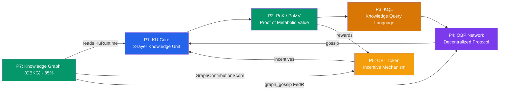

# OneBrain — Decentralized Knowledge Management

> **Quản lý tri thức phi tập trung với kiến trúc lấy cảm hứng sinh học.**

OneBrain encodes human knowledge into compact, language-agnostic **Knowledge Units (KU)** that live, metabolize, and evolve across a peer-to-peer network — no central servers, no cloud dependency.

```text
Text → CoreDna → Epigenetics → Expression
                      ↓
               PoMV 6 Signals → Epistemic Ladder
                      ↓
           OBP Network (gossip, DHT, sync)
```

---

## Architecture — 10 Pillars



| Pillar | Crate | Mô tả |
|--------|-------|--------|
| **P1: KU Core** | `ku-core` | 3-layer architecture: CoreDna (binary instructions) → Epigenetics (trust/bonds) → Expression (natural language) |
| **P2: PoK / PoMV** | `ku-core` | Proof-of-Metabolic-Value — 6 observable signals score every KU without voting |
| **P3: KQL** | `ku-kql` | Knowledge Query Language — FIND, CREATE, UPDATE, DEPRECATE, WATCH, EXPLAIN |
| **P4: OBP Network** | `ku-net` | OneBrain Protocol — identity, SWIM membership, S/Kademlia DHT, stigmergy, gossip |

### P5: OBT Token (OneBrain Token)
Incentive mechanism that rewards knowledge contribution, encoding, verification, and storage.
- 4-stream rewards: PoMV (R1), Encoding (R2), Verification (R3), Storage (R4)
- Account-Chain ledger (Nano-style, no global blockchain)
- 7-tier NodeTier hierarchy with EigenTrust-gated promotions
- 5-tier graduated penalty system (fraud → tombstone)

---

## Quick Start

```powershell
# Clone & build
git clone https://github.com/user/OneBrain.git
cd OneBrain/src

# Build workspace
cargo build

# Run tests
cargo test

# Build with persistent ConceptDict (redb)
cargo build --features persist
```

---

## Specification Documents

| # | Document | Pillar | Nội dung |
|---|----------|--------|----------|
| 1 | [KU Architecture](specs/KU_ARCHITECTURE.md) | P1 | 3-layer architecture overview, KuRuntime, CID |
| 2 | [Core DNA Spec](specs/KU_CORE_DNA_SPEC.md) | P1 | Wire format, 32 opcodes, 13 gene types, varint encoding, CCID, Concept Registry |
| 3 | [KU Encoding Pipeline](specs/KU_ENCODING_PIPELINE.md) | P1 | Text → CoreDna conversion, 3-tier pipeline |
| 4 | [PoK Design](specs/POK_DESIGN.md) | P2 | Philosophy, 6 PoMV signals, anti-fragile immune system |
| 5 | [PoK v2 Specification](specs/POK_V2_SPECIFICATION.md) | P2 | PoMV formula, weights, epistemic ladder, CRDT metabolism |
| 6 | [KQL Spec](specs/KQL_SPEC.md) | P3 | FIND/CREATE/UPDATE/DEPRECATE/WATCH/EXPLAIN grammar |
| 7 | [OBP Spec](specs/OBP_SPEC.md) | P4 | Network layers 0-8, SWIM, DHT, gossip, transport |
| 8 | [Encoding Consensus Spec](specs/ENCODING_CONSENSUS_SPEC.md) | P1+P4 | DHT job board, ClaimToken, 2-phase verification, consensus scoring, OBT rewards |
| 9 | `obt/01_OVERVIEW.md` | P5 | OBT token identity and principles |
| 10 | `obt/02_LEDGER.md` | P5 | Account-Chain ledger specification |
| 11 | `obt/03_MINTING.md` | P5 | 4-stream minting formula |
| 12 | `obt/04_STORAGE_REWARD.md` | P5 | 5-factor storage reward |
| 13 | `obt/05_ANTI_GAMING.md` | P5 | Rate limits, quality gates, pattern detection |
| 14 | `obt/06_TRANSFER.md` | P5 | Peer-to-peer transfer protocol |
| 15 | `obt/07_GOSSIP_SECURITY.md` | P5 | Gossip gap and connectivity proofs |
| 16 | `obt/08_PENALTY.md` | P5 | 5-tier graduated penalty system |
| 17 | `obt/09_CONSTANTS.md` | P5 | All protocol constants with rationale |
| 18 | [OBKG_WALKTHROUGH.md](specs/OBKG_WALKTHROUGH.md) | P7 | OBKG Knowledge Graph — 4 phases, 13 modules, 280 tests |

### Cross-cutting Documents

| Document | Nội dung |
|----------|----------|
| [Research Baseline — KU v7.1](research/ONEBRAIN_RESEARCH_BASELINE_V7_1.md) | Baseline 1.5 cho nghiên cứu KU-centric và partition autonomy; §46.3/§56.1 chốt Receptor, Mapping, discovery, OBP-RP, reconciliation, identity, GC và migration; OBT ngoài critical path |
| [Foundation Implementation Plan — KU v7.1](research/ONEBRAIN_FOUNDATION_IMPLEMENTATION_PLAN_V7_1.md) | Kế hoạch thực thi chi tiết: dependency graph, 8 milestone (M0–M7), 99 task có acceptance criteria, Anti-Gravity Reunion MVP, verification/migration/rollout gates và topological work-package queue |
| [vNext Foundation Contracts](specs/vnext/README.md) | Contract đang triển khai cho WP-001/WP-002: field ownership, normative vocabulary, negative assertions và canonical codec/domain profile |
| [Legacy/vNext Product Boundary ADR](specs/vnext/LEGACY_VNEXT_PRODUCT_BOUNDARY_ADR_V1.md) | Chốt ranh giới additive: KQL/DHT/PoMV/OBT legacy không được ngầm đổi nghĩa thành vNext; wallet hiện là simulated/non-economic |
| [vNext Product Integration Profile v1](specs/vnext/VNEXT_PRODUCT_INTEGRATION_PROFILE_V1.md) | Contract P1.1 cho 14 endpoint additive, 18 DTO, CID/continuation encoding, lifecycle/error semantics và proposal/PoMV firewalls |
| [Distributed Runtime Transaction Inventory](specs/vnext/DISTRIBUTED_RUNTIME_TRANSACTION_BOUNDARY_INVENTORY_V1.md) | Danh mục boundary và failpoint ID cho crash harness DR-M5, kèm durable owner và restart oracle |
| [Feature Tree](features/FEATURE_TREE.md) | Cây tính năng v6 — tất cả §1-§8 |
| [Feature Details](features/FEATURE_DETAILS.md) | Chi tiết kỹ thuật từng feature với code references |
| [KU vs AI Model](references/KU_vs_AI_Model_vi.md) | So sánh triết học giữa Knowledge Unit và AI Model (Tiếng Việt) |

---

## Code ↔ Documentation Cross-Reference

### Workspace Crates

| Crate | Path | Description |
|-------|------|-------------|
| `ku-core` | `src/ku-core/` | KU v6 engine — all 3 layers + PoMV |
| `ku-kql` | `src/ku-kql/` | KQL parser, executor, persistent storage |
| `ku-net` | `src/ku-net/` | OBP network protocol |
| `ku-demo` | `src/ku-demo/` | Demo application |

### P1: KU Core Modules

| Module | File | Spec | Description |
|--------|------|------|-------------|
| `core_dna` | [core_dna.rs](../src/ku-core/src/core_dna.rs) | [Core DNA](specs/KU_CORE_DNA_SPEC.md) | `CoreDna`, `CoreDnaHeader`, `Instruction`, `Op` (32 opcodes), `ConceptTableEntry`, encode/decode |
| `epigenetics` | [epigenetics.rs](../src/ku-core/src/epigenetics.rs) | [KU Architecture](specs/KU_ARCHITECTURE.md) | `Epigenetics` (Layer 2), `Expression` (Layer 3) |
| `ku_runtime` | [ku_runtime.rs](../src/ku-core/src/ku_runtime.rs) | [KU Architecture](specs/KU_ARCHITECTURE.md) | `KuRuntime` — unified 3-layer composite with CID |
| `concept_dict` | [concept_dict.rs](../src/ku-core/src/concept_dict.rs) | [Core DNA](specs/KU_CORE_DNA_SPEC.md) | `ConceptDict`, `ConceptEntry` — bilingual name↔ID |
| `persistent_concept_dict` | [persistent_concept_dict.rs](../src/ku-core/src/persistent_concept_dict.rs) | — | redb-backed persistent ConceptDict |
| `types` | [types.rs](../src/ku-core/src/types.rs) | [KU Architecture](specs/KU_ARCHITECTURE.md) | `ConceptId`, `GeneType` (13 variants), `EpistemicStatus`, `EvidenceType`, `RelationType`, `Bond`, `TrustSection` |
| `tier0_concepts` | [tier0_concepts.rs](../src/ku-core/src/tier0_concepts.rs) | [Core DNA](specs/KU_CORE_DNA_SPEC.md) | 80 Tier 0 universal concept constants (IS_A, CAUSES, UNIT_METER, …) |
| `ccid` | [ccid.rs](../src/ku-core/src/ccid.rs) | [Core DNA](specs/KU_CORE_DNA_SPEC.md) | CCID — 128-bit truncated BLAKE3 for concept identity |
| `concept_registry` | [concept_registry.rs](../src/ku-core/src/concept_registry.rs) | [Core DNA](specs/KU_CORE_DNA_SPEC.md) | Offline concept name → CCID registry (200MB, ~8M concepts) |
| `encoder` | [encoder.rs](../src/ku-core/src/encoder.rs) | [Encoding Pipeline](specs/KU_ENCODING_PIPELINE.md) | Legacy encoder functions |
| `decoder` | [decoder.rs](../src/ku-core/src/decoder.rs) | [Encoding Pipeline](specs/KU_ENCODING_PIPELINE.md) | Legacy decoder functions |
| `varint` | [varint.rs](../src/ku-core/src/varint.rs) | [Core DNA](specs/KU_CORE_DNA_SPEC.md) | Varint encode/decode for ConceptIDs (5 tiers, 3 reserved) |
| `text_parser` | [text_parser.rs](../src/ku-core/src/text_parser.rs) | [Encoding Pipeline](specs/KU_ENCODING_PIPELINE.md) | Tier 1 rule-based text→CoreDna parser (VI/EN) |
| `encoding_consensus` | [encoding_consensus.rs](../src/ku-core/src/encoding_consensus.rs) | [Encoding Consensus](specs/ENCODING_CONSENSUS_SPEC.md) | Consensus orchestrator — EncodingStatus lifecycle (RAW→SELF→PART→FULL) |
| `encoding_verifier` | [encoding_verifier.rs](../src/ku-core/src/encoding_verifier.rs) | [Encoding Consensus](specs/ENCODING_CONSENSUS_SPEC.md) | 2-phase verification: AI decomposition agreement + tool encoding round-trip |
| `encoding_reward` | [encoding_reward.rs](../src/ku-core/src/encoding_reward.rs) | [Encoding Consensus](specs/ENCODING_CONSENSUS_SPEC.md) | OBT token rewards for encoding verification participation |
| `error` | [error.rs](../src/ku-core/src/error.rs) | — | `KuError` enum |
| `graph_types` | [graph_types.rs](../src/ku-core/src/graph_types.rs) | [OBKG Walkthrough](specs/OBKG_WALKTHROUGH.md) | OBKG: BondMeta, BondEvent, Decayable trait, 4 decay curves |
| `graph_events` | [graph_events.rs](../src/ku-core/src/graph_events.rs) | [OBKG Walkthrough](specs/OBKG_WALKTHROUGH.md) | OBKG: EventAccumulator (event sourcing for bond lifecycle) |
| `graph_decay` | [graph_decay.rs](../src/ku-core/src/graph_decay.rs) | [OBKG Walkthrough](specs/OBKG_WALKTHROUGH.md) | OBKG: DecayRunner (biologic bond decay) |
| `graph_embeddings` | [graph_embeddings.rs](../src/ku-core/src/graph_embeddings.rs) | [OBKG Walkthrough](specs/OBKG_WALKTHROUGH.md) | OBKG: RotatE KGE, 64-dim complex embeddings |
| `graph_bio` | [graph_bio.rs](../src/ku-core/src/graph_bio.rs) | [OBKG Walkthrough](specs/OBKG_WALKTHROUGH.md) | OBKG: STDP, Consolidation, Spreading Activation |
| `graph_dream` | [graph_dream.rs](../src/ku-core/src/graph_dream.rs) | [OBKG Walkthrough](specs/OBKG_WALKTHROUGH.md) | OBKG: Dream Mode (replay + association discovery) |
| `graph_fedr` | [graph_fedr.rs](../src/ku-core/src/graph_fedr.rs) | [OBKG Walkthrough](specs/OBKG_WALKTHROUGH.md) | OBKG: Federated RotatE training (FedR) |
| `graph_qualifiers` | [graph_qualifiers.rs](../src/ku-core/src/graph_qualifiers.rs) | [OBKG Walkthrough](specs/OBKG_WALKTHROUGH.md) | OBKG: Bond qualifiers (temporal, confidence, source) |
| `obkg_bridge` | [obkg_bridge.rs](../src/ku-core/src/obkg_bridge.rs) | [OBKG Walkthrough](specs/OBKG_WALKTHROUGH.md) | OBKG: Read-only adapter (KuRuntime/Bond → OBKG types) |
| `obkg_orchestrator` | [obkg_orchestrator.rs](../src/ku-core/src/obkg_orchestrator.rs) | [OBKG Walkthrough](specs/OBKG_WALKTHROUGH.md) | OBKG: KuLifecycle wrapper + graph engines |
| `obkg_rewards` | [obkg_rewards.rs](../src/ku-core/src/obkg_rewards.rs) | [OBKG Walkthrough](specs/OBKG_WALKTHROUGH.md) | OBKG↔OBT: Graph contribution scoring bridge |

### P2: PoK/PoMV Modules

| Module | File | Spec | Description |
|--------|------|------|-------------|
| `metabolism` | [metabolism.rs](../src/ku-core/src/metabolism.rs) | [PoK v2](specs/POK_V2_SPECIFICATION.md) | `KUMetabolism`, `MetabolismEvent` — CRDT usage tracking |
| `metabolism_store` | [metabolism_store.rs](../src/ku-core/src/metabolism_store.rs) | [PoK v2](specs/POK_V2_SPECIFICATION.md) | Per-node metabolism storage |
| `prediction` | [prediction.rs](../src/ku-core/src/prediction.rs) | [PoK v2](specs/POK_V2_SPECIFICATION.md) | `PredictionRegistry`, `Prediction`, `ResolutionMethod` |
| `entropy` | [entropy.rs](../src/ku-core/src/entropy.rs) | [PoK v2](specs/POK_V2_SPECIFICATION.md) | `EntropyCalculator` — novelty/diversity scoring |
| `immune` | [immune.rs](../src/ku-core/src/immune.rs) | [PoK Design](specs/POK_DESIGN.md) | `ImmuneEngine`, `AntibodyType` — anti-spam detection |
| `synaptic` | [synaptic.rs](../src/ku-core/src/synaptic.rs) | [PoK v2](specs/POK_V2_SPECIFICATION.md) | `SynapticMap`, Hebbian learning, centrality |
| `ecosystem` | [ecosystem.rs](../src/ku-core/src/ecosystem.rs) | [PoK v2](specs/POK_V2_SPECIFICATION.md) | `EcosystemAnalyzer`, `NicheStats` — niche fitness |
| `pomv` | [pomv.rs](../src/ku-core/src/pomv.rs) | [PoK v2](specs/POK_V2_SPECIFICATION.md) | `PomvCalculator`, `PomvSignals`, `PomvScore`, `PomvWeights` |
| `pomv_runtime` | [pomv_runtime.rs](../src/ku-core/src/pomv_runtime.rs) | [PoK v2](specs/POK_V2_SPECIFICATION.md) | `PomvRuntime`, `PomvConfig`, `KUPomvState` |
| `epistemic_engine` | [epistemic_engine.rs](../src/ku-core/src/epistemic_engine.rs) | [PoK v2](specs/POK_V2_SPECIFICATION.md) | `evaluate_transition()` — observation-based status transitions |
| `eigentrust` | [eigentrust.rs](../src/ku-core/src/eigentrust.rs) | [PoK Design](specs/POK_DESIGN.md) | EigenTrust — node reputation computation |
| `spread_analysis` | [spread_analysis.rs](../src/ku-core/src/spread_analysis.rs) | [PoK Design](specs/POK_DESIGN.md) | Spread pattern analysis for immune system |
| `crdt` | [crdt.rs](../src/ku-core/src/crdt.rs) | [PoK v2](specs/POK_V2_SPECIFICATION.md) | `GCounter`, `PNCounter`, `LWWRegister`, `ORSet` |
| `ku_lifecycle` | [ku_lifecycle.rs](../src/ku-core/src/ku_lifecycle.rs) | — | `KuLifecycle` — KuRuntime ↔ PomvRuntime orchestrator |

### P2.5: AI Integration Modules

| Module | File | Description |
|--------|------|-------------|
| `ku_tools` | [ku_tools.rs](../src/ku-core/src/ku_tools.rs) | AI tool-calling definitions for KU operations |
| `ku_tool_executor` | [ku_tool_executor.rs](../src/ku-core/src/ku_tool_executor.rs) | Tool call execution engine |
| `ku_system_prompt` | [ku_system_prompt.rs](../src/ku-core/src/ku_system_prompt.rs) | System prompt generation for local AI models |

### P3: KQL Modules

| Module | File | Spec | Description |
|--------|------|------|-------------|
| `ast` | [ast.rs](../src/ku-kql/src/ast.rs) | [KQL Spec](specs/KQL_SPEC.md) | `Query`, `FindQuery`, `CreateQuery`, `Condition`, `Pattern` |
| `parser` | [parser.rs](../src/ku-kql/src/parser.rs) | [KQL Spec](specs/KQL_SPEC.md) | nom-based KQL parser |
| `executor` | [executor.rs](../src/ku-kql/src/executor.rs) | [KQL Spec](specs/KQL_SPEC.md) | Local query execution engine |
| `storage` | [storage.rs](../src/ku-kql/src/storage.rs) | [KQL Spec](specs/KQL_SPEC.md) | redb-backed persistent KU storage |
| `graph_storage` | [graph_storage.rs](../src/ku-kql/src/graph_storage.rs) | [OBKG Walkthrough](specs/OBKG_WALKTHROUGH.md) | OBKG: Graph-aware KU storage and retrieval |

### P4: OBP Network Modules

| Module | File | Spec | Description |
|--------|------|------|-------------|
| `identity` | [identity.rs](../src/ku-net/src/identity.rs) | [OBP Spec](specs/OBP_SPEC.md) | NodeID, DID, Ed25519 cryptographic identity |
| `messages` | [messages.rs](../src/ku-net/src/messages.rs) | [OBP Spec](specs/OBP_SPEC.md) | Wire message framing and catalog |
| `membership` | [membership.rs](../src/ku-net/src/membership.rs) | [OBP Spec](specs/OBP_SPEC.md) | SWIM protocol membership |
| `discovery` | [discovery.rs](../src/ku-net/src/discovery.rs) | [OBP Spec](specs/OBP_SPEC.md) | 6-layer peer discovery |
| `dht` | [dht.rs](../src/ku-net/src/dht.rs) | [OBP Spec](specs/OBP_SPEC.md) | S/Kademlia DHT routing |
| `stigmergy` | [stigmergy.rs](../src/ku-net/src/stigmergy.rs) | [OBP Spec](specs/OBP_SPEC.md) | Pheromone-based routing |
| `vacuum` | [vacuum.rs](../src/ku-net/src/vacuum.rs) | [OBP Spec](specs/OBP_SPEC.md) | Probabilistic filters |
| `pubsub` | [pubsub.rs](../src/ku-net/src/pubsub.rs) | [OBP Spec](specs/OBP_SPEC.md) | Topic-based pub/sub |
| `sync` | [sync.rs](../src/ku-net/src/sync.rs) | [OBP Spec](specs/OBP_SPEC.md) | State synchronization |
| `transport` | [transport.rs](../src/ku-net/src/transport.rs) | [OBP Spec](specs/OBP_SPEC.md) | QUIC transport (feature-gated) |
| `metabolism_gossip` | [metabolism_gossip.rs](../src/ku-net/src/metabolism_gossip.rs) | [OBP Spec](specs/OBP_SPEC.md) | PoMV metabolism data gossip |
| `encoding_job` | [encoding_job.rs](../src/ku-net/src/encoding_job.rs) | [Encoding Consensus](specs/ENCODING_CONSENSUS_SPEC.md) | DHT-based encoding job board & ClaimToken anti-stampede |
| `encoding_gossip` | [encoding_gossip.rs](../src/ku-net/src/encoding_gossip.rs) | [Encoding Consensus](specs/ENCODING_CONSENSUS_SPEC.md) | Encoding status & verification result propagation |
| `encoding_stigmergy` | [encoding_stigmergy.rs](../src/ku-net/src/encoding_stigmergy.rs) | [Encoding Consensus](specs/ENCODING_CONSENSUS_SPEC.md) | Pheromone-based load balancing for encoding tasks |
| `obt_transfer` | [obt_transfer.rs](../src/ku-net/src/obt_transfer.rs) | [OBT Transfer](specs/obt/06_TRANSFER.md) | OBT transfer message handling, wire protocol (0xA0-0xA6) |
| `graph_gossip` | [graph_gossip.rs](../src/ku-net/src/graph_gossip.rs) | [OBKG Walkthrough](specs/OBKG_WALKTHROUGH.md) | OBKG: FedR delta exchange via gossip protocol |

### P5: OBT Token Modules (`ku-core/src/obt_*.rs`)

| Module | File | Spec | Description |
|--------|------|------|-------------|
| `obt_constants` | [obt_constants.rs](../src/ku-core/src/obt_constants.rs) | [§9 Constants](specs/obt/09_CONSTANTS.md) | Protocol constants, NodeTier enum |
| `obt_ledger` | [obt_ledger.rs](../src/ku-core/src/obt_ledger.rs) | [§2 Ledger](specs/obt/02_LEDGER.md) | Account-Chain ledger, TransferBlock |
| `obt_minting` | [obt_minting.rs](../src/ku-core/src/obt_minting.rs) | [§3 Minting](specs/obt/03_MINTING.md) | Emission formula, MintProof |
| `obt_storage_reward` | [obt_storage_reward.rs](../src/ku-core/src/obt_storage_reward.rs) | [§4 Storage](specs/obt/04_STORAGE_REWARD.md) | 5-factor storage reward |
| `obt_penalty` | [obt_penalty.rs](../src/ku-core/src/obt_penalty.rs) | [§8 Penalty](specs/obt/08_PENALTY.md) | Graduated penalties |
| `obt_anti_gaming` | [obt_anti_gaming.rs](../src/ku-core/src/obt_anti_gaming.rs) | [§5 Anti-Gaming](specs/obt/05_ANTI_GAMING.md) | Production rate/reward limits, local-only explicit development admission policy, quality gates |
| `obt_gossip_security` | [obt_gossip_security.rs](../src/ku-core/src/obt_gossip_security.rs) | [§7 Gossip](specs/obt/07_GOSSIP_SECURITY.md) | Gossip gap, connectivity |
| `obt_fork_pipeline` | [obt_fork_pipeline.rs](../src/ku-core/src/obt_fork_pipeline.rs) | [§8 Penalty](specs/obt/08_PENALTY.md) | Fork → penalty pipeline |
| `obt_epoch` | [obt_epoch.rs](../src/ku-core/src/obt_epoch.rs) | [§9 Constants](specs/obt/09_CONSTANTS.md) | Epoch boundary settlement |
| `obt_integration` | [obt_integration.rs](../src/ku-core/src/obt_integration.rs) | — | KU↔OBT integration layer |

---

## Key Dependencies

| Crate | Version | Purpose |
|-------|---------|---------|
| `serde` | 1.x | Serialization framework |
| `serde_json` | 1.x | JSON for AI tool-calling interface |
| `ciborium` | 0.2 | CBOR serialization for Epigenetics |
| `blake3` | 1.x | BLAKE3 hash for CID computation |
| `crc32fast` | 1.4 | CRC for wire format integrity |
| `redb` | 2.x | Pure Rust ACID storage (optional, `persist` feature) |

---

## License

MIT
