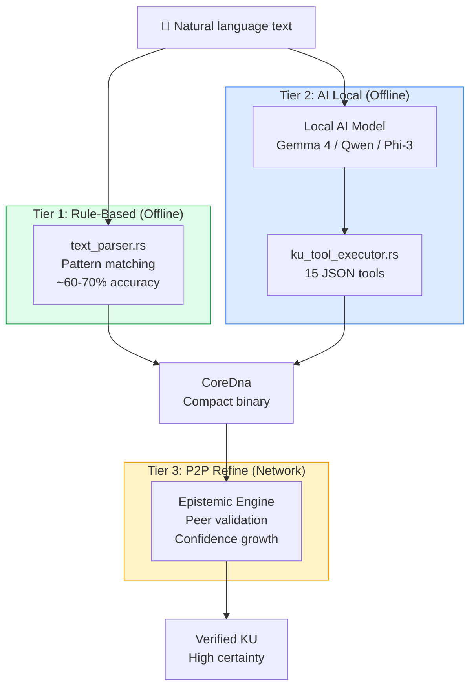
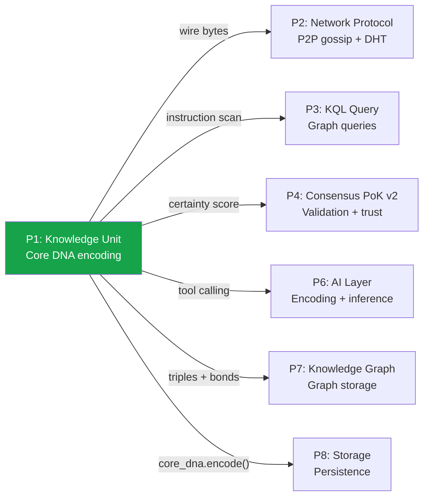

# KU Architecture — Complete Technical Reference

> **Version**: v6 Core DNA | **Date**: 29/06/2026 | **Status**: Implemented & Tested (267 tests)
>
> This document is the authoritative architecture reference for the Knowledge Unit (KU) system.
> It describes WHAT the system is, WHY it was designed this way, and HOW all the pieces fit together.
> For wire format details, see [KU_CORE_DNA_V6_SPEC.md](KU_CORE_DNA_V6_SPEC.md).
> For encoding pipeline details, see [KU_ENCODING_PIPELINE.md](KU_ENCODING_PIPELINE.md).

---

## 1. What is a Knowledge Unit?

A Knowledge Unit (KU) is the **atomic unit of knowledge** in the OneBrain decentralized network — analogous to a "transaction" in blockchain, but for knowledge instead of money.

Each KU encodes **one coherent piece of knowledge**: a fact, a procedure, an experience, a hypothesis, etc. KUs are:

- **Language-agnostic**: Stored as numeric ConceptIDs, not natural language strings
- **Machine-queryable**: Structured instructions allow direct graph queries without NLP
- **Ultra-compact**: Binary encoding is consistently **smaller than the original text**
- **Composable**: KUs link to each other via Bonds (causal, spatial, temporal, etc.)
- **Decentralized**: No central server; knowledge propagates via P2P gossip

### Design Philosophy: "Knowledge DNA"

Just as biological DNA encodes the blueprint of an organism in a compact molecular sequence, Core DNA encodes the blueprint of knowledge in a compact binary instruction stream. The key insight:

| Biological DNA | Knowledge DNA |
|----------------|---------------|
| 4 nucleotides (A, T, G, C) | 32 opcodes (TRIPLE, PARTOF, QUALITY, ...) |
| Codons (3 nucleotides → amino acid) | Instructions (opcode + varint operands) |
| Genes (functional units) | Gene types (Fact, Procedure, Experience, ...) |
| Epigenetics (gene expression control) | Epigenetics (trust, decay, metabolism) |
| Phenotype (observable traits) | Expression (natural language rendering) |

---

## 2. Three-Layer Architecture

The v6 redesign splits a KU into 3 orthogonal layers:

```
┌─────────────────────────────────────────────────────────────┐
│                    LAYER 1: Core DNA                        │
│                   (STORED — persistent)                     │
│                                                             │
│  Binary instruction stream:                                 │
│  [0x4B] [VER_META] [instr₁] [instr₂] ... [0xF0] [CRC16]  │
│                                                             │
│  • 32 opcodes × varint operands                            │
│  • Language-agnostic (ConceptIDs only)                     │
│  • Always smaller than text                                │
│  • CRC-16 integrity check                                  │
│  • Typical size: 16-200 bytes per KU                       │
└─────────────────────────────────────────────────────────────┘
                          │
                          │ decode + inflate (add defaults)
                          ▼
┌─────────────────────────────────────────────────────────────┐
│                  LAYER 2: Epigenetics                       │
│                  (RUNTIME — not persisted)                  │
│                                                             │
│  Rich runtime metadata:                                    │
│  • Trust: EpistemicStatus, EvidenceType, confidence score  │
│  • Bonds: 33 relationship types to other KUs               │
│  • Metabolism: access_count, last_accessed, decay_rate     │
│  • CRDT vectors: for distributed conflict resolution       │
│  • Composite: multi-KU aggregation                         │
│                                                             │
│  Format: CBOR (existing types.rs structs)                  │
│  Managed by: Epistemic Engine, Metabolism Store             │
└─────────────────────────────────────────────────────────────┘
                          │
                          │ render (generate human-readable form)
                          ▼
┌─────────────────────────────────────────────────────────────┐
│                  LAYER 3: Expression                        │
│                  (GENERATED — ephemeral)                    │
│                                                             │
│  Natural language rendering of the knowledge:              │
│  "Thân tên lửa được làm từ hợp kim nhôm-liti, titan,     │
│   hoặc composite carbon để tối ưu trọng lượng..."         │
│                                                             │
│  • Language-specific (Vietnamese, English, etc.)           │
│  • Generated on-demand from Core DNA + ConceptDict         │
│  • Never stored — can always be regenerated                │
└─────────────────────────────────────────────────────────────┘
```

### Why 3 layers?

| Problem with v5 (CBOR monolithic) | Solution in v6 (3-layer) |
|-----------------------------------|--------------------------|
| CBOR encoding was **3.3x LARGER** than text | Core DNA is **3.7x SMALLER** than text |
| All metadata stored together (bloated) | Only Core DNA persisted; rest is runtime |
| Required full deserialization to query | Instructions are directly scannable |
| Single format, hard to optimize | Each layer optimized independently |
| Language-dependent (stored Vietnamese text) | Language-agnostic (ConceptIDs only) |

---

## 3. Gene Types

Each KU has a **gene type** that classifies the kind of knowledge it encodes:

| Code | Gene Type | Description | Example |
|------|-----------|-------------|---------|
| 0 | **Fact** | Declarative knowledge, definitions, properties | "Water boils at 100°C" |
| 1 | **Procedure** | Step-by-step instructions, processes | "Bơi ếch: quạt tay → đạp chân → lướt" |
| 2 | **Experience** | Sensory/emotional knowledge | "The sunset was breathtaking" |
| 3 | **Creative** | Novel ideas, inventions | "What if we used graphene for..." |
| 4 | **MediaExperience** | Audio/visual/multimedia | "This song's melody conveys..." |
| 5 | **Testimony** | Witnessed events, first-person accounts | "I saw the rocket launch at 3 AM" |
| 6 | **Formal** | Mathematical proofs, logical statements | "∀x: P(x) → Q(x)" |
| 7 | **Hypothesis** | Unverified theories, conjectures | "Dark matter may be composed of..." |
| 8 | **Narrative** | Stories, sequences of events | "The Apollo 11 mission began when..." |
| 9 | **Sensory** | Pure sensory data, measurements | "Temperature reading: 37.2°C" |
| 10 | **Composite** | Aggregation of multiple KUs | "Chapter 3: Rocket Propulsion" |

---

## 4. Instruction Set (32 Opcodes)

The Core DNA instruction set is the vocabulary of knowledge encoding. Each instruction is 1 opcode byte + variable-length operands:

### Relationship Instructions

| Opcode | Name | Operands | Semantics |
|--------|------|----------|-----------|
| 0x01 | TRIPLE | s, p, o | Subject-Predicate-Object (most general) |
| 0x02 | PARTOF | part, whole | "part belongs to whole" |
| 0x03 | QUALITY | s, q | "s has quality q" |
| 0x04 | QUANTITY | s, numtype+value, unit | "s measures value in unit" |
| 0x05 | TOLERANCE | s, numtype+value, numtype+delta | "s = value ± delta" |
| 0x06 | RANGE | s, numtype+lo, numtype+hi | "s ranges from lo to hi" |
| 0x07 | ENUM_VAL | s, count, [values...] | "s is one of {v₁, v₂, ...}" |
| 0x08 | FORMULA | s, op, a, b | "s = a op b" (add/sub/mul/div)" |

### Procedural Instructions

| Opcode | Name | Operands | Semantics |
|--------|------|----------|-----------|
| 0x10 | STEP | ord, action, target | "Step #ord: do action on target" |
| 0x11 | PRECOND | concept | "Requires concept before proceeding" |
| 0x12 | EFFECT | concept | "Produces concept as result" |
| 0x13 | TOOL | action, instrument | "Action uses instrument" |
| 0x14 | DURATION | numtype+value, unit | "Takes value time-units" |

### Causal & Spatial

| Opcode | Name | Operands | Semantics |
|--------|------|----------|-----------|
| 0x20 | CAUSAL | cause, effect | "cause leads to effect" |
| 0x21 | TEMPORAL | before, after | "before happens before after" |
| 0x22 | LOCATED | s, location | "s is located at location" |
| 0x23 | SPATIAL_REL | s, relation, target | "s is [above/below/inside/...] target" |

### Meta & Experiential

| Opcode | Name | Operands | Semantics |
|--------|------|----------|-----------|
| 0x30 | CERTAINTY | u16 level | Confidence (0-10000) |
| 0x31 | DIFFICULTY | u8 level | Complexity (0-5) |
| 0x32 | IMPORTANCE | u16 level | Significance (0-10000) |
| 0x33 | CONTEXT | concept | Domain/context marker |
| 0x34 | SOURCE | concept | Origin/source reference |
| 0x35 | TIMESTAMP | u32 value | Unix timestamp |
| 0x40 | AFFECT | s, emotion, u8 intensity | "s causes emotion at intensity" |
| 0x41 | SENSORY | modality, s, q | "modality perception: s has q" |
| 0x42 | WITNESS | observer, event | "observer witnessed event" |

### Structural

| Opcode | Name | Operands | Semantics |
|--------|------|----------|-----------|
| 0x50 | ANALOGY | s_src, s_tgt, p | "s_src is to s_tgt as p" |
| 0x51 | CONTRAST | a, b, dimension | "a differs from b in dimension" |
| 0x52 | EXAMPLE | general, specific | "specific is an example of general" |
| 0x53 | COMPOSITE | comp_type, count, [members...] | Multi-KU aggregation |
| 0x54 | CONSTRAINT | s, op, value | "s must satisfy op(value)" |

### Control

| Opcode | Name | Operands | Semantics |
|--------|------|----------|-----------|
| 0xF0 | END | (none) | End of instruction stream |
| 0xF1 | NOP | (none) | No operation (padding) |

---

## 5. ConceptID System

All knowledge is encoded using **numeric ConceptIDs** instead of strings. This is what makes KUs language-agnostic.

### Well-Known ConceptIDs (Tier-0 Primitives)

| ID | Concept | Used in |
|----|---------|---------|
| 1 | IS_A | Triple predicate: "X is a Y" |
| 2 | HAS_PART | Triple predicate: "X has part Y" |
| 3 | RELATED_TO | Generic fallback relation |
| 10 | UNIT_DEGREE (°) | Quantity unit |
| 11 | UNIT_METER (m) | Quantity unit |
| 12 | UNIT_SECOND (s) | Quantity unit |
| 13 | UNIT_KILOGRAM (kg) | Quantity unit |
| 14 | UNIT_PERCENT (%) | Quantity unit |
| 15 | UNIT_CENTIMETER (cm) | Quantity unit |
| 16 | UNIT_KILOMETER (km) | Quantity unit |
| 17 | UNIT_MILLISECOND (ms) | Quantity unit |
| 18 | UNIT_MINUTE (min) | Quantity unit |
| 19 | UNIT_HOUR (h) | Quantity unit |
| 20 | UNIT_DIMENSIONLESS | Quantity unit |
| 127 | UNKNOWN_CONCEPT | Fallback for unrecognized terms |

### Domain ConceptIDs (Auto-assigned from 1000+)

When the ConceptDict encounters a new term, it auto-assigns an ID starting from 1000:

```
"tên lửa"              → 1000
"thân"                  → 1001
"vỏ"                    → 1002
"hợp kim nhôm-liti"     → 1003
...
```

### ConceptDict

The `ConceptDict` is a `HashMap<String, ConceptId>` that maps lowercase word stems to numeric IDs. It serves as the shared vocabulary for encoding/decoding.

- **Default dictionary**: ~130 entries covering common Vietnamese + English terms
- **Extensible**: AI encoder auto-creates new concepts via `lookup_or_create`
- **Persistence**: Currently in-memory; planned migration to SQLite

---

## 6. Encoding Pipeline (3 Tiers)



| Tier | Method | Accuracy | Requirements | Status |
|------|--------|----------|--------------|--------|
| **Tier 1** | Rule-based pattern matching | ~60-70% | None (offline) | ✅ Implemented |
| **Tier 2** | Local AI + function calling | ~90%+ | Local LLM (3-8B params) | ✅ Implemented |
| **Tier 3** | P2P epistemic consensus | ~99% | Network peers | 🟡 Designed |

---

## 7. Module Map

All KU code lives in `src/ku-core/src/`:

```
ku-core/src/
├── lib.rs                    # Module registration
│
├── ── Core DNA v6 ─────────────────────────────
├── core_dna.rs               # 32 opcodes, encode/decode, CRC-16,
│                             # KU↔CoreDna bridge, auto-detect (1800 lines)
├── text_parser.rs            # Tier 1: rule-based Vietnamese/English parser
│                             # ConceptDict, pattern matching (1100 lines)
├── ku_tools.rs               # 15 AI tool definitions (JSON Schema)
├── ku_tool_executor.rs       # Stateful executor for AI tool calls
├── ku_system_prompt.rs       # System prompt generator for local AI
│
├── ── Legacy v4/v5 (backward compat) ──────────
├── types.rs                  # KnowledgeUnit struct, Gene, Bond, Trust,
│                             # Epigenetic, CRDT types (987 lines)
├── encoder.rs                # CBOR encoder (v5, superseded by Core DNA)
├── decoder.rs                # CBOR decoder (v5, still used via decode_any)
├── varint.rs                 # 5-tier variable-length integer encoding
├── error.rs                  # KuError enum
│
├── ── Subsystems ──────────────────────────────
├── crdt.rs                   # GCounter, PNCounter, LWWRegister, ORSet
├── metabolism.rs             # Knowledge decay, access patterns
├── metabolism_store.rs       # Persistence for metabolism data
├── epistemic_engine.rs       # Trust propagation, belief revision
├── entropy.rs                # Knowledge entropy measurement
├── prediction.rs             # Predictive knowledge retrieval
├── synaptic.rs               # Neural-inspired knowledge linking
├── immune.rs                 # Spam/misinformation detection
├── ecosystem.rs              # Multi-node ecosystem simulation
└── spread_analysis.rs        # Knowledge spread pattern analysis
```

---

## 8. Size Efficiency — Actual Measurements

### Benchmark Results

| Knowledge | Text (UTF-8) | CBOR v5 (old) | Core DNA v6 | Ratio vs Text | Ratio vs CBOR |
|-----------|-------------|---------------|-------------|---------------|---------------|
| "Bơi ếch" (3 KUs) | 323 B | 1,053 B | **88 B** | 3.7x smaller | **12x smaller** |
| Rocket systems (5 KUs) | 1,078 B | — | **172 B** | 6.3x smaller | — |
| Airplane wing (precision) | 131 B | ~1,500 B | **118 B** | 1.1x smaller | ~12x smaller |
| Simple fact | 21 B | ~226 B | **16 B** | 1.3x smaller | ~14x smaller |

### Why Core DNA is Always Smaller Than Text

1. **No strings stored**: ConceptIDs (1-4 bytes each) replace words (5-30+ bytes each in UTF-8)
2. **Varint compression**: Small IDs use 1 byte, large IDs use 2-4 bytes
3. **Structured opcodes**: One opcode byte replaces an entire grammatical pattern
4. **No whitespace/punctuation**: Binary stream has zero formatting overhead
5. **Shared vocabulary**: ConceptDict amortizes string storage across all KUs

---

## 9. Backward Compatibility

The `decode_any()` function auto-detects wire format by inspecting magic bytes:

```
Byte 0   Byte 1   → Format
──────   ──────   ─────────────────────
0x4B     0x44     → CBOR v4/v5 (magic "KD")
0x4B     ≠ 0x44   → Core DNA v6 (byte 1 = VER_META)
other    *        → Unknown format
```

This ensures all existing v4/v5 KUs can still be decoded even after the v6 migration.

---

## 10. Key Design Decisions

| Decision | Options Considered | Choice | Rationale |
|----------|-------------------|--------|-----------|
| Storage format | A: CBOR, B: Protobuf, **C: Custom binary** | Custom binary (Core DNA) | CBOR too bloated; Protobuf requires schema; custom gives full control |
| Encoding pipeline | A: AI only, B: Rules only, **C: 3-tier hybrid** | Tier 1 rule → Tier 2 AI → Tier 3 P2P | Offline-first, progressively refined |
| AI runtime | A: Embedded, B: Ollama API, **C: Pluggable** | Pluggable (export tools + prompt) | Future-proof, hardware evolves |
| ConceptDict storage | A: JSON, B: CBOR, **C: SQLite** | SQLite | Queryable, scalable |
| Numeric encoding | A: Always f64, B: String, **C: Typed inline** | NumericValue enum (u8/u16/i16/u32/i32/f32) | Minimum bytes per value |
| Checksum | A: CRC-32, B: SHA-256, **C: CRC-16** | CRC-16/CCITT | 2 bytes vs 4/32; sufficient for small packets |
| Backward compat | A: Break old format, **B: Auto-detect** | decode_any with magic byte detection | Zero migration required |

---

## 11. Relationship to Other Pillars



| Pillar | Interaction with KU |
|--------|---------------------|
| **P2: Network** | KU wire bytes are the payload of P2P messages |
| **P3: KQL** | Queries scan KU instructions (Triple, PartOf, Quality) |
| **P4: Consensus** | PoK validates KU content; Certainty instruction reflects consensus |
| **P6: AI Layer** | Tier 2 encoder uses AI function calling to create KUs |
| **P7: Knowledge Graph** | KU instructions become graph nodes and edges |
| **P8: Storage** | Core DNA binary is what gets persisted to disk/DB |

---

## 12. Version History

| Version | Date | Format | Size (fact) | Notes |
|---------|------|--------|-------------|-------|
| v4 | 2026-06 | CBOR monolithic | ~226 B | First implementation |
| v5 | 2026-06 | CBOR + TrustSection | ~264 B | Added epigenetics, 3.3x LARGER than text ❌ |
| **v6** | **2026-06-29** | **Core DNA binary** | **~16 B** | **3.7x smaller than text** ✅ |

---

## 13. Future Work

| Item | Priority | Description |
|------|----------|-------------|
| SQLite ConceptDict | High | Persistent, queryable concept storage |
| Tier 3 P2P Refine | High | Network-level KU validation and refinement |
| Expression renderer | Medium | Core DNA → natural language text |
| Cross-language ConceptDict | Medium | Same concept across Vietnamese/English/... |
| Formula evaluation | Low | Execute FORMULA instructions |
| Streaming decoder | Low | Decode instructions without buffering entire KU |
