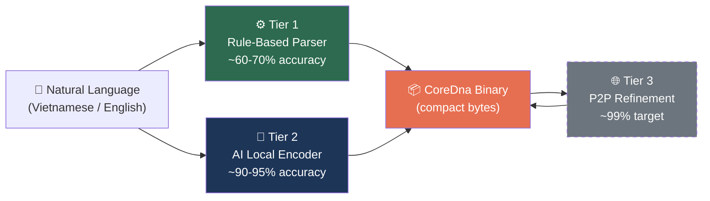
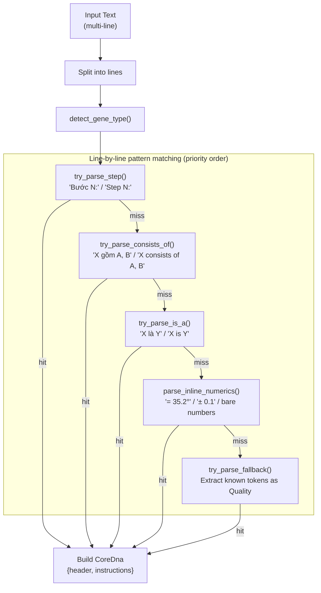
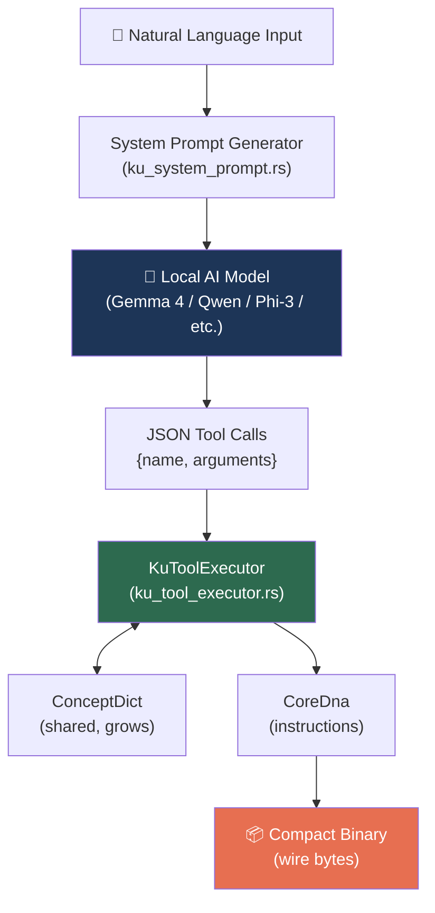
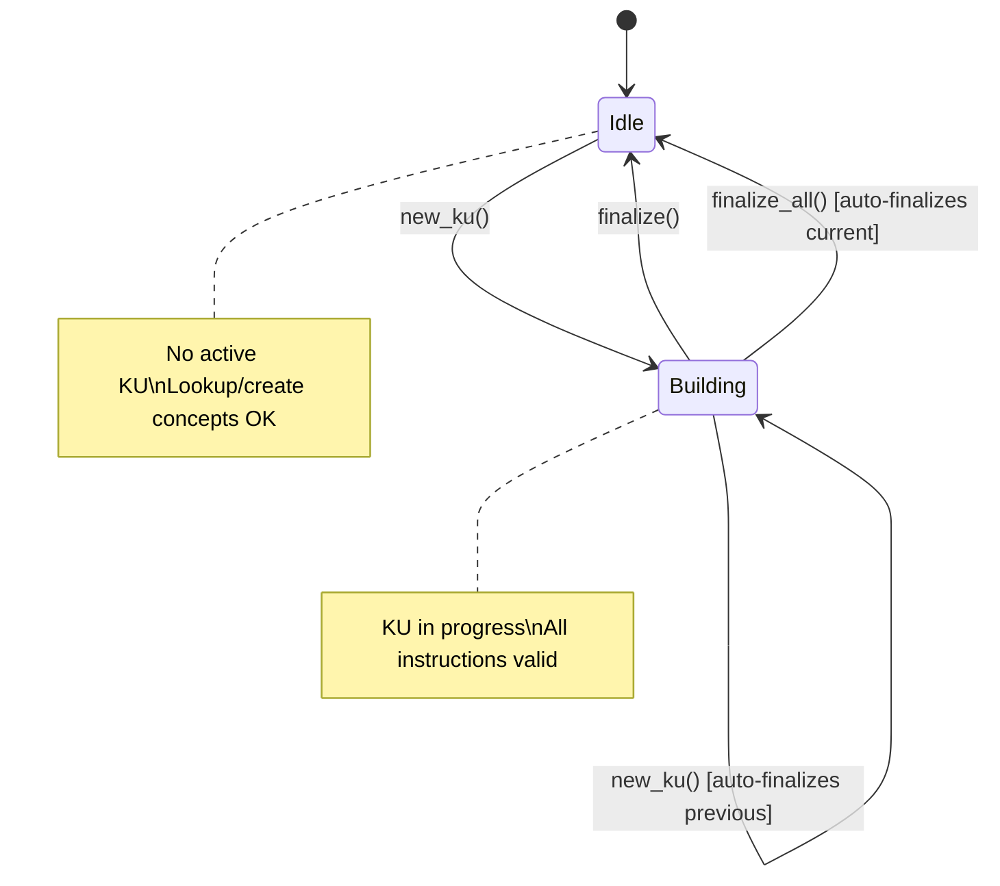
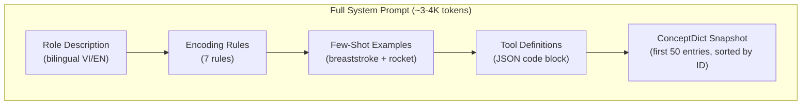
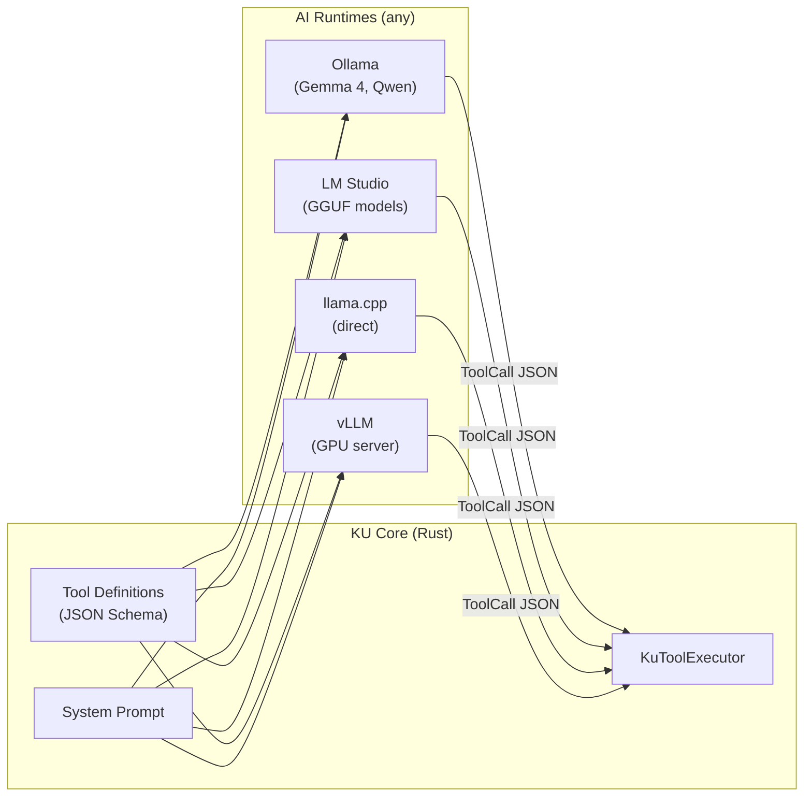
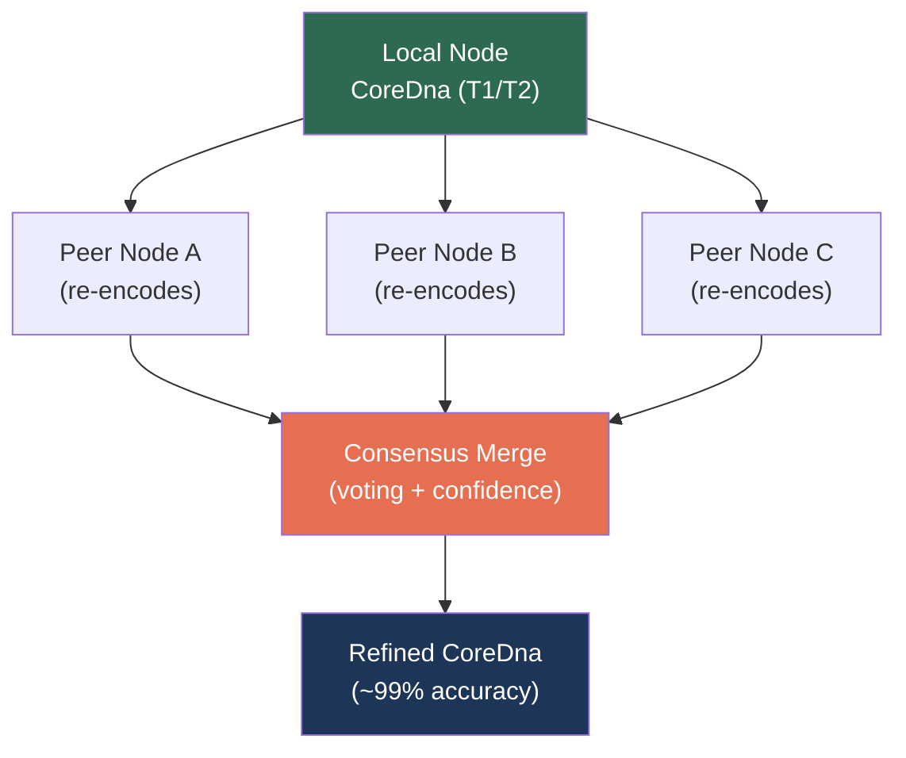

# KU Encoding Pipeline — Complete Specification

> **Status**: Tier 1 ✅ Implemented · Tier 2 ✅ Implemented · Tier 3 🔲 Design only  
> **Source**: `ku-core/src/text_parser.rs`, `ku_tools.rs`, `ku_tool_executor.rs`, `ku_system_prompt.rs`  
> **Last updated**: 2026-06-29

---

## 1. Overview

The KU Encoding Pipeline converts natural-language text (Vietnamese, English, or any language) into compact **CoreDna** binary — a language-agnostic knowledge representation. The pipeline has **3 tiers**, each progressively more accurate:



| Tier | Name | Accuracy | Requires AI | Status |
|------|------|----------|-------------|--------|
| **T1** | Rule-Based Parser | ~60-70% | ❌ No | ✅ Implemented |
| **T2** | AI Local Encoder | ~90-95% | ✅ Local LLM | ✅ Implemented |
| **T3** | P2P Refinement | ~99% | 🌐 Network | 🔲 Design only |

### Design Principles

- **Offline-first**: T1 and T2 work completely offline — no cloud API required
- **Language-agnostic output**: All tiers produce the same `CoreDna` binary format
- **Progressive accuracy**: Each tier refines or replaces the output of the previous one
- **Pluggable AI runtime**: T2 works with any model that supports function calling

---

## 2. Tier 1: Rule-Based Parser

**Source**: [`text_parser.rs`](file:///c:/Users/shpy2/Documents/OneBrain/src/ku-core/src/text_parser.rs)

Tier 1 converts text into CoreDna instructions using **pure pattern matching** — no AI model required. It runs entirely offline and produces a usable (if imperfect) encoding.

### 2.1 Architecture



### 2.2 ConceptDict

The `ConceptDict` is a `HashMap<String, ConceptId>` that maps lowercase word stems to numeric concept IDs.

```rust
pub struct ConceptDict {
    map: HashMap<String, ConceptId>,
    next_id: ConceptId,  // auto-assign starts at 1000
}
```

**Key methods**:

| Method | Behavior |
|--------|----------|
| `lookup(word)` | Returns `ConceptId` or `UNKNOWN_CONCEPT` (127) if not found |
| `lookup_or_create(word)` | Returns existing ID or auto-assigns a new one from `next_id` (1000+) |
| `insert(word, id)` | Manual insertion (used by `default_dict()`) |

**`default_dict()`** provides ~130 pre-mapped entries covering:

- 3 structural predicates (`is_a`, `has_part`, `related_to`)
- 18 unit mappings (degree, meter, second, kg, %, cm, km, ms, min, h — both symbols and full names)
- ~90 sports/swimming vocabulary (Vietnamese + English bilingual)
- ~20 general science terms (temperature, pressure, weight, velocity, etc.)

Sports/science words are assigned IDs starting from **200** and incrementing sequentially.

### 2.3 Well-Known ConceptIds

Reserved IDs form the "Tier-0 universal primitives" — these are hardcoded constants that all tiers share:

| Constant | ID | Meaning |
|----------|------|---------|
| `IS_A` | 1 | "is a" / "là" relationship |
| `HAS_PART` | 2 | "has part" / "gồm" relationship |
| `RELATED_TO` | 3 | Generic relation (fallback) |
| `UNIT_DEGREE` | 10 | Degree (°, °C, °F) |
| `UNIT_METER` | 11 | Meter (m) |
| `UNIT_SECOND` | 12 | Second (s) |
| `UNIT_KILOGRAM` | 13 | Kilogram (kg) |
| `UNIT_PERCENT` | 14 | Percent (%) |
| `UNIT_CENTIMETER` | 15 | Centimeter (cm) |
| `UNIT_KILOMETER` | 16 | Kilometer (km) |
| `UNIT_MILLISECOND` | 17 | Millisecond (ms) |
| `UNIT_MINUTE` | 18 | Minute (min) |
| `UNIT_HOUR` | 19 | Hour (h) |
| `UNIT_DIMENSIONLESS` | 20 | Dimensionless quantity |
| `UNKNOWN_CONCEPT` | 127 | Unknown/fallback concept |
| *(auto-assigned)* | 1000+ | Domain-specific concepts |

### 2.4 Pattern Matching Rules

Patterns are tried **in priority order** per line. The first match wins.

#### 2.4.1 Step Pattern — `try_parse_step()`

| Language | Pattern | Example |
|----------|---------|---------|
| Vietnamese | `Bước N:` / `Bước N.` | "Bước 1: Duỗi tay về phía trước" |
| English | `Step N:` / `Step N.` | "Step 1: Extend arms forward" |

**Output**: `Instruction::Step { ord, action, target }`

The parser extracts:
- `ord` — step number (parsed from N, defaults to 1)
- `action` — first word after the separator → `lookup_or_create`
- `target` — remaining words joined → `lookup_or_create`

#### 2.4.2 Consists-Of Pattern — `try_parse_consists_of()`

| Language | Pattern | Example |
|----------|---------|---------|
| Vietnamese | `X gồm A, B, C` / `X bao gồm A, B` | "Kỹ thuật gồm tay, chân, và thở" |
| English | `X consists of A, B` / `X includes A` / `X contains A` | "Rocket consists of body, shell" |

**Output**: Multiple `Instruction::PartOf { part, whole }` — one per listed part.

Parts are split by `,`, `;`, `và` (Vietnamese "and"), and `and` (English). Deduplication prevents double-entries when both comma and conjunction separators overlap.

#### 2.4.3 Is-A Pattern — `try_parse_is_a()`

| Language | Pattern | Example |
|----------|---------|---------|
| Vietnamese | `X là Y` | "Bơi ếch là kỹ thuật bơi cơ bản" |
| English | `X is Y` / `X is a Y` / `X is an Y` / `X is the Y` | "Breaststroke is a swimming technique" |

**Output**: `Instruction::Triple { s, p: IS_A, o }`

Trailing periods are stripped from the object.

#### 2.4.4 Inline Numerics — `parse_inline_numerics()`

| Pattern | Example | Output |
|---------|---------|--------|
| `= <number><unit>` | "= 35.2°" | `Quantity { value: F32(35.2), unit: UNIT_DEGREE }` |
| `± <number>` / `+- <number>` | "± 0.1" | `Tolerance { delta: F32(0.1) }` |
| `<number><unit>` | "100m", "5kg" | `Quantity { value, unit }` |
| Bare number | "42", "3.14" | `Quantity { value, unit: DIMENSIONLESS }` |

#### 2.4.5 Unit Detection — `detect_unit()`

The unit detector tries suffixes in **longest-first order** to avoid ambiguity (e.g., "cm" before "m"):

```
°c → DEGREE, °f → DEGREE, ° → DEGREE,
cm → CENTIMETER, km → KILOMETER, kg → KILOGRAM,
ms → MILLISECOND, min → MINUTE,
% → PERCENT, m → METER, s → SECOND, h → HOUR
```

#### 2.4.6 Numeric Parsing — `parse_numeric()`

Values are stored in the smallest possible representation:

| Range | Type | Bytes |
|-------|------|-------|
| 0–255 | `U8` | 1 |
| 0–65535 | `U16` | 2 |
| Negative (fits i16) | `I16` | 2 |
| 0–4294967295 | `U32` | 4 |
| Other integers | `I32` | 4 |
| Floating point | `F32` | 4 |

### 2.5 Gene Type Auto-Detection

The parser scans the **full lowercase text** for step-related keywords:

```rust
fn detect_gene_type(lower_text: &str) -> u8 {
    if lower_text.contains("bước") || lower_text.contains("step")
       || lower_text.contains("giai đoạn") || lower_text.contains("phase") {
        return 1; // Procedure
    }
    0 // Fact (default)
}
```

| Contains | Gene Type | Code |
|----------|-----------|------|
| "bước", "step", "giai đoạn", "phase" | Procedure | 1 |
| *(anything else)* | Fact | 0 |

### 2.6 Fallback Pattern

If no other pattern matches a line, the parser extracts recognizable words and creates a `Quality` instruction:
- ≥2 words found → `Quality { s: word[0], q: word[1] }`
- 1 word found → `Quality { s: word[0], q: UNKNOWN_CONCEPT }`

### 2.7 Post-Processing

After all lines are parsed, `link_tolerances()` scans the instruction list and links orphan `Tolerance` instructions (those with `s == UNKNOWN_CONCEPT`) to the most recent preceding `Quantity`, copying its subject and value.

### 2.8 Accuracy Characteristics

| Strength | Limitation |
|----------|-----------|
| ✅ Fully offline, zero latency | ❌ Cannot handle complex sentences |
| ✅ Deterministic, reproducible | ❌ Misses implicit relationships |
| ✅ Handles bilingual (VI + EN) | ❌ No coreference resolution |
| ✅ Good for structured input | ❌ ~60-70% accuracy on free text |

---

## 3. Tier 2: AI Local Encoder

Tier 2 uses a **local AI model** (running via Ollama, LM Studio, llama.cpp, etc.) to perform high-quality encoding via **function calling** (tool use).

### 3.1 Architecture



**Data flow**:
1. The system prompt is generated with the ConceptDict snapshot and tool definitions
2. The AI model receives the prompt + user text
3. The AI outputs JSON tool calls (one or more per turn)
4. `KuToolExecutor` validates and executes each call, building `CoreDna` instructions
5. On `finalize`, the CoreDna is encoded to compact binary

### 3.2 Tool Definitions (15 Tools)

**Source**: [`ku_tools.rs`](file:///c:/Users/shpy2/Documents/OneBrain/src/ku-core/src/ku_tools.rs)

All tools follow OpenAI function calling format and are compatible with any model supporting JSON Schema tool interfaces.

#### Session Management

| # | Tool | Parameters | Description |
|---|------|-----------|-------------|
| 1 | `new_ku` | `gene_type: string` ∈ {fact, procedure, experience, hypothesis, testimony, formal, composite} | Start a new KU. Must be called before adding instructions. Auto-finalizes any in-progress KU. |
| 2 | `finalize` | *(none)* | Finalize current KU → encode to binary. Must be called after each KU. |

#### Concept Lookup

| # | Tool | Parameters | Description |
|---|------|-----------|-------------|
| 3 | `lookup` | `word: string` | Look up word in ConceptDict. Returns ID or 0 if not found. Always try this before `lookup_or_create`. |
| 4 | `lookup_or_create` | `word: string` | Look up word; if missing, auto-assign new ConceptId (≥1000). Use for domain-specific terms. |

#### Relationship Instructions

| # | Tool | Parameters | Description |
|---|------|-----------|-------------|
| 5 | `add_triple` | `subject: int`, `predicate: int`, `object: int` | SPO triple. "X is Y", "X has property P", "X uses M". Most general instruction. |
| 6 | `add_part_of` | `part: int`, `whole: int` | Composition. "Y is part of X", "X contains Y". |
| 7 | `add_quality` | `subject: int`, `quality: int` | Assign property. "X is lightweight", "X is reliable". |
| 8 | `add_quantity` | `subject: int`, `value: number`, `unit: string` | Numeric measurement. "temp = 100°C", "wingspan = 35.2m". Unit values: degree, meter, second, kg, percent, cm, km, ms, min, hour, dimensionless. |
| 9 | `add_tolerance` | `subject: int`, `value: number`, `delta: number` | Tolerance/margin. "± 0.5°", "± 2mm". |
| 10 | `add_enum_val` | `subject: int`, `values: int[]` | Possible values. "Material can be A, B, or C". |
| 11 | `add_causal` | `cause: int`, `effect: int` | Cause-effect. "high pressure → needs strength", "combustion → thrust". |
| 12 | `add_located` | `subject: int`, `location: int` | Spatial location. "payload is at nose", "engine is at tail". |

#### Procedure Instructions

| # | Tool | Parameters | Description |
|---|------|-----------|-------------|
| 13 | `add_step` | `ord: int`, `action: int`, `target: int` | Procedural step (for procedure KUs). Steps ordered by `ord` (0-based). |

#### Metadata Instructions

| # | Tool | Parameters | Description |
|---|------|-----------|-------------|
| 14 | `set_certainty` | `level: int` (0–10000) | Confidence level. 10000 = axiomatic, 9500 = established fact, 9000 = high, 7000 = moderate, 5000 = uncertain, <3000 = speculation. |
| 15 | `set_difficulty` | `level: int` (0–5) | Complexity for procedure KUs. 0 = trivial, 3 = complex, 5 = expert. |

#### Gene Type Codes

| Name | Code | Description |
|------|------|-------------|
| `fact` | 0 | Declarative knowledge |
| `procedure` | 1 | Step-by-step instructions |
| `experience` | 2 | Sensory/emotional |
| `creative` | 3 | Creative works |
| `media` | 4 | Media experience |
| `testimony` | 5 | Witness accounts |
| `formal` | 6 | Formal/mathematical |
| `hypothesis` | 7 | Unverified claims |
| `narrative` | 8 | Stories/narratives |
| `sensory` | 9 | Raw sensory data |
| `composite` | 10 | Multi-type composite |

### 3.3 KuToolExecutor — Stateful Execution

**Source**: [`ku_tool_executor.rs`](file:///c:/Users/shpy2/Documents/OneBrain/src/ku-core/src/ku_tool_executor.rs)

The executor is a stateful machine that processes tool calls sequentially and builds CoreDna objects.



#### State Model

```rust
pub struct KuToolExecutor {
    dict: ConceptDict,          // Shared, grows as AI creates concepts
    current: Option<KuBuilder>, // Active KU being built (None = idle)
    completed: Vec<CoreDna>,    // Finalized KUs
    stats: EncodingStats,       // Counters for reporting
}
```

#### Key Behaviors

| Behavior | Detail |
|----------|--------|
| **Auto-finalize** | Calling `new_ku()` when another KU is in progress automatically finalizes the previous one |
| **Auto-finalize on finish** | `finalize_all()` auto-finalizes any in-progress KU before encoding all completed KUs to wire bytes |
| **Shared ConceptDict** | The dictionary is shared across all KUs in a session. Concepts created for KU #1 are available in KU #2 |
| **Error isolation** | Each tool call returns `ToolResult { success, message, data? }`. Failures don't abort the session |
| **Guard checks** | Instructions require an active KU (`require_active_ku()`). Lookup/create work anytime |

#### EncodingStats

The executor tracks comprehensive statistics:

```rust
pub struct EncodingStats {
    pub total_kus: usize,
    pub total_instructions: usize,
    pub total_wire_bytes: usize,
    pub concepts_created: usize,
    pub concepts_looked_up: usize,
    pub tool_calls_processed: usize,
    pub tool_calls_failed: usize,
}
```

### 3.4 System Prompt Generator

**Source**: [`ku_system_prompt.rs`](file:///c:/Users/shpy2/Documents/OneBrain/src/ku-core/src/ku_system_prompt.rs)

The system prompt instructs the AI model to act as a **Knowledge Encoder** (Bộ mã hóa Tri thức). Two variants are generated:

| Variant | Function | Target Size | Dict Entries | Few-Shot |
|---------|----------|------------|--------------|----------|
| **Full** | `generate_system_prompt()` | ~3-4K tokens | 50 | ✅ 2 examples |
| **Compact** | `generate_compact_prompt()` | <2K tokens | 20 | ❌ None |

#### Prompt Structure



#### Key Encoding Rules (embedded in prompt)

1. **1 KU = 1 idea** — Never pack multiple facts into a single KU
2. **Always lookup concepts first** — Call `lookup` before `lookup_or_create`
3. **Set certainty** — Use `set_certainty` for epistemic status
4. **Call finalize** — A KU is not saved until finalized
5. **Encoding order**: lookup → create KU → add instructions → set certainty → finalize
6. **Typed relations**: is_a, has_part, causes, requires, follows, measured_as, related_to
7. **Gene type matching**: Quantity for numbers, Step for procedures, etc.

#### ConceptDict Snapshot

The prompt includes a markdown table of the first N dictionary entries (sorted by ConceptId) so the AI can resolve words without guessing:

```
| Word | ConceptId |
|------|----------|
| is_a | 1 |
| has_part | 2 |
| related_to | 3 |
| degree | 10 |
| ° | 10 |
| meter | 11 |
| m | 11 |
...
```

If the dictionary has more entries than the snapshot limit, a note indicates: _"…and N more entries. Use `lookup_concept` for unlisted words."_

### 3.5 AI Runtime — Pluggable (Option C)

The AI runtime is **fully pluggable**. The tool definitions and system prompt are format-agnostic — they work with any local model that supports function calling or structured output.



#### Compatible Models

| Model | Function Calling | Vietnamese | Notes |
|-------|-----------------|------------|-------|
| **Gemma 4 27B** | ✅ Native | ✅ Good | Recommended for bilingual |
| **Qwen 2.5 14B/32B** | ✅ Native | ✅ Strong | Best CJK + Vietnamese |
| **Phi-3 14B** | ✅ Native | ⚠️ Moderate | Good for English-heavy |
| **Llama 3.1 8B/70B** | ✅ Native | ⚠️ Basic | Fallback option |
| **Mistral 7B** | ✅ Via grammar | ❌ Weak | Not recommended |

**Minimum requirements**:
- Function calling / tool use support
- Vietnamese text understanding (for bilingual input)
- Context window ≥ 4K tokens (full prompt) or ≥ 2K tokens (compact prompt)

#### Output Format

The model outputs tool calls in standard JSON format:

```json
{
  "name": "add_triple",
  "arguments": {
    "subject": 1000,
    "predicate": 1,
    "object": 1001
  }
}
```

Tool definitions are also available in **OpenAI-compatible format** via `tool_definitions_openai_format()`:

```json
{
  "type": "function",
  "function": {
    "name": "add_triple",
    "description": "Add a Subject-Predicate-Object triple...",
    "parameters": { ... }
  }
}
```

---

## 4. Tier 3: P2P Refinement (Design Only)

> [!IMPORTANT]
> Tier 3 is **not yet implemented**. This section describes the planned design.

### 4.1 Concept

After T1 or T2 produces a CoreDna encoding, the P2P network refines it through **epistemic consensus** — multiple nodes independently verify and improve the encoding.



### 4.2 Planned Refinement Mechanisms

| Mechanism | Description |
|-----------|-------------|
| **Re-encoding** | Peers independently encode the same text and compare results |
| **Concept alignment** | Peers vote on the correct ConceptId mapping for ambiguous terms |
| **Relationship correction** | Peers can propose alternative predicates (e.g., IS_A vs HAS_PART) |
| **Certainty calibration** | Network-wide calibration of certainty scores based on peer agreement |
| **Contradiction detection** | Identify and flag conflicting KUs from different sources |

### 4.3 Consensus Protocol (Planned)

1. **Broadcast**: Local node publishes CoreDna + original text hash
2. **Challenge**: K random peers re-encode the text independently
3. **Compare**: Instructions are compared element-by-element
4. **Vote**: For each disagreement, peers vote on the correct encoding
5. **Merge**: The node with majority agreement wins; certainty is adjusted based on agreement ratio

---

## 5. ConceptDict Design

### 5.1 ID Space Layout

```
 ID Range        │ Purpose
─────────────────┼──────────────────────────
      0          │ Reserved (unused)
    1 – 3        │ Structural predicates (IS_A, HAS_PART, RELATED_TO)
    4 – 9        │ Reserved (future predicates)
   10 – 20       │ Physical units (degree, meter, second, ...)
   21 – 126      │ Reserved (future units / primitives)
     127         │ UNKNOWN_CONCEPT (sentinel)
  128 – 199      │ Reserved (system)
  200 – 999      │ Pre-assigned vocabulary (default_dict)
 1000+           │ Auto-assigned (domain-specific, grows at runtime)
```

### 5.2 Auto-Assignment

When `lookup_or_create("new_word")` is called for an unknown word:
1. The word is normalized to lowercase
2. A new ID is assigned from `next_id` (starting at 1000)
3. `next_id` is incremented
4. The mapping is stored in the HashMap

```rust
// Example: first 3 auto-assigned concepts
"rocket"        → 1000
"body"          → 1001
"shell"         → 1002
```

### 5.3 Future: SQLite Persistence

Currently, `ConceptDict` lives in memory and resets between sessions. The planned enhancement:

| Current | Future |
|---------|--------|
| `HashMap<String, ConceptId>` | SQLite table `concepts(word TEXT, id INTEGER)` |
| Lost on restart | Persisted across sessions |
| Per-session auto-assign | Global auto-assign with collision detection |
| No versioning | Version history with timestamps |

---

## 6. Complete Rocket Example

### 6.1 Input Text (1078 bytes, Vietnamese)

```text
Tên lửa gồm thân và vỏ.
Thân được làm từ hợp kim nhôm-liti, titan, hoặc carbon composite.
Thân có đặc tính nhẹ và bền, chịu được áp lực lớn.

Động cơ nhiên liệu lỏng:
Bước 1: Bơm nhiên liệu
Bước 2: Bơm hydro lỏng
Bước 3: Bơm oxy lỏng
Bước 4: Buồng đốt tạo lực đẩy

Nhiên liệu rắn đơn giản và tin cậy.

Hệ thống dẫn đường và điều khiển gồm IMU, con quay hồi chuyển,
và máy tính bay. Thrust vectoring điều chỉnh quỹ đạo.

Khoang tải trọng ở đầu tên lửa, chứa vệ tinh, thiết bị nghiên cứu,
hoặc đầu đạn.
```

### 6.2 Encoding Process (Tier 2 — simulated AI)

#### Phase 1: Concept Registration

The AI first registers all domain-specific concepts via `lookup_or_create`:

```
lookup_or_create("tên lửa")           → 1000 (NEW)
lookup_or_create("thân")              → 1001 (NEW)
lookup_or_create("vỏ")               → 1002 (NEW)
lookup_or_create("hợp kim nhôm-liti") → 1003 (NEW)
lookup_or_create("titan")             → 1004 (NEW)
lookup_or_create("carbon composite")  → 1005 (NEW)
lookup_or_create("động cơ")           → 1006 (NEW)
lookup_or_create("nhiên liệu")       → 1007 (NEW)
lookup_or_create("hydro lỏng")       → 1008 (NEW)
lookup_or_create("oxy lỏng")         → 1009 (NEW)
lookup_or_create("buồng đốt")        → 1010 (NEW)
lookup_or_create("lực đẩy")          → 1011 (NEW)
lookup_or_create("bơm")              → 1012 (NEW)
lookup_or_create("nhiên liệu rắn")   → 1013 (NEW)
lookup_or_create("đơn giản")         → 1014 (NEW)
lookup_or_create("tin cậy")          → 1015 (NEW)
lookup_or_create("dẫn đường")        → 1016 (NEW)
lookup_or_create("điều khiển")       → 1017 (NEW)
lookup_or_create("imu")              → 1018 (NEW)
lookup_or_create("con quay hồi chuyển") → 1019 (NEW)
lookup_or_create("máy tính bay")     → 1020 (NEW)
lookup_or_create("quỹ đạo")         → 1021 (NEW)
lookup_or_create("thrust vectoring") → 1022 (NEW)
lookup_or_create("khoang tải trọng") → 1023 (NEW)
lookup_or_create("vệ tinh")         → 1024 (NEW)
lookup_or_create("đầu đạn")         → 1025 (NEW)
lookup_or_create("thiết bị nghiên cứu") → 1026 (NEW)
lookup_or_create("nhẹ")             → 1027 (NEW)
lookup_or_create("bền")             → 1028 (NEW)
lookup_or_create("áp lực lớn")      → 1029 (NEW)
lookup_or_create("vật liệu")        → 1030 (NEW)
lookup_or_create("đầu tên lửa")     → 1031 (NEW)
```

#### Phase 2: Build 5 KUs

##### KU #1 — Body & Shell (Fact)

```
new_ku(gene_type="fact")
add_part_of(part=1001, whole=1000)             // thân ⊂ tên lửa
add_part_of(part=1002, whole=1000)             // vỏ ⊂ tên lửa
add_triple(s=1001, p=1030, o=1003)             // thân [vật liệu] hợp kim nhôm-liti
add_enum_val(s=1030, values=[1003,1004,1005])  // vật liệu ∈ {nhôm-liti, titan, carbon}
add_quality(s=1001, q=1027)                    // thân → nhẹ
add_quality(s=1001, q=1028)                    // thân → bền
add_causal(cause=1029, effect=1028)            // áp lực lớn → bền
set_certainty(level=9500)                      // established fact
finalize()                                     // → ~40 bytes
```

##### KU #2 — Liquid Fuel Engine (Procedure)

```
new_ku(gene_type="procedure")
add_part_of(part=1006, whole=1000)             // động cơ ⊂ tên lửa
add_step(ord=0, action=1012, target=1007)      // Step 0: bơm nhiên liệu
add_step(ord=1, action=1012, target=1008)      // Step 1: bơm hydro lỏng
add_step(ord=2, action=1012, target=1009)      // Step 2: bơm oxy lỏng
add_step(ord=3, action=1010, target=1011)      // Step 3: buồng đốt → lực đẩy
set_difficulty(level=4)                        // very complex
finalize()                                     // → ~36 bytes
```

##### KU #3 — Solid Fuel (Fact)

```
new_ku(gene_type="fact")
add_triple(s=1013, p=1030, o=1007)             // nhiên liệu rắn [vật liệu] nhiên liệu
add_quality(s=1013, q=1014)                    // nhiên liệu rắn → đơn giản
add_quality(s=1013, q=1015)                    // nhiên liệu rắn → tin cậy
set_certainty(level=9000)                      // high confidence
finalize()                                     // → ~24 bytes
```

##### KU #4 — Guidance & Control (Fact)

```
new_ku(gene_type="fact")
add_part_of(part=1016, whole=1000)             // dẫn đường ⊂ tên lửa
add_part_of(part=1017, whole=1000)             // điều khiển ⊂ tên lửa
add_enum_val(s=1016, values=[1018,1019,1020])  // dẫn đường ∈ {IMU, gyro, flight computer}
add_causal(cause=1022, effect=1021)            // thrust vectoring → quỹ đạo
set_certainty(level=9500)                      // established fact
finalize()                                     // → ~34 bytes
```

##### KU #5 — Payload Bay (Fact)

```
new_ku(gene_type="fact")
add_part_of(part=1023, whole=1000)             // khoang tải trọng ⊂ tên lửa
add_located(s=1023, location=1031)             // khoang tải trọng @ đầu tên lửa
add_enum_val(s=1023, values=[1024,1026,1025])  // tải trọng ∈ {vệ tinh, thiết bị, đầu đạn}
set_certainty(level=9000)                      // high confidence
finalize()                                     // → ~28 bytes
```

### 6.3 Results Summary

```
┌───────────┬────────────────────────┬───────────┬──────────────┐
│ KU #      │ Content                │ Type      │ Wire Bytes   │
├───────────┼────────────────────────┼───────────┼──────────────┤
│ 1         │ Body & Shell           │ fact      │ ~40          │
│ 2         │ Liquid Fuel Engine     │ procedure │ ~36          │
│ 3         │ Solid Fuel             │ fact      │ ~24          │
│ 4         │ Guidance & Control     │ fact      │ ~34          │
│ 5         │ Payload Bay            │ fact      │ ~28          │
├───────────┼────────────────────────┼───────────┼──────────────┤
│ **Total** │ 5 KUs, 32 concepts    │ —         │ **~162 bytes**│
└───────────┴────────────────────────┴───────────┴──────────────┘

📝 Input text:     1078 bytes
📦 CoreDna output: ~162 bytes  (actual test result: 172 bytes)
📉 Compression:    ~6.3x smaller
```

> [!NOTE]
> The exact wire byte counts vary slightly depending on CoreDna encoding version and instruction padding. The test suite (`test_full_rocket_5_kus`) validates the total is well under 1078 bytes — typically around 162–172 bytes.

### 6.4 What Each Tier Would Produce

| Aspect | Tier 1 (Rule-Based) | Tier 2 (AI) | Tier 3 (P2P) |
|--------|-------------------|-------------|--------------|
| KU count | 1 (monolithic) | 5 (atomic) | 5 (refined) |
| Concept resolution | Partial (dict-based) | Full (contextual) | Verified (consensus) |
| Relationships | Only explicit patterns | Implicit + explicit | Validated |
| Certainty scores | Not set | AI-calibrated | Network-calibrated |
| Accuracy | ~65% | ~93% | ~99% (target) |

---

## 7. Reference: File Map

| File | Role | Lines |
|------|------|-------|
| [`text_parser.rs`](file:///c:/Users/shpy2/Documents/OneBrain/src/ku-core/src/text_parser.rs) | T1 rule-based parser, ConceptDict, well-known IDs | ~1100 |
| [`ku_tools.rs`](file:///c:/Users/shpy2/Documents/OneBrain/src/ku-core/src/ku_tools.rs) | 15 tool definitions (JSON Schema), unit/gene-type resolution | ~454 |
| [`ku_tool_executor.rs`](file:///c:/Users/shpy2/Documents/OneBrain/src/ku-core/src/ku_tool_executor.rs) | Stateful executor, CoreDna builder, encoding stats | ~754 |
| [`ku_system_prompt.rs`](file:///c:/Users/shpy2/Documents/OneBrain/src/ku-core/src/ku_system_prompt.rs) | System prompt generator (full + compact), few-shot examples | ~521 |
