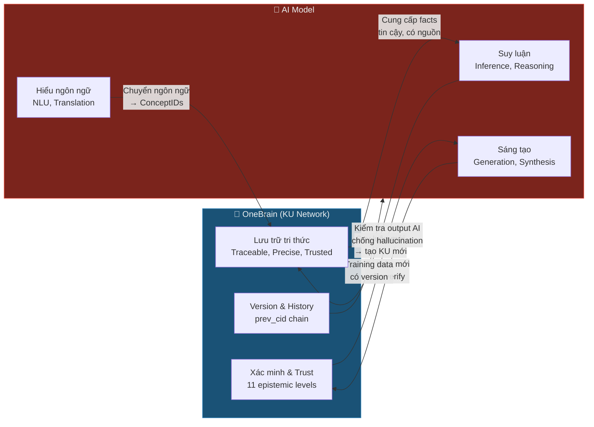

# 🧬 vs 🧠 Knowledge DNA (KU) khác gì AI Model?

> **Câu hỏi:** "KU lưu trữ tri thức kiểu DNA, vậy nó khác gì train 1 model AI có hàng tỷ tham số?"
>
> Đây là câu hỏi cốt lõi. Câu trả lời KHÔNG chỉ là "phân tán vs tập trung" — mà là **hai paradigm hoàn toàn khác nhau** về bản chất, mục tiêu, và cách vận hành tri thức.

---

## 0. Phép ẩn dụ trước khi đi vào chi tiết

> **KU giống Thư viện. AI Model giống Bộ não.**

| | 📚 Thư viện (KU) | 🧠 Bộ não (AI Model) |
|---|---|---|
| Tri thức ở đâu? | Trong từng **cuốn sách**, có tác giả, ngày xuất bản, ISBN | **Hòa tan** trong 175 tỷ kết nối synapse, không tách ra được |
| Hỏi "ai nói?" | Mở sách → thấy tên tác giả, nhà xuất bản, bản in lần mấy | "Tôi không nhớ, nhưng tôi *nghĩ* là..." |
| Sửa sai 1 fact | Thay 1 cuốn sách, các cuốn khác không bị ảnh hưởng | Phải **train lại cả bộ não** (tốn $100M+) |
| Tin được không? | Xem review trên Goodreads, xem nhà xuất bản, đọc footnotes | "Trust me bro" — hoặc hallucinate |
| Ai sở hữu? | Tác giả giữ copyright, thư viện giữ bản vật lý | OpenAI/Google sở hữu, bạn chỉ thuê dùng |
| Mất điện? | Sách vẫn nằm trên kệ | Bộ não ngưng hoạt động |

**Cả hai đều cần thiết.** Bạn vào thư viện tra sách (KU), nhưng bạn cũng cần bộ não (AI) để **hiểu** sách, liên hệ, sáng tạo. Vấn đề là hiện tại thế giới **chỉ có bộ não (AI) mà không có thư viện tốt** — nên bộ não phải tự nhớ mọi thứ → hallucinate.

---

## 1. Bảng so sánh tổng quan — 10 khác biệt cốt lõi

| # | Tiêu chí | 🧬 Knowledge DNA (KU) | 🧠 AI Model (LLM) |
|---|----------|----------------------|-------------------|
| 1 | **Dạng tri thức** | **Explicit** — mỗi fact là 1 đơn vị rõ ràng, đọc được | **Implicit** — tri thức hòa tan trong tỷ weights, không tách ra được |
| 2 | **Nguồn gốc** | **Traceable** — mỗi KU có CID, author, evidence type | **Opaque** — "trained on internet data", không truy xuất được fact từ đâu |
| 3 | **Cập nhật** | **Granular** — sửa 1 KU, phần còn lại nguyên vẹn | **Catastrophic** — fine-tune 1 fact → có thể phá hàng nghìn facts khác |
| 4 | **Tin cậy** | **Verifiable** — 11 epistemic levels + trust score + evidence type | **Hallucinating** — tự tin nói sai, không biết mình sai |
| 5 | **Cấu trúc** | **Composable** — tổ hợp/tách rời như LEGO | **Entangled** — mọi thứ đan xen, không tách ra được |
| 6 | **Sở hữu** | **Ownable** — tác giả ký DID, giữ attribution | **Collective** — training data mất traceability |
| 7 | **Bền vững** | **Immortal** — replicated trên hàng nghìn nodes | **Decaying** — knowledge cutoff, outdated mỗi ngày |
| 8 | **Chính xác** | **Precise** — "sweep angle = 25.000°" stored chính xác | **Approximate** — "khoảng 25 độ" (nếu không hallucinate) |
| 9 | **Quản trị** | **Democratic** — PoK, ai cũng có thể contribute | **Centralized** — chỉ Google/OpenAI quyết định training data |
| 10 | **Vai trò** | **Bộ nhớ** — lưu trữ, tổ chức, truy xuất | **Bộ xử lý** — suy luận, tổng hợp, sáng tạo |

---

## 2. Phân tích chi tiết từng khác biệt

### 2.1 🔍 Explicit vs Implicit — Hai cách "biết"

**AI Model biết theo kiểu implicit (ẩn):**
```
Input:  "Sweep angle của Boeing 737 là bao nhiêu?"
Output: "Góc sweep của Boeing 737 là khoảng 25 độ."

Nhưng: tri thức này nằm ĐÂU trong 175 tỷ parameters?
→ KHÔNG AI BIẾT. Kể cả OpenAI.
→ Nó là hệ quả thống kê của patterns trong training data.
```

**KU biết theo kiểu explicit (hiện):**
```
KU #4782:
  Gene: Fact
  Codons: (Boeing_737_Wing, sweep_angle, 25.0°)
  Trust: PeerReviewed, EvidenceType::Experimental
  Author: DID:ob:boeing_eng_team
  Evidence: Boeing 737-800 TCDS A16WE, Rev 72
  Confidence: 0.99
  → Bạn biết CHÍNH XÁC fact này từ đâu, ai viết, tin cậy cỡ nào.
```

> **Ý nghĩa thực tế:** Nếu FAA hỏi "dựa vào đâu mà bạn nói sweep angle là 25°?" — KU trả lời được, AI không trả lời được.

### 2.2 🔄 Granular vs Catastrophic Update

**AI Model — Catastrophic Forgetting:**
```
Phát hiện: "Sweep angle mới nhất là 25.5° (after modification)"

Để cập nhật AI:
1. Thu thập lại toàn bộ training data → $2M
2. Train lại model 3 tháng → $100M+ (GPT-4 class)
3. HOẶC fine-tune → RỦI RO: "catastrophic forgetting" 
   (sửa 1 fact → model quên 1000 facts khác)
4. HOẶC RAG → patch bên ngoài, không thực sự "học"
```

**KU — Surgical Update:**
```
Để cập nhật KU:
1. Tạo KU mới: (Boeing_737_Wing, sweep_angle, 25.5°)
2. prev_cid trỏ về KU cũ → version history
3. Trust section: EpistemicStatus::Updated
4. Tốn: ~300 bytes + 1 microsecond
5. Tất cả KU khác KHÔNG bị ảnh hưởng
```

### 2.3 🎯 Verifiable vs Hallucinating

Đây là **killer difference**.

```
Hỏi AI:  "Tốc độ stall của 737 là bao nhiêu?"
AI đáp:  "Tốc độ stall của Boeing 737 là khoảng 115 knots."

Hỏi tiếp: "Nguồn?"
AI đáp:  "Dựa trên thông tin công khai từ Boeing."
         (KHÔNG CÓ NGUỒN CỤ THỂ — có thể đúng, có thể sai, 
          có thể hallucinate hoàn toàn)
```

```
Hỏi KU:  FIND (k:KU) WHERE k.codons CONTAINS concept_id = STALL_SPEED 
          AND k.codons CONTAINS concept_id = BOEING_737

KU trả về:
  KU #5201:
    Fact: (Boeing_737, stall_speed_clean, 110_knots)
    EpistemicStatus: Consensus (level 9/11)
    EvidenceType: Experimental
    Verification: 4 (Formal)
    Trust score: 8,750
    Corroborations: 47
    Challenges: 0
    Error susceptibility: 0x0000 (no known biases)
    Source: FAA TCDS A16WE Rev 72, Section 5
    → BẠN BIẾT CHÍNH XÁC: 110 knots (không phải "khoảng 115"),
      47 nguồn corroborate, 0 challenge, evidence experimental.
```

### 2.4 🧩 Composable vs Entangled

```
KU Knowledge = LEGO blocks
┌──────┐ ┌──────┐ ┌──────┐
│ Fact │ │ Fact │ │Formal│  ← Mỗi block tách rời được
│sweep │ │area  │ │drag  │  ← Tổ hợp tùy ý
│ 25°  │ │124m² │ │polar │  ← Thay 1 block, các block khác nguyên
└──┬───┘ └──┬───┘ └──┬───┘
   └────────┴────────┘
        Composite KU
    "Wing Geometry"

AI Knowledge = Bê tông trộn
┌─────────────────────────────────┐
│  ██████████████████████████████ │  ← Mọi thứ đổ chung 1 khối
│  █ sweep? area? drag? █████████ │  ← Không tách ra được
│  ██████████████████████████████ │  ← Phá 1 chỗ → nứt toàn bộ
│  ██████ 175 BILLION PARAMS ████ │
└─────────────────────────────────┘
```

### 2.5 ⚖️ Ownership & Attribution

| Tình huống | KU | AI Model |
|------------|-----|----------|
| Bạn đóng góp 1 fact | DID ký → attribution vĩnh viễn | Fact hòa tan trong training data → mất |
| Bạn muốn xóa contribution | Deprecate KU → signed by author | Không thể "unlearn" từ model |
| Ai được credit? | Tác giả KU, via PoK → OBT tokens | Công ty AI (OpenAI, Google) |
| Bạn muốn kiểm soát access? | Encryption flag trên KU | Không — model đã học rồi |

### 2.6 📏 Precision — Thiết kế máy bay cần CHÍNH XÁC

> **Đây là nơi AI THẤT BẠI HOÀN TOÀN cho safety-critical domains.**

| Thông số | KU stores | AI "biết" |
|----------|-----------|----------|
| Sweep angle | **25.000° ± 0.001°** | "khoảng 25 độ" |
| Load factor | **2.5g (FAR 25.337)** | "thường là 2.5g" |
| Fatigue life | **75,000 cycles (MIL-HDBK-5)** | "hàng chục nghìn cycles" |
| Drag polar | **$C_D = 0.015 + 0.045 C_L^2$** | Có thể đúng, có thể sai hệ số |
| Material yield | **324 MPa (Al 2024-T3)** | "khoảng 300-350 MPa" |

Trong hàng không: **"khoảng" ≈ chết người**. KU lưu chính xác từng con số. AI xấp xỉ.

---

## 3. Nhưng AI giỏi hơn KU ở đâu?

> **Sẽ thiếu trung thực nếu không thừa nhận điểm mạnh của AI.**

| Khả năng | AI Model ✅ | KU ❌ |
|----------|-----------|------|
| **Suy luận** | "Nếu sweep > 25° và không có slats, thì stall speed sẽ tăng ~15%" | KU không suy luận — chỉ lưu facts |
| **Sáng tạo** | Đề xuất wing design mới dựa trên patterns | KU không sáng tạo — chỉ tổ chức |
| **Ngôn ngữ tự nhiên** | Giải thích bằng tiếng Việt cho non-expert | KU dùng ConceptIDs, cần interface |
| **Pattern recognition** | Phát hiện "CFD này giống case XYZ 2019" | KU cần explicit bonds |
| **Tổng hợp** | Summarize 200 papers thành 1 paragraph | KU cần query + processing |
| **Generalization** | Áp dụng kiến thức sang domain mới | KU domain-specific |

---

## 4. The Real Answer: KU + AI = Siêu năng lực

> **KU và AI KHÔNG CẠNH TRANH — chúng BỔ SUNG cho nhau.**
>
> KU là **bộ nhớ dài hạn, tin cậy, traceable** cho AI.
> AI là **bộ xử lý, suy luận, sáng tạo** cho KU.



### Ví dụ workflow thực tế:

```
Kỹ sư: "Thiết kế winglet cho 737 MAX để giảm drag 3%"

1. AI query OneBrain:
   FIND KU WHERE codons CONTAINS (Boeing_737, wing_geometry) 
   → Nhận 47 KUs chính xác: sweep=25°, AR=9.45, area=124.6m²...
   → Mỗi KU có trust score, source, evidence type

2. AI suy luận:
   "Dựa trên dữ liệu chính xác từ KU, đề xuất winglet profile 
    với cant angle 8° và height 2.4m..."

3. AI tạo KU mới:
   Gene::Hypothesis {
     body: (Winglet_737MAX, drag_reduction, 3.2%),
     confidence: THEORETICAL,
     methodology: CFD_SIMULATION,
     maturity: SIMULATED
   }

4. OneBrain lưu + verify:
   - Trust: EpistemicStatus::Hypothesis
   - Evidence: Theoretical (sẽ upgrade khi wind tunnel test)
   - CID → immutable, traceable
   - Các kỹ sư khác có thể corroborate hoặc challenge
```

**Không có KU:** AI hallucinate "sweep angle khoảng 27°" → winglet design sai → tiền mất.
**Không có AI:** KU chỉ có raw facts → kỹ sư phải tự suy luận → chậm.
**Có cả hai:** AI suy luận trên facts chính xác → kết quả tin cậy, nhanh.

---

## 5. Killer Arguments cho mỗi tình huống

### Khi người ta hỏi "AI đã đủ rồi, cần gì KU?"

| Câu hỏi phản biện | Trả lời |
|-------------------|---------|
| "GPT đã biết mọi thứ rồi" | GPT **không biết** — GPT **đoán** dựa trên statistics. Hỏi nó 1 fact cụ thể 3 lần → có thể ra 3 đáp án khác nhau. |
| "AI có RAG rồi mà" | RAG chỉ là "search Google + paste vào prompt". KU có **trust score, epistemic level, versioning, provenance** — RAG không có. |
| "Train model đắt nhưng xong 1 lần là xong" | "Xong 1 lần" nghĩa là **outdated ngay lập tức**. GPT-4 knowledge cutoff = cũ. KU update real-time, từng fact. |
| "AI sẽ ngày càng giỏi hơn" | Đúng — và nó sẽ **cần KU hơn** vì AI càng giỏi thì càng cần **dữ liệu tin cậy, traceable** để không hallucinate. |
| "Billions params lưu trữ nhiều hơn" | GPT-4 ~1.8 trillion params × 2 bytes = 3.6 TB. Nhưng **không extract được 1 fact**. 3.6 TB KU = **~13 tỷ facts**, mỗi fact traceable. |

### Khi người ta hỏi "Vậy KU không cần AI?"

> Cần! KU **cần AI** để:
> - Chuyển đổi ngôn ngữ tự nhiên → ConceptIDs
> - Phát hiện duplicate/contradiction
> - Suy luận trên facts
> - Tổng hợp & trình bày cho người dùng

---

## 6. Elevator Pitch (30 giây)

> **"AI models giống bộ não — giỏi suy luận nhưng nhớ mơ hồ, không biết nguồn, và hallucinate. Knowledge DNA giống bộ nhớ — lưu chính xác từng fact, biết ai nói, tin cậy cỡ nào, update từng fact mà không phá phần còn lại. Bạn không chọn giữa não và bộ nhớ — bạn cần CẢ HAI. OneBrain là bộ nhớ tin cậy mà mọi AI đều cần."**

---

## 7. Một câu duy nhất

> **KU lưu trữ tri thức để AI DÙNG — giống như sách lưu trữ tri thức để não DÙNG. Không ai hỏi "cần gì sách khi đã có não?"**
