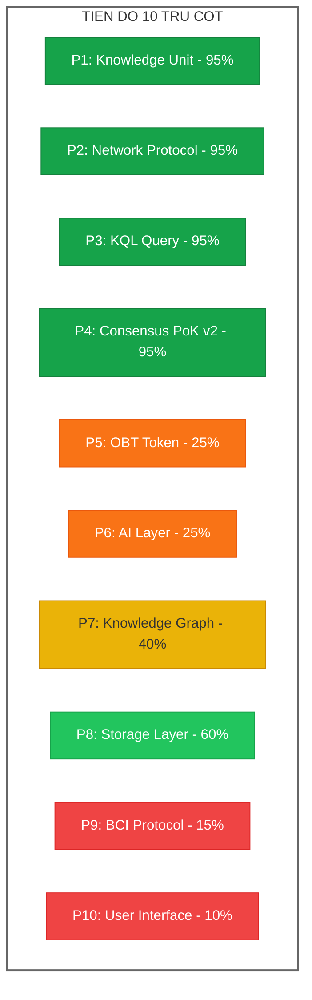
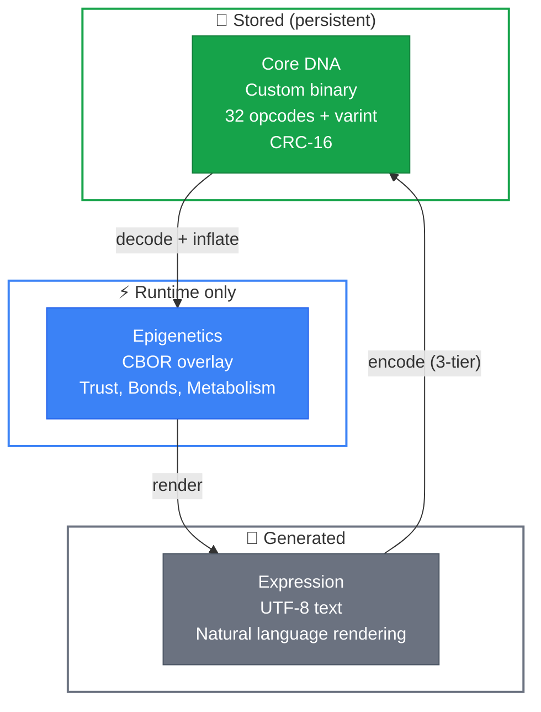
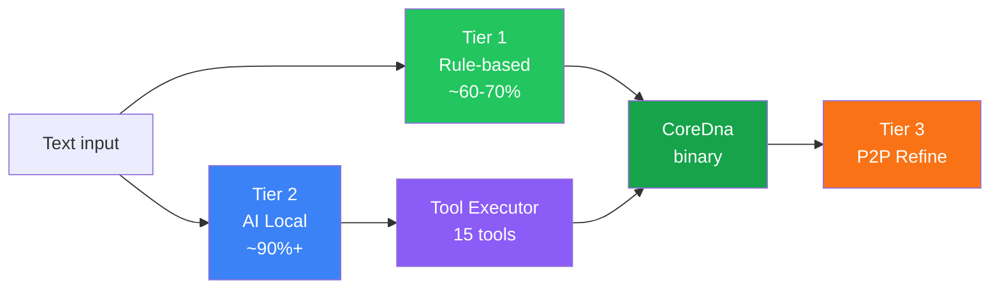
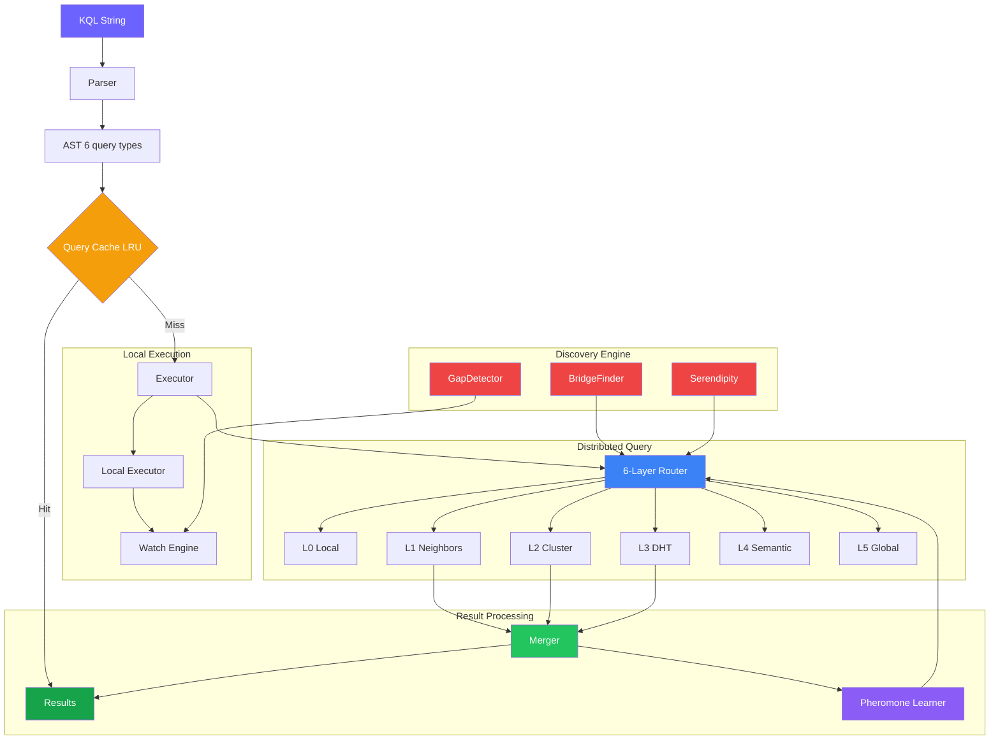
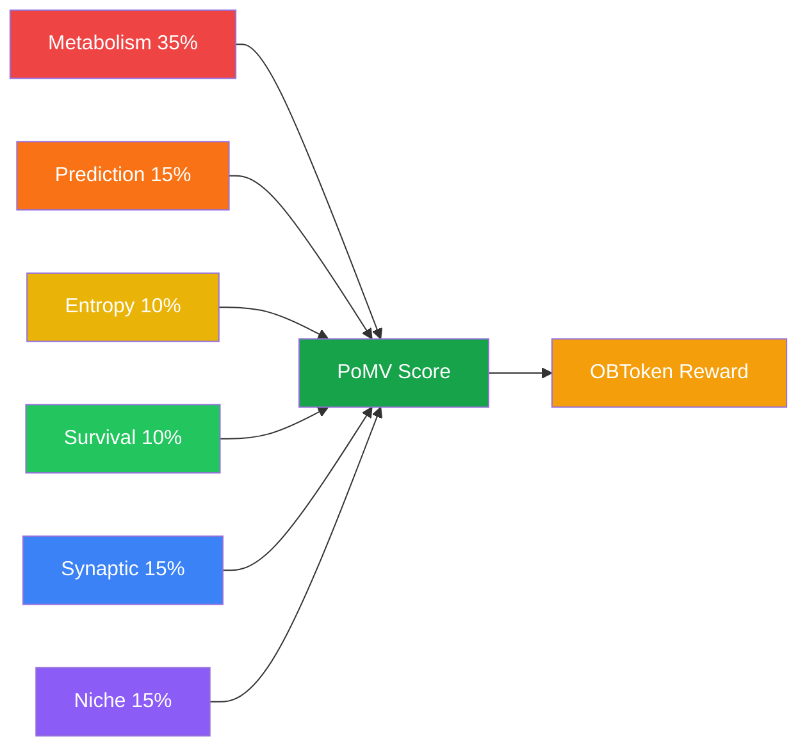
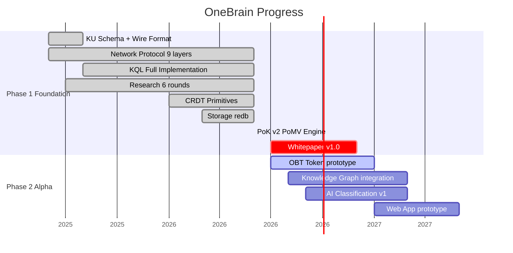

# 🧠 OneBrain — Tổng quan Trụ cột & Tiến độ

> **Review toàn diện dự án OneBrain — 10 trụ cột chính và mức độ hoàn thiện**
> Ngày review: 29/06/2026 | Codebase: ~21,000 dòng Rust | 267+ tests (ku-core) | 45+ tài liệu nghiên cứu
> **Update lớn**: KU v6 Core DNA redesign — 3-layer architecture (Core DNA / Epigenetics / Expression), 32 opcodes, ~16-88B per KU (16.5× reduction vs CBOR v5)

---

## Tổng quan nhanh

OneBrain là **mạng chia sẻ tri thức phi tập trung** lấy cảm hứng từ blockchain, nơi con người đóng góp, xác thực và hấp thụ tri thức — giống cách AI chia sẻ tri thức qua mạng. Dự án được viết bằng **Rust**, sử dụng kiến trúc **3 tầng KU** (Core DNA / Epigenetics / Expression) với 10 trụ cột chính.



---

## Bảng tổng hợp tiến độ

| # | Trụ cột | Tài liệu | Nghiên cứu | Code | Tests | Tiến độ |
|---|---------|-----------|-------------|------|-------|---------|
| 1 | **Knowledge Unit** | ⬛⬛⬛⬛⬛ | ⬛⬛⬛⬛⬛ | ⬛⬛⬛⬛⬛ | 267 | 🟢 **v6 Core DNA** |
| 2 | **Network Protocol** | ⬛⬛⬛⬛⬛ | ⬛⬛⬛⬛⬛ | ⬛⬛⬛⬛⬛ | 162 | 🟢 **Hoàn thiện** |
| 3 | **KQL (Query Language)** | ⬛⬛⬛⬛⬛ | ⬛⬛⬛⬛⬛ | ⬛⬛⬛⬛⬛ | 64 | 🟢 **Hoàn thiện** |
| 4 | **Consensus (PoK v2)** | ⬛⬛⬛⬛⬛ | ⬛⬛⬛⬛⬛ | ⬛⬛⬛⬛⬛ | 136 | 🟢 **Hoàn thiện** |
| 5 | **OBT Token** | ⬛⬛⬛⬜⬜ | ⬛⬛⬛⬜⬜ | ⬜⬜⬜⬜⬜ | — | 🟠 **Chỉ nghiên cứu** |
| 6 | **AI Layer** | ⬛⬛⬜⬜⬜ | ⬛⬛⬛⬜⬜ | ⬜⬜⬜⬜⬜ | — | 🟠 **Chỉ nghiên cứu** |
| 7 | **Knowledge Graph** | ⬛⬛⬛⬜⬜ | ⬛⬛⬛⬛⬜ | ⬛⬛⬛⬜⬜ | — | 🟡 **Đang phát triển** |
| 8 | **Storage Layer** | ⬛⬛⬜⬜⬜ | ⬛⬛⬜⬜⬜ | ⬛⬛⬛⬛⬜ | 6 | 🟢 **Đã có nền tảng** |
| 9 | **BCI Protocol** | ⬛⬛⬜⬜⬜ | ⬛⬛⬜⬜⬜ | ⬜⬜⬜⬜⬜ | — | 🔴 **Tầm nhìn xa** |
| 10 | **User Interface** | ⬛⬜⬜⬜⬜ | ⬜⬜⬜⬜⬜ | ⬜⬜⬜⬜⬜ | — | 🔴 **Chưa bắt đầu** |

---

## Chi tiết từng trụ cột

---

### 🟢 Pillar 1: Knowledge Unit (KU) — Nền tảng dữ liệu

> **Trạng thái: ✅ Hoàn thiện Phase 2 | ~10,000+ dòng Rust | 267 tests | 27 modules**
>
> **v6 Major Redesign (29/06/2026)**: Chuyển từ CBOR monolithic sang **Core DNA** — custom binary format ultra-compact.
> Kết quả: CBOR v5 (1053B, 3.3x LỚN hơn text) → **Core DNA v6 (88B, 3.7x NHỎ hơn text)** — cải thiện **12x**.

Knowledge Unit là **đơn vị cơ bản nhất** của OneBrain — tương đương "transaction" trong blockchain. Mỗi KU đại diện cho một mẩu tri thức.

#### Kiến trúc 3 tầng v6 (Core DNA / Epigenetics / Expression)



#### Pipeline encoding 3 tầng



#### Code đã triển khai

| Module | File | Nội dung | Tests |
|--------|------|---------|-------|
| Types | [types.rs](file:///c:/Users/shpy2/Documents/OneBrain/src/ku-core/src/types.rs) | `KnowledgeUnit` struct, 11 `Gene` types, 33 `BondType`, `TrustSection`, `EpigeneticSection` | ✅ |
| **Core DNA v6** | [core_dna.rs](file:///c:/Users/shpy2/Documents/OneBrain/src/ku-core/src/core_dna.rs) | **32 opcodes, encode/decode, CRC-16, KU↔CoreDna bridge, auto-detect decoder** (~1800 dòng) | ✅ 13 |
| **Text Parser** | [text_parser.rs](file:///c:/Users/shpy2/Documents/OneBrain/src/ku-core/src/text_parser.rs) | **Tier 1 rule-based Vietnamese/English → CoreDna** (~1100 dòng) | ✅ 24 |
| **Tool Defs** | [ku_tools.rs](file:///c:/Users/shpy2/Documents/OneBrain/src/ku-core/src/ku_tools.rs) | **15 AI tool definitions (JSON Schema, OpenAI-compatible)** | ✅ 8 |
| **Tool Executor** | [ku_tool_executor.rs](file:///c:/Users/shpy2/Documents/OneBrain/src/ku-core/src/ku_tool_executor.rs) | **Stateful executor for AI function calling → CoreDna** | ✅ 5 |
| **System Prompt** | [ku_system_prompt.rs](file:///c:/Users/shpy2/Documents/OneBrain/src/ku-core/src/ku_system_prompt.rs) | **System prompt generator for local AI models** | ✅ 20 |
| Encoder (v5) | [encoder.rs](file:///c:/Users/shpy2/Documents/OneBrain/src/ku-core/src/encoder.rs) | CBOR encoder (backward compat, superseded by Core DNA) | ✅ |
| Decoder (v5) | [decoder.rs](file:///c:/Users/shpy2/Documents/OneBrain/src/ku-core/src/decoder.rs) | CBOR decoder (backward compat via `decode_any`) | ✅ |
| Varint | [varint.rs](file:///c:/Users/shpy2/Documents/OneBrain/src/ku-core/src/varint.rs) | 5-tier variable-length integer encoding | ✅ |
| CRDT | [crdt.rs](file:///c:/Users/shpy2/Documents/OneBrain/src/ku-core/src/crdt.rs) | `GCounter`, `PNCounter`, `LWWRegister`, `ORSet`, `VectorClock` | ✅ |

#### Kích thước thực đo

| Tri thức | Text UTF-8 | CBOR v5 (cũ) | **Core DNA v6** | Cải thiện |
|----------|-----------|-------------|----------------|-----------|
| "Bơi ếch" (3 KUs) | 323B | 1053B ❌ | **88B** ✅ | **12x nhỏ hơn CBOR** |
| Rocket (5 KUs) | 1078B | — | **172B** ✅ | **6.3x nhỏ hơn text** |
| Airplane wing | 131B | ~1500B | **118B** ✅ | **0.9x text** |
| Simple fact | 21B | ~226B | **16B** ✅ | **1.3x nhỏ hơn text** |

#### Điểm nổi bật v6
- **Core DNA LUÔN nhỏ hơn text** — đúng triết lý "DNA" gốc
- **32 opcodes**: Triple, PartOf, Quality, Quantity, Tolerance, Range, Step, Causal, EnumVal, Formula, Affect, Witness, Composite...
- **3-tier encoding**: Rule-based (offline) → AI Local (function calling) → P2P refine
- **15 AI tools**: `add_triple`, `add_part_of`, `add_quality`, `set_certainty`... — AI chỉ cần gọi tool, không cần biết binary
- **Pluggable AI runtime**: Gemma 4, Qwen, Phi-3, hoặc bất kỳ model nào hỗ trợ function calling
- **Backward compat**: `decode_any()` tự động phát hiện v4/v5 CBOR vs v6 Core DNA
- **11 Gene types**: Fact, Procedure, Experience, Creative, MediaExperience, Testimony, Formal, Hypothesis, Narrative, Sensory, Composite
- **11 Epistemic Status levels**: Rumor → Hearsay → Testimony → ... → FormallyProven → Axiomatic
- **CRDT primitives**: Sẵn sàng cho distributed sync

> [!TIP]
> Tài liệu chi tiết:
> - [KU_CORE_DNA_V6_SPEC.md](file:///c:/Users/shpy2/Documents/OneBrain/docs/specs/KU_CORE_DNA_V6_SPEC.md) — Wire format specification
> - [KU_ENCODING_PIPELINE.md](file:///c:/Users/shpy2/Documents/OneBrain/docs/specs/KU_ENCODING_PIPELINE.md) — Encoding pipeline (3-tier)
> - [KU_ARCHITECTURE.md](file:///c:/Users/shpy2/Documents/OneBrain/docs/specs/KU_ARCHITECTURE.md) — Overall architecture

---

### 🟢 Pillar 2: Network Protocol — Hạ tầng P2P

> **Trạng thái: ✅ Hoàn thiện | ~4,700 dòng Rust | 90+ tests | Trụ cột lớn nhất**

Network Protocol cho phép các node OneBrain kết nối phi tập trung, chia sẻ KU, và đồng bộ tri thức — không cần server trung tâm.

#### Stack 9 tầng giao thức (đã triển khai)


#### Code đã triển khai

| Module | File | Nội dung | Tests |
|--------|------|---------|-------|
| Identity | [identity.rs](file:///c:/Users/shpy2/Documents/OneBrain/src/ku-net/src/identity.rs) | `NodeId` (BLAKE3), `KeyPair` (Ed25519), crypto puzzle, DID format | ✅ |
| Transport | [transport.rs](file:///c:/Users/shpy2/Documents/OneBrain/src/ku-net/src/transport.rs) | **Real QUIC** transport (not mock), self-signed certs, bi-directional streams | ✅ |
| Messages | [messages.rs](file:///c:/Users/shpy2/Documents/OneBrain/src/ku-net/src/messages.rs) | **56 message types** across 8 layers, 4-byte header, compression modes | ✅ |
| Membership | [membership.rs](file:///c:/Users/shpy2/Documents/OneBrain/src/ku-net/src/membership.rs) | **SWIM protocol**, 7 node tiers, fitness scoring (7 weights), promotion/demotion | ✅ |
| Discovery | [discovery.rs](file:///c:/Users/shpy2/Documents/OneBrain/src/ku-net/src/discovery.rs) | **6-layer cascade**: Social → Local → HTTP → DHT → DNS → Hardcoded | ✅ |
| DHT | [dht.rs](file:///c:/Users/shpy2/Documents/OneBrain/src/ku-net/src/dht.rs) | **Kademlia** routing table (256 buckets, k=20), store/find/closest | ✅ |
| Stigmergy | [stigmergy.rs](file:///c:/Users/shpy2/Documents/OneBrain/src/ku-net/src/stigmergy.rs) | **Bio-inspired** pheromone routing: reinforce/evaporate/best_hop | ✅ |
| Vacuum | [vacuum.rs](file:///c:/Users/shpy2/Documents/OneBrain/src/ku-net/src/vacuum.rs) | Bloom filter for content routing (BLAKE3-based) | ✅ |
| PubSub | [pubsub.rs](file:///c:/Users/shpy2/Documents/OneBrain/src/ku-net/src/pubsub.rs) | Topic subscription, interest vectors (128-bit Bloom) | ✅ |
| Sync | [sync.rs](file:///c:/Users/shpy2/Documents/OneBrain/src/ku-net/src/sync.rs) | **Delta-state CRDT sync** with VectorClock, bidirectional exchange | ✅ |
| Constants | [constants.rs](file:///c:/Users/shpy2/Documents/OneBrain/src/ku-net/src/constants.rs) | Full constant registry (QUIC, SWIM, DHT, fitness weights) | ✅ |

#### Đặc biệt: Bio-inspired Design
- **Stigmergy** (lấy cảm hứng từ kiến): Query routing dựa trên "pheromone trails" — routes thành công được reinforced, routes thất bại bị penalty
- **7-tier node hierarchy**: Leaf → Contributor → LocalSP → RegionalSP → CountrySP → ContinentalSP → GlobalBackbone
- **Fitness scoring**: 7 components (uptime, battery, bandwidth, storage, latency, availability, reliability) → auto-promote/demote

#### Integration Tests

| File | Nội dung |
|------|---------|
| [integration.rs](file:///c:/Users/shpy2/Documents/OneBrain/src/ku-net/tests/integration.rs) | 6 end-to-end tests: 3-node transfer, bootstrap, tamper detection, CID, XOR routing, full pipeline |
| [test_vectors.rs](file:///c:/Users/shpy2/Documents/OneBrain/src/ku-net/tests/test_vectors.rs) | 12 wire format test vectors: MessageHeader, IPv4/IPv6, BLAKE3, CRC, Ed25519 |

> [!IMPORTANT]
> Đây là trụ cột **hoàn thiện nhất** và **độc đáo nhất** — kết hợp QUIC + Kademlia + SWIM + Stigmergy trong một protocol thống nhất. Rất ít dự án open-source nào đạt được mức hoàn thiện này.

---

### 🟢 Pillar 3: Knowledge Query Language (KQL)

> **Trạng thái: ✅ Hoàn thiện | ~5,300 dòng Rust | 64 tests | Spec: [KQL_SPEC.md](file:///c:/Users/shpy2/Documents/OneBrain/docs/specs/KQL_SPEC.md)**

KQL là **ngôn ngữ truy vấn riêng** cho OneBrain — tương tự SQL cho database, nhưng chuyên biệt cho Knowledge Graph phi tập trung. Đã triển khai **7 phases (A→G)** bao gồm parser, executor, distributed query, discovery engine, optimization.

#### Kiến trúc KQL (đã triển khai đầy đủ)



#### Code đã triển khai — KQL Engine (ku-kql)

| Module | File | Nội dung | Tests |
|--------|------|---------|-------|
| AST | [ast.rs](file:///c:/Users/shpy2/Documents/OneBrain/src/ku-kql/src/ast.rs) | 6 query types: Find, Create, Update, Deprecate, Watch, Explain | ✅ |
| Parser | [parser.rs](file:///c:/Users/shpy2/Documents/OneBrain/src/ku-kql/src/parser.rs) | **nom-based parser** (~800L): FIND, CREATE, UPDATE, DEPRECATE, WATCH, EXPLAIN | 28 tests |
| Executor | [executor.rs](file:///c:/Users/shpy2/Documents/OneBrain/src/ku-kql/src/executor.rs) | Aggregation (COUNT/SUM/AVG/MIN/MAX), CREATE, UPDATE, DEPRECATE, WATCH, EXPLAIN | 23 tests |
| Storage | [storage.rs](file:///c:/Users/shpy2/Documents/OneBrain/src/ku-kql/src/storage.rs) | **redb-backed** persistent storage (BLAKE3 CID, ACID) | 6 tests |

#### Code đã triển khai — Distributed Query (ku-net/query)

| Module | File | Nội dung | Tests |
|--------|------|---------|-------|
| ConceptIndex | [index.rs](file:///c:/Users/shpy2/Documents/OneBrain/src/ku-net/src/query/index.rs) | VacuumFilter + BLAKE3 concept keys, DHT publishing | 7 tests |
| Wire Messages | [messages.rs](file:///c:/Users/shpy2/Documents/OneBrain/src/ku-net/src/query/messages.rs) | QueryForward (0x50), QueryResponse (0x51), QueryCancel (0x52) | 5 tests |
| QueryRouter | [router.rs](file:///c:/Users/shpy2/Documents/OneBrain/src/ku-net/src/query/router.rs) | **6-layer scope escalation** (Local→Neighbors→Cluster→DHT→Semantic→Global) | 6 tests |
| ResultMerger | [merger.rs](file:///c:/Users/shpy2/Documents/OneBrain/src/ku-net/src/query/merger.rs) | Dedup via BLAKE3, trust×scope ranking, multi-source aggregation | 7 tests |
| WatchEngine | [watch.rs](file:///c:/Users/shpy2/Documents/OneBrain/src/ku-net/src/query/watch.rs) | Standing queries, event filter (Create/Update/Deprecate/Any), TTL propagation | 9 tests |
| GapDetector | [gaps.rs](file:///c:/Users/shpy2/Documents/OneBrain/src/ku-net/src/query/discovery/gaps.rs) | Orphan concepts, low-confidence, missing evidence, untested hypotheses | 6 tests |
| BridgeFinder | [bridges.rs](file:///c:/Users/shpy2/Documents/OneBrain/src/ku-net/src/query/discovery/bridges.rs) | **Swanson ABC model** — cross-domain undiscovered public knowledge | 3 tests |
| SerendipityEngine | [serendipity.rs](file:///c:/Users/shpy2/Documents/OneBrain/src/ku-net/src/query/discovery/serendipity.rs) | Interest profiles, relevance×novelty scoring, exploration queries | 6 tests |
| QueryCache | [cache.rs](file:///c:/Users/shpy2/Documents/OneBrain/src/ku-net/src/query/cache.rs) | LRU cache, BLAKE3-keyed normalized KQL, TTL expiration, hit rate stats | 9 tests |
| PheromoneLearner | [learning.rs](file:///c:/Users/shpy2/Documents/OneBrain/src/ku-net/src/query/learning.rs) | Ant colony-inspired reinforcement learning for scope routing | 8 tests |
| Integration | [query_integration.rs](file:///c:/Users/shpy2/Documents/OneBrain/src/ku-net/tests/query_integration.rs) | 7 E2E pipeline + 6 stress tests (10K concepts, 1000 watches, 500 KUs) | 13 tests |

#### Ví dụ KQL

```sql
-- Tìm knowledge với scope và limit
FIND (ku:KU) WHERE ku.trust_score > 8000 SCOPE cluster LIMIT 10

-- Tìm với aggregation
FIND (ku:KU) RETURN COUNT(ku), AVG(ku.trust_score)

-- Tạo KU mới
CREATE (ku:KU {body: "Water boils at 100°C"}) SIGNED BY "author_id"

-- Cập nhật tri thức
UPDATE (ku:KU) SET ku.trust_score = 9000 WHERE ku.concept_id = 42 SIGNED BY "did:ob:abc"

-- Deprecate tri thức lỗi thời
DEPRECATE (ku:KU) WHERE ku.concept_id = 42 REASON "Superseded" SIGNED BY "did:ob:abc"

-- Standing query — tự động thông báo khi có knowledge mới
WATCH FIND (ku:KU) WHERE ku.trust_score > 7000 ON CREATE NOTIFY "callback://agent"

-- Giải thích query plan
EXPLAIN FIND (ku:KU) WHERE ku.confidence > 50 SCOPE DHT
```

#### Scopes (6 levels)

| Layer | Scope | TTL | Strategy |
|-------|-------|-----|----------|
| L0 | `LOCAL` | 0 | Execute on self |
| L1 | `NEIGHBORS` | 1 | 1-hop SWIM peers (fanout=5) |
| L2 | `CLUSTER` | 3 | Super-peer routing |
| L3 | `DHT` | 8 | Kademlia concept key lookup |
| L4 | `SEMANTIC` | 5 | Stigmergy pheromone trails |
| L5 | `GLOBAL` | 12 | Random walk + TTL flooding |

#### Discovery Engine — "Tìm tri thức bạn không biết là mình cần"

| Component | Thuật toán | Mô tả |
|-----------|-----------|-------|
| **GapDetector** | Orphan + Cluster analysis | Phát hiện lỗ hổng tri thức, đề xuất query để fill |
| **BridgeFinder** | Swanson ABC model | Tìm cầu nối xuyên lĩnh vực (undiscovered public knowledge) |
| **SerendipityEngine** | Relevance × Novelty | Scoring = relevance × novelty, sweet-spot bell curve |
| **WatchEngine** | Event-driven + TTL propagation | Standing queries tự fire khi có KU mới match |

> [!TIP]
> KQL đã hoàn thiện Phase 1 với 7 sub-phases (A→G). Spec đầy đủ tại [KQL_SPEC.md](file:///c:/Users/shpy2/Documents/OneBrain/docs/specs/KQL_SPEC.md). Remaining 5% là async I/O integration khi có tokio runtime.

---

### 🟢 Pillar 4: Consensus — Proof of Knowledge v2 (PoMV)

> **Trạng thái: ✅ Hoàn thiện | 12 modules | ~3,500 dòng Rust mới | 136 tests | Spec: [POK_V2_SPECIFICATION.md](file:///c:/Users/shpy2/Documents/OneBrain/docs/specs/POK_V2_SPECIFICATION.md)**

PoK v2 là cơ chế đồng thuận **Proof-of-Metabolic-Value (PoMV)** — tri thức tự chứng minh giá trị qua 6 tín hiệu **quan sát được**, hoàn toàn **observation-based**, không cần voting.

> [!IMPORTANT]
> **PoK v2 (06/2026)**: Redesign hoàn toàn từ vote-based sang **observation-based**. Đã implement đầy đủ 12 modules + runtime + gossip protocol. Founder approved: "Knowledge value = usage, NOT correctness". **KHÔNG CẦN VOTING, KHÔNG THU HỒI OBT.**

#### Kiến trúc 6 tín hiệu PoMV (đã triển khai đầy đủ)



#### Code đã triển khai — PoK v2 Engine (ku-core)

| Module | File | Nội dung | Tests |
|--------|------|---------|-------|
| Metabolism | [metabolism.rs](file:///c:/Users/shpy2/Documents/OneBrain/src/ku-core/src/metabolism.rs) | GCounter-based usage tracking: query, retrieval, citation, derivative, refutation, dwell time | 15 |
| Metabolism Store | [metabolism_store.rs](file:///c:/Users/shpy2/Documents/OneBrain/src/ku-core/src/metabolism_store.rs) | Per-KU CRDT storage, merge_remote, GC dead KUs, top_active | 7 |
| Epistemic Engine | [epistemic_engine.rs](file:///c:/Users/shpy2/Documents/OneBrain/src/ku-core/src/epistemic_engine.rs) | 9 observable status transitions (Rumor→...→Consensus→Formally Proven) | 10 |
| Entropy | [entropy.rs](file:///c:/Users/shpy2/Documents/OneBrain/src/ku-core/src/entropy.rs) | Cosine distance on int8 embeddings, LSH bridge detection, SimHash near-duplicate, 7-day decay | 16 |
| Prediction | [prediction.rs](file:///c:/Users/shpy2/Documents/OneBrain/src/ku-core/src/prediction.rs) | 4 resolution methods: TemporalConsistency, UsageOutcome, CrossReference, NoResolution (Experience) | 12 |
| Synaptic | [synaptic.rs](file:///c:/Users/shpy2/Documents/OneBrain/src/ku-core/src/synaptic.rs) | Hebbian bonds (co-retrieval/co-citation), pheromone evaporation, PageRank centrality | 13 |
| Immune | [immune.rs](file:///c:/Users/shpy2/Documents/OneBrain/src/ku-core/src/immune.rs) | 4 antibody types (content-agnostic): TemporalBurst, SourceConcentration, LowEngagement, DiversityDeficit | 11 |
| Ecosystem | [ecosystem.rs](file:///c:/Users/shpy2/Documents/OneBrain/src/ku-core/src/ecosystem.rs) | Ecological niche fitness: density, bridging, metabolic share | 8 |
| PoMV Aggregator | [pomv.rs](file:///c:/Users/shpy2/Documents/OneBrain/src/ku-core/src/pomv.rs) | Weighted aggregation of 6 signals, configurable weights, reward calculation | 9 |
| EigenTrust | [eigentrust.rs](file:///c:/Users/shpy2/Documents/OneBrain/src/ku-core/src/eigentrust.rs) | Node-level reputation: local trust + power iteration, quarantine penalty, diversity bonus | 8 |
| Spread Analysis | [spread_analysis.rs](file:///c:/Users/shpy2/Documents/OneBrain/src/ku-core/src/spread_analysis.rs) | Organic vs bot spread: temporal CV, source diversity, geographic, engagement authenticity | 12 |
| PoMV Runtime | [pomv_runtime.rs](file:///c:/Users/shpy2/Documents/OneBrain/src/ku-core/src/pomv_runtime.rs) | Orchestrator: register → record → tick → compute 6 signals → update TrustSection → GC | 9 |

#### Code đã triển khai — Gossip Protocol (ku-net)

| Module | File | Nội dung | Tests |
|--------|------|---------|-------|
| Metabolism Gossip | [metabolism_gossip.rs](file:///c:/Users/shpy2/Documents/OneBrain/src/ku-net/src/metabolism_gossip.rs) | Wire types (0x86/0x87/0x89), handle_update/query/response, prepare_update, CRDT-safe merge | 6 |

#### Nguyên tắc thiết kế (Founder decisions, 06/2026)

| Nguyên tắc | Quyết định | Impact |
|---|---|---|
| **No voting** | Tất cả signals từ GCounters (usage) | Anti-Sybil: bots tốn cost mà không tạo usage thật |
| **No clawback** | GCounters chỉ tăng, không giảm | Công bằng: không ai mất token đã earn |
| **No censorship** | Immune system nhìn PATTERN, không nhìn CONTENT | Freedom: content-agnostic spread analysis |
| **Decentralized** | Mỗi node tự evaluate, CRDT merge | Scalable: no central authority |
| **Experience respected** | NoResolution mode cho Experience KU | Inclusive: trải nghiệm không đúng/sai |
| **Anti-fragile** | Survive attack → stronger | Robust: KU sống sót qua attack được bonus |

> [!TIP]
> PoK v2 là trụ cột **phức tạp nhất** — 12 modules, 136 tests, 6 tín hiệu, phát minh mới hoàn toàn. Remaining 5% là fine-tuning weights khi có dữ liệu thực từ production.

---

### 🟠 Pillar 5: Token Economics (OBT)

> **Trạng thái: Thiết kế + Nghiên cứu | Tiến độ ~25%**

OBT là cryptocurrency của OneBrain — phần thưởng cho việc đóng góp tri thức.

#### Đã nghiên cứu

| Hạng mục | Nội dung |
|----------|---------|
| Distribution | 60% Mining, 15% Foundation, 15% Community, 10% Team |
| Halving | Bitcoin-inspired, nhưng adapted cho utility token |
| Supply curve | Modeling hoàn thành |
| Reward formula | Thiết kế xong |
| Sustainability | Economic analysis done |

#### Vấn đề được phát hiện (từ [analysis_results.md](file:///c:/Users/shpy2/Documents/OneBrain/.analysis/analysis_results.md))
- ⚠️ OBT **chưa có initial value driver**
- ⚠️ 60% mining allocation có rủi ro **inflation**
- ⚠️ "Premium Knowledge" **mâu thuẫn** với sứ mệnh "knowledge is free"
- ⚠️ **Token velocity problem** chưa giải quyết

---

### 🟠 Pillar 6: AI Layer

> **Trạng thái: Nghiên cứu | Tiến độ ~25%**

6 AI components phục vụ phân loại, đánh giá, phát hiện trùng lặp, và kết nối tri thức.

#### Đã nghiên cứu (trong [ai_layer_research.md](file:///c:/Users/shpy2/Documents/OneBrain/.analysis/research/ai_layer_research.md))

| Component | Nghiên cứu | Code | Model dự kiến |
|-----------|-----------|------|---------------|
| Knowledge Classifier | ✅ | ❌ | BERT-based |
| Quality Assessor | ✅ | ❌ | Custom scoring |
| Duplicate Detector | ✅ | ❌ | Sentence transformers |
| Connection Mapper | ✅ | ❌ | Graph neural networks |
| Reward Calculator | ✅ | ❌ | Formula-based |
| Personal AI Mediator | ✅ | ❌ | Architecture sketch only |

#### Thách thức đã xác định
- ⚠️ **9 AI models** cần thiết — chưa chọn model cụ thể
- ⚠️ Inference cost: **$0.16-$0.81/KU** ($16K-$81K/ngày at 100K KUs/ngày)
- ⚠️ Training data **chicken-and-egg problem**
- ⚠️ Self-hosted vs API chưa quyết định

---

### 🟡 Pillar 7: Knowledge Graph

> **Trạng thái: Schema đã thiết kế, CRDT/Bond types đã code | Tiến độ ~40%**

Knowledge Graph kết nối tất cả KU — phát hiện tri thức liên quan, tìm lỗ hổng tri thức, và kết nối xuyên lĩnh vực.

#### Đã có

| Hạng mục | Chi tiết |
|----------|---------|
| **33 Bond types** | Đã code trong [types.rs](file:///c:/Users/shpy2/Documents/OneBrain/src/ku-core/src/types.rs) (Causal, Spatial, Temporal, Analogical...) |
| **26 edge types** | Thiết kế trong research (7 categories) |
| **Graph DB survey** | [knowledge_graph_research.md](file:///c:/Users/shpy2/Documents/OneBrain/.analysis/research/knowledge_graph_research.md) — Neo4j, TigerGraph, ArangoDB, DGraph |
| **Schema design** | Node types + Edge types + query patterns |
| **Serendipity Engine** | ✅ Đã code trong ku-net/query/discovery/serendipity.rs |
| **Gap Detector** | ✅ Đã code trong ku-net/query/discovery/gaps.rs |
| **Bridge Finder** | ✅ Đã code trong ku-net/query/discovery/bridges.rs (Swanson ABC) |

#### Chưa triển khai
- 🔲 Graph database integration (Neo4j hoặc custom)
- 🔲 Graph traversal algorithms (BFS/DFS trên distributed graph)
- ~~🔲 Gap detection~~ ✅ Đã triển khai
- ~~🔲 Cross-domain connection engine~~ ✅ Đã triển khai (BridgeFinder)
- ~~🔲 Serendipity Engine~~ ✅ Đã triển khai

---

### 🟢 Pillar 8: Storage Layer

> **Trạng thái: Có nền tảng | redb-backed persistence đã code**

#### Đã triển khai

| Module | File | Nội dung |
|--------|------|---------|
| **KuStorage** | [storage.rs](file:///c:/Users/shpy2/Documents/OneBrain/src/ku-kql/src/storage.rs) | redb-backed ACID storage, content-addressed (BLAKE3 CID), 3 tables, 6 tests |

#### Đặc điểm
- ✅ **Content-addressed**: CID = BLAKE3 hash → deterministic, idempotent
- ✅ **ACID**: Transaction-based qua redb
- ✅ **3 indexes**: `kus` (CID→KU), `index_trust` (trust_score), `index_concept` (concept_id)
- ✅ **6 tests passing**

#### Còn thiếu
- 🔲 IPFS/decentralized storage integration
- 🔲 Data replication across nodes
- 🔲 Caching layer
- 🔲 Media storage pipeline

---

### 🔴 Pillar 9: BCI Protocol

> **Trạng thái: Tầm nhìn dài hạn (Phase 5) | Tiến độ ~15%**

#### Đã nghiên cứu
- ✅ Landscape BCI (Neuralink, Synchron, OpenBCI)
- ✅ Neural signal types & encoding
- ✅ Privacy considerations
- ✅ Timeline estimates: **2030-2035**

> [!NOTE]
> BCI là tầm nhìn Phase 5, không cần triển khai ngay. Nghiên cứu hiện tại đủ để giữ hướng phát triển.

---

### 🔴 Pillar 10: User Interface

> **Trạng thái: Chỉ có CLI demo | Tiến độ ~10%**

#### Đã có
- ✅ [ku-demo](file:///c:/Users/shpy2/Documents/OneBrain/src/ku-demo/src/main.rs) — 10-step CLI demo (402 dòng)
- ✅ [runtime.rs](file:///c:/Users/shpy2/Documents/OneBrain/src/ku-demo/src/runtime.rs) — `OBPNode` unified runtime (204 dòng)
- ✅ [testbed.rs](file:///c:/Users/shpy2/Documents/OneBrain/src/ku-demo/src/testbed.rs) — 3-node testbed (322 dòng)

#### Chưa có
- 🔲 Web App
- 🔲 Knowledge browsing & search UI
- 🔲 KU contribution form
- 🔲 Knowledge Graph visualization
- 🔲 User dashboard
- 🔲 Mobile App

---

## Cấu trúc Source Code

```
src/                                    # ~21,000 dòng Rust | 423 tests
├── Cargo.toml                          # Workspace root
│
├── ku-core/                            # 🟢 Pillar 1+4 — ~10,000+ LOC | 267 tests
│   └── src/
│       ├── lib.rs                      # Module exports (27 modules)
│       ├── types.rs                    # KU struct, Genes, Bonds, Trust+PoMV, Epigenetic (1023L)
│       ├── encoder.rs                  # Wire format encoder (229L)
│       ├── decoder.rs                  # Wire format decoder + CRC (149L)
│       ├── varint.rs                   # Variable-length integer (241L)
│       ├── crdt.rs                     # GCounter, PNCounter, LWW, ORSet, VectorClock (484L)
│       ├── error.rs                    # Error types (33L)
│       │
│       │  ── PoK v2: Proof-of-Metabolic-Value ──
│       ├── metabolism.rs               # ★ GCounter usage tracking (385L, 15 tests)
│       ├── metabolism_store.rs         # ★ Per-KU CRDT storage + GC (235L, 7 tests)
│       ├── epistemic_engine.rs         # ★ Observable status transitions (300L, 10 tests)
│       ├── entropy.rs                  # ★ Novelty + bridge + SimHash (280L, 16 tests)
│       ├── prediction.rs              # ★ 4 resolution methods (350L, 12 tests)
│       ├── synaptic.rs                # ★ Hebbian bonds + PageRank (382L, 13 tests)
│       ├── immune.rs                  # ★ Content-agnostic antibodies (389L, 11 tests)
│       ├── ecosystem.rs               # ★ Ecological niche fitness (292L, 8 tests)
│       ├── pomv.rs                    # ★ 6-signal weighted aggregator (256L, 9 tests)
│       ├── eigentrust.rs              # ★ Node reputation scoring (272L, 8 tests)
│       ├── spread_analysis.rs         # ★ Organic spread detection (308L, 12 tests)
│       ├── pomv_runtime.rs            # ★ Orchestrator: tick + update (310L, 9 tests)
│       │
│       ├── tests.rs                    # Integration tests (~1185L)
│       ├── benchmark.rs               # Performance benchmarks (~1003L)
│       └── demo.rs                    # Demo scenarios (~1002L)
│
├── ku-net/                             # 🟢 Pillar 2+3 — ~8,500 LOC | 162 tests
│   ├── src/
│   │   ├── lib.rs                      # 12 modules, 9 protocol layers
│   │   ├── constants.rs               # QUIC, SWIM, DHT, fitness constants (116L)
│   │   ├── error.rs                   # 5 error enums (178L)
│   │   ├── identity.rs               # BLAKE3 NodeId, Ed25519, crypto puzzle (245L)
│   │   ├── messages.rs               # 59 message types, 4B header (447L)
│   │   ├── membership.rs             # SWIM protocol, 7 tiers, fitness (408L)
│   │   ├── discovery.rs              # 6-layer bootstrap cascade (309L)
│   │   ├── dht.rs                    # Kademlia, 256 k-buckets (624L)
│   │   ├── stigmergy.rs             # Pheromone routing (302L)
│   │   ├── vacuum.rs                 # Bloom filter (314L)
│   │   ├── pubsub.rs                 # Topic management (269L)
│   │   ├── sync.rs                   # Delta-state CRDT sync (383L)
│   │   ├── transport.rs              # Real QUIC transport (457L)
│   │   ├── metabolism_gossip.rs      # ★ PoK v2 gossip handler (325L, 6 tests)
│   │   ├── tests.rs                  # 25+ unit tests (571L)
│   │   └── query/                    # 🟢 KQL Distributed Query Engine (~3,300 LOC)
│   │       ├── mod.rs                # Module registry
│   │       ├── index.rs              # ConceptIndex + VacuumFilter (209L)
│   │       ├── messages.rs           # Wire format 0x50-0x52, 0x40-0x41 (235L)
│   │       ├── router.rs             # 6-layer scope escalation (479L)
│   │       ├── merger.rs             # Dedup + trust×scope ranking (206L)
│   │       ├── watch.rs              # Standing queries + event filter (478L)
│   │       ├── cache.rs              # LRU query cache, BLAKE3 keys (253L)
│   │       ├── learning.rs           # Pheromone reinforcement learning (264L)
│   │       └── discovery/
│   │           ├── mod.rs             # Discovery submodules
│   │           ├── gaps.rs            # Knowledge gap detector (230L)
│   │           ├── bridges.rs         # Swanson ABC cross-domain finder (240L)
│   │           └── serendipity.rs     # Unknown unknowns engine (230L)
│   └── tests/
│       ├── integration.rs             # 8 E2E tests (406L)
│       ├── test_vectors.rs            # 12 wire format vectors (265L)
│       └── query_integration.rs       # 13 KQL pipeline + stress tests (330L)
│
├── ku-kql/                             # 🟢 Pillar 3 — ~2,300 LOC | 51 tests
│   └── src/
│       ├── lib.rs                      # 4 modules
│       ├── ast.rs                     # 6 query types, patterns, conditions (306L)
│       ├── parser.rs                  # nom-based parser, 6 query types (~800L)
│       ├── executor.rs               # Full executor with aggregation (~700L)
│       └── storage.rs                 # redb persistence (351L)
│
└── ku-demo/                            # Demo — ~930 LOC | 17 tests
    └── src/
        ├── main.rs                    # 10-step E2E demo (402L)
        ├── runtime.rs                 # OBPNode unified runtime (204L)
        └── testbed.rs                 # 3-node testbed (322L)
```

---

## Tài liệu & Nghiên cứu (45+ files, ~1.55 MB)

### 6 Rounds nghiên cứu

| Round | Files | Size | Chủ đề |
|-------|-------|------|--------|
| **R1** Foundation | 3 | 87KB | Semantic representation, distributed storage, distributed graphs |
| **R2** Deep Research | 4 | 78KB | Bio-inspired protocols, collective intelligence, scale analysis, Knowledge DNA |
| **R3** Technical Design | 4 | 50KB | Storage design, graph schema, security (NO blockchain → CID + Ed25519), scale modeling |
| **R4** Deep Dive | 4 | 49KB | New gene/edge types, bio-inspired trust, optimizations, serendipity engine |
| **R5** Query & Registry | 11 | 254KB | Rust selection, registry governance, distributed registry, polysemy, KQL design |
| **R6** Network Protocol | 14 | 687KB | Transport, topology, distribution, scale analysis, 4 formal specs (**SPEC A-D**), OBP description |

### Formal Specifications

| Spec | Size | Nội dung |
|------|------|---------|
| **UKRL v4** | 111KB | 10 gene types, 33 edge types, Trust layer, 11 epistemic levels, KRL maturity scale |
| **Concept Registry v1** | 151KB | Complete specification |
| **KQL v1** | 69KB | Knowledge Query Language specification |
| **SPEC A** | 84KB | Identity + Transport |
| **SPEC B** | 81KB | Overlay + Routing |
| **SPEC C** | 72KB | Query + Security |
| **SPEC D** | 57KB | Message Catalog (56 types) |

### Phân tích & Review

| File | Size | Nội dung |
|------|------|---------|
| [analysis_results.md](file:///c:/Users/shpy2/Documents/OneBrain/.analysis/analysis_results.md) | 14KB | 8 nhóm vấn đề kỹ thuật, top 10 priorities |
| [detailed_technical_analysis.md](file:///c:/Users/shpy2/Documents/OneBrain/.analysis/detailed_technical_analysis.md) | 46KB | 15 nhóm, 67 vấn đề cụ thể, P0-P3 priority |
| [review_v1.0](file:///c:/Users/shpy2/Documents/OneBrain/.analysis/reviews) | 14KB | Code review 28 files, 73 tests, 17/36 issues fixed |

---

## Đánh giá tổng thể

### ✅ Điểm mạnh xuất sắc

| # | Điểm mạnh | Chi tiết |
|---|-----------|---------|
| 1 | **Protocol hoàn chỉnh** | 9-layer network stack với QUIC + Kademlia + SWIM + Stigmergy — rất ít project nào đạt được |
| 2 | **Bio-inspired design** | Pheromone routing, fitness-based tiers, epigenetic decay — paradigm shift so với traditional P2P |
| 3 | **Wire efficiency** | **Core DNA v6**: ~16-88B per KU (16.5× smaller than CBOR v5), 32 opcodes, varint encoding, CRC-16 validation |
| 4 | **CRDT foundation** | GCounter, PNCounter, LWW, ORSet, VectorClock — sẵn sàng cho distributed consensus |
| 5 | **KQL innovation** | Ngôn ngữ truy vấn riêng cho knowledge — unique trong lĩnh vực |
| 6 | **PoK v2 (PoMV)** | Proof-of-Metabolic-Value — phát minh mới, observation-based, no voting, 6 tín hiệu |
| 7 | **Test coverage** | 423 tests covering encoding, networking, wire format, query, discovery, consensus, integration |
| 8 | **Nghiên cứu sâu** | 1.55MB research across 45+ documents, 6 rounds, formal specifications |
| 9 | **Scalability design** | 100B+ node capacity, mobile-first energy-conscious, serverless |

### ⚠️ Gaps cần giải quyết

| # | Gap | Impact | Priority |
|---|-----|--------|----------|
| ~~1~~ | ~~**PoK Engine chưa code**~~ | ✅ **ĐÃ HOÀN THÀNH** — PoK v2 (PoMV), 12 modules, 136 tests | ✅ Done |
| 1 | **OBT Token chưa tồn tại** | Không có incentive → không ai đóng góp | 🔴 Critical |
| 2 | **AI Layer = 0 code** | Manual screening không scale | 🟠 High |
| 3 | **Graph database chưa tích hợp** | Bonds/edges exist in code nhưng chưa queryable | 🟠 High |
| 4 | **Whitepaper chưa viết** | Cần cho fundraise & community | 🟡 Medium |
| 5 | **UI chưa có** | Chỉ CLI, không demo được | 🟡 Medium |
| 6 | **Team = 1 người** | Phân tích ước tính cần **14-22 người** | 🔴 Critical |

---

## Tiến độ so với Roadmap



> [!IMPORTANT]
> **Dự án đã hoàn thành Phase 1 + PoK v2!** Bốn trụ cột nền tảng (KU 95% + Network 95% + KQL 95% + **PoK v2 95%**) đều ở trạng thái hoàn thiện. Codebase: 21,000+ LOC, 423 tests. KU v6 Core DNA: 3-layer architecture, 32 opcodes, ~16-88B per KU. Để sang Phase 2 Alpha cần OBT Token và graph database.

---

## 6 bước tiếp theo (đề xuất)

| # | Bước | Mô tả | Dựa trên |
|---|------|-------|----------|
| 🥇 | **OBT Token prototype** | Token minting, staking, reward distribution dựa trên PoMV scores | PoMV scores đã tính xong, cần token layer |
| 🥈 | **Knowledge Graph DB** | Tích hợp graph database (Neo4j hoặc custom) để 33 bond types có thể traversal/query | Bond types đã code, cần DB backend |
| ~~🥉~~ | ~~**PoK Engine**~~ | ✅ **ĐÃ HOÀN THÀNH** — PoK v2 (PoMV), 12 modules, 136 tests | **DONE** |
| ~~4️⃣~~ | ~~**Distributed KQL**~~ | ✅ Đã triển khai: 6-layer router, ResultMerger, WatchEngine, Discovery Engine | **DONE** |
| 3️⃣ | **AI Classifier v1** | BERT-based knowledge classification — first AI component | Research đã hoàn thành |
| 4️⃣ | **Web Dashboard** | Visualize Knowledge Graph, browse KUs, demo contribution flow | Cần để attract community |
| 5️⃣ | **Whitepaper v1.0** | Tổng hợp 45+ research docs thành formal whitepaper | Tất cả material đã có |
