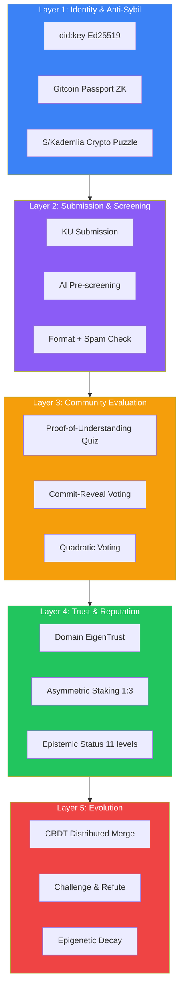
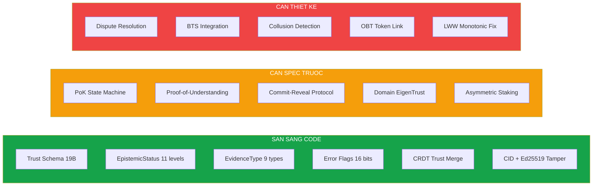
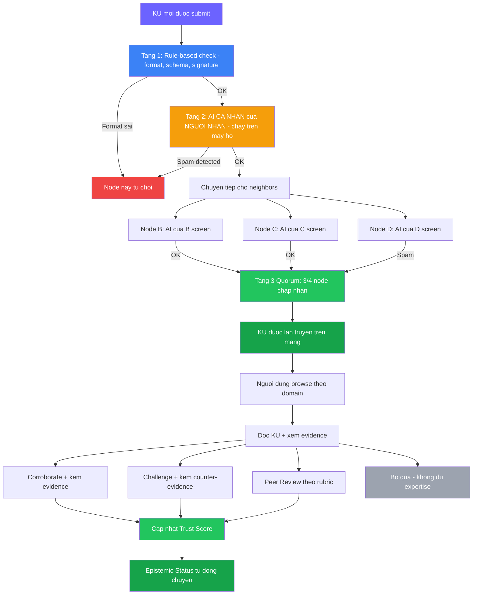
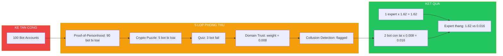
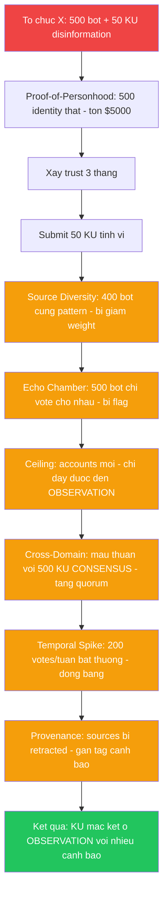

# 🏛️ Pillar 4: Proof of Knowledge (PoK) — Design Document

> **Tổng hợp từ 10+ tài liệu nghiên cứu, 6 rounds research, code đã triển khai**

> [!CAUTION]
> ## ⚡ PoK v2: Proof-of-Metabolic-Value (PoMV) — THIẾT KẾ MỚI
>
> Sau nghiên cứu sâu từ 5 nhóm agent (triết học, hệ thống thực tế, trust phân tán, anti-disinformation, phát minh mới), PoK đã được **thiết kế lại hoàn toàn**:
>
> | v1 (Dưới đây) | v2 (PoMV) |
> |---|---|
> | Vote-based (ai đó phán xét) | **Observation-based** (usage tự quyết) |
> | Đúng/sai + phạt | **Giá trị = usage** (không clawback) |
> | 11 lớp chống bot vote | **0 usage = tự chết** |
>
> **Tham khảo PoK v2**: Xem specification tại cuộc thảo luận thiết kế tháng 6/2026.
>
> **Nội dung bên dưới là PoK v1** — giữ lại làm tài liệu lịch sử và nghiên cứu. Nhiều cơ chế vẫn áp dụng trong v2 (anti-Sybil, screening, CRDT).

---

> ### Quyết định Founder (2025-06-25):
> - Tri thức không đúng/sai — chỉ được thay thế bởi tri thức tốt hơn
> - Reward = value delivered (usage), không phải correctness
> - Không clawback — giá trị đã tạo ra là thực
> - Challenge = tri thức mới cạnh tranh tự nhiên
> - Corroborate/Challenge giữ lại như optional signals
> - Subjective knowledge: không kiểm soát trải nghiệm, chỉ chống spam
> - 100% phân tán — mỗi node tự quyết

---

## PoK v1 — Tài liệu lịch sử

## Ý tưởng cốt lõi

Proof of Knowledge (PoK) là cơ chế đồng thuận **thay thế blockchain** — thay vì "đào" coin bằng sức tính (PoW) hay vốn (PoS), người dùng **chứng minh giá trị bằng tri thức**. Ai đóng góp tri thức chất lượng → được thưởng. Ai đóng góp rác → bị phạt.

> [!IMPORTANT]
> **PoK ≠ "vote cho knowledge đúng/sai".** PoK là hệ thống phức hợp gồm: xác thực nguồn gốc, đánh giá chất lượng, chống gian lận, phân cấp uy tín, và tiến hóa tri thức theo thời gian.

---

## Tổng quan kiến trúc (5 tầng)



---

## Phần 1: Những gì ĐÃ QUYẾT ĐỊNH ✅

### 1.1 Mô hình Trust — 19 bytes bắt buộc (đã code)

Mỗi KU có một `TrustSection` chứa metadata về mức độ đáng tin:

| Field | Type | Ý nghĩa |
|-------|------|---------|
| `epistemic_status` | u8 | Mức chắc chắn nhận thức (11 cấp) |
| `evidence_type` | u8 | Loại bằng chứng (9 loại) |
| `verification_level` | u8 | 0=chưa → 4=formal |
| `corroboration_count` | u16 | Số nguồn xác nhận độc lập |
| `challenge_count` | u16 | Số thách thức đang hoạt động |
| `error_susceptibility` | u16 | 16 cờ bias (xem bên dưới) |
| `trust_score` | u16 | Điểm tin cậy 0-10000 |
| `confidence` | u16 | Độ tin cậy thống kê |
| `domain_codes` | Vec | Lĩnh vực áp dụng |

> **File**: [types.rs L453-522](file:///c:/Users/shpy2/Documents/OneBrain/src/ku-core/src/types.rs#L453-L522)

### 1.2 Thang Epistemic Status — 11 bậc (đã code)

Lấy cảm hứng từ triết học nhận thức (Justified True Belief), pháp lý (standards of proof), và khoa học (NASA TRL):

```
RUMOR → HEARSAY → TESTIMONY → OBSERVATION → HYPOTHESIS
  → EVIDENCE → CORROBORATED → PEER_REVIEWED → CONSENSUS
  → FORMALLY_PROVEN → AXIOMATIC
```

Mỗi bước **lên** đòi hỏi điều kiện cụ thể (quorum):

| Chuyển trạng thái | Điều kiện |
|---|---|
| RUMOR → TESTIMONY | ≥1 nhân chứng có tên (proximity ≤ FIRSTHAND) |
| TESTIMONY → OBSERVATION | Ghi nhận bằng thiết bị HOẶC ≥3 nhân chứng độc lập |
| OBSERVATION → EVIDENCE | Có dữ liệu có cấu trúc + phương pháp được ghi lại |
| EVIDENCE → CORROBORATED | ≥3 nguồn độc lập + 3-signal immune check |
| CORROBORATED → PEER_REVIEWED | ≥2 domain experts (rep > 0.7) review |
| PEER_REVIEWED → CONSENSUS | >10 endorsements + không có REFUTES đang hoạt động |
| **BẤT KỲ → Challenged** | Bất kỳ ai gửi REFUTES edge kèm bằng chứng → đánh giá lại |

> [!CAUTION]
> **CONSENSUS ≠ TRUTH.** Hệ thống PHẢI cho phép consensus bị challenge và lật đổ. Đây là nguyên tắc cốt lõi — ví dụ: "Trái Đất phẳng" từng là consensus.

### 1.3 Error Susceptibility — 16 cờ bias (đã code)

Mỗi KU được gắn cờ các dạng bias tiềm ẩn (2 bytes, mỗi bit = 1 bias):

```
bit 0: EYEWITNESS_MEMORY     bit 8:  CULTURAL_SPECIFIC
bit 1: SINGLE_SOURCE         bit 9:  TRANSLATION_LOSS
bit 2: NO_INSTRUMENT         bit 10: CORRELATION_NOT_CAUSE
bit 3: EMOTIONAL_STATE       bit 11: SMALL_SAMPLE
bit 4: SELF_REPORTED         bit 12: UNFALSIFIABLE
bit 5: SELECTION_BIAS        bit 13: CONFLICT_OF_INTEREST
bit 6: CONFIRMATION_BIAS     bit 14: AI_GENERATED
bit 7: TEMPORAL_DISTANCE     bit 15: SUPERSEDED_METHOD
```

### 1.4 CRDT cho Trust phân tán (đã code)

Trust fields cần merge conflict-free trên mạng P2P:

| Trust Field | CRDT Type | Merge |
|---|---|---|
| `corroboration_count` | G-Counter | Mỗi node đếm riêng, tổng = sum |
| `challenge_count` | G-Counter | Tương tự |
| `trust_score` | PN-Counter | positive - negative |
| `verification_level` | LWW-Register | Timestamp cao nhất thắng |
| `verifications` | OR-Set | Add-wins (union) |
| `challenges` | OR-Set | Add-wins (union) |

> **File**: [crdt.rs](file:///c:/Users/shpy2/Documents/OneBrain/src/ku-core/src/crdt.rs) — 573 dòng, 5 CRDT types

### 1.5 KHÔNG dùng Blockchain (đã quyết định)

OneBrain chống tamper bằng 4 tầng, chi phí = 0.001% blockchain:

| Tầng | Cơ chế | Chi phí |
|------|--------|---------|
| L0 | CID = BLAKE3(content) | 0B — sẵn có |
| L1 | Ed25519 signature | 64B — bắt buộc |
| L2 | Merkle inclusion proof | 320-640B — tùy chọn |
| L3 | Anchor root → Hedera HCS | 0B trong KU |

### 1.6 Anti-Manipulation Stack (7 cơ chế)

| # | Cơ chế | Ý nghĩa |
|---|--------|---------|
| 1 | **Proof-of-Personhood** | Gitcoin Passport + ZK-proofs → chứng minh là người thật |
| 2 | **Quadratic Voting** | cost(n) = n² → 10 votes tốn 100 credits, chống whale |
| 3 | **Commit-Reveal** | Phase 1: gửi hash(vote) → Phase 2: reveal → chống bầy đàn |
| 4 | **Collusion Detection** | Phân tích thống kê pattern voting bất thường |
| 5 | **Proof-of-Understanding** | Quiz trước khi vote → chứng minh hiểu nội dung |
| 6 | **Asymmetric Staking** | Sai → mất 3x, Đúng → được 1x (Zahavi Handicap) |
| 7 | **Domain EigenTrust** | Uy tín theo lĩnh vực, không phải global |

---

## Phần 2: Những gì CHƯA QUYẾT ĐỊNH 🟡

### 2.1 State Machine thống nhất — CHƯA CÓ

Có 2 flow riêng biệt chưa được hợp nhất:

**Flow A (Feature Details):**
```
Submit → AI Pre-screen → Community Review → Value Calc → Reward
```

**Flow B (UKRL v4 Spec):**
```
RUMOR → TESTIMONY → ... → CONSENSUS (quorum-based transitions)
```

> [!WARNING]
> **Câu hỏi mở:** Khi nào KU được vào Knowledge Graph? Ngay khi submit? Sau AI screen? Sau community review? Trong lúc "pending" thì KU ở trạng thái nào?

### 2.2 Proof-of-Understanding — Concept rõ, implementation chưa

- ✅ Ý tưởng: Quiz 3 câu trước khi vote, đạt ≥2/3 mới có full weight
- ❌ Chưa có: Cách generate quiz từ codons? Chống chia sẻ đáp án? Lưu ở đâu?

### 2.3 Dispute Resolution — Chỉ có concept

- ✅ Ý tưởng: 3 cấp (Community → Expert → DAO)
- ❌ Chưa có: Cách chọn expert panel? Timeout? Hậu quả cho KU phụ thuộc khi KU nền bị refute?

### 2.4 Domain EigenTrust — Chưa có protocol

- ✅ Ý tưởng: Uy tín theo domain, cross-domain trust decay 0.1x
- ❌ Chưa có: Lưu trust vectors trên DHT ra sao? Số vòng iteration? Domain taxonomy?

### 2.5 OBT Token ↔ PoK — Chưa kết nối

- Feature Details nói "earn OBT for accurate reviews"
- Nhưng v4 spec không có wire format hay protocol nào cho token

---

## Phần 3: Mâu thuẫn cần giải quyết ⚠️

### 3.1 Consensus ≠ Truth nhưng dựa vào Consensus

- Nghiên cứu Condorcet Jury Theorem **chứng minh** đánh giá phân tán hoạt động nếu competence > 0.5
- Nhưng hệ thống cũng cảnh báo consensus có thể sai (hiệu ứng Mandela)
- **Cần giải quyết**: Balance giữa "tin consensus" vs "cho phép lật consensus"

### 3.2 LWW-Register cho EpistemicStatus — Lỗ hổng

- CRDT spec dùng LWW-Register (timestamp cao nhất thắng) cho `epistemic_status`
- Nhưng v4 spec yêu cầu quorum-based transitions
- **Vấn đề**: Một node ác ý có thể set status = CONSENSUS chỉ cần có timestamp mới hơn
- **Fix cần thiết**: Dùng **Monotonic LWW** (chỉ cho phép upgrade, không downgrade) hoặc thêm validation layer

### 3.3 Feature Details vs UKRL v4 Spec

- Feature Details mô tả flow đơn giản, hơi centralized (AI screening → community vote)
- UKRL v4 mô tả hệ thống phức tạp, fully decentralized (immune multi-signal, quorum)
- **Cần reconcile**: Chọn 1 approach hoặc merge 2 flow

---

## Phần 4: Tài nguyên đã có (Code + Research)

### Code đã triển khai

| Module | File | Dòng | Dùng cho |
|--------|------|------|----------|
| TrustSection | [types.rs](file:///c:/Users/shpy2/Documents/OneBrain/src/ku-core/src/types.rs#L453-L522) | 70 | Schema trust 19B |
| EpistemicStatus | [types.rs](file:///c:/Users/shpy2/Documents/OneBrain/src/ku-core/src/types.rs#L369-L383) | 15 | 11 cấp nhận thức |
| EvidenceType | [types.rs](file:///c:/Users/shpy2/Documents/OneBrain/src/ku-core/src/types.rs#L386-L399) | 14 | 9 loại bằng chứng |
| CRDT (5 types) | [crdt.rs](file:///c:/Users/shpy2/Documents/OneBrain/src/ku-core/src/crdt.rs) | 573 | Distributed merge |
| PNCounter | crdt.rs | ~80 | Trust score voting |
| VectorClock | crdt.rs | ~70 | Causal ordering |

### Tài liệu nghiên cứu chính

| File | Nội dung |
|------|---------|
| [round2/02_collective_intelligence.md](file:///c:/Users/shpy2/Documents/OneBrain/.analysis/research/round2/02_collective_intelligence.md) | 12 approaches đánh giá, thiết kế 5 tầng |
| [round4/02_trust_verification_design.md](file:///c:/Users/shpy2/Documents/OneBrain/.analysis/research/round4/02_trust_verification_design.md) | Bio-inspired trust, Sybil resistance |
| [round3/03_security_integrity_design.md](file:///c:/Users/shpy2/Documents/OneBrain/.analysis/research/round3/03_security_integrity_design.md) | Scoring, commit-reveal, tamper-proofing |
| [synthesis/ukrl_v4_specification.md](file:///c:/Users/shpy2/Documents/OneBrain/.analysis/research/synthesis/ukrl_v4_specification.md) §8, §12 | Trust layer spec + PoK protocol |
| [round6/01f_attack_resistance.md](file:///c:/Users/shpy2/Documents/OneBrain/.analysis/research/round6/01f_attack_resistance.md) | Attack resistance, Sybil prevention |

---

## Phần 5: Đánh giá mức độ sẵn sàng để code



| Trạng thái | Count | Items |
|------------|-------|-------|
| ✅ **Sẵn sàng code** | 6 | Trust schema, EpistemicStatus, EvidenceType, Error flags, CRDT merge, Tamper-proofing |
| 🟡 **Cần spec protocol** | 5 | PoK state machine, PoU, Commit-reveal, EigenTrust, Staking |
| 🔴 **Cần thiết kế** | 5 | Dispute resolution, BTS, Collusion detection, OBT link, LWW fix |

---

## Phần 6: Đề xuất Implementation Plan

> [!NOTE]
> Nếu bạn đồng ý, tôi sẽ tập trung vào phần **có thể code ngay** (State Machine + Evaluation Engine) và để các phần cần thiết kế sâu (BTS, OBT) cho sau.

### Phase A: PoK State Machine
- Unified lifecycle: `DRAFT → SUBMITTED → SCREENING → REVIEW → ACTIVE → CHALLENGED → DEPRECATED`
- Quorum-based epistemic status transitions
- Fix LWW-Register → Monotonic LWW cho epistemic_status

### Phase B: Evaluation Engine
- Commit-reveal voting protocol (hash + nonce → reveal)
- Quadratic voting cost computation
- Vote weight = quiz_score × domain_trust × stake

### Phase C: Reputation System
- Domain EigenTrust (per-domain reputation vectors)
- Asymmetric staking (gain 1x, lose 3x)
- Reputation decay over time

### Phase D: Proof-of-Understanding
- Quiz generation from KU codons
- Answer verification
- Weight multiplier based on quiz score

### Phase E: Integration & Testing

---

## Phần 7: Giải đáp 3 lo ngại cốt lõi

> Phân tích sâu 3 câu hỏi quan trọng nhất về tính khả thi của PoK

---

### 7.1 Lo ngại: AI bot tạo hàng loạt tấn công vote

> *"Làm sao biết đó thực sự là người hay họ dùng máy ảo tạo hàng loạt AI để tấn công vote?"*

Đây là bài toán **Sybil Attack** — mối đe dọa #1 của mọi hệ thống phi tập trung. OneBrain thiết kế **5 lớp phòng thủ chồng nhau** — phá 1 lớp chưa đủ, phải phá cả 5:

#### Lớp 1: Proof-of-Personhood (Chứng minh là người thật)

```
Người thật → Gitcoin Passport → ZK-proof → "Tôi là người thật"
                                            (không lộ danh tính)
```

- Dùng **Gitcoin Passport** hoặc tương tự (WorldCoin, Civic)
- Người dùng chứng minh 1 lần qua KYC/social accounts → nhận credential
- Credential dùng **Zero-Knowledge Proof**: chứng minh "tôi là người thật" mà KHÔNG lộ tên/tuổi/CMND
- **Chi phí tấn công**: Mỗi Sybil identity cần 1 identity thật → không thể tạo hàng loạt miễn phí

#### Lớp 2: Proof-of-Work cho NodeID (Chống máy ảo hàng loạt)

```
NodeID = BLAKE3(PublicKey ‖ Nonce) phải có 16-20 leading zeros
```

- Mỗi node phải giải crypto puzzle tốn ~30 giây CPU
- Tạo 1000 node = tốn ~8 giờ CPU liên tục
- **Chi phí tấn công**: Quy mô lớn cần hàng trăm máy → tốn tiền điện/cloud đáng kể

#### Lớp 3: Proof-of-Understanding (AI bot không hiểu nội dung)

```
Muốn vote KU "Nước sôi ở 100°C" → Phải trả lời đúng ≥2/3 câu:
  Q1: "Đơn vị đo nhiệt độ sôi của nước trong KU này là gì?"
  Q2: "Điều kiện áp suất nào ảnh hưởng đến nhiệt độ sôi?"
  Q3: "Đây là sự kiện vật lý thuộc lĩnh vực nào?"
```

> [!TIP]
> **Đây là lớp phòng thủ mạnh nhất chống AI bot!**

- Quiz sinh **tự động** từ codons (concept triples) của KU
- AI bot CÓ THỂ trả lời đúng (vì LLM hiểu ngữ nghĩa) — NHƯNG:
  - Mỗi quiz là **unique per voter per KU** (random seed)
  - Câu hỏi yêu cầu **domain understanding**, không chỉ text matching
  - Kết hợp Lớp 1 (Proof-of-Personhood): bot CÓ THỂ trả lời quiz, nhưng không có identity thật
  - **Vote weight** = quiz_score × domain_trust → bot mới (trust = 0) có weight gần 0

#### Lớp 4: Asymmetric Reputation Staking (Tấn công = tự hủy)

```
Vote đúng:  +1 reputation
Vote sai:   -3 reputation  ← GẤP 3 LẦN!
```

- Kẻ tấn công phải **đặt cược reputation** khi vote
- Vote sai (bị community phát hiện) → mất GẤP 3
- 100 bot vote sai → 100 bot mất reputation → trở nên vô dụng
- **Game theory**: Tấn công = chiến lược thua lỗ dài hạn (Nash equilibrium)

#### Lớp 5: Collusion Detection (Phát hiện bầy đàn)

```
100 accounts cùng vote giống nhau trong 5 phút → 🚨 FLAG
Voting pattern correlation > 0.9 giữa nhóm accounts → 🚨 FLAG
```

- Phân tích thống kê real-time: timing, pattern, correlation
- Accounts bị flag → giảm vote weight hoặc quarantine

#### Tổng hợp: Chi phí tấn công

| Tấn công | Cần phá | Chi phí ước tính |
|----------|---------|-----------------|
| 1 bot vote | Lớp 1+2+3 | ~$10 + 30s CPU + quiz knowledge |
| 100 bot vote | Lớp 1+2+3+5 | ~$1000 + collusion detection risk |
| Thao túng kết quả | Tất cả 5 lớp | **Rất đắt + reputation loss 3x** |
| **So sánh: Bitcoin 51% attack** | | **~$1.5 tỷ/ngày** |

> [!IMPORTANT]
> **Triết lý bảo mật OneBrain**: Không cần ngăn chặn 100% — chỉ cần làm cho **chi phí tấn công > lợi ích tấn công**. Khi tấn công tốn $1000 mà lợi ích = 0 (vì bị phát hiện + mất reputation), không ai làm.

---

### 7.2 Lo ngại: UX cho việc đánh giá tri thức trừu tượng

> *"KU là tri thức, không thể cảm nhận trực quan như bức tranh đẹp để vote"*

Tri thức KHÔNG phải content dạng like/dislike. Cần cách tiếp cận khác hoàn toàn. OneBrain thiết kế **4 cơ chế đánh giá khác nhau** — vote chỉ là 1 trong 4:

#### Cơ chế 1: Corroboration (Xác nhận độc lập) — CƠ CHẾ CHÍNH

```
"Tôi có bằng chứng độc lập xác nhận điều này đúng"
```

- **KHÔNG phải vote like/dislike!** Mà là: "Tôi có nguồn khác cũng nói vậy"
- Ví dụ: KU nói "Vitamin C giúp tăng miễn dịch"
  - Corroborate = "Đây là nghiên cứu peer-reviewed từ Nature 2024 xác nhận"
  - Corroborate = "Tôi là bác sĩ, thực hành lâm sàng xác nhận"
- Mỗi corroboration phải **kèm bằng chứng** (link, citation, experience)
- **UX**: Không cần "cảm nhận" — chỉ cần biết lĩnh vực → cung cấp evidence

#### Cơ chế 2: Challenge (Thách thức) — PHẢN BIỆN

```
"Tôi có bằng chứng cho thấy điều này SAI hoặc KHÔNG ĐẦY ĐỦ"
```

- Ví dụ: KU nói "Nước sôi ở 100°C"
  - Challenge = "Chỉ đúng ở 1 atm. Trên đỉnh Everest, nước sôi ở 70°C"
- Challenge cũng phải **kèm bằng chứng**
- **Kết quả**: KU bị đánh dấu "incomplete" hoặc "conditional"

#### Cơ chế 3: Peer Review (Đánh giá chuyên gia) — CHẤT LƯỢNG

```
Domain expert đánh giá: methodology, completeness, accuracy
```

- Chỉ người có **domain reputation > 0.7** mới là peer reviewer
- Đánh giá theo rubric cụ thể (không phải cảm tính):
  - ✅ Methodology có đúng không?
  - ✅ Evidence có đầy đủ không?
  - ✅ Có bias nào không? (16 error flags)
  - ✅ Có consistent với knowledge hiện có không?
- **UX**: Structured form, không phải free-text vote

#### Cơ chế 4: Auto-Evaluation (AI tự động) — SÀNG LỌC

```
AI CÁ NHÂN của mỗi người TỰ ĐÁNH GIÁ dựa trên knowledge base của người đó
```

- AI check: "KU này consistent với những gì tôi (người dùng) đã biết không?"
- AI check: "Nguồn có đáng tin không? Evidence type?"
- **NHƯNG**: AI vote có weight thấp hơn human evaluation
- **UX**: Người dùng không cần làm gì — AI chạy nền

> [!CAUTION]
> **AI screening KHÔNG chạy trên server trung tâm!** Xem mục 7.2.1 bên dưới.

#### 7.2.1 AI chạy ở đâu? → Trên máy MỖI NGƯỜI (phi tập trung)

**KHÔNG có server AI trung tâm.** Trong OneBrain, AI screening chạy **phân tán**:

```
  ❌ SAI (centralized):
  Node A ──→ [Server AI trung tâm] ──→ OK/Reject
  Node B ──→ [Server AI trung tâm] ──→ OK/Reject
                    ↑ Single point of failure!

  ✅ ĐÚNG (decentralized):
  Node A: [AI cá nhân A] ──→ screen ──→ OK/Reject
  Node B: [AI cá nhân B] ──→ screen ──→ OK/Reject
  Node C: [AI cá nhân C] ──→ screen ──→ OK/Reject
          Mỗi node TỰ screen bằng AI LOCAL của mình!
```

**3 tầng AI screening phân tán:**

| Tầng | Chạy ở đâu | Cách hoạt động | Cần AI? |
|------|-----------|----------------|---------|
| **T1: Rule-based** | Mọi node | Check format, schema, size, CRC, Ed25519 | ❌ Không — deterministic |
| **T2: Local AI nhẹ** | Máy user | Model nhỏ (~100MB): spam, language, basic quality | ✅ Local model |
| **T3: Quorum** | Nhiều node | 2/3 node đồng ý → KU được chấp nhận | ✅ Mỗi node tự chạy |

- **Tầng 1** hoàn toàn deterministic — mọi node cho kết quả giống nhau
- **Tầng 2** mỗi node có thể cho kết quả khác nhau — và **ĐIỀU ĐÓ OK!**
- **Tầng 3** đồng thuận đến từ **nhiều node cùng đồng ý**, không phải 1 server

> [!IMPORTANT]
> **Tại sao mỗi node screen khác nhau lại OK?**
>
> Nếu 1 server AI trung tâm bị hack → toàn bộ mạng bị tấn công.
> Nếu 1000 node AI cá nhân, kẻ tấn công phải hack >500 node cùng lúc → gần như bất khả thi.
>
> Tương tự cách mạng Bitcoin: mỗi node tự validate transaction, không ai kiểm soát 1 mình.

#### Tổng hợp UX Flow (phiên bản phi tập trung)



> [!TIP]
> **Điểm khác biệt với social media voting:**
> - Social media: "Thích/Không thích" → cảm tính, binary, server trung tâm duyệt
> - OneBrain: "Xác nhận/Thách thức/Đánh giá" → bằng chứng, structured, **mỗi node tự đánh giá**
>
> Người dùng KHÔNG CẦN "cảm nhận" tri thức — họ cần **expertise trong lĩnh vực đó** để corroborate hoặc challenge.

---

### 7.3 Lo ngại: Bao nhiêu vote đủ? Chất lượng vote? Chống thao túng?

#### 7.3.1 Bao nhiêu vote là đủ? → QUORUM THÍCH ỨNG

**Không có con số cố định!** Quorum tự điều chỉnh theo:

| Yếu tố | Ảnh hưởng | Ví dụ |
|---------|-----------|-------|
| **Domain size** | Domain lớn → cần nhiều vote hơn | Y tế: ≥10, Công thức nấu ăn: ≥3 |
| **Claim strength** | Claim mạnh → cần nhiều evidence hơn | "Chữa ung thư": ≥20; "Nước sôi 100°C": ≥3 |
| **KRL level** | KRL cao → quorum cao | KRL 1-3: ≥3; KRL 7-9: ≥10 expert reviews |
| **Disagreement** | Có challenge → cần thêm vote | 100% đồng ý: quorum nhỏ đủ; 50/50: cần nhiều hơn |

**Công thức khái niệm:**

$$Q_{min} = base(domain) \times claim\_weight(krl) \times controversy(agree/disagree)$$

Ví dụ:
- "Nước sôi ở 100°C" (KRL 9, domain Vật lý, 0% controversy): Q = 3 × 1.0 × 1.0 = **3 corroborations đủ**
- "Thuốc X chữa bệnh Y" (KRL 5, domain Y tế, 30% controversy): Q = 5 × 1.5 × 1.3 = **~10 cần thiết**

#### 7.3.2 Chất lượng vote — KHÔNG phải mỗi vote có giá trị bằng nhau

```
Vote Weight = Domain_Trust × Quiz_Score × Stake × Seniority
```

| Yếu tố | Range | Ý nghĩa |
|---------|-------|---------|
| **Domain Trust** | 0.0 - 1.0 | Bác sĩ vote về y tế = 0.9; Kỹ sư vote về y tế = 0.1 |
| **Quiz Score** | 0.1 - 1.0 | Trả lời đúng 3/3 quiz = 1.0; 0/3 = 0.1 |
| **Stake** | 0.5 - 2.0 | Đặt cược nhiều reputation = weight cao hơn |
| **Seniority** | 0.5 - 1.5 | Account cũ, history tốt = cao hơn |

**Ví dụ thực tế:**

```
KU: "Aspirin giảm nguy cơ tim mạch ở người ≥50 tuổi"

Voter A (Bác sĩ tim mạch, quiz 3/3, stake high):
  Weight = 0.9 × 1.0 × 1.5 × 1.2 = 1.62 → STRONG CORROBORATE

Voter B (Sinh viên CNTT, quiz 1/3, stake low):
  Weight = 0.1 × 0.3 × 0.5 × 0.5 = 0.008 → GẦN NHƯ KHÔNG ĐẾM

Voter C (Bot, không có Passport, quiz skip):
  Weight = 0.0 × 0.0 × 0.0 × 0.0 = 0.0 → BỊ LOẠI
```

> [!IMPORTANT]
> **1 expert corroborate** có thể nặng hơn **100 bot votes**. Đây là cách hệ thống tự bảo vệ.

#### 7.3.3 Chống thao túng — 7 cơ chế phối hợp

| Kiểu tấn công | Phòng thủ | Cách hoạt động |
|---------------|-----------|----------------|
| **Tạo bot hàng loạt** | Proof-of-Personhood + Crypto Puzzle | Mỗi identity tốn ~$10 + 30s CPU |
| **Bot vote bừa** | Proof-of-Understanding | Quiz sai → weight = 0.1x |
| **Nhìn vote người khác rồi theo** | Commit-Reveal | Vote bí mật 24-72h, sau đó mới reveal |
| **Whale domination** | Quadratic Voting | 10 votes tốn 100 credits (không phải 10) |
| **Vote sai có chủ đích** | Asymmetric Staking | Sai → mất 3x reputation |
| **Nhóm thông đồng** | Collusion Detection | Pattern analysis → flag |
| **Vote ngoài expertise** | Domain EigenTrust | Chỉ có weight trong domain mình giỏi |

#### 7.3.4 Minh họa: 100 bot vs 1 expert



**Kết quả**: 100 bot tấn công → chỉ còn 2 bot sống sót → tổng weight = 0.016 → thua xa 1 expert (weight 1.62). **Tấn công thất bại.**

---

## Tổng kết

| Lo ngại | Giải pháp | Mức tin cậy |
|---------|-----------|-------------|
| AI bot tấn công | 5 lớp phòng thủ chồng nhau + chi phí tấn công > lợi ích | ⭐⭐⭐⭐ |
| UX vote trừu tượng | 4 cơ chế (Corroborate/Challenge/Review/Auto) thay vì like/dislike | ⭐⭐⭐⭐ |
| Bao nhiêu vote đủ | Adaptive quorum + weighted votes + 7 anti-manipulation | ⭐⭐⭐⭐ |

> [!NOTE]
> **Không hệ thống nào an toàn 100%.** Nhưng OneBrain thiết kế theo nguyên tắc **defense in depth** — mỗi lớp bảo vệ bổ sung cho lớp khác. Để tấn công thành công, kẻ tấn công phải phá TẤT CẢ các lớp cùng lúc — cực kỳ tốn kém và dễ bị phát hiện.

---

## Phần 8: Tấn công Disinformation có tổ chức — Mối đe dọa đặc biệt

> **Lo ngại từ founder:** *"Sẽ có những kẻ xấu vì lý do riêng (tôn giáo, chính trị, định hướng) nạp kiến thức sai lệch khổng lồ và tự cho phe họ (bot) vote."*

> [!CAUTION]
> **Đây là mối đe dọa NGUY HIỂM HƠN spam kinh tế!** Vì kẻ tấn công:
> - **SẴN SÀNG trả chi phí** — không quan tâm lỗ/lãi OBT
> - **Có tổ chức** — mạng lưới bot phối hợp corroborate lẫn nhau
> - **Nội dung tinh vi** — không phải spam rõ ràng, mà là disinformation trông có vẻ hợp lý
> - **Mục tiêu = ảnh hưởng**, không phải tiền

### 8.1 Kịch bản tấn công thực tế

```
Tổ chức X muốn lan truyền: "Vacxin gây tự kỷ" trên OneBrain

Bước 1: Tạo 500 identity thật (mua/thuê người thật qua Gitcoin Passport)
        Chi phí: ~$5,000

Bước 2: Xây dựng 500 accounts, hoạt động bình thường 3 tháng
        → Tích lũy domain trust trong "Health"

Bước 3: Submit 50 KU tinh vi (trích dẫn nghiên cứu bị rút, statistics misleading)
        Nội dung trông "khoa học" — không phải spam rõ ràng

Bước 4: 500 accounts corroborate lẫn nhau
        → KU nhanh chóng leo lên CORROBORATED

Bước 5: Hàng triệu người thấy KU có status cao → tin tưởng
```

**Nếu chỉ dùng 5 lớp phòng thủ cũ → CHƯA ĐỦ cho kịch bản này!**

### 8.2 Phòng thủ bổ sung — 6 cơ chế chống disinformation

#### Cơ chế 1: Source Diversity Requirement (Yêu cầu đa dạng nguồn)

```
Corroboration chỉ tính khi đến từ nguồn ĐA DẠNG:
  ✅ 5 người từ 5 quốc gia khác nhau → tính
  ✅ 5 người đăng ký cách nhau >6 tháng → tính
  ❌ 5 người cùng IP range /24 → KHÔNG tính
  ❌ 5 người đăng ký cùng tuần → KHÔNG tính
  ❌ 5 người chỉ corroborate cho nhau → KHÔNG tính
```

- Chỉ đếm corroborations từ accounts **khác subnet, khác thời gian đăng ký, khác pattern hoạt động**
- Kẻ tấn công cần thuê người thật ở NHIỀU quốc gia, đợi NHIỀU tháng → chi phí + thời gian tăng x10

#### Cơ chế 2: Echo Chamber Detection (Phát hiện phòng vang)

```
Phân tích social graph:
  Nhóm A: 500 accounts chỉ corroborate cho nhau, không tương tác với mạng rộng
  → 🚨 FLAG: Echo Chamber detected!
  → Corroboration weight giảm 90% cho nhóm này
```

- Mỗi account có **interaction diversity score**: tỉ lệ tương tác ngoài nhóm quen
- Score < 0.3 → cảnh báo echo chamber → giảm weight
- Tương tự cách Twitter/X phát hiện coordinated inauthentic behavior

#### Cơ chế 3: Epistemic Status Ceiling cho accounts mới

```
Account < 6 tháng:  Corroboration chỉ đẩy KU tối đa đến OBSERVATION
Account < 1 năm:    Corroboration chỉ đẩy KU tối đa đến EVIDENCE
Account > 1 năm:    Không giới hạn
```

- Kẻ tấn công cần **đợi ít nhất 1 năm** để bot có đủ weight đẩy KU lên CORROBORATED
- Trong 1 năm đó, hành vi bất thường dễ bị phát hiện

#### Cơ chế 4: Cross-Domain Consistency Check (Kiểm tra nhất quán liên lĩnh vực)

```
KU mới: "Vacxin gây tự kỷ"
  → AI local check: Contradicts 500+ KU CONSENSUS trong Medical domain
  → 🚨 FLAG: Cross-domain inconsistency!
  → Yêu cầu HIGHER quorum: thay vì 3 corroborations, cần 20+
  → Yêu cầu ≥5 corroborations từ accounts có domain_trust > 0.8 trong Medical
```

- KU mâu thuẫn với knowledge đã CONSENSUS → tự động tăng quorum
- KHÔNG cấm — chỉ yêu cầu **nhiều evidence hơn** (giống cách khoa học: extraordinary claims require extraordinary evidence)
- Galileo vẫn có thể thắng — nhưng cần nhiều bằng chứng hơn, đúng như thực tế

#### Cơ chế 5: Temporal Spike Detection (Phát hiện đột biến)

```
Bình thường: KU về "vaccine" nhận 2-3 corroborations/tuần
Đột biến: Tuần này nhận 200 corroborations
→ 🚨 FLAG: Temporal spike!
→ Tạm đóng băng epistemic status, yêu cầu manual review từ high-trust peers
```

- Tri thức thật lan truyền **từ từ** — không có chuyện 200 người cùng "phát hiện" 1 fact trong 1 tuần
- Disinformation campaigns tạo **spikes bất thường** → dễ phát hiện

#### Cơ chế 6: Provenance Chain (Chuỗi nguồn gốc)

```
KU "Vacxin gây tự kỷ" → Nguồn: "Nghiên cứu của Dr. Wakefield 1998"
→ System check: Paper đã bị rút (retracted) khỏi The Lancet
→ 🚨 FLAG: Retracted source!
→ KU bị gắn tag "DISPUTED_SOURCE" → hiển thị cảnh báo cho người đọc
```

- Mỗi corroboration yêu cầu kèm **evidence link** (paper, data, source)
- Sources được cross-reference với database retraction (Retraction Watch)
- KHÔNG cấm KU — chỉ gắn tag cảnh báo → người đọc tự quyết định

### 8.3 Tổng hợp: 500 bot tấn công disinformation



### 8.4 Chi phí tấn công sau khi có 6 cơ chế bổ sung

| Yêu cầu | Chi phí | Thời gian |
|----------|---------|-----------|
| 500 identity thật (Gitcoin Passport) | ~$5,000 | 1 tuần |
| Crypto puzzle cho 500 nodes | ~40 giờ CPU | 2 ngày |
| Xây trust 1 năm (ceiling requirement) | **Phải đợi 1 năm** | **12 tháng** |
| Đa dạng hóa nguồn (nhiều quốc gia) | ~$20,000+ | Phức tạp |
| Tránh echo chamber detection | Phải tương tác thật với mạng | Rất khó |
| Vượt cross-domain consistency | Cần bằng chứng thật (không có) | **Không thể** |
| **TỔNG** | **>$25,000 + 1 năm** | **Vẫn có thể thất bại** |

> [!IMPORTANT]
> **So sánh**: Tấn công disinformation trên Facebook/Twitter = **gần như miễn phí** (tạo account mất 0 đồng, spam ngay lập tức).
> Tấn công trên OneBrain = **>$25,000 + 1 năm chuẩn bị + vẫn bị flag**.
> Điều này không ngăn chặn 100%, nhưng **tăng chi phí lên hàng nghìn lần** so với social media.

### 8.5 Nguyên tắc thiết kế quan trọng

> [!NOTE]
> **OneBrain KHÔNG cấm bất kỳ tri thức nào** — kể cả tri thức gây tranh cãi.
>
> Thay vào đó, hệ thống:
> 1. **Gắn metadata minh bạch**: Ai đóng góp? Từ nguồn nào? Bao nhiêu người xác nhận? Pattern corroboration ra sao?
> 2. **Yêu cầu evidence nhiều hơn** cho claims gây tranh cãi (extraordinary claims → extraordinary evidence)
> 3. **Hiển thị cảnh báo** khi phát hiện patterns bất thường
> 4. **Để người dùng tự quyết định** — với đầy đủ thông tin và cảnh báo
>
> **Triết lý: Không kiểm duyệt nội dung — chỉ kiểm soát chất lượng quy trình.**
> Galileo từng bị "kiểm duyệt" vì đi ngược consensus. OneBrain cho phép Galileo tồn tại — nhưng yêu cầu evidence mạnh (và Galileo CÓ evidence mạnh → thắng).

---

## Phần 9: Tất cả phải hoạt động PHÂN TÁN — Không có server quyết định

> **Lưu ý từ founder:** *"Chúng ta ở mạng phân tán, tất cả đều do các node gần với node phát sinh KU quyết định, không phải thông qua server với thuật toán của chúng ta."*

> [!CAUTION]
> **Ràng buộc kiến trúc cốt lõi:** Mọi cơ chế PoK (screening, corroboration, echo chamber detection, temporal spike, v.v.) PHẢI hoạt động khi:
> - **Không node nào có bức tranh toàn cục** — mỗi node chỉ thấy vùng lân cận
> - **Không có server tính toán tập trung** — mọi phán đoán là LOCAL
> - **Kết quả có thể khác nhau giữa các node** — và điều đó OK (eventually consistent)
> - **Nodes tự quyết định** — không ai ép buộc

### 9.1 Nguyên tắc: Mỗi node = 1 "bộ não" độc lập

```
  ❌ SAI — Kiến trúc "Thượng đế nhìn thấy tất cả":
  ┌─────────────────────────────────────────┐
  │  Server trung tâm: biết TẤT CẢ votes,  │
  │  tính global echo chamber, spike, v.v.  │
  └─────────────────────────────────────────┘

  ✅ ĐÚNG — Kiến trúc "Mỗi người tự nhìn quanh mình":
  ┌───────┐     ┌───────┐     ┌───────┐
  │Node A │◄───►│Node B │◄───►│Node C │
  │Thấy:  │     │Thấy:  │     │Thấy:  │
  │A,B,D  │     │A,B,C,E│     │B,C,F  │
  │Tự quyết│    │Tự quyết│    │Tự quyết│
  └───────┘     └───────┘     └───────┘
  Mỗi node có LOCAL VIEW khác nhau — và TỰ QUYẾT ĐỊNH
```

### 9.2 Mỗi cơ chế hoạt động phân tán ra sao

#### Rule-based Screening → ĐÃ PHÂN TÁN ✅

```
Mỗi node TỰ check: format đúng? signature hợp lệ? size OK?
→ Deterministic — mọi node cho kết quả giống nhau
→ Không cần thông tin từ node khác
```

#### Local AI Screening → ĐÃ PHÂN TÁN ✅

```
Mỗi node chạy AI LOCAL (~100MB model) trên máy mình
→ Kết quả có thể khác nhau — OK!
→ Node A nói "OK", Node B nói "Spam" → cả hai đều hợp lệ
→ KU chỉ lan truyền qua nodes nói "OK"
→ Spam tự nhiên bị chặn vì đa số nodes lọc nó
```

#### Source Diversity → PHÂN TÁN bằng LOCAL OBSERVATION

```
Node A nhận corroboration cho KU X từ: Node B, Node C, Node D
Node A TỰ CHECK:
  - NodeID B, C, D có cùng IP subnet? (biết từ transport layer)
  - NodeID B, C, D đăng ký cùng tuần? (biết từ puzzle timestamp)
  - B, C, D có chỉ corroborate cho nhau? (biết từ local gossip history)
→ Node A TỰ QUYẾT ĐỊNH có tính corroboration này không
→ Node E có thể quyết định KHÁC — vì thấy thông tin khác → OK!
```

**Dữ liệu cần**: Mỗi node lưu local log `(who, what, when)` của corroborations nó nhận

#### Echo Chamber Detection → PHÂN TÁN bằng LOCAL GRAPH

```
Node A theo dõi: "Ai corroborate cho ai?" trong phạm vi nó thấy

  Local graph của Node A:
  B→KU1, B→KU2, C→KU1, C→KU2, D→KU1, D→KU2
  B,C,D chỉ corroborate cho nhau, không tương tác với E,F,G
  → Node A: "B,C,D có vẻ là echo chamber" → giảm weight TRONG VIEW CỦA A

  Local graph của Node E:
  B→KU1, F→KU5, G→KU6
  → Node E: "B bình thường" (vì E chỉ thấy B tương tác 1 lần)
```

**Kết quả**: Nodes gần "cluster bot" sẽ phát hiện echo chamber. Nodes xa không phát hiện. **Nhưng KU cần corroboration từ NHIỀU vùng mạng** (source diversity) → cluster bot chỉ ảnh hưởng vùng cục bộ.

#### Epistemic Ceiling → PHÂN TÁN bằng NodeID TIMESTAMP ✅

```
NodeID = BLAKE3(PubKey ‖ Nonce) với puzzle proof
Puzzle proof chứa timestamp → biết account tạo khi nào
→ Mỗi node TỰ CHECK: "Account này < 6 tháng? → ceiling OBSERVATION"
→ Deterministic — mọi node cho kết quả giống nhau
```

**Không cần thông tin từ bên ngoài** — timestamp nằm trong chính NodeID proof

#### Cross-Domain Consistency → PHÂN TÁN bằng LOCAL KNOWLEDGE

```
Node A có local knowledge base (các KU nó đã lưu):
  - 50 KU CONSENSUS nói "Vacxin an toàn"
  - KU mới nói "Vacxin gây tự kỷ"
  → Node A TỰ PHÁT HIỆN mâu thuẫn → tăng quorum requirement CỦA A

Node B có local knowledge base khác:
  - Chỉ có 2 KU về vacxin (mới tham gia)
  → Node B KHÔNG phát hiện mâu thuẫn → quorum bình thường

→ Nodes có NHIỀU knowledge hơn → khó bị lừa hơn
→ Tự nhiên: nodes lâu năm = "miễn dịch" tốt hơn (giống hệ miễn dịch sinh học!)
```

#### Temporal Spike → PHÂN TÁN bằng LOCAL RATE TRACKING

```
Mỗi node duy trì bộ đếm sliding window (7 ngày):
  "Bao nhiêu corroboration cho topic X tôi nhận được?"

Node A (ở gần cluster bot):
  vaccine_corroborations[tuần này] = 200 (bất thường!)
  vaccine_corroborations[tuần trước] = 3 (bình thường)
  → 🚨 FLAG spike → đóng băng status CỦA A

Node F (ở xa cluster bot):
  vaccine_corroborations[tuần này] = 5 (bình thường)
  → Không flag → bình thường
```

**Kết quả**: Spike bị phát hiện **ở vùng mạng nơi nó xảy ra** — đúng chỗ cần phát hiện!

#### Provenance Chain → PHÂN TÁN bằng LOCAL VERIFICATION ✅

```
KU đi kèm evidence links (CID hoặc URL)
Mỗi node TỰ kiểm tra: Link còn valid? Paper bị retracted?
→ Cần internet access để verify (node offline → skip, chờ online)
→ Kết quả cache local → chia sẻ qua gossip
```

### 9.3 Epistemic Status — Mỗi node có thể thấy KHÁC NHAU

> [!IMPORTANT]
> **Điểm khác biệt lớn nhất với hệ thống tập trung:**
> Epistemic status của 1 KU CÓ THỂ KHÁC NHAU trên mỗi node!

```
KU "Vacxin gây tự kỷ":
  Node A (gần cluster bot): thấy 200 corroborations nhưng flag spike → STATUS: RUMOR
  Node B (xa cluster bot):  thấy 5 corroborations hợp lệ → STATUS: TESTIMONY
  Node C (expert y tế):     thấy mâu thuẫn 500 KU → STATUS: RUMOR + WARNING
```

**Tại sao OK?**

1. **Giống thế giới thực**: Ở Mỹ, vacxin được tin tưởng. Ở một số nơi, không. Mỗi cộng đồng có "epistemic status" khác nhau cho cùng 1 knowledge → đó là THỰC TẾ!

2. **Eventually Consistent**: Qua thời gian, thông tin lan truyền qua gossip/CRDT → các node DẦN DẦN hội tụ. Nodes có nhiều evidence hơn sẽ "thắng" vì knowledge spread tự nhiên.

3. **Không ai bị ép**: Node A không bắt Node B phải đồng ý. Mỗi node tự quyết → ĐÚNG triết lý phi tập trung.

### 9.4 CRDT — Keo dán mạng phân tán

Tất cả metadata PoK được đồng bộ qua **CRDT** (đã code trong `ku-core/crdt.rs`):

| Dữ liệu PoK | CRDT Type | Merge phân tán |
|---|---|---|
| Số corroboration | G-Counter | Mỗi node đếm riêng → merge = sum |
| Số challenge | G-Counter | Tương tự |
| Trust score | PN-Counter | Positive - negative, merge = max per node |
| Epistemic status | LWW-Register + Monotonic | Timestamp cao + chỉ upgrade → merge tự nhiên |
| Danh sách evidence | OR-Set | Add-wins → union tất cả evidence |
| Echo chamber flags | OR-Set | Flags từ bất kỳ node nào → union |
| Spike flags | OR-Set | Tương tự |

```
Node A detect echo chamber → thêm flag vào OR-Set
Node A gossip flag cho B → B thêm vào OR-Set local
B gossip cho C → C thêm vào OR-Set local
...
→ Cuối cùng TẤT CẢ nodes đều thấy flag → eventually consistent
```

### 9.5 Tóm tắt: Phân tán vs Tập trung

| Cơ chế | Tập trung ❌ | Phân tán ✅ |
|--------|-------------|------------|
| Screening | Server quyết định | **Mỗi node tự screen** |
| Echo chamber | Server phân tích toàn mạng | **Mỗi node phân tích local graph** |
| Temporal spike | Server đếm global rate | **Mỗi node đếm local rate** |
| Cross-domain | Server so sánh global KB | **Mỗi node so sánh local KB** |
| Source diversity | Server check global patterns | **Mỗi node check patterns nó thấy** |
| Epistemic status | 1 giá trị global | **Mỗi node có giá trị riêng, hội tụ qua CRDT** |
| Provenance | Server verify tất cả | **Mỗi node verify và gossip kết quả** |

> [!TIP]
> **Ẩn dụ sinh học:** OneBrain hoạt động giống **hệ miễn dịch** — không có "bộ não trung tâm" điều khiển hệ miễn dịch. Mỗi tế bào bạch cầu TỰ phát hiện mối đe dọa trong vùng của nó, rồi gửi tín hiệu (cytokine = gossip) cho các tế bào xung quanh. Phản ứng miễn dịch TỰ LAN TRUYỀN mà không cần ai điều phối.
>
> - **Tế bào bạch cầu** = Node OneBrain
> - **Cytokine** = CRDT gossip messages
> - **Kháng thể** = Echo chamber / spike flags
> - **Trí nhớ miễn dịch** = Local knowledge base (cross-domain consistency)

---

## KU v6 Compatibility Note

> **KU Compatibility**: v6 Core DNA — PoK v1 mechanisms operate on Epigenetics Layer (runtime)

PoK v1's trust, reputation, and evaluation mechanisms all operate on the **Epigenetics Layer** (Layer 2) of the KU 3-layer architecture. They do NOT depend on the Core DNA wire format.

| PoK v1 Component | KU Layer | v6 Impact |
|---|---|---|
| TrustSection (19B schema) | Epigenetics | ✅ No change |
| EpistemicStatus (11 levels) | Epigenetics | ✅ No change |
| EvidenceType (9 types) | Epigenetics | ✅ No change |
| Error Susceptibility (16 flags) | Epigenetics | ✅ No change |
| CRDT Trust Merge (5 types) | Epigenetics | ✅ No change |
| CID + Ed25519 Tamper-proofing | Core DNA | ⚠️ CID hash input changes but semantic is same |

> [!NOTE]
> Both PoK v1 (vote-based, historical) and PoK v2/PoMV (observation-based, current) are **fully compatible** with KU v6 Core DNA. See [POK_V2_SPECIFICATION.md](file:///c:/Users/shpy2/Documents/OneBrain/docs/specs/POK_V2_SPECIFICATION.md) for the v2/PoMV v6 compatibility details.
