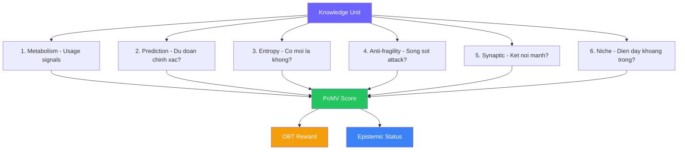
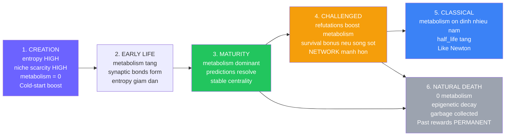

# 🧬 OneBrain PoK v2.0: Proof-of-Metabolic-Value (PoMV)

> **Tổng hợp nghiên cứu từ 5 nhóm nghiên cứu | Tháng 6/2026**
> Đề xuất một phát minh hoàn toàn mới cho consensus mechanism của OneBrain

> **KU Compatibility**: v6 Core DNA — PoMV operates entirely on Epigenetics Layer (runtime)

---

## Tại sao cần phát minh mới?

Design hiện tại (POK_DESIGN.md) về cơ bản vẫn là **hệ thống vote** — dù có 5 lớp phòng thủ tinh vi. Nó vẫn hỏi: *"tri thức này đúng hay sai?"* — mâu thuẫn trực tiếp với triết lý founder:

> *"Tri thức không đúng hay sai — nó chỉ được thay thế bởi tri thức tốt hơn."*

| Vấn đề của PoK hiện tại | Ví dụ |
|---|---|
| Vẫn cần ai đó "vote" → ai đủ tư cách? | Ai vote rằng "hoàng hôn Đà Lạt đẹp"? |
| Vote-based → dễ bị tấn công có tổ chức | 500 bot vote → cần 11 lớp defense |
| Clawback gây tranh cãi | Thu OBT khi "sai" → nhưng sai theo ai? |
| Centralized thinking | Nhiều cơ chế cần "bức tranh toàn cục" |

**Giải pháp: Bỏ voting hoàn toàn.** Thay bằng **QUAN SÁT** — để usage tự nhiên quyết định giá trị.

---

## Nền tảng nghiên cứu

### 5 nhóm nghiên cứu

| Nhóm | Phạm vi | Phát hiện chính |
|---|---|---|
| 🔍 Existing Systems | Wikipedia, StackOverflow, Prediction Markets, Reddit, PageRank, DeSci | 10 anti-patterns cần tránh, 8 nguyên tắc cần áp dụng |
| 🧠 Philosophy | Popper, Kuhn, Lakatos, Bayesian, Taleb | 16 nguyên tắc triết học, antifragility, falsificationism |
| 🔐 Decentralized Trust | EigenTrust, SybilGuard, Nostr WoT, CRDT trust | Nostr WoT = most applicable, 4-layer trust architecture |
| 🛡️ Anti-Disinformation | Real attacks, Community Notes, content-agnostic analysis | Bridging algorithm (97% accuracy), AI knowledge poisoning = #1 threat |
| 💡 Novel Invention | Bio-inspired, market-based, temporal, diversity, anti-fragile | **6 cơ chế mới → hợp nhất thành PoMV** |

### Bài học từ thực tế

> [!WARNING]
> **10 Anti-patterns** (học từ thất bại của người khác):
> 1. ❌ Global reputation (StackOverflow → halo effect)
> 2. ❌ No temporal decay (StackOverflow → stale answers dominate)
> 3. ❌ Unpaid review (Academia → reviewer burnout)
> 4. ❌ Pure token-weighted voting (MakerDAO → plutocracy)
> 5. ❌ Instant governance execution (Beanstalk → $181M stolen in 1 block)
> 6. ❌ Manual trust verification (PGP → doesn't scale)
> 7. ❌ Append-only without pruning (PGP SKS → flooding attack)
> 8. ❌ Equal-weight voting (Reddit → populism > accuracy)
> 9. ❌ First-mover advantage (StackOverflow → speed > quality)
> 10. ❌ Transparent algorithm weights (PageRank pre-2016 → targeted gaming)

### Nền tảng triết học (từ 6 trường phái)

| Triết gia | Nguyên tắc cho PoK |
|---|---|
| **Popper** | Tri thức càng bị challenge mà sống sót → càng đáng tin |
| **Kuhn** | Tri thức tồn tại trong paradigm — "sai" trong paradigm này có thể "đúng" trong paradigm khác |
| **Lakatos** | Đánh giá TRAJECTORY (tiến bộ hay suy thoái), không đánh giá từng claim |
| **Bayesian** | Confidence score (0-1), cập nhật liên tục khi có evidence mới |
| **Pragmatism** | Tri thức = "cái hoạt động được" — validate bằng OUTCOME, không bằng lý thuyết |
| **Taleb** | Antifragile: hệ thống TỐT HƠN sau khi bị tấn công |

---

## Phát minh: Proof-of-Metabolic-Value (PoMV)

### Ý tưởng cốt lõi

> **Không ai phán xét tri thức. Tri thức tự chứng minh giá trị qua USAGE.**

Giống cơ thể sống: tế bào được dùng → sống. Tế bào không ai dùng → apoptosis (chết theo chương trình). Tri thức cũng vậy.

### 6 tín hiệu thay thế voting



---

### Tín hiệu 1: Metabolism — Giá trị = Usage 🫀

Mỗi KU có "nhịp đập" đo bằng G-Counters (CRDT):

| Tín hiệu | Đo gì | CRDT |
|---|---|---|
| `query_hits` | Bao nhiêu lần được tìm kiếm | G-Counter |
| `retrieval_count` | Bao nhiêu lần được đọc | G-Counter |
| `dwell_time_ms` | Tổng thời gian người đọc | G-Counter |
| `citation_count` | Bao nhiêu KU khác trích dẫn nó | G-Counter |
| `derivative_count` | Bao nhiêu KU được inspire từ nó | G-Counter |
| `refutation_count` | Bao nhiêu KU phản bác nó | G-Counter |
| `downstream_usage` | Usage của KU trích dẫn nó (transitive) | G-Counter |

> [!IMPORTANT]
> **Phản bác cũng tính là metabolism DƯƠNG!** KU bị phản bác = KU đủ QUAN TRỌNG để tranh luận.
> KU bị mọi người bỏ qua mới thật sự "chết".

**Metabolic rate formula:**
```
metabolic_rate(t) = (
    α₁ × query_velocity(t)         
  + α₂ × retrieval_depth(t)        
  + α₃ × citation_freshness(t)     
  + α₄ × derivative_novelty(t)     
  + α₅ × downstream_cascade(t)     
) × e^(-λ × age / half_life)
```

**Phân tán**: Mỗi node đếm riêng → merge = max per node → sum. Đã có sẵn trong `crdt.rs`.

---

### Tín hiệu 2: Prediction — Tri thức dự đoán được tương lai 🔮

| Gene Type | Implicit Prediction | Resolution |
|---|---|---|
| **Fact** | "Nước sôi 100°C" → sẽ vẫn đúng ngày mai | Temporal consistency |
| **Procedure** | "Làm theo sẽ thành công" | Users report outcomes |
| **Hypothesis** | "Thuốc X chữa Y" | Cross-reference với KU mới |
| **Experience** | "Hoàng hôn đẹp ở đây" | Người khác cũng thấy đẹp? |

```
prediction_score = correct_resolutions / total_resolutions × confidence(n)
```

**Phân tán**: Mỗi node check predictions LOCAL → gossip resolutions qua ORSet.

---

### Tín hiệu 3: Entropy — Mới lạ = Có giá trị 🌟

```
Node A có 500 KU về vaccine → KU anti-vax mới = HIGH entropy trên A
Node B có 250 pro + 250 anti → KU anti-vax = LOW entropy trên B
```

- Dùng existing embeddings (512B) + SimHash + LSH cho cosine distance
- KU đầu tiên về 1 topic → MAXIMUM entropy → maximum reward
- Spam lặp lại → LOW entropy → low reward
- **"Sai" nhưng mới lạ = HIGH entropy** → khuyến khích ý tưởng đột phá

**Phân tán**: Mỗi node tính entropy vs LOCAL KB. Đã có infrastructure.

---

### Tín hiệu 4: Anti-fragility — Tấn công → Hệ thống mạnh hơn 🛡️

**Adversarial Immune Memory (AIM):**

```
1. ATTACK → Node phát hiện pattern (SimHash cluster + spike + account age)
2. ANTIBODY → Tạo AntibodyRule, lưu vào VacuumFilter (đã có!)
3. GOSSIP → Antibody lan truyền qua ORSet CRDT (như cytokine!)
4. IMMUNITY → Lần sau tấn công tương tự → chặn NGAY
5. BONUS → KU sống sót attack → "battle-hardened" → trust tăng
```

> [!TIP]
> **Giống hệ miễn dịch sinh học:**
> - Tế bào bạch cầu = Node OneBrain
> - Cytokine = CRDT gossip
> - Kháng thể = Attack signatures trong VacuumFilter
> - Trí nhớ miễn dịch = Memory cells trong ORSet

---

### Tín hiệu 5: Synaptic — Dùng chung → Kết nối mạnh 🧠

**Hebb's Rule**: Neurons that fire together, wire together.

```
User đọc KU_A rồi đọc KU_B → Bond A→B strengthens
Nhiều users cùng pattern → "neural highway" xuất hiện
Bonds không ai dùng → synaptic pruning (tự mất)
```

- **Emergent learning paths**: Không ai thiết kế, tự xuất hiện từ usage
- Extends existing `PheromoneTable` (stigmergy.rs) → cùng API pattern
- Recommendation engine tự nhiên: "người đọc A cũng thấy B hữu ích"

---

### Tín hiệu 6: Ecosystem — Mỗi tri thức có hệ sinh thái riêng 🌿

| Concept | Ý nghĩa |
|---|---|
| **Carrying capacity** | 1001st KU "cách đun nước" ≈ 0 giá trị. 1st KU "hoàng hôn ridge X lúc 5pm tháng 10" = MAX giá trị |
| **Predator-prey** | REFUTES = predators. Hệ sinh thái khỏe mạnh CẦN predators |
| **Symbiosis** | KU_A usage tăng khi KU_B được dùng → mutual benefit |
| **Invasive species** | Flood KU rác = invasive → carrying capacity tự giới hạn |

---

### Công thức hợp nhất PoMV

```
PoMV(ku, t) = 
    metabolism(ku, t)                          // Usage signal
  × (1 + prediction_bonus(ku, t))              // Predictive accuracy
  × (1 + entropy_bonus(ku, t_creation))        // Novelty at creation
  × (1 + survival_bonus(ku, t))                // Battle-hardened
  × synaptic_centrality(ku, t)                 // Network position
  × niche_scarcity(ku, t)                      // Ecological fit
```

---

## Vòng đời KU trong PoMV



---

## Epistemic Status — KHÔNG CẦN VOTING

> [!IMPORTANT]
> **Đột phá lớn nhất**: Epistemic status transitions hoàn toàn dựa trên observable signals, không cần ai vote!

| Transition | Điều kiện (observable) | CRDT |
|---|---|---|
| RUMOR → HEARSAY | `metabolic_rate > 0` (ai đó đã truy cập) | G-Counter |
| HEARSAY → TESTIMONY | `retrieval_count ≥ 3` từ different nodes | G-Counter |
| TESTIMONY → OBSERVATION | `citation_count ≥ 1` (KU khác trích dẫn) | G-Counter |
| OBSERVATION → HYPOTHESIS | Prediction registered | ORSet |
| HYPOTHESIS → EVIDENCE | `prediction_score > 0.5` | LWW-Register |
| EVIDENCE → CORROBORATED | `citation_count ≥ 3` từ diverse sources | G-Counter |
| CORROBORATED → PEER_REVIEWED | Cited by high-trust authors | EigenTrust |
| PEER_REVIEWED → CONSENSUS | Top 10% metabolism > 6 tháng | G-Counter + time |
| CONSENSUS → FORMALLY_PROVEN | `prediction_score > 0.95` > 1 năm | LWW-Register |

---

## So sánh PoMV vs Design hiện tại

| Khía cạnh | PoK v1 (Vote-based) | PoMV v2 (Observation-based) |
|---|---|---|
| **Ai quyết định** | Community voters | Không ai — usage là khách quan |
| **Tri thức "sai"** | Bị phạt (clawback) | Có giá trị nếu được dùng |
| **Tri thức chủ quan** | Đúng/sai ra sao? | 500 người thấy đẹp = 500 metabolism |
| **Spam** | 11 lớp defense phức tạp | 0 usage = tự chết (đơn giản) |
| **Disinformation** | Cần phát hiện + phạt | Content-agnostic spread analysis + immune memory |
| **Cold start** | Đợi votes | Entropy bonus ngay lập tức |
| **Clawback** | Có (gây tranh cãi) | Không (G-Counter chỉ tăng) |
| **Phân tán** | Cần quorum voting | Mỗi node quan sát LOCAL |
| **Tương thích code** | Cần viết mới nhiều | Reuse 80%+ infrastructure hiện tại |

---

## Chống Disinformation trong PoMV

> [!CAUTION]
> **PoMV không bỏ qua disinformation** — chỉ thay đổi CÁCH chống nó.

### Tầng 1: Content-agnostic Spread Analysis (từ Anti-Disinformation research)
- Phân tích CÁCH lan truyền, không phải NỘI DUNG
- Disinformation lan nhanh bất thường qua nodes tương tự → flag
- Tri thức thật lan TỪ TỪ qua nodes đa dạng
- **Chạy LOCAL trên mỗi node** ✅

### Tầng 2: Bridging-based Consensus (từ Community Notes)
- Đo "diverse corroboration" — citations từ users KHÁC NHAU về background
- Matrix factorization: KU được cite bởi người thường bất đồng → HIGH trust
- **97% accuracy** trên COVID-19 notes (Twitter/X data)

### Tầng 3: Anti-fragile Immune Memory (Proposal 4)
- Mỗi lần tấn công → tạo antibody → lần sau chặn nhanh hơn
- Antibodies gossip qua CRDT → network-wide immunity
- Tấn công làm hệ thống MẠNH HƠN

### Tầng 4: Natural Selection
- Disinformation CUỐI CÙNG sẽ có `prediction_score` thấp (dự đoán sai)
- Metabolism giảm khi người dùng chuyển sang tri thức tốt hơn
- Niche carrying capacity giới hạn số lượng KU về cùng topic
- **Không cần ai quyết định** — tự nhiên chọn lọc

---

## Tương thích với Code hiện tại

| PoMV Component | Đã có trong code | Cần viết mới |
|---|---|---|
| Metabolism (G-Counter) | ✅ `crdt.rs` — GCounter, PNCounter | Query/retrieval hooks |
| Entropy (embeddings) | ✅ `types.rs` — 512B int8 embeddings, SimHash, LSH | Cosine distance + gap detection |
| Predictions (ORSet) | ✅ `crdt.rs` — ORSet | Prediction struct + resolution |
| Anti-fragile (VacuumFilter) | ✅ `vacuum.rs` — VacuumFilter bloom | Attack pattern extraction |
| Synaptic (Pheromone) | ✅ `stigmergy.rs` — PheromoneTable | KU-to-KU extension |
| Ecosystem (LSH buckets) | ✅ `types.rs` — lsh_buckets | Clustering + carrying capacity |
| Temporal decay | ✅ `types.rs` — half_life field | Connect to metabolic rate |
| Trust propagation | ✅ All CRDT types | EigenTrust per-domain |
| Network gossip | ✅ SWIM + PubSub | New message types |

> [!NOTE]
> **~80% infrastructure đã có.** PoMV không phải viết lại từ đầu — nó KẾT NỐI và MỞ RỘNG những gì đã có.

---

## OBT Reward trong PoMV

```
OBT_reward(ku, period) = 
    base_emission(period)                              // Tổng OBT phát hành kỳ này
  × PoMV(ku, period) / Σ PoMV(all_kus, period)        // Tỉ lệ PoMV của KU / tổng
```

- Mỗi node tính rewards LOCAL từ CRDT view
- Rewards eventually converge (CRDT merge)
- Có thể differ giữa nodes tạm thời → OK (founder: "mỗi node tự quyết")
- **Không clawback** — G-Counter chỉ tăng, past rewards vĩnh viễn

---

## Quyết định từ Founder (2025-06-25)

### Q1: Corroborate/Challenge → ✅ Giữ lại như optional signal
Corroborate và Challenge vẫn tồn tại nhưng là **tín hiệu bổ sung** cho metabolism, không phải cơ chế chính. Khi ai đó explicit corroborate → tính vào `citation_count`. Khi challenge → tính vào `refutation_count`. Cả hai đều là dạng "usage" đặc biệt.

### Q2: Subjective knowledge → ✅ Không kiểm soát trải nghiệm
> *"Mỗi người sẽ có cảm nhận riêng, nó thuộc về trải nghiệm, không thể đúng sai. Chúng ta cố gắng không để node cố tình đẩy trải nghiệm spam — chứ không kiểm soát được trải nghiệm của node."*

**Thiết kế**: Experience/Narrative KUs KHÔNG có prediction resolution. Giá trị đo bằng pure metabolism (bao nhiêu người quan tâm). Anti-spam cho subjective KU = content-agnostic spread analysis + entropy (spam lặp lại = low entropy).

### Q3: Anti-fragile memory → ✅ Cân bằng privacy vs security
Antibodies chỉ chứa **pattern hash** (BLAKE3), KHÔNG chứa NodeID hay thông tin cá nhân. Biết pattern ≠ biết ai tấn công. Gossip antibodies = gossip abstract patterns, không gossip danh tính.

### Q4: Entropy gaming → ✅ Team quyết định
**Giải pháp**: Entropy là cold-start boost, decays theo hàm mũ trong 7 ngày. Sau 7 ngày, metabolism là tín hiệu duy nhất. KU "weird" sẽ có entropy cao ban đầu nhưng nếu 0 usage sau 7 ngày → PoMV → 0 → tự chết. Entropy không đủ để sống lâu — cần metabolism thực sự.

### Q5: Tên gọi → ✅ Proof-of-Knowledge v2 (PoK v2)
Giữ tên **Proof-of-Knowledge (PoK)** với version 2. Internally, cơ chế là PoMV (Proof-of-Metabolic-Value) nhưng externally vẫn gọi là PoK — consistent với whitepaper và tài liệu hiện tại.

---

## KU v6 Compatibility

PoMV operates entirely on the **Epigenetics Layer** (Layer 2) of the KU 3-layer architecture. It does NOT depend on the Core DNA wire format.

### What PoMV reads/writes

| Data | Layer | Struct | Impact |
|------|-------|--------|--------|
| 6 PoMV scores | Epigenetics | `TrustSection` | ✅ No change |
| 8 metabolism counters | Epigenetics | `KUMetabolism` (GCounters) | ✅ No change |
| Epistemic status transitions | Epigenetics | `EpistemicStatus` enum | ✅ No change |
| Gene type matching | Core DNA header | `header.gene_type` (4-bit) | ✅ Compatible — read from `KuRuntime.dna.header.gene_type` |
| Bond weights (Synaptic) | Epigenetics | `Vec<Bond>` | ✅ No change — bonds moved to Epigenetics |
| CID (content identity) | Core DNA | `BLAKE3(wire_bytes)` | ⚠️ CID values change (different hash input) but semantic is same |

### Runtime struct access

PoMV modules access KU data through `KuRuntime`:
```rust
// Before (v5)
ku.trust.metabolic_rate = score;
ku.trust.epistemic_status = new_status;
let gene = &ku.gene; // Gene enum

// After (v6) — same pattern via KuRuntime
ku.epi.trust.metabolic_rate = score;
ku.epi.epistemic_status = new_status;
let gene_type = ku.dna.header.gene_type; // u8 from CoreDna header
```

### Conclusion

PoMV is **fully compatible** with KU v6 Core DNA. The only code change needed is accessing gene type from `KuRuntime.dna.header.gene_type` (u8) instead of matching on the `Gene` enum. All other interfaces (TrustSection, KUMetabolism, EpistemicStatus, BondType) remain unchanged.
