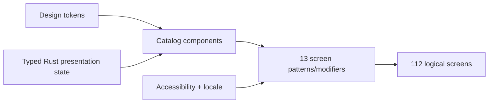

# OneBrain Mobile Screen Patterns V1

> Status: **TARGET SCREEN-COMPOSITION CONTRACT / implementation pending**
>
> Canonical screen IDs:
> [`MOBILE_APP_SITEMAP_V1.md`](../../features/mobile/MOBILE_APP_SITEMAP_V1.md)
>
> Components:
> [`MOBILE_COMPONENT_CATALOG_V1.md`](./MOBILE_COMPONENT_CATALOG_V1.md)

## 0. Why patterns exist

The sitemap has 112 logical screens but should not create 112 unrelated visual
layouts. Every screen selects one primary pattern below, then composes catalog
components and typed feature state.



Patterns determine hierarchy and responsive behavior. They do not change route,
authority or persistence semantics.

## 1. Shared screen frame

Every authenticated task screen uses this order where applicable:

1. system safe area;
2. `OBM-CMP-NAV-002` top app bar;
3. optional persistent `OBM-CMP-STA-006` scope banner;
4. scrollable semantic content;
5. optional `OBM-CMP-NAV-005` persistent action bar;
6. destination navigation or tablet rail;
7. global operation mini-progress above navigation.

Rules:

- The screen title describes the object/task, not the implementation module.
- Scope/status preceding a dangerous action stays visible while scrolling.
- A sticky footer measures its own height and never covers content or keyboard.
- One visible scroll container owns the main axis. Nested vertical card lists
  are prohibited.
- A route that becomes invalid renders typed unavailable/degraded state or
  resolves to its canonical safe destination; it does not keep stale data.

## 2. Pattern catalog

### `OBM-PAT-001` — Focused access and recovery

Use for unlock, protected-data, startup recovery and unavailable entry.

Anatomy:

- compact brand mark/motif;
- one clear title and calm explanation;
- exact non-private state;
- one primary recovery/unlock/retry action;
- optional secondary support/about action;
- no bottom navigation before authenticated routing.

Visual tone is quiet. Security and recovery never use celebratory illustration.
At 200% text the visual motif disappears before copy or actions compress.

### `OBM-PAT-002` — Guided onboarding

Use for welcome, preflight, node creation, security and readiness education.

Anatomy:

- progress such as “Step 2 of 5” in text and semantics;
- optional compact Idea Garden illustration;
- one decision/topic per page;
- content width max 560;
- Back plus one primary Next/Begin action;
- durable step cursor; resume copy names retained progress.

The required-data handoff is not a cheerful one-tap download. It leads into the
exact Init patterns with Limited-mode and storage/network consequences.

### `OBM-PAT-003` — Dashboard and hub

Use for Home, Library root, Init hub and top-level status hubs.

Anatomy:

- friendly page greeting/title;
- one featured action or attention card;
- responsive grid of independent fact cards;
- recent/continue section;
- contextual navigation to canonical details.

Cards use different icons and labels, not unrelated saturated backgrounds.
Only the featured card may use a gradient accent.

### `OBM-PAT-004` — Collection and bounded results

Use for shelves, catalogs, search results, activity, operations, peers, models,
needs and match inbox.

Anatomy:

- title plus exact scope/limitations;
- search/filter/sort row;
- optional tabs/segmented scope;
- bounded list/grid;
- pagination/loading boundary;
- scope-aware empty state.

Collection items remain the same component whether loaded from My or Received;
the origin/acquisition facet changes, not the object identity.

### `OBM-PAT-005` — Canonical detail

Use for KU, Concept, media info, model, peer, need, match and receipt detail.

Anatomy:

- object title/type plus primary scoped status;
- optional visual/content preview;
- grouped exact facts;
- provenance/authority/activity sections;
- contextual actions;
- tablet may pair with `OBM-PAT-013`.

Identity bytes use `OBM-CMP-DAT-007`. No card claims author, truth, custody,
delivery or completeness unless the corresponding typed evidence exists.

### `OBM-PAT-006` — Capture, compose and edit

Use for text, camera/audio/import, KQL, revisions, organization and encoding
workspace.

Anatomy:

- explicit source/input scope;
- large primary workspace;
- contextual tools below or in a tablet side panel;
- autosave/draft fact where durable;
- validation summary;
- review/continue action bar.

The central region prioritizes creation and comfortable reach. Color is more
expressive here, but private scope remains visible. LLM-assisted suggestions
look like candidates, never committed fields.

### `OBM-PAT-007` — Exact review and authority transition

Use for Init plan, publication, Public UseEvidence, cloud disclosure, source
permit, media share, restore switch, erase and other sensitive confirmation.

Anatomy:

- verb-specific title;
- current state → proposed state;
- exact object, recipient/provider, bytes/cost/retention/permanence;
- disclosure and consequence sections;
- fresh-state/plan validity;
- explicit secondary Cancel/Defer and primary named commit.

This pattern is intentionally less decorative. Primary commit stays disabled
with an adjacent typed reason if any exact binding changes.

### `OBM-PAT-008` — Durable operation

Use for Init/update, import, transfer, model, backup, restore, sync, seed and
tool execution.

Anatomy:

- operation name and scoped badge;
- exact progress/bytes;
- durable step timeline;
- current wait/pause/failure reason;
- retained verified progress and resource facts;
- safe Pause/Resume/View plan/Cleanup actions;
- receipt and diagnostics disclosure.

Back/dismiss leaves the operation intact. Process restart requeries the operation
by opaque reference. A callback or animation never marks it complete.

### `OBM-PAT-009` — Assistant and deterministic tool

Use for assistant home/thread, context selection, provider selection, proposal
and tool result.

Anatomy:

- visible provider route;
- thread/result content;
- selected-context capsule;
- composer or deterministic quick actions;
- proposal/result cards separated from natural-language text;
- disclosure/re-auth before remote or sensitive transition.

User content and assistant content differ by alignment/surface, not by tiny
text. Tool proposal/receipt is a structured panel, never a chat bubble.

### `OBM-PAT-010` — Settings and operational facts

Use for grouped settings, identity/security, Registry/storage, AI, network,
notifications, language, accessibility, background and diagnostics.

Anatomy:

- title and optional settings search;
- grouped rows with current value/status;
- inline reasons for disabled/unavailable choices;
- detail/drill-down route;
- destructive or authority-changing actions isolated in a final section.

Settings show compiled, requested, active, gate and kill-switch facts
independently where applicable.

### `OBM-PAT-011` — Verified media viewer

Use for image/audio/video/document viewing.

Anatomy:

- immersive but accessible verified content region;
- visible local/reference/partial state;
- playback/zoom controls with 48 targets;
- KU/direct-share provenance;
- expandable transfer/info/action region;
- structured alternative for unavailable media.

No unverified byte is decoded. A partial stream distinguishes playable verified
ranges from complete local retention.

### `OBM-PAT-012` — Limited, degraded and safe-shell modifier

This modifies another pattern when the whole app has constrained capability:

| Derived state | Shell behavior |
|---|---|
| `BootstrapOnly` / first `Provisioning` | Limited Home, persistent required-Init card, permitted encrypted raw drafts and safe Settings |
| `RegistryDegraded` | authenticated degraded shell, Registry repair/status prominent, only retained query capabilities enabled |
| `StoragePressureReadOnly` | read-only banner, exact required/reclaimable bytes and cleanup/export actions |
| `SafeMode` | separate read-only recovery shell; no ordinary bottom-nav implication of normal readiness |
| `Locked` | handled by `OBM-PAT-001`; no private content |

The modifier changes available actions and copy through typed state. It does
not gray the entire UI or show a generic sad error screen.

### `OBM-PAT-013` — Adaptive two-pane modifier

At medium/expanded widths, this modifier may pair:

- collection + canonical detail;
- Settings group + detail;
- operations + operation detail;
- assistant threads + active thread;
- media/peer/model catalog + detail.

Rules:

- One canonical selected entity/route.
- Master pane 320–400; detail pane uses remaining width.
- Privacy and action bars belong to the detail pane.
- Collapsing to compact preserves the logical route and back stack.
- At 200% text, collapse to one pane before creating unusably narrow columns.

## 3. Primary pattern mapping

This table covers every current sitemap prefix/range. A screen may add one
modifier, but its primary pattern remains stable.

| Sitemap screens | Primary pattern | Notes / secondary pattern |
|---|---|---|
| `ENT-001..004`, `ENT-006` | `OBM-PAT-001` | startup resolver may render no product content |
| `ENT-005` | `OBM-PAT-012` | SafeMode with detail/settings recovery content |
| `ONB-001..006` | `OBM-PAT-002` | `ONB-005` hands off to Init, not an embedded transfer |
| `INI-001` | `OBM-PAT-003` | uses operation cards; Limited modifier on first Init |
| `INI-002` | `OBM-PAT-007` | exact plan/Confirm/Defer |
| `HOM-001..003` | `OBM-PAT-003` | state modifier selected by derived readiness |
| `OPS-001` | `OBM-PAT-004` | operation catalog |
| `OPS-002` | `OBM-PAT-008` | canonical durable operation |
| `NTF-001` | `OBM-PAT-004` | durable activity inbox |
| `NTF-002` | `OBM-PAT-005` | current intent detail |
| `LIB-001` | `OBM-PAT-003` | Library hub |
| `LIB-002`, `LIB-005`, `LIB-007..008` | `OBM-PAT-004` | bounded search/concept/KU shelves |
| `LIB-003` | `OBM-PAT-006` | local KQL editor and bounded results |
| `LIB-004`, `LIB-006` | `OBM-PAT-005` | graph adds structured-list alternative |
| `KNO-001`, `KNO-004..005` | `OBM-PAT-005` | canonical knowledge/facts/workflow detail |
| `KNO-002..003` | `OBM-PAT-006` | local draft revision/organization |
| `KNO-006..007` | `OBM-PAT-007` | exact Public UseEvidence review/confirm |
| `MED-001` | `OBM-PAT-011` | canonical verified viewer |
| `MED-002` | `OBM-PAT-005` | media facts/provenance |
| `MED-003` | `OBM-PAT-007` | share representation/access review |
| `MED-004` | `OBM-PAT-008` | transfer/stream operation |
| `MED-005..006` | `OBM-PAT-004` | My/Received media shelves |
| `CAP-001..007` | `OBM-PAT-006` | source chooser through review |
| `CAP-008` | `OBM-PAT-008` | ephemeral result/router to canonical detail |
| `ENC-001..002` | `OBM-PAT-006` | encode workspace and exact review |
| `ENC-003` | `OBM-PAT-005` | private Save receipt/encoding detail |
| `PUB-001..002` | `OBM-PAT-007` | design-reserved until gate closes |
| `PUB-003` | `OBM-PAT-008` | local commit/outbox state only |
| `FID-001` | `OBM-PAT-005` | fidelity facts/attempts |
| `FID-002`, `FID-007..008` | `OBM-PAT-007` | permit, reveal/check and attestation review |
| `FID-003`, `FID-009` | `OBM-PAT-004` | design-reserved job/request catalogs |
| `FID-004..006`, `FID-010` | `OBM-PAT-008` | durable exact-source/work/permit lifecycle |
| `AI-001` | `OBM-PAT-009` | assistant hub |
| `AI-002` | `OBM-PAT-009` | thread |
| `AI-003`, `AI-007` | `OBM-PAT-004` | context/provider choice presented inside assistant shell |
| `AI-004..005` | `OBM-PAT-007` | remote disclosure or tool proposal |
| `AI-006` | `OBM-PAT-008` | tool operation/result |
| `SET-001`, `SEC-001..005` | `OBM-PAT-010` | identity/security/privacy facts |
| `SEC-006` | `OBM-PAT-007` | typed erase review |
| `DAT-001`, `DAT-003`, `DAT-005`, `DAT-007` | `OBM-PAT-010` | Registry/storage/backup/export facts |
| `DAT-002`, `DAT-004`, `DAT-006`, `DAT-008` | `OBM-PAT-007` | update/cleanup/restore/migration plans |
| `MOD-001..002` | `OBM-PAT-010` | provider/model settings/catalog |
| `MOD-003` | `OBM-PAT-005` | model release facts/actions |
| `NET-001..002`, `NET-005..008` | `OBM-PAT-010` | network/sync/seed/carrier/LAN settings |
| `NET-003` | `OBM-PAT-007` | exact peer enrollment |
| `NET-004` | `OBM-PAT-005` | peer detail/revoke entry |
| `MAT-001`, `MAT-004` | `OBM-PAT-004` | needs/matches shelves |
| `MAT-002` | `OBM-PAT-006` | private target authoring |
| `MAT-003`, `MAT-005` | `OBM-PAT-005` | private target/proposal detail |
| `NTF-003`, `SYS-001..007` | `OBM-PAT-010` | notification/system settings and diagnostics |

All rows above use `OBM-PAT-013` where the sitemap permits tablet two-pane
presentation.

## 4. Critical journey composition

### 4.1 First Init

```text
ONB-005  Guided handoff
  -> INI-001  Hub / Begin disclosure
  -> INI-002  Exact plan
  -> OPS-002  Durable operation
  -> readiness requery
  -> ONB-006 or Limited/Degraded shell
```

Use:

- `OPS-002 Exact plan panel`;
- `OPS-003 Resource facts`;
- `STA-004 Step timeline`;
- `OPS-004 Resume decision`;
- `FBK-005 Error/recovery panel`.

Do not render first Init as a generic circular loader.

### 4.2 Capture → encode → private Save

```text
Capture workspace
  -> exact source/candidate review
  -> deterministic encoding workspace
  -> explicit Save Private KU
  -> canonical KU encoding/detail
```

Use bright creative accents in the workspace, then calm exact facts in review.
After Save, the success message is “Saved privately.” A Publish control is
separate and absent until its gate closes.

### 4.3 Received KU and media

Collection and detail reuse the same KU/media components as My shelves. Show
source peer/acquisition, unresolved/qualified author, local bytes, access and
retention as independent facts. `ReferenceOnly`, partial and verified complete
states use different text/icons, not only progress color.

### 4.4 Passive OBP match

Need/match screens keep a persistent “Private target / bounded one-hop
observation” scope. Match cards use violet/blue information styling, not green
success. Retain, dismiss and re-evaluate are local actions; there is no direct
execute/adopt/publish action.

### 4.5 Assistant → tool

Keep four visual layers:

1. selected provider route;
2. natural-language candidate;
3. structured tool proposal and risk;
4. OneBrain execution receipt.

No animated assistant bubble crosses the authority boundary between layers 2
and 3.

## 5. Responsive behavior

### Compact phone

- one column;
- 16 gutter;
- bottom navigation;
- persistent action bar above keyboard/safe area;
- filters and secondary actions may use bottom sheets;
- detail facts stack vertically.

### Large phone

- one column with 20 gutter;
- two-card dashboard rows only when both remain at least 160 wide;
- landscape may use a temporary side panel for media or tools.

### Tablet/foldable

- navigation rail;
- 24–32 gutter;
- optional two-pane modifier;
- forms and reviews remain capped rather than stretching edge to edge;
- hinge/cutout regions are excluded from interactive content.

## 6. Screen review checklist

Before a screen is accepted:

- primary pattern ID recorded;
- only catalog component IDs used;
- typed state coverage includes relevant waiting/offline/denied/degraded paths;
- one dominant accent family;
- one primary task action;
- privacy/provider/network/query scope visible where relevant;
- English/Vietnamese and pseudo-locale reviewed;
- 200% text and 320-wide reflow pass;
- screen-reader rotor/order and focus return pass;
- screenshot goldens cover light/dark/high-contrast and compact/tablet;
- no visual claim exceeds the feature/runtime contract.
