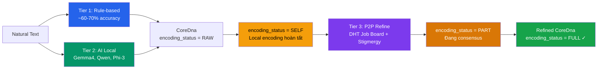
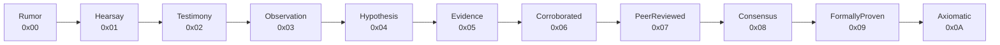

# OneBrain v6 — Feature Tree

> **Cây tính năng hoàn chỉnh cho kiến trúc v6.**  
> Mỗi feature được đánh dấu trạng thái: ✅ Implemented | 🔧 In Progress | 📋 Planned

---

## §1 Knowledge Units — Kiến trúc 3 lớp

Mỗi Knowledge Unit (KU) gồm 3 lớp phân tách rõ ràng, lấy cảm hứng từ sinh học phân tử:

```
┌───────────────────────────────────────────────┐
│         Layer 3: Expression (Protein)          │  ← Generated on-demand
│  Natural language text from CoreDna + Dict     │
├───────────────────────────────────────────────┤
│       Layer 2: Epigenetics (Histone)           │  ← Stored separately
│  Trust, Bonds, EpistemicStatus, Embeddings     │
├───────────────────────────────────────────────┤
│         Layer 1: Core DNA (Nucleotide)         │  ← Persisted, immutable
│  Binary instruction stream — 31 opcodes        │
└───────────────────────────────────────────────┘
```

### §1.1 Core DNA — Layer 1 ✅

Chuỗi instruction nhị phân siêu nhỏ, không phụ thuộc ngôn ngữ.

- **Wire format**: `MAGIC(0x4B) | VER_META(1B) | INSTRUCTIONS | END(0x1E) | CRC-16(2B)`
- **Kích thước**: 16–172 bytes cho một KU thông thường
- **Structs chính**: `CoreDna`, `CoreDnaHeader`, `Instruction`
- **31 Opcodes** (5-bit, `enum Op`):

| # | Opcode | Hex | Operands | Mô tả |
|---|--------|-----|----------|--------|
| 0 | `Triple` | 0x00 | S, P, O | Bộ ba chủ-vị-tân (S-P-O fact) |
| 1 | `Quality` | 0x01 | S, Q | Chủ thể có tính chất Q |
| 2 | `Quantity` | 0x02 | S, value, unit | Đo lường số lượng |
| 3 | `Sequence` | 0x03 | N, items… | Danh sách có thứ tự |
| 4 | `PartOf` | 0x04 | part, whole | Quan hệ chứa (phần-tổng thể) |
| 5 | `Located` | 0x05 | S, location | Quan hệ không gian |
| 6 | `Temporal` | 0x06 | S, time | Quan hệ thời gian |
| 7 | `Causal` | 0x07 | cause, effect | Quan hệ nhân quả |
| 8 | `Simulates` | 0x08 | S, model | Tương tự / mô phỏng |
| 9 | `Condition` | 0x09 | if, then | Điều kiện |
| 10 | `Agent` | 0x0A | actor, action | Tác nhân thực hiện |
| 11 | `Tool` | 0x0B | action, instrument | Dùng công cụ gì |
| 12 | `Range` | 0x0C | S, min, max | Khoảng giá trị |
| 13 | `Tolerance` | 0x0D | S, value, ±δ | Sai số cho phép |
| 14 | `Constraint` | 0x0E | source, op, target | Ràng buộc (≤, ≥, =, ≠) |
| 15 | `EnumVal` | 0x0F | S, N, values… | Một trong tập hợp |
| 16 | `Certainty` | 0x10 | level_u16 | Độ tin cậy 0–10000 |
| 17 | `Difficulty` | 0x11 | level_u8 | Độ khó 0–4 |
| 18 | `CidRef` | 0x12 | 32 bytes | Tham chiếu CID (BLAKE3) |
| 19 | `Step` | 0x13 | ord, action, target | Bước thủ tục |
| 20 | `Precond` | 0x14 | concept | Điều kiện tiên quyết |
| 21 | `Effect` | 0x15 | concept | Kết quả / hiệu ứng |
| 22 | `Affect` | 0x16 | V, A, D (i16) | Mô hình cảm xúc VAD |
| 23 | `Label` | 0x17 | key, value | Metadata key-value |
| 24 | `TextRef` | 0x18 | lang, len, bytes | Văn bản nén |
| 25 | `Formula` | 0x19 | format, len, bytes | LaTeX/MathML |
| 26 | `Witness` | 0x1A | count, proximity | Dữ liệu chứng nhân |
| 27 | `MediaRef` | 0x1B | system, len, id | Tham chiếu media ngoài |
| 28 | `CompositeHdr` | 0x1C | type, completeness, ver | Header composite |
| 29 | `Member` | 0x1D | order, role, required, label, cid | Thành viên composite |
| 30 | `End` | 0x1E | — | Kết thúc instruction stream |
| 31 | `Extended` | 0x1F | ext_byte, … | Mở rộng tương lai |

- **11 Gene Types** (`CoreDnaHeader.gene_type`):

| Value | Type | Mô tả |
|-------|------|--------|
| 0 | Fact | Sự kiện / dữ kiện |
| 1 | Procedure | Thủ tục / quy trình |
| 2 | Experience | Trải nghiệm cá nhân |
| 3 | Creative | Sáng tạo / nghệ thuật |
| 4 | MediaExperience | Trải nghiệm đa phương tiện |
| 5 | Testimony | Lời khai / chứng thực |
| 6 | Formal | Chứng minh hình thức |
| 7 | Hypothesis | Giả thuyết |
| 8 | Narrative | Tường thuật |
| 9 | Sensory | Cảm giác / giác quan |
| 10 | Composite | Tổ hợp nhiều KU |

- **CID**: Content Identity = BLAKE3 hash of wire bytes (32 bytes, globally unique)

### §1.2 Epigenetics — Layer 2 ✅

Metadata runtime, lưu riêng biệt (không ảnh hưởng CID).

- **Struct**: `Epigenetics`
  - `trust: TrustSection` — 6 PoMV signals + trust_score + confidence
  - `bonds: Vec<Bond>` — 33 relation types, 8 categories
  - `epistemic_status: EpistemicStatus` — 11 levels
  - `evidence_type: EvidenceType` — 9 GRADE-aligned types
  - `epigenetic: Option<EpigeneticSection>` — embeddings, temporal, versioning
- **Lưu trữ**: Serialized riêng (CBOR), không nằm trong wire bytes

### §1.3 Expression — Layer 3 ✅

Render ngôn ngữ tự nhiên từ CoreDna + ConceptDict, on-demand.

- **Struct**: `Expression { text, lang, concept_names }`
- **Không lưu trữ** — tái tạo khi cần
- **Đa ngôn ngữ**: cùng CoreDna → render ra "vi", "en", "ja"…

### §1.4 KuRuntime — Unified Composite ✅

- **Struct**: `KuRuntime { cid, dna, epi, expr, wire_bytes }`
- Kết hợp 3 lớp vào 1 struct queryable
- Factory: `KuRuntime::from_wire()`, `KuRuntime::from_dna()`

---

## §2 Knowledge Input — Pipeline 3 tầng



### §2.1 Tier 1: Rule-Based Parser ✅
- Module: `text_parser.rs`
- Pattern matching thuần túy, không cần AI
- Hỗ trợ: Vietnamese ("X là Y", "X gồm A, B", "Bước N:…") và English
- KQL: `CREATE (k:KU) FACT certainty=9000 { TRIPLE(...) QUANTITY(...) }`

### §2.2 Tier 2: AI-Assisted (Local Models) ✅
- KQL: `CREATE FROM TEXT "..." WITH AI model="gemma4"`
- AI phân tách text thành CoreDna instructions
- Chạy 100% local — không gửi dữ liệu lên cloud
- Modules: `ku_tools`, `ku_tool_executor`, `ku_system_prompt`

### §2.3 Tier 3: Distributed Encoding Consensus 🔧

Mạng ngang hàng refine CoreDna thông qua **encoding consensus** phân tán. Nhiều node cùng verify và cải thiện chất lượng encoding → CoreDna chính xác hơn.

#### State Machine — EncodingStatus

```text
RAW (0x00) → SELF (0x01) → PART (0x02) → FULL (0x03)
  │              │              │              │
  │ Vừa tạo,     │ Local encode  │ Đang P2P     │ Consensus đạt,
  │ chưa encode  │ hoàn tất      │ verification │ IMMUTABLE
```

- **RAW**: KU mới tạo, chưa qua encoding
- **SELF**: Đã encode local (Tier 1 rule-based hoặc Tier 2 AI)
- **PART**: Đã submit lên mạng P2P, đang chờ consensus
- **FULL**: Consensus đạt → **encoding bất biến** (immutable). Muốn sửa → tạo KU mới (new raw)

#### DHT Job Board — EncodingJob

KU cần refine được đăng lên **DHT-based job board**:

- Mỗi job chứa: `ku_cid`, `source_node`, `encoding_status`, `reward_obt`
- Node lấy job từ DHT → claim bằng **ClaimToken** (anti-stampede mechanism)
- ClaimToken có TTL — hết hạn → job quay lại pool
- Capped tối đa **3 verifiers** per job (threshold)

#### Stigmergy-Based Job Selection

- **Pheromone routing** từ OBP Layer 5 (`stigmergy.rs`)
- Node chọn job dựa trên pheromone concentration + domain expertise
- Tránh overload: pheromone evaporation tự nhiên cân bằng tải
- Gossip protocol (`encoding_gossip.rs`) lan truyền job status

#### 2-Phase Verification

| Phase | Nội dung | Output |
|-------|----------|--------|
| **Phase A**: AI Decomposition Agreement | Mỗi verifier chạy AI decompose text → CoreDna riêng, so sánh kết quả | Agreement score |
| **Phase B**: Tool Encoding Round-trip | Encode CoreDna → binary → decode lại → verify lossless | Round-trip pass/fail |

#### Consensus Weighted Scoring

```text
Consensus Score = 0.50 × agreement + 0.30 × detail + 0.20 × reputation
```

- **Agreement** (50%): Tỷ lệ verifiers đồng ý với kết quả encoding
- **Detail** (30%): Mức chi tiết và đầy đủ của CoreDna instructions
- **Reputation** (20%): Uy tín của verifier node (dựa trên lịch sử encoding)

#### OBT Rewards

- Verifier hoàn tất encoding → nhận **OBT tokens**
- Reward tỷ lệ thuận với chất lượng contribution
- Module: `encoding_reward.rs`

#### Code Modules

| Crate | Module | Chức năng |
|-------|--------|-----------|
| `ku-core` | `encoding_consensus.rs` | State machine, consensus logic |
| `ku-core` | `encoding_verifier.rs` | 2-phase verification engine |
| `ku-core` | `encoding_reward.rs` | OBT reward distribution |
| `ku-net` | `encoding_job.rs` | DHT job board, ClaimToken |
| `ku-net` | `encoding_gossip.rs` | Job status gossip protocol |
| `ku-net` | `encoding_stigmergy.rs` | Pheromone-based job selection |

---

## §3 PoMV v2 — Proof of Metabolic Value

> **Tên công khai**: Proof-of-Knowledge (PoK)  
> **Tên nội bộ**: Proof-of-Metabolic-Value (PoMV)

6 tín hiệu khách quan, observable, không cần voting:

```text
PoMV = w₁×Metabolism + w₂×Prediction + w₃×Entropy +
       w₄×Survival + w₅×Synaptic + w₆×NicheFitness
```

### §3.1 Signal 1: Metabolism ✅ (weight: 0.35)
- Module: `metabolism.rs`, `metabolism_store.rs`
- CRDT `GCounter` tracking: query hits, retrievals, dwell time, citations, derivatives, downstream usage
- Exponential decay with configurable half-life (default: 30 days)
- Struct: `KUMetabolism`
- Events: `MetabolismEvent { QueryHit, Retrieval, Citation, Derivative, DownstreamUsage, Corroboration, Refutation }`

### §3.2 Signal 2: Prediction ✅ (weight: 0.15)
- Module: `prediction.rs`
- Tracks prediction accuracy: correct/total × confidence
- 4 resolution methods: `TemporalConsistency`, `UsageOutcome`, `CrossReference`, `NoResolution`
- Structs: `PredictionRegistry`, `Prediction`, `PredictionOutcome`

### §3.3 Signal 3: Entropy ✅ (weight: 0.10)
- Module: `entropy.rs`
- Novelty score via cosine distance on int8 embeddings (512B)
- Cold-start boost decays exponentially over 7 days
- Struct: `EntropyCalculator` (stateless)

### §3.4 Signal 4: Survival ✅ (weight: 0.10)
- Module: `immune.rs`
- Anti-fragile: surviving attacks makes KU STRONGER
- 4 antibody types: `TemporalBurst`, `SourceConcentration`, `LowEngagement`, `DiversityDeficit`
- Content-agnostic — only detects spread PATTERNS, not content
- Struct: `ImmuneEngine`

### §3.5 Signal 5: Synaptic ✅ (weight: 0.15)
- Module: `synaptic.rs`
- Hebbian: "Neurons that fire together, wire together"
- Co-retrieval & co-citation strengthen bonds
- PageRank-like centrality computation
- Structs: `SynapticMap`, `CentralityCalculator`

### §3.6 Signal 6: Niche Fitness ✅ (weight: 0.15)
- Module: `ecosystem.rs`
- Ecological niche fitness = value added to domain ecosystem
- 4 components: niche density, uniqueness, cross-niche bridging, metabolic share
- Structs: `EcosystemAnalyzer`, `NicheStats`, `KUNicheProfile`

### §3.7 PoMV Aggregator ✅
- Module: `pomv.rs`
- Structs: `PomvCalculator`, `PomvSignals`, `PomvScore`, `PomvWeights`
- Default weights: configurable via `PomvWeights`

### §3.8 PoMV Runtime ✅
- Module: `pomv_runtime.rs`, `ku_lifecycle.rs`
- `PomvRuntime`: tick function chạy local trên mỗi node
- `KuLifecycle`: orchestrator kết nối KuRuntime ↔ PomvRuntime

---

## §4 Epistemic Ladder — 11 bậc nhận thức



- Enum: `EpistemicStatus` (11 variants)
- Module: `epistemic_engine.rs`
- Function: `evaluate_transition(current, metabolism, now, half_life)`
- **Key properties**:
  - Monotonic: chỉ tiến lên, không lùi
  - Observable: tất cả inputs là CRDT counters
  - Local: mỗi node đánh giá độc lập
  - Deterministic: same inputs → same output

| Transition | Threshold |
|------------|-----------|
| Rumor → Hearsay | metabolic_rate > 0.001 |
| Hearsay → Testimony | retrieval_count ≥ 3 from different nodes |
| Testimony → Observation | citation_count ≥ 1 |
| Observation → Hypothesis | diverse_citations ≥ 3 |
| Hypothesis → Evidence | node_diversity ≥ 5 |
| Evidence → Corroborated | citation_count ≥ 5 |
| Corroborated → PeerReviewed | engagement ≥ 50 |
| PeerReviewed → Consensus | age ≥ 6 months + metabolic_rate ≥ 1.0 |
| Consensus → FormallyProven | age ≥ 1 year + engagement ≥ 200 |

---

## §5 KQL — Knowledge Query Language

### §5.1 6 Query Types ✅

| Command | AST Type | Mô tả |
|---------|----------|--------|
| `FIND` | `FindQuery` | Truy vấn KU với filter, scope, ordering |
| `CREATE` | `CreateQuery` | Tạo KU mới (Tier 1 structured syntax) |
| `CREATE FROM TEXT` | `CreateFromTextQuery` | Tạo KU từ text bằng AI (Tier 2) |
| `UPDATE` | `UpdateQuery` | Cập nhật Epigenetics |
| `DEPRECATE` | `DeprecateQuery` | Đánh dấu KU lỗi thời |
| `WATCH` | `WatchQuery` | Subscribe thay đổi realtime |
| `EXPLAIN` | `Query` (wrapped) | Giải thích query plan |

### §5.2 Conditions & Operators ✅

```
FIND (k:KU)
WHERE k.dna.header.gene_type = 0
  AND k.epi.trust.trust_score > 8000
  AND k.concept_ids CONTAINS 301
SCOPE LOCAL
ORDER BY k.epi.trust.metabolic_rate DESC
LIMIT 10
RETURN k.cid, k.epi.trust.trust_score
```

- 6 comparison operators: `=`, `!=`, `>`, `>=`, `<`, `<=`
- Logical: `AND`, `OR`, `NOT`
- Membership: `CONTAINS`
- 7 Scopes: `Local`, `Neighbors`, `Cluster`, `Dht`, `Semantic`, `Global`, `Auto`

### §5.3 CREATE Syntax (Tier 1) ✅

```
CREATE (k:KU) FACT certainty=9000 {
    TRIPLE("water", "boils_at", "100_degrees")
    QUANTITY("temperature", 100.0, "celsius")
    CERTAINTY(9000)
}
SIGNED BY "node_abc"
```

### §5.4 CREATE FROM TEXT (Tier 2) ✅

```
CREATE FROM TEXT "Nước sôi ở 100 độ C ở áp suất tiêu chuẩn"
WITH AI model="gemma4"
SIGNED BY "node_abc"
```

---

## §6 ConceptDict — Từ điển Concept

### §6.1 In-Memory ConceptDict ✅
- Module: `concept_dict.rs`
- Structs: `ConceptDict`, `ConceptEntry`
- Bilingual: `name_vi`, `name_en` + canonical `name`
- Varint tier mapping (0–4) cho ConceptID
- Case-insensitive lookup, < 1μs per resolve

### §6.2 Persistent ConceptDict (redb) ✅
- Module: `persistent_concept_dict.rs`
- Feature flag: `persist`
- Pure Rust (redb), ACID transactions
- Persistence across sessions

---

## §7 OBP Network Protocol — 📋 Implemented (testing)

### §7.1 Network Layers

| Layer | Module | Mô tả |
|-------|--------|--------|
| 0 | `identity` | Cryptographic identity (NodeID, DID, Ed25519) |
| 1 | `messages` | Message framing and wire formats |
| 2 | `membership` | SWIM protocol membership & node fitness |
| 3 | `discovery` | 6-layer peer bootstrap |
| 4 | `dht` | S/Kademlia DHT routing |
| 5 | `stigmergy` | Pheromone-based routing |
| 6 | `vacuum` | Probabilistic filters |
| 7 | `pubsub` | Topic-based pub/sub |
| 8 | `transport` | QUIC transport (feature-gated) |

### §7.2 Key Features
- **Gossip**: `metabolism_gossip.rs` — gossip PoMV metabolism data
- **Sync**: `sync.rs` — state synchronization
- **Query routing**: `query/` — distributed query execution
- **Design**: NO central servers, mobile-first (<0.5% battery/day)
- **Scale target**: 100 BILLION+ nodes

---

## §8 AI Integration — Local Models Only

### §8.1 Tool-Calling Interface ✅
- Module: `ku_tools.rs` — tool definitions
- Module: `ku_tool_executor.rs` — execution engine
- Module: `ku_system_prompt.rs` — system prompt generation
- JSON-based tool calling for local AI models (Gemma4, Qwen, Phi-3)

### §8.2 Design Principles
- **100% local** — không gửi dữ liệu lên cloud
- **Model-agnostic** — hỗ trợ mọi model có tool-calling
- **Fallback** — Tier 1 rule-based luôn available khi không có AI
- **No cloud dependency** — hoạt động offline hoàn toàn

---

## Summary Matrix

| Feature | Status | Crate | Modules |
|---------|--------|-------|---------|
| CoreDna 3-layer | ✅ | `ku-core` | `core_dna`, `epigenetics`, `ku_runtime` |
| ConceptDict | ✅ | `ku-core` | `concept_dict`, `persistent_concept_dict` |
| Text Parser (Tier 1) | ✅ | `ku-core` | `text_parser` |
| AI Integration (Tier 2) | ✅ | `ku-core` | `ku_tools`, `ku_tool_executor` |
| PoMV 6 Signals | ✅ | `ku-core` | `metabolism`, `prediction`, `entropy`, `immune`, `synaptic`, `ecosystem` |
| PoMV Aggregator | ✅ | `ku-core` | `pomv`, `pomv_runtime`, `ku_lifecycle` |
| Epistemic Engine | ✅ | `ku-core` | `epistemic_engine` |
| CRDTs | ✅ | `ku-core` | `crdt` |
| KQL Parser | ✅ | `ku-kql` | `parser`, `ast` |
| KQL Executor | ✅ | `ku-kql` | `executor` |
| KQL Storage | ✅ | `ku-kql` | `storage` |
| OBP Network | 🔧 | `ku-net` | `identity`, `membership`, `dht`, … |
| Encoding Consensus | 🔧 | `ku-core` | `encoding_consensus`, `encoding_verifier`, `encoding_reward` |
| Encoding Network | 🔧 | `ku-net` | `encoding_job`, `encoding_gossip`, `encoding_stigmergy` |
