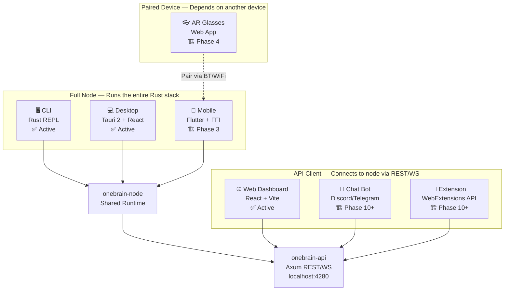
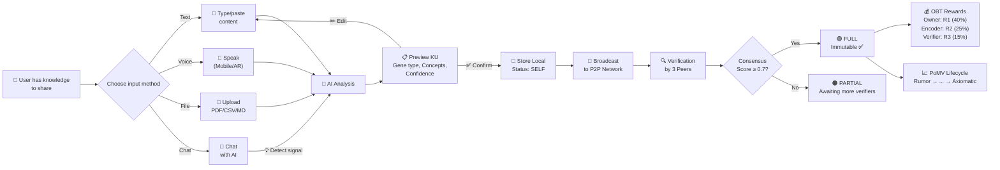
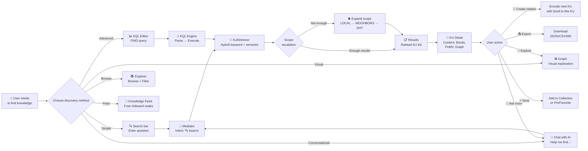
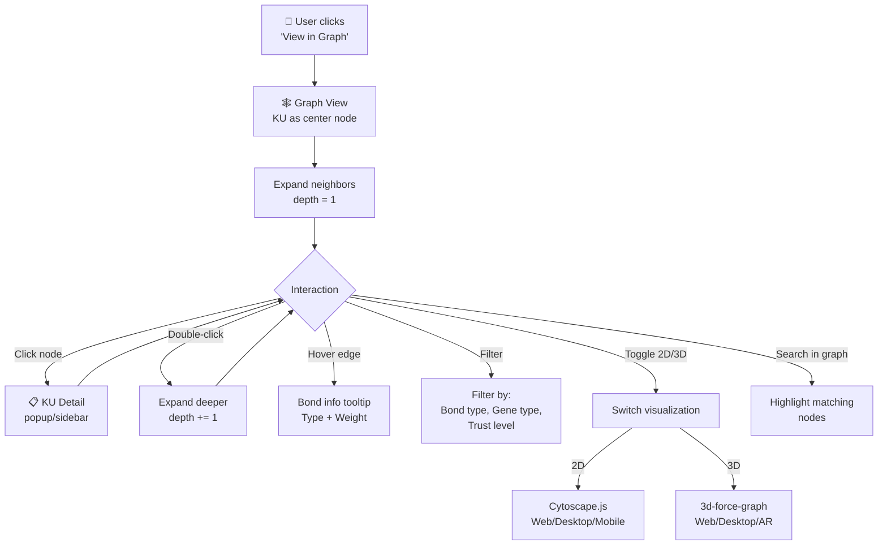
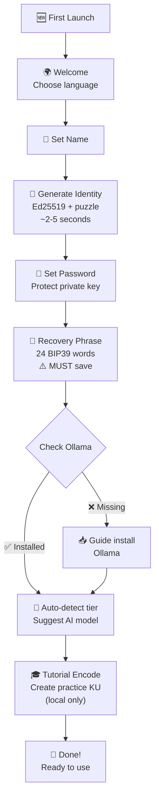
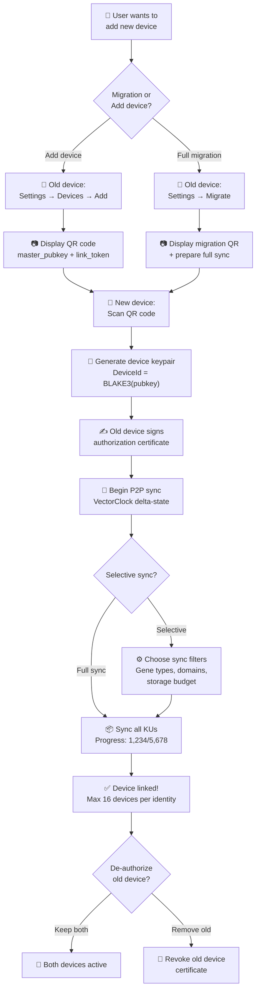
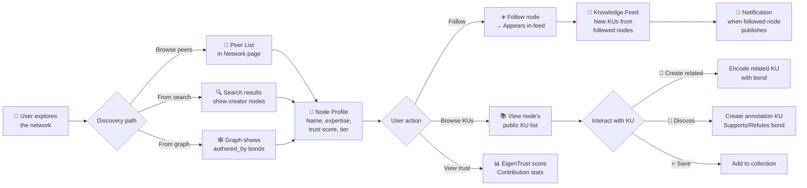

# 🌳 OneBrain — UI Feature Tree Detail (All Platforms)

> **Version**: 2.0 — 14/07/2026  
> **Objective**: Describe the complete feature tree for **all UI platforms** (Web, Desktop, Mobile, CLI, Extension, Bot, AR Glasses) — focused on **sharing** and **searching** Knowledge Units (KU).  
> **Sources**: Synthesized from KU_ARCHITECTURE.md, PLATFORM_GUIDE.md, P10_FEATURE_SPEC.md, P10_UI_PLAN.md, KQL_SPEC.md, OBS_SPEC.md, OBP_SPEC.md, OBT_DESIGN.md, POK_V2_SPECIFICATION.md, P10_CROSS_CUTTING.md, PILLAR_REVIEW.md, CROSS_PILLAR_GAP_ANALYSIS.md, KU_DECOMPOSITION.md, and direct source code analysis.

---

## Table of Contents

- [I. Platform Architecture Overview](#i-platform-architecture-overview)
- [II. Feature Tree — Knowledge Sharing](#ii-feature-tree--knowledge-sharing)
- [III. Feature Tree — Knowledge Discovery](#iii-feature-tree--knowledge-discovery)
- [IV. Feature Tree — KU Display & Interaction](#iv-feature-tree--ku-display--interaction)
- [V. Feature Tree — AI & Mediator](#v-feature-tree--ai--mediator)
- [VI. Feature Tree — Network & Sync](#vi-feature-tree--network--sync)
- [VII. Feature Tree — Identity & Security](#vii-feature-tree--identity--security)
- [VIII. Feature Tree — Token & Wallet](#viii-feature-tree--token--wallet)
- [IX. Feature Tree — Data & Portability](#ix-feature-tree--data--portability)
- [X. Feature Tree — Onboarding & Settings](#x-feature-tree--onboarding--settings)
- [X-A. Feature Tree — File & Media Management](#x-a-feature-tree--file--media-management)
- [XI. Feature Tree — Multi-Device & Data Management](#xi-feature-tree--multi-device--data-management)
- [XII. Feature Tree — Social & Collaboration](#xii-feature-tree--social--collaboration)
- [XIII. Feature Tree — Advanced Search & Discovery](#xiii-feature-tree--advanced-search--discovery)
- [XIV. Feature Tree — Content Management](#xiv-feature-tree--content-management)
- [XV. Feature Tree — Accessibility & UX](#xv-feature-tree--accessibility--ux)
- [XVI. Feature × Platform Matrix](#xvi-feature--platform-matrix)
- [XVII. User Journey Maps](#xvii-user-journey-maps)

---

## I. Platform Architecture Overview

### 3 Platform Types



### Status Summary

| Platform | Tech Stack | Status | LOC | Communication with Node |
|----------|-----------|--------|-----|------------------------|
| **CLI** | Rust (Clap 4) | ✅ Active | ~103KB | Direct call |
| **Web** | React 19 + Vite + TS | ✅ Active | ~85KB | REST/WebSocket `localhost:4280` |
| **Desktop** | Tauri 2 + React | ✅ Active | ~23KB + web | Tauri IPC → embedded node |
| **Mobile** | Flutter + `flutter_rust_bridge` | 🏗️ Scaffold | README | FFI → embedded node |
| **Extension** | TypeScript + WebExtensions | 🏗️ Scaffold | README | REST/WebSocket |
| **Bot** | Rust/Node.js + Discord/Telegram | 🏗️ Scaffold | README | REST API |
| **AR Glasses** | Web App (Meta Ray-Ban, Vision Pro) | 🏗️ Scaffold | README | Paired with Mobile/Desktop |

---

## II. Feature Tree — Knowledge Sharing

> **Philosophy**: "Once published on OneBrain, it's for ALL of humanity." There are no private KUs after publishing.

### F-S01. Encode — Transform Knowledge into KU

```
📝 F-S01. ENCODE (Knowledge Encoding)
├── F-S01.1 Text Input
│   ├── 🌐 Web: Textarea with rich toolbar, drag-drop file support
│   ├── 💻 Desktop: Textarea + drag-drop + clipboard integration
│   ├── 📱 Mobile: Textarea + voice dictation + camera OCR
│   ├── 🖥️ CLI: `encode "content"` or `remember "content"`
│   ├── 🔌 Extension: Right-click menu "Encode selection"
│   ├── 🤖 Bot: Send message directly
│   └── 👓 AR: Voice command "Hey OneBrain, remember..."
│
├── F-S01.2 AI Analysis Pipeline
│   ├── Tier 1: Rule-based pattern matching (Vietnamese + English) → ~60-70% accuracy
│   ├── Tier 2: Local AI model (Gemma4/Qwen/Phi-3) → ~85-90% accuracy
│   ├── Tier 3: Distributed Encoding Consensus → ~95%+ accuracy
│   ├── Confidence score: (success_rate × 0.7) + (instruction_richness × 0.3)
│   ├── Fallback chain: Accept → Retry (max 2, temp += 0.1) → FallbackTier1
│   └── Min threshold: 0.60
│
├── F-S01.3 Real-time Encoding Progress
│   ├── 6-step pipeline displayed to user:
│   │   ├── Step 1: Rate limit check
│   │   ├── Step 2: AI encoder initialization
│   │   ├── Step 3: AI generating tool calls
│   │   ├── Step 4: Processing KU
│   │   ├── Step 5: Storing & indexing
│   │   └── Step 6: Broadcasting to peers
│   ├── 🌐 Web: Progress bar + step indicators (SSE streaming)
│   ├── 💻 Desktop: Progress bar + system notification on complete
│   ├── 📱 Mobile: Progress bar + push notification
│   ├── 🖥️ CLI: Text progress dots/spinner
│   └── 🤖 Bot: "Processing..." → result message
│
├── F-S01.4 KU Preview & Confirmation
│   ├── Displayed before publishing:
│   │   ├── Gene type detected (badge + icon)
│   │   ├── Concepts extracted (tag list)
│   │   ├── Instructions decoded (human-readable)
│   │   ├── Wire size (bytes)
│   │   └── Confidence score
│   ├── 🌐 Web: Preview card with "Publish" / "Edit" / "Cancel" buttons
│   ├── 💻 Desktop: Preview card (same as Web)
│   ├── 📱 Mobile: Bottom sheet preview
│   ├── 🖥️ CLI: Text preview → confirm y/n
│   └── 🤖 Bot: Embed message with reaction buttons
│
├── F-S01.5 Quality Gates (automatic checks)
│   ├── Gate 1: Text ≥ 256 bytes
│   ├── Gate 2: ≥ 2 genes/instructions
│   ├── Gate 3: Encoding time ≥ 100ms (anti-instant-spam)
│   ├── Gate 4: ≥ 1 bond
│   ├── Bilingual error messages: "Content too short (minimum 256 characters)"
│   └── Rate limiting by tier:
│       ├── Leaf: 1 KU/hour
│       ├── Contributor: 5 KU/hour
│       └── LocalSP+: 10 KU/hour
│
├── F-S01.6 Multi-modal Input (Phase 2-3)
│   ├── 📱 Mobile: Camera → AI OCR → text → encode
│   ├── 📱 Mobile: Voice recording → transcription → encode
│   ├── 💻 Desktop: File drag-drop (PDF, MD, CSV, images)
│   ├── 🔌 Extension: Screenshot → OCR → encode
│   └── 👓 AR: Voice-only (continuous listening mode)
│
└── F-S01.7 Batch Encoding
    ├── 🌐 Web: Upload CSV/JSON file → batch encode
    ├── 💻 Desktop: Drag-drop multiple files
    ├── 🖥️ CLI: `import file.csv` or `import file.json`
    └── Sequential processing (no concurrency in Phase 1)
```

### F-S02. Publish & Broadcast — Propagate KU Across the Network

```
📡 F-S02. PUBLISH & BROADCAST
├── F-S02.1 Local Storage
│   ├── KU stored in redb (warm tier) + M-ARC cache (hot tier)
│   ├── CID = BLAKE3(wire_bytes) — content-addressed, immutable
│   └── Encoding status starts at: SELF
│
├── F-S02.2 P2P Broadcast
│   ├── Gossip protocol: Send CoreDna binary to connected peers
│   ├── Bloom filter sync: Prevent duplicate sends
│   ├── Replication factor R=7 (4 XOR-closest + 2 tier-anchored + 1 diversity)
│   ├── User-facing display:
│   │   ├── 🌐 Web: Toast "Published to X peers"
│   │   ├── 💻 Desktop: System notification
│   │   ├── 📱 Mobile: Push notification
│   │   ├── 🖥️ CLI: "✓ Broadcast to 5 peers"
│   │   └── 🤖 Bot: Reply "Shared with the network"
│   └── Offline mode: Queue → publish when connectivity restored
│
├── F-S02.3 Encoding Consensus (decentralized verification)
│   ├── DHT Job Board: Post verification job
│   ├── ClaimToken: Anti-stampede, max 3 verifiers, TTL 300s
│   ├── 2-Phase Verification:
│   │   ├── Phase A: AI decomposition agreement (Jaccard ≥ 0.6)
│   │   └── Phase B: Tool encoding round-trip (BLAKE3 match)
│   ├── Consensus Score = 50% agreement + 30% detail + 20% reputation
│   ├── Threshold ≥ 0.7 → FULL status (immutable forever)
│   ├── Status progression displayed to user:
│   │   ├── 🟡 SELF — "Self-verified"
│   │   ├── 🟠 PARTIAL — "1-2 peers verified"
│   │   └── 🟢 FULL — "Consensus verified ✅"
│   └── UI per platform:
│       ├── 🌐 Web: Badge + progress ring on KU card
│       ├── 💻 Desktop: Badge (same as Web)
│       ├── 📱 Mobile: Badge + notification when reaching FULL
│       └── 🖥️ CLI: Status text in `detail` command
│
├── F-S02.4 Epistemic Status Evolution
│   ├── 11 trust levels (monotonically increasing, never decreasing):
│   │   Rumor → Hearsay → Testimony → Observation → Hypothesis
│   │   → Evidence → Corroborated → PeerReviewed → Consensus
│   │   → FormallyProven → Axiomatic
│   ├── Automatically determined by observable thresholds (NO voting)
│   ├── UI: Progress bar / ladder visualization
│   │   ├── 🌐 Web: PoMV Monitor page — ladder + history
│   │   ├── 💻 Desktop: Same as Web
│   │   ├── 📱 Mobile: Compact ladder view
│   │   └── 🖥️ CLI: Text-based level indicator
│   └── Notification when KU advances in status
│
└── F-S02.5 Knowledge Signal Detection (Proactive)
    ├── AI detects knowledge in conversation:
    │   ├── "Remember this" → confidence 0.95
    │   ├── "X is Y" definitions → confidence 0.70
    │   ├── Procedures with steps → confidence 0.75
    │   └── Long factual statements → confidence 0.50
    ├── Deduplication check:
    │   ├── Jaccard ≥ 0.85 → auto-skip
    │   ├── Jaccard ≥ 0.60 → warn user "Similar KU already exists"
    │   └── Jaccard < 0.60 → proceed
    └── UI: Suggestion chip "💡 Encode as KU?"
        ├── 🌐 Web: Inline chip in Chat
        ├── 💻 Desktop: Same as Web
        ├── 📱 Mobile: Bottom suggestion bar
        ├── 🖥️ CLI: Prompt "Encode this? [y/n]"
        └── 🤖 Bot: Reaction button
```

### F-S03. Verification — Participate in Verifying Others' KUs

```
🔍 F-S03. VERIFICATION (KU Verification)
├── F-S03.1 Automatic Verification Job Claiming
│   ├── Node automatically claims jobs from DHT Job Board
│   ├── Stigmergy routing: Prioritize jobs matching domain expertise
│   ├── Background service (VerifierService)
│   └── No user interaction required (fully automatic)
│
├── F-S03.2 Verification Results
│   ├── 🌐 Web: Dashboard notification "Verified KU abc123"
│   ├── 💻 Desktop: System tray notification
│   ├── 📱 Mobile: Push notification
│   ├── 🖥️ CLI: Event log "[VERIFY] KU abc123 → AGREE"
│   └── OBT reward automatically credited (R3 stream: 15%)
│
└── F-S03.3 Verification Stats
    ├── Number of KUs verified
    ├── Agreement rate
    ├── OBT earned from verification
    └── Displayed in Profile / Dashboard
```

---

## III. Feature Tree — Knowledge Discovery

### F-D01. Search — Find Knowledge

```
🔎 F-D01. SEARCH (Knowledge Discovery)
├── F-D01.1 Natural Language Search (via Mediator)
│   ├── User enters a natural language question
│   ├── IntentClassifier detects Search intent (🔍 badge)
│   ├── Mediator → KuRetriever (hybrid keyword + semantic)
│   ├── Results: ranked KU list + AI-generated summary
│   ├── UI per platform:
│   │   ├── 🌐 Web: Search bar (top header) → Chat page results
│   │   ├── 💻 Desktop: Global search bar (Cmd+K / Ctrl+K)
│   │   ├── 📱 Mobile: Search bar + voice search button
│   │   ├── 🖥️ CLI: `search "query"` or `find "query"`
│   │   ├── 🔌 Extension: Popup search bar + overlay results
│   │   ├── 🤖 Bot: Send message → receive results
│   │   └── 👓 AR: Voice "Hey OneBrain, what is...?"
│   └── Offline: Keyword search on local KUs (no AI required)
│
├── F-D01.2 KQL — Knowledge Query Language
│   ├── SQL-like syntax for advanced search
│   ├── 6 Query Types:
│   │   ├── FIND: Search with pattern matching
│   │   │   ├── WHERE clauses (AND/OR/NOT/EXISTS/CONTAINS)
│   │   │   ├── Comparisons (=, !=, >, >=, <, <=)
│   │   │   ├── Aggregation (COUNT/SUM/AVG/MIN/MAX)
│   │   │   ├── ORDER BY + LIMIT
│   │   │   └── 28 extractable fields
│   │   ├── CREATE: Create KU (structured / AI-assisted / legacy)
│   │   ├── UPDATE: Modify Epigenetics layer only
│   │   ├── DEPRECATE: Mark KU as obsolete
│   │   ├── WATCH: Standing queries (real-time notifications)
│   │   └── EXPLAIN: Query plan analysis
│   │
│   ├── 7 Scope Levels (distributed search):
│   │   ├── LOCAL — Local machine only
│   │   ├── NEIGHBORS — Broadcast to connected peers
│   │   ├── CLUSTER — Route via super-peer
│   │   ├── DHT — Kademlia lookup
│   │   ├── SEMANTIC — Semantic similarity search
│   │   ├── GLOBAL — Network-wide flood
│   │   └── AUTO (default) — Auto-escalation: local → neighbors → DHT
│   │
│   ├── KQL UI:
│   │   ├── 🌐 Web: KQL editor with syntax highlighting + autocomplete
│   │   ├── 💻 Desktop: Same as Web + keyboard shortcuts
│   │   ├── 📱 Mobile: Simplified KQL builder (dropdown filters)
│   │   ├── 🖥️ CLI: `kql "FIND (k:KU) WHERE k.gene_type = 'Fact'"`
│   │   └── 🤖 Bot: `!kql FIND ...`
│   │
│   └── Example KQL queries:
│       ├── Find high-trust facts:
│       │   `FIND (k:KU) WHERE k.gene_type = 'Fact' AND k.trust_score > 5000`
│       ├── Search by domain:
│       │   `FIND (k:KU) WHERE k.content CONTAINS 'machine learning'`
│       ├── Search by time:
│       │   `FIND (k:KU) WHERE k.created > 1720000000 ORDER BY k.pomv DESC LIMIT 10`
│       ├── Time-travel query:
│       │   `FIND (k:KU) AT TIME 1719900000`
│       ├── Standing query (real-time):
│       │   `WATCH (k:KU) WHERE k.gene_type = 'Hypothesis' ON CREATE`
│       └── Query plan:
│           `EXPLAIN FIND (k:KU) WHERE k.trust_score > 8000`
│
├── F-D01.3 Browse — Browse KU List
│   ├── Paginated card view
│   ├── Filter options:
│   │   ├── Gene type (13 types, each with unique color)
│   │   ├── Trust level (High/Medium/Low)
│   │   ├── Encoding status (SELF/PARTIAL/FULL)
│   │   ├── Epistemic status (11 levels)
│   │   ├── Date range
│   │   └── Domain/topic
│   ├── Sort options:
│   │   ├── PoMV score (high → low)
│   │   ├── Date created (newest → oldest)
│   │   ├── Trust score
│   │   └── Wire size
│   ├── UI:
│   │   ├── 🌐 Web: Explorer page — card grid + filter sidebar
│   │   ├── 💻 Desktop: Same as Web + keyboard navigation
│   │   ├── 📱 Mobile: Scrollable card list + filter bottom sheet
│   │   ├── 🖥️ CLI: `list` (paginated table) + `list --gene fact` (filtered)
│   │   └── 🤖 Bot: `!list` → embed list
│   └── Each KU card displays:
│       ├── CID (8 chars short)
│       ├── Gene type badge (icon + color)
│       ├── Preview text (~80 chars)
│       ├── PoMV score gauge
│       ├── Trust indicator
│       ├── Created timestamp (relative)
│       └── Wire size
│
├── F-D01.4 Graph Exploration — Explore Knowledge Graph
│   ├── Interactive knowledge graph visualization
│   ├── Nodes = KUs, Edges = Bonds (33 relation types)
│   ├── Bond types in 8 categories:
│   │   ├── A: Epistemic (supports, refutes, evidences)
│   │   ├── B: Structural (part_of, has_part, contains)
│   │   ├── C: Causal (causes, enables, prevents)
│   │   ├── D: Derivation (derived_from, extends, summarizes)
│   │   ├── E: Similarity (similar_to, contrasts, complements)
│   │   ├── F: Temporal (precedes, follows, concurrent)
│   │   ├── G: Provenance (authored_by, sourced_from, cited_in)
│   │   └── H: Experiential (experienced, witnessed, practiced)
│   ├── Bond state visuals:
│   │   ├── Active: Solid line
│   │   ├── Weakened: Dashed line
│   │   └── Deprecated: Hidden / strikethrough
│   ├── UI:
│   │   ├── 🌐 Web: Graph page — 2D (Cytoscape.js) + 3D (3d-force-graph) toggle
│   │   ├── 💻 Desktop: Same as Web + fullscreen mode
│   │   ├── 📱 Mobile: 2D touch-only (pinch zoom, drag)
│   │   ├── 🖥️ CLI: `graph <cid>` → text-based tree view
│   │   │   └── `graph <cid> --depth 3` → deeper traversal
│   │   └── 👓 AR: 3D spatial graph (Vision Pro) / 2D overlay (Meta Ray-Ban)
│   ├── Interactions:
│   │   ├── Click node → KU detail popup
│   │   ├── Hover edge → bond type + weight tooltip
│   │   ├── Double-click → expand neighbors
│   │   ├── Filter by bond type
│   │   ├── Search within graph
│   │   └── Layout options (force-directed, hierarchical, radial)
│   └── API: `GET /api/graph/:cid?depth=2`, `GET /api/graph/:cid/neighbors`
│
├── F-D01.5 WATCH — Standing Queries (Real-time)
│   ├── User creates WATCH query → receives notification when new KU matches
│   ├── WebSocket-based notification
│   ├── Example: "Notify me when there's a new Hypothesis about AI"
│   │   → `WATCH (k:KU) WHERE k.gene_type = 'Hypothesis' AND k.content CONTAINS 'AI' ON CREATE`
│   ├── UI:
│   │   ├── 🌐 Web: Notification bell + toast
│   │   ├── 💻 Desktop: System notification
│   │   ├── 📱 Mobile: Push notification
│   │   ├── 🖥️ CLI: Real-time event stream
│   │   └── 🤖 Bot: Auto-reply when matched
│   └── Watch management: List / Delete / Pause
│
└── F-D01.6 Semantic Search (Phase 2)
    ├── Embedding-based similarity search
    ├── RotatE 64-dim int8 embeddings
    ├── Cross-domain bridge detection
    └── KQL scope: SEMANTIC
```

### F-D02. KU Detail View — View a Single KU in Detail

```
📋 F-D02. KU DETAIL VIEW
├── F-D02.1 Header
│   ├── CID full (64 hex) + copy button
│   ├── Gene type badge (color + icon + name)
│   ├── Encoding status badge (SELF/PARTIAL/FULL)
│   ├── Epistemic status badge (11 levels)
│   └── Evidence type badge (9 GRADE-aligned types)
│
├── F-D02.2 Content
│   ├── Expressed text (rendered from CoreDna, multilingual)
│   ├── Language selector (vi/en/ja...)
│   ├── Wire size indicator
│   └── Raw instruction view (toggle — for advanced users)
│
├── F-D02.3 Decoded Instructions
│   ├── List of decoded instructions
│   ├── Each instruction shows:
│   │   ├── Opcode name (32 opcodes)
│   │   ├── Human-readable description
│   │   └── Referenced concept IDs
│   └── Instruction count
│
├── F-D02.4 Codons (Concepts)
│   ├── Tag list of extracted concepts
│   ├── Each codon: name + role (Domain/Agent/Content/Time/Result)
│   └── Click → filter KUs sharing the same concept
│
├── F-D02.5 Bonds (Relationships)
│   ├── List of IN/OUT bonds
│   ├── Each bond: direction icon, relation type, other KU preview, weight
│   ├── Click → navigate to connected KU
│   └── Mini graph view (immediate neighbors)
│
├── F-D02.6 PoMV Breakdown (Trust Metrics)
│   ├── Radar chart with 6 signals:
│   │   ├── 🟢 Metabolism (0.35) — usage activity
│   │   ├── 🔵 Prediction (0.15) — accuracy
│   │   ├── 🟡 Entropy (0.10) — novelty
│   │   ├── 🔴 Survival (0.10) — anti-fragility
│   │   ├── 🟣 Synaptic (0.15) — graph centrality
│   │   └── 🟠 Niche (0.15) — domain fitness
│   ├── Combined PoMV score [0.0 – 1.0]
│   └── Metabolic rate trend (sparkline)
│
├── F-D02.7 Metadata
│   ├── Created timestamp
│   ├── Wire bytes size
│   ├── Instruction count
│   ├── Confidence score
│   └── Verification details (verifier count, agreement score)
│
└── F-D02.8 Actions
    ├── 🔗 Share CID (copy link)
    ├── 📊 View in Graph
    ├── 📝 Create related KU (pre-filled bond)
    ├── 📤 Export (JSON/MD)
    ├── 🗑️ Delete (local only — CID still exists on the network)
    └── ⚠️ Deprecate (mark obsolete — does not delete)
```

---

## IV. Feature Tree — KU Display & Interaction

### 13 Gene Types — Visual System

```
🧬 13 GENE TYPES (Unified Visual System)
├── Knowledge Category
│   ├── 🔷 Fact (#06b6d4 Cyan) — "Verified truth"
│   ├── 🔮 Procedure (#8b5cf6 Violet) — "Process, how-to"
│   └── 🩵 Definition (#0ea5e9 Sky) — "Concept definition" [v7 NEW]
│
├── Personal Category
│   ├── 🟡 Experience (#f59e0b Amber) — "Personal experience"
│   ├── 🟢 Creative (#10b981 Green) — "Creative, artistic work"
│   ├── 🩷 MediaExperience (#ec4899 Pink) — "Media experience"
│   ├── 🟣 Narrative (#a855f7 Purple) — "Story, account"
│   └── 💛 Sensory (#eab308 Yellow) — "Sensory perception"
│
├── Social Category
│   ├── 🟠 Testimony (#f97316 Orange) — "Witness testimony"
│   └── 🔴 Normative (#ef4444 Red) — "Norms, rules" [v7 NEW]
│
├── Academic Category
│   ├── 💜 Formal (#6366f1 Indigo) — "Formal proof"
│   └── 🩲 Hypothesis (#14b8a6 Teal) — "Hypothesis"
│
└── Structure Category
    └── ⬜ Composite (#64748b Slate) — "Multi-KU composite"
```

> **Rule**: All platforms MUST use colors from the `onebrain-node::display` module. NEVER hard-code colors.

### Formatting Conventions

```
📐 FORMATTING CONVENTIONS (All Platforms)
├── CID: 64 hex chars (full) / 8 chars (short UI)
├── OBT: milliOBT internally, "X,XXX.XXX OBT" display (1 OBT = 1000 milliOBT, always 3 decimal places)
├── Timestamps:
│   ├── < 24h: "3 hours ago"
│   ├── This week: "Tue, 2:30 PM"
│   └── Older: "12/07/2026"
├── Gene type: Color badge + icon + short name
├── PoMV: Gauge [0.0 – 1.0] + color gradient (red → yellow → green)
├── Trust: High (green) / Medium (yellow) / Low (red)
└── Wire size: format_size() → "142 B" / "1.2 KB"
```

---

## V. Feature Tree — AI & Mediator

```
🤖 F-AI. AI & MEDIATOR
├── F-AI01. Chat Interface
│   ├── Conversational AI — personal "second brain"
│   ├── 100% local (Ollama) — NO data sent externally
│   ├── 7 Intent Types (auto-detected):
│   │   ├── 🔍 Search — "find knowledge about X"
│   │   ├── 📝 Encode — "remember this" / "save this knowledge"
│   │   ├── 🔗 Connect — "link A with B"
│   │   ├── 🧠 Synthesize — "synthesize everything about X"
│   │   ├── 📊 GraphQuery — "relationship between A and B"
│   │   ├── 💬 FreeChat — free conversation
│   │   └── ❓ Ambiguous — needs clarification
│   ├── Intent badge displayed on each response
│   ├── 3-tier intent classification:
│   │   ├── Keyword (~0ms) → Embedding (~10ms) → LLM (~500ms-2s)
│   │   └── Escalation when confidence is low
│   ├── UI:
│   │   ├── 🌐 Web: Chat page — bubbles, streaming, suggestion chips
│   │   ├── 💻 Desktop: Same as Web + Cmd+J shortcut
│   │   ├── 📱 Mobile: Full chat UI + voice input
│   │   ├── 🖥️ CLI: Free text input → AI response (any non-command text)
│   │   ├── 🤖 Bot: Native chat in Discord/Telegram
│   │   └── 👓 AR: Voice conversation
│   └── Bilingual: Vietnamese + English (follows user preference)
│
├── F-AI02. Suggestion Chips
│   ├── Actionable buttons below each AI response:
│   │   ├── "📝 Encode as KU" — save recently discussed knowledge
│   │   ├── "🔍 Search more" — find more
│   │   ├── "📊 Show graph" — view graph
│   │   ├── "🔗 Create bond" — create relationship
│   │   └── Context-dependent suggestions
│   └── UI: Horizontal scrollable chips
│
├── F-AI03. Context Memory (4 tiers)
│   ├── Working Memory: 20 most recent messages
│   ├── Core Facts: Extracted important facts
│   ├── Episodic Summaries: Summaries of older conversations
│   └── Archival: Saved to disk, recalled when needed
│
├── F-AI04. AI Model Management
│   ├── 8 curated models (Qwen 2.5: 0.5B → 32B)
│   ├── 7-tier device classification (T0-T6) based on RAM+VRAM
│   ├── Auto-select model matching hardware capabilities
│   ├── UI:
│   │   ├── 🌐 Web: Settings → AI section — model list + switch
│   │   ├── 💻 Desktop: Settings + first-run wizard
│   │   ├── 📱 Mobile: Settings
│   │   ├── 🖥️ CLI: `model` command — list/switch
│   │   └── Health check: `GET /api/ai/status` → connected, model, latency_ms
│   └── GPU detection: CUDA/ROCm/Metal/Vulkan
│
└── F-AI05. Offline Degradation
    ├── ✅ Works offline: Browse KUs, keyword search, view graph, wallet, profile, export
    ├── ⚠️ Needs AI (Ollama): Semantic search, encode, chat, import
    ├── ⚠️ Needs network: Publish, P2P sync, verification
    └── UI: Status indicator "🟢 Online" / "🟡 Local Only" / "🔴 Offline"
```

---

## VI. Feature Tree — Network & Sync

```
🌐 F-NET. NETWORK & SYNC
├── F-NET01. Dashboard / Status
│   ├── Displays:
│   │   ├── Total KU count (local + network)
│   │   ├── Connected peers count
│   │   ├── Network health indicator
│   │   ├── OBT balance
│   │   ├── Node tier badge
│   │   └── Sync status
│   ├── UI:
│   │   ├── 🌐 Web: Dashboard page — stat cards + charts
│   │   ├── 💻 Desktop: Dashboard + system tray stats
│   │   ├── 📱 Mobile: Dashboard + widget
│   │   ├── 🖥️ CLI: `status` command
│   │   └── 🤖 Bot: `!status` command
│   └── Real-time updates via WebSocket/NodeEvent
│
├── F-NET02. Peer Management
│   ├── Peer list (connected + known)
│   ├── Manual connect: enter peer address
│   ├── Auto-discovery:
│   │   ├── mDNS (LAN)
│   │   ├── Seed servers
│   │   └── DHT peer exchange
│   ├── UI:
│   │   ├── 🌐 Web: Network page — peer table + connect form
│   │   ├── 💻 Desktop: Network page (same as Web)
│   │   ├── 📱 Mobile: Peer list + QR scan connect
│   │   ├── 🖥️ CLI: `peers` (list) + `connect <addr>` (manual)
│   │   └── 🤖 Bot: `!peers` + `!connect <addr>`
│   └── Peer info: node_id, address, tier, connected_since, kus_shared
│
├── F-NET03. KU Sync
│   ├── Automatic: Bloom filter sync on peer connect
│   ├── Events: KuReceived notification
│   ├── UI:
│   │   ├── 🌐 Web: Toast "Received new KU from peer X"
│   │   ├── 💻 Desktop: System notification
│   │   ├── 📱 Mobile: Push notification
│   │   └── 🖥️ CLI: Event log
│   └── Conflict resolution: CID-based (content-addressed = no conflicts)
│
├── F-NET04. Stigmergy Routing
│   ├── Pheromone-based query routing (ant-colony inspired)
│   ├── Queries automatically route to peers with relevant knowledge
│   ├── Not directly visible to user (background process)
│   └── Advanced UI: Stigmergy trail visualization (Network page)
│
└── F-NET05. Dream Mode (Graph Consolidation)
    ├── Offline graph restructuring when node is idle
    ├── 3 phases: Replay → Association → Pruning
    ├── UI indicator: "🌙 Knowledge is consolidating..."
    └── Dream bonds: Automatically creates cross-domain connections
```

---

## VII. Feature Tree — Identity & Security

```
🔐 F-ID. IDENTITY & SECURITY
├── F-ID01. Decentralized Identity
│   ├── Ed25519 keypair + BLAKE3 crypto puzzle (~65K iterations, 2-5s)
│   ├── NO login, NO username/password, NO server auth
│   ├── DID format: did:key:z6Mk<hex>
│   ├── UI:
│   │   ├── 🌐 Web: Identity card (node_id, name, tier, trust)
│   │   ├── 💻 Desktop: Identity section in Settings
│   │   ├── 📱 Mobile: Profile page
│   │   ├── 🖥️ CLI: `identity` command
│   │   └── All: Auto-generated on first run
│   └── Stats: kus_encoded, kus_received, total_queries
│
├── F-ID02. BIP39 Recovery
│   ├── 24-word mnemonic phrase
│   ├── Shown once during identity creation → user must save it
│   ├── Recovery flow: enter 24 words → restore identity
│   ├── UI:
│   │   ├── 🌐 Web: Setup wizard step
│   │   ├── 💻 Desktop: First-run wizard + Settings → Recovery
│   │   ├── 📱 Mobile: Setup wizard + biometric confirmation
│   │   └── 🖥️ CLI: `recover` command
│   └── Validation: checksum verification
│
├── F-ID03. Device Linking
│   ├── Max 16 devices per identity group
│   ├── QR code flow: scan from new device
│   ├── UI:
│   │   ├── 📱 Mobile: Camera scan QR
│   │   ├── 💻 Desktop: Display QR + camera scan
│   │   └── 🖥️ CLI: Display QR in terminal (ASCII)
│   └── Sync: Identity-level settings sync across devices
│
├── F-ID04. App Lock
│   ├── 📱 Mobile only: Biometric (Face ID / Fingerprint) + PIN
│   ├── NOT login — only unlocks the local app
│   └── Auto-lock timeout configurable
│
├── F-ID05. Local API Security
│   ├── localhost:4280 ONLY (never exposed externally)
│   ├── 256-bit random API token (generated on node start)
│   ├── CORS: only localhost origins
│   ├── Bearer token auth (constant-time compare)
│   └── AuthGate component (Web) checks token before rendering
│
└── F-ID06. Sybil Resistance (4 layers, NO CAPTCHA)
    ├── L1: Crypto puzzle (~65K hash iterations per identity)
    ├── L2: Rate limiting per tier
    ├── L3: Quality gates (min 256 bytes, min 2 instructions)
    └── L4: EigenTrust reputation (new identities = near-zero trust)
```

---

## VIII. Feature Tree — Token & Wallet

```
💰 F-W. WALLET & OBT TOKEN
├── F-W01. Wallet Overview
│   ├── Balance (milliOBT → "X,XXX.XXX OBT")
│   ├── Chain length (Nano-style account-chain)
│   ├── Tier badge + multiplier
│   ├── Total earned / spent
│   ├── 4 Earning Streams breakdown:
│   │   ├── R1: Owner (40%) — create quality KUs
│   │   ├── R2: Encoder (25%) — participate in encoding consensus
│   │   ├── R3: Verifier (15%) — verify peers' KUs
│   │   └── R4: Storage (20%) — store KUs for the network
│   ├── UI:
│   │   ├── 🌐 Web: Wallet page — balance card + streams pie chart
│   │   ├── 💻 Desktop: Wallet page (same as Web)
│   │   ├── 📱 Mobile: Wallet tab
│   │   ├── 🖥️ CLI: `wallet` command
│   │   └── 🤖 Bot: `!wallet` command
│   └── Rate limit indicator: used/max per period
│
├── F-W02. Transaction History
│   ├── Block types: Mint / Send / Receive / Refund / Open
│   ├── Confirmation levels:
│   │   ├── ⏳ Pending (50-200ms)
│   │   ├── 🔄 Tentative (1-3s)
│   │   ├── ✅ Confirmed (10-30s)
│   │   └── 🔒 Settled
│   ├── UI: Scrollable transaction list with filters
│   └── Export: CSV download
│
├── F-W03. Node Tier System (7 tiers)
│   ├── Leaf (0.10x) → Contributor (0.50x) → LocalSP (1.00x)
│   │   → RegionalSP (1.25x) → CountrySP (1.50x)
│   │   → ContinentalSP (1.75x) → GlobalBackbone (2.00x)
│   ├── EigenTrust-gated promotions
│   ├── UI: Tier badge + progress bar to next tier
│   └── Multiplier affects earning rates
│
└── F-W04. Penalty System (5-tier)
    ├── None → ElevatedScrutiny → Warning → TrustReduction → Jail → Tombstone
    ├── Gaming patterns detected:
    │   ├── IsolationAttack
    │   ├── BurstSpam
    │   ├── WashTrading
    │   └── TrustFarming
    └── UI: Warning banner when under scrutiny/warning
```

---

## IX. Feature Tree — Data & Portability

```
📦 F-DP. DATA PORTABILITY
├── F-DP01. Export KUs
│   ├── Formats: JSON / CSV / Markdown
│   ├── Scope: All KUs / Filtered / Single KU
│   ├── UI:
│   │   ├── 🌐 Web: Export button → file download
│   │   ├── 💻 Desktop: Export → file dialog (Tauri dialog plugin)
│   │   ├── 📱 Mobile: Share sheet
│   │   └── 🖥️ CLI: `export [--format json|csv|md] [--output path]`
│   └── Includes: CoreDna, Epigenetics, Expression, Bonds
│
├── F-DP02. Import Knowledge
│   ├── Formats: Text / CSV / PDF / Markdown / JSON
│   ├── AI-assisted: Parse → Extract → Encode → Store
│   ├── ImportResult: { imported, skipped, errors }
│   ├── UI:
│   │   ├── 🌐 Web: Upload area + progress
│   │   ├── 💻 Desktop: Drag-drop + file dialog
│   │   ├── 📱 Mobile: File picker + camera
│   │   └── 🖥️ CLI: `import <file_path>`
│   └── Deduplication: Auto-skip Jaccard ≥ 0.85
│
├── F-DP03. Full Backup
│   ├── Encrypted `.onebrain` archive
│   ├── Includes: All KUs + Identity + Profile + Settings + Wallet
│   ├── Password-protected
│   ├── UI:
│   │   ├── 🌐 Web: Settings → Backup → Download
│   │   ├── 💻 Desktop: Settings → Backup (file dialog)
│   │   ├── 📱 Mobile: Settings → Backup (cloud/local)
│   │   └── 🖥️ CLI: `backup [--output path]`
│   └── BackupInfo: { path, size, ku_count, timestamp }
│
├── F-DP04. Restore from Backup
│   ├── Upload .onebrain file + password
│   ├── UI: Similar to Backup but reversed
│   └── 🖥️ CLI: `restore <backup_path>`
│
└── F-DP05. Blob Storage (Media)
    ├── Content-addressed file storage (BLAKE3 OB-CID)
    ├── 256KB fixed-size chunking
    ├── Max single blob: 100MB
    ├── Device-adaptive quotas: 2GB (IoT) → 200GB (server)
    ├── Operations: Upload / List / Download / Delete / GC
    ├── UI:
    │   ├── 🌐 Web: Media section + upload area
    │   ├── 💻 Desktop: Drag-drop media
    │   ├── 📱 Mobile: Camera + gallery picker
    │   └── 🖥️ CLI: `blob upload/list/download/delete/stats/gc`
    └── Stats: count, total_size, quota, usage_pct
```

---

## X. Feature Tree — Onboarding & Settings

```
🚀 F-OB. ONBOARDING & SETTINGS
├── F-OB01. First-Run Wizard
│   ├── Step 1: Welcome screen + language selection (vi/en)
│   ├── Step 2: Set display name
│   ├── Step 3: Generate identity (Ed25519 + crypto puzzle, ~2-5s)
│   ├── Step 4: Set password for key protection
│   ├── Step 5: Show BIP39 recovery phrase (24 words) — MUST save
│   ├── Step 6: Check Ollama → guide install if missing
│   ├── Step 7: Auto-detect device tier → suggest AI model
│   ├── Step 8: Tutorial encode (local only, NOT published)
│   ├── UI:
│   │   ├── 🌐 Web: Multi-step wizard overlay
│   │   ├── 💻 Desktop: First-run wizard (wizard_get_defaults, wizard_check_ollama, wizard_complete)
│   │   ├── 📱 Mobile: Swipeable onboarding cards
│   │   └── 🖥️ CLI: Interactive prompts
│   └── Completion → flag `first_run_done = true`
│
├── F-OB02. User Profile
│   ├── Identity-level (synced across devices):
│   │   ├── Display name
│   │   ├── Response style: Concise / Balanced / Detailed / Academic
│   │   ├── Expertise areas
│   │   └── Language preference
│   ├── UI:
│   │   ├── 🌐 Web: Settings → Profile section
│   │   ├── 💻 Desktop: Settings → Profile
│   │   ├── 📱 Mobile: Profile tab
│   │   └── 🖥️ CLI: `profile` + `profile set name "Name"`
│   └── Stats: total_kus, total_queries, member_since
│
├── F-OB03. Device Settings (local only)
│   ├── Theme (dark/light)
│   ├── Language (vi/en)
│   ├── AI model selection
│   ├── Ollama URL
│   ├── Network port
│   ├── Data directory
│   ├── Seed servers
│   ├── Notification preferences (per-type mute, DND schedule)
│   └── Auto-start (Desktop only)
│
├── F-OB04. Notifications
│   ├── Event types + platform-specific delivery:
│   │   ├── Peer Connected:
│   │   │   CLI: eprintln / Web: Toast / Desktop: Tray / Mobile: Push / AR: Badge
│   │   ├── KU Received:
│   │   │   CLI: eprintln / Web: Toast+badge / Desktop: Notification / Mobile: Push / AR: Glance
│   │   ├── OBT Reward:
│   │   │   Web: Toast+counter / Desktop: Tray / Mobile: Push
│   │   ├── Verification Result:
│   │   │   All platforms: Notification
│   │   └── Encoding Progress:
│   │       Web: Progress bar / Desktop: Progress / CLI: Spinner
│   ├── Per-type mute control
│   ├── DND schedule
│   └── WebSocket events: encode_progress, peer_connected, ku_received, verify_result, notification
│
└── F-OB05. Internationalization (i18n)
    ├── Phase 1: Vietnamese + English
    ├── AI response language follows user preference
    ├── ConceptDict bilingual
    ├── Error messages bilingual
    └── Future: Additional languages
```


<!-- v1.0 Feature Matrix and Journey Maps have been superseded by the expanded v2.0 versions in Sections XVI and XVII below -->

---

## X-A. Feature Tree — File & Media Management

> **Status**: Blob Store core types ✅ implemented (406 LOC, 8 tests). BlobStorage engine ✅ implemented. Node-level CRUD ✅ implemented. **But UI-level file management, attach-to-KU flow, preview, and P2P replication are NOT implemented.**

### F-FM01. Attach Files When Encoding KU

```
📎 F-FM01. FILE ATTACHMENT DURING ENCODE
├── F-FM01.1 Attach Flow
│   ├── User creates KU (text encode) → optionally attaches files
│   ├── Supported types: Image, Video, Audio, Document, Raw binary
│   ├── Max 10 files per KU (BLOB_MAX_PER_KU = 10)
│   ├── Max 100MB per file (BLOB_MAX_SIZE)
│   ├── File → stored as Blob → OB-CID generated → KU gets MediaRef instruction
│   ├── MediaRef format: { system: 0x01 (OBS), id: [version:u8][type:u8][blake3:32B] }
│   ├── Deduplication: same file content → same BlobCid → no duplicate storage
│   └── Implementation: store_blob() ✅, blob_add_ku_ref() ✅, UI flow 🔴
│
├── F-FM01.2 Input Methods per Platform
│   ├── 🌐 Web:
│   │   ├── Drag-drop zone on encode page
│   │   ├── Click to browse file picker
│   │   ├── Paste from clipboard (Cmd+V for images)
│   │   └── URL import (fetch file from URL → store as blob)
│   ├── 💻 Desktop:
│   │   ├── Drag-drop from OS file manager
│   │   ├── System file dialog (Tauri dialog plugin)
│   │   ├── Paste from clipboard
│   │   └── Global hotkey: screenshot → attach
│   ├── 📱 Mobile:
│   │   ├── Camera capture (photo/video)
│   │   ├── Gallery picker
│   │   ├── File picker (Documents)
│   │   └── Voice recording → attach as audio
│   ├── 🖥️ CLI:
│   │   ├── `encode "text" --attach file1.jpg file2.pdf`
│   │   ├── Pipe: `cat file.jpg | ob encode --attach-stdin`
│   │   └── `blob upload <file_path>` → manual reference
│   ├── 🔌 Extension:
│   │   ├── Right-click image → "Save to OneBrain"
│   │   └── Capture screenshot of page section
│   └── 🤖 Bot:
│       └── Send file to bot → auto-attach to new KU
│
├── F-FM01.3 Upload Progress & Validation
│   ├── Progress bar for large files (chunked: 256KB per chunk)
│   ├── File type validation (magic bytes + extension)
│   ├── MIME type auto-detection
│   ├── Thumbnail generation for images (preview before publish)
│   ├── File size warning near quota limit
│   └── Virus/malware scanning (Phase 3+ — community validation)
│
└── F-FM01.4 Implementation Status
    ├── ✅ BlobCid::from_content() — content-addressed CID generation
    ├── ✅ BlobType::detect() — magic bytes + extension detection
    ├── ✅ mime_from_extension() — MIME type inference (30+ types)
    ├── ✅ store_blob() — file → chunks → redb storage
    ├── ✅ blob_add_ku_ref() — link blob to KU
    ├── 🔴 POST /api/blobs/upload — multipart upload API NOT implemented
    ├── 🔴 UI attach flow — NOT implemented on any platform
    └── 🔴 Encode + attach atomic — NOT implemented
```

### F-FM02. File Preview & Viewer on KU Detail

```
👁️ F-FM02. FILE PREVIEW & VIEWER
├── F-FM02.1 Inline Preview (on KU Detail View)
│   ├── Image: Thumbnail → click to expand (lightbox)
│   │   ├── Supported: JPEG, PNG, WebP, GIF, BMP, SVG, ICO, TIFF
│   │   ├── Lazy loading for performance
│   │   └── Zoom/pan controls
│   ├── Video: Embedded player with controls
│   │   ├── Supported: MP4, WebM, MKV, AVI, MOV
│   │   ├── Poster frame (auto-generated thumbnail)
│   │   └── Quality selection (if multiple renditions)
│   ├── Audio: Waveform player
│   │   ├── Supported: MP3, OGG, FLAC, WAV, M4A, AAC
│   │   ├── Waveform visualization
│   │   └── Playback speed control
│   ├── Document: Inline viewer / download
│   │   ├── PDF: Embedded viewer (pdf.js for Web)
│   │   ├── Markdown: Rendered preview
│   │   ├── Code/Text: Syntax-highlighted view
│   │   └── Office (DOCX/XLSX/PPTX): Download + file icon
│   └── Raw: File icon + metadata + download button
│
├── F-FM02.2 Attachment Gallery
│   ├── If KU has multiple files → gallery view (grid or carousel)
│   ├── File type icons with labels
│   ├── Sort by: type / name / size
│   └── "Download all" button (ZIP archive)
│
├── F-FM02.3 Platform Implementations
│   ├── 🌐 Web: HTML5 media elements + pdf.js + lightbox
│   ├── 💻 Desktop: Same as Web (via Tauri WebView)
│   ├── 📱 Mobile: Native media players + swipe gallery
│   ├── 🖥️ CLI: `blob download <cid> [--output file]` + file info display
│   ├── 🔌 Extension: Compact preview in popup
│   └── 👓 AR: Floating image/document overlay
│
└── F-FM02.4 Implementation Status
    ├── ✅ get_blob_meta() — metadata retrieval
    ├── ✅ export_blob() — download to local file
    ├── 🔴 Inline preview — NOT implemented
    ├── 🔴 Thumbnail generation — NOT implemented
    └── 🔴 Gallery UI — NOT implemented
```

### F-FM03. File Manager

```
📁 F-FM03. FILE MANAGER
├── F-FM03.1 Browse All Files
│   ├── List view / Grid view of all stored blobs
│   ├── Filter by type: Image / Video / Audio / Document / All
│   ├── Sort by: Date / Size / Name / Type
│   ├── Search by original filename
│   ├── Show referencing KU count per file
│   └── Orphan indicator (files not referenced by any KU)
│
├── F-FM03.2 File Operations
│   ├── Upload new file (standalone, not attached to KU)
│   ├── Download file
│   ├── Delete file (local only)
│   ├── Pin file (exempt from GC)
│   ├── Unpin file
│   ├── View referencing KUs (click → go to KU)
│   └── Bulk operations: multi-select → delete / download
│
├── F-FM03.3 Storage Dashboard
│   ├── Total storage used (count + bytes)
│   ├── Storage breakdown by type (pie chart):
│   │   ├── Images: X MB (Y files)
│   │   ├── Videos: X MB (Y files)
│   │   ├── Audio: X MB (Y files)
│   │   ├── Documents: X MB (Y files)
│   │   └── Raw: X MB (Y files)
│   ├── Quota usage bar (used / quota)
│   ├── Quota tier indicator:
│   │   ├── IoT: 2 GB (disk ≤ 15 GB)
│   │   ├── Mobile: 10 GB (disk > 15 GB)
│   │   ├── Laptop: 20 GB (disk > 50 GB)
│   │   ├── Desktop: 50 GB (disk > 200 GB)
│   │   └── Server: 200 GB (disk > 500 GB)
│   ├── Orphaned files count + one-click cleanup
│   └── "Run GC" button → garbage_collect() → show freed space
│
├── F-FM03.4 UI
│   ├── 🌐 Web: Settings → Storage → File Manager
│   ├── 💻 Desktop: Settings → Storage + dedicated panel
│   ├── 📱 Mobile: Settings → Storage (simplified)
│   ├── 🖥️ CLI:
│   │   ├── `blob list [--type image] [--sort size] [--orphans]`
│   │   ├── `blob stats` → count, total_size, quota, usage_pct
│   │   ├── `blob upload <file_path>` → store + show BlobCid
│   │   ├── `blob download <cid> [--output path]`
│   │   ├── `blob delete <cid>`
│   │   ├── `blob pin/unpin <cid>`
│   │   └── `blob gc` → cleanup orphaned blobs
│   └── 🤖 Bot: `!storage` → show stats
│
└── F-FM03.5 Implementation Status
    ├── ✅ list_blobs() — list all blob metadata
    ├── ✅ blob_stats() → (count, total_size)
    ├── ✅ blob_gc() → (removed_count, freed_bytes)
    ├── ✅ BlobMeta.is_orphaned() — orphan detection
    ├── ✅ BlobMeta.pinned — pin support
    ├── ✅ default_blob_quota_bytes() — 5-tier adaptive quota
    ├── ✅ API: GET /api/blobs, GET /api/blobs/{cid}, DELETE, /stats, /gc
    ├── 🔴 File Manager UI — NOT implemented
    ├── 🔴 Storage Dashboard UI — NOT implemented
    └── 🔴 POST /api/blobs/upload — NOT implemented
```

### F-FM04. File Replication Across P2P Network

```
🌐 F-FM04. BLOB P2P REPLICATION
├── F-FM04.1 Replication Strategy
│   ├── KU CoreDna: R=7 replicas across network
│   ├── Blob files: R=3 replicas (lower because larger)
│   ├── Tier-aware placement: 4 XOR-nearest + 2 tier-anchored + 1 diversity
│   ├── Chunk-level transfer (256KB chunks, can resume interrupted)
│   └── Priority: small blobs first, then large
│
├── F-FM04.2 Fetch on Demand
│   ├── When viewing KU with MediaRef → check local blob store
│   ├── If blob NOT local → request from P2P network by BlobCid
│   ├── Progressive loading: show placeholder → load chunks → display
│   ├── Cache policy: recently viewed blobs kept in hot tier
│   └── Offline: show "file unavailable offline" placeholder
│
├── F-FM04.3 Implementation Status
│   ├── ✅ ReplicationManager — target selection algorithm (664 LOC, 17 tests)
│   ├── ✅ PendingStore with ACK tracking
│   ├── 🔴 Blob replication NOT wired to node — only KU metadata replicated
│   ├── 🔴 STORE_RPC for blobs — message codes defined but NOT implemented
│   └── 🔴 Fetch-on-demand — NOT implemented
│
└── F-FM04.4 User-Facing
    ├── Download progress for remote blobs
    ├── "This file is being fetched from the network" indicator
    └── Cache management: "Clear cached files" in Settings
```

### F-FM05. File Types & Gene Type Mapping

```
🧬 F-FM05. FILE TYPES & GENE MAPPING
├── Gene Type determines primary KU content; blobs are supplementary
├── Common combinations:
│   ├── Fact + Document → reference paper PDF attached
│   ├── Procedure + Image → step-by-step with screenshots
│   ├── Procedure + Video → tutorial video
│   ├── Experience + Audio → voice journal / interview recording
│   ├── Analogy + Image → diagram or illustration
│   ├── Composite + multiple files → multimedia knowledge unit
│   └── Any gene type + any file type → flexible attachment
│
├── Special handling:
│   ├── Image Gene (GeneType = 6): Primary content IS the image
│   │   └── CoreDna instructions describe the image; blob IS the KU
│   ├── Audio Gene: Primary content IS the audio
│   └── Video Gene: Primary content IS the video
│
└── AI Integration:
    ├── Image → OCR → extract text → enrich KU instructions
    ├── Audio → speech-to-text → extract knowledge
    ├── Video → keyframe extraction → scene description
    ├── PDF → parse → extract structured knowledge
    └── Implementation: 🔴 NOT implemented (Phase 2+)
```

---

## XI. Feature Tree — Multi-Device & Data Management

> **Status**: Designed in specs but largely NOT implemented in code. SyncManager, VectorClock, CRDT all exist but are NOT wired to OneBrainNode.

### F-MD01. Device Group Management

```
📱 F-MD01. DEVICE GROUP MANAGEMENT
├── F-MD01.1 Device Linking
│   ├── Max 16 devices per identity group (DEVICE_GROUP_MAX = 16)
│   ├── Each device has own Ed25519 keypair (DeviceId = BLAKE3(device_pubkey))
│   ├── Master identity signs each device's pubkey as authorization
│   ├── QR Code Linking Flow:
│   │   ├── Step 1: Old device displays QR (master_pubkey + one-time-link-token)
│   │   ├── Step 2: New device scans QR → generates device keypair
│   │   ├── Step 3: New device sends device_pubkey to old device
│   │   ├── Step 4: Old device signs authorization certificate
│   │   └── Step 5: New device stores cert → begins P2P sync
│   ├── UI:
│   │   ├── 💻 Desktop: Display QR code + camera scan option
│   │   ├── 📱 Mobile: Camera scan QR (primary method)
│   │   ├── 🖥️ CLI: Display ASCII QR in terminal
│   │   └── 🌐 Web: Display QR code (link new devices)
│   └── Implementation: DeviceId struct ✅, linking protocol 🔴 NOT implemented
│
├── F-MD01.2 Device List & Status
│   ├── View all devices in identity group
│   ├── Per-device info:
│   │   ├── Device name / label
│   │   ├── Device type (Desktop/Mobile/CLI)
│   │   ├── Last seen timestamp
│   │   ├── KU count on device
│   │   ├── Sync status (up-to-date / behind / offline)
│   │   └── OS / platform info
│   ├── UI:
│   │   ├── 🌐 Web: Settings → Devices tab — device cards
│   │   ├── 💻 Desktop: Settings → Devices
│   │   ├── 📱 Mobile: Settings → Devices
│   │   └── 🖥️ CLI: `devices` command
│   └── Implementation: 🔴 NOT implemented
│
├── F-MD01.3 Device Revocation
│   ├── Remove a device from identity group (lost/stolen/compromised)
│   ├── Revocation certificate: master signs revocation of device_pubkey
│   ├── Propagates to all other devices via P2P gossip
│   ├── Revoked device can NO longer sync or sign KUs for this identity
│   ├── UI:
│   │   ├── All platforms: "Remove Device" button with confirmation
│   │   └── Emergency: Remote wipe via any remaining device
│   └── Implementation: 🔴 NOT implemented
│
└── F-MD01.4 Device Naming & Labeling
    ├── User assigns friendly names to devices ("My Laptop", "iPhone 15")
    ├── Auto-detect: OS name, device type
    └── Synced across device group
```

### F-MD02. Data Clone & Migration

```
🔄 F-MD02. DATA CLONE & MIGRATION
├── F-MD02.1 Full Device Migration
│   ├── Unified flow: old device → new device
│   ├── Combines: identity transfer + KU data sync + settings migration
│   ├── Migration wizard:
│   │   ├── Step 1: Old device → "Migrate to new device"
│   │   ├── Step 2: Display QR / migration code
│   │   ├── Step 3: New device scans → P2P connection established
│   │   ├── Step 4: Transfer identity + authorization
│   │   ├── Step 5: Sync all KU data (delta-state via VectorClock)
│   │   ├── Step 6: Transfer settings, profile, wallet state
│   │   ├── Step 7: Verify migration completeness
│   │   └── Step 8: Option to de-authorize old device
│   ├── Progress indicator: "Migrating... 1,234 / 5,678 KUs (22%)"
│   ├── UI:
│   │   ├── 💻 Desktop: Migration wizard
│   │   ├── 📱 Mobile: Migration wizard (primary use case — phone upgrade)
│   │   └── 🖥️ CLI: `migrate` command with interactive prompts
│   └── Implementation: 🔴 NOT implemented
│
├── F-MD02.2 Backup-Based Migration
│   ├── Create encrypted .onebrain archive on old device
│   ├── Transfer file to new device (USB, cloud, AirDrop, etc.)
│   ├── Restore on new device → full state restored
│   ├── Archive includes:
│   │   ├── Identity (Ed25519 keypair, encrypted with AES-256-GCM + Argon2)
│   │   ├── All KU data (redb database snapshot)
│   │   ├── Profile & settings
│   │   ├── Wallet / AccountChain state
│   │   ├── Peer memory
│   │   ├── Blob storage (media files)
│   │   └── Device group certificates
│   ├── Current status:
│   │   ├── ✅ Backup exists BUT only saves identity + profile + peers
│   │   ├── 🔴 KU data NOT included (TODO in code)
│   │   ├── 🔴 Password NOT used for encryption (placeholder)
│   │   └── 🔴 Blobs NOT included
│   └── UI: See F-DP03 (Backup) section
│
├── F-MD02.3 Seed Phrase Recovery (Cold Migration)
│   ├── User only has BIP39 24-word mnemonic
│   ├── Recover identity on any new device
│   ├── KU data recovered from P2P network (peers still have replicas)
│   ├── Current status:
│   │   ├── ✅ recover_identity() exists
│   │   └── 🔴 Uses BLAKE3 hash, NOT real BIP39 derivation
│   └── Flow: Enter 24 words → derive Ed25519 keypair → rejoin network → sync KUs from peers
│
└── F-MD02.4 Incremental Backup
    ├── Scheduled automatic backups (daily/weekly)
    ├── Only backs up changes since last backup
    ├── Implementation: 🔴 NOT designed
    └── Platforms: Desktop (✅), Mobile (✅)
```

### F-MD03. Multi-Device Sync

```
🔗 F-MD03. MULTI-DEVICE SYNC
├── F-MD03.1 Delta-State KU Sync
│   ├── VectorClock-based incremental sync (only sends what peer doesn't have)
│   ├── Protocol: SyncRequest → SyncResponse → SyncDelta → SyncAck
│   ├── Existing code: SyncManager (sync.rs) — fully implemented & tested
│   ├── 🔴 NOT wired to OneBrainNode — current node uses fire-and-forget KuPush
│   ├── Priority sync: same-identity devices sync first, then random peers
│   └── UI: Sync status badge per device
│
├── F-MD03.2 Selective Sync
│   ├── Sync only certain KU types per device (e.g., mobile only syncs favorites)
│   ├── Filter dimensions:
│   │   ├── By gene type (e.g., Facts + Procedures only)
│   │   ├── By domain/topic tags
│   │   ├── By date range (last 30 days only)
│   │   ├── By trust level (only FULL verified)
│   │   └── By storage budget (max 500MB on mobile)
│   ├── Per-device sync rules configurable
│   ├── UI:
│   │   ├── 📱 Mobile: Settings → Sync → Choose what to sync
│   │   ├── 💻 Desktop: Settings → Sync preferences
│   │   └── 🖥️ CLI: `config sync-filter --gene Fact,Procedure --max-size 500MB`
│   └── Implementation: 🔴 NOT designed (TODO in P10_CROSS_CUTTING)
│
├── F-MD03.3 Sync Status & Progress
│   ├── Real-time sync progress indicator
│   ├── "3 KUs pending sync" badge
│   ├── Per-device sync status: Up-to-date / Syncing / Behind / Offline
│   ├── Sync history log
│   ├── UI:
│   │   ├── 🌐 Web: Dashboard → Sync status card
│   │   ├── 💻 Desktop: System tray → sync indicator
│   │   ├── 📱 Mobile: Pull-to-refresh + sync badge
│   │   └── 🖥️ CLI: `sync status`
│   └── Implementation: 🔴 NOT implemented
│
├── F-MD03.4 Settings Sync
│   ├── Identity-level settings sync across devices:
│   │   ├── Display name
│   │   ├── Response style (Concise/Balanced/Detailed/Academic)
│   │   ├── Expertise areas
│   │   └── Language preference
│   ├── Device-level settings stay local:
│   │   ├── Theme (dark/light)
│   │   ├── AI model selection
│   │   ├── Network port
│   │   └── Notification preferences
│   └── CRDT-based merge for concurrent setting changes (LWWRegister)
│
├── F-MD03.5 Wallet Sync Across Devices
│   ├── AccountChain (Nano-style) shared across devices with same identity
│   ├── VectorClock for causal ordering of transactions
│   ├── 4 confirmation levels: Pending → Tentative → Confirmed → Settled
│   ├── Current status:
│   │   ├── ✅ AccountChain + TransferBlock + MintProof implemented
│   │   └── 🔴 NOT wired — balance is placeholder (ku_count × 25,000)
│   └── All devices show same balance in real-time
│
└── F-MD03.6 Offline Queue & Reconnection
    ├── Queue operations when offline:
    │   ├── KUs created offline → queued for broadcast on reconnect
    │   ├── Verifications done offline → queued for gossip
    │   └── Settings changes → queued for sync
    ├── Auto-reconnect to known peers on network restore
    ├── Catch-up sync: VectorClock comparison → delta transfer
    ├── Trust decay during offline: exponential e^(-0.01 × t)
    ├── UI:
    │   ├── All platforms: "⚡ X items pending sync" indicator
    │   └── Reconnection notification: "Back online! Syncing 12 KUs..."
    └── Implementation: PeerMemory ✅, VectorClock ✅, auto-reconnect 🔴
```

### F-MD04. Conflict Resolution

```
⚖️ F-MD04. CONFLICT RESOLUTION
├── F-MD04.1 Automatic CRDT Merge
│   ├── GCounter (metabolism, usage counts) → max per node
│   ├── LWWRegister (settings, profile fields) → latest timestamp wins
│   ├── ORSet (tags, collections) → union of adds, tombstone removes
│   ├── VectorClock → detects causal vs concurrent events
│   └── Transparent to user — no action needed
│
├── F-MD04.2 Content Divergence (not conflict)
│   ├── CoreDna is immutable → CID = BLAKE3(content)
│   ├── Two different edits create two DIFFERENT KUs with different CIDs
│   ├── No "conflict" — just two KUs that may be related
│   ├── System auto-creates bond: "alternative_version_of"
│   └── User sees both versions with diff view
│
└── F-MD04.3 Conflict Notification UI
    ├── "This profile was edited on another device" notification
    ├── Diff view for settings conflicts
    ├── Manual override option (force this device's version)
    └── Implementation: VectorClock::is_concurrent() ✅, UI 🔴
```

---

## XII. Feature Tree — Social & Collaboration

> **Status**: PubSub protocol layer exists (pubsub.rs, 283 LOC). EigenTrust reputation exists (320 LOC). But NO user-facing social features in current specs.

### F-SC01. Following & Subscribing

```
👥 F-SC01. FOLLOWING & SUBSCRIBING
├── F-SC01.1 Follow a Node
│   ├── Follow by NodeId (from peer list, graph, search results)
│   ├── "Follow" button on node profile view
│   ├── Following list persisted locally
│   ├── Privacy: follower count can be public or hidden (user choice)
│   ├── UI:
│   │   ├── 🌐 Web: "Follow" button + Following page in sidebar
│   │   ├── 💻 Desktop: Same as Web
│   │   ├── 📱 Mobile: Follow button + Following tab
│   │   ├── 🖥️ CLI: `follow <node_id>` / `unfollow <node_id>` / `following`
│   │   └── 🤖 Bot: `!follow <node_id>`
│   └── Backend: Uses PubSub topic subscription (pubsub.rs ✅)
│
├── F-SC01.2 Knowledge Feed
│   ├── Chronological feed of KUs from followed nodes
│   ├── Feed filtering:
│   │   ├── By gene type
│   │   ├── By domain/topic
│   │   ├── By trust level
│   │   └── By time range
│   ├── "New from your network" counter/badge
│   ├── Pull-to-refresh mechanism
│   ├── UI:
│   │   ├── 🌐 Web: Feed page — infinite scroll cards
│   │   ├── 💻 Desktop: Feed page (same as Web)
│   │   ├── 📱 Mobile: Feed tab (main tab)
│   │   └── 🤖 Bot: `!feed` → latest from followed nodes
│   └── Implementation: PubSub ✅, feed aggregation 🔴
│
└── F-SC01.3 Topic Channels
    ├── Browse available knowledge channels/topics
    ├── Create/join channels (domain-based)
    ├── Channel-specific feed
    ├── Auto-channels: system creates channels for popular domains
    ├── UI:
    │   ├── 🌐 Web: Channels page — channel cards + join button
    │   ├── 💻 Desktop: Channels sidebar section
    │   ├── 📱 Mobile: Channels tab
    │   └── 🤖 Bot: `!channels` / `!join <channel>` / `!leave <channel>`
    └── Backend: PubSub topics (✅), InterestVector 128-bit Bloom (✅)
```

### F-SC02. Node Profile & Reputation Viewing

```
👤 F-SC02. VIEW OTHER NODES' PROFILES
├── F-SC02.1 Public Node Profile
│   ├── Display name + expertise areas
│   ├── Trust score + tier badge
│   ├── KU count + contribution stats
│   ├── Member since timestamp
│   ├── Follower count (if public)
│   ├── Top domains of contribution
│   └── Recent KUs (public feed)
│
├── F-SC02.2 Reputation Visualization
│   ├── EigenTrust score gauge
│   ├── Tier badge (Leaf → GlobalBackbone)
│   ├── Contribution history timeline
│   ├── Expertise radar chart
│   └── Verification participation stats
│
├── F-SC02.3 UI:
│   ├── 🌐 Web: Click node in peer list / graph → profile sidebar
│   ├── 💻 Desktop: Same as Web
│   ├── 📱 Mobile: Node profile page
│   ├── 🖥️ CLI: `peer-info <node_id>`
│   └── 🤖 Bot: `!whois <node_id>`
│
└── F-SC02.4 Implementation:
    ├── EigenTrust (✅ 320 LOC, 9 tests)
    ├── UserProfile struct (✅)
    ├── 7-tier node hierarchy (✅)
    └── Public profile serving 🔴 NOT implemented
```

### F-SC03. Knowledge Sharing & Collections

```
📤 F-SC03. KNOWLEDGE SHARING & COLLECTIONS
├── F-SC03.1 Share KU via Link
│   ├── Generate shareable link/QR for a specific KU by CID
│   ├── Recipient can view KU detail (if their node has it or can fetch from network)
│   ├── Deep link format: onebrain://ku/<cid>
│   ├── UI: "Share" button on KU detail → copy link / QR / share sheet
│   └── Platforms: All
│
├── F-SC03.2 Share KU Collection
│   ├── Create named collection of related KUs
│   ├── Share collection via link/QR
│   ├── Recipient imports all KUs in collection
│   ├── Uses Composite Gene (GeneType::Composite) as manifest
│   ├── UI:
│   │   ├── 🌐 Web: "Create Collection" → add KUs → share
│   │   ├── 💻 Desktop: Same
│   │   ├── 📱 Mobile: Collection builder + share sheet
│   │   └── 🖥️ CLI: `collection create "Name"` → `collection add <cid>` → `collection share`
│   └── Implementation: Composite Gene ✅, collection management 🔴
│
└── F-SC03.3 Annotation & Discussion
    ├── Add annotation/comment on existing KUs (as new bond)
    ├── Bond types used: Supports, Refutes, Extends, Annotates
    ├── Discussion thread = chain of related KUs via bonds
    ├── UI: "Comment" / "Annotate" action on KU detail view
    └── Implementation: 33 bond types ✅, annotation UI 🔴
```

---

## XIII. Feature Tree — Advanced Search & Discovery

> **Status**: KQL engine, KuRetriever, IntentClassifier all exist. But user-facing search UX features are minimal.

### F-AS01. Search UX Enhancements

```
🔍 F-AS01. SEARCH UX ENHANCEMENTS
├── F-AS01.1 Search History
│   ├── Recent searches list (last 50)
│   ├── Click to re-run search
│   ├── Clear history option
│   ├── Persisted per device (not synced)
│   ├── UI:
│   │   ├── 🌐 Web: Search bar dropdown → Recent searches
│   │   ├── 💻 Desktop: Same + Cmd+K shows recent
│   │   ├── 📱 Mobile: Search page → Recent section
│   │   └── 🖥️ CLI: Arrow-up for command history (shell native)
│   └── Implementation: 🔴 NOT implemented
│
├── F-AS01.2 Saved/Bookmarked Searches
│   ├── Save a search query with custom name
│   ├── One-click re-run
│   ├── Can convert to WATCH query for real-time notifications
│   ├── UI:
│   │   ├── 🌐 Web: ⭐ Save button on search results → Saved Searches sidebar
│   │   ├── 💻 Desktop: Same
│   │   └── 📱 Mobile: Bookmark icon + Saved searches list
│   └── Implementation: 🔴 NOT implemented
│
├── F-AS01.3 Search Autocomplete
│   ├── Type-ahead suggestions from:
│   │   ├── ConceptRegistry (~8M concepts)
│   │   ├── Recent searches
│   │   ├── Popular/trending terms
│   │   └── KQL syntax suggestions
│   ├── Fuzzy matching for typos
│   ├── UI:
│   │   ├── 🌐 Web: Dropdown suggestions as user types
│   │   ├── 💻 Desktop: Same
│   │   └── 📱 Mobile: Suggestion pills above keyboard
│   └── Implementation: ConceptRegistry ✅, autocomplete UI 🔴
│
└── F-AS01.4 Cross-Language Search
    ├── Search in one language → find KUs in all languages
    ├── CoreDna is language-agnostic (binary ConceptIDs)
    ├── Same ConceptID matches across all language expressions
    ├── Show original language + user's preferred language translation
    ├── Language filter toggle
    └── Implementation: CCID (✅ language-agnostic), ConceptRegistry (✅ multilingual)
```

### F-AS02. Discovery & Recommendations

```
💡 F-AS02. DISCOVERY & RECOMMENDATIONS
├── F-AS02.1 Related KU Recommendations
│   ├── "Related Knowledge" section on KU detail view
│   ├── Algorithms:
│   │   ├── Bond-based: KUs connected via graph bonds
│   │   ├── Concept-based: KUs sharing ≥2 concepts
│   │   ├── Embedding-based: RotatE cosine similarity (✅ 64-dim int8)
│   │   └── Serendipity: Cross-domain bridge discovery (✅ SerendipityEngine 272 LOC)
│   ├── UI:
│   │   ├── 🌐 Web: KU detail → "Related" tab with cards
│   │   ├── 💻 Desktop: Same
│   │   ├── 📱 Mobile: "Related" section below KU detail
│   │   └── 🤖 Bot: "See also:" list in response
│   └── Implementation: SerendipityEngine ✅, BridgeFinder ✅, UI 🔴
│
├── F-AS02.2 Trending KUs
│   ├── KUs with highest metabolic rate acceleration
│   ├── Trending by time window (today / this week / this month)
│   ├── Trending in your domains (based on expertise)
│   ├── Global trending vs local trending
│   ├── UI:
│   │   ├── 🌐 Web: Dashboard → Trending section
│   │   ├── 💻 Desktop: Same
│   │   └── 📱 Mobile: Trending tab
│   └── Implementation: PoMV metabolic_rate ✅, trending aggregation 🔴
│
├── F-AS02.3 Domain Taxonomy Browser
│   ├── Hierarchical domain tree (ConceptRegistry → Tier 0 → sub-domains)
│   ├── Drill down: Domain → Sub-domain → KU list
│   ├── Domain statistics: KU count, avg trust, top contributors
│   ├── Visual topic map (treemap or circle packing)
│   ├── UI:
│   │   ├── 🌐 Web: Explore → Domain browser
│   │   ├── 💻 Desktop: Same
│   │   └── 📱 Mobile: Simplified tree view
│   └── Implementation: ConceptRegistry ✅ (8M concepts), Tier 0 ✅ (80 constants), browser 🔴
│
└── F-AS02.4 Personalized Learning Paths
    ├── AI suggests next KUs to explore based on your expertise gaps
    ├── "Continue learning about X" suggestions
    ├── Based on your query history + expertise profile
    ├── UI: Dashboard → "Suggested for you" cards
    └── Implementation: UserProfile expertise ✅, suggestions 🔴
```

---

## XIV. Feature Tree — Content Management

> **Status**: KU creation and browsing exist. But versioning, drafts, collections, and templates are NOT implemented.

### F-CM01. KU Versioning

```
📝 F-CM01. KU VERSIONING
├── F-CM01.1 Create New Version
│   ├── Action: "Edit & Create New Version" on existing KU
│   ├── New KU created with prev_cid pointing to original
│   ├── Original KU remains unchanged (immutable CoreDna)
│   ├── Bond auto-created: new → old (Supersedes relation)
│   ├── PoMV: new version inherits some metabolic momentum from original
│   ├── UI:
│   │   ├── 🌐 Web: KU detail → "Create New Version" button → pre-filled editor
│   │   ├── 💻 Desktop: Same
│   │   ├── 📱 Mobile: "New Version" action
│   │   └── 🖥️ CLI: `edit <cid>` → opens editor with pre-filled content
│   └── Implementation: prev_cid in Epigenetics ✅, UI 🔴
│
├── F-CM01.2 Version History
│   ├── View chain of versions (follow prev_cid links)
│   ├── Timeline visualization
│   ├── UI:
│   │   ├── 🌐 Web: KU detail → "History" tab → version chain
│   │   ├── 💻 Desktop: Same
│   │   └── 📱 Mobile: Version list
│   └── Implementation: prev_cid ✅, history traversal 🔴
│
└── F-CM01.3 Diff View
    ├── Side-by-side comparison of two KU versions
    ├── Highlight: added/removed/changed instructions
    ├── UI: Split pane or inline diff (like git diff)
    └── Implementation: 🔴 NOT designed
```

### F-CM02. Draft Mode

```
📋 F-CM02. DRAFT MODE
├── F-CM02.1 Save as Draft
│   ├── Save encoded KU locally WITHOUT publishing to network
│   ├── Draft encrypted on disk (AES-256-GCM)
│   ├── KuStatus enum: Draft | Published
│   ├── UI:
│   │   ├── 🌐 Web: Encode page → "Save Draft" button (alongside "Publish")
│   │   ├── 💻 Desktop: Same
│   │   ├── 📱 Mobile: "Save Draft" option in encode flow
│   │   └── 🖥️ CLI: `encode --draft "content"`
│   └── Implementation: Designed in P10_CROSS_CUTTING §4, NOT implemented
│
├── F-CM02.2 Draft Management
│   ├── List all drafts
│   ├── Edit draft
│   ├── Delete draft
│   ├── Publish draft → encode + broadcast
│   ├── Auto-save while editing
│   ├── UI:
│   │   ├── 🌐 Web: Drafts section in Explorer sidebar
│   │   ├── 💻 Desktop: Same
│   │   └── 📱 Mobile: Drafts tab
│   └── Drafts are LOCAL only — never synced to other devices or peers
│
└── F-CM02.3 Privacy Model
    ├── Phase 1: ALL published KUs are public (for all humanity)
    ├── Phase 2+: Local drafts (encrypted, never synced via P2P)
    └── Published = permanent, global, immutable. Draft = private, deletable.
```

### F-CM03. Collections, Tags & Organization

```
🗂️ F-CM03. COLLECTIONS, TAGS & ORGANIZATION
├── F-CM03.1 Personal Collections
│   ├── Create named collections ("My Research", "Cooking Recipes")
│   ├── Add/remove KUs to collections
│   ├── Collections are local (not published)
│   ├── Smart collections: auto-populated by filter rules
│   │   (e.g., "All Facts about Physics with trust > 5000")
│   ├── UI:
│   │   ├── 🌐 Web: Collections sidebar + collection detail view
│   │   ├── 💻 Desktop: Same
│   │   └── 📱 Mobile: Collections tab
│   └── Implementation: 🔴 NOT designed
│
├── F-CM03.2 Tags
│   ├── Add custom tags to KUs (Epigenetics layer)
│   ├── Browse by tag
│   ├── Tag management (rename, delete, merge)
│   ├── Tag autocomplete from existing tags
│   └── Implementation: tags field exists in KU schema ✅, management 🔴
│
├── F-CM03.3 Pin/Favorite KUs
│   ├── Pin important KUs for quick access
│   ├── Pinned KUs section on Dashboard
│   └── Synced across devices (identity-level)
│
└── F-CM03.4 Templates
    ├── Pre-built templates for common KU types:
    │   ├── 📖 Recipe (ingredients, steps, tips)
    │   ├── 🐛 Bug Fix (problem, cause, solution)
    │   ├── 🏥 Medical Case (symptoms, diagnosis, treatment)
    │   ├── 📚 Tutorial (prerequisites, steps, exercises)
    │   ├── 🔬 Experiment (hypothesis, method, results, conclusion)
    │   └── 📝 Review (pros, cons, verdict)
    ├── Template editor for custom templates
    ├── Community-contributed templates (shared via network)
    ├── Template selection during encode flow
    └── Implementation: Composite Gene schema field ✅, templates 🔴
```

### F-CM04. Bulk Operations

```
⚡ F-CM04. BULK OPERATIONS
├── F-CM04.1 Multi-Select
│   ├── Checkbox selection on KU cards in Explorer
│   ├── "Select All" / "Select by filter"
│   └── Selection counter: "5 KUs selected"
│
├── F-CM04.2 Bulk Actions
│   ├── Bulk export (JSON/CSV/MD)
│   ├── Bulk tag (add/remove tags)
│   ├── Bulk add to collection
│   ├── Bulk delete (local only)
│   ├── Bulk deprecate (mark obsolete)
│   └── Confirmation dialog with summary
│
└── F-CM04.3 Platforms
    ├── 🌐 Web: Checkbox + action toolbar
    ├── 💻 Desktop: Same + keyboard shortcuts (Cmd+A select all)
    ├── 📱 Mobile: Long-press to enter selection mode
    └── 🖥️ CLI: `delete --gene Hypothesis --before 2026-01-01` (filter-based bulk)
```

---

## XV. Feature Tree — Accessibility & UX

### F-UX01. Keyboard Shortcuts & Navigation

```
⌨️ F-UX01. KEYBOARD SHORTCUTS
├── Navigation:
│   ├── Cmd/Ctrl + K: Global search
│   ├── Cmd/Ctrl + J: Open AI chat
│   ├── Cmd/Ctrl + N: New encode
│   ├── Cmd/Ctrl + /: Show shortcuts overlay
│   ├── 1-9: Navigate to pages (1=Dashboard, 2=Explorer, etc.)
│   └── Esc: Close modal/sidebar
│
├── Explorer:
│   ├── J/K: Navigate KU list (vim-style)
│   ├── Enter: Open KU detail
│   ├── G: Toggle graph view
│   ├── F: Toggle filters
│   └── Space: Select/deselect KU
│
├── Platforms: 🌐 Web (✅), 💻 Desktop (✅)
└── Implementation: 🔴 NOT implemented
```

### F-UX02. Accessibility (a11y)

```
♿ F-UX02. ACCESSIBILITY
├── ARIA labels for all interactive elements
├── High contrast mode
├── Font size adjustment (Small / Medium / Large / XL)
├── Screen reader compatibility
├── Reduced motion option (disable animations)
├── Tab navigation support
├── Focus indicators
├── Alt text for graph visualizations
├── Platforms: All visual platforms
└── Implementation: 🔴 NOT designed (legal requirement in many jurisdictions)
```

### F-UX03. In-App Help System

```
❓ F-UX03. HELP SYSTEM
├── F-UX03.1 Contextual Help
│   ├── "?" icon on complex UI elements → tooltip explanation
│   ├── "What is PoMV?" / "What is KQL?" inline help
│   └── First-time feature hints (coach marks)
│
├── F-UX03.2 Interactive Tutorials
│   ├── KQL query builder walkthrough
│   ├── Graph exploration tutorial
│   ├── Understanding PoMV scores
│   └── "How to write good KUs" guide
│
├── F-UX03.3 What's New
│   ├── Changelog popup after updates
│   ├── New feature highlights
│   └── Dismissable
│
└── F-UX03.4 Documentation Browser
    ├── In-app FAQ / documentation
    ├── Searchable
    └── Bilingual (vi/en)
```

### F-UX04. Personal Analytics

```
📊 F-UX04. PERSONAL ANALYTICS DASHBOARD
├── Contribution Timeline
│   ├── KUs created per week/month (bar chart)
│   ├── Encoding quality trend
│   └── Active days streak
│
├── Domain Distribution
│   ├── Pie chart: KUs by gene type
│   ├── Domain breakdown: top topics contributed
│   └── Expertise growth over time
│
├── Impact Metrics
│   ├── Most-cited KUs (highest synaptic centrality)
│   ├── Most-viewed KUs (highest metabolism)
│   ├── Trust score trend line
│   └── OBT earnings history chart
│
├── Network Contribution
│   ├── KUs verified for others
│   ├── Agreement rate
│   ├── Storage contributed to network
│   └── Peer connections facilitated
│
└── Platforms: 🌐 Web (✅), 💻 Desktop (✅), 📱 Mobile (✅ simplified)
```

### F-UX05. Feedback & Bug Reporting

```
🐛 F-UX05. FEEDBACK & BUG REPORTING
├── In-app feedback form
├── Bug report with auto-captured context:
│   ├── OS / platform / version
│   ├── Error logs (last 100 lines)
│   ├── Screenshot capture
│   └── Reproduction steps
├── Feature request submission
├── Integration: GitHub Issues (auto-create issue)
└── Platforms: 🌐 Web (✅), 💻 Desktop (✅), 📱 Mobile (✅)
```

---

## XVI. Feature × Platform Matrix

### Comprehensive Feature × Platform Summary (v2.0 — 65 features)

| # | Feature | 🖥️ CLI | 🌐 Web | 💻 Desktop | 📱 Mobile | 🔌 Ext | 🤖 Bot | 👓 AR |
|---|---------|--------|--------|-----------|----------|--------|--------|-------|
| | **SHARING** | | | | | | | |
| S01 | Text Encode | ✅ | ✅ | ✅ | ✅ | ✅ | ✅ | 🎤 |
| S01.3 | Encode Progress | ✅ | ✅ | ✅ | ✅ | — | ✅ | — |
| S01.4 | Preview & Confirm | ✅ | ✅ | ✅ | ✅ | ⚡ | ✅ | — |
| S01.5 | Quality Gates | ✅ | ✅ | ✅ | ✅ | ✅ | ✅ | ✅ |
| S01.6 | Voice Input | — | — | — | ✅ | — | — | ✅ |
| S01.6 | Camera/OCR | — | — | — | ✅ | ✅ | — | — |
| S01.6 | File Drag-drop | — | ✅ | ✅ | — | — | — | — |
| S01.7 | Batch Encode | ✅ | ✅ | ✅ | — | — | — | — |
| S02 | P2P Broadcast | ✅ | ✅ | ✅ | ✅ | — | — | — |
| S02.3 | Encoding Consensus | ✅ | ✅ | ✅ | ✅ | — | — | — |
| S02.5 | Proactive Detection | ✅ | ✅ | ✅ | ✅ | — | ✅ | — |
| S03 | Auto Verification | ✅ | — | ✅ | ✅ | — | — | — |
| | **DISCOVERY** | | | | | | | |
| D01.1 | NL Search | ✅ | ✅ | ✅ | ✅ | ✅ | ✅ | 🎤 |
| D01.2 | KQL Advanced | ✅ | ✅ | ✅ | ⚡ | — | ✅ | — |
| D01.3 | Browse/Filter | ✅ | ✅ | ✅ | ✅ | — | ✅ | — |
| D01.4 | Graph 2D | — | ✅ | ✅ | ✅ | — | — | — |
| D01.4 | Graph 3D | — | ✅ | ✅ | — | — | — | ✅ |
| D01.4 | Graph Text | ✅ | — | — | — | — | — | — |
| D01.5 | WATCH Queries | ✅ | ✅ | ✅ | ✅ | ✅ | ✅ | — |
| D02 | KU Detail View | ✅ | ✅ | ✅ | ✅ | ⚡ | ✅ | ⚡ |
| | **AI & MEDIATOR** | | | | | | | |
| AI01 | Chat Interface | ✅ | ✅ | ✅ | ✅ | — | ✅ | 🎤 |
| AI02 | Suggestion Chips | — | ✅ | ✅ | ✅ | — | ✅ | — |
| AI04 | Model Management | ✅ | ✅ | ✅ | ✅ | — | — | — |
| | **NETWORK** | | | | | | | |
| NET01 | Dashboard/Status | ✅ | ✅ | ✅ | ✅ | — | ✅ | — |
| NET02 | Peer Management | ✅ | ✅ | ✅ | ✅ | — | ✅ | — |
| NET03 | KU Sync | ✅ | ✅ | ✅ | ✅ | — | — | — |
| | **IDENTITY** | | | | | | | |
| ID01 | Decentralized ID | ✅ | ✅ | ✅ | ✅ | ✅ | ✅ | ✅ |
| ID02 | BIP39 Recovery | ✅ | ✅ | ✅ | ✅ | — | — | — |
| ID03 | Device Linking | ✅ | — | ✅ | ✅ | — | — | — |
| ID04 | App Lock | — | — | — | ✅ | — | — | — |
| | **WALLET** | | | | | | | |
| W01 | Balance & Streams | ✅ | ✅ | ✅ | ✅ | — | ✅ | — |
| W02 | Transaction History | ✅ | ✅ | ✅ | ✅ | — | ✅ | — |
| W03 | Tier System | ✅ | ✅ | ✅ | ✅ | — | — | — |
| | **DATA** | | | | | | | |
| DP01 | Export | ✅ | ✅ | ✅ | ✅ | — | — | — |
| DP02 | Import | ✅ | ✅ | ✅ | ✅ | — | — | — |
| DP03 | Backup | ✅ | ✅ | ✅ | ✅ | — | — | — |
| DP05 | Blob Storage | ✅ | ✅ | ✅ | ✅ | — | — | — |
| | **ONBOARDING** | | | | | | | |
| OB01 | First-Run Wizard | ✅ | ✅ | ✅ | ✅ | ✅ | — | — |
| OB02 | Profile | ✅ | ✅ | ✅ | ✅ | — | ✅ | — |
| OB03 | Settings | ✅ | ✅ | ✅ | ✅ | ⚡ | — | — |
| OB04 | Notifications | ✅ | ✅ | ✅ | ✅ | ✅ | ✅ | ✅ |
| OB05 | i18n (vi/en) | ✅ | ✅ | ✅ | ✅ | ✅ | ✅ | ✅ |
| | **FILE & MEDIA** *(NEW)* | | | | | | | |
| FM01 | Attach Files to KU | ✅ | ✅ | ✅ | ✅ | ✅ | ✅ | — |
| FM02 | File Preview/Viewer | — | ✅ | ✅ | ✅ | ⚡ | — | ⚡ |
| FM03 | File Manager | ✅ | ✅ | ✅ | ✅ | — | ✅ | — |
| FM04 | Blob P2P Replication | ✅ | ✅ | ✅ | ✅ | — | — | — |
| FM05 | AI File Extraction | — | ✅ | ✅ | ✅ | — | — | — |
| | **MULTI-DEVICE** *(NEW)* | | | | | | | |
| MD01.1 | Device Linking | ✅ | ✅ | ✅ | ✅ | — | — | — |
| MD01.2 | Device List & Status | ✅ | ✅ | ✅ | ✅ | — | — | — |
| MD01.3 | Device Revocation | ✅ | ✅ | ✅ | ✅ | — | — | — |
| MD02.1 | Full Device Migration | ✅ | — | ✅ | ✅ | — | — | — |
| MD02.2 | Backup-Based Migration | ✅ | ✅ | ✅ | ✅ | — | — | — |
| MD03.1 | Delta-State Sync | ✅ | ✅ | ✅ | ✅ | — | — | — |
| MD03.2 | Selective Sync | ✅ | — | ✅ | ✅ | — | — | — |
| MD03.3 | Sync Status UI | ✅ | ✅ | ✅ | ✅ | — | — | — |
| MD03.6 | Offline Queue | ✅ | — | ✅ | ✅ | — | — | — |
| | **SOCIAL** *(NEW)* | | | | | | | |
| SC01.1 | Follow Nodes | ✅ | ✅ | ✅ | ✅ | — | ✅ | — |
| SC01.2 | Knowledge Feed | — | ✅ | ✅ | ✅ | — | ✅ | — |
| SC01.3 | Topic Channels | — | ✅ | ✅ | ✅ | — | ✅ | — |
| SC02 | View Node Profiles | ✅ | ✅ | ✅ | ✅ | — | ✅ | — |
| SC03.1 | Share KU via Link | ✅ | ✅ | ✅ | ✅ | ✅ | ✅ | — |
| SC03.2 | Share Collections | — | ✅ | ✅ | ✅ | — | — | — |
| | **ADVANCED SEARCH** *(NEW)* | | | | | | | |
| AS01.1 | Search History | ✅ | ✅ | ✅ | ✅ | — | — | — |
| AS01.2 | Saved Searches | — | ✅ | ✅ | ✅ | — | — | — |
| AS01.3 | Autocomplete | — | ✅ | ✅ | ✅ | ✅ | — | — |
| AS02.1 | Related Recommendations | — | ✅ | ✅ | ✅ | — | ✅ | — |
| AS02.2 | Trending KUs | — | ✅ | ✅ | ✅ | — | — | — |
| AS02.3 | Domain Taxonomy | — | ✅ | ✅ | ✅ | — | — | — |
| | **CONTENT MGMT** *(NEW)* | | | | | | | |
| CM01 | KU Versioning | ✅ | ✅ | ✅ | ✅ | — | — | — |
| CM02 | Draft Mode | ✅ | ✅ | ✅ | ✅ | — | — | — |
| CM03.1 | Collections | — | ✅ | ✅ | ✅ | — | — | — |
| CM03.2 | Tags Management | ✅ | ✅ | ✅ | ✅ | — | — | — |
| CM03.3 | Pin/Favorite | ✅ | ✅ | ✅ | ✅ | — | ✅ | — |
| CM03.4 | Templates | — | ✅ | ✅ | ✅ | — | — | — |
| CM04 | Bulk Operations | ✅ | ✅ | ✅ | ✅ | — | — | — |
| | **UX** *(NEW)* | | | | | | | |
| UX01 | Keyboard Shortcuts | — | ✅ | ✅ | — | — | — | — |
| UX02 | Accessibility (a11y) | — | ✅ | ✅ | ✅ | ✅ | — | — |
| UX03 | Help System | ✅ | ✅ | ✅ | ✅ | — | — | — |
| UX04 | Personal Analytics | — | ✅ | ✅ | ✅ | — | — | — |
| UX05 | Feedback/Bug Report | — | ✅ | ✅ | ✅ | — | — | — |

> **Legend**: ✅ Full support | ⚡ Simplified/compact version | 🎤 Voice-only | — Not available

### Updated Feature Count per Platform (v2.0)

| Platform | Full (✅) | Simplified (⚡) | Voice (🎤) | Total |
|----------|---------|---------------|-----------|-------|
| 📱 Mobile | 55 | 1 | 0 | **56** |
| 💻 Desktop | 55 | 0 | 0 | **55** |
| 🌐 Web | 51 | 0 | 0 | **51** |
| 🖥️ CLI | 44 | 0 | 0 | **44** |
| 🤖 Bot | 18 | 0 | 0 | **18** |
| 🔌 Extension | 8 | 3 | 0 | **11** |
| 👓 AR Glasses | 3 | 2 | 2 | **7** |

### Implementation Status Summary

| Category | Designed | Implemented | Gap |
|----------|---------|------------|-----|
| Core Sharing (S01-S03) | 12 | 10 | 2 |
| Discovery (D01-D02) | 10 | 7 | 3 |
| AI & Mediator (AI01-AI05) | 5 | 4 | 1 |
| Network (NET01-NET05) | 5 | 3 | 2 |
| Identity (ID01-ID06) | 6 | 4 | 2 |
| Wallet (W01-W04) | 4 | 1 | 3 |
| Data (DP01-DP05) | 5 | 3 | 2 |
| Onboarding (OB01-OB05) | 5 | 2 | 3 |
| **File & Media (FM01-FM05)** | **5** | **2** | **3** |
| **Multi-Device (MD01-MD04)** | **9** | **2** | **7** |
| **Social (SC01-SC03)** | **6** | **1** | **5** |
| **Advanced Search (AS01-AS02)** | **6** | **2** | **4** |
| **Content Mgmt (CM01-CM04)** | **7** | **1** | **6** |
| **UX (UX01-UX05)** | **5** | **0** | **5** |
| **TOTAL** | **90** | **42** | **48** |

---

## XVII. User Journey Maps

### Journey 1: Sharing New Knowledge



### Journey 2: Discovering Knowledge



### Journey 3: Exploring the Knowledge Graph



### Journey 4: New User — Onboarding Flow



### Journey 5: Multi-Device Setup *(NEW)*



### Journey 6: Social Knowledge Discovery *(NEW)*



---

## Appendix: API Endpoints for Search & Share

### Search-related APIs

| Method | Endpoint | Description | Platforms |
|--------|----------|-------------|-----------|
| `POST` | `/api/search` | Keyword search (limit param) | Web, Ext, Bot |
| `POST` | `/api/kql` | KQL query execution | Web, Ext, Bot |
| `POST` | `/api/chat` | AI chat (may trigger search) | Web, Ext, Bot |
| `GET` | `/api/kus` | List all KUs (paginated) | Web, Ext, Bot |
| `GET` | `/api/kus/:cid` | Get KU detail | Web, Ext, Bot |
| `GET` | `/api/graph/:cid` | Get subgraph around CID | Web, Ext |
| `GET` | `/api/graph/:cid/neighbors` | Direct neighbors | Web, Ext |
| `GET` | `/ws/events` | WebSocket real-time events | Web, Desktop |

### Share-related APIs

| Method | Endpoint | Description | Platforms |
|--------|----------|-------------|-----------|
| `POST` | `/api/encode` | Encode text → KU | Web, Ext, Bot |
| `DELETE` | `/api/kus/:cid` | Delete KU (local) | Web, Ext |
| `GET` | `/api/identity` | Get node identity | All API clients |
| `GET` | `/api/status` | Network status | All API clients |
| `GET` | `/api/peers` | Peer list | Web, Bot |
| `POST` | `/api/peers/connect` | Manual peer connect | Web, Bot |
| `GET` | `/api/wallet` | Wallet balance | Web, Bot |
| `GET` | `/api/wallet/history` | Transaction history | Web, Bot |
| `POST` | `/api/blobs/gc` | Blob garbage collection | Web |

### Proposed New APIs (for new features)

| Method | Endpoint | Description | Category |
|--------|----------|-------------|----------|
| `GET` | `/api/devices` | List devices in identity group | Multi-Device |
| `POST` | `/api/devices/link` | Initiate device linking | Multi-Device |
| `DELETE` | `/api/devices/:id` | Revoke device | Multi-Device |
| `GET` | `/api/sync/status` | Sync status across devices | Multi-Device |
| `POST` | `/api/follow/:node_id` | Follow a node | Social |
| `DELETE` | `/api/follow/:node_id` | Unfollow a node | Social |
| `GET` | `/api/following` | List followed nodes | Social |
| `GET` | `/api/feed` | Knowledge feed from followed | Social |
| `GET` | `/api/node/:node_id/profile` | View another node's profile | Social |
| `GET` | `/api/search/history` | Search history | Search |
| `POST` | `/api/search/save` | Save a search query | Search |
| `GET` | `/api/trending` | Trending KUs | Discovery |
| `GET` | `/api/recommendations/:cid` | Related KU recommendations | Discovery |
| `GET` | `/api/domains` | Domain taxonomy tree | Discovery |
| `GET` | `/api/drafts` | List draft KUs | Content |
| `POST` | `/api/drafts` | Save as draft | Content |
| `POST` | `/api/drafts/:id/publish` | Publish a draft | Content |
| `GET` | `/api/collections` | List personal collections | Content |
| `POST` | `/api/collections` | Create collection | Content |
| `GET` | `/api/kus/:cid/versions` | Version history chain | Content |
| `GET` | `/api/analytics` | Personal analytics data | UX |

---

> [!NOTE]
> **This document was synthesized from**: KU_ARCHITECTURE.md, PLATFORM_GUIDE.md, P10_FEATURE_SPEC.md, P10_UI_PLAN.md, KQL_SPEC.md, OBS_SPEC.md, OBP_SPEC.md, OBT_DESIGN.md, POK_V2_SPECIFICATION.md, P10_CROSS_CUTTING.md, PILLAR_REVIEW.md, CROSS_PILLAR_GAP_ANALYSIS.md, KU_DECOMPOSITION.md, and direct source code analysis.

> [!IMPORTANT]
> **v2.0 additions** (14/07/2026): 27 new features added across 5 categories — Multi-Device & Data Management (9 features), Social & Collaboration (6), Advanced Search & Discovery (6), Content Management (7), Accessibility & UX (5). Implementation status analysis added. Total features expanded from 38 to 85.

> [!TIP]
> **Maintenance**: When adding new features or changing architecture, update this document to stay in sync with the codebase.
