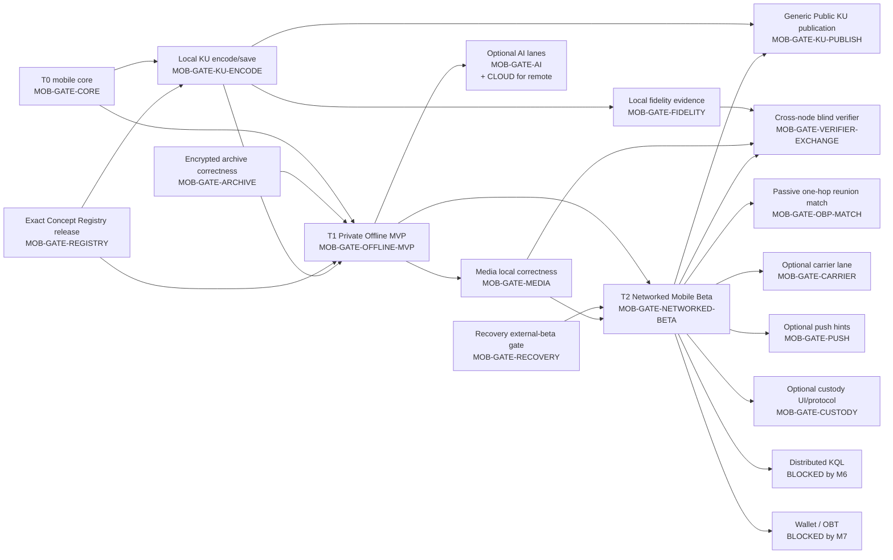

# OneBrain Mobile App Feature Tree V1

> Status: **Target product specification — not implementation evidence**
>
> Snapshot: **2026-07-29 (Asia/Saigon)**
>
> Scope: iOS and Android autonomous OneBrain nodes.
>
> Feature details:
> [`MOBILE_APP_FEATURE_DETAILS_V1.md`](./MOBILE_APP_FEATURE_DETAILS_V1.md)
>
> Screen and navigation map:
> [`MOBILE_APP_SITEMAP_V1.md`](./MOBILE_APP_SITEMAP_V1.md)

## 0. Authority and interpretation

This document translates the approved mobile architecture into stable product
feature IDs. It does not claim that a feature is implemented.

Source precedence:

1. [`WIP_DISTRIBUTED_RUNTIME_IMPLEMENTATION_PLAN_V2.md`](../../research/WIP_DISTRIBUTED_RUNTIME_IMPLEMENTATION_PLAN_V2.md)
2. [`WIP_MOBILE_APP_TECHNICAL_ARCHITECTURE_V1.md`](../../research/WIP_MOBILE_APP_TECHNICAL_ARCHITECTURE_V1.md)
3. [`WIP_MOBILE_APP_IMPLEMENTATION_PLAN_V1.md`](../../research/WIP_MOBILE_APP_IMPLEMENTATION_PLAN_V1.md)
4. this feature tree, its detail catalog, and the mobile sitemap
5. older cross-platform feature documents as discovery input only

The existing `F-A*`, `F-S*`, `F-D*`, and similar IDs are legacy/cross-platform
planning IDs. New mobile implementation, tests, analytics, routes, and design
artifacts use only the `MOB-*` IDs in this specification.

Normative language follows
[`NORMATIVE_VOCABULARY_V1.md`](../../specs/vnext/NORMATIVE_VOCABULARY_V1.md).
Terms such as `complete`, `verified`, `available`, `published`, `adopted`, and
`expired` require their named scope, validator, frontier, or policy.

## 1. Product boundary

OneBrain Mobile is an autonomous node with an intermittent process:

- it owns its NodeID, typed signing domains, vault, local knowledge, journals,
  Concept Registry release, media, and network state;
- it works in airplane mode without an LLM;
- device/system AI, app-managed local AI, and remote AI are replaceable LLM
  providers;
- LLM output is candidate data; deterministic Rust code owns tool execution and
  every durable authority transition;
- local save is private by default and never implies publication;
- Android/iOS execution grants are finite opportunities, not an always-live
  process promise;
- a stored media replica is not automatically an available or custody replica.

## 2. ID, delivery, and gate conventions

### 2.1 Stable IDs

```text
Feature: MOB-<MODULE>-<NNN>
Screen:  MOB-SCR-<AREA>-<NNN>
Journey: MOB-JRN-<NNN>
Gate:    MOB-GATE-<NAME>
```

Feature IDs are never renumbered. A removed feature remains reserved and is
marked retired.

### 2.2 Delivery lanes

| Lane | Meaning |
|---|---|
| `T0 Foundation` | Required technical/product foundation; may have no direct screen |
| `T1 Private Offline MVP` | Works with network and all LLM providers disabled |
| `T2 Networked Mobile Beta` | Enabled only after its distributed/mobile release gates |
| `T3 Later` | Valid direction, but not committed to the first two releases |
| `BLOCKED` | Must not ship before the named upstream authority gate |

`Optional` means the product remains usable without that device capability or
provider. It does not weaken safety or offline acceptance.

`BLOCKED → T2` or `BLOCKED → T3` records the intended lane after a currently
missing authority/profile gate closes. It is not permission to expose a
placeholder consumer action before that gate.

The lane names describe the capability environment, while named gates define
release ordering. A `T1` feature is offline-capable but is not automatically a
prerequisite of the exact `MOB-GATE-OFFLINE-MVP` journey. In particular,
encrypted archive correctness closes before Offline MVP; typed identity
recovery may close later but must close before Networked Beta.

For compact tree annotations, `CORE`, `AI`, `NETWORKED-BETA`, and similar names
mean the exact `MOB-GATE-<NAME>` ID below. Multiple names separated by `/` are
all required unless the annotation explicitly says “by route”.

### 2.3 Named gates

| Gate | Required evidence |
|---|---|
| `MOB-GATE-CORE` | Flutter/native/Rust bridge, one writer, lifecycle kill recovery, physical iOS/Android launch |
| `MOB-GATE-ARCHIVE` | new vault-encrypted/versioned backup and staged data-restore path, wrong-key/corrupt/kill tests, with no legacy plaintext export |
| `MOB-GATE-RECOVERY` | typed identity recovery/migration, wrong-key and duplicate-identity drills |
| `MOB-GATE-REGISTRY` | exact signed release, capacity preflight, mmap query, A/B activation and rollback |
| `MOB-GATE-OFFLINE-MVP` | capture/save/search/local KQL/backup journey passes in airplane mode with every LLM/network lane disabled |
| `MOB-GATE-KU-ENCODE` | exact `LOCAL_ONLY` source intake, resolved CCIDs/source spans, deterministic canonical encode/validation, verified private storage, idempotency and kill recovery; no network or LLM required |
| `MOB-GATE-FIDELITY` | protocol `FID-001/002/003` publisher-attempt, external-blind commit/reveal and categorical evidence contracts, alternate preservation and frontier-relative reducer; no cross-node source exchange |
| `MOB-GATE-AI` | exact model/system/route qualification, applicable license, task × input-language × output-locale and structured-output evaluation; app-managed local routes also require device/resource evidence |
| `MOB-GATE-SPEECH` | local/system speech-recognition contract, permission/privacy boundary, model/OS qualification, language quality and resource/energy budget |
| `MOB-GATE-CLOUD` | explicit disclosure, immutable remote route release, cost/retention/region policy |
| `MOB-GATE-MEDIA` | manifest/piece protocol, encryption, import/GC crash matrix and playback safety |
| `MOB-GATE-P5` | distributed-runtime P5 production gates closed |
| `MOB-GATE-PEER` | peer enrollment, authorization, revocation, replay and route-change protocol |
| `MOB-GATE-STORE` | App Store/Play background-mode and foreground-service policy review |
| `MOB-GATE-NETWORKED-BETA` | composite gate: `CORE`, `RECOVERY`, `REGISTRY`, `OFFLINE-MVP`, `P5`, `PEER`, `STORE`, privacy wire capture and mobile multi-device canary all pass |
| `MOB-GATE-KU-PUBLISH` | new generic Public Knowledge publication ADR/profile: reviewed public representation, exact KU `AuthorshipEvidence` predicate/event binding, Feed/Actor authority, namespace/disclosure, prepare/confirm, durable outbox, rollback and no reuse of Public UseEvidence consent |
| `MOB-GATE-VERIFIER-EXCHANGE` | new cross-node fidelity profile plus completed `RUN-003` or a narrower verifier-only remote-task substrate: signed Offer/Permit/task, exact source-access grant, encrypted bounded source transfer, sandbox/budgets, blind transcript, signed attestation return, replay/revocation/retention and mobile security/canary/store-policy evidence |
| `MOB-GATE-OBP-MATCH` | M3 passive reunion evidence: authenticated OBP-RP receipt, validated Public Affordance/Receptor admission, private local delta join, restart dedupe, scoped coverage and proposal-only output |
| `MOB-GATE-CARRIER` | architecture ADR 5 is closed with exact carrier discovery, trust, deployment, mailbox and privacy evidence |
| `MOB-GATE-PUSH` | architecture ADR 9 is closed for push-broker retention/cost, opaque payloads, token lifecycle and omitted/throttled delivery |
| `MOB-GATE-CUSTODY` | architecture ADR 10 is closed with signed custody obligations, thresholds, renewal/expiry and GC invariants |
| `MOB-GATE-M6` | distributed KQL/discovery authority explicitly opened by M6 |
| `MOB-GATE-M7` | production wallet/reward/OBT authority explicitly opened by M7 |

## 3. Delivery dependency map



The arrows describe product dependencies, not automatic feature enablement.
Every network and provider lane remains independently default-off,
kill-switchable, and rollbackable.

## 4. Feature tree

### 4.0 Mobile node foundation — `MOB-FND`

```text
MOB-FND-001  Rust core activation and execution-grant arbitration   [T0, CORE]
MOB-FND-002  Durable dataset/bootstrap state and kill recovery      [T0, CORE]
MOB-FND-003  Typed Flutter/native/Rust commands, queries and streams [T0, CORE]
MOB-FND-004  Resource admission and mobile lifecycle policy          [T0, CORE]
MOB-FND-005  Independent lane flags, kill switches and rollback      [T0]
```

The logical node survives without a process. Flutter is not required for an OS
background callback, and no socket/model/task is an authoritative state owner.

### 4.1 Onboarding and capability qualification — `MOB-ONB`

```text
MOB-ONB-001  Welcome and effective UI locale                       [T1]
MOB-ONB-002  Device, storage and runtime capability preflight      [T1, CORE]
MOB-ONB-003  Create this installation's autonomous mobile node     [T1, CORE]
MOB-ONB-004  Provision one exact Concept Registry release          [T1, REGISTRY]
MOB-ONB-005  Readiness summary and optional-feature education      [T1]
```

Onboarding must lead to a useful private/offline node. Notification, cloud AI,
local model, LAN, camera, microphone, and network participation permissions are
requested later in context, not as a blanket first-run wall.

### 4.2 Identity, lock, recovery, and privacy — `MOB-SEC`

```text
MOB-SEC-001  App lock, unlock and protected-data state              [T1]
MOB-SEC-002  Node/feed/Actor signer-domain status                   [T1]
MOB-SEC-003  Recovery package creation and verification             [T1, RECOVERY]
MOB-SEC-004  Typed identity recovery/retirement without cloning     [T1, RECOVERY]
MOB-SEC-005  Privacy classes and disclosure defaults                [T1]
MOB-SEC-006  Security, authority and sensitive-operation history    [T1]
MOB-SEC-007  Release-gated local erase/reset with recovery warning  [T3]
```

Node transport, Feed-event authorship, Actor root, and media representation keys are
separate authority domains. A biometric is a local key-use gate, not OneBrain
identity or remote login.

### 4.3 Home and node overview — `MOB-HOM`

```text
MOB-HOM-001  Honest node/runtime/LLM/network/sync status snapshot   [T1]
MOB-HOM-002  Quick capture actions                                 [T1]
MOB-HOM-003  Recent local items and resumable drafts               [T1]
MOB-HOM-004  Durable activity and approval inbox summary           [T1]
MOB-HOM-005  Storage, update and recovery attention cards            [T1]
MOB-HOM-006  Network and seed attention cards                        [T2, NETWORKED-BETA]
```

Home never collapses all state into one “Online” indicator.

### 4.4 Capture and ingestion — `MOB-CAP`

```text
MOB-CAP-001  Text and clipboard quick capture                       [T1]
MOB-CAP-002  iOS share extension / Android share-intent ingestion  [T1]
MOB-CAP-003  Photo, video, document and audio picker ingestion       [T1]
MOB-CAP-004  Camera capture and OCR                                 [T1 Optional]
MOB-CAP-005  Voice/audio capture and local/system transcription     [T1 Optional, SPEECH]
MOB-CAP-006  Encrypted PrivateLocal source and original preservation [T1, MEDIA]
MOB-CAP-007  Rule/AI candidate review, edit, draft-save and resume   [T1]
```

Every source enters `PrivateLocal`. OCR, transcription, metadata stripping,
transcoding, and AI extraction create derived candidates; they do not overwrite
the owned original or publish it.

### 4.5 Self-encoding, private save, and KU publication — `MOB-ENC`

```text
MOB-ENC-001  Create encoding draft from one exact local source       [T1, REGISTRY/KU-ENCODE; AI plus CLOUD only for chosen LLM route]
MOB-ENC-002  Deterministic KU/Receptor encode and validation         [T1, KU-ENCODE]
MOB-ENC-003  Explicit immutable private KU save                      [T1, KU-ENCODE]
MOB-ENC-004  Local revisions and alternate encodings                 [T1, KU-ENCODE]
MOB-ENC-005  Prepare generic Public KU publication                   [BLOCKED → T2, NETWORKED-BETA/KU-PUBLISH]
MOB-ENC-006  Confirm/sign Public KU and inspect outbox                [BLOCKED → T2, NETWORKED-BETA/KU-PUBLISH]
```

Local save, generic KU publication, Public UseEvidence, Mapping
materialization, and Mapping adoption are five different authority
transitions. `MOB-ENC-005/006` remain unavailable until a generic KU
publication profile exists; the frozen Public UseEvidence receipt cannot be
reused.

### 4.6 Encoding-fidelity evidence and external blind verification — `MOB-FID`

```text
MOB-FID-001  Publisher encoding-attempt record                       [T1, FIDELITY]
MOB-FID-002  Prepare blind verifier task and exact source grant      [BLOCKED → T3, NETWORKED-BETA/VERIFIER-EXCHANGE]
MOB-FID-003  Verifier task inbox and accept/reject                   [BLOCKED → T3, NETWORKED-BETA/VERIFIER-EXCHANGE]
MOB-FID-004  Download authorized exact raw source                    [BLOCKED → T3, NETWORKED-BETA/VERIFIER-EXCHANGE]
MOB-FID-005  Blind encode and durable output commitment              [BLOCKED → T3, NETWORKED-BETA/VERIFIER-EXCHANGE; AI for model-backed route]
MOB-FID-006  Reveal, exact fidelity checks and signed attestation    [BLOCKED → T3, NETWORKED-BETA/VERIFIER-EXCHANGE]
MOB-FID-007  Fidelity portfolio and frontier-relative assessment     [T1, FIDELITY]
MOB-FID-008  Immutable alternate-encoding preservation               [T1, FIDELITY]
MOB-FID-009  Source-grant revoke/expiry and verifier cleanup         [BLOCKED → T3, NETWORKED-BETA/VERIFIER-EXCHANGE]
```

The current FID profiles are local coordinator contracts. They do not define
cross-node raw-source exchange. A verifier feature therefore remains blocked
until `MOB-GATE-VERIFIER-EXCHANGE` closes. Default `FidelityPolicy/1` requires
a publisher attempt plus at least two external blind attempts in at least two
evidenced-distinct policy group keys derived jointly over administrative
principal and pipeline/model lineage; different NodeIDs alone do not create
groups.

Fidelity is representation-to-source evidence, never a truth vote, winner
consensus, reward, or deletion rule. Legacy `RAW/SELF/PART/FULL` statuses are
not mobile product states. Commit-before-reveal proves ordering and binding
inside the named transcript; it does not prove that an external environment
could not have learned an already published target elsewhere.

### 4.7 Library, search, and local KQL — `MOB-LIB`

```text
MOB-LIB-001  Paginated local library browse                         [T1]
MOB-LIB-002  Local keyword, label and Concept Registry search       [T1]
MOB-LIB-003  Local KQL editor, run and bounded results              [T1]
MOB-LIB-004  Local scope, filter, sort and language controls        [T1]
MOB-LIB-005  Provenance, coverage and limitation display            [T1]
MOB-LIB-006  Small 2D local neighborhood view                       [T1 Optional]
MOB-LIB-007  Capability-gated local semantic rerank/search          [T1 Optional, AI]
MOB-LIB-008  My/local-created KU scope                               [T1]
MOB-LIB-009  Received validated KU scope/inbox                       [T2, NETWORKED-BETA]
MOB-LIB-010  Received KU detail and local retention actions          [T2, NETWORKED-BETA]
```

A zero-result view says that no match was found in the named local scope and
frontier. It never claims network-wide absence.

`My` and `Received` are origin facets, not exclusive truth classes. The same
CID may be authored by the local Feed and observed through multiple peers.
Authorship, acquisition path, retention class, and semantic state remain
independent. A generic Feed event proves event authorship, not authorship of
every referenced KU. Until a frozen `AuthorshipEvidence` predicate defines the
required event type, exact object binding and Feed/Actor authority under
`MOB-GATE-KU-PUBLISH`, KU author remains unresolved and local origin is shown
separately.

### 4.8 Knowledge detail and explicit authority transitions — `MOB-KNO`

```text
MOB-KNO-001  Knowledge item detail and source provenance            [T1]
MOB-KNO-002  Local draft revision and validation                    [T1]
MOB-KNO-003  Tags, collections and typed relationship proposals    [T1]
MOB-KNO-004  Assembly → Receptor → Discover → Proposal → Mapping
             → Resolution workflow inspection                      [T1]
MOB-KNO-005  Local branch and revision inspection                   [T1]
MOB-KNO-006  Prepare exact Public UseEvidence intent                [T2, NETWORKED-BETA]
MOB-KNO-007  Confirm/cancel Public UseEvidence publication          [T2, NETWORKED-BETA]
MOB-KNO-008  Reconciliation-conflict inspection and resolution      [T2, NETWORKED-BETA]
```

Retrieval, ranking, model output, validation, materialization, publication, and
adoption are different states. No background job, deep link, notification, or
LLM suggestion confirms Public UseEvidence.

### 4.9 Assistant, LLM providers, and deterministic tools — `MOB-AI`

```text
MOB-AI-001   No-LLM deterministic assistant baseline               [T1]
MOB-AI-002   Assistant threads and bounded local context            [T1 Optional]
MOB-AI-003   Provider mode, identity and availability display       [T1]
MOB-AI-004   Context selection and disclosure preview               [T1]
MOB-AI-005   Device/system-model inference                          [T1 Optional, AI]
MOB-AI-006   App-managed local-model inference                      [T1 Optional, AI]
MOB-AI-007   Explicit remote/cloud inference                        [T1 Optional, AI/CLOUD]
MOB-AI-008   Structured candidate and tool proposal/approval/receipt [T1]
```

Provider-native tools are proposal codecs only. If a provider SDK cannot route
the entire proposal through Rust policy and consent before execution, that tool
is not registered.

### 4.10 Media ownership, viewing, and transfer — `MOB-MED`

```text
MOB-MED-001  Attach and protect OwnedOriginal media                 [T1, MEDIA]
MOB-MED-002  Verified image/document/audio/video viewer             [T1, MEDIA]
MOB-MED-003  Media catalog and storage-class display                [T1, MEDIA]
MOB-MED-004  Private share representation, redaction and grants     [T2, NETWORKED-BETA/MEDIA]
MOB-MED-005  Piece/range fetch, verification and resume             [T2, NETWORKED-BETA/MEDIA]
MOB-MED-006  Provider observations and scoped availability display  [T2, NETWORKED-BETA; CUSTODY for custody views]
MOB-MED-007  Pin/unpin owned media and reclaim local derived cache   [T1, MEDIA]
MOB-MED-008  Pin/unpin remote media and reclaim SeedCache            [T2, NETWORKED-BETA/MEDIA]
MOB-MED-009  Received media reference and availability detail        [T2, NETWORKED-BETA/MEDIA]
MOB-MED-010  User-initiated received-media download/stream/view      [T2, NETWORKED-BETA/MEDIA]
```

The UI always distinguishes `OwnedOriginal`, `PinnedRemote`, and `SeedCache`.
It exposes a `CustodyReplica` label or controls only after `MOB-GATE-CUSTODY`;
before then, unknown safety holds remain non-evictable but are not presented as
a custody capability. It never offers automatic deletion of an owned original.

### 4.11 Network, reconciliation, availability, and seeding — `MOB-NET`

```text
MOB-NET-001  Scoped reachability and network-state overview         [T2, NETWORKED-BETA]
MOB-NET-002  Authenticated peer enrollment                          [T2, NETWORKED-BETA]
MOB-NET-003  Peer detail, capability scope and revocation           [T2, NETWORKED-BETA]
MOB-NET-004  Outbound-first incremental reconciliation             [T2, NETWORKED-BETA]
MOB-NET-005  Selector/frontier sync status, history and conflicts   [T2, NETWORKED-BETA]
MOB-NET-006  Bounded network-fetch/discovery proposal               [BLOCKED, NETWORKED-BETA/M6]
MOB-NET-007  Foreground direct peer session                         [T2, NETWORKED-BETA]
MOB-NET-008  Off/Smart/Manual/Aggressive bounded seed modes         [T2, NETWORKED-BETA/MEDIA]
MOB-NET-009  Carrier/SeedInbox status and ciphertext transfer       [T2 Optional, NETWORKED-BETA/MEDIA/CARRIER]
MOB-NET-010  Permission-gated foreground LAN discovery              [T2 Optional, NETWORKED-BETA]
```

`Aggressive` is an Android-only finite, user-visible session where current
platform policy permits. iOS has no generic always-on P2P serving mode.

### 4.12 Passive OBP reunion matching — `MOB-MAT`

```text
MOB-MAT-001  Private KU/StandingNeed matching-target lifecycle       [T2, NETWORKED-BETA/OBP-MATCH]
MOB-MAT-002  Passive local match after validated OBP receipt         [T2, NETWORKED-BETA/OBP-MATCH]
MOB-MAT-003  Exact match explanation and scoped coverage             [T2, NETWORKED-BETA/OBP-MATCH]
MOB-MAT-004  Quarantined proposal review, retain and dismiss         [T2, NETWORKED-BETA/OBP-MATCH]
```

“OBP match” is product shorthand. OBP-RP reconciles validated public records;
the exact typed match runs locally against the private target and emits a
private, non-executable `BindingProposal`. No raw KQL, NeedIR, StandingNeedID,
Receptor/Assembly identity, or private goal context is sent.

This passive M3 reunion path is separate from `MOB-NET-006`. Active
Need-derived network fetch/discovery, RouteNeedSketch, provider search, or
remote watch remains blocked by M6.

### 4.13 Notifications and durable activity — `MOB-NTF`

```text
MOB-NTF-001  Durable in-app activity and approvals inbox            [T1]
MOB-NTF-002  Local job, reminder and security notification intents  [T1]
MOB-NTF-003  Permission, preview, quiet-hour and channel preferences [T1]
MOB-NTF-004  Validated reversible notification actions              [T1]
MOB-NTF-005  Optional opaque APNs/FCM wake-hint route                [T2 Optional, NETWORKED-BETA/PUSH]
```

Submission to an OS notification API is not proof of delivery. Push wake hints
contain no product content and are never the only record of pending work.

### 4.14 Concept Registry, storage, and portability — `MOB-DAT`

```text
MOB-DAT-001  Exact Concept Registry release/status inspection       [T1, REGISTRY]
MOB-DAT-002  Provision/update download, verify and activate         [T1, REGISTRY]
MOB-DAT-003  Registry rollback, corrupt-release repair and readers  [T1, REGISTRY]
MOB-DAT-004  Storage breakdown, quota and exact capacity preflight  [T1]
MOB-DAT-005  Eligible cache/model/release cleanup                   [T1]
MOB-DAT-006  Encrypted backup creation and archive inspection       [T1, ARCHIVE]
MOB-DAT-007  Staged data restore/import; gated identity recovery    [T1, ARCHIVE; RECOVERY for identity recovery]
MOB-DAT-008  User-controlled reviewed encrypted export              [T1, ARCHIVE]
MOB-DAT-009  Encrypted device-to-device migration                    [T3]
```

The initial query-ready registry boundary is the exact signed release
containing `concepts.obr`, CCID index, label index, and its release/verification
metadata. Transport splitting does not create a reduced semantic tier.

### 4.15 Model management — `MOB-MOD`

```text
MOB-MOD-001  Device AI/runtime capability scan                      [T1]
MOB-MOD-002  Signed local/system/remote route profile catalog       [T1]
MOB-MOD-003  Local model download, verify and smoke test            [T1 Optional, AI]
MOB-MOD-004  Activate provider route and show qualification         [T1 Optional, AI; plus CLOUD for remote]
MOB-MOD-005  Roll back/delete app-managed model releases            [T1 Optional, AI]
MOB-MOD-006  Task-language quality/resource evidence display        [T1 Optional, AI]
```

A model name or marketing language list is not sufficient qualification.
Routing uses an exact local model release ID, system qualification ID, or
remote route release ID.

### 4.16 Settings, diagnostics, language, and accessibility — `MOB-SYS`

```text
MOB-SYS-001  UI/content/query/LLM language settings                 [T1]
MOB-SYS-002  Accessibility, text scale, motion and contrast         [T1]
MOB-SYS-003  Permissions and native capability status               [T1]
MOB-SYS-004  Local runtime jobs and background energy policy         [T1]
MOB-SYS-005  Privacy-safe diagnostics and explicit export           [T1]
MOB-SYS-006  Independent feature flags, kill switches and safe mode [T0]
MOB-SYS-007  About, licenses, release IDs and support information    [T1]
MOB-SYS-008  Network transfer/reconciliation/seeding policy          [T2, NETWORKED-BETA]
```

English and Vietnamese are the first complete UI locales. UI locale, content
language, query fallback, Concept label locale, notification locale, and LLM
output locale remain independent.

## 5. Explicitly absent or blocked surfaces

The following are not hidden backlog features in T1/T2:

| Surface | State | Reason |
|---|---|---|
| Wallet, balance, staking, rewards, OBT history | `BLOCKED` | `MOB-GATE-M7`; no simulated economic UI |
| Active distributed KQL or network-wide search | `BLOCKED` | `MOB-GATE-M6`; private NeedIR cannot leave the node |
| Generic Public KU prepare/confirm | `BLOCKED → T2` | `MOB-GATE-KU-PUBLISH`; Public UseEvidence is not a substitute |
| Cross-node raw-source blind verifier exchange | `BLOCKED → T3` | `MOB-GATE-VERIFIER-EXCHANGE`; current FID workflow is local only |
| Global feed, trending, global result/provider count | Not in scope | no scoped completeness/authority semantics |
| Automatic/background Public UseEvidence | Forbidden | exact prepare/confirm and fresh authority required |
| Automatic model tool execution | Forbidden | Rust `ToolOrchestrator` is the only execution boundary |
| Always-on iOS node or immortal Android service | Impossible promise | OS-governed finite execution grants |
| Desktop pairing as a prerequisite | Forbidden architecture | mobile is an independent node |
| Silent local-to-cloud AI fallback | Forbidden | disclosure/provider consent is explicit |
| Treating availability as custody | Forbidden semantics | store, availability observation and custody are distinct |
| Unscoped/ordinary raw private source sharing | Forbidden | create a reviewed share representation or use the separately gated exact verifier permit; raw source is never ordinary OBP inventory |

## 6. Module summary

| Module | Feature count | Primary surface | Earliest lane |
|---|---:|---|---|
| `MOB-FND` | 5 | Internal / status | T0 |
| `MOB-ONB` | 5 | Onboarding | T1 |
| `MOB-SEC` | 7 | Onboarding / Settings | T1 |
| `MOB-HOM` | 6 | Home | T1 |
| `MOB-CAP` | 7 | Capture | T1 |
| `MOB-ENC` | 6 | Capture / KU detail | T1 |
| `MOB-FID` | 9 | Activity / KU detail | T1 |
| `MOB-LIB` | 10 | Library | T1 |
| `MOB-KNO` | 8 | Library / Detail | T1 |
| `MOB-AI` | 8 | Assistant | T1 optional |
| `MOB-MED` | 10 | Detail / Media | T1 |
| `MOB-NET` | 10 | Home / Settings | T2 |
| `MOB-MAT` | 4 | Library / Matches | T2 |
| `MOB-NTF` | 5 | Activity / Settings | T1 |
| `MOB-DAT` | 9 | Settings | T1 |
| `MOB-MOD` | 6 | Assistant / Settings | T1 optional |
| `MOB-SYS` | 8 | Settings | T1 |
| **Total** | **123** | five primary destinations | |

## 7. Cross-cutting acceptance

Every implemented feature must demonstrate:

- process-death-safe idempotency for durable commands;
- an airplane-mode behavior and an explicit network requirement where needed;
- an LLM-disabled deterministic behavior;
- privacy class, authority owner, and disclosure boundary;
- locked/protected-data-unavailable behavior;
- loading, empty, error, degraded, interrupted, and resume states;
- English/Vietnamese strings, long text, text scaling and screen-reader labels;
- bounded input, output, time, memory, storage and network work;
- no claim of network-wide truth, completeness, delivery or availability;
- feature ID to screen, command/query DTO, durable state and test traceability.
