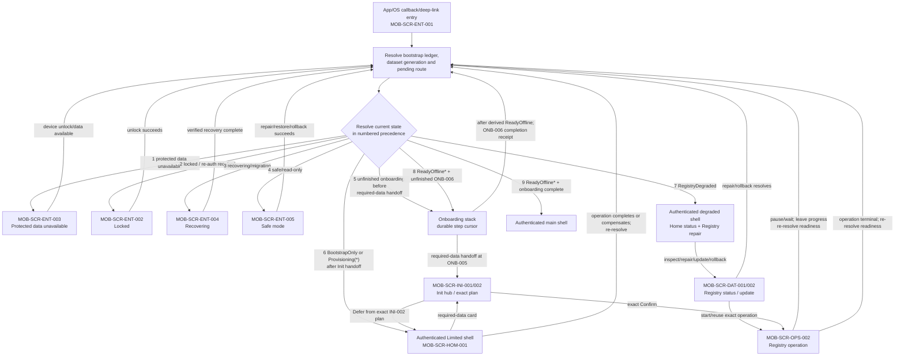

# OneBrain Mobile App Sitemap V1

> Status: **Target information architecture — not implementation evidence**
>
> Snapshot: **2026-08-02 (Asia/Saigon)**
>
> Feature tree:
> [`MOBILE_APP_FEATURE_TREE_V1.md`](./MOBILE_APP_FEATURE_TREE_V1.md)
>
> Feature contracts:
> [`MOBILE_APP_FEATURE_DETAILS_V1.md`](./MOBILE_APP_FEATURE_DETAILS_V1.md)
>
> Visual system and screen composition:
> [`MOBILE_DESIGN_SYSTEM_V1.md`](../../design/mobile/MOBILE_DESIGN_SYSTEM_V1.md)
> and [`MOBILE_SCREEN_PATTERNS_V1.md`](../../design/mobile/MOBILE_SCREEN_PATTERNS_V1.md)

## 0. Scope and authority

This sitemap defines mobile navigation, screen IDs, route safety and feature
mapping for the autonomous iOS/Android node. The mobile architecture and
distributed-runtime plan remain authoritative for data, privacy, signing,
network and rollout semantics.

Logical paths in this document are design/test names, not a promise that Flutter
must use string URLs internally. External links use only the safe route resolver
defined in §8.

## 1. Information architecture principles

1. The primary navigation is stable: **Home, Library, Capture, Assistant,
   Settings**.
2. Capture is a first-class task stack, not a passive page.
3. Network, sync, seeding, media, models, activity, storage, and diagnostics are
   contextual hubs or Settings branches, not extra bottom tabs.
4. Node data, runtime grant, LLM provider, network presence, reconciliation and
   seeding are separate states.
5. Local/private and network/public actions are visibly separate.
6. A screen may request a typed command; it never writes a database, signs
   arbitrary bytes, executes a model tool, or bypasses Rust policy.
7. Every private route is re-resolved after unlock/process restart. A stale UI
   route is not authority.
8. Optional AI/network failure degrades only that feature; it does not replace
   the whole app with an error screen.
9. There is no Wallet/OBT, global feed, trending, active distributed KQL, or
   always-on-node route before its upstream authority exists.
10. **My** and **Received** are origin/acquisition views over the same immutable
    KU and media identities. They are not competing truth classes, and a
    sender peer is not presented as the author.
11. A logical path marked **design-reserved** is documentation for a future
    gated flow. It must not be registered, deep-linked, notified, or exposed in
    consumer navigation before the named gate closes.
12. The production app package contains no large Concept Registry artifacts.
    First-launch Init is a canonical, resumable product flow; it is not P2P
    enrollment or Networked Beta.

## 2. Adaptive navigation model

### 2.1 Phone

```text
Bottom navigation
  Home
  Library
  Capture        primary central action/destination
  Assistant
  Settings
```

- Each destination retains its own back stack.
- Capture may open from its tab, Home quick action, widget, share intent, or
  system shortcut; all paths converge on the same capture stack.
- Node status and durable Inbox are reachable from the Home app bar and from
  relevant status cards.
- A deep link into knowledge/media uses the canonical Library detail route,
  never a duplicate modal implementation.

### 2.2 Tablet

- Use `NavigationRail` with the same five destinations and feature IDs.
- Library, Assistant, Operations, Settings and peer/media catalogs may use a
  two-pane master/detail layout.
- A two-pane layout changes presentation only; the selected entity, privacy
  gate and typed command contract remain identical to phone.

### 2.3 Back and restoration

- Android Back/iOS navigation pops within the current destination before
  leaving it.
- Switching tabs preserves only bounded, non-secret presentation state.
- After process death, the app restores a logical destination and opaque local
  reference, reopens current node state, revalidates capability/unlock, and then
  requeries data.
- Drafts, operations, approvals and transfers resume from durable receipts, not
  from a serialized Flutter widget tree.

## 3. Entry and global-state routing



The route resolver never renders a private title, filename, prompt, peer
message or notification argument before the required unlock and local lookup.
If the pending route requires Concept data while no release is active, it is
retained opaquely through the lock/onboarding gates and redirected to Init only
after authentication. It is re-resolved from current state only after operation
`Completed` and readiness independently derives `ReadyOffline`; missing data
never falls through to a partially functional Concept route. During a later
Registry update, the current/previous release keeps the main shell
`ReadyOffline` only while it remains eligible, healthy, compatible and
non-revoked. If accepted revocation or another eligibility loss removes that
guarantee, even a waiting update re-resolves the ordered readiness function and
may route to Limited/`RegistryDegraded`.
The resolver branches on the ordered derived-readiness function, never a list
of operation phases: every first-Init substate from head resolution through
`HealthPending`, including Defer/waits and compensated terminal failure, lands
in the same honest Limited boundary after the Init handoff.
`RegistryDegraded` is a distinct authenticated degraded shell, not SafeMode or
an unhandled fallthrough: it keeps only the state-table capabilities below,
surfaces Registry status/repair, and re-resolves after every update, rollback
or repair transition.

## 4. Top-level sitemap

```mermaid
flowchart TB
    Shell["Main shell"]

    Shell --> Home["Home<br/>MOB-HOM"]
    Shell --> Library["Library<br/>MOB-LIB / KNO / MED / FID / MAT"]
    Shell --> Capture["Capture<br/>MOB-CAP / ENC"]
    Shell --> Assistant["Assistant<br/>MOB-AI / MOD"]
    Shell --> Settings["Settings<br/>MOB-SEC / DAT / MOD / NET / NTF / SYS"]

    Home --> NodeStatus["Node status"]
    Home --> InitHub["Required Init data<br/>MOB-SCR-INI-001"]
    Home --> Operations["Operations center"]
    Home --> Inbox["Durable inbox"]
    Home --> Recent["Recent and drafts"]

    Library --> Knowledge["Knowledge"]
    Knowledge --> MyKU["My / local-created KU"]
    Knowledge --> ReceivedKU["Received KU"]
    MyKU --> KUDetail["Canonical KU detail<br/>MOB-SCR-KNO-001"]
    ReceivedKU --> KUDetail
    KUDetail --> Encoding["Encoding and private Save evidence"]
    KUDetail --> Fidelity["Fidelity portfolio"]
    Fidelity --> VerifyRequests["Verifier requests<br/>design-reserved"]
    KUDetail -->|"eligible local KU only"| Publish["Generic KU publication<br/>design-reserved"]
    Knowledge --> Needs["Private matching targets"]
    Knowledge --> Matches["Quarantined matches"]
    Library --> Concepts["Concept Registry"]
    Library --> Media["Media"]
    Media --> MyMedia["My media"]
    Media --> ReceivedMedia["Received media"]
    MyMedia --> MediaDetail["Canonical media detail"]
    ReceivedMedia --> MediaDetail
    Library --> Search["Local search"]
    Library --> KQL["Local KQL"]
    Library --> Graph["Local neighborhood"]
    Capture --> Source["Source chooser"]
    Capture --> Composer["Composer/import"]
    Capture --> Review["Candidate review"]
    Capture --> Encode["Encode and validate KU"]
    Capture --> Save["Explicit private save"]

    Assistant --> Threads["Threads"]
    Assistant --> Conversation["Conversation"]
    Assistant --> Context["Context/disclosure"]
    Assistant --> Tool["Candidate/tool review"]

    Settings --> Identity["Identity and security"]
    Settings --> Data["Registry, storage, backup"]
    Settings --> Models["AI providers and models"]
    Settings --> Network["Network, peers, sync, seeding<br/>T2 gated"]
    Settings --> Notifications["Notifications"]
    Settings --> Language["Language and accessibility"]
    Settings --> Diagnostics["Diagnostics and advanced node"]
```



## 5. Screen registry

### 5.1 Entry, lock, recovery, and onboarding

| Screen ID | Logical path | Responsibility | Feature mapping |
|---|---|---|---|
| `MOB-SCR-ENT-001` | `/entry` | Bootstrap/route resolver; no product content | `MOB-FND-001..003` |
| `MOB-SCR-ENT-002` | `/locked` | App unlock, credential/biometric result, queued-route summary without private text | `MOB-SEC-001` |
| `MOB-SCR-ENT-003` | `/protected-data` | Explain device unlock/protected-data requirement; no retry loop against vault | `MOB-SEC-001`, `MOB-FND-004` |
| `MOB-SCR-ENT-004` | `/recovering` | Operation/generation recovery progress and typed failure, including interrupted Registry activation | `MOB-FND-002`, `MOB-HOM-005`, `MOB-DAT-002/003` |
| `MOB-SCR-ENT-005` | `/safe-mode` | Read-only browse where safe, verified export/restore/rollback and diagnostics | `MOB-FND-002/005`, `MOB-DAT-003/006/007`, `MOB-SYS-005/006` |
| `MOB-SCR-ENT-006` | `/unavailable` | Stale route, disabled lane, unsupported capability or expired intent with safe fallback | `MOB-FND-005`, `MOB-SYS-006`, `MOB-NTF-004` |
| `MOB-SCR-ONB-001` | `/onboarding/welcome` | Welcome, English/Vietnamese locale, autonomous-node explanation | `MOB-ONB-001` |
| `MOB-SCR-ONB-002` | `/onboarding/preflight` | Device/runtime/storage and estimated Init peak plus optional capability report; final signed-manifest admission occurs in Init plan | `MOB-ONB-002`, `MOB-MOD-001` |
| `MOB-SCR-ONB-003` | `/onboarding/identity` | Create a new node or import encrypted data with the current identity; typed identity recovery appears only after `RECOVERY` | `MOB-ONB-003`, `MOB-SEC-002/004`, `MOB-DAT-007` |
| `MOB-SCR-ONB-004` | `/onboarding/security` | App lock; recovery method setup/verification appears only after `RECOVERY`, otherwise show a non-blocking readiness recommendation | `MOB-SEC-001/003` |
| `MOB-SCR-ONB-005` | `/onboarding/init-handoff` | Explain required post-launch data, app-package boundary and Limited mode, then enter canonical Init; Defer is offered only after explicit Begin resolves the exact signed plan | `MOB-ONB-004/005`, `MOB-DAT-001` |
| `MOB-SCR-ONB-006` | `/onboarding/readiness` | Independent readiness facts; `ReadyOffline` only after exact Init activation; optional AI/notification education; node network is non-actionable before `NETWORKED-BETA` | `MOB-ONB-005`, `MOB-HOM-001` |
| `MOB-SCR-INI-001` | `/init` | Canonical Init hub: before explicit Begin, explain the data/Limited boundary, make no Registry request, and disclose that accepting newer signed security metadata may advance anti-downgrade high-water or fence an explicitly revoked local release even though no large bytes can yet be scheduled. Afterward show the signed target, selected provider class, exact downloaded/verified/active bytes, wait/failure reason, Resume or open exact plan. Direct peer/community seed, local import and optional mirror are delivery sources, never Registry authority. Back navigation to Limited neither confirms nor cancels an operation; durable Defer is selected on `INI-002` | `MOB-ONB-004/005`, `MOB-DAT-001/002`, `MOB-HOM-001/005` |
| `MOB-SCR-INI-002` | `/init/registry/plan` | Exact artifacts, signed publisher floor, canonical ordered provider set and source-plan digest, initial/remaining local allocation/transfer/workspace/catalog/reserve terms, authoritative maximum versus current free bytes, selected source kind versus OS executor, metered/roaming/power/thermal facts and explicit Start now, wait-by-policy, scoped override or durable pre-confirm Defer. After exact Confirm, Local Import exposes three explicit role pickers for Concepts OBR, labels index and CCID index plus signed-chunk/byte progress and reselect-to-resume guidance. It never exposes a URI/path or treats a filename as authority. The UI must not imply a required central endpoint | `MOB-ONB-002/004`, `MOB-DAT-002/004`, `MOB-FND-004`, `MOB-SYS-004` |

### 5.2 Home, status, operations, and activity

| Screen ID | Logical path | Responsibility | Feature mapping |
|---|---|---|---|
| `MOB-SCR-HOM-001` | `/home` | Quick capture, recents, drafts, attention and independent state cards; Limited mode keeps a persistent required-Init card | `MOB-HOM-001..006`, `MOB-ONB-005` |
| `MOB-SCR-HOM-002` | `/home/status` | Node data, Init/registry, runtime grants, LLM, network, sync, seed and storage facts | `MOB-HOM-001`, `MOB-FND-001/004`, `MOB-DAT-001` |
| `MOB-SCR-HOM-003` | `/home/recent` | Bounded recent items, drafts and interrupted user work | `MOB-HOM-003` |
| `MOB-SCR-OPS-001` | `/operations` | InitialRegistryProvision, registry/model/import/backup/sync/seed jobs with pause reason and receipt | `MOB-HOM-004/005`, `MOB-DAT-002/006/007`, `MOB-MOD-003`, `MOB-NET-004/008` |
| `MOB-SCR-OPS-002` | `/operations/:local_operation_ref` | One authoritative operation timeline, exact bytes, selected source kind and independent executor, provider failover attempts, retry/wait class, checkpoints, signer/hash/activation receipt and safe actions | `MOB-FND-002/004`, owning feature |
| `MOB-SCR-NTF-001` | `/activity` | Authoritative durable inbox for approvals, security, jobs and reminders | `MOB-NTF-001` |
| `MOB-SCR-NTF-002` | `/activity/:opaque_intent_ref` | Resolve current intent; show detail and validated reversible actions | `MOB-NTF-001/004` |

### 5.3 Library, knowledge, Concept Registry, and media

| Screen ID | Logical path | Responsibility | Feature mapping |
|---|---|---|---|
| `MOB-SCR-LIB-001` | `/library` | Three phone-safe groups: Knowledge (My/Local, Received, gated Needs/Matches), Media (My, Received), and Concepts; search/KQL/graph remain contextual actions and every group states its current local/network boundary | `MOB-LIB-001/008/009`, `MOB-DAT-001`, `MOB-MED-003/009`, `MOB-MAT-001/004` |
| `MOB-SCR-LIB-002` | `/library/search` | Local keyword/label/CCID search, filter, scope and limitations | `MOB-LIB-002/004/005/007` |
| `MOB-SCR-LIB-003` | `/library/kql` | Local KQL editor, syntax help, history and bounded results | `MOB-LIB-003/005` |
| `MOB-SCR-LIB-004` | `/library/graph/:local_ref` | Small 2D neighborhood plus accessible list alternative | `MOB-LIB-006` |
| `MOB-SCR-LIB-005` | `/library/concepts` | Browse labels/languages from one active registry release | `MOB-LIB-002`, `MOB-DAT-001` |
| `MOB-SCR-LIB-006` | `/library/concepts/:ccid` | Concept labels, language fallback, relationships and release provenance | `MOB-LIB-002/005`, `MOB-SYS-001` |
| `MOB-SCR-LIB-007` | `/library/my-ku` | My/local-created origin shelf; “authored by me” requires future qualifying `AuthorshipEvidence`, while generic Feed references are insufficient and author otherwise remains unresolved | `MOB-LIB-008` |
| `MOB-SCR-LIB-008` | `/library/received-ku` | Accepted Received KU shelf; author requires qualifying future `AuthorshipEvidence` and otherwise remains unresolved, while source peer, selector, acquisition and retention are separate facets | `MOB-LIB-009` |
| `MOB-SCR-KNO-001` | `/library/knowledge/:local_ref` | Canonical detail for either My or Received KU: content, source, qualifying future `AuthorshipEvidence` or unresolved author separately from source-peer provenance, fidelity, branches, disclosure, retention, media and workflow; gated “match this KU” creates a private target, never a network query | `MOB-KNO-001/004/005`, `MOB-LIB-008..010`, `MOB-MED-009`, `MOB-MAT-001` |
| `MOB-SCR-KNO-002` | `/library/knowledge/:local_ref/edit` | New local draft revision and validation | `MOB-KNO-002` |
| `MOB-SCR-KNO-003` | `/library/knowledge/:local_ref/organize` | Tags, collections and relationship proposal editing | `MOB-KNO-003` |
| `MOB-SCR-KNO-004` | `/library/knowledge/:local_ref/workflow` | Six-stage read-only workflow inspection; later gated actions | `MOB-KNO-004` |
| `MOB-SCR-KNO-005` | `/library/knowledge/:local_ref/conflicts` | Local branch inspection; gated reconciliation-conflict resolution when T2 is active | `MOB-KNO-005/008` |
| `MOB-SCR-KNO-006` | `/public-use/prepare/:local_ref` | Exact Public `UseEvidence` preview and prepare step; never substitutes for generic KU publication | `MOB-KNO-006` |
| `MOB-SCR-KNO-007` | `/public-use/confirm/:opaque_intent_ref` | Re-authenticate, exact Public `UseEvidence` confirm/cancel and publication/outbox status | `MOB-KNO-007` |
| `MOB-SCR-MED-001` | `/library/media/:local_manifest_ref` | Canonical verified viewer/player for My or Received media with local availability, source class and KU/direct-share provenance | `MOB-MED-001..003/005/009/010` |
| `MOB-SCR-MED-002` | `/library/media/:local_manifest_ref/info` | Manifest/root, verified bytes and local ownership/pin/cache; gated remote provider/custody sections | `MOB-MED-003/006..008` |
| `MOB-SCR-MED-003` | `/library/media/:local_manifest_ref/share` | Redact/transcode preview, recipient policy and access grants | `MOB-MED-004` |
| `MOB-SCR-MED-004` | `/library/media/:local_manifest_ref/transfer` | Missing pieces, provider sample, progress, resume and failure evidence for explicit received-media download/stream/view | `MOB-MED-005/006/010` |
| `MOB-SCR-MED-005` | `/library/my-media` | Local media shelf separated by `OwnedOriginal`, private attachment, pinned and cache retention facts | `MOB-MED-001/003/007` |
| `MOB-SCR-MED-006` | `/library/received-media` | Received KU/direct-share media shelf with `ReferenceOnly`/partial/complete availability and explicit download/stream/view actions | `MOB-MED-002/005/008..010` |

When no Registry release is active, Concept browse, Concept-dependent search,
local KQL/graph, deterministic KU Encode and CCID validation are redirected to
the recoverable Init hub. Limited mode does not route them through generic
`/unavailable` or execute them against partial files.

### 5.4 Capture

| Screen ID | Logical path | Responsibility | Feature mapping |
|---|---|---|---|
| `MOB-SCR-CAP-001` | `/capture` | Source chooser: text, clipboard, share, photo/video/document/audio picker, camera, audio/voice | `MOB-HOM-002`, `MOB-CAP-001..005` |
| `MOB-SCR-CAP-002` | `/capture/text` | Text/clipboard composer, language and draft controls | `MOB-CAP-001/007` |
| `MOB-SCR-CAP-003` | `/capture/spools/:spool_ref` | Inspect encrypted share spool before import | `MOB-CAP-002/006` |
| `MOB-SCR-CAP-004` | `/capture/import` | Picker/import selection, exact type/size and staging progress | `MOB-CAP-003/006`, `MOB-MED-001` |
| `MOB-SCR-CAP-005` | `/capture/camera` | Camera capture, permission and optional OCR review | `MOB-CAP-004/006` |
| `MOB-SCR-CAP-006` | `/capture/audio` | Voice/audio recording, permission and optional transcription | `MOB-CAP-005/006` |
| `MOB-SCR-CAP-007` | `/capture/operations/:operation_ref/review` | Exact source, candidate, provenance and unknowns; edit, save only the source/draft, or enter deterministic KU Encode | `MOB-CAP-007`, `MOB-ENC-001/002`, `MOB-KNO-002/003` |
| `MOB-SCR-CAP-008` | `/capture/operations/:operation_ref/result` | Ephemeral operation outcome/router: show draft/import outcome, or after private KU Save immediately resolve the returned object into its persistent canonical encoding/detail route; it is not a second KU receipt store | `MOB-CAP-006/007`, `MOB-MED-001` |

### 5.5 Self-encode and generic KU publication

`MOB-SCR-ENC-001..003` are T1 routes after `MOB-GATE-KU-ENCODE`.
`MOB-SCR-PUB-001..003` are design-reserved and must not be registered before
`MOB-GATE-KU-PUBLISH`; Public `UseEvidence` routes do not satisfy that gate.

| Screen ID | Logical path | Responsibility | Feature mapping |
|---|---|---|---|
| `MOB-SCR-ENC-001` | `/capture/operations/:operation_ref/encode` | Select deterministic/rule or qualified optional LLM route; bind one exact `LOCAL_ONLY` source, profile and provenance | `MOB-ENC-001` |
| `MOB-SCR-ENC-002` | `/capture/operations/:operation_ref/encoding-review` | Review resolved CCIDs, source spans, genes, roles/order, values, units, conditions, unknowns and exact validation result; only a complete candidate exposes the explicit `Save Private KU` command | `MOB-ENC-002/003` |
| `MOB-SCR-ENC-003` | `/library/knowledge/:local_ref/encoding` | Read-only private Save receipt, immutable bytes/CID, local revisions, alternate encodings, qualifying future `AuthorshipEvidence` or unresolved author, and local fidelity evidence | `MOB-ENC-003/004`, `MOB-FID-001/007/008` |
| `MOB-SCR-PUB-001` | `/knowledge-publication/prepare/:local_ref` | **Design-reserved:** preview one exact generic Public KU representation, source/media disclosure, Feed, namespace, rights and permanence | `MOB-ENC-005` |
| `MOB-SCR-PUB-002` | `/knowledge-publication/confirm/:opaque_intent_ref` | **Design-reserved:** fresh re-authorization and exact sign/confirm/cancel; no background or notification confirmation | `MOB-ENC-006` |
| `MOB-SCR-PUB-003` | `/knowledge-publication/status/:local_operation_ref` | **Design-reserved:** local commit and pending/deferred outbox state without claiming delivery, adoption, truth or availability | `MOB-ENC-006` |

The publication entry appears only when the future profile proves the exact
object and authority eligible. Whether a Received KU may be re-announced or
referenced as the same bytes, must use a new envelope, or requires a derived
object is an open `MOB-GATE-KU-PUBLISH` ADR decision. No variant is exposed
before that gate.

### 5.6 Encoding-fidelity evidence and blind verification

The portfolio screen is T1 after `MOB-GATE-FIDELITY`. Remote job/request
screens are design-reserved and must not be registered before
`MOB-GATE-VERIFIER-EXCHANGE`.

| Screen ID | Logical path | Responsibility | Feature mapping |
|---|---|---|---|
| `MOB-SCR-FID-001` | `/library/knowledge/:local_ref/fidelity` | Publisher and external-blind attempts/attestations, alternate encodings, correlation groups, frontier and `SELF_ATTESTED`/`PARTIALLY_CORROBORATED`/`FIDELITY_CORROBORATED_RELATIVE` assessment | `MOB-FID-001/007/008` |
| `MOB-SCR-FID-002` | `/library/knowledge/:local_ref/fidelity/requests/create` | **Design-reserved:** prepare an external-blind task and exact revocable raw-source permit, disclosure, byte/work/TTL and retention bounds | `MOB-FID-002` |
| `MOB-SCR-FID-003` | `/fidelity/jobs` | **Design-reserved:** verifier Offered, Active, Return pending and History scopes with eligibility, resource and disclosure facts | `MOB-FID-003/009` |
| `MOB-SCR-FID-004` | `/fidelity/jobs/:local_job_ref` | **Design-reserved:** one durable verifier job, permit, deadline, checkpoints and pause/cancel state | `MOB-FID-002/003/009` |
| `MOB-SCR-FID-005` | `/fidelity/jobs/:local_job_ref/source` | **Design-reserved:** encrypted exact-source download, source-commitment verification and retention status | `MOB-FID-004` |
| `MOB-SCR-FID-006` | `/fidelity/jobs/:local_job_ref/workspace` | **Design-reserved:** bounded external-blind encode with target absent from the workflow transcript, plus durable output commitment before reveal | `MOB-FID-005` |
| `MOB-SCR-FID-007` | `/fidelity/jobs/:local_job_ref/checks` | **Design-reserved:** post-commit target reveal and exact source/gene/concept/extended fidelity checks | `MOB-FID-006` |
| `MOB-SCR-FID-008` | `/fidelity/jobs/:local_job_ref/attest` | **Design-reserved:** review/sign categorical fidelity attestation, return receipt and permitted cleanup | `MOB-FID-006/009` |
| `MOB-SCR-FID-009` | `/library/knowledge/:local_ref/fidelity/requests` | **Design-reserved:** publisher-side campaign/task list with offered, accepted, expired, revoked and attestation pending/returned states | `MOB-FID-002/006/009` |
| `MOB-SCR-FID-010` | `/library/knowledge/:local_ref/fidelity/requests/tasks/:local_task_ref` | **Design-reserved:** one exact offer/permit lifecycle, source-access validity, return status, future-access revoke and honest cleanup limits | `MOB-FID-002/006/009` |

After process death, a verifier route is re-resolved from durable state rather
than its previous widget:

```text
Offered
  -> Accepted
  -> SourceDownloading
  -> SourceVerified
  -> BlindWork
  -> AttemptCommitted
  -> TargetRevealed
  -> AttestationSigned
  -> ReturnPending
  -> Returned
```

Expiry, rejection, revocation, resource pause and cleanup are typed branches;
none may skip `AttemptCommitted` before `TargetRevealed`.

### 5.7 Assistant, context, tools, and model route

| Screen ID | Logical path | Responsibility | Feature mapping |
|---|---|---|---|
| `MOB-SCR-AI-001` | `/assistant` | No-LLM actions, thread list, route state and limitations | `MOB-AI-001..003` |
| `MOB-SCR-AI-002` | `/assistant/thread/:local_thread_ref` | Conversation, selected context, streaming, cancellation and provenance | `MOB-AI-002..007` |
| `MOB-SCR-AI-003` | `/assistant/context` | Explicit local context picker and token/data-class estimate | `MOB-AI-004` |
| `MOB-SCR-AI-004` | `/assistant/disclosure/:request_ref` | Cloud destination/context/cost/retention or local-result return review | `MOB-AI-004/007` |
| `MOB-SCR-AI-005` | `/assistant/proposal/:opaque_proposal_ref` | Structured candidate or exact tool arguments, risk and authority review | `MOB-AI-008` |
| `MOB-SCR-AI-006` | `/assistant/tool/:operation_ref` | Tool running/unknown/reconciled receipt and bounded result | `MOB-AI-008`, `MOB-NTF-001` |
| `MOB-SCR-AI-007` | `/assistant/provider` | Quick route selection and qualification reason; links to full model settings | `MOB-AI-003/005/006/007`, `MOB-MOD-004/006` |

### 5.8 Settings index and identity/security

| Screen ID | Logical path | Responsibility | Feature mapping |
|---|---|---|---|
| `MOB-SCR-SET-001` | `/settings` | Searchable grouped settings and current attention states | `MOB-SYS-001..008`, `MOB-HOM-005/006` |
| `MOB-SCR-SEC-001` | `/settings/identity` | Node/feed/Actor public identities and signer readiness | `MOB-SEC-002` |
| `MOB-SCR-SEC-002` | `/settings/security` | Lock timeout, biometric/credential policy and protected-data explanation | `MOB-SEC-001` |
| `MOB-SCR-SEC-003` | `/settings/recovery` | Create/verify typed identity recovery package and enter gated identity-recovery mode | `MOB-SEC-003/004`, `MOB-DAT-007` |
| `MOB-SCR-SEC-004` | `/settings/privacy` | Privacy classes, disclosure defaults and cloud/network history | `MOB-SEC-005/006`, `MOB-AI-004` |
| `MOB-SCR-SEC-005` | `/settings/security/history` | Redacted sensitive-operation history | `MOB-SEC-006` |
| `MOB-SCR-SEC-006` | `/settings/erase` | Release-gated typed local erase/reset flow | `MOB-SEC-007` |

### 5.9 Registry, storage, backup, restore, and export

| Screen ID | Logical path | Responsibility | Feature mapping |
|---|---|---|---|
| `MOB-SCR-DAT-001` | `/settings/registry` | Required target, staged, active/previous release, exact artifacts, verification, current provider plan and Init/update/repair actions; provider identity is never shown as content authority | `MOB-DAT-001..003` |
| `MOB-SCR-DAT-002` | `/settings/registry/update` | Reuse the Init plan/operation engine for capacity, multi-provider source selection/failover, transfer, verify, activate and rollback; direct peer/community seed and local import remain first-class while HTTPS is optional; the prior release remains queryable only while eligible, healthy, compatible and non-revoked, otherwise this route re-resolves the derived readiness state | `MOB-DAT-002/003/004` |
| `MOB-SCR-DAT-003` | `/settings/storage` | Protected/registry/model/media/staging/rollback/reclaimable breakdown | `MOB-DAT-004` |
| `MOB-SCR-DAT-004` | `/settings/storage/cleanup` | Eligible cleanup preview and recoverable operation | `MOB-DAT-005`, `MOB-MED-007` |
| `MOB-SCR-DAT-005` | `/settings/backup` | Create and inspect vault-encrypted/versioned backup generations | `MOB-DAT-006` |
| `MOB-SCR-DAT-006` | `/settings/restore` | Inspect encrypted archive, show per-channel/global whole-binding high-water selection or `UpgradeRequiredForRegistryTrustProfile`, then verify/stage/activate a current-identity data import; identity recovery mode appears only after `RECOVERY` | `MOB-DAT-007`, `MOB-SEC-004` |
| `MOB-SCR-DAT-007` | `/settings/export` | Select reviewed scope and create a vault-encrypted portable export; no plaintext private export | `MOB-DAT-008` |
| `MOB-SCR-DAT-008` | `/settings/migration` | T3 encrypted device migration, target verification and source identity retirement decision | `MOB-DAT-009`, `MOB-SEC-004` |

### 5.10 AI providers and models

| Screen ID | Logical path | Responsibility | Feature mapping |
|---|---|---|---|
| `MOB-SCR-MOD-001` | `/settings/ai` | Provider mode, system qualification, active local/remote route and privacy summary | `MOB-AI-003/005..007`, `MOB-MOD-001/002/004` |
| `MOB-SCR-MOD-002` | `/settings/ai/models` | Signed profile catalog, installed releases, size/license and actions | `MOB-MOD-002/003/005/006` |
| `MOB-SCR-MOD-003` | `/settings/ai/models/:release_ref` | Exact artifact, download/verify/activate/rollback/delete and evaluation evidence | `MOB-MOD-003..006` |

### 5.11 Network, peers, reconciliation, and seeding

These screens are absent from consumer navigation until
`MOB-GATE-NETWORKED-BETA` passes. The carrier screen additionally requires
`MOB-GATE-CARRIER`; custody sections require `MOB-GATE-CUSTODY`. Diagnostics
may show a non-actionable gate status.

| Screen ID | Logical path | Responsibility | Feature mapping |
|---|---|---|---|
| `MOB-SCR-NET-001` | `/settings/network` | Master lane state, scoped reachability, current session and limitations | `MOB-NET-001/004/005/007`, `MOB-FND-005` |
| `MOB-SCR-NET-002` | `/settings/network/peers` | Peer list by NodeID/scope/status; enrollment entry | `MOB-NET-002/003` |
| `MOB-SCR-NET-003` | `/settings/network/enroll` | QR/invite validation, exact scope preview and consent | `MOB-NET-002/010` |
| `MOB-SCR-NET-004` | `/settings/network/peers/:peer_ref` | Capabilities, key state, sessions/routes and revoke | `MOB-NET-003` |
| `MOB-SCR-NET-005` | `/settings/network/sync` | Selector/frontier status, pending work, sessions and conflicts | `MOB-NET-004/005` |
| `MOB-SCR-NET-006` | `/settings/network/seed` | Off/Smart/Manual policy and limits; finite Aggressive appears only on eligible Android builds/devices and never on iOS | `MOB-NET-007/008`, `MOB-SYS-008` |
| `MOB-SCR-NET-007` | `/settings/network/carrier` | SeedInbox/carrier route, ciphertext work and metadata/privacy limits | `MOB-NET-009` |
| `MOB-SCR-NET-008` | `/settings/network/lan` | Foreground LAN permission/discovery and Internet-only fallback | `MOB-NET-010`, `MOB-SYS-003` |

`MOB-NET-006` distributed discovery remains blocked and has no consumer screen
before M6. This is its explicit internal/blocked sitemap mapping for navigation
acceptance; it must not be confused with LAN peer discovery.

### 5.12 Passive one-hop OBP matching

These routes are absent until `MOB-GATE-NETWORKED-BETA` and
`MOB-GATE-OBP-MATCH` pass. They consume already reconciled, validated public
OBP deltas and match them locally against private targets. They do not expose
NeedIR/raw KQL/StandingNeed IDs, issue active distributed queries, or require
M6.

| Screen ID | Logical path | Responsibility | Feature mapping |
|---|---|---|---|
| `MOB-SCR-MAT-001` | `/library/needs` | Private matching-target shelf with active/paused/retired lifecycle and exact local scope | `MOB-MAT-001` |
| `MOB-SCR-MAT-002` | `/library/needs/create` | Create a private target from the current KU/Receptor/Assembly or author a StandingNeed, with constraints, local selector, budget and retention | `MOB-MAT-001` |
| `MOB-SCR-MAT-003` | `/library/needs/items/:local_need_ref` | Inspect/pause/resume/retire one private target and its frontier-relative results | `MOB-MAT-001/002` |
| `MOB-SCR-MAT-004` | `/library/matches` | Quarantined passive-match inbox; no auto-materialize, adopt, publish or tool action | `MOB-MAT-002/004` |
| `MOB-SCR-MAT-005` | `/library/matches/:local_proposal_ref` | Author only from qualifying future `AuthorshipEvidence`, otherwise unresolved, separately from authenticated responder/source-peer and frontier provenance, score/check vector, coverage limitations and local retain/dismiss/re-evaluate | `MOB-MAT-003/004` |

### 5.13 Notifications, language, permissions, lifecycle, and diagnostics

| Screen ID | Logical path | Responsibility | Feature mapping |
|---|---|---|---|
| `MOB-SCR-NTF-003` | `/settings/notifications` | Permission, native channels/categories, preview, quiet hours and reminders/digest; push opt-in appears only after `NETWORKED-BETA/PUSH` | `MOB-NTF-002/003/005` |
| `MOB-SCR-SYS-001` | `/settings/language` | Independent UI/content/query/Concept/notification/LLM locale controls | `MOB-SYS-001` |
| `MOB-SCR-SYS-002` | `/settings/accessibility` | Text, contrast, motion and accessibility support facts | `MOB-SYS-002` |
| `MOB-SCR-SYS-003` | `/settings/permissions` | Current native capability/permission state and contextual action | `MOB-SYS-003` |
| `MOB-SCR-SYS-004` | `/settings/background` | T1 local-job policy, including scoped Registry providers and independent OS executors, plus gated T2 reconciliation/seeding policy and current OS limitations | `MOB-SYS-004/008`, `MOB-NET-008` |
| `MOB-SCR-SYS-005` | `/settings/diagnostics` | Health, release receipts and privacy-safe diagnostics preview/export | `MOB-SYS-005/007`, `MOB-HOM-001` |
| `MOB-SCR-SYS-006` | `/settings/advanced` | Compiled/requested/active/kill-switch/safe-mode state; no raw DB editor | `MOB-SYS-006`, `MOB-FND-005` |
| `MOB-SCR-SYS-007` | `/settings/about` | App/core/schema/registry/model/route IDs, licenses and support | `MOB-SYS-007` |

## 6. Onboarding sitemap and rules

```text
Welcome / locale
  -> autonomous-node explanation
  -> device and estimated storage preflight
  -> create node OR encrypted current-identity data import
  -> app lock [-> typed recovery setup when RECOVERY is available]
  -> required-data handoff
  -> canonical Init hub
  -> explicit Begin Init
  -> signed manifest + canonical provider/capacity/network/energy plan
  -> exact Confirm download
  -> durable InitialRegistryProvision operation
  -> resumable download + complete verification + query smoke
  -> immutable stage + artifact-verification receipt
  -> atomic pointer + separate activation receipt
  -> HealthPending -> operation Completed
  -> independent readiness requery
  -> ONB-006 readiness summary
  -> main shell

OR from the exact plan:

  -> registry.init_defer(op_id, manifest_digest)
  -> durable Limited-mode receipt; no large transfer scheduled
  -> Limited Home
  -> return to canonical Init later
  -> registry.init_resume_deferred(op_id)
  -> re-resolve/revalidate current signed target; confirm again
```

Rules:

- The wizard is resumable by durable step ID.
- It does not ask for camera, microphone, notification, LAN, or cloud access
  before the user selects a feature that needs it.
- The production APK/AAB/IPA and install-time asset packs contain no
  `concepts.obr`, CCID index or label index bytes. Init begins only after first
  launch; its large artifact transfer begins only after exact
  capacity/network policy review and confirmation.
- Init may expose a Limited shell for encrypted raw capture/drafts, Home
  status, Operations, storage/cleanup, diagnostics/about and safe Settings.
  Concept/KQL/graph/KU-Encode routes stay blocked until exact activation.
- Offline, low storage, metered policy, charging, battery, thermal and OS
  budget constraints are typed waiting states. A user-paused transfer is not
  silently resubmitted; Resume requires a foreground action.
- Registry artifact delivery is a narrowly scoped multi-provider distribution
  lane under `REGISTRY`. It may use direct peers/community seeds, local import,
  carrier peers or an optional HTTPS mirror, with source kind independent of OS
  executor. It does not enable reconciliation, publication exchange, media/KU
  seeding or the broader `NETWORKED-BETA` lane.
- Initial activation failure leaves the node Limited with no active release;
  update failure may keep only an eligible healthy, compatible, non-revoked
  previous release; otherwise readiness re-derives `Provisioning` or
  `RegistryDegraded`. No path mixes generations.
- Optional model/provider setup is skippable and normally occurs from Assistant
  or Settings after the offline node works.
- Offline MVP completion starts after required Init activation and does not
  require the identity-recovery gate. Opting
  into Networked Beta requires a verified typed recovery package first.
- Network/seeding setup is absent until T2 gates are open and defaults Off.

## 7. Global overlays and blocking flows

### 7.1 Bottom sheets and non-blocking overlays

| Overlay | Entry | Rule |
|---|---|---|
| Capture source chooser | Home/Capture/quick action | selecting a source opens the canonical Capture route |
| Library filters/sort/scope | Library/Search | presentation/query only; never changes canonical data |
| Context/concept picker | Assistant/Capture/Edit | shows exact selected local scope and privacy |
| Item actions | Detail | only actions valid for current generation/state |
| Provider selector | Assistant | selecting cloud may require a full disclosure flow |
| Operation mini-progress | global | opens durable Operations detail; safe to dismiss |
| Node status summary | app bar/status chip | statuses remain independent |

### 7.2 Full-screen or blocking flows

The following never run as a lightweight one-tap background action:

- unlock and sensitive re-authentication;
- identity creation, recovery, replace/import and erase;
- first-launch Init and registry/model capacity preflight and activation;
- cloud context or tool-result disclosure;
- tool proposal confirmation for a risk-gated effect;
- exact Public UseEvidence prepare and confirm;
- exact generic KU publication prepare and confirm, after its separate gate;
- blind-verifier source disclosure/permit, target reveal and attestation;
- peer enrollment/revocation;
- bounded seed-session start;
- media share representation/access grants;
- backup restore/dataset switch;
- safe-mode repair.

Only one blocking flow is active at a time. A second request is queued as an
opaque durable intent or rejected with a typed reason; modals are not stacked.

### 7.3 Canonical KU journeys

#### `MOB-JRN-009` — Self-encode, save, and gated publication

```text
Capture/import exact local source
  -> candidate review
  -> deterministic encode + profile validation
  -> explicit immutable private Save
  -> My KU detail + encoding/fidelity portfolio
  -> [only after KU-PUBLISH] prepare exact public representation
  -> fresh confirm/sign
  -> durable publication status
  -> [separate VERIFIER-EXCHANGE gate + source consent]
     optional Request verification campaign
```

Save remains fully offline. It never implies publication, seeding, Public
`UseEvidence`, adoption, Mapping materialization, or truth.

#### `MOB-JRN-010` — External-blind encoding-fidelity job

```text
Publisher prepares exact source permit and task
  -> verifier explicitly accepts disclosed work
  -> encrypted raw source download + commitment check
  -> external-blind encode with target omitted from the task/transcript
  -> durable output commit
  -> target reveal + exact checks
  -> signed categorical attestation
  -> publisher portfolio reduction at a named frontier
  -> source permit expiry/revoke and bounded cleanup
```

This entire cross-node journey is absent until
`MOB-GATE-VERIFIER-EXCHANGE`. A hard mismatch is fidelity evidence, not a
vote, truth judgment, winner, deletion request, publication veto or reward.
For an already published KU, the screen must also state that transcript order
does not prove the verifier could not have learned the target elsewhere.

#### `MOB-JRN-011` — My/Received KU and media

```text
Library
  -> My KU OR Received KU
  -> canonical KU detail
  -> provenance + fidelity + media references
  -> media availability
  -> explicit verified download/stream/view
  -> optional PinnedRemote retention
```

The author, authenticated sender peer, acquisition path, local retention and
semantic state remain separate facts. A received KU can be readable while its
media remains `ReferenceOnly`.

Direct private media share, which does not invent a KU relationship, uses its
own gated branch:

```text
admitted private ShareRepresentation + access grant
  -> manifest/grant validation
  -> Received Media
  -> canonical media detail
  -> explicit verified download/stream/view
  -> optional PinnedRemote retention
```

#### `MOB-JRN-012` — Passive one-hop OBP match

```text
Create private target from a local KU/Receptor or StandingNeed
  -> validated public OBP delta arrives by reconciliation
  -> local private reunion join
  -> quarantined BindingProposal
  -> match explanation + scoped coverage
  -> local retain/dismiss/re-evaluate
```

No private target or query leaves the vault, and no match action is executable.
Active network discovery remains `MOB-NET-006`, absent before M6.

### 7.4 Journey-to-screen traceability

| Journey | Primary screen flow | Required gate boundary |
|---|---|---|
| `MOB-JRN-001` | ready: `MOB-SCR-ONB-001..005` → `MOB-SCR-INI-001/002` → `MOB-SCR-OPS-002` → `MOB-SCR-ONB-006` → `MOB-SCR-HOM-001`; defer: `MOB-SCR-INI-002` → Limited `MOB-SCR-HOM-001` → `MOB-SCR-INI-001` later | `CORE`, `ARCHIVE`, `REGISTRY`, `OFFLINE-MVP` |
| `MOB-JRN-002` | `MOB-SCR-CAP-001..008` | T1; `MEDIA`, `SPEECH`, `AI/CLOUD` only by selected route |
| `MOB-JRN-003` | `MOB-SCR-LIB-001..006` → `MOB-SCR-KNO-001` | T1 local scope; `AI` only for optional rerank |
| `MOB-JRN-004` | `MOB-SCR-AI-001..006` | deterministic T1 baseline; `AI/CLOUD` only by selected provider |
| `MOB-JRN-005` | `MOB-SCR-MED-001..004` | `MEDIA`; network share/retrieval also requires `NETWORKED-BETA` |
| `MOB-JRN-006` | `MOB-SCR-KNO-006..007` | `NETWORKED-BETA`; Public UseEvidence only |
| `MOB-JRN-007` | `MOB-SCR-DAT-005..006`, recovery via `MOB-SCR-ENT-004/005` | `ARCHIVE`; identity recovery also requires `RECOVERY` |
| `MOB-JRN-008` | `MOB-SCR-NET-001/005/006` → `MOB-SCR-OPS-001/002` | `NETWORKED-BETA`; seeding also requires `MEDIA` |
| `MOB-JRN-009` | `MOB-SCR-CAP-007` → `MOB-SCR-ENC-001..003` → optional `MOB-SCR-PUB-001..003` | `KU-ENCODE`; publication separately requires `NETWORKED-BETA/KU-PUBLISH` |
| `MOB-JRN-010` | publisher `MOB-SCR-FID-001/002/009/010`; verifier `MOB-SCR-FID-003..008` | local portfolio `FIDELITY`; cross-node work `NETWORKED-BETA/VERIFIER-EXCHANGE` |
| `MOB-JRN-011` | `MOB-SCR-LIB-007/008` → `MOB-SCR-KNO-001` → `MOB-SCR-MED-001/004..006` | My/local T1; Received requires `NETWORKED-BETA`, remote media also `MEDIA` |
| `MOB-JRN-012` | `MOB-SCR-MAT-001..005` | `NETWORKED-BETA/OBP-MATCH`; never M6 active discovery |

## 8. Deep links, share intents, notifications, and widgets

### 8.1 Safe route pipeline

```text
untrusted route/source
  -> parse version and enforce bounds
  -> bootstrap and dataset recovery
  -> protected-data + unlock/re-authentication gate; retain only opaque route
  -> unfinished-onboarding cursor
  -> required-Registry gate; retain route and open Init after authentication
  -> feature/rollout gate
  -> resolve opaque local intent/reference
  -> query current state/generation
  -> open preview/detail
  -> explicit typed command if the user chooses
```

Opening a route never performs Public UseEvidence or generic KU publication,
verifier-job acceptance/attestation, match disposition, tool execution, peer
enrollment, restore, erase, revoke, media disclosure, or canonical mutation.

### 8.2 External route registry

| Source | External-safe form | Destination | Gate / fallback |
|---|---|---|---|
| Local notification | fixed `onebrain://activity`; no product intent ID | `MOB-SCR-NTF-001`; resolve current durable Inbox state only after unlock | stale or empty Inbox is valid |
| Remote APNs/FCM hint | fixed `onebrain://activity`; payload contains only installation route, coarse type and mailbox generation | authenticate, fetch mailbox state, refresh `MOB-SCR-NTF-001` | `NETWORKED-BETA/PUSH`; omitted hint is recovered by later poll |
| Quick action/widget | `onebrain://capture/<non_sensitive_mode>` | `MOB-SCR-CAP-001/002/004` | Capture source chooser |
| Share extension/intent | OS-owned callback plus bounded opaque spool receipt, never a URL parameter | `MOB-SCR-CAP-003` | Operations/import recovery |
| Assistant local shortcut | fixed `onebrain://assistant`; no thread/session ID | `MOB-SCR-AI-001` after unlock | Assistant landing |
| Peer invitation | versioned signed one-time QR/file/share payload parsed in quarantine, not copied into URL history | `MOB-SCR-NET-003` preview | `NETWORKED-BETA`; invalid/expired/replayed explanation |
| Static Settings shortcut | typed allowlisted destination with no user-data argument | matching Settings screen | Settings index |

Operation, activity-intent, Assistant-thread and private item references are
app-internal routes only; they are never registered as external URL schemes.
Public-object retrieval/adoption links are not registered in V1. Adding them
requires a separate receive/import feature ID, read-only preview screen,
privacy model and release gate; Public UseEvidence publication does not grant that
authority.

Notifications may open fixed Activity or a re-resolved internal detail after
unlock. They may never accept verifier work, reveal a target, sign an
attestation, publish a KU/UseEvidence, retain/dismiss a match, download media,
or grant raw-source access.

External URLs never contain:

- a private item/media/thread/prompt/Need/StandingNeed identifier;
- a product intent, operation or Assistant session identifier;
- raw KQL or private context;
- a Node/feed/Actor private key or recovery material;
- a bearer token, recipient media key, tool nonce, or Public UseEvidence receipt;
- a private filename/title/notification message argument.

## 9. State-specific sitemap behavior

| State | Reachable areas | Restrictions and message |
|---|---|---|
| `FirstRun` | onboarding, Init, support/about | executable is a bootstrap shell; no large required data is assumed present |
| `Locked` | unlock, non-sensitive support, recovery entry | no private title/count/content |
| `ProtectedDataUnavailable` | explanation and retry after device unlock | no vault/signer loop or background auth |
| `InitRequired/Paused` (no healthy active release) | Limited Home, encrypted raw draft, Init, Operations, storage/cleanup, diagnostics/about, safe Settings | exact reason and Resume/plan CTA; no Concept/KQL/graph/KU-Encode route and not `ReadyOffline` |
| `InitialInitRunning/Waiting` (no healthy active release) | same Limited shell plus Init/Operations progress and safe Settings | covers every phase through first `HealthPending`; waits carry a durable resume state, no partial artifact is queryable, and completion triggers route/readiness re-resolution rather than an unconditional route to Main |
| `Recovering` | recovery progress, cancel only when safe, diagnostics | no new mutation admission |
| `ReadyOffline` | Home, Capture, self-encode/private Save, My KU/media, cached Received KU/media/fidelity/matches, deterministic Assistant, Settings | network facts say disabled/unreachable, not error; cached remote-origin data keeps its last observed provenance/availability; a waiting/downloading update remains here only while the current/previous release is eligible, healthy, compatible and non-revoked, otherwise routing re-resolves from the derived state |
| `ModelUnavailable` | all core local features | Assistant/provider screens explain exact reason/fallback |
| `NetworkUnavailable` | all private/offline features | outbound work remains pending within policy |
| `RegistryDegraded` | private knowledge/detail/export plus Registry repair/rollback/redownload | Concept lookup/search shows named release limitation; repair never resets private data |
| `StoragePressureReadOnly` | browse, backup/export, cleanup, diagnostics | block new capture/import/download with exact required bytes |
| `SafeMode` | safe read-only data, verified export/restore/rollback, diagnostics | no automatic reset or unsafe mutation |

## 10. Feature-gate visibility

| Gate state | Navigation behavior |
|---|---|
| Not compiled | feature and screen absent |
| Compiled but rollout-disabled | consumer action absent; Advanced may show non-actionable gate state |
| Eligible but user-disabled | Settings shows enable flow, implications and current Off state |
| Enabled but temporarily unavailable | screen remains with exact reason and retained capabilities |
| Kill-switched | stop new admission, show typed operator/policy state, preserve durable local work |
| Optional ADR gate not closed | carrier, push or custody consumer sections are absent; base T2 remains independently evaluable |
| `KU-PUBLISH` not closed | generic-publication actions and `MOB-SCR-PUB-*` routes are absent; private encode/Save and Public UseEvidence remain distinct |
| `VERIFIER-EXCHANGE` not closed | remote fidelity request/job/source/reveal/attest routes are absent; local publisher attempts, alternates and assessments remain usable |
| `OBP-MATCH` not closed | private target and match-inbox routes are absent; ordinary reconciliation remains independently evaluable |
| T3 not opened | later feature and route are absent from consumer navigation |
| Blocked by M6/M7 | no consumer route, badge, placeholder value or simulated feature |

This prevents the sitemap from turning a future protocol idea into a product
claim.

## 11. Navigation acceptance

- Every screen ID maps to at least one feature ID and every non-foundation
  feature maps to a screen or an explicitly internal behavior.
- Phone and tablet use the same route/state contracts.
- Every private deep link is safe before unlock and after process death.
- Each tab restores its bounded back stack without treating UI state as durable
  operation truth.
- Network/AI/notification permission denial leaves private offline flows usable.
- A clean install never reports `ReadyOffline` until every large artifact of
  one signed release passes exact verification, query smoke and atomic
  activation, its health gate completes and readiness is independently
  re-derived; APK/AAB/IPA/install-time packs provide none of those bytes.
- Init does not start its multi-GB transfer before exact capacity and network
  policy review, resumes correctly after kill/reboot/network change, and scopes
  any metered/roaming override to the selected operation.
- Initial activation failure stays Limited; an update keeps the previous
  release active until atomic swap only while it remains eligible, healthy,
  compatible and non-revoked. Accepted revocation or eligibility loss routes
  through the derived degraded/provisioning state, and repair never deletes
  private node data.
- T1 self-encode/private Save survives airplane mode and process death; no
  publish action exists until the generic KU publication gate closes.
- My/Received shelves preserve authorship, sender, acquisition, retention and
  semantic-state facets, and both resolve to the same canonical detail route.
- Received media never decodes an unverified byte; `ReferenceOnly`, partial,
  verified, pinned and provider-observed states are distinguishable.
- Blind verification enforces commit-before-reveal, exact source permits,
  categorical attestations and honest cleanup/retention wording.
- Passive OBP matching sends no private target/query over the wire and exposes
  only non-executable quarantined proposals; active discovery remains absent
  before M6.
- No screen or action bypasses proposal, disclosure, consent, signer, durable
  receipt, or rollout gates.
- English/Vietnamese labels, text scaling, VoiceOver/TalkBack, reduced motion
  and non-visual graph/status alternatives pass.
- Error and empty states state the exact local/selector/frontier boundary.
- Wallet/OBT, global feed/trending, active distributed KQL and automatic Public
  UseEvidence remain absent until separately authorized.
