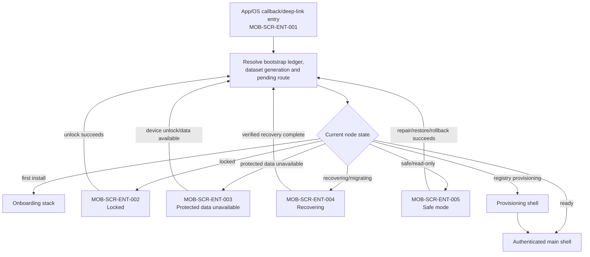

# OneBrain Mobile App Sitemap V1

> Status: **Target information architecture — not implementation evidence**
>
> Snapshot: **2026-07-29 (Asia/Saigon)**
>
> Feature tree:
> [`MOBILE_APP_FEATURE_TREE_V1.md`](./MOBILE_APP_FEATURE_TREE_V1.md)
>
> Feature contracts:
> [`MOBILE_APP_FEATURE_DETAILS_V1.md`](./MOBILE_APP_FEATURE_DETAILS_V1.md)

## 0. Scope and authority

This sitemap defines mobile navigation, screen IDs, route safety and feature
mapping for the autonomous iOS/Android node. The mobile architecture and
distributed-runtime plan remain authoritative for data, privacy, signing,
network and rollout semantics.

Logical paths in this document are design/test names, not a promise that Flutter
must use string URLs internally. External links use only the safe route resolver
defined in §8.

## 1. Information architecture principles

1. The primary navigation is stable: **Home, Library, Capture, Assistant,
   Settings**.
2. Capture is a first-class task stack, not a passive page.
3. Network, sync, seeding, media, models, activity, storage, and diagnostics are
   contextual hubs or Settings branches, not extra bottom tabs.
4. Node data, runtime grant, LLM provider, network presence, reconciliation and
   seeding are separate states.
5. Local/private and network/public actions are visibly separate.
6. A screen may request a typed command; it never writes a database, signs
   arbitrary bytes, executes a model tool, or bypasses Rust policy.
7. Every private route is re-resolved after unlock/process restart. A stale UI
   route is not authority.
8. Optional AI/network failure degrades only that feature; it does not replace
   the whole app with an error screen.
9. There is no Wallet/OBT, global feed, trending, active distributed KQL, or
   always-on-node route before its upstream authority exists.

## 2. Adaptive navigation model

### 2.1 Phone

```text
Bottom navigation
  Home
  Library
  Capture        primary central action/destination
  Assistant
  Settings
```

- Each destination retains its own back stack.
- Capture may open from its tab, Home quick action, widget, share intent, or
  system shortcut; all paths converge on the same capture stack.
- Node status and durable Inbox are reachable from the Home app bar and from
  relevant status cards.
- A deep link into knowledge/media uses the canonical Library detail route,
  never a duplicate modal implementation.

### 2.2 Tablet

- Use `NavigationRail` with the same five destinations and feature IDs.
- Library, Assistant, Operations, Settings and peer/media catalogs may use a
  two-pane master/detail layout.
- A two-pane layout changes presentation only; the selected entity, privacy
  gate and typed command contract remain identical to phone.

### 2.3 Back and restoration

- Android Back/iOS navigation pops within the current destination before
  leaving it.
- Switching tabs preserves only bounded, non-secret presentation state.
- After process death, the app restores a logical destination and opaque local
  reference, reopens current node state, revalidates capability/unlock, and then
  requeries data.
- Drafts, operations, approvals and transfers resume from durable receipts, not
  from a serialized Flutter widget tree.

## 3. Entry and global-state routing



The route resolver never renders a private title, filename, prompt, peer
message or notification argument before the required unlock and local lookup.

## 4. Top-level sitemap

```mermaid
flowchart TB
    Shell["Main shell"]

    Shell --> Home["Home<br/>MOB-HOM"]
    Shell --> Library["Library<br/>MOB-LIB / KNO / MED"]
    Shell --> Capture["Capture<br/>MOB-CAP"]
    Shell --> Assistant["Assistant<br/>MOB-AI / MOD"]
    Shell --> Settings["Settings<br/>MOB-SEC / DAT / MOD / NET / NTF / SYS"]

    Home --> NodeStatus["Node status"]
    Home --> Operations["Operations center"]
    Home --> Inbox["Durable inbox"]
    Home --> Recent["Recent and drafts"]

    Library --> Knowledge["My knowledge"]
    Library --> Concepts["Concept Registry"]
    Library --> Media["Media"]
    Library --> Search["Local search"]
    Library --> KQL["Local KQL"]
    Library --> Graph["Local neighborhood"]

    Capture --> Source["Source chooser"]
    Capture --> Composer["Composer/import"]
    Capture --> Review["Candidate review"]

    Assistant --> Threads["Threads"]
    Assistant --> Conversation["Conversation"]
    Assistant --> Context["Context/disclosure"]
    Assistant --> Tool["Candidate/tool review"]

    Settings --> Identity["Identity and security"]
    Settings --> Data["Registry, storage, backup"]
    Settings --> Models["AI providers and models"]
    Settings --> Network["Network, peers, sync, seeding<br/>T2 gated"]
    Settings --> Notifications["Notifications"]
    Settings --> Language["Language and accessibility"]
    Settings --> Diagnostics["Diagnostics and advanced node"]
```



## 5. Screen registry

### 5.1 Entry, lock, recovery, and onboarding

| Screen ID | Logical path | Responsibility | Feature mapping |
|---|---|---|---|
| `MOB-SCR-ENT-001` | `/entry` | Bootstrap/route resolver; no product content | `MOB-FND-001..003` |
| `MOB-SCR-ENT-002` | `/locked` | App unlock, credential/biometric result, queued-route summary without private text | `MOB-SEC-001` |
| `MOB-SCR-ENT-003` | `/protected-data` | Explain device unlock/protected-data requirement; no retry loop against vault | `MOB-SEC-001`, `MOB-FND-004` |
| `MOB-SCR-ENT-004` | `/recovering` | Operation/generation recovery progress and typed failure | `MOB-FND-002`, `MOB-HOM-005` |
| `MOB-SCR-ENT-005` | `/safe-mode` | Read-only browse where safe, verified export/restore/rollback and diagnostics | `MOB-FND-002/005`, `MOB-DAT-003/006/007`, `MOB-SYS-005/006` |
| `MOB-SCR-ENT-006` | `/unavailable` | Stale route, disabled lane, unsupported capability or expired intent with safe fallback | `MOB-FND-005`, `MOB-SYS-006`, `MOB-NTF-004` |
| `MOB-SCR-ONB-001` | `/onboarding/welcome` | Welcome, English/Vietnamese locale, autonomous-node explanation | `MOB-ONB-001` |
| `MOB-SCR-ONB-002` | `/onboarding/preflight` | Device/runtime/storage/registry peak and optional capability report | `MOB-ONB-002`, `MOB-MOD-001` |
| `MOB-SCR-ONB-003` | `/onboarding/identity` | Create a new node or import encrypted data with the current identity; typed identity recovery appears only after `RECOVERY` | `MOB-ONB-003`, `MOB-SEC-002/004`, `MOB-DAT-007` |
| `MOB-SCR-ONB-004` | `/onboarding/security` | App lock; recovery method setup/verification appears only after `RECOVERY`, otherwise show a non-blocking readiness recommendation | `MOB-SEC-001/003` |
| `MOB-SCR-ONB-005` | `/onboarding/registry` | Provision progress, exact bytes, pause/resume and errors | `MOB-ONB-004`, `MOB-DAT-001/002` |
| `MOB-SCR-ONB-006` | `/onboarding/readiness` | Independent readiness facts; optional AI/notification education; network is non-actionable and has no setup route before `NETWORKED-BETA` | `MOB-ONB-005`, `MOB-HOM-001` |

### 5.2 Home, status, operations, and activity

| Screen ID | Logical path | Responsibility | Feature mapping |
|---|---|---|---|
| `MOB-SCR-HOM-001` | `/home` | Quick capture, recents, drafts, attention and independent state cards | `MOB-HOM-001..006` |
| `MOB-SCR-HOM-002` | `/home/status` | Node data, runtime grants, registry, LLM, network, sync, seed and storage facts | `MOB-HOM-001`, `MOB-FND-001/004` |
| `MOB-SCR-HOM-003` | `/home/recent` | Bounded recent items, drafts and interrupted user work | `MOB-HOM-003` |
| `MOB-SCR-OPS-001` | `/operations` | Registry/model/import/backup/sync/seed jobs with pause reason and receipt | `MOB-HOM-004/005`, `MOB-DAT-002/006/007`, `MOB-MOD-003`, `MOB-NET-004/008` |
| `MOB-SCR-OPS-002` | `/operations/:local_operation_ref` | One operation timeline, retry class, checkpoints and safe actions | `MOB-FND-002/004`, owning feature |
| `MOB-SCR-NTF-001` | `/activity` | Authoritative durable inbox for approvals, security, jobs and reminders | `MOB-NTF-001` |
| `MOB-SCR-NTF-002` | `/activity/:opaque_intent_ref` | Resolve current intent; show detail and validated reversible actions | `MOB-NTF-001/004` |

### 5.3 Library, knowledge, Concept Registry, and media

| Screen ID | Logical path | Responsibility | Feature mapping |
|---|---|---|---|
| `MOB-SCR-LIB-001` | `/library` | Segmented local scopes: Knowledge, Concepts, Media | `MOB-LIB-001`, `MOB-DAT-001`, `MOB-MED-003` |
| `MOB-SCR-LIB-002` | `/library/search` | Local keyword/label/CCID search, filter, scope and limitations | `MOB-LIB-002/004/005/007` |
| `MOB-SCR-LIB-003` | `/library/kql` | Local KQL editor, syntax help, history and bounded results | `MOB-LIB-003/005` |
| `MOB-SCR-LIB-004` | `/library/graph/:local_ref` | Small 2D neighborhood plus accessible list alternative | `MOB-LIB-006` |
| `MOB-SCR-LIB-005` | `/library/concepts` | Browse labels/languages from one active registry release | `MOB-LIB-002`, `MOB-DAT-001` |
| `MOB-SCR-LIB-006` | `/library/concepts/:ccid` | Concept labels, language fallback, relationships and release provenance | `MOB-LIB-002/005`, `MOB-SYS-001` |
| `MOB-SCR-KNO-001` | `/library/knowledge/:local_ref` | Knowledge content, source, provenance, branches, disclosure, media and workflow | `MOB-KNO-001/004/005` |
| `MOB-SCR-KNO-002` | `/library/knowledge/:local_ref/edit` | New local draft revision and validation | `MOB-KNO-002` |
| `MOB-SCR-KNO-003` | `/library/knowledge/:local_ref/organize` | Tags, collections and relationship proposal editing | `MOB-KNO-003` |
| `MOB-SCR-KNO-004` | `/library/knowledge/:local_ref/workflow` | Six-stage read-only workflow inspection; later gated actions | `MOB-KNO-004` |
| `MOB-SCR-KNO-005` | `/library/knowledge/:local_ref/conflicts` | Local branch inspection; gated reconciliation-conflict resolution when T2 is active | `MOB-KNO-005/008` |
| `MOB-SCR-KNO-006` | `/public-use/prepare/:local_ref` | Exact Public Use preview and prepare step | `MOB-KNO-006` |
| `MOB-SCR-KNO-007` | `/public-use/confirm/:opaque_intent_ref` | Re-authenticate, exact confirm/cancel and publication/outbox status | `MOB-KNO-007` |
| `MOB-SCR-MED-001` | `/library/media/:local_manifest_ref` | Verified viewer/player with local availability and source class | `MOB-MED-001..003/005` |
| `MOB-SCR-MED-002` | `/library/media/:local_manifest_ref/info` | Manifest/root, verified bytes and local ownership/pin/cache; gated remote provider/custody sections | `MOB-MED-003/006..008` |
| `MOB-SCR-MED-003` | `/library/media/:local_manifest_ref/share` | Redact/transcode preview, recipient policy and access grants | `MOB-MED-004` |
| `MOB-SCR-MED-004` | `/library/media/:local_manifest_ref/transfer` | Missing pieces, provider sample, progress, resume and failure evidence | `MOB-MED-005/006` |

### 5.4 Capture

| Screen ID | Logical path | Responsibility | Feature mapping |
|---|---|---|---|
| `MOB-SCR-CAP-001` | `/capture` | Source chooser: text, clipboard, share, photo/video/document/audio picker, camera, audio/voice | `MOB-HOM-002`, `MOB-CAP-001..005` |
| `MOB-SCR-CAP-002` | `/capture/text` | Text/clipboard composer, language and draft controls | `MOB-CAP-001/007` |
| `MOB-SCR-CAP-003` | `/capture/share/:spool_ref` | Inspect encrypted share spool before import | `MOB-CAP-002/006` |
| `MOB-SCR-CAP-004` | `/capture/import` | Picker/import selection, exact type/size and staging progress | `MOB-CAP-003/006`, `MOB-MED-001` |
| `MOB-SCR-CAP-005` | `/capture/camera` | Camera capture, permission and optional OCR review | `MOB-CAP-004/006` |
| `MOB-SCR-CAP-006` | `/capture/audio` | Voice/audio recording, permission and optional transcription | `MOB-CAP-005/006` |
| `MOB-SCR-CAP-007` | `/capture/:operation_ref/review` | Source/candidate/provenance/unknowns; edit and explicit local save | `MOB-CAP-007`, `MOB-KNO-002/003` |
| `MOB-SCR-CAP-008` | `/capture/:operation_ref/result` | Durable local receipt, retained original and next local actions | `MOB-CAP-006/007`, `MOB-MED-001` |

### 5.5 Assistant, context, tools, and model route

| Screen ID | Logical path | Responsibility | Feature mapping |
|---|---|---|---|
| `MOB-SCR-AI-001` | `/assistant` | No-LLM actions, thread list, route state and limitations | `MOB-AI-001..003` |
| `MOB-SCR-AI-002` | `/assistant/thread/:local_thread_ref` | Conversation, selected context, streaming, cancellation and provenance | `MOB-AI-002..007` |
| `MOB-SCR-AI-003` | `/assistant/context` | Explicit local context picker and token/data-class estimate | `MOB-AI-004` |
| `MOB-SCR-AI-004` | `/assistant/disclosure/:request_ref` | Cloud destination/context/cost/retention or local-result return review | `MOB-AI-004/007` |
| `MOB-SCR-AI-005` | `/assistant/proposal/:opaque_proposal_ref` | Structured candidate or exact tool arguments, risk and authority review | `MOB-AI-008` |
| `MOB-SCR-AI-006` | `/assistant/tool/:operation_ref` | Tool running/unknown/reconciled receipt and bounded result | `MOB-AI-008`, `MOB-NTF-001` |
| `MOB-SCR-AI-007` | `/assistant/provider` | Quick route selection and qualification reason; links to full model settings | `MOB-AI-003/005/006/007`, `MOB-MOD-004/006` |

### 5.6 Settings index and identity/security

| Screen ID | Logical path | Responsibility | Feature mapping |
|---|---|---|---|
| `MOB-SCR-SET-001` | `/settings` | Searchable grouped settings and current attention states | `MOB-SYS-001..008`, `MOB-HOM-005/006` |
| `MOB-SCR-SEC-001` | `/settings/identity` | Node/feed/Actor public identities and signer readiness | `MOB-SEC-002` |
| `MOB-SCR-SEC-002` | `/settings/security` | Lock timeout, biometric/credential policy and protected-data explanation | `MOB-SEC-001` |
| `MOB-SCR-SEC-003` | `/settings/recovery` | Create/verify typed identity recovery package and enter gated identity-recovery mode | `MOB-SEC-003/004`, `MOB-DAT-007` |
| `MOB-SCR-SEC-004` | `/settings/privacy` | Privacy classes, disclosure defaults and cloud/network history | `MOB-SEC-005/006`, `MOB-AI-004` |
| `MOB-SCR-SEC-005` | `/settings/security/history` | Redacted sensitive-operation history | `MOB-SEC-006` |
| `MOB-SCR-SEC-006` | `/settings/erase` | Release-gated typed local erase/reset flow | `MOB-SEC-007` |

### 5.7 Registry, storage, backup, restore, and export

| Screen ID | Logical path | Responsibility | Feature mapping |
|---|---|---|---|
| `MOB-SCR-DAT-001` | `/settings/registry` | Active/previous release, exact artifacts, verification and update action | `MOB-DAT-001..003` |
| `MOB-SCR-DAT-002` | `/settings/registry/update` | Capacity preflight, transfer/verify/activate progress and rollback | `MOB-DAT-002/003` |
| `MOB-SCR-DAT-003` | `/settings/storage` | Protected/registry/model/media/staging/rollback/reclaimable breakdown | `MOB-DAT-004` |
| `MOB-SCR-DAT-004` | `/settings/storage/cleanup` | Eligible cleanup preview and recoverable operation | `MOB-DAT-005`, `MOB-MED-007` |
| `MOB-SCR-DAT-005` | `/settings/backup` | Create and inspect vault-encrypted/versioned backup generations | `MOB-DAT-006` |
| `MOB-SCR-DAT-006` | `/settings/restore` | Inspect encrypted archive and verify/stage/activate a current-identity data import; identity recovery mode appears only after `RECOVERY` | `MOB-DAT-007`, `MOB-SEC-004` |
| `MOB-SCR-DAT-007` | `/settings/export` | Select reviewed scope and create a vault-encrypted portable export; no plaintext private export | `MOB-DAT-008` |
| `MOB-SCR-DAT-008` | `/settings/migration` | T3 encrypted device migration, target verification and source identity retirement decision | `MOB-DAT-009`, `MOB-SEC-004` |

### 5.8 AI providers and models

| Screen ID | Logical path | Responsibility | Feature mapping |
|---|---|---|---|
| `MOB-SCR-MOD-001` | `/settings/ai` | Provider mode, system qualification, active local/remote route and privacy summary | `MOB-AI-003/005..007`, `MOB-MOD-001/002/004` |
| `MOB-SCR-MOD-002` | `/settings/ai/models` | Signed profile catalog, installed releases, size/license and actions | `MOB-MOD-002/003/005/006` |
| `MOB-SCR-MOD-003` | `/settings/ai/models/:release_ref` | Exact artifact, download/verify/activate/rollback/delete and evaluation evidence | `MOB-MOD-003..006` |

### 5.9 Network, peers, reconciliation, and seeding

These screens are absent from consumer navigation until
`MOB-GATE-NETWORKED-BETA` passes. The carrier screen additionally requires
`MOB-GATE-CARRIER`; custody sections require `MOB-GATE-CUSTODY`. Diagnostics
may show a non-actionable gate status.

| Screen ID | Logical path | Responsibility | Feature mapping |
|---|---|---|---|
| `MOB-SCR-NET-001` | `/settings/network` | Master lane state, scoped reachability, current session and limitations | `MOB-NET-001/004/005/007`, `MOB-FND-005` |
| `MOB-SCR-NET-002` | `/settings/network/peers` | Peer list by NodeID/scope/status; enrollment entry | `MOB-NET-002/003` |
| `MOB-SCR-NET-003` | `/settings/network/enroll` | QR/invite validation, exact scope preview and consent | `MOB-NET-002/010` |
| `MOB-SCR-NET-004` | `/settings/network/peers/:peer_ref` | Capabilities, key state, sessions/routes and revoke | `MOB-NET-003` |
| `MOB-SCR-NET-005` | `/settings/network/sync` | Selector/frontier status, pending work, sessions and conflicts | `MOB-NET-004/005` |
| `MOB-SCR-NET-006` | `/settings/network/seed` | Off/Smart/Manual policy and limits; finite Aggressive appears only on eligible Android builds/devices and never on iOS | `MOB-NET-007/008`, `MOB-SYS-008` |
| `MOB-SCR-NET-007` | `/settings/network/carrier` | SeedInbox/carrier route, ciphertext work and metadata/privacy limits | `MOB-NET-009` |
| `MOB-SCR-NET-008` | `/settings/network/lan` | Foreground LAN permission/discovery and Internet-only fallback | `MOB-NET-010`, `MOB-SYS-003` |

`MOB-NET-006` distributed discovery remains blocked and has no consumer screen
before M6. This is its explicit internal/blocked sitemap mapping for navigation
acceptance; it must not be confused with LAN peer discovery.

### 5.10 Notifications, language, permissions, lifecycle, and diagnostics

| Screen ID | Logical path | Responsibility | Feature mapping |
|---|---|---|---|
| `MOB-SCR-NTF-003` | `/settings/notifications` | Permission, native channels/categories, preview, quiet hours and reminders/digest; push opt-in appears only after `NETWORKED-BETA/PUSH` | `MOB-NTF-002/003/005` |
| `MOB-SCR-SYS-001` | `/settings/language` | Independent UI/content/query/Concept/notification/LLM locale controls | `MOB-SYS-001` |
| `MOB-SCR-SYS-002` | `/settings/accessibility` | Text, contrast, motion and accessibility support facts | `MOB-SYS-002` |
| `MOB-SCR-SYS-003` | `/settings/permissions` | Current native capability/permission state and contextual action | `MOB-SYS-003` |
| `MOB-SCR-SYS-004` | `/settings/background` | T1 local-job policy plus gated T2 transfer/reconciliation/seeding policy and current OS limitations | `MOB-SYS-004/008`, `MOB-NET-008` |
| `MOB-SCR-SYS-005` | `/settings/diagnostics` | Health, release receipts and privacy-safe diagnostics preview/export | `MOB-SYS-005/007`, `MOB-HOM-001` |
| `MOB-SCR-SYS-006` | `/settings/advanced` | Compiled/requested/active/kill-switch/safe-mode state; no raw DB editor | `MOB-SYS-006`, `MOB-FND-005` |
| `MOB-SCR-SYS-007` | `/settings/about` | App/core/schema/registry/model/route IDs, licenses and support | `MOB-SYS-007` |

## 6. Onboarding sitemap and rules

```text
Welcome / locale
  -> autonomous-node explanation
  -> device and exact storage preflight
  -> create node OR encrypted current-identity data import
  -> app lock [-> typed recovery setup when RECOVERY is available]
  -> exact Concept Registry provision
  -> readiness summary
  -> main shell
```

Rules:

- The wizard is resumable by durable step ID.
- It does not ask for camera, microphone, notification, LAN, or cloud access
  before the user selects a feature that needs it.
- Registry provisioning may expose a limited shell for private capture,
  Operations, storage and diagnostics, but the node is labelled
  `Provisioning`, not `Ready`.
- Optional model/provider setup is skippable and normally occurs from Assistant
  or Settings after the offline node works.
- Offline MVP completion does not require the identity-recovery gate. Opting
  into Networked Beta requires a verified typed recovery package first.
- Network/seeding setup is absent until T2 gates are open and defaults Off.

## 7. Global overlays and blocking flows

### 7.1 Bottom sheets and non-blocking overlays

| Overlay | Entry | Rule |
|---|---|---|
| Capture source chooser | Home/Capture/quick action | selecting a source opens the canonical Capture route |
| Library filters/sort/scope | Library/Search | presentation/query only; never changes canonical data |
| Context/concept picker | Assistant/Capture/Edit | shows exact selected local scope and privacy |
| Item actions | Detail | only actions valid for current generation/state |
| Provider selector | Assistant | selecting cloud may require a full disclosure flow |
| Operation mini-progress | global | opens durable Operations detail; safe to dismiss |
| Node status summary | app bar/status chip | statuses remain independent |

### 7.2 Full-screen or blocking flows

The following never run as a lightweight one-tap background action:

- unlock and sensitive re-authentication;
- identity creation, recovery, replace/import and erase;
- registry/model capacity preflight and activation;
- cloud context or tool-result disclosure;
- tool proposal confirmation for a risk-gated effect;
- exact Public Use prepare and confirm;
- peer enrollment/revocation;
- bounded seed-session start;
- media share representation/access grants;
- backup restore/dataset switch;
- safe-mode repair.

Only one blocking flow is active at a time. A second request is queued as an
opaque durable intent or rejected with a typed reason; modals are not stacked.

## 8. Deep links, share intents, notifications, and widgets

### 8.1 Safe route pipeline

```text
untrusted route/source
  -> parse version and enforce bounds
  -> feature/rollout gate
  -> bootstrap and dataset recovery
  -> unlock/re-authentication if required
  -> resolve opaque local intent/reference
  -> query current state/generation
  -> open preview/detail
  -> explicit typed command if the user chooses
```

Opening a route never performs Public Use, tool execution, peer enrollment,
restore, erase, revoke, media disclosure, or canonical mutation.

### 8.2 External route registry

| Source | External-safe form | Destination | Gate / fallback |
|---|---|---|---|
| Local notification | fixed `onebrain://activity`; no product intent ID | `MOB-SCR-NTF-001`; resolve current durable Inbox state only after unlock | stale or empty Inbox is valid |
| Remote APNs/FCM hint | fixed `onebrain://activity`; payload contains only installation route, coarse type and mailbox generation | authenticate, fetch mailbox state, refresh `MOB-SCR-NTF-001` | `NETWORKED-BETA/PUSH`; omitted hint is recovered by later poll |
| Quick action/widget | `onebrain://capture/<non_sensitive_mode>` | `MOB-SCR-CAP-001/002/004` | Capture source chooser |
| Share extension/intent | OS-owned callback plus bounded opaque spool receipt, never a URL parameter | `MOB-SCR-CAP-003` | Operations/import recovery |
| Assistant local shortcut | fixed `onebrain://assistant`; no thread/session ID | `MOB-SCR-AI-001` after unlock | Assistant landing |
| Peer invitation | versioned signed one-time QR/file/share payload parsed in quarantine, not copied into URL history | `MOB-SCR-NET-003` preview | `NETWORKED-BETA`; invalid/expired/replayed explanation |
| Static Settings shortcut | typed allowlisted destination with no user-data argument | matching Settings screen | Settings index |

Operation, activity-intent, Assistant-thread and private item references are
app-internal routes only; they are never registered as external URL schemes.
Public-object retrieval/adoption links are not registered in V1. Adding them
requires a separate receive/import feature ID, read-only preview screen,
privacy model and release gate; Public Use publication does not grant that
authority.

External URLs never contain:

- a private item/media/thread/prompt/Need/StandingNeed identifier;
- a product intent, operation or Assistant session identifier;
- raw KQL or private context;
- a Node/feed/Actor private key or recovery material;
- a bearer token, recipient media key, tool nonce, or Public Use receipt;
- a private filename/title/notification message argument.

## 9. State-specific sitemap behavior

| State | Reachable areas | Restrictions and message |
|---|---|---|
| `FirstRun` | onboarding, support/about | no product data route before bootstrap |
| `Locked` | unlock, non-sensitive support, recovery entry | no private title/count/content |
| `ProtectedDataUnavailable` | explanation and retry after device unlock | no vault/signer loop or background auth |
| `Provisioning` | raw encrypted private draft only, Operations, storage, diagnostics, onboarding registry | no Concept validation/materialization until registry activation; not `Ready` |
| `Recovering` | recovery progress, cancel only when safe, diagnostics | no new mutation admission |
| `ReadyOffline` | Home, Capture, Library, deterministic Assistant, Settings | network facts say disabled/unreachable, not error |
| `ModelUnavailable` | all core local features | Assistant/provider screens explain exact reason/fallback |
| `NetworkUnavailable` | all private/offline features | outbound work remains pending within policy |
| `RegistryDegraded` | private knowledge/detail/export/repair | Concept lookup/search shows named release limitation |
| `StoragePressureReadOnly` | browse, backup/export, cleanup, diagnostics | block new capture/import/download with exact required bytes |
| `SafeMode` | safe read-only data, verified export/restore/rollback, diagnostics | no automatic reset or unsafe mutation |

## 10. Feature-gate visibility

| Gate state | Navigation behavior |
|---|---|
| Not compiled | feature and screen absent |
| Compiled but rollout-disabled | consumer action absent; Advanced may show non-actionable gate state |
| Eligible but user-disabled | Settings shows enable flow, implications and current Off state |
| Enabled but temporarily unavailable | screen remains with exact reason and retained capabilities |
| Kill-switched | stop new admission, show typed operator/policy state, preserve durable local work |
| Optional ADR gate not closed | carrier, push or custody consumer sections are absent; base T2 remains independently evaluable |
| T3 not opened | later feature and route are absent from consumer navigation |
| Blocked by M6/M7 | no consumer route, badge, placeholder value or simulated feature |

This prevents the sitemap from turning a future protocol idea into a product
claim.

## 11. Navigation acceptance

- Every screen ID maps to at least one feature ID and every non-foundation
  feature maps to a screen or an explicitly internal behavior.
- Phone and tablet use the same route/state contracts.
- Every private deep link is safe before unlock and after process death.
- Each tab restores its bounded back stack without treating UI state as durable
  operation truth.
- Network/AI/notification permission denial leaves private offline flows usable.
- No screen or action bypasses proposal, disclosure, consent, signer, durable
  receipt, or rollout gates.
- English/Vietnamese labels, text scaling, VoiceOver/TalkBack, reduced motion
  and non-visual graph/status alternatives pass.
- Error and empty states state the exact local/selector/frontier boundary.
- Wallet/OBT, global feed/trending, active distributed KQL and automatic Public
  Use remain absent until separately authorized.
