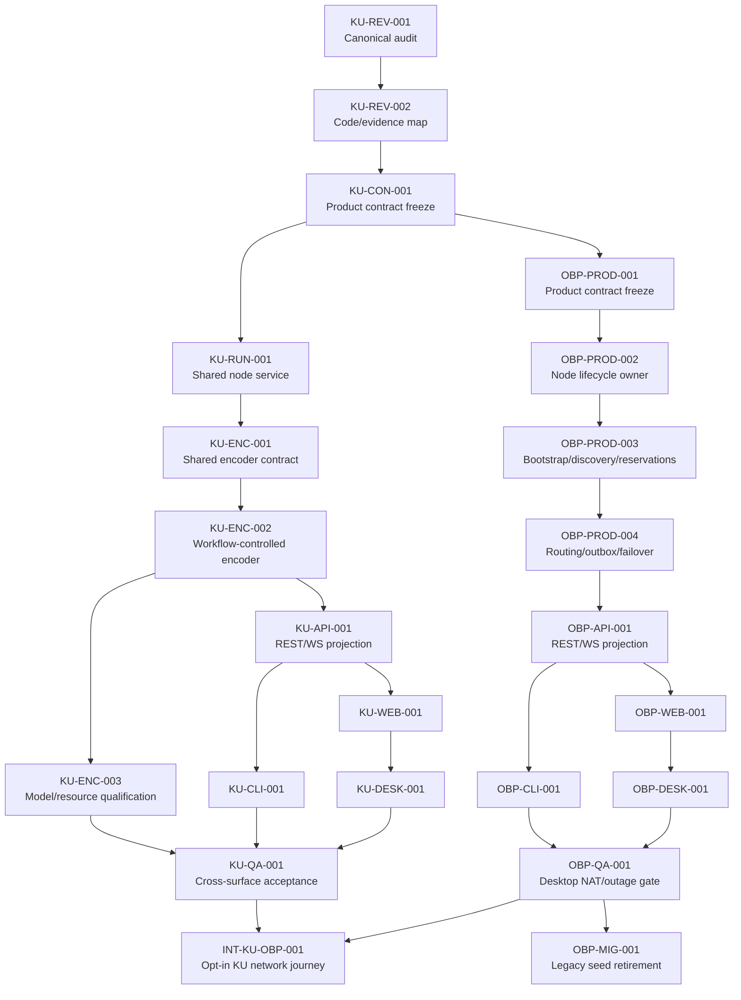

# Master plan

## Objective

Deliver a coherent local-first KU product through CLI, local Web and Desktop,
then connect those surfaces to automatic vNext outbound-first networking
without reopening the frozen OBP authority model.

## Dependency graph

## Execution order

### Phase A — KU review, starts now

1. `KU-REV-001`: decide which KU documents and semantics are authoritative.
2. `KU-REV-002`: map current runtime, persistence, tests and product gaps.
3. `KU-CON-001`: freeze the shared local product workflow before adding new
   public API/command fields.

Exit: there is one owner-approved KU product contract with explicit migration
and legacy boundaries.

### Phase B — KU shared implementation and surfaces

4. `KU-RUN-001`: implement the node-owned local KU service.
   Before the model-backed product surface, D-017 inserts `KU-ENC-001` for the
   shared extraction/compiler contract and `KU-ENC-002` for its implementation.
   `KU-ENC-003` qualifies real model/resource tuples; it may run alongside API
   projection after the shared runtime is merged, but blocks model-ready and
   cross-surface encoder qualification claims.
5. `KU-API-001`: expose the contract once through local authenticated REST/WS.
6. `KU-CLI-001`, then `KU-WEB-001` and `KU-DESK-001` on separate branches.
7. `KU-QA-001`: prove the same operation has the same identity, state and error
   semantics through all surfaces and across restart.

Exit: KU is usable locally and consistently without a peer or seed.

### Phase C — OBP productization, no protocol redesign

8. `OBP-PROD-001`: freeze the missing orchestration/status/product boundary.
9. `OBP-PROD-002`: give the normal node aggregate lifecycle ownership.
10. `OBP-PROD-003`: connect bootstrap, discovery, reservation, advertisement
    and refresh using trusted-local configuration and existing validated types.
11. `OBP-PROD-004`: connect the planner, authenticated carrier selection,
    durable outbox, alternate-relay failover and checkpoint resume.

Exit: a normal feature-gated node can bootstrap and reach an expected peer
without a legacy seed or manually supplied raw socket address.

### Phase D — OBP product surfaces and acceptance

12. `OBP-API-001`: expose bounded status and operator actions.
13. `OBP-CLI-001`, `OBP-WEB-001`, `OBP-DESK-001` on separate branches.
14. `OBP-QA-001`: two consumer nodes, two independent relays, no inbound NAT,
    bootstrap loss, selected-relay loss, restart and privacy assertions.
15. `OBP-MIG-001`: retire the legacy product seed path only after parity is
    proven and rollback remains available.

Exit: desktop product can make the bounded automatic-connectivity claim. This
does not enable the lane by default or qualify mobile/browser platforms.

### Phase E — KU/OBP integration

16. `INT-KU-OBP-001`: local KU → explicit publish preparation/confirmation →
    durable network intent → authenticated reconciliation → remote validation →
    scoped status/provenance, with private data and authority firewalls intact.

## Parallelism

- `KU-CLI-001` and `KU-WEB-001` may branch in parallel after `KU-API-001` is
  merged. `KU-DESK-001` starts after the Web surface is accepted because the
  Desktop application embeds it.
- `KU-ENC-003` and `KU-API-001` can use the same frozen KU-ENC-002 service
  without editing its semantic contract independently. Mobile integration
  remains in MOB-06; these tasks do not create another mobile tool orchestrator.
- The OBP planning lane may begin after `KU-CON-001`, but implementation must
  not modify unfinished KU service code.
- No two active branches should edit the same public contract file. If they
  must, serialize them.

## Shared acceptance principles

- local operation remains useful with zero peers;
- no UI status says global/full/closed where scope is partial;
- raw query, private Need, Vault content, private key or receipt capability is
  not exposed publicly;
- route, relay, path count or delivery receipt grants no knowledge authority;
- every mutation is idempotent or carries an explicit conflict state;
- process restart preserves canonical identity and durable nonterminal work;
- kill/rollback keeps evidence and does not silently re-enable a lane;
- default-off remains unchanged until a separate release decision.

## Out of scope

- mobile implementation or mobile UI;
- browser/WASM carrier implementation;
- strict Base qualification and default rollout;
- ciphertext mailbox and push-wake delivery;
- M6 active multipath KQL, end-to-end Outcome/Benefit and production OBT;
- redesign of frozen OBP wire/session/reconciliation contracts.
