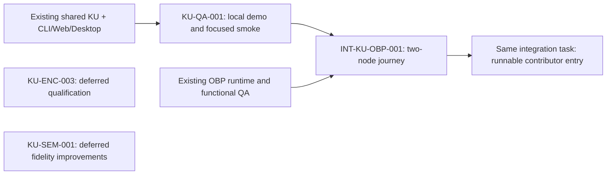

# OneBrain concept MVP — master plan

Owner direction: **2026-09-28, D-044** in [DECISIONS](DECISIONS.md).
This is the single active delivery plan. [PROGRESS](PROGRESS.md) owns status,
branch/worktree inventory and the next action; task files own acceptance.
The September implementation history remains in PROGRESS and existing outputs.

## Product question and minimum useful demonstration

Can a person turn a small piece of knowledge into an inspectable local object,
keep and find it after restart, and explicitly exchange that object with another
node while retaining identity, provenance and control over private content?

The MVP answers this with a working narrow path, not a claim that arbitrary
language extraction, global knowledge convergence or token economics is solved.
Use the existing Rust/node services and local Web as the primary demonstration
surface on the available Windows host. CLI is the practical inspection/second-node
surface; Desktop reuses the Web workflow. No additional UI framework is needed.

The concept demonstration has three visible outcomes:

1. A supported manual/resolved draft can be previewed, explicitly saved, searched
   and reopened after restart with the same identity. A few ordinary public or
   developer-owned text examples also exercise the existing experimental model
   path; keep successful proposals and visible unresolved/needs-review outcomes.
2. Two real node instances explicitly exchange an accepted KU; the receiver can
   inspect its identity and provenance. Two processes on one host are sufficient
   for the first concept demo. This does not establish consumer-NAT independence.
3. A new contributor can find the prerequisites, build/run commands, sample
   journey, architectural seams and a bounded improvement to make. Document setup
   that still needs operator input; do not advertise a one-command install yet.

## Remaining MVP sequence

```mermaid
flowchart LR
    A["Existing shared KU + CLI/Web/Desktop"] --> B["KU-QA-001: local demo and focused smoke"]
    B --> C["INT-KU-OBP-001: two-node journey"]
    D["Existing OBP runtime and functional QA"] --> C
    C --> E["Same integration task: runnable contributor entry"]
    Q["KU-ENC-003: deferred qualification"]
    S["KU-SEM-001: deferred fidelity improvements"]
```

| Parent task | Substeps kept in that task | MVP completion |
|---|---|---|
| [KU-QA-001](tasks/09-KU-QA-001.md) | A: reconcile available implementation/setup; B: local save/search/restart; C: small experimental AI check and shared-surface smoke | Local concept can be demonstrated and actual limits are recorded; strict ENC-003 is not a dependency |
| [INT-KU-OBP-001](tasks/20-INT-KU-OBP-001.md) | A: explicit two-node exchange; B: receiver read/identity and one retry or restart; C: contributor build/run instructions and backlog links | Repeatable concept journey plus a usable open-source entry point, without platform qualification claims |

These are existing tasks 09 and 20, not a new milestone/task hierarchy. Planning
this scope does not mark either task implemented. Each next step fixes the first
concrete obstacle to the demo, rather than expanding an evaluation framework.
Dependent local work may use a reviewed available implementation before merge;
record the actual base in PROGRESS. Publication/merge state remains separate.

## MVP checks and stopping rule

- Run the primary happy path once after relevant changes; inspect the result.
- Use focused existing tests for the changed module. Add a small regression only
  for a real bug or a meaningful data/consent boundary; avoid implementation-mirror
  tests and automatic full-workspace reruns for documentation or small UI edits.
- Check saved data after one restart and that save/share require their explicit
  action. Show a useful failure when AI/network is unavailable or input unresolved.
- For experimental AI, inspect about five short VI/EN developer examples with one
  available admitted model. Record what worked, what failed and rough observed
  elapsed time. No accuracy threshold, blind benchmark, reviewer signature, second
  model, p95 campaign or statistical report is required to accept this demo.
- Reuse CLI/Desktop component results; a known unrelated platform test-host failure
  is a documented follow-up, not a reason to hold the Web/CLI concept indefinitely.
- Record command/result and limitations briefly in PROGRESS or the existing parent
  task output. Stop expanding checks when the scoped journey works and no concrete
  data-loss/privacy/false-success defect remains in it.

Model drafts remain proposals unless the existing canonical workflow accepts them.
Use the working manual/resolved path when lowering is unsupported; that limitation
must be apparent to the tester. Do not call manual corrections automatic encoding.

## Shared framework contributors should extend

| Seam | Existing owner/location | Rule for an MVP contribution |
|---|---|---|
| Canonical knowledge, identity and storage | `src/ku-core`, `src/onebrain-base-contract` | Reuse registered types/codec; keep durable identity stable |
| Extraction and model adapters | `src/ku-encoder/src/extraction` | Models return proposals; reuse the shared workflow and bounded provider interface |
| KU jobs, save/recovery and orchestration | `src/onebrain-node` | Keep one service owner; avoid frontend-specific knowledge semantics |
| Local API and user experience | `src/onebrain-api`, `src/onebrain-cli`, `src/onebrain-web`, `src/onebrain-desktop` | Project the same service; improve setup and visible errors in place |
| Peer exchange | `src/ku-net`, `src/onebrain-relay`, node networking | Reuse authenticated transport/reconciliation and explicit publication |
| Qualification tools | `scripts/encoder/qualification_*` and retained ENC-003 branch | Preserve for later; do not turn them into the MVP's prerequisite |

Public contracts still govern changed behavior. Read the relevant contract when
changing that interface, not every research/evidence document for every substep.

## After-MVP and contributor backlog

This is the central queue. Detailed existing specs/defect records stay at their
owners; the entries below link to them rather than spawning new plans.

| Area / existing owner | Bounded contribution | Completion example / dependency |
|---|---|---|
| Task 20.C — first-run experience | Make the existing local host easier to provision, document prerequisites and useful errors | A fresh contributor can follow the declared setup and demo; no hidden maintainer-only files |
| Task 20 follow-up — share projection | Project the D-045 shared share module through a registered product API/Web action and normal node host composition | Preserve exact preview/confirmation, private IDs/source suppression and pending/delivery distinction; current concept uses the isolated helper |
| KU-SEM-001 | Pick one reference/alternative/qualifier defect from the [semantic backlog](outputs/KU_SEM_001_CONTRIBUTOR_BACKLOG.md) | One reproducible case, shared fix and focused regression; broader fidelity stays deferred |
| KU-QA-001 follow-up | CLI/Desktop parity and native lifecycle portability | Reproduce one actual difference or host issue and fix it; no full platform lab required to contribute |
| KU-ENC-003 | Finish one missing harness/provider/measurement/evaluator seam | See [task 23](tasks/23-KU-ENC-003.md); formal qualified claims still require its full original conditions |
| OBP-QA-001 follow-up | Consumer NAT, native OS lifecycle, non-Linux paths | Reproduce on available real environment; record scope; do not reopen completed functional acceptance |
| Base / Registry | Simplify contributor setup and later strict release closure | Preserve existing trust/data; [historical status](../../PROJECT_STATUS.md) and runtime plan own production gates |
| Mobile | Existing autonomous mobile backlog | Separate later lane under mobile AGENTS/build contract; no mobile implementation is authorized by this plan |
| M6 — distributed KQL / Outcome / Benefit | Implement a bounded slice when that lane is selected | [Distributed runtime plan](../../research/WIP_DISTRIBUTED_RUNTIME_IMPLEMENTATION_PLAN_V2.md), sections 12–13; outside this MVP |
| M7 — economics and wallet | Reconcile reward-policy decisions, then versioned implementation | Same runtime plan section 14 plus D-013/D-014; no production token promise in MVP |
| Foundation optional | RUN-003 remote cognition, RIB-001/002 fast-path reconciliation | [Foundation plan](../../research/ONEBRAIN_FOUNDATION_IMPLEMENTATION_PLAN_V7_1.md); do not make optional work a new MVP prerequisite |
| Extension / bot / glasses / BCI | Later adapters/research after the working shared core demo | Existing scaffold/research; outside current MVP |

## Document and branch discipline

- README and NEXT_CONVERSATION link to this plan, PROGRESS and the current task.
  They do not contain a parallel chronological history or task-state table.
- PROGRESS is the only execution ledger. Its inventory distinguishes main,
  unmerged committed work, unpublished commits, dirty files and other worktrees.
- Subtasks use headings/checklists in the existing parent task. Update the same
  output file if a substantive report is useful; routine runs need only a ledger
  line. Keep old evidence read-only unless correcting it explicitly.
- Before creating a branch/worktree, inspect the relevant existing refs and dirty
  work. Reuse suitable work; do not branch from main and silently omit useful code.
  A subtask branch must name its parent task/base and feed back into this ledger.
- Do not copy older PROGRESS/DECISIONS from a retained branch over the active
  ledger. Integrate useful code selectively when appropriate; document the actual
  Git result. No automatic branch deletion, reset or cleanup of other work.
- Keep current limitations accessible to contributors without requiring them to
  recreate a historical audit trail. [CONTRIBUTING](../../../CONTRIBUTING.md)
  explains the entry path and proportional checks.
