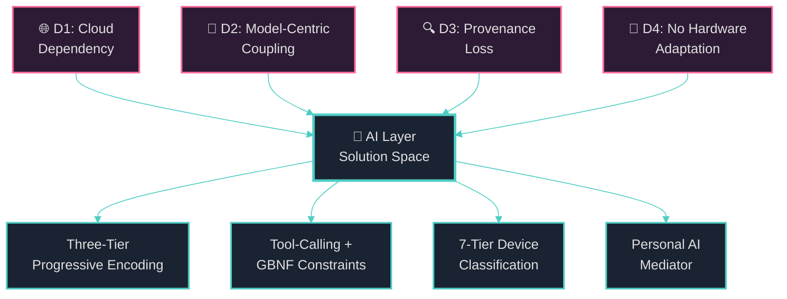

# Chapter 1: Introduction

> *"The question is not whether machines think, but whether humans know what thinking means well enough to design it."*
> — Marvin Minsky, *The Society of Mind* (1986)

---

## §1.1 The Knowledge Encoding Challenge

The emergence of large language models (LLMs) — from GPT-4 [1] and Claude [2] to open-weight models such as Llama 3 [3], Mistral [4], and Qwen 3 [5] — has demonstrated that neural architectures can capture astonishing breadth and depth of human knowledge within billions of statistical parameters. Yet this remarkable capability conceals a fundamental paradox: the knowledge inside an LLM is **implicit, unverifiable, and owned by no one**. When GPT-4 asserts that "the boiling point of water is 100°C at standard atmospheric pressure," there is no mechanism to determine *where* this fact resides within its 1.8 trillion parameters, *who* contributed the training data that instilled it, *how confident* the model actually is (beyond calibrated probabilities), or *whether* the fact can be surgically corrected without retraining the entire model at a cost exceeding $100 million [6].

This paradox becomes especially acute in the context of **decentralized knowledge networks** — systems where autonomous peers collaboratively construct, validate, and share structured knowledge without centralized authority. The OneBrain project [7] addresses this challenge by introducing the **Knowledge Unit (KU)** — an atomic, self-describing, binary-encoded knowledge representation with explicit provenance, epistemic status, and trust scoring. Each KU is a discrete, verifiable, and composable unit of knowledge, analogous to a gene in a biological genome, that can be independently created, validated, replicated, and queried across a peer-to-peer network.

However, the creation of high-quality Knowledge Units from unstructured human input — natural language text, conversations, documents, observations — remains the **critical bottleneck** in the OneBrain pipeline. Manual encoding requires deep understanding of the Core DNA v6 binary format [8], its 31 opcodes, 10 gene types, 33 bond types, and 11 epistemic status levels. This complexity barrier threatens to limit OneBrain's adoption to a small community of technical experts, undermining the project's vision of democratized knowledge contribution.

**The central question this paper addresses is:** *How can artificial intelligence be deployed in a decentralized, privacy-preserving, and hardware-adaptive manner to automate the encoding of human knowledge into structured Knowledge Units, while preserving provenance, epistemic integrity, and verifiability?*

---

## §1.2 Why Current AI Approaches Fail for Decentralized Knowledge

To motivate our design, we identify four systemic deficiencies in existing approaches to AI-assisted knowledge encoding:

**Deficiency D1 (Cloud Dependency).** The dominant paradigm for AI-powered knowledge extraction — exemplified by systems such as Google's Knowledge Vault [9], Microsoft's MINLIE [10], and commercial APIs from OpenAI, Anthropic, and Google — requires persistent connectivity to centralized inference endpoints. Every knowledge encoding request transmits user input to a third-party server, introducing three unacceptable consequences for decentralized networks: (a) **privacy violation** — the user's knowledge contributions are exposed to the API provider; (b) **availability dependency** — the encoding pipeline fails when the network connection fails or the provider imposes rate limits; and (c) **economic extraction** — encoding costs accrue to API providers rather than to the knowledge contributors who generate the value. A node running on a submarine, a field station in Antarctica, or a mobile device on an airplane cannot participate in knowledge encoding under this model.

**Deficiency D2 (Model-Centric Coupling).** Existing knowledge extraction systems are tightly coupled to specific model architectures and versions. A pipeline built for GPT-3.5's output format breaks when migrated to GPT-4o; a system trained on BERT-base produces different entity spans than BERT-large; fine-tuned models become obsolete when the base model is deprecated. This coupling creates **fragile pipelines** that require continuous maintenance and re-engineering as the AI landscape evolves at unprecedented speed — a new state-of-the-art LLM emerges approximately every 3–6 months [11]. For a decentralized system designed to operate across thousands of heterogeneous nodes over decades, model-centric coupling is architecturally untenable.

**Deficiency D3 (Provenance Loss).** When a large language model extracts knowledge from text, the provenance chain is typically severed. The model produces a triple `(Paris, capitalOf, France)` with no record of *which* training document contributed this fact, *what* evidence supports it, *who* originally authored the source material, or *what* epistemic status (rumor? peer-reviewed? axiomatic?) the assertion deserves. This provenance loss is particularly damaging in domains where trustworthiness is paramount — medical knowledge, legal precedent, scientific consensus — and directly contradicts the OneBrain philosophy where every Knowledge Unit carries explicit author DID, evidence type, trust score, and epistemic status [8].

**Deficiency D4 (No Hardware Adaptation).** Current AI systems operate under an implicit assumption of hardware homogeneity: either a cloud GPU (NVIDIA A100/H100 with 80 GB VRAM) or a high-end consumer device. In a decentralized network, however, the node population spans six orders of magnitude in computational capability — from Raspberry Pi Zero devices with 512 MB RAM to GPU workstations with 128 GB VRAM. No existing knowledge encoding system adapts its AI strategy to the available hardware. The consequence is a digital divide where low-resource nodes are excluded from knowledge contribution, or where powerful nodes waste resources running models far below their capacity. A 2024 survey by Xu et al. [12] found that fewer than 3% of on-device AI frameworks implement automatic model selection based on hardware profiling.

> **Architectural Note.** These four deficiencies are not independent — they interact and amplify each other. Cloud dependency (D1) exacerbates model-centric coupling (D2) because cloud providers frequently update model versions without notice. Provenance loss (D3) is worsened by cloud dependency (D1) because the encoding pipeline runs in an opaque server environment. Hardware homogeneity assumptions (D4) reinforce cloud dependency (D1) because heterogeneous devices are simply directed to use the cloud API. Our architecture addresses all four deficiencies simultaneously through a unified design.

---

## §1.3 Ten Design Principles for Decentralized AI

Drawing on lessons from the OneBrain project's first six pillars — Knowledge Unit (P1) [8], Network Protocol (P2) [13], Knowledge Query Language (P3) [14], Proof-of-Metabolic-Value (P4) [15], Token Economics (P5) [16], and Knowledge Graph (P7) [17] — we articulate ten design principles that govern the AI Layer architecture:

| # | Principle | Rationale | Realized By |
|---|-----------|-----------|-------------|
| P1 | **Local-First Execution** | AI inference runs on the user's device; network is fallback only | §6.1 |
| P2 | **Progressive Complexity** | Start with cheap heuristics; escalate to expensive AI only when necessary | §4.1 |
| P3 | **Tool-Calling Paradigm** | AI acts through structured tools, not free-form text generation | §5.1 |
| P4 | **Model-Agnostic Design** | The encoding pipeline must work with *any* LLM that supports tool calling | §5.6 |
| P5 | **Grammar-Constrained Output** | Invalid KU encodings must be impossible at the token sampling level | §5.4 |
| P6 | **Device-Aware Adaptation** | Automatically select the optimal model for the available hardware | §6.3 |
| P7 | **Privacy-Preserving Personalization** | User profiles and knowledge patterns never leave the device | §7.6 |
| P8 | **Metabolism-Aware Scheduling** | AI resource consumption is tracked and rewarded through PoMV | §8.5 |
| P9 | **Encode-Decode-Compare Verification** | Every AI encoding is verified through round-trip binary serialization | §5.5 |
| P10 | **Composition over Modification** | The AI Layer adapts to existing pillars; it does not modify them | §8.9 |

These principles are not aspirational — each is directly implemented in a specific component described in the chapter indicated in the rightmost column.

---

## §1.4 Knowledge DNA vs AI Models: Complementary Paradigms

A recurring question in the OneBrain community is: *"Why not just use an LLM? If GPT-4 can answer any question, why do we need Knowledge Units at all?"* This question reflects a deep misunderstanding of the respective roles of structured knowledge and statistical reasoning, which we address here before proceeding to the technical architecture.

### Table 1: Knowledge DNA vs AI Models — A Paradigm Comparison

| # | Dimension | 🧬 Knowledge DNA (KU) | 🧠 AI Model (LLM) |
|---|-----------|----------------------|-------------------|
| 1 | **Knowledge form** | **Explicit** — each fact is a discrete, readable unit with CID | **Implicit** — knowledge dissolved across billions of weights, inseparable |
| 2 | **Provenance** | **Traceable** — every KU has CID, author DID, evidence type | **Opaque** — "trained on internet data"; cannot trace any fact to its source |
| 3 | **Updates** | **Granular** — modify one KU; everything else remains intact | **Catastrophic** — fine-tuning one fact may destroy thousands of others |
| 4 | **Trustworthiness** | **Verifiable** — 11 epistemic levels + trust score + evidence type | **Hallucinating** — confidently states falsehoods without self-awareness |
| 5 | **Structure** | **Composable** — assemble/disassemble like LEGO blocks | **Entangled** — everything intertwined, cannot isolate components |
| 6 | **Ownership** | **Ownable** — author signs with DID, retains attribution forever | **Collective** — training data loses all traceability |
| 7 | **Durability** | **Immortal** — replicated across thousands of P2P nodes | **Decaying** — knowledge cutoff date; outdated immediately |
| 8 | **Precision** | **Exact** — `sweep_angle = 25.000°` stored precisely | **Approximate** — "about 25 degrees" (if not hallucinated) |
| 9 | **Governance** | **Democratic** — Proof-of-Metabolic-Value; anyone can contribute | **Centralized** — only Google/OpenAI decide training data |
| 10 | **Role** | **Memory** — storage, organization, retrieval | **Processor** — reasoning, synthesis, creation |

**Key Insight: AI + KU = Symbiosis.** The OneBrain AI Layer does not replace Knowledge Units with AI models; it uses AI models to *create* Knowledge Units. This relationship mirrors the biological division between **long-term memory** (hippocampus → cortex) and **working memory/reasoning** (prefrontal cortex):

$$
\text{AI Layer} \xrightarrow{\text{encodes}} \text{KU Store} \xrightarrow{\text{retrieves}} \text{AI Layer} \xrightarrow{\text{reasons}} \text{User}
$$

The AI processes, understands, and synthesizes — but the *knowledge artifacts* it produces are explicit, verifiable, owned Knowledge Units that persist in the decentralized network long after the AI model that created them has been superseded by newer architectures.

---

## §1.5 Biological Metaphor: The AI Layer as Neocortex

OneBrain's architecture draws consistently on biological metaphors [7]. Extending this tradition, we frame the AI Layer using neuroscience concepts:

### Table 2: Biological Metaphor Mapping to AI Layer Components

| Biological Structure | Function | AI Layer Component | Section |
|---------------------|----------|-------------------|---------|
| **Neocortex** | Higher-order processing, reasoning, language comprehension | Large Language Model (Tier 3) | §4.4 |
| **Basal ganglia** | Procedural memory, habitual pattern matching | Rule-based parser (Tier 1) | §4.2 |
| **Cerebellum** | Fine motor coordination, rapid pattern classification | Small model classifier (Tier 2) | §4.3 |
| **Thalamus** | Sensory relay, routing signals to appropriate cortical areas | Tier Router | §4.5 |
| **Hippocampus** | Memory formation, encoding experiences into long-term storage | KU Tool Executor (text → CoreDna) | §5.3 |
| **Prefrontal cortex** | Executive function, planning, decision-making | Personal AI Mediator | §7 |
| **Myelin sheath** | Insulation for faster signal transmission | GBNF grammar constraints (noise reduction) | §5.4 |
| **Endocrine system** | Metabolic regulation, energy budgeting | Metabolism-aware scheduling | §8.5 |

> **Architectural Note.** The biological metaphor is more than pedagogical convenience — it directly informed our design decisions. Just as the brain routes simple reflexes through the spinal cord (fast, cheap) and reserves cortical processing for novel stimuli (slow, expensive), our three-tier encoding pipeline routes simple factual statements through rule-based parsing (Tier 1, ~1 ms) and reserves LLM inference (Tier 3, ~2 s) for complex, ambiguous knowledge that requires reasoning. This progressive escalation strategy reduces average encoding latency by an estimated $4\times$–$10\times$ compared to routing all inputs through the LLM.

---

## §1.6 Contributions

This paper makes the following seven contributions:

1. **Three-Tier Progressive Encoding Pipeline** (§4). We introduce a cost-quality optimized encoding architecture with three tiers — rule-based parsing ($\tau_1$, ~1 ms, 60–70% quality), small model classification ($\tau_2$, ~50 ms, 80–90% quality), and large model reasoning ($\tau_3$, ~2 s, 95%+ quality) — connected by a complexity-based router that selects the appropriate tier based on input characteristics. This is, to our knowledge, the first progressive encoding system for structured knowledge representations.

2. **Tool-Calling Framework with Grammar-Constrained Generation** (§5). We design and implement (7,887 LOC across 4 crates, 33 tests) a 15-tool structured interface (`ToolDef`, `ToolCall`, `ToolResult`) that enables any LLM supporting function calling to produce valid Knowledge Units. We combine this with GBNF (GGML BNF) grammar-constrained decoding that makes invalid output *impossible* at the token sampling level — a fundamentally stronger guarantee than post-hoc validation and retry.

3. **Encode-Decode-Compare Verification Pipeline** (§5.5). We introduce a self-verification mechanism where AI-generated encodings are validated through round-trip binary serialization: $\text{Text} \xrightarrow{\text{AI}} \text{CoreDna} \xrightarrow{\text{encode}} \text{bytes} \xrightarrow{\text{decode}} \text{CoreDna'} \xrightarrow{\text{express}} \text{Text'}$, followed by semantic similarity comparison $\sigma_{\text{sem}}(\text{Text}, \text{Text'})$ against a configurable threshold.

4. **7-Tier Device Classification and Automatic Model Selection** (§6.3). We propose a hardware profiling system that classifies devices into seven tiers ($T_0$–$T_6$) based on RAM, GPU VRAM, and compute capability, and automatically selects the optimal model size, quantization level, and encoding mode for each tier.

5. **Content-Addressed Model Distribution via DHT** (§6.7). We leverage the existing OneBrain Kademlia DHT (P2) to distribute AI model weights as content-addressed chunks with BLAKE3 integrity verification, enabling peer-to-peer model sharing without centralized repositories.

6. **Personal AI Mediator with Hybrid RAG** (§7). We design a per-user adaptive AI agent (PAM) that combines three retrieval strategies — embedding-based semantic search, structured KQL queries, and 2-hop graph traversal via OBKG — into a unified retrieval-augmented generation pipeline. PAM learns user interests, adapts encoding style, detects knowledge gaps, and preserves privacy through local-only execution.

7. **Metabolism-Aware AI Integration** (§8.5). We integrate AI resource consumption into the Proof-of-Metabolic-Value (PoMV) consensus framework, enabling the network to reward nodes that contribute AI encoding resources and penalize excessive resource consumption.

---

## §1.7 Scope and Limitations

The AI Layer described in this paper occupies a specific position within the OneBrain architecture:

**In scope:**
- Architecture and design of the four AI Layer components
- Complete implementation of the tool-calling framework (15 tools, executor, system prompt — 1,729 LOC, 33 tests)
- Complete implementation of the AI Runtime Engine with Ollama backend, device profiler, and model registry (`ku-ai` — 2,444 LOC)
- Complete implementation of the Encoding Pipeline with AI encoder, verifier, fallback chain, and batch processing (`ku-encoder` — 1,344 LOC)
- Complete implementation of the Personal AI Mediator with intent classification, hybrid retrieval, context management, and knowledge signal detection (`ku-mediator` — 2,370 LOC)
- Working CLI demo (`onebrain`) with end-to-end AI encoding, P2P broadcasting, and peer verification
- Cross-pillar integration following the adapter pattern (zero foundation modifications)

**Out of scope:**
- Training or fine-tuning of custom AI models for Tier 2 (we use existing open-weight models for Tier 3)
- GBNF grammar-constrained generation (designed, pending llama.cpp FFI integration)
- Mobile/embedded deployment (future work; §10.3)
- Formal safety analysis of AI-generated Knowledge Units (deferred to future work)

> **Transparency Note.** The AI Layer is currently at approximately **65% implementation maturity**. All four components are implemented as working Rust crates (`ku-ai`: 2,444 LOC, `ku-encoder`: 1,344 LOC, `ku-mediator`: 2,370 LOC) plus 1,729 LOC of AI tool infrastructure in `ku-core`, totaling **7,887 LOC**. The system has been demonstrated as a working CLI application with local AI encoding via Ollama. The primary gaps are: (a) Tier 2 small-model encoding (requires BERT/T5 fine-tuning), (b) GBNF grammar-constrained generation (requires llama.cpp FFI), and (c) P2P model distribution via DHT (designed, not yet implemented).

---

## §1.8 Paper Organization

The remainder of this paper is organized as follows:

- **Chapter 2** surveys related work across five domains: retrieval-augmented generation, knowledge extraction, on-device AI inference, federated learning, and tool-calling paradigms.
- **Chapter 3** presents the four-component AI Layer architecture and its design principles.
- **Chapter 4** describes the three-tier progressive encoding pipeline in detail.
- **Chapter 5** specifies the tool-calling framework, including the 15 tool definitions, the execution engine, grammar-constrained generation, and the encode-decode-compare verification pipeline.
- **Chapter 6** addresses device-aware AI runtime and model management, including the 7-tier device classification, model registry, and P2P distribution.
- **Chapter 7** introduces the Personal AI Mediator with hybrid RAG, intent classification, and privacy-preserving personalization.
- **Chapter 8** details cross-pillar integration with all existing OneBrain pillars.
- **Chapter 9** presents evaluation results including benchmarks, encoding quality metrics, and system comparisons.
- **Chapter 10** concludes with a summary of contributions, current limitations, and future research directions.

---

## References

[1] OpenAI, "GPT-4 Technical Report," arXiv preprint arXiv:2303.08774, 2023.

[2] Anthropic, "The Claude Model Card and Evaluations," Anthropic Technical Report, 2024.

[3] Meta AI, "The Llama 3 Herd of Models," arXiv preprint arXiv:2407.21783, 2024.

[4] A. Q. Jiang et al., "Mistral 7B," arXiv preprint arXiv:2310.06825, 2023.

[5] Qwen Team, "Qwen3 Technical Report," arXiv preprint arXiv:2505.09388, 2025.

[6] S. Bubeck et al., "Sparks of Artificial General Intelligence: Early Experiments with GPT-4," arXiv preprint arXiv:2303.12712, 2023.

[7] OneBrain Project, "OneBrain: A Bio-Inspired Decentralized Knowledge Network," OneBrain Whitepaper, 2026.

[8] OneBrain Project, "Knowledge Unit: A Bio-Inspired Knowledge Representation with Core DNA Encoding for Decentralized Knowledge Networks," OneBrain Technical Paper (P1), 2026.

[9] X. Dong et al., "Knowledge Vault: A Web-Scale Approach to Probabilistic Knowledge Fusion," in *Proc. KDD*, New York, USA, 2014, pp. 601–610.

[10] Y. Lin et al., "MINLIE: A Toolkit for Knowledge Graph Construction from Text," in *Proc. AAAI*, 2021.

[11] E. Sevilla et al., "Compute Trends Across Three Eras of Machine Learning," arXiv preprint arXiv:2202.05924, 2022.

[12] L. Xu et al., "A Survey on Efficient Inference for Large Language Models," arXiv preprint arXiv:2404.14294, 2024.

[13] OneBrain Project, "OneBrain Protocol: A Bio-Inspired 9-Layer P2P Network Stack for Decentralized Knowledge Sharing," OneBrain Technical Paper (P2), 2026.

[14] OneBrain Project, "KQL: A Declarative Query Language for Decentralized Knowledge Graphs," OneBrain Technical Paper (P3), 2026.

[15] OneBrain Project, "Proof-of-Metabolic-Value: An Observation-Based Consensus Mechanism for Decentralized Knowledge Networks," OneBrain Technical Paper (P4), 2026.

[16] OneBrain Project, "OneBrain Token: A Knowledge Utility Token with Account-Chain Ledger and Output-Based Minting," OneBrain Technical Paper (P5), 2026.

[17] OneBrain Project, "OneBrain Knowledge Graph: A Bio-Inspired, Decentralized Knowledge Graph with Federated Embeddings and Epistemic-First Bonds," OneBrain Technical Paper (P7), 2026.
