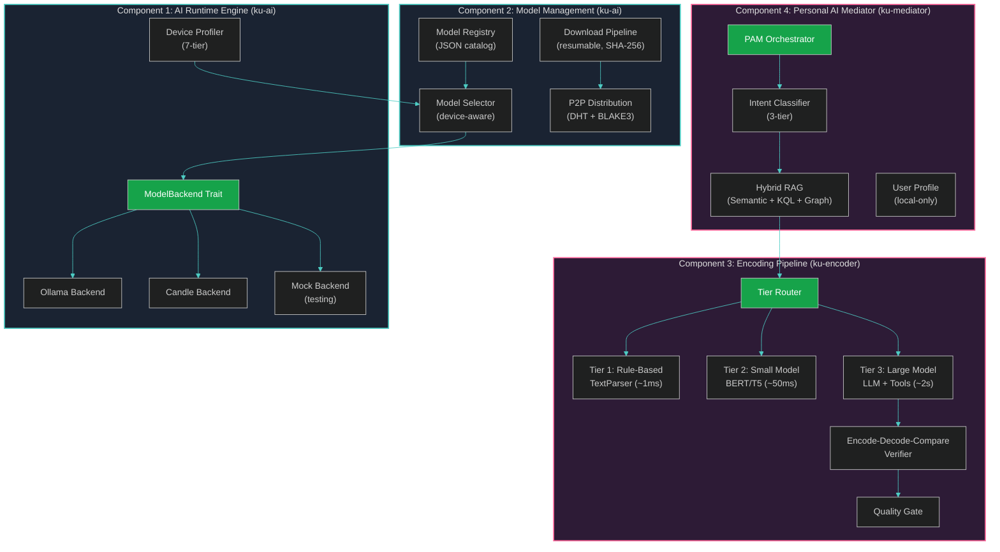
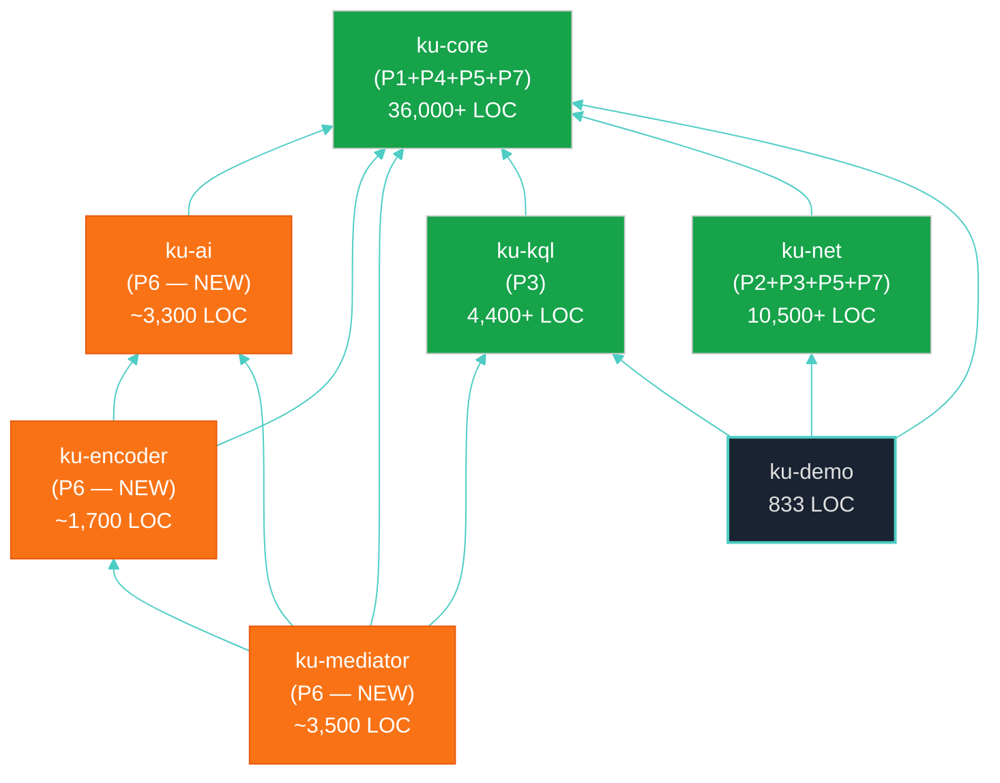

# Chapter 3: The Four-Component AI Layer Architecture

> *"Architecture is the learned game, correct and magnificent, of forms assembled in the light."*
> — Le Corbusier, *Towards a New Architecture* (1923)

---

## §3.1 Design Principles

The AI Layer architecture is governed by five core design principles derived from the ten principles enumerated in §1.3. These principles are non-negotiable constraints — every architectural decision in this chapter and subsequent chapters must satisfy all five simultaneously:

**DP1: Local-First, Cloud-Never.** AI inference executes on the user's device. There is no cloud fallback, no API key, no external dependency. If the device lacks sufficient resources for AI encoding, the system degrades gracefully to rule-based parsing (Tier 1) rather than offloading to a remote server. This principle is absolute — even optional cloud connectivity would create a privacy vulnerability and an availability dependency that contradicts the OneBrain philosophy.

**DP2: Trait-Based Abstraction.** All AI components are defined through Rust traits, not concrete implementations. The `ModelBackend` trait abstracts over inference engines (Ollama, Candle, ONNX); the `EmbeddingProvider` trait abstracts over embedding models; the `LLMProvider` trait combines both into a unified interface. This abstraction enables hot-swappable backends, facilitates testing with mock implementations, and future-proofs the system against the rapid evolution of the AI ecosystem.

**DP3: Composition over Modification.** The AI Layer composes over existing OneBrain pillars (P1–P5, P7–P8) without modifying their codebases. This is the same adapter pattern employed by OBKG (P7) [1] and OBT (P5) [2] — a proven approach that preserves the stability of foundation layers while enabling new capabilities. The AI Layer reads from and writes to existing interfaces; it never introduces breaking changes.

**DP4: Progressive Complexity.** The system escalates computational cost only when necessary. A simple factual statement ("Water boils at 100°C") should not invoke a 7B-parameter language model when a rule-based parser can encode it in 1 ms with equivalent quality. Progressive complexity reduces average latency, conserves computational resources, and extends battery life on mobile devices.

**DP5: Fail-Safe Degradation.** Every AI component has a deterministic fallback path. If the LLM produces invalid output, retry with adjusted parameters. If retry fails, fall back to the next lower encoding tier. If all tiers fail, return the original text with a `RAW` encoding status for manual encoding. The system never blocks, never crashes, and never loses user input due to AI failure.

---

## §3.2 Architecture Overview

The AI Layer comprises four components arranged in a layered architecture, with strict dependency ordering from bottom to top:

### **Figure 1: Four-Component AI Layer Architecture**



### Table 4: Four-Component Architecture Summary

| # | Component | Crate | LOC | Dependencies | Status |
|---|-----------|-------|-----|-------------|--------|
| 1 | **AI Runtime Engine** | `ku-ai` | 2,444 | `ku-core`, `sysinfo`, `reqwest` | ✅ Implemented |
| 2 | **Model Management** | `ku-ai` | (included above) | `ku-ai` traits, `sha2`, `directories` | ✅ Implemented (registry, selector, device profiler) |
| 3 | **Encoding Pipeline** | `ku-encoder` | 1,344 | `ku-ai`, `ku-core` | ✅ Implemented (encoder, verifier, fallback, batch) |
| 4 | **Personal AI Mediator** | `ku-mediator` | 2,370 | `ku-encoder`, `ku-ai`, `ku-kql`, `ku-core` | ✅ Implemented (mediator, intent, retriever, context) |
| | **Total (new crates)** | 3 crates | **6,158** | | |
| | **+ ku-core AI tools** | `ku-core` | 1,729 | | ✅ Implemented (tools, executor, system prompt) |
| | **Grand Total** | | **7,887** | | |

> **Architectural Note.** The crate boundaries follow the Rust convention of separating concerns into independently compilable units. The `ku-ai` crate contains both runtime and model management because they share the `ModelBackend` trait and device profiling infrastructure. The `ku-encoder` crate depends on `ku-ai` for model access and on `ku-core` for CoreDna types. The `ku-mediator` crate sits at the top of the dependency hierarchy, orchestrating all components.

---

## §3.3 End-to-End Data Flow

### **Figure 2: End-to-End Data Flow: Text → KU Binary**

The following diagram traces a complete encoding cycle from raw text input to a persisted, content-addressed Knowledge Unit:

```mermaid
%%{init: {'theme': 'dark', 'themeVariables': {'primaryColor': '#1a2332', 'primaryBorderColor': '#4ecdc4', 'lineColor': '#4ecdc4', 'secondaryColor': '#2d1b36', 'tertiaryColor': '#1a2332'}}}%%
graph LR
    INPUT["📝 Raw Text<br/>'Water boils at 100°C'"] --> LANG["Language<br/>Detection"]
    LANG --> PREPROC["Preprocessing<br/>(normalize, tokenize)"]
    PREPROC --> COMPLEX["Complexity<br/>Analysis"]
    COMPLEX --> ROUTER["Tier<br/>Router"]

    ROUTER -->|"score < 30"| T1["Tier 1<br/>TextParser"]
    ROUTER -->|"30 ≤ score < 70"| T2["Tier 2<br/>Small Model"]
    ROUTER -->|"score ≥ 70"| T3["Tier 3<br/>LLM + Tools"]

    T1 --> TOOLS["Tool Calls<br/>(JSON)"]
    T2 --> TOOLS
    T3 --> TOOLS

    TOOLS --> EXECUTOR["KuToolExecutor<br/>(15 tools)"]
    EXECUTOR --> DNA["CoreDna<br/>(instructions)"]
    DNA --> ENCODE["encode()<br/>→ Vec<u8>"]
    ENCODE --> VERIFY["Verify:<br/>decode → express<br/>→ compare"]
    VERIFY -->|"σ_sem ≥ 0.75"| CID["BLAKE3<br/>CID"]
    VERIFY -->|"σ_sem < 0.75"| RETRY["Retry /<br/>Fallback"]
    CID --> STORE["KuStorage<br/>(redb)"]
    STORE --> CONSENSUS["Encoding<br/>Consensus"]
    CONSENSUS --> NETWORK["P2P<br/>Broadcast"]

    style INPUT fill:#2d1b36,stroke:#ff6b9d,stroke-width:2px,color:#e0e0e0
    style ROUTER fill:#1a2332,stroke:#4ecdc4,stroke-width:2px,color:#e0e0e0
    style EXECUTOR fill:#16a34a,color:#fff
    style VERIFY fill:#16a34a,color:#fff
    style CID fill:#16a34a,color:#fff
    style STORE fill:#1a2332,stroke:#4ecdc4,stroke-width:2px,color:#e0e0e0
    style NETWORK fill:#1a2332,stroke:#4ecdc4,stroke-width:2px,color:#e0e0e0
```



**Step-by-step walkthrough:**

1. **Input**: The user provides raw text — a sentence, paragraph, or document fragment.
2. **Language Detection**: Identify the input language for bilingual concept resolution (English ↔ Vietnamese).
3. **Preprocessing**: Normalize whitespace, expand abbreviations, resolve coreferences.
4. **Complexity Analysis**: Compute a complexity score $c_{\text{score}}$ based on sentence count, entity count, relation density, and ambiguity markers (§4.5).
5. **Tier Routing**: Route to the appropriate encoding tier based on $c_{\text{score}}$.
6. **Encoding**: The selected tier produces a sequence of tool calls (JSON format).
7. **Tool Execution**: `KuToolExecutor` processes tool calls, building `CoreDna` instructions.
8. **Binary Encoding**: `CoreDna::encode()` serializes instructions to compact binary (varint, CRC-16).
9. **Verification**: Decode the binary back to instructions, express as text, compare semantic similarity.
10. **Content Addressing**: Compute BLAKE3 CID of the encoded bytes.
11. **Storage**: Persist to local `redb` database via `KuStorage`.
12. **Consensus**: Submit to Encoding Consensus protocol (RAW → SELF → PART → FULL).
13. **Broadcast**: Propagate the finalized KU to peers via the OBP network.

---

## §3.4 Dependency Architecture

The AI Layer introduces three new crates into the OneBrain workspace, carefully positioned within the existing dependency hierarchy:



**Layer 0 (Foundation):** `ku-core` — KU types, CoreDna, PoMV, OBT, OBKG, CRDT.
**Layer 1 (Services):** `ku-kql`, `ku-net`, `ku-ai` — all depend on `ku-core`, independent of each other.
**Layer 2 (Encoding):** `ku-encoder` — depends on `ku-ai` + `ku-core`.
**Layer 3 (Application):** `ku-mediator` — depends on `ku-encoder` + `ku-ai` + `ku-kql` + `ku-core`.

> **Key constraint:** No circular dependencies. `ku-core` has zero knowledge of the AI Layer. The AI Layer reads from and writes to `ku-core` types through their public APIs only.

---

## §3.5 Trait Hierarchy

The AI Layer's extensibility is achieved through three core Rust traits that define the contract between AI capabilities and their implementations:

```rust
/// Low-level model inference backend.
/// Abstracts over Ollama, Candle, ONNX, or any future inference engine.
#[async_trait]
pub trait ModelBackend: Send + Sync {
    /// Generate a chat completion from a sequence of messages.
    async fn chat(&self, messages: &[Message]) -> Result<String, AiError>;
    
    /// Generate a structured output conforming to a JSON Schema.
    async fn chat_structured(
        &self, 
        messages: &[Message], 
        schema: &serde_json::Value,
    ) -> Result<serde_json::Value, AiError>;
    
    /// Generate a response with tool calling enabled.
    async fn chat_with_tools(
        &self, 
        messages: &[Message], 
        tools: &[ToolDef],
    ) -> Result<Vec<ToolCall>, AiError>;
    
    /// Check if the backend is healthy and responsive.
    async fn health_check(&self) -> Result<ModelInfo, AiError>;
}

/// Embedding generation provider.
/// Separated from ModelBackend because embeddings often use a
/// dedicated small model (e.g., nomic-embed-text, 137M params)
/// rather than the primary LLM.
#[async_trait]
pub trait EmbeddingProvider: Send + Sync {
    /// Generate an embedding vector for a single text input.
    async fn embed(&self, text: &str) -> Result<Vec<f32>, AiError>;
    
    /// Batch embedding for multiple texts.
    async fn embed_batch(&self, texts: &[String]) -> Result<Vec<Vec<f32>>, AiError>;
    
    /// Return the dimensionality of the embedding space.
    fn dimensions(&self) -> usize;
}

/// High-level AI provider combining language model and embeddings.
/// This is the primary interface used by ku-encoder and ku-mediator.
pub trait LLMProvider: Send + Sync {
    /// Access the underlying model backend.
    fn backend(&self) -> &dyn ModelBackend;
    
    /// Access the embedding provider (may be a separate model).
    fn embedding_provider(&self) -> Option<&dyn EmbeddingProvider>;
    
    /// Return the device tier classification for this node.
    fn device_tier(&self) -> DeviceTier;
}
```

This trait hierarchy enables:

1. **Backend swapping**: Replace Ollama with Candle without changing any calling code.
2. **Testing**: Use `MockBackend` in CI/CD without requiring actual model weights.
3. **Progressive deployment**: Start with Ollama (simplest), migrate to Candle (in-process) as the crate matures.
4. **Future-proofing**: New inference engines (TensorRT, Apple Neural Engine, NPU) can be added by implementing `ModelBackend`.

---

## §3.6 Configuration

The AI Layer is configured through a TOML file with sections corresponding to each component:

```toml
# ~/.config/onebrain/ai.toml

[runtime]
backend = "ollama"                  # "ollama" | "candle" | "mock"
ollama_host = "http://127.0.0.1:11434"
ollama_timeout_secs = 30

[models]
active_llm = "qwen3-8b"            # Model identifier
active_embedding = "nomic-embed-text"
auto_download = true                # Download missing models automatically
update_policy = "manual"            # "manual" | "auto" | "notify"

[encoding]
default_tier = "auto"               # "auto" | "tier1" | "tier2" | "tier3"
max_retries = 2                     # Retries before tier fallback
confidence_threshold = 0.75        # Minimum σ_sem for acceptance
gbnf_enabled = true                 # Enable grammar-constrained output

[mediator]
enabled = true
proactive_encoding = false          # Auto-encode from conversations
detail_level = "standard"           # "minimal" | "standard" | "verbose"
max_rag_results = 5
```

### Auto-Configuration by Device Tier

When no configuration file exists (first run), the system auto-configures based on detected hardware:

| Tier | RAM | Default LLM | Default Embedding | Encoding Mode |
|------|-----|-------------|-------------------|---------------|
| $T_0$ (Micro) | ≤4 GB | — (Tier 1 only) | — | Rule-based only |
| $T_1$ (Mobile) | 6–8 GB | Qwen3-1.7B Q4 | nomic-embed-text | Tier 1 + Tier 2 |
| $T_2$ (High Mobile) | 8–12 GB | Qwen3-4B Q4 | nomic-embed-text | Tier 1 + Tier 2 |
| $T_3$ (Laptop) | 16 GB | Qwen3-8B Q4_K_M | nomic-embed-text | All tiers |
| $T_4$ (Desktop) | 32 GB | Qwen3-14B Q4_K_M | nomic-embed-text | All tiers |
| $T_5$ (Workstation) | 64 GB | Qwen3-32B Q8 | nomic-embed-text | All tiers |
| $T_6$ (Server) | 128+ GB | Qwen3-235B-A22B FP16 | nomic-embed-text | All tiers |

> **Architectural Note.** The auto-configuration table uses Qwen 3.x models throughout because they currently offer the best out-of-box tool calling accuracy among open-weight models [3]. However, the model-agnostic trait design (§3.5) means any compatible model can be substituted. The `nomic-embed-text` embedding model is universal across all tiers because of its small footprint (137M parameters, ~300 MB) and strong embedding quality — representing only 2–3% overhead on any tier.

---

## §3.7 Error Handling and Graceful Degradation

The AI Layer defines a unified error taxonomy:

```rust
#[derive(Debug, thiserror::Error)]
pub enum AiError {
    #[error("Backend unavailable: {0}")]
    BackendUnavailable(String),
    
    #[error("Model not found: {0}")]
    ModelNotFound(String),
    
    #[error("Inference timeout after {0}ms")]
    InferenceTimeout(u64),
    
    #[error("Invalid tool call: {0}")]
    InvalidToolCall(String),
    
    #[error("Encoding verification failed: σ_sem={0:.3} < threshold={1:.3}")]
    VerificationFailed(f64, f64),
    
    #[error("Insufficient memory: need {need_mb}MB, have {have_mb}MB")]
    InsufficientMemory { need_mb: u64, have_mb: u64 },
    
    #[error("Download failed: {0}")]
    DownloadFailed(String),
    
    #[error("GGUF validation failed: {0}")]
    GgufInvalid(String),
}
```

**Degradation cascade:**

$$
\text{Tier 3 (LLM)} \xrightarrow{\text{fail}} \text{retry}(n=2) \xrightarrow{\text{fail}} \text{Tier 2 (Small Model)} \xrightarrow{\text{fail}} \text{Tier 1 (Rule-based)} \xrightarrow{\text{fail}} \text{RAW status}
$$

At each step, the system logs the failure reason, preserves the original input, and notifies the user of the degraded encoding quality. A KU encoded at Tier 1 is still a valid Knowledge Unit — it simply carries lower confidence and may require human review or network-based Encoding Consensus to reach `FULL` status.

---

## References

[1] OneBrain Project, "OneBrain Knowledge Graph: A Bio-Inspired, Decentralized Knowledge Graph with Federated Embeddings," OneBrain Technical Paper (P7), 2026.

[2] OneBrain Project, "OneBrain Token: A Knowledge Utility Token with Account-Chain Ledger," OneBrain Technical Paper (P5), 2026.

[3] Qwen Team, "Qwen3 Technical Report," arXiv preprint arXiv:2505.09388, 2025.
