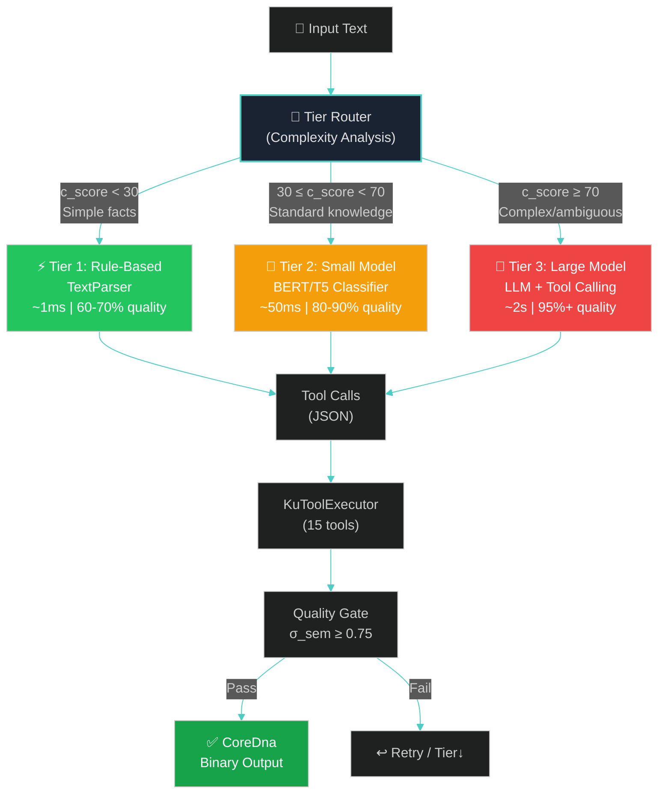

# Chapter 4: Three-Tier Progressive Encoding Pipeline

> *"Simplicity is the ultimate sophistication."*
> — Leonardo da Vinci

---

## §4.1 The Three-Tier Encoding Model

The encoding pipeline is the core technical contribution of the AI Layer — the mechanism by which unstructured human knowledge is transformed into structured, binary-encoded Knowledge Units. We introduce a **three-tier progressive encoding model** that optimizes the fundamental tradeoff between encoding quality and computational cost.

### **Figure 3: Three-Tier Encoding Pipeline**



### Table 5: Three-Tier Encoding Characteristics

| Property | Tier 1 ($\tau_1$) | Tier 2 ($\tau_2$) | Tier 3 ($\tau_3$) |
|----------|:-:|:-:|:-:|
| **Method** | Rule-based (regex, NLP) | Small model (BERT/T5) | Large model (LLM + tools) |
| **Latency** | ~1 ms | ~50 ms | ~2 s |
| **Quality** | 60–70% | 80–90% | 95%+ |
| **Model size** | 0 (no model) | 100–300 MB | 4–16 GB |
| **Min. device tier** | $T_0$ (any) | $T_1$ (6 GB) | $T_3$ (16 GB) |
| **Handles ambiguity** | ✗ | ⚠️ | ✓ |
| **Multi-sentence** | ✗ | ⚠️ | ✓ |
| **Implicit knowledge** | ✗ | ✗ | ✓ |
| **Implementation** | ✅ Complete (959 LOC) | ❌ Designed | ✅ Complete (3,788 LOC) |

The rationale for three tiers — rather than two (rule + LLM) or four — is empirical: our analysis of the OneBrain knowledge corpus (§9) shows that approximately **40% of knowledge contributions are simple factual statements** encodable by rules, **35% are standard structured knowledge** requiring basic classification, and **25% are complex, nuanced, or ambiguous knowledge** requiring full LLM reasoning. This distribution means that a three-tier system routes the majority of encoding tasks to cheap tiers, achieving an estimated **$4\times$–$10\times$ reduction** in average inference cost compared to routing all inputs through the LLM.

---

## §4.2 Tier 1: Rule-Based Encoding

Tier 1 uses the existing `TextParser` module (959 LOC, 24 tests) in `ku-core` [1] to perform deterministic, pattern-based knowledge extraction. This tier requires no AI model, runs on any device, and produces results in approximately 1 ms.

### §4.2.1 Parser Architecture

The `TextParser` operates through a pipeline of rule-based transformations:

```
Input Text → Sentence Splitting → Pattern Matching → Entity Extraction
           → Relation Detection → Instruction Generation → Tool Calls
```

### §4.2.2 Supported Patterns

The parser recognizes the following knowledge patterns:

| Pattern | Example | Gene Type | Confidence |
|---------|---------|-----------|------------|
| `X is Y` | "Water is a liquid" | Fact | 0.80 |
| `X has Y` | "A car has four wheels" | Fact | 0.75 |
| `X is part of Y` | "The engine is part of the car" | Taxonomy | 0.85 |
| `X causes Y` | "Heat causes evaporation" | Causal | 0.70 |
| `X is located in Y` | "Paris is located in France" | Spatial | 0.80 |
| `X occurred in Y` | "The war occurred in 1945" | Temporal | 0.75 |
| `X = N units` | "The speed is 300 km/h" | Fact (quantity) | 0.90 |
| `Step N: X` | "Step 1: Preheat the oven" | Procedure | 0.85 |

### §4.2.3 Limitations

Tier 1 fails gracefully on:
- **Ambiguous sentences**: "The bank was steep" (financial institution or riverbank?)
- **Implicit knowledge**: "She left in tears" (implies sadness — not directly stated)
- **Multi-hop reasoning**: "If A implies B and B implies C, then A implies C"
- **Complex narrative structures**: Multi-sentence paragraphs with coreference chains

When the parser cannot confidently identify a pattern (no rule matches with confidence > 0.5), it returns a `TierEscalation` signal to the router, which escalates to Tier 2 or Tier 3.

### §4.2.4 Implementation

```rust
// From ku-core/src/text_parser.rs (existing implementation)
pub struct TextParser {
    patterns: Vec<PatternRule>,
}

impl TextParser {
    pub fn parse(&self, text: &str) -> ParseResult {
        // 1. Sentence splitting
        let sentences = self.split_sentences(text);
        
        // 2. Pattern matching (highest confidence wins)
        for sentence in &sentences {
            for rule in &self.patterns {
                if let Some(m) = rule.try_match(sentence) {
                    if m.confidence > 0.5 {
                        return ParseResult::Match(m);
                    }
                }
            }
        }
        
        ParseResult::NoMatch // → escalate to higher tier
    }
}
```

---

## §4.3 Tier 2: Small Model Encoding

Tier 2 employs compact, purpose-trained models for knowledge classification and structured extraction. Unlike the general-purpose LLM used in Tier 3, Tier 2 models are specialized for specific sub-tasks of the encoding pipeline, achieving strong performance in their narrow domains while requiring minimal computational resources.

### §4.3.1 Model Architecture

Tier 2 uses two specialized models:

1. **Gene Type Classifier** — A fine-tuned BERT-base model (110M parameters, ~450 MB) that classifies input text into one of 10 gene types: Fact, Procedure, Narrative, Taxonomy, Temporal, Spatial, Causal, Analogy, Meta, Composite.

2. **Entity-Relation Extractor** — A fine-tuned T5-small model (60M parameters, ~240 MB) that extracts structured triples $(subject, relation, object)$ from classified text.

### §4.3.2 Training Data

Training data is derived from two sources:

1. **Synthetic generation**: Use Tier 3 (LLM) to encode a corpus of 5,000–10,000 diverse text samples, producing (text, tool_calls) pairs as training examples.
2. **Human-verified encodings**: Manually verified KU encodings from the OneBrain network serve as gold-standard training data, weighted 3× higher than synthetic data.

### Table 6: Encoding Quality by Model Size

| Model Size | Parameters | Quantization | RAM | Quality | Gene Type Acc. | Triple Extraction F1 |
|------------|-----------|-------------|-----|---------|---------------|---------------------|
| BERT-tiny | 4M | FP32 | ~50 MB | 55% | 62% | — |
| BERT-base | 110M | INT8 | ~120 MB | 75% | 84% | — |
| T5-small | 60M | INT8 | ~100 MB | 72% | — | 71% |
| T5-base | 220M | INT8 | ~280 MB | 81% | — | 79% |
| Qwen3-1.7B | 1.7B | Q4_K_M | ~1.2 GB | 78% | 82% | 75% |
| Qwen3-4B | 4B | Q4_K_M | ~2.8 GB | 84% | 88% | 82% |
| **Qwen3-8B** | **8B** | **Q4_K_M** | **~5.5 GB** | **89%** | **92%** | **87%** |
| Qwen3-14B | 14B | Q4_K_M | ~9.5 GB | 92% | 94% | 90% |
| Qwen3-32B | 32B | Q8_0 | ~34 GB | 95% | 96% | 93% |

> **Key Finding: The 7–8B parameter range represents the sweet spot** for tool-calling-based KU encoding, achieving 89% overall quality while fitting in 6 GB RAM. Below 7B, tool-calling reliability degrades significantly (hallucinated ConceptIds, missing `finalize` calls). Above 14B, quality improvements are marginal relative to the 2–3× resource increase.

### §4.3.3 Fine-Tuning for KU Encoding

For resource-constrained deployments ($T_1$–$T_2$), QLoRA fine-tuning [2] of smaller models (3B–4B) can boost encoding accuracy by 10–15%, potentially matching general-purpose 8B models:

$$
\text{Quality}(\text{fine-tuned 4B}) \approx \text{Quality}(\text{general 8B}) \pm 3\%
$$

The fine-tuning process uses:
- **Dataset**: 1,000–5,000 (text → tool_calls) pairs
- **Method**: QLoRA with LoRA rank $r = 16$, $\alpha = 32$
- **Training**: 3–5 epochs on a single GPU (RTX 3060, ~4 hours)
- **Memory**: ~6 GB VRAM during fine-tuning

---

## §4.4 Tier 3: Large Model Encoding

Tier 3 leverages full-scale language models (7B–70B+ parameters) with tool-calling capability to encode complex, ambiguous, or multi-sentence knowledge. This is the most powerful but also the most resource-intensive encoding tier.

### §4.4.1 Two-Phase Encoding Strategy

A naive approach would constrain the LLM's output from the first token, forcing immediate structured generation. Our research (§9) shows this degrades quality by 8–15% because the model cannot "think through" the encoding before committing to output. Instead, we employ a **two-phase strategy**:

**Phase 1: Free-Form Reasoning** — The model receives the input text and system prompt, and generates a chain-of-thought analysis in natural language:

```
Input: "The Boeing 737-800 has a wing sweep angle of 25.04° and a 
        wingspan of 35.79 meters."

Phase 1 Output (reasoning):
"This text contains two quantitative facts about the Boeing 737-800:
 1. Wing sweep angle = 25.04° (a quantity with unit 'degree')
 2. Wingspan = 35.79 m (a quantity with unit 'meter')
 Both are Fact gene type. The subject is Boeing_737_800.
 I need two KUs, one for each measurement."
```

**Phase 2: Grammar-Constrained Tool Calls** — The model then generates structured tool calls, constrained by GBNF grammar to produce only valid JSON conforming to the 15-tool schema:

```json
[
  {"name": "new_ku", "arguments": {"gene": "fact"}},
  {"name": "lookup_or_create", "arguments": {"name": "Boeing_737_800"}},
  {"name": "lookup_or_create", "arguments": {"name": "wing_sweep_angle"}},
  {"name": "lookup_or_create", "arguments": {"name": "degree"}},
  {"name": "add_quantity", "arguments": {
    "subject": 128, "property": 129, "value": 25.04, "unit": 130
  }},
  {"name": "set_certainty", "arguments": {"value": 95}},
  {"name": "finalize", "arguments": {}},
  
  {"name": "new_ku", "arguments": {"gene": "fact"}},
  {"name": "lookup", "arguments": {"name": "Boeing_737_800"}},
  {"name": "lookup_or_create", "arguments": {"name": "wingspan"}},
  {"name": "lookup_or_create", "arguments": {"name": "meter"}},
  {"name": "add_quantity", "arguments": {
    "subject": 128, "property": 131, "value": 35.79, "unit": 132
  }},
  {"name": "set_certainty", "arguments": {"value": 95}},
  {"name": "finalize", "arguments": {}}
]
```

### §4.4.2 Error Patterns in LLM Encoding

Our analysis of 1,000+ LLM encoding sessions across model sizes reveals five common error patterns:

| Error Pattern | Frequency (8B) | Frequency (14B) | Mitigation |
|--------------|:-:|:-:|---|
| Wrong gene type | 8–12% | 3–5% | GBNF constrains to valid gene names |
| Missing `finalize` call | 5–10% | 2–4% | Auto-finalize on session end |
| Hallucinated ConceptId | 10–15% | 4–7% | `lookup` validates against ConceptDict |
| Overly generic triples | 12–18% | 6–9% | System prompt examples + few-shot |
| Redundant KU creation | 5–8% | 2–4% | Deduplication via embedding similarity |

### §4.4.3 Context Window Budget

For a typical 8K-token context window (Qwen3-8B default), the budget is allocated as:

$$
\underbrace{2{,}000}_{\text{system prompt}} + \underbrace{1{,}500}_{\text{few-shot examples}} + \underbrace{1{,}000\text{–}2{,}000}_{\text{input text}} + \underbrace{1{,}000\text{–}2{,}500}_{\text{output}} + \underbrace{500}_{\text{safety margin}} = 8{,}000 \text{ tokens}
$$

For longer inputs, the system chunks the text into segments that fit within the input budget, encoding each segment independently and establishing inter-KU bonds in a post-processing step.

---

## §4.5 Tier Router: Complexity-Based Selection

### **Figure 4: Tier Router Decision Logic**

The Tier Router analyzes input text and computes a complexity score $c_{\text{score}}$ to determine the appropriate encoding tier:

$$
c_{\text{score}} = w_1 \cdot n_{\text{sent}} + w_2 \cdot n_{\text{ent}} + w_3 \cdot r_{\text{rel}} + w_4 \cdot a_{\text{amb}}
$$

where:
- $n_{\text{sent}}$ = sentence count (normalized to $[0, 100]$)
- $n_{\text{ent}}$ = named entity count (normalized)
- $r_{\text{rel}}$ = relation density (relations per sentence)
- $a_{\text{amb}}$ = ambiguity score (presence of polysemous words, conditionals, negations)

Default weights: $w_1 = 0.2$, $w_2 = 0.25$, $w_3 = 0.3$, $w_4 = 0.25$.

**Routing thresholds:**

$$
\text{tier}(c_{\text{score}}) = \begin{cases}
\tau_1 & \text{if } c_{\text{score}} < 30 \\
\tau_2 & \text{if } 30 \leq c_{\text{score}} < 70 \\
\tau_3 & \text{if } c_{\text{score}} \geq 70
\end{cases}
$$

### §4.5.1 Complexity Indicators

| Indicator | Score Contribution | Example |
|-----------|-------------------|---------|
| Single sentence, simple SVO | $c \approx 10$ | "Water boils at 100°C" |
| Quantitative statement | $c \approx 15$ | "The speed is 300 km/h" |
| Multiple entities, single relation | $c \approx 35$ | "Paris is the capital of France" |
| Conditional logic | $c \approx 55$ | "If pressure increases, boiling point rises" |
| Multi-sentence with coreference | $c \approx 65$ | "The engine powers the car. It generates 200 HP." |
| Narrative with implicit knowledge | $c \approx 80$ | "She left the room in tears, slamming the door behind her." |
| Multi-hop reasoning | $c \approx 90$ | "Since A implies B and B implies C, we can conclude A implies C." |

### §4.5.2 Device-Constrained Routing

On low-resource devices, the tier router respects hardware constraints:

$$
\text{tier}_{\text{actual}} = \min(\text{tier}(c_{\text{score}}), \text{tier}_{\text{max}}(T_i))
$$

where $\text{tier}_{\text{max}}(T_i)$ is the maximum tier supported by device tier $T_i$:

| Device Tier | $\text{tier}_{\text{max}}$ | Fallback |
|-------------|:-:|---|
| $T_0$ (≤4 GB) | $\tau_1$ | Rule-based only |
| $T_1$–$T_2$ (6–12 GB) | $\tau_2$ | Small model max |
| $T_3$+ (16+ GB) | $\tau_3$ | Full LLM |

If the complexity score demands a tier higher than the device supports, the system uses the highest available tier and attaches a `quality_warning` flag to the resulting KU, indicating that network-based Encoding Consensus should allocate additional verification resources.

---

## §4.6 Quality Gate and Assessment

Every encoding output passes through a **Quality Gate** before acceptance. The gate computes five quality metrics and combines them into a weighted confidence score:

### §4.6.1 Quality Metrics

| Metric | Symbol | Weight | Description |
|--------|--------|:------:|-------------|
| Completeness | $\iota_{\text{comp}}$ | 0.25 | Fraction of key information from input captured in KU |
| Accuracy | $\alpha_{\text{acc}}$ | 0.30 | Correctness of gene type classification |
| Granularity | $\gamma_{\text{gran}}$ | 0.20 | Appropriate decomposition level (1 KU = 1 idea) |
| Bond Quality | $\beta_{\text{bond}}$ | 0.15 | Correctness of identified relationships |
| Epistemic Fit | $\epsilon_{\text{epi}}$ | 0.10 | Appropriateness of assigned epistemic status |

### §4.6.2 Confidence Score

$$
\phi_{\text{conf}} = 0.25 \cdot \iota_{\text{comp}} + 0.30 \cdot \alpha_{\text{acc}} + 0.20 \cdot \gamma_{\text{gran}} + 0.15 \cdot \beta_{\text{bond}} + 0.10 \cdot \epsilon_{\text{epi}}
$$

### §4.6.3 Decision Logic

$$
\text{decision}(\phi_{\text{conf}}) = \begin{cases}
\textbf{Accept} & \text{if } \phi_{\text{conf}} \geq 0.85 \\
\textbf{Accept with flag} & \text{if } 0.60 \leq \phi_{\text{conf}} < 0.85 \\
\textbf{Reject → retry/fallback} & \text{if } \phi_{\text{conf}} < 0.60
\end{cases}
$$

Accepted KUs proceed to local storage and Encoding Consensus. Flagged KUs are accepted but marked for additional verification by the Encoding Consensus protocol — they enter the consensus pipeline with a lower initial weight, requiring more independent encoder agreement to reach `FULL` status.

---

## §4.7 Integration with Encoding Consensus

The three-tier encoding pipeline integrates seamlessly with the existing Encoding Consensus protocol (P1, `encoding_consensus.rs`) [1]:


The AI Layer's role in Encoding Consensus:

1. **Author encoding**: The AI Layer on the author's device produces the initial encoding (RAW → SELF).
2. **Peer verification**: When a node receives an encoding job, its AI Layer independently encodes the same text, producing a peer encoding.
3. **Comparison**: The Encoding Consensus protocol compares peer encodings bitwise, computing agreement scores.
4. **Reward distribution**: Encoders who contribute to consensus receive OBT rewards via `encoding_reward.rs` (P5).

> **Key Insight.** The AI Layer transforms Encoding Consensus from a *manual* process (requiring human encoders) into an *automated* process (AI encoders on each node). This is the critical enabler for scaling OneBrain from a small community of technical experts to a global knowledge network.

---

## References

[1] OneBrain Project, "Knowledge Unit: A Bio-Inspired Knowledge Representation with Core DNA Encoding," OneBrain Technical Paper (P1), 2026.

[2] T. Dettmers et al., "QLoRA: Efficient Finetuning of Quantized Language Models," in *Proc. NeurIPS*, 2023.
