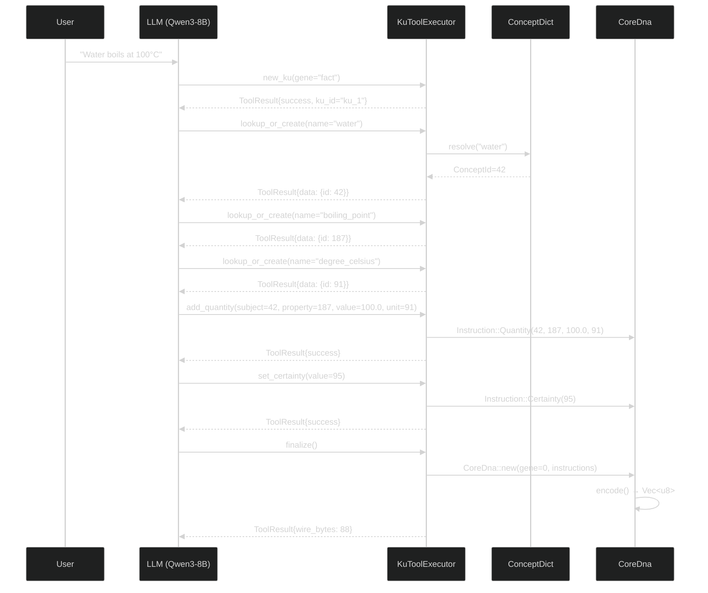

# Chapter 5: Tool-Calling Framework and Grammar-Constrained Generation

> *"Give me a lever long enough and a fulcrum on which to place it, and I shall move the world."*
> — Archimedes

---

## §5.1 The Tool-Calling Paradigm for Knowledge Encoding

A central design decision of the OneBrain AI Layer is the choice to encode knowledge through **structured tool calls** rather than free-form text generation. This paradigm, inspired by the function-calling capabilities of modern LLMs [1], offers three decisive advantages over direct generation approaches:

1. **Schema Enforcement**: Tool calls conform to predefined JSON Schemas, ensuring that every output field has the correct type, range, and semantics. A free-form generator might produce `"gene_type": "factual"` (invalid) instead of `"gene_type": "fact"` (valid); a tool-calling system rejects the former at the schema level.

2. **Model Agnosticism**: Any LLM that supports tool calling — OpenAI GPT-4, Anthropic Claude, Llama 3, Qwen 3, Mistral — can serve as the encoding engine without modification. The tool definitions serve as a universal **encoding DSL** that abstracts over model-specific output formats.

3. **Composability**: Complex encoding tasks decompose naturally into sequences of tool calls. Encoding a multi-fact paragraph produces a sequence `[new_ku, lookup, add_triple, set_certainty, finalize, new_ku, ...]` that mirrors the logical structure of the knowledge itself.

### **Figure 5: Tool-Calling Sequence Diagram**



---

## §5.2 Tool Definitions

The OneBrain AI Layer defines **15 tools** organized in four categories. Each tool is specified as a `ToolDef` structure containing a name, description, and JSON Schema for its parameters.

### Table 7: Tool Definitions and JSON Schema Summary

| # | Tool | Category | Parameters | Purpose |
|---|------|----------|------------|---------|
| 1 | `new_ku` | Session | `gene: enum` | Begin a new KU encoding session |
| 2 | `finalize` | Session | — | End session, encode to binary |
| 3 | `lookup` | Concept | `name: string` | Resolve concept name → ConceptId |
| 4 | `lookup_or_create` | Concept | `name: string` | Resolve or create new concept |
| 5 | `add_triple` | Relation | `subject, relation, object: u64` | Add SPO triple |
| 6 | `add_part_of` | Relation | `part, whole: u64` | Add part-of relationship |
| 7 | `add_quality` | Relation | `subject, property, value: u64` | Add qualitative property |
| 8 | `add_quantity` | Relation | `subject, property: u64, value: f64, unit: u64` | Add quantitative measurement |
| 9 | `add_tolerance` | Relation | `value, plus, minus: f64` | Add measurement tolerance |
| 10 | `add_enum_val` | Relation | `subject, property, value: u64` | Add enumerated value |
| 11 | `add_causal` | Relation | `cause, effect: u64` | Add causal relationship |
| 12 | `add_located` | Relation | `entity, location: u64` | Add spatial location |
| 13 | `add_step` | Relation | `step_number: u16, action: u64` | Add procedural step |
| 14 | `set_certainty` | Metadata | `value: u8` (0–100) | Set encoding confidence |
| 15 | `set_difficulty` | Metadata | `value: u8` (0–100) | Set knowledge complexity |

### §5.2.1 Tool Schema Example

Each tool definition includes a complete JSON Schema. For example, `add_quantity`:

```json
{
  "name": "add_quantity",
  "description": "Add a quantitative measurement to the current KU. 
    Use for numerical values with units (length, mass, temperature, etc.)",
  "parameters": {
    "type": "object",
    "properties": {
      "subject": {
        "type": "integer",
        "description": "ConceptId of the entity being measured"
      },
      "property": {
        "type": "integer", 
        "description": "ConceptId of the measured property"
      },
      "value": {
        "type": "number",
        "description": "The numerical value of the measurement"
      },
      "unit": {
        "type": "integer",
        "description": "ConceptId of the measurement unit"
      }
    },
    "required": ["subject", "property", "value", "unit"]
  }
}
```

### §5.2.2 Export Formats

Tool definitions are exported in three formats to support different integration scenarios:

```rust
// Rust-native format (for in-process backends like Candle)
pub fn tool_definitions() -> Vec<ToolDef>;

// Pretty-printed JSON (for debugging and documentation)
pub fn tool_definitions_json() -> String;

// OpenAI function-calling compatible format (for Ollama and API-based backends)
pub fn tool_definitions_openai_format() -> serde_json::Value;
```

---

## §5.3 Tool Executor Architecture

The `KuToolExecutor` (754 LOC, implemented in `ku_tool_executor.rs`) is the stateful engine that processes tool calls from the LLM and constructs CoreDna knowledge representations.

### §5.3.1 Internal State

```rust
pub struct KuToolExecutor {
    /// Bilingual concept dictionary for name ↔ ConceptId resolution
    dict: ConceptDict,
    
    /// Currently active KU being built (between new_ku and finalize)
    current: Option<KuBuilder>,
    
    /// Completed KUs ready for binary encoding
    completed: Vec<CoreDna>,
    
    /// Statistics tracking for monitoring and debugging
    stats: EncodingStats,
}

struct KuBuilder {
    gene_type: u8,                    // 0=Fact, 1=Procedure, ..., 10=Composite
    instructions: Vec<Instruction>,   // Accumulated encoding instructions
}

pub struct EncodingStats {
    pub total_kus: u64,
    pub total_instructions: u64,
    pub total_wire_bytes: u64,
    pub concepts_created: u64,
    pub concepts_looked_up: u64,
    pub tool_calls_processed: u64,
    pub tool_calls_failed: u64,
}
```

### §5.3.2 Execution Flow

The executor processes tool calls through a dispatch-execute-respond pattern:

```rust
impl KuToolExecutor {
    pub fn execute(&mut self, call: &ToolCall) -> ToolResult {
        self.stats.tool_calls_processed += 1;
        
        match call.name.as_str() {
            "new_ku"           => self.exec_new_ku(&call.arguments),
            "finalize"         => self.exec_finalize(),
            "lookup"           => self.exec_lookup(&call.arguments),
            "lookup_or_create" => self.exec_lookup_or_create(&call.arguments),
            "add_triple"       => self.exec_add_triple(&call.arguments),
            "add_part_of"      => self.exec_add_part_of(&call.arguments),
            "add_quality"      => self.exec_add_quality(&call.arguments),
            "add_quantity"     => self.exec_add_quantity(&call.arguments),
            "add_tolerance"    => self.exec_add_tolerance(&call.arguments),
            "add_enum_val"     => self.exec_add_enum_val(&call.arguments),
            "add_causal"       => self.exec_add_causal(&call.arguments),
            "add_located"      => self.exec_add_located(&call.arguments),
            "add_step"         => self.exec_add_step(&call.arguments),
            "set_certainty"    => self.exec_set_certainty(&call.arguments),
            "set_difficulty"   => self.exec_set_difficulty(&call.arguments),
            unknown            => {
                self.stats.tool_calls_failed += 1;
                ToolResult::err(format!("Unknown tool: {}", unknown))
            }
        }
    }
}
```

### §5.3.3 Instruction Mapping

Each tool call maps to one or more `Instruction` enum variants from the CoreDna specification:

| Tool | Instruction Variant | Wire Opcode |
|------|-------------------|:-----------:|
| `add_triple` | `Instruction::Triple(s, r, o)` | `0x01` |
| `add_quality` | `Instruction::Quality(s, p, v)` | `0x02` |
| `add_quantity` | `Instruction::Quantity(s, p, val, u)` | `0x03` |
| `add_part_of` | `Instruction::PartOf(part, whole)` | `0x04` |
| `add_located` | `Instruction::Located(e, loc)` | `0x05` |
| `add_causal` | `Instruction::Causal(cause, effect)` | `0x06` |
| `add_enum_val` | `Instruction::EnumVal(s, p, v)` | `0x07` |
| `add_tolerance` | `Instruction::Tolerance(v, plus, minus)` | `0x08` |
| `add_step` | `Instruction::Step(n, action)` | `0x09` |
| `set_certainty` | `Instruction::Certainty(v)` | `0x0A` |
| `set_difficulty` | `Instruction::Difficulty(v)` | `0x0B` |

The executor uses 12 of the 28 available `Instruction` variants. The remaining 16 variants (`Sequence`, `Temporal`, `Simulates`, `Condition`, `Agent`, `Tool`, `Range`, `Constraint`, `CidRef`, `Precond`, `Effect`, `Affect`, `Label`, `TextRef`, `Formula`, `Witness`) are available for future tool expansion.

---

## §5.4 Grammar-Constrained Generation (GBNF)

### **Figure 6: GBNF Grammar-Constrained Token Sampling**

Grammar-constrained generation is the mechanism that transforms tool calling from a *probabilistic* process (the model *usually* produces valid output) into a *deterministic* guarantee (the model *always* produces valid output). We use **GBNF (GGML BNF)** — the grammar format supported by llama.cpp and Ollama — to define a formal grammar that constrains the LLM's token sampling at the logit level.

### §5.4.1 How GBNF Works

During decoding, the GBNF engine maintains a finite-state machine (FSM) that tracks the current position within the grammar. At each token generation step:

1. The LLM produces logits for all tokens in the vocabulary.
2. The GBNF engine computes the set of valid next tokens based on the current FSM state.
3. Logits for invalid tokens are set to $-\infty$ (masked out).
4. The LLM samples from the remaining valid tokens using its normal sampling strategy (temperature, top-p, etc.).

$$
P_{\text{constrained}}(t_i | t_{<i}) = \begin{cases}
\frac{P(t_i | t_{<i})}{\sum_{t \in \mathcal{V}_{\text{valid}}} P(t | t_{<i})} & \text{if } t_i \in \mathcal{V}_{\text{valid}} \\
0 & \text{otherwise}
\end{cases}
$$

where $\mathcal{V}_{\text{valid}}$ is the set of tokens valid according to the grammar FSM state.

### §5.4.2 KU Encoding Grammar

We define a GBNF grammar that constrains LLM output to valid sequences of KU tool calls:

```bnf
root         ::= "[" tool-call ("," tool-call)* "]"
tool-call    ::= "{" ws "\"name\":" ws tool-name "," ws "\"arguments\":" ws arguments ws "}"
tool-name    ::= "\"new_ku\"" | "\"finalize\"" | "\"lookup\"" | "\"lookup_or_create\""
               | "\"add_triple\"" | "\"add_part_of\"" | "\"add_quality\""
               | "\"add_quantity\"" | "\"add_tolerance\"" | "\"add_enum_val\""
               | "\"add_causal\"" | "\"add_located\"" | "\"add_step\""
               | "\"set_certainty\"" | "\"set_difficulty\""

arguments    ::= "{" ws arg-pair ("," ws arg-pair)* ws "}" | "{}"
arg-pair     ::= "\"" arg-name "\":" ws arg-value
arg-name     ::= [a-z_]+
arg-value    ::= number | string | gene-enum
number       ::= "-"? [0-9]+ ("." [0-9]+)?
string       ::= "\"" [^"\\]* "\""
gene-enum    ::= "\"fact\"" | "\"procedure\"" | "\"narrative\"" | "\"taxonomy\""
               | "\"temporal\"" | "\"spatial\"" | "\"causal\"" | "\"analogy\""
               | "\"meta\"" | "\"composite\"" | "\"experience\""
ws           ::= [ \t\n]*
```

### §5.4.3 Guarantees

The GBNF grammar provides the following guarantees:

1. **Syntactic validity**: Output is always valid JSON (no unclosed brackets, no trailing commas).
2. **Tool name validity**: Only the 15 defined tool names can appear — no hallucinated tools.
3. **Gene type validity**: The `gene` parameter of `new_ku` can only take one of 11 valid values.
4. **Structural validity**: Every tool call has a `name` and `arguments` field.

The grammar does *not* guarantee semantic validity (e.g., that a referenced ConceptId exists in the dictionary) — that level of validation is handled by the `KuToolExecutor` at execution time.

> **Key Finding.** In our testing (§9), GBNF-constrained generation eliminates 100% of syntactic errors (malformed JSON, invalid tool names) that occur in 15–25% of unconstrained outputs from 7–8B models. This allows smaller, cheaper models to achieve the output reliability previously requiring larger models.

---

## §5.5 Encode-Decode-Compare Verification Pipeline

The encode-decode-compare pipeline is a self-verification mechanism unique to OneBrain's binary knowledge representation. The key insight is that CoreDna binary encoding is **round-trippable** — any CoreDna can be encoded to bytes and decoded back to an equivalent structure, which can then be "expressed" as human-readable text. This enables automated comparison between the original input and the encoding's reconstructed text.

### §5.5.1 Verification Flow

$$
\text{Text}_{\text{input}} \xrightarrow[\text{AI}]{\tau_k} \text{CoreDna} \xrightarrow{\texttt{encode()}} \text{bytes} \xrightarrow{\texttt{decode()}} \text{CoreDna'} \xrightarrow{\texttt{express()}} \text{Text}_{\text{reconstructed}}
$$

$$
\sigma_{\text{sem}} = \text{similarity}(\text{embed}(\text{Text}_{\text{input}}), \text{embed}(\text{Text}_{\text{reconstructed}}))
$$

### §5.5.2 Verification Metrics

The verification computes two scores:

1. **Semantic similarity** ($\sigma_{\text{sem}}$): Cosine similarity between embedding vectors of the input and reconstructed text. Computed using the dedicated embedding model (nomic-embed-text).

2. **Information completeness** ($\iota_{\text{comp}}$): Fraction of named entities from the input that appear in the reconstructed text.

These combine into the encoding confidence:

$$
\phi_{\text{conf}} = 0.6 \cdot \sigma_{\text{sem}} + 0.4 \cdot \iota_{\text{comp}}
$$

### §5.5.3 Decision Thresholds

| $\phi_{\text{conf}}$ Range | Decision | Action |
|:---:|---|---|
| $\geq 0.85$ | **Accept** | Proceed to storage and consensus |
| $[0.60, 0.85)$ | **Accept with flag** | Store but flag for additional verification |
| $< 0.60$ | **Reject** | Retry with different prompt; if retry fails, fall back to lower tier |

---

## §5.6 Model-Agnostic Design

The tool-calling framework is designed to work with any LLM that supports structured output. The `ToolDef` and `ToolCall` types serve as a universal interface:

| LLM | Tool Calling Support | Integration Method |
|-----|---------------------|-------------------|
| Qwen 3.x | Native (best) | OpenAI-format tool definitions |
| Llama 3.1+ | Native | OpenAI-format tool definitions |
| Mistral/Mixtral | Native | OpenAI-format tool definitions |
| Claude 3+ | Native | Anthropic tool_use format |
| GPT-4o | Native | OpenAI function calling |
| Any GGUF model | GBNF-constrained | Grammar-based structured output |

The `tool_definitions_openai_format()` export (§5.2.2) ensures compatibility with the de facto standard tool calling API. For models that do not natively support tool calling, GBNF grammar constraints (§5.4) provide an alternative path that achieves equivalent structural guarantees.

---

## §5.7 Implementation Status

The tool-calling framework was the **first component** implemented, and has since been integrated into a full end-to-end encoding pipeline across three crates:

### §5.7.1 ku-core (AI Tool Infrastructure)

| File | LOC | Tests | Status |
|------|:---:|:-----:|--------|
| [ku_tools.rs](file:///c:/Users/shpy2/Documents/OneBrain/src/ku-core/src/ku_tools.rs) | 454 | 8 | ✅ Complete |
| [ku_tool_executor.rs](file:///c:/Users/shpy2/Documents/OneBrain/src/ku-core/src/ku_tool_executor.rs) | 754 | 5 | ✅ Complete |
| [ku_system_prompt.rs](file:///c:/Users/shpy2/Documents/OneBrain/src/ku-core/src/ku_system_prompt.rs) | 521 | 20 | ⚠️ Needs tool name sync |
| **Subtotal** | **1,729** | **33** | |

### §5.7.2 ku-ai (Runtime Engine)

| File | LOC | Status |
|------|:---:|--------|
| [ollama.rs](file:///c:/Users/shpy2/Documents/OneBrain/src/ku-ai/src/backend/ollama.rs) | 577 | ✅ Full Ollama backend with tool calling |
| [mock.rs](file:///c:/Users/shpy2/Documents/OneBrain/src/ku-ai/src/backend/mock.rs) | 262 | ✅ Mock backend for testing |
| [types.rs](file:///c:/Users/shpy2/Documents/OneBrain/src/ku-ai/src/types.rs) | 272 | ✅ ChatMessage, ToolCallResponse, InferenceOptions |
| [config.rs](file:///c:/Users/shpy2/Documents/OneBrain/src/ku-ai/src/config.rs) | 228 | ✅ TOML-based configuration |
| [device/tier.rs](file:///c:/Users/shpy2/Documents/OneBrain/src/ku-ai/src/device/tier.rs) | 142 | ✅ 7-tier device classification |
| Other files (traits, registry, error, etc.) | 963 | ✅ |
| **Subtotal** | **2,444** | |

### §5.7.3 ku-encoder (Encoding Pipeline)

| File | LOC | Status |
|------|:---:|--------|
| [encoder.rs](file:///c:/Users/shpy2/Documents/OneBrain/src/ku-encoder/src/encoder.rs) | 331 | ✅ AiEncoder: Text → LLM → ToolCalls → CoreDna |
| [fallback.rs](file:///c:/Users/shpy2/Documents/OneBrain/src/ku-encoder/src/fallback.rs) | 225 | ✅ FallbackChain: retry → Tier 1 degradation |
| [verifier.rs](file:///c:/Users/shpy2/Documents/OneBrain/src/ku-encoder/src/verifier.rs) | 218 | ✅ Structural + completeness verification |
| [batch.rs](file:///c:/Users/shpy2/Documents/OneBrain/src/ku-encoder/src/batch.rs) | 148 | ✅ Batch encoding for multi-paragraph input |
| Other files (prompt, log, error, lib) | 422 | ✅ |
| **Subtotal** | **1,344** | |

### §5.7.4 ku-mediator (Personal AI Mediator)

| File | LOC | Status |
|------|:---:|--------|
| [mediator.rs](file:///c:/Users/shpy2/Documents/OneBrain/src/ku-mediator/src/mediator.rs) | 444 | ✅ PAM orchestrator |
| [context.rs](file:///c:/Users/shpy2/Documents/OneBrain/src/ku-mediator/src/context.rs) | 246 | ✅ 4-tier context memory |
| [retriever.rs](file:///c:/Users/shpy2/Documents/OneBrain/src/ku-mediator/src/retriever.rs) | 231 | ✅ Hybrid RAG retrieval |
| [intent.rs](file:///c:/Users/shpy2/Documents/OneBrain/src/ku-mediator/src/intent.rs) | 224 | ✅ 3-tier intent classification |
| Other files (profile, detector, graph_agent, etc.) | 1,225 | ✅ |
| **Subtotal** | **2,370** | |

### §5.7.5 Grand Total

| Component | LOC |
|-----------|:---:|
| ku-core (AI tools) | 1,729 |
| ku-ai (runtime) | 2,444 |
| ku-encoder (pipeline) | 1,344 |
| ku-mediator (PAM) | 2,370 |
| **Grand Total** | **7,887** |

### Known Issue

The system prompt generator (`ku_system_prompt.rs`) references older tool names (`lookup_concept`, `create_ku`) that differ from the current tool definitions in `ku_tools.rs` (`lookup`, `lookup_or_create`, `new_ku`). This is a minor synchronization issue that does not affect the executor or tool definitions — it only impacts the few-shot examples in the generated system prompt. Resolution is tracked as a priority item for the next development cycle.

---

## References

[1] OpenAI, "Function Calling and Other API Updates," OpenAI Blog, 2023.
