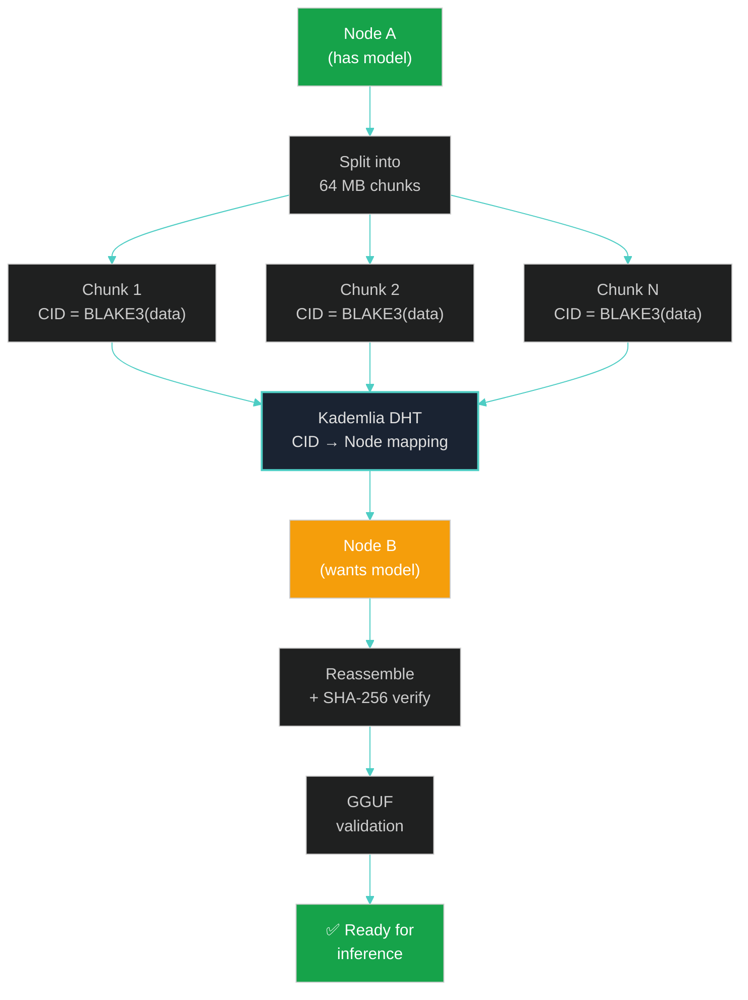

# Chapter 6: Device-Aware AI Runtime and Model Management

> *"Any sufficiently advanced technology is indistinguishable from magic."*
> — Arthur C. Clarke, *Profiles of the Future* (1962)

---

## §6.1 Local-First AI Runtime

The AI Layer's runtime engine executes all inference locally on the user's device. This is not a preference — it is an architectural invariant. The rationale is threefold:

1. **Privacy**: Knowledge contributions may contain proprietary, personal, or sensitive information. Transmitting this to a cloud API violates the fundamental trust model of a decentralized knowledge network.
2. **Availability**: A decentralized network must function without internet connectivity. Nodes operating on submarines, aircraft, field stations, or during network outages must still encode knowledge.
3. **Sovereignty**: The user owns their AI inference capability. No API provider can throttle, censor, or monetize access to the user's own encoding pipeline.

---

## §6.2 Runtime Framework Survey

We evaluated four candidate runtime frameworks against six criteria critical for OneBrain integration:

### Table 8: Local AI Runtime Framework Comparison

| Criterion | Weight | Ollama | llama.cpp | Candle | ONNX Runtime |
|-----------|:------:|:------:|:---------:|:------:|:------------:|
| **Ease of integration** | 0.20 | ⭐⭐⭐⭐⭐ | ⭐⭐⭐ | ⭐⭐⭐⭐ | ⭐⭐⭐ |
| **Rust compatibility** | 0.20 | ⭐⭐⭐ | ⭐⭐ | ⭐⭐⭐⭐⭐ | ⭐⭐⭐ |
| **Model ecosystem** | 0.15 | ⭐⭐⭐⭐⭐ | ⭐⭐⭐⭐⭐ | ⭐⭐⭐ | ⭐⭐⭐⭐ |
| **Performance** | 0.20 | ⭐⭐⭐⭐ | ⭐⭐⭐⭐⭐ | ⭐⭐⭐ | ⭐⭐⭐⭐ |
| **Structured output** | 0.15 | ⭐⭐⭐⭐⭐ | ⭐⭐⭐⭐⭐ | ⭐⭐ | ⭐ |
| **Cross-platform** | 0.10 | ⭐⭐⭐⭐ | ⭐⭐⭐⭐⭐ | ⭐⭐⭐⭐ | ⭐⭐⭐⭐⭐ |
| **Weighted Score** | | **7.5** | **7.4** | **6.7** | **5.5** |

**Recommendation: Phased approach.**

- **Phase 1 (Current)**: Ollama backend via REST API (`reqwest`). Simplest integration, best structured output support (GBNF), excellent model management (`ollama pull/run`). Trade-off: out-of-process, requires Ollama installation.
- **Phase 2 (Future)**: Candle/mistral.rs backend for in-process, pure-Rust inference. Eliminates external dependency. Trade-off: less mature model ecosystem.
- **Phase 3 (Long-term)**: llama.cpp FFI bindings for maximum performance on mobile/embedded. Trade-off: C FFI complexity.

---

## §6.3 Device Profiling and 7-Tier Classification

### **Figure 7: Device Tier Classification and Model Mapping**

The device profiler detects hardware capabilities at startup and classifies the node into one of seven tiers:

### Table 9: 7-Tier Device Classification

| Tier | Label | RAM | GPU | Example Devices | Max Model | Encoding Mode |
|:----:|-------|:---:|:---:|-----------------|:---------:|:-------------:|
| $T_0$ | Micro | ≤4 GB | None | RPi Zero, IoT | — | Tier 1 only |
| $T_1$ | Mobile | 6–8 GB | None/iGPU | Smartphones, RPi 4 | 1.7B Q4 | Tier 1–2 |
| $T_2$ | High Mobile | 8–12 GB | None/iGPU | High-end phones, tablets | 4B Q4 | Tier 1–2 |
| $T_3$ | Laptop | 16 GB | ≤6 GB | MacBook Air, mid-range laptop | 8B Q4_K_M | Tier 1–3 |
| $T_4$ | Desktop | 32 GB | 8–12 GB | Gaming PC, MacBook Pro | 14B Q4_K_M | Tier 1–3 |
| $T_5$ | Workstation | 64 GB | 24 GB | GPU workstation, Mac Studio | 32B Q8 | Tier 1–3 |
| $T_6$ | Server | 128+ GB | 48+ GB | Multi-GPU server | 70B+ FP16 | Tier 1–3 |

### §6.3.1 Detection Algorithm

```rust
pub fn classify_device() -> DeviceTier {
    let sys = System::new_all();
    let total_ram_gb = sys.total_memory() as f64 / (1024.0 * 1024.0 * 1024.0);
    let gpu = detect_gpu(); // NVML → Metal → Vulkan → None
    let vram_gb = gpu.map_or(0.0, |g| g.vram_gb());
    
    match (total_ram_gb, vram_gb) {
        (r, _) if r <= 4.0  => DeviceTier::T0,
        (r, _) if r <= 8.0  => DeviceTier::T1,
        (r, _) if r <= 12.0 => DeviceTier::T2,
        (r, v) if r <= 16.0 || v <= 6.0  => DeviceTier::T3,
        (r, v) if r <= 32.0 || v <= 12.0 => DeviceTier::T4,
        (r, v) if r <= 64.0 || v <= 24.0 => DeviceTier::T5,
        _ => DeviceTier::T6,
    }
}
```

### §6.3.2 GPU Detection Cascade

GPU detection follows a four-layer cascade to maximize hardware discovery:

1. **Layer 1 — Platform-specific**: NVML (NVIDIA), Metal Performance Shaders (Apple Silicon), ROCm (AMD).
2. **Layer 2 — Cross-platform**: Vulkan/wgpu device enumeration.
3. **Layer 3 — Heuristic**: Apple Silicon unified memory → estimate 75% GPU-available.
4. **Layer 4 — Fallback**: CPU-only classification.

### §6.3.3 Memory Budget Calculation

The model selector uses a conservative memory budget:

$$
B_{\text{model}} = R_{\text{total}} - R_{\text{os}} - R_{\text{kv}} - R_{\text{app}}
$$

where:

| Term | Definition | Value |
|------|-----------|-------|
| $R_{\text{total}}$ | Total system RAM | Detected |
| $R_{\text{os}}$ | OS reserve | Mobile: 55%, Desktop: min(4 GB, 30%), Server: 15% |
| $R_{\text{kv}}$ | KV-cache reserve | 1.5 GB (for 8K context, 8B model) |
| $R_{\text{app}}$ | OneBrain application memory | ~500 MB |

The model selector then finds the largest model that fits within $B_{\text{model}}$:

$$
m^* = \arg\max_{m \in \mathcal{M}} \text{params}(m) \quad \text{s.t.} \quad \text{size}(m, \mathcal{Q}) \leq B_{\text{model}}
$$

---

## §6.4 Model Selection Algorithm

The model selection algorithm considers four factors:

$$
\text{score}(m, T_i) = w_1 \cdot \text{fits}(m, T_i) + w_2 \cdot \text{quality}(m) + w_3 \cdot \text{efficiency}(m, T_i) + w_4 \cdot \text{privacy}(m)
$$

| Factor | Weight | Description |
|--------|:------:|-------------|
| `fits` | 0.40 | Binary: does the model fit in available memory? |
| `quality` | 0.30 | Expected encoding accuracy (Table 6, §4.3.2) |
| `efficiency` | 0.20 | Tokens/second on this hardware class |
| `privacy` | 0.10 | Local models score 1.0; network-assisted score lower |

**Selection constraint**: Models that don't fit in memory (`fits = 0`) are immediately eliminated. Among fitting models, the highest composite score wins.

---

## §6.5 Dual-Model Strategy

A critical architectural decision is the use of **two models simultaneously**:

1. **Primary LLM** — For encoding tasks (Tier 2/3). Size varies by device tier (1.7B–70B+).
2. **Embedding Companion** — For semantic search, deduplication, and verification. Always `nomic-embed-text` (137M parameters, ~300 MB).

The embedding model represents only **2–3% overhead** on any tier and provides capabilities that the primary LLM cannot efficiently offer:

| Capability | Primary LLM | Embedding Model |
|-----------|:-----------:|:---------------:|
| Text generation | ✓ | ✗ |
| Tool calling | ✓ | ✗ |
| Semantic similarity | Slow (~2s) | Fast (~10ms) |
| Batch embedding | Very slow | Optimized |
| Deduplication | Impractical | 100ms/compare |

---

## §6.6 Model Registry and Version Management

### Table 10: Model Registry Schema

The model registry is a curated JSON catalog that maps model identifiers to their metadata:

```json
{
  "models": [
    {
      "id": "qwen3-8b-q4km",
      "architecture": "qwen3",
      "parameters": "8B",
      "quantization": "Q4_K_M",
      "file_type": "gguf",
      "context_length": 8192,
      "source": {
        "repo": "Qwen/Qwen3-8B-GGUF",
        "filename": "qwen3-8b-q4_k_m.gguf",
        "revision": "main"
      },
      "file_size_bytes": 5527830528,
      "sha256": "a1b2c3d4...",
      "min_ram_gb": 6.0,
      "hardware_tier": "T3",
      "features": ["tool_calling", "structured_output", "multilingual"],
      "chat_template": "qwen3",
      "encoding_quality": 0.89
    }
  ]
}
```

### §6.6.1 Download Pipeline

Model downloads use a resumable, integrity-verified pipeline:

```
1. Check local storage → if exists and SHA-256 matches → done
2. HEAD request to HuggingFace → get file size, ETag
3. Check disk space (need size × 1.1 for temp file)
4. GET with Range header (resume from .partial file if exists)
5. Stream to .partial file with progress callback
6. Compute SHA-256 of complete file
7. Compare SHA-256 against registry → reject if mismatch
8. Atomic rename: .partial → .gguf
9. Validate GGUF: magic bytes (0x47475546), version, tensor count
```

### §6.6.2 GGUF Validation

GGUF files are validated at two levels:

1. **Header validation**: Check magic bytes (`GGUF`), version (2 or 3), metadata count, tensor count.
2. **Integrity validation**: SHA-256 hash comparison against the registry's recorded hash.

```rust
pub fn validate_gguf(path: &Path, expected_sha256: &str) -> Result<(), GgufError> {
    let file = File::open(path)?;
    let mut reader = BufReader::new(&file);
    
    // Check magic bytes
    let mut magic = [0u8; 4];
    reader.read_exact(&mut magic)?;
    if &magic != b"GGUF" {
        return Err(GgufError::InvalidMagic);
    }
    
    // Check version
    let version = reader.read_u32::<LittleEndian>()?;
    if version < 2 || version > 3 {
        return Err(GgufError::UnsupportedVersion(version));
    }
    
    // Verify SHA-256
    let hash = sha256_file(path)?;
    if hash != expected_sha256 {
        return Err(GgufError::HashMismatch { expected: expected_sha256.into(), actual: hash });
    }
    
    Ok(())
}
```

> **Security Note.** GGUF files are inherently safe — they contain only tensor data and metadata, with no executable code. SHA-256 verification prevents tampered model distribution. Future versions will add Sigstore digital signatures for publisher verification.

---

## §6.7 P2P Model Distribution via DHT

### **Figure 8: P2P Model Distribution via DHT**

Large model files (4–16 GB for typical GGUF files) can be distributed through the existing OneBrain P2P infrastructure, eliminating dependency on centralized model repositories:



**Distribution protocol:**

1. **Chunking**: The source node splits the GGUF file into 64 MB chunks. Each chunk receives a CID = BLAKE3(chunk_data).
2. **DHT Registration**: The source node publishes a manifest listing all chunk CIDs to the DHT under the model's registry ID.
3. **Discovery**: A requesting node queries the DHT for the model manifest, receives the chunk CID list.
4. **Parallel Download**: Chunks are downloaded in parallel from multiple peers that have them (BitTorrent-like swarming).
5. **Reassembly**: Chunks are reassembled in order. SHA-256 of the complete file is verified against the registry.
6. **Validation**: GGUF header and structure are validated.

This approach leverages the existing OBP network infrastructure (P2) — no new protocol layers are required.

---

## §6.8 Metabolism-Aware Scheduling

AI inference consumes significant computational resources — CPU cycles, GPU time, memory, and energy. The AI Layer integrates resource tracking with the PoMV framework (P4) [1]:

### §6.8.1 AI Metabolic Events

| Event | Metabolic Signal | PoMV Impact |
|-------|-----------------|-------------|
| Successful KU encoding | `ENCODING_SUCCESS` | Positive: increases metabolic rate |
| Encoding verification pass | `VERIFICATION_PASS` | Positive: increases trust signal |
| Model download completed | `MODEL_ACQUIRED` | Neutral: prerequisite activity |
| Encoding failure (retry) | `ENCODING_RETRY` | Slight negative: resource waste |
| Encoding consensus contribution | `CONSENSUS_CONTRIB` | Strong positive: network value |

### §6.8.2 Resource Budgeting

On battery-powered devices, the AI Layer implements resource budgeting:

$$
\text{budget}_{\text{daily}} = E_{\text{total}} \times r_{\text{ai}} \times \frac{\text{battery}}{100}
$$

where $E_{\text{total}}$ is the total daily energy budget (device-specific), $r_{\text{ai}}$ is the AI allocation fraction (default 0.15 = 15%), and battery is the current charge level. When the budget is exhausted, the system drops to Tier 1 (rule-based) encoding only until the device is recharged.

---

## References

[1] OneBrain Project, "Proof-of-Metabolic-Value: An Observation-Based Consensus Mechanism," OneBrain Technical Paper (P4), 2026.
