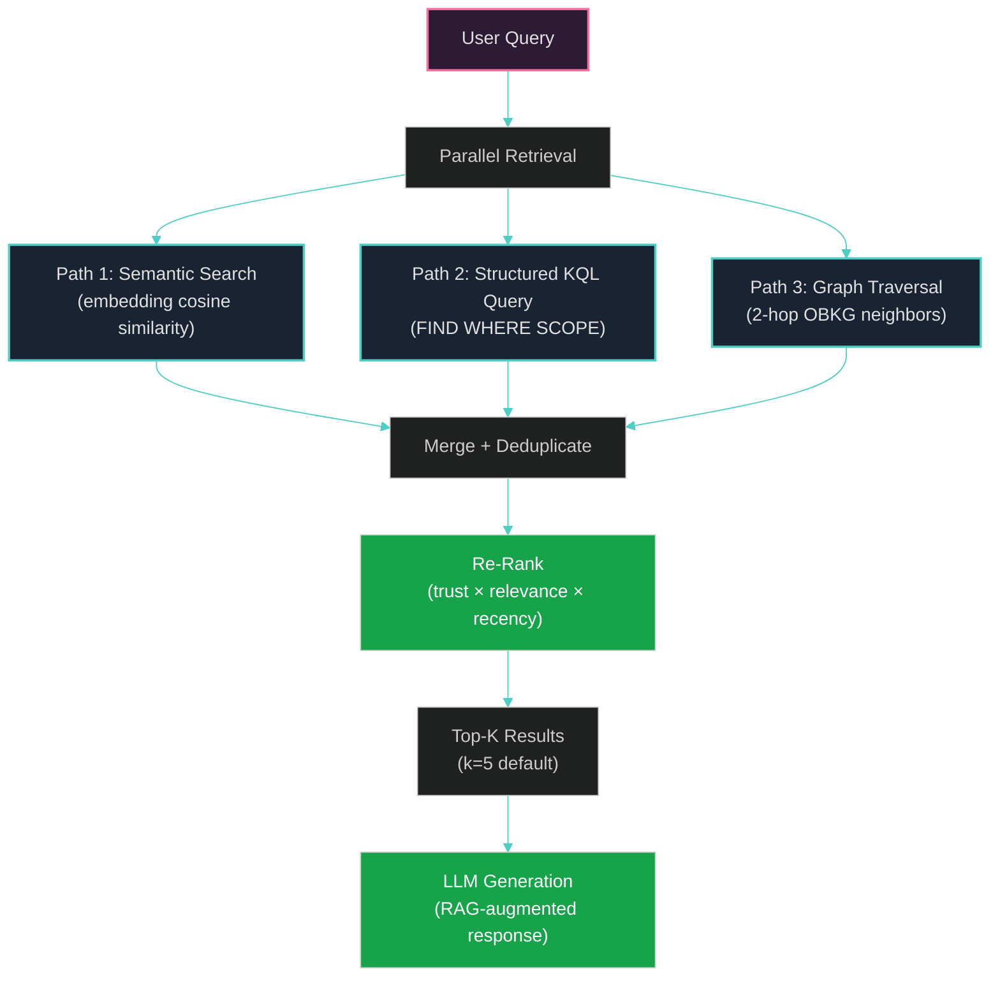

# Chapter 7: Personal AI Mediator

> *"The empires of the future are the empires of the mind."*
> — Winston Churchill, Speech at Harvard University (1943)

---

## §7.1 Concept and Motivation

The Personal AI Mediator (PAM) is the user-facing intelligence layer of OneBrain — the interface through which humans interact with the knowledge network. PAM transforms the technical complexity of Knowledge Unit encoding, retrieval, and graph exploration into natural conversation, adapting to each user's interests, expertise, and encoding style over time.

**Why a personal mediator?** The encoding pipeline (§4–5) and runtime engine (§6) provide the *capability* to convert text into Knowledge Units, but they operate at a mechanical level — processing text input and producing binary output. A mediator is needed to bridge the gap between human intention and machine capability:

- **Intent understanding**: When a user says "What do I know about neural networks?", the system must determine whether to search local KUs, query the distributed network, or traverse the knowledge graph.
- **Proactive encoding**: When a user shares information in conversation ("I just learned that mitochondria have their own DNA"), the system should recognize this as a knowledge encoding opportunity.
- **Knowledge gap detection**: By analyzing the user's knowledge profile against the network's knowledge landscape, PAM can suggest learning paths and identify areas where the user's knowledge is sparse or outdated.
- **Privacy mediation**: PAM decides what knowledge remains private, what is shared with trusted circles, and what is published to the network.

---

## §7.2 Intent Classification

PAM uses a **3-tier intent classification** system that mirrors the encoding pipeline's progressive complexity design:

### Table 11: PAM Intent Taxonomy

| Intent | Description | Classification Tier | Example |
|--------|-------------|:-------------------:|---------|
| `Encode` | User wants to encode knowledge | Tier 1 (keyword) | "Remember this: ..." |
| `Retrieve` | User wants to find knowledge | Tier 1 (keyword) | "What do I know about X?" |
| `Connect` | User wants to find relationships | Tier 2 (embedding) | "How does X relate to Y?" |
| `Synthesize` | User wants a summary or analysis | Tier 3 (LLM) | "Summarize what I know about physics" |
| `GraphQuery` | User wants structured graph traversal | Tier 2 (embedding) | "Show connections between X and Y" |
| `GraphExplore` | User wants open-ended exploration | Tier 3 (LLM) | "What's interesting around topic X?" |
| `ManageProfile` | User wants to change settings | Tier 1 (keyword) | "Change my language to Vietnamese" |
| `FreeChat` | General conversation | Tier 3 (LLM) | "Tell me about your architecture" |
| `Ambiguous` | Intent unclear | Tier 3 (LLM) | "neural networks" (query? encode? explore?) |

### §7.2.1 Three-Tier Classification

**Tier 1 — Keyword/Regex (~0 ms)**:
- Detects explicit intent markers: "remember", "save", "encode", "find", "search", "what is"
- High confidence (>0.95) when markers present
- Handles 40–50% of intents

**Tier 2 — Embedding Similarity (~10 ms)**:
- Computes cosine similarity between the input embedding and intent prototype embeddings
- Uses the dedicated embedding model (nomic-embed-text)
- Handles 30–35% of intents

**Tier 3 — LLM Reasoning (~500 ms–2 s)**:
- Full LLM classification for ambiguous inputs
- Required for 15–25% of intents
- Can also decompose compound intents ("Find everything about X and encode this new fact about Y")

---

## §7.3 Four-Tier Context Memory

PAM maintains a hierarchical memory system inspired by cognitive science models of human memory [1]:

| Tier | Capacity | Persistence | Content | Analogy |
|------|----------|-------------|---------|---------|
| **Working Context** | 4K–8K tokens | Session only | Current conversation turn | Working memory |
| **Core Memory** | 1K–2K tokens | Permanent | User profile, preferences, goals | Self-identity |
| **Episodic Memory** | Searchable | Permanent | Conversation summaries, key moments | Episodic memory |
| **Archival Memory** | Unlimited | Permanent | All KUs, OBKG graph, full conversation logs | Long-term memory |

### §7.3.1 Context Assembly

For each user interaction, PAM assembles a context window from all four tiers:

$$
\text{Context} = \underbrace{C_{\text{system}}}_{\sim 500} + \underbrace{C_{\text{core}}}_{\sim 500} + \underbrace{C_{\text{rag}}}_{\sim 2{,}000} + \underbrace{C_{\text{conversation}}}_{\sim 3{,}000} + \underbrace{C_{\text{response}}}_{\sim 500} = 8{,}000 \text{ tokens}
$$

---

## §7.4 Hybrid RAG Pipeline

### **Figure 9: PAM Hybrid RAG Pipeline**

PAM's retrieval-augmented generation pipeline combines three parallel retrieval strategies:



### §7.4.1 Path 1: Semantic Search

Using the dedicated embedding model, compute cosine similarity between the query embedding and all stored KU embeddings:

$$
\text{score}_{\text{sem}}(q, k) = \frac{\text{embed}(q) \cdot \text{embed}(k)}{|\text{embed}(q)| \cdot |\text{embed}(k)|}
$$

**Advantage**: Finds semantically related KUs even when they use different terminology.
**Limitation**: No structured filtering (cannot restrict by gene type, epistemic status, etc.).

### §7.4.2 Path 2: Structured KQL Query

PAM translates natural language queries into KQL using pattern matching:

| Natural Language | KQL Translation |
|-----------------|-----------------|
| "What do I know about X?" | `FIND (k:KU) WHERE k.has_concept(X) SCOPE local` |
| "Find peer-reviewed facts about X" | `FIND (k:KU) WHERE k.has_concept(X) AND k.epistemic_status >= "PeerReviewed"` |
| "Recent knowledge about X" | `FIND (k:KU) WHERE k.has_concept(X) ORDER BY k.timestamp DESC LIMIT 10` |

**Advantage**: Precise filtering by metadata (trust, epistemic status, gene type, timestamp).
**Limitation**: Requires explicit concept matching; misses semantic near-misses.

### §7.4.3 Path 3: Graph Traversal

Using the OBKG graph (P7), traverse 2-hop neighbors of concepts mentioned in the query:

$$
\text{Neighbors}_2(c) = \{c' : \exists \text{path}(c, c') \text{ with } |\text{path}| \leq 2 \text{ and } w(\text{path}) > \theta\}
$$

**Advantage**: Discovers contextually related knowledge that the user didn't explicitly ask about (serendipity).
**Limitation**: Can be noisy on densely connected graph regions.

### §7.4.4 Re-Ranking

Results from all three paths are merged, deduplicated by CID, and re-ranked using a composite score:

$$
\text{score}_{\text{final}}(k) = \alpha \cdot \text{trust}(k) + \beta \cdot \text{relevance}(k) + \gamma \cdot \text{recency}(k)
$$

Default weights: $\alpha = 0.4$, $\beta = 0.4$, $\gamma = 0.2$.

---

## §7.5 Knowledge Signal Detection

PAM monitors conversations for **knowledge signals** — indicators that the user has expressed information worth encoding:

### §7.5.1 Explicit Signals

| Signal | Pattern | Confidence |
|--------|---------|:----------:|
| Direct request | "Remember this: ..." | 1.0 |
| Save command | "Save this fact" | 0.95 |
| Definition | "X is defined as Y" | 0.85 |

### §7.5.2 Implicit Signals

| Signal | Pattern | Confidence |
|--------|---------|:----------:|
| Factual statement | "The boiling point of water is 100°C" | 0.70 |
| Causal claim | "X causes Y because Z" | 0.65 |
| Procedural description | "To do X, first Y, then Z" | 0.60 |

### §7.5.3 Encoding Decision

When a knowledge signal is detected, PAM follows one of three modes based on user preference:

| Mode | Behavior |
|------|----------|
| **Reactive** | Only encode when explicitly asked ("Remember this") |
| **Proactive** | Suggest encoding for implicit signals ("Would you like me to save this?") |
| **Auto** | Automatically encode high-confidence signals ($\phi > 0.80$) |

### §7.5.4 Deduplication Check

Before encoding, PAM checks for existing KUs with similar content:

$$
\text{max\_sim} = \max_{k \in \text{local\_KUs}} \sigma_{\text{sem}}(\text{candidate}, k)
$$

| $\text{max\_sim}$ | Action |
|:---:|---|
| $\geq 0.85$ | Skip (duplicate exists) |
| $[0.60, 0.85)$ | Suggest update to existing KU |
| $< 0.60$ | Create new KU |

---

## §7.6 Privacy Architecture

PAM implements a **four-layer privacy architecture** that gives users complete control over knowledge visibility:

| Layer | Visibility | Storage | Example |
|-------|-----------|---------|---------|
| **Private** | User only | Local redb | Personal notes, draft KUs, health data |
| **Circle** | Trusted peers | Encrypted, shared with selected nodes | Work-in-progress research, team knowledge |
| **Community** | Network participants | OneBrain P2P network | Published, self-encoded KUs |
| **Public** | Everyone | OneBrain P2P + public APIs | Peer-reviewed, fully-consensed KUs |

### §7.6.1 Privacy-Preserving Personalization

PAM's personalization data (interest profile, encoding style, query history) **never leaves the user's device**. Specifically:

- **User profile**: Stored in local `redb` database, encrypted at rest.
- **Conversation history**: Local-only, with configurable retention period.
- **Interest vectors**: Computed locally from interaction patterns.
- **Concept frequency**: Individual concept frequencies are never shared; only aggregate, differentially-private concept popularity statistics may be contributed to the network.

### §7.6.2 Federated Concept Popularity

The network can aggregate concept popularity across nodes using differential privacy:

$$
\text{pop}_{\text{shared}}(c) = \text{pop}_{\text{actual}}(c) + \text{Lap}\left(\frac{\Delta f}{\epsilon}\right)
$$

where $\text{Lap}(\cdot)$ is Laplace noise, $\Delta f = 1$ (sensitivity), and $\epsilon$ is the privacy budget (default $\epsilon = 1.0$). This enables network-level knowledge gap detection without revealing individual users' interests.

---

## §7.7 User Profile and Adaptation

PAM maintains a local user profile that evolves with each interaction:

```rust
pub struct UserProfile {
    pub preferred_language: Language,      // English, Vietnamese, etc.
    pub expertise_areas: Vec<(ConceptId, f64)>,  // (concept, proficiency)
    pub encoding_style: EncodingStyle,     // Verbose, Concise, Technical
    pub detail_level: DetailLevel,         // Minimal, Standard, Verbose
    pub proactive_encoding: EncodingMode,  // Reactive, Proactive, Auto
    pub most_queried_concepts: Vec<(ConceptId, u64)>,  // (concept, count)
    pub total_kus_encoded: u64,
    pub device_tier: DeviceTier,
    pub created_at: u64,
    pub last_active: u64,
}
```

### §7.7.1 Interest Profile Learning

Interest scores decay over time and are reinforced by interaction:

$$
\text{interest}(c, t) = \alpha \cdot \text{interest}(c, t-1) + (1 - \alpha) \cdot \text{signal}(c, t)
$$

$$
\text{interest}(c, t) \mathrel{*}= e^{-\lambda \cdot \Delta t}
$$

where $\alpha = 0.8$ (momentum), $\lambda = 0.01$ (daily decay rate), and $\Delta t$ is days since last interaction with concept $c$. This formulation ensures that interests naturally fade when not reinforced, while strongly-held interests persist over longer periods.

---

## §7.8 NL → KQL Translation

PAM includes a lightweight NL-to-KQL translator that converts natural language queries into structured KQL commands:

### §7.8.1 Pattern-Based Translation

| NL Pattern | KQL Template |
|-----------|-------------|
| "What do I know about `{X}`?" | `FIND (k:KU) WHERE k.has_concept({X})` |
| "How does `{X}` relate to `{Y}`?" | `FIND (e:EDGE) WHERE e.source.has_concept({X}) AND e.target.has_concept({Y})` |
| "Show me `{N}` facts about `{X}`" | `FIND (k:KU) WHERE k.has_concept({X}) AND k.gene_type = "Fact" LIMIT {N}` |
| "What's the most trusted knowledge about `{X}`?" | `FIND (k:KU) WHERE k.has_concept({X}) ORDER BY k.trust_score DESC LIMIT 5` |

### §7.8.2 Agentic Graph Agent

For complex queries that cannot be handled by pattern matching, PAM employs an agentic loop:

```
1. Generate KQL from NL (LLM)
2. Parse KQL (ku-kql parser)
3. If parse error → regenerate with error feedback (max 3 retries)
4. Execute KQL (LocalExecutor or DistributedQueryEngine)
5. Check if results sufficient
6. If insufficient → broaden scope (Local → Cluster → Global)
7. Synthesize natural language response from results
```

---

## References

[1] A. Baddeley, "Working Memory: Theories, Models, and Controversies," *Annual Review of Psychology*, vol. 63, 2012.
