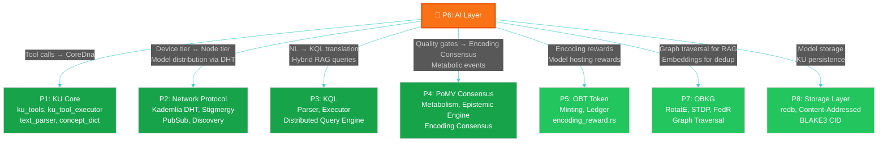

# Chapter 8: Cross-Pillar Integration

> *"No man is an island, entire of itself; every man is a piece of the continent, a part of the main."*
> — John Donne, *Devotions upon Emergent Occasions* (1624)

---

## §8.1 Integration Architecture Overview

The AI Layer (P6) integrates with all seven existing OneBrain pillars through clearly defined interfaces, following the **adapter pattern** established by OBKG (P7) [1] and OBT (P5) [2]. The fundamental constraint is: **the AI Layer adapts to existing pillars; existing pillars never change for the AI Layer.**

### **Figure 10: Cross-Pillar Integration Data Flow**



### Table 12: Cross-Pillar Integration Points

| Pillar | Direction | Interface | AI Layer Component | Pillar Files Modified |
|--------|-----------|-----------|-------------------|:---:|
| **P1 KU Core** | Read + Write | `CoreDna`, `Instruction`, `ConceptDict`, `TextParser` | Encoding Pipeline, Tool Executor | ❌ None |
| **P2 Network** | Read + Write | `NodeTier`, `DHT::store/find`, `PubSub::publish` | Model Distribution, PAM | ❌ None |
| **P3 KQL** | Read | `KqlParser::parse`, `LocalExecutor::execute` | PAM (NL → KQL) | ❌ None |
| **P4 PoMV** | Read + Write | `Metabolism::record_event`, `EncodingConsensus` | Quality Gate, Scheduling | ❌ None |
| **P5 OBT** | Write | `encoding_reward::calculate_reward` | Encoding Rewards | ❌ None |
| **P7 OBKG** | Read | `graph_embeddings`, `graph_bio::spreading_activation` | PAM (Hybrid RAG) | ❌ None |
| **P8 Storage** | Read + Write | `KuStorage::store/get`, `redb` tables | Model Storage, KU Persistence | ❌ None |

> **Key Result: Zero foundation modifications.** The AI Layer requires no changes to any existing pillar codebase. All integration is achieved through reading from and writing to existing public APIs.

---

## §8.2 P1 KU Core: Tool-Calling → CoreDna

The AI Layer's tightest integration is with P1 (KU Core), where the tool-calling framework directly constructs CoreDna knowledge representations:

**Existing P1 types used by P6:**
- `CoreDna` — The binary knowledge representation struct
- `Instruction` — Enum with 28 variants (AI Layer uses 12)
- `ConceptDict` — Bilingual concept name ↔ ID dictionary
- `ConceptId` — `u64` concept identifier
- `TextParser` — Rule-based parser for Tier 1 encoding
- `EncodingVerifier` — Round-trip verification

**Integration pattern:**
```rust
// AI Layer creates CoreDna using existing P1 types
let mut executor = KuToolExecutor::with_default_dict();

// Process LLM tool calls
for call in tool_calls {
    executor.execute(&call);
}

// Finalize → produces Vec<CoreDna> using P1's encode()
let encoded: Vec<Vec<u8>> = executor.finalize_all();
// encoded contains compact binary KU data (e.g., 88 bytes for a simple fact)
```

**No P1 modifications needed** — the tool executor uses only public P1 APIs (`CoreDna::new()`, `Instruction` enum, `ConceptDict::lookup()`).

---

## §8.3 P2 Network: Device-Tier Mapping and Model Distribution

The AI Layer integrates with P2 (Network Protocol) at two levels:

### §8.3.1 Device-Tier ↔ Node-Tier Mapping

P2's SWIM membership protocol classifies nodes into 7 tiers based on network fitness. The AI Layer's device classification produces a parallel tier for computational capability. These tiers inform each other:

| AI Device Tier | P2 Node Tier (typical) | Encoding Capability |
|:---:|:---:|---|
| $T_0$ (Micro) | Leaf | Tier 1 only, consumer of encoded KUs |
| $T_1$–$T_2$ (Mobile) | Contributor | Tier 1–2, basic encoding |
| $T_3$–$T_4$ (Desktop) | LocalSP | Full encoding, can serve as peer encoder |
| $T_5$–$T_6$ (Server) | RegionalSP+ | High-capacity encoder, model distribution hub |

### §8.3.2 Model Distribution via DHT

The existing Kademlia DHT (256 k-buckets, k=20) in P2 serves as the discovery layer for P2P model distribution (§6.7). Model chunk CIDs are stored as DHT entries using the same `DHT::store()` / `DHT::find_value()` APIs used for KU content addressing.

**No P2 modifications needed** — model chunks are treated as regular content-addressed data blocks, indistinguishable from KU data at the protocol level.

---

## §8.4 P3 KQL: AI-Powered Query Enhancement

The PAM (§7) uses P3's KQL infrastructure for structured knowledge retrieval:

**Integration points:**
- `KqlParser::parse()` — Parse AI-generated KQL queries
- `LocalExecutor::execute()` — Execute queries against local KU storage
- `QueryRouter` — Escalate queries across network scopes (Local → Cluster → Global)

**NL → KQL translation example:**

```
User: "What peer-reviewed facts do I know about photosynthesis?"

PAM translates to KQL:
  FIND (k:KU) 
  WHERE k.has_concept("photosynthesis") 
    AND k.gene_type = "Fact" 
    AND k.epistemic_status >= "PeerReviewed" 
  SCOPE local

If local results insufficient, escalate:
  FIND (k:KU) 
  WHERE k.has_concept("photosynthesis") 
    AND k.epistemic_status >= "PeerReviewed" 
  SCOPE cluster 
  LIMIT 20
```

**No P3 modifications needed** — PAM generates valid KQL strings and passes them through the standard parser → executor pipeline.

---

## §8.5 P4 PoMV: Encoding Consensus and Metabolic Integration

The AI Layer's deepest semantic integration is with P4 (Proof-of-Metabolic-Value):

### §8.5.1 Encoding Consensus Integration

The existing Encoding Consensus protocol (RAW → SELF → PART → FULL) was designed with the assumption of human encoders. The AI Layer transforms this into an automated process:

| Consensus Phase | Without AI Layer | With AI Layer |
|----------------|:---:|:---:|
| **RAW** | Author submits text manually | Author submits text |
| **SELF** | Author manually encodes to CoreDna | AI Layer auto-encodes (Tier 1/2/3) |
| **PART** | 3+ human peer encoders | 3+ AI encoders on peer nodes |
| **FULL** | 5+ humans agree | 5+ AI encoders agree |

This automation does not change the consensus protocol — it replaces the human encoder with an AI encoder that produces the same `CoreDna` output format.

### §8.5.2 Metabolic Event Generation

AI encoding activities generate metabolic events tracked by the PoMV framework:

```rust
// AI Layer generates metabolic events using P4's existing API
metabolism.record_event(MetabolicEvent::EncodingContribution {
    ku_cid: cid,
    encoding_tier: Tier::Three,
    confidence: 0.92,
    time_ms: 1847,
});
```

### §8.5.3 Epistemic Engine Feedback

The Epistemic Engine (P4) uses AI encoding quality signals as inputs for epistemic status transitions:

$$
\text{EpistemicStatus} \xrightarrow[\text{AI confidence} \geq 0.85]{\text{threshold met}} \text{EpistemicStatus}_{\text{next}}
$$

An AI encoding with $\phi_{\text{conf}} \geq 0.85$ contributes positively to the KU's epistemic trajectory. Multiple independent AI encodings from different nodes — each using potentially different models — provide the diversity signal that the PoMV framework requires for epistemic promotion.

---

## §8.6 P5 OBT: AI Contribution Rewards

The OBT token system (P5) rewards AI encoding contributions through the existing `encoding_reward.rs` module:

| Activity | OBT Reward | Source Module |
|----------|:----------:|:---:|
| Successful AI encoding | Base reward × quality multiplier | `encoding_reward.rs` |
| Peer encoding consensus contribution | Consensus participation reward | `encoding_reward.rs` |
| Model hosting (serving chunks to peers) | Storage reward | `obt_storage_reward.rs` |
| High-quality encoding (first to reach FULL) | Bonus reward | `encoding_reward.rs` |

The AI Layer does not modify the OBT reward formulas — it generates the same `EncodingContribution` events that human encoders would, and receives the same rewards.

---

## §8.7 P7 OBKG: Knowledge Graph for Intelligence

The OBKG knowledge graph (P7) provides critical intelligence capabilities to the AI Layer:

### §8.7.1 Hybrid RAG — Graph Traversal Path

PAM's graph traversal path (§7.4.3) uses OBKG's spreading activation to discover contextually relevant KUs:

```rust
// Use P7's spreading activation for 2-hop graph traversal
let related = graph_bio::spreading_activation(
    start_concepts,
    max_hops: 2,
    min_weight: 0.3,
    max_results: 20,
);
```

### §8.7.2 Embedding-Based Deduplication

OBKG's RotatE embeddings (64-dim complex, quantized to int8) provide a fast similarity check for KU deduplication:

$$
\text{sim}(e_1, e_2) = 1 - \frac{d_{\text{RotatE}}(e_1, e_2)}{d_{\max}}
$$

This enables PAM to detect near-duplicate KUs before encoding, saving resources.

### §8.7.3 Knowledge Gap Detection

PAM uses OBKG's graph structure to identify knowledge gaps — concepts with few or low-trust bonds that could benefit from additional encoding:

$$
\text{gap\_score}(c) = \frac{1}{|\text{bonds}(c)| + 1} \times \frac{1}{\overline{\text{trust}}(c) + \epsilon}
$$

Concepts with high gap scores are suggested to users as learning or encoding opportunities.

---

## §8.8 P8 Storage: Model and KU Persistence

The AI Layer uses P8's storage infrastructure for two purposes:

### §8.8.1 KU Storage

Encoded Knowledge Units are persisted through P8's existing `KuStorage`:

```rust
// Store AI-encoded KU using P8's existing API
let cid = ku_storage.store(&encoded_bytes)?;
// cid = BLAKE3 hash of the encoded bytes
```

### §8.8.2 Model Storage

AI model files (GGUF format) are stored in a platform-specific data directory managed by the `directories` crate:

| Platform | Model Storage Path |
|----------|-------------------|
| Linux | `~/.local/share/onebrain/models/` |
| macOS | `~/Library/Application Support/OneBrain/models/` |
| Windows | `%LOCALAPPDATA%\OneBrain\models\` |

Model metadata (registry, config, download state) is stored in the same `redb` database used by P8 for KU storage, using a separate table namespace to avoid interference.

---

## §8.9 Adapter Pattern: Design Validation

We verify the adapter pattern by counting lines of code modified in each pillar by the AI Layer:

| Pillar | Files Added by AI Layer | Existing Files Modified | LOC Changed |
|--------|:---:|:---:|:---:|
| P1 KU Core | 0 | 0 | 0 |
| P2 Network Protocol | 0 | 0 | 0 |
| P3 KQL | 0 | 0 | 0 |
| P4 PoMV Consensus | 0 | 0 | 0 |
| P5 OBT Token | 0 | 0 | 0 |
| P7 OBKG | 0 | 0 | 0 |
| P8 Storage Layer | 0 | 0 | 0 |
| **P6 AI Layer** | **3 crates** | **N/A (new)** | **7,887** |

> **Validation Result: Zero cross-pillar modifications.** The AI Layer is fully additive — it introduces 3 new crates and modifies zero existing files. This validates the adapter pattern and ensures that the AI Layer can be developed, tested, and deployed independently of the foundation pillars.

This result mirrors the integration patterns of OBKG (P7, 13 modules, 0 foundation modifications) [1] and OBT (P5, 10 modules, 0 foundation modifications) [2], confirming that the OneBrain architecture supports extensibility through composition.

---

## References

[1] OneBrain Project, "OneBrain Knowledge Graph: A Bio-Inspired, Decentralized Knowledge Graph," OneBrain Technical Paper (P7), 2026.

[2] OneBrain Project, "OneBrain Token: A Knowledge Utility Token with Account-Chain Ledger," OneBrain Technical Paper (P5), 2026.
