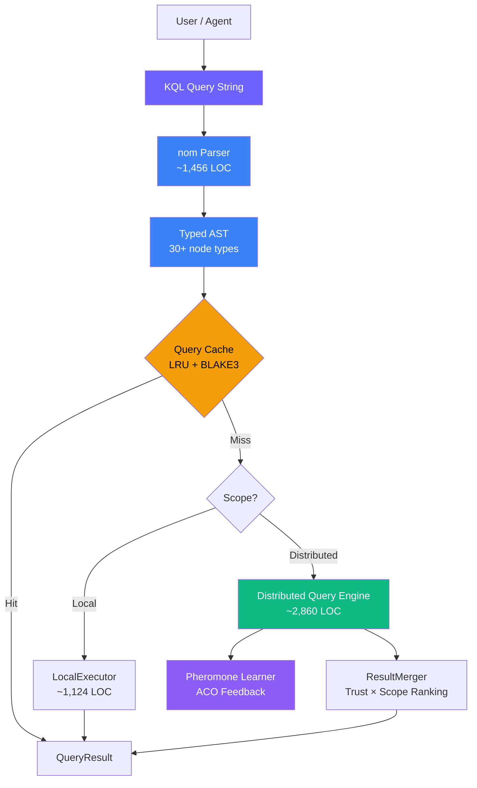

# 1. Introduction

## 1.1 Problem Statement

The emergence of decentralized knowledge networks — peer-to-peer systems designed to store, share, and discover structured human knowledge — creates a fundamental query language design challenge. Unlike traditional databases, where a query engine has complete visibility over the dataset, a decentralized knowledge network distributes data across thousands or millions of autonomous nodes. No single node holds the complete knowledge graph.

Existing query languages fail to address this environment:

**SQL** [1] assumes a centralized relational store with complete schema visibility, ACID transactions across the entire dataset, and deterministic query planning. In a decentralized network, the "database" spans thousands of nodes, the schema is implicit in Knowledge Unit structure, and transactions are replaced by eventual consistency through CRDTs.

**SPARQL** [2] provides rich graph pattern matching over RDF triples but assumes a single-endpoint query model. Federated SPARQL (SERVICE keyword) requires explicit endpoint enumeration — impractical when endpoints are anonymous P2P nodes that join and leave dynamically.

**Cypher** [3] (Neo4j) offers an intuitive graph query syntax but is designed for a single-server property graph database. It has no concept of query scoping, distributed routing, or trust-aware result ranking.

**GraphQL** [4] provides a flexible API query language but focuses on client-server interaction patterns, not peer-to-peer knowledge discovery. It lacks aggregation, standing queries, and knowledge lifecycle management.

**XQuery** [5] and **Datalog** [6] address specific data model requirements (XML trees and recursive logic programs, respectively) but neither handles the unique challenges of trust-annotated, CRDT-synchronized, bio-inspired knowledge units.

None of these languages provides:
- **Scoped distributed execution**: "Search my local store, then my neighbors, then the DHT, then globally"
- **Trust-aware ranking**: "Rank results by trust_score × proximity"
- **Standing reactive queries**: "Notify me whenever new knowledge matching these criteria appears"
- **Knowledge lifecycle management**: "Deprecate this knowledge with a reason and signature"
- **Query plan introspection**: "Show me how this query will be executed across the network"
- **Bio-inspired knowledge types**: "Filter by gene type (Fact, Hypothesis, Procedure) and epistemic status"

## 1.2 Motivation: Why a New Query Language?

The OneBrain knowledge network stores data in **Knowledge Units (KUs)** [7] — bio-inspired data structures with 11 gene types, 33 bond types, epistemic status tracking, CRDT-based trust scores, and multi-dimensional metadata. Querying this data requires a language that understands:

1. **Knowledge-specific types**: Gene types (Fact, Hypothesis, Procedure, Analogy, Narrative, etc.), epistemic status (Rumor → Observation → Evidence → Theorem → Law), and evidence types (Anecdotal, Statistical, Experimental, etc.)
2. **Trust and verification**: Trust scores, confidence intervals, corroboration counts, challenge histories, and verification levels — all of which are CRDT-backed and continuously evolving.
3. **Distributed execution topology**: The query must decide where to execute — locally for speed, on neighbors for breadth, on the DHT for global reach, or via stigmergy trails for semantic expertise routing.
4. **Reactive knowledge monitoring**: In a dynamic knowledge network, users need continuous notification when knowledge matching their interests arrives — not just point-in-time queries.
5. **Knowledge deprecation with provenance**: Knowledge becomes obsolete, superseded, or disproven. The query language must support first-class deprecation with reason and authorship tracking.

KQL is designed as the native query interface for this environment — "SQL for decentralized knowledge graphs."

## 1.3 Design Principles

KQL follows six design principles:

1. **Declarative, not imperative.** Users express *what* they want, not *how* to retrieve it. The query engine handles routing, caching, and optimization.

2. **SQL-familiar syntax.** Existing developer intuitions from SQL should transfer directly. `FIND ... WHERE ... ORDER BY ... LIMIT` mirrors `SELECT ... WHERE ... ORDER BY ... LIMIT`.

3. **Graph-native patterns.** Node and edge patterns use Cypher-inspired syntax: `(k:KU)` for nodes, `-[r:BondType]->` for edges.

4. **Scope-first distribution.** Every query has a scope — explicit or inferred — that controls distribution breadth. The `SCOPE` clause is a first-class language construct, not a configuration option.

5. **Trust is a first-class citizen.** Trust scores, epistemic status, and evidence types are queryable fields, not external annotations. Aggregation functions (`AVG(k.trust_score)`) work natively over trust metadata.

6. **Lifecycle completeness.** KQL covers the full knowledge lifecycle: create (`CREATE`), read (`FIND`), update (`UPDATE`), monitor (`WATCH`), introspect (`EXPLAIN`), and retire (`DEPRECATE`). No external tools needed.

*Figure 1: KQL query processing pipeline. Queries are parsed into a typed AST, checked against an LRU cache, then executed locally or distributed across the P2P network.*

## 1.4 Contributions

This paper makes the following contributions:

1. **A declarative query language for decentralized knowledge graphs** (§3) with 6 query types, graph pattern matching, trust-aware filtering, and knowledge-specific type integration.

2. **A SCOPE clause for explicit distributed execution control** (§3.2, §4.2) providing 6 escalation levels from local execution to global flooding, enabling users to trade latency for completeness.

3. **Standing reactive queries (WATCH)** (§3.5) with event-driven notification, filter propagation, and TTL-based lifecycle management — absent from all existing graph query languages.

4. **A nom-based recursive descent parser** (§4.1) producing a rich typed AST with 30+ node types, supporting case-insensitive keywords, nested boolean conditions, aggregation functions, and graph edge patterns.

5. **Three novel knowledge discovery engines** (§5) integrated into the query pipeline: a Knowledge Gap Detector (identifying missing knowledge), a Swanson ABC Bridge Finder (cross-domain undiscovered public knowledge), and a Serendipity Engine (surfacing unknown unknowns).

6. **Pheromone-based query routing reinforcement** (§5.4) that closes the feedback loop between query results and network routing, enabling self-optimizing distributed query execution.

## 1.5 Paper Organization

The remainder of this paper is organized as follows. Section 2 surveys related work in query languages for distributed and graph systems. Section 3 presents the KQL language specification with formal grammar and semantics. Section 4 describes the parser and executor implementation. Section 5 covers the distributed query engine, discovery engines, and pheromone learning. Section 6 evaluates the implementation through test coverage, performance analysis, and comparisons. Section 7 discusses findings, limitations, and future work.

---

## References

[1] ISO/IEC 9075:2023, "Information technology — Database languages — SQL," International Organization for Standardization, 2023.

[2] W3C, "SPARQL 1.1 Query Language," W3C Recommendation, Mar. 2013.

[3] N. Francis *et al.*, "Cypher: An Evolving Query Language for Property Graphs," in *Proc. ACM SIGMOD '18*, pp. 1433–1445, 2018.

[4] Facebook, "GraphQL: A Query Language for APIs," 2015. [Online]. Available: https://graphql.org/

[5] W3C, "XQuery 3.1: An XML Query Language," W3C Recommendation, Mar. 2017.

[6] S. Ceri, G. Gottlob, and L. Tanca, "What You Always Wanted to Know About Datalog (And Never Dared to Ask)," *IEEE TKDE*, vol. 1, no. 1, pp. 146–166, 1989.

[7] OneBrain Project, "Knowledge Unit: A Bio-Inspired Knowledge Representation for Decentralized Knowledge Networks," 2026 (companion paper).
