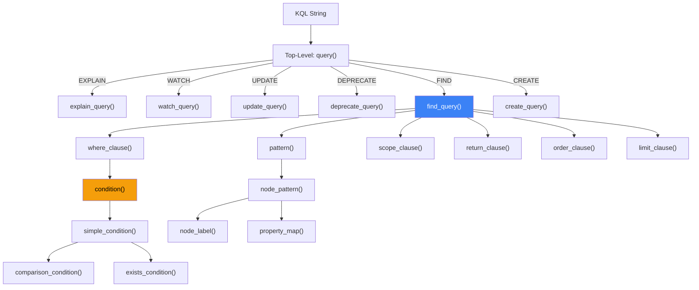

# 4. Parser and Local Executor Implementation

This section describes the implementation of KQL's parser (nom-based recursive descent) and local executor, covering AST design, parsing strategy, execution model, and persistent storage.

## 4.1 Abstract Syntax Tree (AST)

The KQL AST ([ast.rs](file:///c:/Users/shpy2/Documents/OneBrain/src/ku-kql/src/ast.rs), 361 LOC) defines a typed representation of parsed queries. The top-level `Query` enum branches into six variants:

```rust
pub enum Query {
    Find(FindQuery),
    Create(CreateQuery),
    Update(UpdateQuery),
    Deprecate(DeprecateQuery),
    Watch(WatchQuery),
    Explain(Box<Query>),
}
```

### 4.1.1 AST Node Types (30+)

| Category | Types | Purpose |
|----------|-------|---------|
| **Queries** | `FindQuery`, `CreateQuery`, `UpdateQuery`, `DeprecateQuery`, `WatchQuery` | 5 query type containers |
| **Patterns** | `Pattern`, `NodePattern`, `EdgePattern`, `NodeLabel`, `EdgeDirection` | Graph pattern representation |
| **Conditions** | `Condition` (6 variants: `Comparison`, `And`, `Or`, `Not`, `Exists`, `Contains`) | Boolean expression tree |
| **Values** | `Value` (8 variants: `Integer`, `Float`, `Text`, `Bool`, `ConceptId`, `EpistemicStatus`, `EvidenceType`, `Role`) | Type-safe literal representation |
| **Expressions** | `ReturnExpr`, `AggFunc` (5), `OrderExpr`, `FieldPath`, `Assignment`, `Property` | Return, aggregation, ordering, assignment |
| **Scope** | `Scope` (6 variants) | Distribution control |
| **Watch** | `WatchEvent` (4 variants) | Event filter type |
| **Comparison** | `CompOp` (6 variants: `Eq`, `NotEq`, `Gt`, `GtEq`, `Lt`, `LtEq`) | Comparison operators |

**Design choice: typed Values.** The `Value` enum includes knowledge-specific types (`EpistemicStatus`, `EvidenceType`, `Role`) alongside standard types (`Integer`, `Float`, `Text`, `Bool`). This enables type-safe condition evaluation against KU metadata — `k.epistemic_status = Evidence` is a typed comparison, not a string match.

### 4.1.2 FindQuery Structure

The `FindQuery` struct demonstrates the completeness of the AST:

```rust
pub struct FindQuery {
    pub pattern: Pattern,                    // (k:KU) or (c:Concept)
    pub where_clause: Option<Condition>,     // WHERE k.trust > 8000
    pub scope: Scope,                        // SCOPE LOCAL | ... | AUTO
    pub return_clause: Option<Vec<ReturnExpr>>,  // RETURN COUNT(k)
    pub limit: Option<u32>,                  // LIMIT 10
    pub order_by: Option<Vec<OrderExpr>>,    // ORDER BY k.trust DESC
}
```

Each query type contains precisely the fields needed for its execution — no more, no less. The `WatchQuery` wraps a `FindQuery` with event and notification metadata. The `Explain` variant wraps any other query in a `Box<Query>`.

## 4.2 Parser Architecture

The parser ([parser.rs](file:///c:/Users/shpy2/Documents/OneBrain/src/ku-kql/src/parser.rs), 1,310 LOC) uses the **nom** parser combinator library [1] to transform KQL strings into AST nodes.

### 4.2.1 Parser Design

The parser follows a **top-down recursive descent** strategy with nom combinators:



*Figure 3: Parser function call hierarchy. Each function returns `IResult<&str, T>` — either the remaining input and parsed value, or an error.*

### 4.2.2 Key nom Combinators Used

| Combinator | Purpose | Usage |
|-----------|---------|-------|
| `alt()` | Try alternatives | `alt((find_query, create_query, ...))` |
| `tag_no_case()` | Case-insensitive keyword | `tag_no_case("FIND")` |
| `opt()` | Optional clause | `opt(where_clause)` |
| `separated_list1()` | Comma-separated lists | `separated_list1(char(','), property)` |
| `delimited()` | Bracketed content | `delimited(char('('), ..., char(')'))` |
| `preceded()` | Skip prefix | `preceded(tag("BY"), field_path)` |
| `map()` | Transform result | `map(find_query, Query::Find)` |
| `map_res()` | Transform with error | `map_res(digit1, str::parse::<u32>)` |
| `value()` | Constant result | `value(Scope::Local, tag_no_case("LOCAL"))` |
| `tuple()` | Sequence | `tuple((multispace1, tag("BY"), multispace1))` |

### 4.2.3 Error Handling

The parser wraps nom errors in a `ParseError` struct with human-readable messages and position information:

```rust
pub struct ParseError {
    pub message: String,   // "Parse error: ..."
    pub position: usize,   // Character offset of error
}
```

After parsing, the parser verifies that **no trailing input remains** — preventing partial parses from silently succeeding.

### 4.2.4 Boolean Condition Parsing

The condition parser handles operator precedence through recursive structure:

```
condition → simple_condition [("AND" | "OR") condition]
simple_condition → exists_condition | comparison_condition
```

This right-recursive grammar produces right-associative AND/OR trees. For example:

```
k.a > 1 AND k.b < 2 AND k.c = 3
```

Parses as: `And(a>1, And(b<2, c=3))`.

## 4.3 Local Executor

The local executor ([executor.rs](file:///c:/Users/shpy2/Documents/OneBrain/src/ku-kql/src/executor.rs), 1,124 LOC) evaluates KQL queries against an in-memory KU collection.

### 4.3.1 Executor Architecture

```rust
pub struct LocalExecutor {
    kus: Vec<KnowledgeUnit>,                 // In-memory KU store
    watches: Vec<(WatchId, WatchQuery)>,      // Standing query registrations
    next_watch_id: WatchId,                   // Auto-incrementing watch ID
}
```

**Execution flow for FIND queries:**

```
Algorithm 1: FIND Execution
INPUT: FindQuery { pattern, where, scope, return, order, limit }
OUTPUT: QueryResult { rows, total_count, aggregates }

1. candidates ← filter(kus, where_clause)    // Apply WHERE condition
2. IF order_by ≠ ∅:
       sort(candidates, order_exprs)          // Multi-key stable sort
3. total ← |candidates|
4. aggregates ← compute_aggregates(candidates, return_clause)
5. IF limit ≠ ∅:
       truncate(candidates, limit)
6. RETURN QueryResult {
       rows: candidates,
       total_count: total,
       aggregates: aggregates,
       scope_used: scope
   }
```

### 4.3.2 Condition Evaluation

The `evaluate_condition(ku, condition)` function recursively evaluates the boolean expression tree:

```rust
fn evaluate_condition(ku: &KnowledgeUnit, cond: &Condition) -> bool {
    match cond {
        Condition::Comparison { field, op, value } => {
            let extracted = extract_field_value(ku, field);
            compare_values(&extracted, op, value)
        },
        Condition::And(left, right) =>
            evaluate_condition(ku, left) && evaluate_condition(ku, right),
        Condition::Or(left, right) =>
            evaluate_condition(ku, left) || evaluate_condition(ku, right),
        Condition::Not(inner) =>
            !evaluate_condition(ku, inner),
        Condition::Exists(field) =>
            extract_field_value(ku, field) != ExtractedValue::None,
        Condition::Contains { field, value } =>
            field_contains(ku, field, value),
    }
}
```

**Field extraction** maps dotted paths to KU struct fields (28 fields total):

*Core DNA Fields:*

| Field Path | Extracted From | Type Coercion |
|-----------|---------------|----------------|
| `gene_type` | `ku.gene_type()` → name string | u8 → Text |
| `primary_concept` | `ku.primary_concept()` | u64 → i64 |
| `certainty` | `ku.certainty()` | u16 → i64 |
| `difficulty` | `ku.difficulty()` | u16 → i64 |
| `instruction_count` | `ku.instruction_count()` | usize → i64 |
| `has_triple` | `ku.has_triple()` | bool |
| `has_step` | `ku.has_step()` | bool |
| `wire_size` | `ku.wire_size()` | usize → i64 |

*Epigenetics Fields:*

| Field Path | Extracted From | Type Coercion |
|-----------|---------------|----------------|
| `trust_score` | `ku.epi.trust.trust_score` | u16 → i64 |
| `confidence` | `ku.epi.trust.confidence` | u16 → i64 |
| `verification_level` | `ku.epi.trust.verification_level` | u8 → i64 |
| `corroboration_count` | `ku.epi.trust.corroboration_count` | u16 → i64 |
| `challenge_count` | `ku.epi.trust.challenge_count` | u16 → i64 |
| `error_susceptibility` | `ku.epi.trust.error_susceptibility` | u16 → i64 |
| `bond_count` | `ku.bond_count()` | usize → i64 |
| `epistemic_status` | `ku.epi.epistemic_status` | u8 → Text (11 values) |
| `evidence_type` | `ku.epi.evidence_type` | u8 → i64 |

*PoMV Signal Fields:*

| Field Path | Extracted From | Type Coercion |
|-----------|---------------|----------------|
| `metabolic_rate` | `ku.epi.trust.metabolic_rate` | u16 → i64 |
| `prediction_score` | `ku.epi.trust.prediction_score` | u16 → i64 |
| `entropy_at_creation` | `ku.epi.trust.entropy_at_creation` | u16 → i64 |
| `survival_score` | `ku.epi.trust.survival_score` | u16 → i64 |
| `synaptic_centrality` | `ku.epi.trust.synaptic_centrality` | u16 → i64 |
| `niche_fitness` | `ku.epi.trust.niche_fitness` | u16 → i64 |

*Expression Fields:*

| Field Path | Extracted From | Type Coercion |
|-----------|---------------|----------------|
| `text` | `ku.expr?.text` | Option → Text |

*System Fields:*

| Field Path | Extracted From | Type Coercion |
|-----------|---------------|----------------|
| `epi` | always `true` (v6) | bool |
| `expression` | `ku.expr.is_some()` | bool |
| `encoding_status` | `ku.encoding_status` | EncodingStatus → Text |
| `cid` | `ku.cid` | [u8; 32] → hex Text |

### 4.3.3 Aggregation Engine

The aggregation engine processes `ReturnExpr::Aggregate` expressions over the filtered result set:

$$\text{COUNT}(f) = |\{ku : f(ku) \neq \text{None}\}|$$

$$\text{SUM}(f) = \sum_{ku \in S} f(ku), \quad \text{AVG}(f) = \frac{\text{SUM}(f)}{\text{COUNT}(f)}$$

$$\text{MIN}(f) = \min_{ku \in S} f(ku), \quad \text{MAX}(f) = \max_{ku \in S} f(ku)$$

Results are returned as `AggregateResult { name, value: AggValue }`, where `AggValue` is either `Integer(i64)` or `Float(f64)`.

### 4.3.4 Watch Engine

The local executor maintains a vector of `(WatchId, WatchQuery)` registrations. On each `insert()` or mutation, `check_watches(&self, ku)` evaluates all registered watches against the affected KU:

```rust
pub fn check_watches(&self, ku: &KnowledgeUnit) -> Vec<WatchId> {
    self.watches.iter()
        .filter(|(_, watch)| {
            if let Some(ref cond) = watch.find.where_clause {
                evaluate_condition(ku, cond)
            } else {
                true  // No condition = match all
            }
        })
        .map(|(id, _)| *id)
        .collect()
}
```

The `unwatch(watch_id)` function removes a registration, returning `true` if found.

## 4.4 Persistent Storage

The storage module ([storage.rs](file:///c:/Users/shpy2/Documents/OneBrain/src/ku-kql/src/storage.rs), 447 LOC) provides **ACID-compliant persistent KU storage** using the `redb` embedded database [2].

### 4.4.1 Table Schema

| Table | Key | Value | Purpose |
|-------|-----|-------|---------|
| `kus` | CID (BLAKE3 hash, 32 bytes) | Encoded KU bytes (CBOR wire format) | Primary storage |
| `index_trust` | trust_score (u16 BE) + CID (32B) | Empty | Trust score range queries |
| `index_concept` | concept_id (u64 BE) + CID (32B) | Empty | Concept ID lookups |

**Content addressing:** The CID (Content IDentifier) is computed as `BLAKE3(encode_knowledge_unit(ku))` — the BLAKE3 hash of the KU's wire format encoding. This guarantees:
- **Deterministic**: Same KU content → same CID (verified by test `test_deterministic_cid`)
- **Deduplication**: Inserting the same KU twice overwrites (idempotent)
- **Integrity**: Any modification changes the CID

### 4.4.2 Operations

| Operation | Complexity | Description |
|-----------|:----------:|-------------|
| `put(ku)` | O(1) amortized | Insert KU, update indexes, return CID |
| `get(cid)` | O(1) | Retrieve KU by CID |
| `has(cid)` | O(1) | Check existence |
| `delete(cid)` | O(1) | Remove KU and return existence flag |
| `count()` | O(1) | Total KU count |
| `get_all()` | O(N) | Iterate all KUs (testing/export) |

### 4.4.3 Transaction Guarantees

`redb` provides ACID transactions through copy-on-write B-tree storage:

- **Atomicity**: `put()` writes main table + indexes in a single transaction
- **Consistency**: Schema is enforced by table definitions
- **Isolation**: Read transactions see a consistent snapshot
- **Durability**: `commit()` flushes to disk before returning

**Why redb over SQLite/RocksDB?** redb is pure Rust with zero C dependencies — critical for cross-compilation to mobile and WebAssembly targets. It provides ACID guarantees without the complexity of a full SQL engine.

## 4.5 QueryResult Structure

All queries return a unified `QueryResult`:

```rust
pub struct QueryResult {
    pub rows: Vec<KnowledgeUnit>,           // Matched KUs (FIND)
    pub total_count: usize,                  // Total matches before LIMIT
    pub scope_used: Scope,                   // Execution scope
    pub aggregates: Vec<AggregateResult>,    // Aggregation results
    pub watch_id: Option<WatchId>,           // WATCH registration ID
    pub plan: Option<QueryPlan>,             // EXPLAIN output
    pub affected_count: usize,               // UPDATE/DEPRECATE count
}
```

This unified structure simplifies the client API — all query types return the same type with relevant fields populated.

---

## References

[1] G. Couprie, "nom: A Byte-Oriented, Streaming, Zero-Copy Parser Combinators Library in Rust," 2015.

[2] C. Olson, "redb: An embedded key-value store written in pure Rust," 2023. [Online]. Available: https://github.com/cberner/redb
