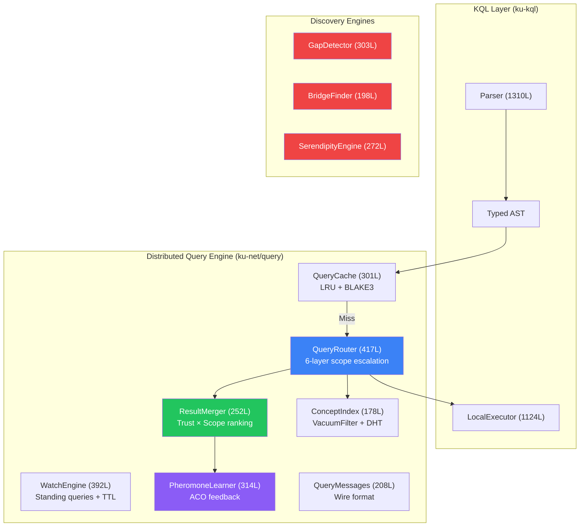
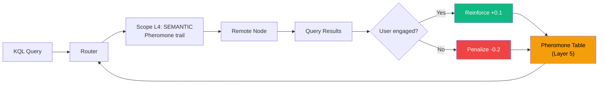

# 5. Distributed Query Engine

While the local executor handles queries against a single node's KU store, the distributed query engine extends KQL execution across the P2P network. This section describes the 6-layer query router, result merger, distributed watch engine, three novel discovery engines, pheromone-based query learning, and query caching.

## 5.1 Architecture Overview

The distributed query engine ([ku-net/src/query/](file:///c:/Users/shpy2/Documents/OneBrain/src/ku-net/src/query), ~2,860 LOC across 12 modules) bridges the KQL parser/executor with the OneBrain Protocol stack:



*Figure 4: Distributed query engine architecture showing module sizes and data flow.*

## 5.2 Query Router: 6-Layer Scope Escalation

The QueryRouter ([router.rs](file:///c:/Users/shpy2/Documents/OneBrain/src/ku-net/src/query/router.rs), 417 LOC) implements progressive scope escalation — the core distributed execution strategy.

### 5.2.1 Scope Execution Model

| Layer | Scope | TTL | Fanout | Strategy | Wire Message |
|:-----:|-------|:---:|:------:|----------|:------------:|
| L0 | LOCAL | 0 | 1 | Execute against local store | — |
| L1 | NEIGHBORS | 1 | 5 | Forward to 1-hop SWIM peers | QueryForward (0x50) |
| L2 | CLUSTER | 3 | — | Route via local super-peer | QueryForward (0x50) |
| L3 | DHT | 8 | α=3 | Kademlia concept key lookup | FindValueReq (0x22) |
| L4 | SEMANTIC | 5 | — | Follow stigmergy pheromone trails | QueryForward (0x50) |
| L5 | GLOBAL | 12 | — | Random walk + TTL flooding | QueryForward (0x50) |

*Table 4: Scope execution model with TTL, fanout, and wire message mapping.*

### 5.2.2 AUTO Scope Algorithm

When scope is `AUTO` (default), the router executes progressive escalation:

```
Algorithm 2: AUTO Scope Escalation
INPUT: query, max_results
OUTPUT: merged results

results ← ∅
FOR scope IN [LOCAL, NEIGHBORS, CLUSTER, DHT, SEMANTIC, GLOBAL]:
    scope_results ← execute_scope(query, scope)
    results ← merge(results, scope_results)
    IF |results| ≥ max_results:
        BREAK
    IF scope = SEMANTIC AND scope_results ≠ ∅:
        reinforce_pheromone(query.topic, successful_path)

RETURN rank_results(results)
```

**Invariant:** Each escalation level only executes if the previous level returned insufficient results. This minimizes network traffic for queries that can be answered locally.

### 5.2.3 Wire Format

Three wire messages support distributed queries:

| Message | Code | Direction | Content |
|---------|:----:|-----------|---------|
| `QueryForward` | 0x50 | Request | query_id, kql_string, scope, ttl, sender_id |
| `QueryResponse` | 0x51 | Response | query_id, results: Vec\<KU\>, source_trust |
| `QueryCancel` | 0x52 | Cancel | query_id, reason |

**QueryForward** includes a TTL field that decrements at each hop, preventing infinite forwarding. A `seen_set` (Bloom filter) prevents query loops.

### 5.2.4 ConceptIndex Integration

The ConceptIndex ([index.rs](file:///c:/Users/shpy2/Documents/OneBrain/src/ku-net/src/query/index.rs), 178 LOC) bridges KQL queries with the P2P protocol layers:

- **Concept-to-CID mapping**: Maps concept IDs to KU CIDs for local lookup
- **VacuumFilter integration**: Publishes local content capability to the network via Bloom filters (L6)
- **DHT publishing**: Registers concept keys in the S/Kademlia DHT (L4) for global discoverability

```rust
pub struct ConceptIndex {
    concept_to_cids: HashMap<u64, Vec<[u8; 32]>>,  // concept_id → CIDs
    vacuum_filter: VacuumFilter,                     // Content capability filter
}
```

## 5.3 Result Merger

The ResultMerger ([merger.rs](file:///c:/Users/shpy2/Documents/OneBrain/src/ku-net/src/query/merger.rs), 252 LOC) combines results from multiple scopes and sources:

### 5.3.1 Deduplication

Results are deduplicated by CID (BLAKE3 content hash). When duplicates are found, the version with the highest source trust score is preserved.

### 5.3.2 Trust × Scope Ranking

Each result is scored by:

$$\text{score}(r) = w_t \cdot \text{trust\_score}(r) + w_s \cdot \text{scope\_proximity}(r)$$

**Scope proximity** rewards closer results:

| Scope | Proximity Score |
|-------|:--------------:|
| LOCAL | 1.00 |
| NEIGHBORS | 0.85 |
| CLUSTER | 0.70 |
| DHT | 0.55 |
| SEMANTIC | 0.65 |
| GLOBAL | 0.30 |

SEMANTIC receives a higher proximity score than DHT because stigmergy routes to *known expertise* — the source has demonstrably answered similar queries successfully before.

### 5.3.3 Multi-Source Aggregation

When aggregation functions are requested (COUNT, AVG, etc.), the merger aggregates across all sources:

- **COUNT**: Sum of all source counts (after dedup)
- **AVG**: Weighted average by source result count
- **MIN/MAX**: Global minimum/maximum across all sources
- **SUM**: Sum of all source sums (after dedup)

## 5.4 Distributed Watch Engine

The distributed WatchEngine ([watch.rs](file:///c:/Users/shpy2/Documents/OneBrain/src/ku-net/src/query/watch.rs), 392 LOC) extends WATCH semantics across the P2P network.

### 5.4.1 Watch Propagation

When a WATCH is registered locally, the engine:

1. Registers the filter locally (evaluated on every `insert()`)
2. Forwards the WATCH to the node's super-peer (tier ≥ 2)
3. The super-peer aggregates WATCH filters from multiple clients
4. Incoming KUs are evaluated against aggregated filters
5. Matches trigger `WatchNotify(0x40)` messages back to the registrant

### 5.4.2 Event Filtering

The event filter determines which KU lifecycle events trigger notifications:

```rust
pub enum WatchEventType {
    Create,       // New KU matches filter
    Update,       // Modified KU now matches filter
    Deprecate,    // Matching KU was deprecated
    Any,          // All of the above
}
```

### 5.4.3 TTL-Based Lifecycle

Distributed watches have a TTL (Time-To-Live) to prevent resource exhaustion:
- Default TTL: 3,600 seconds (1 hour)
- Maximum TTL: 86,400 seconds (24 hours)
- Renewal: Client sends `WatchRegister(0x41)` to extend
- Expiration: Super-peer garbage collects expired watches

Wire messages:
- `WatchNotify(0x40)`: Push notification with matching KU CID + metadata
- `WatchRegister(0x41)`: Register/renew standing query
- `WatchUnregister(0x42)`: Cancel standing query

## 5.5 Discovery Engines

Three novel discovery engines extend KQL beyond traditional search into proactive knowledge discovery:

### 5.5.1 Knowledge Gap Detector

The GapDetector ([gaps.rs](file:///c:/Users/shpy2/Documents/OneBrain/src/ku-net/src/query/discovery/gaps.rs), 303 LOC) identifies **missing knowledge** by analyzing the knowledge graph structure:

**Gap types detected:**

| Gap Type | Detection Method | Priority Score |
|----------|-----------------|:--------------:|
| **Orphan concepts** | Concepts with no connected KUs | query_demand × age |
| **Low confidence** | KUs with confidence < threshold | 1/confidence × citations |
| **Missing evidence** | KUs with epistemic_status ≤ Observation | importance × domain_coverage |
| **Untested hypotheses** | Gene::Hypothesis with no corroborations | age × domain_centrality |

**Output**: Ranked list of `GapSuggestion { concept_id, gap_type, priority, suggested_query: String }` — including auto-generated KQL queries that would fill the gap.

### 5.5.2 Swanson ABC Bridge Finder

The BridgeFinder ([bridges.rs](file:///c:/Users/shpy2/Documents/OneBrain/src/ku-net/src/query/discovery/bridges.rs), 198 LOC) implements Swanson's Undiscovered Public Knowledge model [1]:

**Principle:** If KU₁ in Domain A establishes "X → Y" and KU₂ in Domain B establishes "Y → Z", then the potential bridge "X → Z" may represent undiscovered knowledge invisible to researchers in either domain alone.

**Algorithm:**

```
Algorithm 3: Swanson ABC Bridge Detection
INPUT: knowledge_graph, min_trust, max_bridges
OUTPUT: ranked list of BridgeSuggestion

bridges ← ∅
FOR EACH pair (ku_a, ku_b) IN knowledge_graph:
    IF domain(ku_a) ≠ domain(ku_b):
        shared_concepts ← concepts(ku_a) ∩ concepts(ku_b)
        IF shared_concepts ≠ ∅:
            FOR EACH concept_x IN unique_to(ku_a),
                     concept_z IN unique_to(ku_b):
                score ← trust(ku_a) × trust(ku_b) 
                       × domain_distance(A, B)
                       × novelty(x, z)
                bridges.add(BridgeSuggestion {
                    from: concept_x, via: shared_concepts,
                    to: concept_z, score, domains: (A, B)
                })

RETURN top_k(bridges, max_bridges)
```

**Historical validation:** Swanson [1] used this technique to discover the connection between fish oil (Domain: Nutrition) and Raynaud's syndrome (Domain: Vascular medicine) through the intermediate concept of blood viscosity — a finding later confirmed by clinical trials. The BridgeFinder automates this process.

### 5.5.3 Serendipity Engine

The SerendipityEngine ([serendipity.rs](file:///c:/Users/shpy2/Documents/OneBrain/src/ku-net/src/query/discovery/serendipity.rs), 272 LOC) surfaces **unknown unknowns** — knowledge the user didn't know they needed.

**Scoring formula:**

$$\text{serendipity}(ku, user) = \text{relevance}(ku, user) \times \text{novelty}(ku, user) \times \text{metabolic\_rate}(ku)$$

where:
- **Relevance** = cosine similarity between the KU's domain vector and the user's 128-bit interest vector (L7 PubSub)
- **Novelty** = inverse of the user's prior exposure to the KU's domain (1 / encounter_count)
- **Metabolic rate** = KU's usage frequency from the PoMV system (high usage = community-validated value)

**Sweet spot**: The serendipity score peaks when knowledge is moderately relevant (user can understand it) and highly novel (user hasn't encountered it). A bell curve relationship with concept distance ensures recommendations are neither too obvious nor too obscure.

## 5.6 Pheromone-Based Query Learning

The PheromoneLearner ([learning.rs](file:///c:/Users/shpy2/Documents/OneBrain/src/ku-net/src/query/learning.rs), 314 LOC) closes the feedback loop between query results and network routing:

### 5.6.1 Learning Loop



*Figure 5: Pheromone-based query learning feedback loop. Successful queries reinforce routing paths; failed queries penalize them.*

### 5.6.2 Engagement Signals

The learner evaluates query success through multiple signals:

| Signal | Threshold | Weight | Interpretation |
|--------|:---------:|:------:|----------------|
| Result count | > 0 | 0.3 | Query found matches |
| Dwell time | > 5s | 0.3 | User examined results |
| Trust score | > 5000 | 0.2 | Results are trustworthy |
| Scope proximity | L0-L2 | 0.2 | Results were nearby |

### 5.6.3 Scope Preference Learning

Beyond topic-level pheromone, the learner also tracks scope effectiveness per topic:

$$P(\text{scope} | \text{topic}) = \frac{\text{success\_count}(\text{scope}, \text{topic})}{\text{total\_queries}(\text{topic})}$$

Over time, the router learns which scopes are most effective for each topic — scientific queries may route primarily through DHT (L3), while cultural queries may rely on SEMANTIC (L4) pheromone trails.

## 5.7 Query Cache

The QueryCache ([cache.rs](file:///c:/Users/shpy2/Documents/OneBrain/src/ku-net/src/query/cache.rs), 301 LOC) reduces redundant network queries:

### 5.7.1 Cache Design

| Property | Value |
|----------|-------|
| **Key** | BLAKE3(normalize(kql_string)) |
| **Value** | Cached QueryResult + timestamp |
| **Eviction** | LRU (Least Recently Used) |
| **Capacity** | Configurable (default: 1,000 entries) |
| **TTL** | Configurable (default: 300 seconds) |
| **Invalidation** | `CacheInvalidate(0x68)` network message |

### 5.7.2 Query Normalization

Before hashing, KQL strings are normalized:
1. Keywords uppercased
2. Whitespace collapsed to single spaces
3. Trailing semicolons removed

This ensures `FIND (k:KU)` and `find  (k:KU)` hit the same cache entry.

### 5.7.3 Hit Rate Statistics

The cache tracks hit/miss statistics for monitoring:

```rust
pub struct CacheStats {
    pub hits: u64,
    pub misses: u64,
    pub evictions: u64,
    pub entries: usize,
    pub hit_rate: f64,  // hits / (hits + misses)
}
```

Expected hit rates follow Zipfian distributions: popular queries (top 10%) account for ~80% of total query volume, making caching highly effective.

---

## References

[1] D. R. Swanson, "Fish Oil, Raynaud's Syndrome, and Undiscovered Public Knowledge," *Perspectives in Biology and Medicine*, vol. 30, no. 1, pp. 7–18, 1986.
