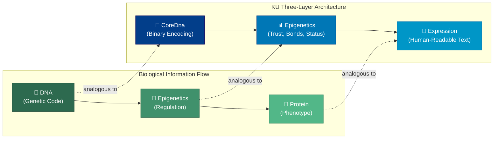
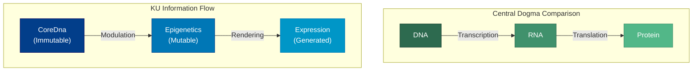

# 1. Introduction

The endeavor to encode, preserve, and transmit knowledge is as old as civilization itself. From the cuneiform tablets of Sumer to the papyrus scrolls of Alexandria, from Gutenberg's movable type to the hyperlinked documents of the World Wide Web, each epoch has produced representational systems calibrated to the technological affordances of its time. Yet a persistent tension runs through this history: the formats that are *natural* for human cognition—narrative, metaphor, contextual reasoning—are precisely those that resist mechanical processing, while the formats amenable to computation—relational tuples, key-value stores, binary encodings—sacrifice the richness that makes knowledge meaningful to people.

The contemporary knowledge landscape reflects this tension at unprecedented scale. Humanity produces an estimated 2.5 exabytes of data per day [Kitchin, 2014], yet the vast majority remains trapped in natural-language silos—unstructured, monolingual, and epistemically opaque. The systems designed to organize this deluge—encyclopedias, knowledge graphs, question-answering platforms—each address a narrow slice of the problem while introducing new fragmentation along linguistic, structural, and epistemic axes. A medical insight published in Mandarin may never reach a Portuguese-speaking clinician; a folk remedy validated by centuries of practice carries no formal epistemic weight in structured databases; a hypothesis too tentative for Wikipedia's notability threshold vanishes from the collective record entirely.

This paper presents the **Knowledge Unit (KU)**, a bio-inspired, binary-encoded representational primitive designed to unify knowledge capture across languages, disciplines, and epistemic certainty levels. The KU draws its architectural metaphor from molecular biology: just as DNA encodes genetic information in a compact, universal alphabet that is then expressed through epigenetic regulation and protein synthesis, a KU encodes semantic content in a language-agnostic binary core that is augmented by runtime metadata and rendered into human-readable forms on demand. The result is a representation that is simultaneously machine-processable and human-interpretable, compact enough for peer-to-peer dissemination and expressive enough to capture the full spectrum of human knowledge—from rigorously proven theorems to speculative hypotheses, from sensory experiences to formal definitions.

The remainder of this introduction is organized as follows. Section 1.1 analyzes the knowledge fragmentation problem along five orthogonal dimensions and compares existing systems against requirements derived from this analysis. Section 1.2 articulates the motivation and long-term vision of the OneBrain network, of which the KU is the foundational atom. Section 1.3 develops the biological metaphor that governs the KU's layered architecture and derives four fundamental design properties from this metaphor. Section 1.4 enumerates the seven principal contributions of this work. Section 1.5 provides a roadmap for the remaining chapters.

## 1.1 Problem Statement

### The Knowledge Fragmentation Problem

Knowledge fragmentation manifests along five orthogonal dimensions, each of which compounds the others:

1. **Linguistic fragmentation.** Approximately 7,000 living languages partition the world's knowledge into mutually inaccessible pools [Eberhard et al., 2024]. Wikipedia, the largest collaborative knowledge base, maintains over 300 language editions, yet fewer than 20 exceed one million articles, and content overlap between editions is remarkably low—studies estimate that only 15–20% of concepts covered in one major-language edition appear in another [Hecht & Gergle, 2010]. Translation efforts, whether manual or automated, operate on surface-level text and cannot bridge the deeper semantic gap. A concept may carry connotations in one language that are entirely absent in another; a Vietnamese proverb may encode agricultural knowledge that has no direct English equivalent. Machine translation systems such as those surveyed by Wu et al. [2016] have made impressive strides in surface fluency, yet they remain fundamentally limited by the lack of a shared semantic substrate beneath the linguistic surface.

2. **Geographic fragmentation.** Knowledge production is concentrated in a small number of nations and institutions. The global South, indigenous communities, and informal knowledge networks remain structurally underrepresented in digital repositories [Graham et al., 2015], not because their knowledge lacks value but because existing platforms impose participation barriers—connectivity requirements, language constraints, editorial gatekeeping—that systematically exclude them. A farmer in rural Vietnam who has developed effective pest-management techniques over decades of practice has no viable pathway to contribute that knowledge to a global knowledge base in a form that preserves its epistemic provenance and procedural structure. The digital divide thus compounds linguistic fragmentation: even when knowledge exists, it cannot traverse the barriers that separate its producers from the platforms that might preserve and disseminate it.

3. **Temporal fragmentation.** Knowledge decays, migrates, and is reformatted across technological generations. Link rot degrades approximately 2% of web URLs per year [Jones et al., 2016]; proprietary formats become unreadable as vendors disappear; and the semantic context surrounding a datum—*why* it was recorded, *who* vouched for it, *how* certain it was—is routinely discarded during migration. The problem is not merely technical but epistemic: when a fact is copied from one system to another, the chain of provenance that connected it to its original source is typically severed, producing "orphan knowledge" that cannot be verified, updated, or retracted. Digital preservation initiatives such as the Internet Archive mitigate data loss but do not address the semantic context loss that accompanies format migration [Rosenthal et al., 2005].

4. **Structural fragmentation.** No common interchange format spans the full expressiveness spectrum. RDF triples capture binary relations but struggle with n-ary predicates, temporal qualifications, and nested contexts [Hernández et al., 2015]. JSON-LD and Schema.org improve interoperability at the cost of verbosity. Proprietary knowledge graphs (e.g., Google Knowledge Graph [Singhal, 2012]) achieve impressive scale but remain closed ecosystems. The Semantic Web vision articulated by Berners-Lee et al. [2001] proposed a universal knowledge layer for the Web, yet two decades later, Linked Data adoption remains limited outside specialized domains [Bizer et al., 2009]. The fundamental challenge is that existing formats force a trade-off between expressiveness and machine-processability: natural language is maximally expressive but opaque to machines, while RDF triples are maximally processable but impoverished in expressiveness.

5. **Epistemic fragmentation.** Existing systems conflate the *content* of a claim with its *epistemic status*. A peer-reviewed meta-analysis and an anecdotal blog post occupy the same structural niche in most knowledge graphs. Systems that do track provenance (e.g., nanopublications [Kuhn et al., 2013]) typically bolt it on as external metadata rather than embedding it in the representation itself. The FAIR principles [Wilkinson et al., 2016]—Findable, Accessible, Interoperable, Reusable—have gained wide acceptance as guiding principles for data management, yet they do not prescribe a representation that integrates epistemic grading as a first-class concern. The result is that consumers of knowledge must rely on external heuristics (e.g., journal impact factor, author reputation) to assess reliability—heuristics that are unavailable when knowledge crosses domain or cultural boundaries.

### Interaction Effects

These five dimensions do not operate in isolation; they interact multiplicatively. Linguistic fragmentation prevents knowledge from reaching communities that might validate or extend it, deepening geographic fragmentation. Temporal fragmentation erases the provenance trails that would allow consumers to assess epistemic quality, compounding epistemic fragmentation. Structural fragmentation ensures that even when knowledge is formally encoded, it cannot be merged with knowledge in a different format, reinforcing the silos created by linguistic and geographic barriers. The cumulative effect is a global knowledge ecosystem that is far less than the sum of its parts—a system in which humanity's collective understanding is fragmented into millions of mutually inaccessible shards.

### Comparison with Existing Systems

Table 1.1 evaluates six prominent knowledge systems against the five desiderata derived from the fragmentation analysis, along with additional criteria that a comprehensive solution must address.

| System | Decentralized | Language-Agnostic | Epistemic Metadata | Incentive Layer | Machine-Processable | Binary Compact | Offline-First |
|:---|:---:|:---:|:---:|:---:|:---:|:---:|:---:|
| Wikipedia | ✗ | Partial | ✗ | ✗ | Partial | ✗ | ✗ |
| Wikidata | ✗ | ✓ | ✗ | ✗ | ✓ | ✗ | ✗ |
| Google KG | ✗ | Partial | ✗ | ✗ | ✗ (proprietary) | ✗ | ✗ |
| Stack Overflow | ✗ | ✗ | Partial | Partial | ✗ | ✗ | ✗ |
| RDF/Linked Data | ✓ (federated) | ✓ | ✗ | ✗ | ✓ | ✗ | ✗ |
| IPFS | ✓ | ✗ | ✗ | ✗ | ✗ | ✗ | ✓ |
| **KU** | **✓** | **✓** | **✓** | **✓** | **✓** | **✓** | **✓** |

*Table 1.1: Comparison of existing knowledge systems against seven desiderata. No existing system satisfies all requirements simultaneously. KU is designed to address all seven.*

**Wikipedia** provides broad coverage but is centralized, English-dominant in practice, and stores knowledge as unstructured prose. Its governance model relies on editorial consensus, which—while effective for quality control—creates barriers to participation for non-English speakers and non-academic contributors [Halfaker et al., 2013].

**Wikidata** achieves language agnosticism through numeric identifiers (Q-items) but lacks epistemic grading and operates under centralized governance. Its data model supports qualifiers and references, offering a degree of provenance tracking, but the epistemic weight of those references is not formally graded [Vrandečić & Krötzsch, 2014].

**Google Knowledge Graph** offers impressive integration, powering entity-centric search results for billions of queries [Singhal, 2012], but is proprietary and opaque. Third parties can neither contribute to nor independently verify its contents, making it unusable as a substrate for a global knowledge commons.

**Stack Overflow** captures procedural knowledge with a partial reputation system—a rare example of incentive-aligned knowledge curation—but is limited to programming and English. Its voting mechanism conflates popularity with correctness, and its moderation policies discourage speculative or exploratory knowledge contributions.

**RDF and Linked Data** provide a federated, machine-readable substrate grounded in formal semantics [Berners-Lee et al., 2001], but offer no native epistemic layer or incentive mechanism. The verbosity of RDF serializations (N-Triples, Turtle, JSON-LD) makes them poorly suited for bandwidth-constrained peer-to-peer networks.

**IPFS** delivers content-addressed decentralization [Benet, 2014] but is content-agnostic—it stores bytes without understanding their semantics. IPFS provides no mechanism for knowledge-level operations such as inference, merge, or conflict resolution; it is a transport layer, not a knowledge layer.

### Requirements for a Unified Representation

The analysis above yields five core requirements that a next-generation knowledge representation must satisfy simultaneously:

1. **Compactness.** The encoding must be space-efficient to enable peer-to-peer dissemination over constrained networks. The KU wire format—`MAGIC(0x4B) | VER_META(1B) | [CONCEPT_TABLE] | INSTRUCTIONS | END(0x1E) | CRC-16(2B)`—achieves wire sizes consistently smaller than equivalent textual representations. Benchmarks demonstrate compression ratios of 3.7× for a breaststroke swimming description (323 bytes UTF-8 → 88 bytes across 3 KUs) and 6.3× for a rocket propulsion description (1,078 bytes UTF-8 → 172 bytes across 5 KUs), ensuring that bandwidth is not a barrier to knowledge sharing.

2. **Expressiveness.** The representation must capture diverse knowledge modalities. The KU system defines 13 gene types—Fact, Procedure, Experience, Creative, MediaExperience, Testimony, Formal, Hypothesis, Narrative, Sensory, Composite, Normative, and Definition—providing a vocabulary that subsumes the expressiveness of existing systems while adding first-class support for modalities (sensory experience, testimony, normative claims) that existing systems ignore entirely.

3. **Structure.** Knowledge atoms must be machine-processable without natural-language parsing. The KU achieves this through 32 opcodes (0x00–0x1F) and numeric ConceptIDs encoded as variable-length integers through a 5-tier varint scheme. The 80 Tier 0 concepts—organized into 8 semantic groups covering structural predicates, causal and temporal relations, spatial relations, logical and modal operators, SI base units, derived units, epistemological primitives, and agentive thematic roles—provide a universal vocabulary that requires only 1 byte per concept, enabling exact matching, efficient indexing, and language-independent reasoning.

4. **Trustworthiness.** Epistemic status must be a first-class citizen of the representation, not an afterthought. The KU embeds 11 epistemic levels directly into the Epigenetics layer, and employs a Proof-of-Meaningful-Verification (PoMV) mechanism comprising 6 signals—each stored as a `u16` in the range [0, 10000]—that rewards substantive validation over mere computational expenditure. Additionally, 33 bond types govern the inter-KU relationship vocabulary, enabling rich relational semantics at the trust layer.

5. **Decentralization.** The system must operate without central authority, tolerating network partitions and concurrent edits. The KU architecture defines 5 Conflict-free Replicated Data Types (CRDTs)—GCounter, PNCounter, LWWRegister, ORSet, and VectorClock—tailored to knowledge-specific merge semantics that guarantee eventual consistency across arbitrarily partitioned replicas.

## 1.2 Motivation and Vision

### The OneBrain Network

The KU is the foundational primitive of **OneBrain**, a decentralized knowledge-sharing network whose ambition is to make the totality of human understanding—across every language, discipline, and certainty level—accessible to every person and machine on the planet. OneBrain is not a database, an encyclopedia, or a search engine; it is a *protocol* for knowledge exchange, analogous to how TCP/IP is a protocol for data exchange. Just as the Internet does not prescribe what content flows through it, OneBrain does not prescribe what knowledge is worth encoding. Its role is to provide the representational atoms (KUs), the consistency guarantees (CRDTs), the trust framework (epistemic levels and PoMV), and the incentive structure (contribution-weighted rewards) that enable a self-organizing knowledge commons.

The design philosophy of OneBrain rests on three axioms:

1. **Knowledge sovereignty.** Every participant—whether an individual, an institution, or an AI agent—maintains sovereign control over the knowledge they contribute. There is no central editorial board, no gatekeeping committee, no notability threshold. Knowledge enters the network because someone considered it worth encoding, and the network's trust mechanisms determine how it is received, propagated, and weighted over time.

2. **Epistemic pluralism.** The network does not impose a single standard of truth. A peer-reviewed clinical trial, a grandmother's herbal remedy, and a student's tentative hypothesis all have a place in the knowledge commons, distinguished not by editorial fiat but by their epistemic metadata—the gene type, the certainty level, the PoMV scores, and the bonds that connect them to corroborating or contradicting KUs.

3. **Emergent organization.** The network does not rely on top-down taxonomic classification. Instead, knowledge self-organizes through the interaction of individual KUs: frequently co-activated concepts strengthen their bonds (analogous to Hebbian learning in neuroscience [Hebb, 1949]), while isolated or contradicted concepts gradually lose salience. The result is an emergent knowledge topology that reflects actual patterns of use and validation rather than imposed categorical hierarchies.

### The Knowledge Unit as Atomic Primitive

A single KU is richer than an RDF triple and more structured than a blockchain transaction. Where an RDF triple captures a single binary relation (subject–predicate–object), a KU encodes a *typed knowledge gene*—a semantically complete unit that carries its own epistemic metadata, authorship, temporal context, and rendering instructions. Where a blockchain transaction records a state transition in a ledger, a KU records a state transition in humanity's collective understanding, complete with the evidential basis for that transition.

The atomic nature of the KU is precisely defined by its Content Identifier (CID): a 32-byte BLAKE3 hash of the encoded CoreDna bytes. Two independently constructed KUs with identical semantic content produce identical CIDs, enabling deduplication, integrity verification, and content-addressed retrieval across the decentralized network. This content-addressing model ensures that the identity of a knowledge atom is intrinsic—derived from its content—rather than extrinsic—assigned by a central authority.

Critically, the KU system values *all* knowledge, including knowledge that is incomplete, uncertain, or subjective. A `Hypothesis` gene (type 7) captures a conjecture that has not yet been validated; a `Definition` gene (type 12) records a community's agreed-upon meaning for a concept; a `Sensory` gene (type 9) encodes a perceptual datum—a color, a sound, a tactile impression—that resists propositional formalization; a `Testimony` gene (type 5) records a witnessed account with provenance metadata. By providing first-class gene types for these modalities, the KU system avoids the epistemic censorship inherent in systems that admit only "verified facts."

### Future Directions: Brain-Computer Interface Integration

Looking beyond the current implementation, the KU architecture anticipates direct neural integration. The `Sensory` (type 9) and `Experience` (type 2) gene types are designed with future Brain-Computer Interface (BCI) scenarios in mind, where knowledge might be captured not through keyboard input but through direct neural recording [Lebedev & Nicolelis, 2017]. The binary, language-agnostic nature of the KU encoding makes it a natural substrate for such interfaces: a sensory impression encoded as a KU in Tokyo is semantically identical to the same impression encoded in São Paulo, regardless of the language spoken by either contributor.

The MEDIA_REF opcode (0x1B) already provides a mechanism for referencing external sensory data, and the 5-tier varint encoding accommodates the expansion of the concept space to approximately 34.6 billion concepts at Tier 4, providing ample addressing capacity for the fine-grained sensory and cognitive concepts that BCI integration would introduce.

## 1.3 The Biological Metaphor

The KU architecture is organized around an extended analogy with molecular biology. This metaphor is not merely pedagogical; it directly informs the system's layered design, its separation of concerns, and its extensibility strategy.

### Layer Correspondence

Table 1.2 maps the four central biological concepts to their KU counterparts, with detailed functional descriptions.

| Biology | KU System | Biological Function | KU Function |
|:---|:---|:---|:---|
| DNA | CoreDna | Encodes genetic information in a universal four-letter alphabet (A, C, G, T) | Encodes semantic content via 32 opcodes and numeric ConceptIDs in a language-agnostic binary format |
| Epigenetics | Epigenetics | Regulates gene expression without altering the DNA sequence (methylation, histone modification) | Governs trust scores (6 PoMV signals), 33 bond types, and 11 epistemic levels without altering CoreDna |
| Protein | Expression | Translated from mRNA, performs cellular functions as the phenotypic output of the genome | Generated on demand from CoreDna, produces human-readable text in any target language |
| Organism | KuRuntime | Living composite of genome, epigenome, and proteome | Living composite of CoreDna, Epigenetics, and Expression layers |

*Table 1.2: Extended biological metaphor mapping. Each biological layer corresponds to a distinct architectural concern in the KU system.*

Just as an organism's phenotype arises from the interplay of its genotype (DNA), epigenetic regulation, and protein expression, a KU's observable behavior emerges from the interplay of its immutable semantic core (CoreDna), its mutable runtime metadata (Epigenetics), and its language-specific renderings (Expression). This separation yields several important properties:

- **CoreDna** is immutable and content-addressed. Once encoded, a knowledge gene's binary representation never changes; its identity is its content hash (CID = 32-byte BLAKE3). This mirrors the stability of the genetic code across cell divisions. The wire format is self-delimiting: `MAGIC(0x4B) | VER_META(1B) | [CONCEPT_TABLE] | INSTRUCTIONS | END(0x1E) | CRC-16(2B)`, where VER_META encodes bits[7:5] = version (currently 2), bits[4:1] = gene_type (0–15), and bit[0] = has_concept_table.
- **Epigenetics** is mutable and convergent. Trust scores, social bonds, and lifecycle status evolve over time as the network processes validations, citations, and retractions—analogous to how epigenetic marks modulate gene expression in response to environmental signals [Allis & Jenuwein, 2016]. The TrustSection comprises 6 PoMV signals, each encoded as a `u16` in the range [0, 10000], enabling fine-grained trust quantification that converges across replicas through CRDT-based aggregation.
- **Expression** is generative and context-dependent. A single CoreDna can be rendered into any human language, at any level of detail, for any audience—just as a single gene can be expressed differently in different tissues and developmental stages. The Expression layer is computed lazily: `KuRuntime::expression(lang, dict)` generates and caches the rendering on demand.

### Architectural Correspondence Diagram

The following diagram illustrates the structural correspondence between biological information flow and the KU encoding pipeline.

*Figure 1.1: Structural correspondence between biological information flow (left) and the KU three-layer architecture (right). Dashed lines indicate analogical mappings between biological and computational layers.*

### The Central Dogma Analogy

The analogy extends to the information flow constraints of molecular biology. The *central dogma*—DNA → RNA → Protein—describes a unidirectional flow of genetic information [Crick, 1970]. In the KU system, an analogous principle holds: CoreDna determines the *potential* expressions of a knowledge unit, Epigenetics modulates *which* expressions are active and how they are weighted, and Expression produces the *observable* output. Information flows primarily in one direction: Expression cannot alter CoreDna, just as proteins cannot rewrite DNA under normal biological conditions. This unidirectional constraint is not merely architectural elegance; it is a critical invariant that ensures the immutability and content-addressability of the semantic core.

*Figure 1.2: The central dogma analogy. In both systems, information flows unidirectionally from the immutable genetic/semantic core through regulatory/metadata modulation to phenotypic/linguistic output.*

### Design Properties Derived from the Metaphor

The biological metaphor motivates four fundamental design properties:

1. **Language agnosticism.** Just as the genetic code uses a universal four-letter alphabet (A, C, G, T) regardless of the organism, the KU CoreDna uses numeric ConceptIDs to represent semantic concepts. These ConceptIDs are encoded as variable-length integers through a 5-tier varint scheme: Tier 0 (0–127, 1 byte) accommodates 80 universal concepts organized into 8 semantic groups; Tier 1 (128–16,511, 2 bytes) covers common concepts; Tier 2 (16,512–2,113,663, 3 bytes) handles domain-specific concepts; Tier 3 (2,113,664–270,549,119, 4 bytes) addresses extended concepts; and Tier 4 (270,549,120–34,628,173,487, 5 bytes) accommodates community-generated concepts. No natural-language string appears in the CoreDna layer; all linguistic content is deferred to the Expression layer, ensuring that knowledge encoded in any cultural context is structurally identical at the binary level.

2. **Content addressability.** Just as a gene can be identified by its nucleotide sequence, a KU is identified by its content. The Content Identifier (CID) is a 32-byte BLAKE3 hash of the encoded binary representation. Two independently constructed KUs with identical semantic content produce identical CIDs, enabling deduplication, integrity verification, and content-addressed retrieval across the decentralized network. At the concept level, each concept is globally identified by a Compact Concept Identifier (CCID): a 128-bit truncated BLAKE3 hash that provides a collision-resistant identity with a birthday bound of approximately 2⁶⁴ ≈ 1.8 × 10¹⁹ [Aumasson et al., 2020].

3. **Incremental parseability.** The CoreDna encoding is an opcode stream—a sequence of self-delimiting instructions that can be parsed byte-by-byte without backtracking or lookahead. Each gene begins with a MAGIC byte (0x4B), followed by a VER_META byte, and terminates with an explicit END marker (0x1E) followed by a CRC-16/CCITT checksum (polynomial 0x1021, initial value 0xFFFF). This design enables streaming decoders, partial parsing of damaged data, and efficient skip-ahead over unrecognized gene types. The 7 NumericValue types—F64 (0xF9, 9 bytes), U8 (0xFA, 2 bytes), U16 (0xFB, 3 bytes), I16 (0xFC, 3 bytes), U32 (0xFD, 5 bytes), I32 (0xFE, 5 bytes), and F32 (0xFF, 5 bytes)—use sentinel-byte prefixes that enable unambiguous context-free parsing: bytes ≥ 0xF9 are parsed as NumericValue prefixes, while bytes < 0xF9 are parsed as varint ConceptIDs.

4. **Evolutionary extensibility.** Just as biological evolution produces new genes through duplication and divergence, the KU instruction set accommodates future knowledge modalities through a systematic extension mechanism. The current specification defines 13 gene types and 32 opcodes (0x00–0x1F); the EXTENDED opcode (0x1F) provides a namespace for future opcodes without breaking backward compatibility, mirroring how biological regulatory networks absorb new genes without disrupting existing pathways. Gene types 0–6 are encoded directly in the VER_META byte, while types 7–12 use the extended encoding with an additional extension byte (0x00–0x05), leaving room for future gene types without exhausting the 4-bit gene_type field.

## 1.4 Contributions

This paper makes the following seven contributions:

1. **Bio-inspired three-layer representation.** We introduce a novel knowledge representation architecture comprising CoreDna (immutable semantic content), Epigenetics (mutable runtime metadata with 6 PoMV signals, 33 bond types, and 11 epistemic levels), and Expression (language-specific rendering). This layered design cleanly separates concerns that existing systems conflate: what is known, how much it is trusted, and how it is communicated.

2. **Custom binary instruction set.** We design a purpose-built binary encoding with 32 opcodes (0x00–0x1F) optimized for knowledge representation, spanning factual triples, quantities, sequences, causal relations, temporal and spatial assertions, procedural steps, emotional valence, and formal notation. The wire format—`MAGIC(0x4B) | VER_META(1B) | [CONCEPT_TABLE] | INSTRUCTIONS | END(0x1E) | CRC-16(2B)`—achieves wire sizes consistently smaller than equivalent textual representations: 3.7× compression for a breaststroke description (323B → 88B) and 6.3× for a rocket propulsion description (1,078B → 172B).

3. **Five-tier variable-length integer encoding.** We introduce a semantically aligned varint scheme whose tier boundaries correspond to concept frequency distributions: Tier 0 (1 byte, 128 values) for universal primitives, Tier 1 (2 bytes, ~16K values) for common concepts, Tier 2 (3 bytes, ~2M values) for domain-specific concepts, Tier 3 (4 bytes, ~268M values) for extended concepts, and Tier 4 (5 bytes, ~34.6B values) for community concepts. This Zipfian alignment ensures that common knowledge patterns achieve near-optimal compression without explicit codebook negotiation.

4. **Compact Concept Identifier (CCID).** We define a 128-bit truncated BLAKE3 hash that serves as a collision-resistant, self-describing concept reference. When paired with an optional Concept Table embedded in the KU header, CCIDs enable fully self-contained KUs that can be interpreted without access to an external concept registry. The ConceptRegistry—approximately 200 MB indexing approximately 8 million concepts with O(1) hash lookup and 99.9% coverage of general-domain knowledge—provides offline concept resolution with quarterly update cycles.

5. **Five CRDT types for knowledge consistency.** We specify five Conflict-free Replicated Data Types—GCounter, PNCounter, LWWRegister, ORSet, and VectorClock—tailored to knowledge-specific merge semantics. These CRDTs handle concurrent edits to trust scores, citation graphs, lifecycle states, and epistemic levels, guaranteeing eventual consistency across arbitrarily partitioned replicas without requiring coordination.

6. **Three-tier encoding pipeline.** We formalize a systematic encoding pipeline that transforms high-level knowledge representations through three stages—semantic analysis (concept resolution via the ConceptRegistry), binary encoding (instruction emission through the 32-opcode instruction set), and content addressing (CID computation via BLAKE3)—with well-defined interfaces between stages that enable independent optimization and verification.

7. **Reference implementation and validation.** We provide a complete implementation in Rust comprising approximately 15,000 lines of code organized across 40+ modules, validated by 827 tests covering encoding correctness, round-trip fidelity, CRDT convergence, and adversarial input handling. The implementation demonstrates that the architecture is not merely theoretically sound but practically viable.

## 1.5 Paper Organization

The remainder of this paper is organized as follows:

- **§2 (Related Work)** surveys existing knowledge representation formalisms, large-scale knowledge graphs, binary serialization formats, decentralized data systems, conflict-free replicated data types, bio-inspired computing paradigms, and epistemic logic and trust frameworks. The chapter positions the KU system at the unique intersection of these seven research areas and identifies the architectural gap that motivates the KU design.

- **§3 (Core Architecture)** details the three-layer architecture—CoreDna, Epigenetics, and Expression—and formalizes the biological metaphor that governs their interaction. This chapter specifies the structural invariants (immutability of CoreDna, convergence of Epigenetics, generativity of Expression) and the information flow constraints that ensure architectural integrity.

- **§4 (Binary Encoding)** specifies the instruction set, opcode semantics, varint encoding, the VER_META byte layout (bits[7:5] = version, bits[4:1] = gene type, bit[0] = has_concept_table), the 13 gene types, the 7 NumericValue types, the Concept Table format, and the CRC-16/CCITT integrity mechanism. This chapter provides sufficient detail for independent reimplementation.

- **§5 (Decentralization)** presents the five CRDT types (GCounter, PNCounter, LWWRegister, ORSet, VectorClock), the PoMV consensus mechanism with its 6 trust signals, the 33 bond types, the 11 epistemic levels, and the peer-to-peer synchronization protocol. This chapter formalizes the convergence guarantees and analyzes the metadata overhead of each CRDT type.

- **§6 (Implementation)** describes the Rust reference implementation—its module architecture (40+ modules), performance characteristics, error handling strategy, and testing methodology (827 tests spanning unit, integration, and property-based testing).

- **§7 (Evaluation)** reports experimental results on encoding efficiency (compression ratios across diverse knowledge domains), CRDT convergence latency under realistic network conditions, and system throughput under concurrent workloads. Benchmarks include the breaststroke (323B → 88B, 3.7×) and rocket propulsion (1,078B → 172B, 6.3×) encoding scenarios.

- **§8 (Conclusion)** summarizes findings, discusses limitations, and outlines directions for future work including BCI integration, cross-network federation with existing knowledge graphs, and the expansion of the ConceptRegistry beyond its current ~8M concept coverage.

---

## References

Allis, C. D., & Jenuwein, T. (2016). The molecular hallmarks of epigenetic control. *Nature Reviews Genetics*, 17(8), 487–500.

Aumasson, J. P., O'Connor, J., Neves, S., & Wilcox-O'Hearn, Z. (2020). BLAKE3: One Function, Fast Everywhere. *IACR Cryptology ePrint Archive*, 2020.

Benet, J. (2014). IPFS—Content Addressed, Versioned, P2P File System. *arXiv preprint arXiv:1407.3561*.

Berners-Lee, T., Hendler, J., & Lassila, O. (2001). The Semantic Web. *Scientific American*, 284(5), 34–43.

Bizer, C., Heath, T., & Berners-Lee, T. (2009). Linked Data—The Story So Far. *International Journal on Semantic Web and Information Systems*, 5(3), 1–22.

Crick, F. (1970). Central Dogma of Molecular Biology. *Nature*, 227(5258), 561–563.

Eberhard, D. M., Simons, G. F., & Fennig, C. D. (Eds.). (2024). *Ethnologue: Languages of the World* (27th ed.). SIL International.

Graham, M., Hogan, B., Straumann, R. K., & Medhat, A. (2015). Uneven Geographies of User-Generated Information: Patterns of Increasing Informational Poverty. *Annals of the Association of American Geographers*, 105(6), 1239–1256.

Halfaker, A., Geiger, R. S., Morgan, J., & Riedl, J. (2013). The Rise and Decline of an Open Collaboration System: How Wikipedia's Reaction to Popularity Is Causing Its Decline. *American Behavioral Scientist*, 57(5), 664–688.

Hebb, D. O. (1949). *The Organization of Behavior: A Neuropsychological Theory*. John Wiley & Sons.

Hecht, B., & Gergle, D. (2010). The Tower of Babel Meets Web 2.0: User-Generated Content and Its Applications in a Multilingual Context. In *Proc. ACM CHI Conference on Human Factors in Computing Systems* (pp. 291–300).

Hernández, D., Hogan, A., & Krötzsch, M. (2015). Reifying RDF: What Works Well with Wikidata? In *Proc. Workshop on Scalable Semantic Web Knowledge Base Systems (SSWS)* (pp. 32–47).

Jones, S. M., Van de Sompel, H., Shankar, H., Klein, M., Tobin, R., & Grover, C. (2016). Scholarly Context Not Found: One in Five Articles Suffers from Reference Rot. *PLoS ONE*, 11(12), e0167475.

Kitchin, R. (2014). *The Data Revolution: Big Data, Open Data, Data Infrastructures and Their Consequences*. SAGE Publications.

Kuhn, T., Chichester, C., Krauthammer, M., Queralt-Rosinach, N., Verborgh, R., Giannakopoulos, G., ... & Dumontier, M. (2013). Broadening the Scope of Nanopublications. In *Proc. Extended Semantic Web Conference (ESWC)* (pp. 487–501). Springer.

Lebedev, M. A., & Nicolelis, M. A. L. (2017). Brain-Machine Interfaces: From Basic Science to Neuroprostheses and Neurorehabilitation. *Physiological Reviews*, 97(2), 767–837.

Rosenthal, D. S., Lipkis, T., Robertson, T. S., & Morabito, S. (2005). Transparent Format Migration of Preserved Web Content. *D-Lib Magazine*, 11(1).

Shapiro, M., Preguiça, N., Baquero, C., & Zawirski, M. (2011). Conflict-Free Replicated Data Types. In *Proc. 13th International Symposium on Stabilization, Safety, and Security of Distributed Systems (SSS)* (pp. 386–400). Springer.

Singhal, A. (2012). Introducing the Knowledge Graph: Things, Not Strings. *Google Official Blog*.

Vrandečić, D., & Krötzsch, M. (2014). Wikidata: A Free Collaborative Knowledgebase. *Communications of the ACM*, 57(10), 78–85.

Wilkinson, M. D., Dumontier, M., Aalbersberg, I. J., Appleton, G., Axton, M., Baak, A., ... & Mons, B. (2016). The FAIR Guiding Principles for Scientific Data Management and Stewardship. *Scientific Data*, 3, 160018.

Wu, Y., Schuster, M., Chen, Z., Le, Q. V., Norouzi, M., Macherey, W., ... & Dean, J. (2016). Google's Neural Machine Translation System: Bridging the Gap between Human and Machine Translation. *arXiv preprint arXiv:1609.08144*.
