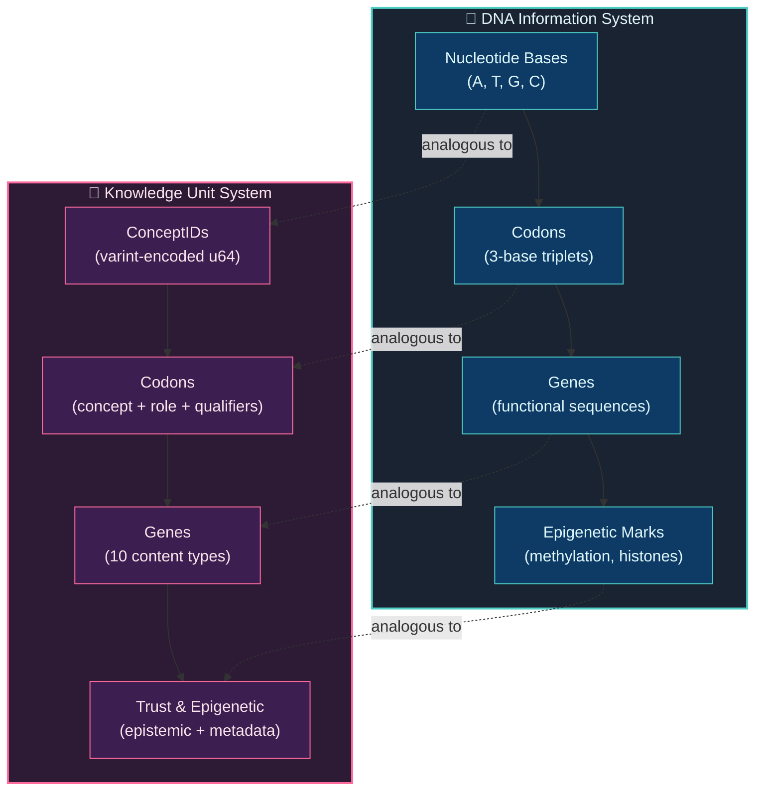

# 1. Introduction

The systematic encoding, sharing, and accumulation of knowledge has been the single most consequential driver of human civilization [1]. From the invention of writing in Mesopotamia circa 3400 BCE, through Gutenberg's movable type in 1440, to the World Wide Web in 1989, each breakthrough in knowledge representation and dissemination has catalyzed transformative societal change [2]. Yet despite these advances, human knowledge in the 21st century remains profoundly fragmented — trapped inside individual brains, locked behind linguistic barriers, constrained by geographic proximity, and subject to irreversible temporal loss. A physician in Nairobi who develops a novel wound-care technique may require years before that knowledge reaches a colleague in São Paulo; an engineer who solves a complex materials problem has no efficient mechanism to make that solution discoverable by the thousands of peers simultaneously grappling with the identical challenge.

This paper presents the **Knowledge Unit (KU)**, a bio-inspired knowledge representation designed to serve as the atomic, self-describing, cryptographically addressable unit of knowledge within a fully decentralized knowledge-sharing network. The KU draws deep structural parallels from molecular biology's DNA encoding scheme and integrates Conflict-Free Replicated Data Types (CRDTs) [3] to enable coordination-free eventual consistency across an unbounded set of participating nodes.

## 1.1 Problem Statement

Human knowledge suffers from what we term the **Knowledge Fragmentation Problem (KFP)**: the systemic inability of knowledge generated by one human to reach all other humans who would benefit from it, in a timely, structured, and trustworthy manner. KFP manifests across five orthogonal dimensions:

**Linguistic fragmentation.** There are approximately 7,000 living languages [4], and fewer than 5% of the world's knowledge is available in any single language. Translation is expensive, lossy, and perpetually incomplete. A critical insight published in Mandarin may never surface for an English-speaking researcher.

**Geographic fragmentation.** Knowledge generation is not uniformly distributed. The concentration of research institutions in North America, Europe, and East Asia creates structural blind spots for knowledge generated in the Global South, Indigenous communities, and rural populations.

**Temporal fragmentation.** Human knowledge is mortal. The death of an expert, the loss of an oral tradition, or the degradation of a physical archive permanently destroys knowledge. The Library of Alexandria's destruction — whether by fire, neglect, or conquest — is merely the most famous instance of a phenomenon that occurs continuously at every scale.

**Structural fragmentation.** Existing knowledge systems represent information in incompatible formats. A Wikipedia infobox, a Wikidata triple, a PubMed abstract, and a Stack Overflow answer each use fundamentally different schemas, making cross-system knowledge integration a perennially unsolved engineering problem.

**Epistemic fragmentation.** Perhaps most critically, existing systems provide no systematic mechanism for representing *how well-established* a piece of knowledge is. A rigorously peer-reviewed meta-analysis and an unverified social media anecdote occupy the same representational tier in most systems. The absence of machine-processable epistemic metadata makes it impossible for automated systems to reason about knowledge reliability at scale.

Existing platforms address subsets of these dimensions but none addresses all five simultaneously:

| System | Decentralized | Language-Agnostic | Epistemic Metadata | Incentive Layer | Machine-Processable |
|--------|:---:|:---:|:---:|:---:|:---:|
| Wikipedia [5] | ✗ | Partial | ✗ | ✗ | Partial |
| Wikidata [6] | ✗ | ✓ | ✗ | ✗ | ✓ |
| Google Knowledge Graph [7] | ✗ | Partial | ✗ | ✗ | ✗ (proprietary) |
| Stack Overflow | ✗ | ✗ | Partial (votes) | Partial (reputation) | ✗ |
| Semantic Web / RDF [8] | ✓ (federated) | ✓ | ✗ | ✗ | ✓ |
| IPFS [9] | ✓ | ✗ | ✗ | ✗ | ✗ |

The Knowledge Unit is designed to simultaneously satisfy five requirements that, taken together, are not met by any existing system:

1. **Compactness.** The wire format must be efficient enough for mobile and IoT deployment — ideally **smaller than the original natural-language text**. Our v6 Core DNA format achieves ≤100 bytes for typical KUs (as low as ~16 bytes for minimal facts), enabling billions of KUs to be stored and transmitted on resource-constrained devices.

2. **Expressiveness.** The representation must accommodate at least 10 distinct knowledge modalities — from structured factual triples to unstructured experiential narratives, formal mathematical proofs, procedural instructions, sensory observations, and cultural testimony.

3. **Structure.** The representation must be fully machine-processable without natural language understanding, enabling knowledge graph construction, automated reasoning, and semantic search through numeric concept identifiers rather than text strings.

4. **Trustworthiness.** Every KU must carry machine-readable epistemic metadata indicating its maturity level, evidence type, verification status, and known error susceptibilities, enabling downstream systems to filter, rank, and reason about knowledge reliability.

5. **Decentralization.** The representation must support conflict-free replication across an unbounded number of nodes with no central coordinator, no consensus protocol, and guaranteed eventual consistency.

## 1.2 Motivation & Vision

OneBrain is a decentralized knowledge-sharing network inspired by blockchain's peer-to-peer architecture but fundamentally divergent in purpose and mechanism [10]. Where blockchain records financial transactions and employs energy-intensive consensus mechanisms (Proof-of-Work, Proof-of-Stake), OneBrain records *knowledge contributions* and employs a novel **Proof-of-Knowledge (PoK)** protocol based on metabolic value scoring — an approach where knowledge "earns its keep" through demonstrated utility rather than computational expenditure.

Within this architecture, the Knowledge Unit serves as the fundamental atomic unit — analogous to a *transaction* in blockchain or a *triple* in RDF, but substantially richer in both structure and metadata. Every piece of knowledge contributed to the OneBrain network — whether it is a bicycle mechanic's discovery of a faster tire removal technique, a physicist's partial theorem awaiting completion, a grandmother's recipe passed down through generations, or a hiker's experiential account of a Himalayan sunset — is encoded as a KU.

The vision extends beyond current human-computer interaction paradigms. As Brain-Computer Interface (BCI) technology matures [11], the KU format is designed to eventually encode knowledge captured directly from neural signals — experiences, intuitions, and perceptual data that are currently inexpressible in any existing knowledge representation. The 3-layer architecture, with its `Sensory` and `Experience` gene types and Affect/Witness opcodes, provides the representational scaffolding for this future modality.

Crucially, OneBrain treats all knowledge as valuable, including incomplete knowledge. A partial hypothesis, an unfinished proof, an intuition not yet formalized — these are represented as first-class citizens through the `Hypothesis` gene type with explicit maturity levels (from `INTUITION` through `REPLICATED`) and the 11-level epistemic status hierarchy. This design reflects the empirical observation that transformative discoveries frequently emerge from the *connection* of individually incomplete contributions across disciplines, geographies, and timeframes — what we term **collaborative knowledge completion**.

## 1.3 The Biological Metaphor

The KU's architecture draws a deliberate and structurally deep analogy from molecular biology's DNA information encoding system. This analogy is not decorative; it carries precise structural implications that inform every design decision.

**Figure 1.** Structural correspondence between DNA's information encoding and the Knowledge Unit's 3-layer architecture.

In molecular biology, DNA encodes the instructions for life through a hierarchical system: four nucleotide bases (adenine, thymine, guanine, cytosine) combine into 3-base codons, each encoding a specific amino acid; codons compose genes that encode functional proteins; epigenetic mechanisms (DNA methylation, histone modification) regulate gene expression without altering the underlying sequence; and the phenotype is the observable expression of the genome [12].

The KU maps this hierarchy with structural fidelity across its 3-layer architecture:

| DNA Layer | KU Layer | Structural Correspondence |
|-----------|----------|--------------------------|
| Nucleotide bases (A, T, G, C) | **32 Opcodes** | The atomic instruction alphabet. In DNA, 4 bases; in KU, 32 opcodes (TRIPLE, PARTOF, QUALITY, QUANTITY, STEP, CAUSAL, etc.) form the instruction vocabulary. Both are language-agnostic — DNA does not "speak" English or Mandarin; opcodes are numeric and culture-neutral. |
| Codons (3-base triplets) | **Instructions** (`opcode` + varint operands) | The smallest meaningful unit. A DNA codon maps to one amino acid; a KU Instruction maps an opcode to ConceptID operands (e.g., `PartOf(601, 600)` = "body is part of rocket"). |
| Genes (functional sequences) | **Genes** (11 content types) | The functional unit. A biological gene encodes a protein; a KU Gene encodes a complete piece of knowledge — encoded as a stream of instructions within a CoreDna binary (Fact, Procedure, Experience, Hypothesis, Formal, Testimony, etc.). |
| Epigenetic marks | **Epigenetics Layer** (runtime only) | Regulatory metadata. Epigenetic marks control *when, where, and how much* a gene is expressed; the Epigenetics Layer controls *how, when, and with what confidence* a KU is interpreted — through epistemic status (11 levels), evidence type (9 categories), 33 bond types, temporal validity, knowledge decay half-life, and metabolic scoring. This layer is NOT stored in Core DNA — it emerges from network interaction. |
| Phenotype (observable traits) | **Expression Layer** (generated) | The observable manifestation. A phenotype is the organism's observable characteristics produced by gene expression; the Expression Layer is the human-readable natural language rendering generated on-demand from Core DNA + ConceptDict. |

This analogy yields four critical design properties that would be difficult to achieve through conventional knowledge representation approaches:

**1. Language agnosticism.** Just as DNA's four-base code is universal across all terrestrial life — the same codon (AUG) encodes methionine in *E. coli*, in oak trees, and in humans — KU ConceptIDs are numeric identifiers that transcend natural language. The concept of "water" is not represented as the English string `"water"`, the Mandarin `"水"`, or the Arabic `"ماء"`, but as a single numeric ConceptID (e.g., `301`) that is identical across all nodes in the network. This makes the KU inherently multilingual without requiring translation.

**2. Content addressability.** Biological sequences are identified by their content (the base sequence itself is the identifier); similarly, each KU is identified by a cryptographic content identifier (CID) derived from its serialized representation using BLAKE3 hashing [13]. This content-addressed design enables deduplication, integrity verification, and location-independent retrieval — properties shared with content-addressable systems like IPFS [9] and Git [14].

**3. Incremental parseability.** DNA's reading frame mechanism allows ribosomes to begin translation at any start codon (AUG) without parsing the entire chromosome. Analogously, the Core DNA wire format's opcode-based instruction stream supports incremental parsing — a decoder can scan instructions sequentially, extracting semantic information from the byte stream without buffering the entire message. The END marker (0xF0) clearly delineates the instruction boundary, a property critical for streaming and resource-constrained environments.

**4. Evolutionary extensibility.** Biological evolution introduces new genes through mechanisms like gene duplication and mutation without disrupting existing functional sequences. The KU mirrors this through two mechanisms: (a) the 4-bit gene type field in the VER_META byte directly encodes 11 gene types (0–10), with codes 11–15 reserved for future modalities; and (b) the 32-opcode instruction set reserves opcodes 0x55–0xEF for future instructions. Furthermore, the `decode_any()` auto-detect function ensures backward compatibility — it inspects magic bytes to distinguish v4/v5 CBOR from v6 Core DNA, providing a concrete path for accommodating future wire format versions without breaking existing implementations.

## 1.4 Contributions

This paper makes the following specific contributions:

1. **A bio-inspired 3-layer knowledge representation (§2, §3).** We present the Knowledge Unit architecture comprising Core DNA (Layer 1 — stored binary with 32 opcodes), Epigenetics (Layer 2 — runtime trust, bonds, metabolism), and Expression (Layer 3 — generated natural language). We demonstrate that the biological metaphor is not merely pedagogical but yields concrete design properties — language agnosticism, content addressability, incremental parseability, and evolutionary extensibility — that are structurally necessitated by the analogy.

2. **A custom binary instruction set with 32 opcodes (§3, §4).** We design and implement a compact opcode-based wire format that encodes knowledge as typed instructions (Triple, PartOf, Quality, Quantity, Step, Causal, etc.), achieving wire sizes consistently **smaller than the original natural-language text** — a 16.5× reduction from the prior CBOR-based format.

3. **A semantically-tiered 5-tier variable-length integer encoding (§4.5).** We introduce a varint scheme where encoding length correlates with semantic frequency: 128 universal primitives occupy 1 byte, ~16K common concepts occupy 2 bytes, ~2M standard concepts occupy 3 bytes, and extended/community concepts occupy 4–5 bytes. We prove that this scheme achieves near-optimal compression for Zipfian concept frequency distributions typical of natural language knowledge [16].

4. **Integration of 5 CRDT types for decentralized consistency (§5).** We show how G-Counter, PN-Counter, LWW-Register, OR-Set, and Vector Clock CRDTs [3] can be composed to provide field-level eventual consistency for knowledge metadata — enabling concurrent updates to trust scores, corroboration counts, and epistemic status across arbitrarily partitioned networks without coordination or conflict resolution protocols.

5. **A content-agnostic epistemic framework (§5).** We define an 11-level epistemic status hierarchy (from `Rumor` through `Axiomatic`) coupled with 9 evidence types aligned with the Cochrane/GRADE evidence pyramid [17], 16 error susceptibility flags capturing known cognitive and methodological biases, and a computed trust score — providing machine-processable reliability metadata that is independent of knowledge content and domain.

6. **A 3-tier encoding pipeline (§4.9).** We present a progressive encoding pipeline: Tier 1 applies rule-based pattern matching (offline, ~60–70% accuracy); Tier 2 employs local AI models via 15 function-calling tools (pluggable runtime); Tier 3 verifies encoding fidelity through a distributed Encoding Consensus Protocol with a 4-state lifecycle (RAW → SELF → PART → FULL), 2-phase verification (AI decomposition agreement + tool round-trip), and weighted consensus scoring — enabling trustworthy encoding without centralised authority.

7. **Backward-compatible wire format evolution (§4.8).** We demonstrate automatic format detection via magic byte inspection, enabling seamless coexistence of v4/v5 CBOR and v6 Core DNA wire formats without migration or coordination.

8. **A comprehensive open-source implementation (§6).** We provide a reference implementation in Rust comprising approximately **10,000+ lines of code** across 27 modules (types, core_dna, text_parser, ku_tools, ku_tool_executor, ku_system_prompt, varint, encoder, decoder, CRDT, metabolism, epistemic engine, entropy, prediction, synaptic, immune, ecosystem, and more) with **267 unit and integration tests** covering Core DNA encode/decode roundtrips, bridge conversion, text parser patterns, AI tool executor workflows, CRDT merge correctness, varint boundary conditions, and epistemic engine computations. The implementation is released under the MIT License.

## 1.5 Paper Organization

The remainder of this paper is organized as follows:

- **§2 Related Work** surveys existing knowledge representation formalisms (RDF/OWL, Wikidata, knowledge graphs), decentralized data structures (CRDTs, Merkle-DAGs, blockchain), and bio-inspired computing approaches, positioning the KU within the landscape of prior art.

- **§3 Knowledge Unit Architecture** presents the 3-layer architecture (Core DNA / Epigenetics / Expression), including the design principles (§3.1), the architectural overview (§3.2), the instruction set and semantic primitives (§3.3), the bond types (§3.4), the gene types (§3.5), and the trust framework (§3.6).

- **§4 Wire Format & Encoding** specifies the Core DNA binary wire format (§4.2), the 32-opcode instruction set (§4.3), CRC-16 integrity (§4.4), varint encoding (§4.5), content addressing (§4.6), size analysis (§4.7), backward compatibility (§4.8), and the 3-tier encoding pipeline (§4.9).

- **§5 Decentralized Consistency** describes the CRDT integration strategy, proving convergence properties for each field-level CRDT and demonstrating merge semantics for concurrent KU updates.

- **§6 Implementation** discusses the Rust reference implementation, including architectural decisions, performance characteristics, test coverage, and benchmark results.

- **§7 Conclusion & Future Work** summarizes our contributions, discusses limitations, and outlines directions for future research including BCI integration, federated learning over KU networks, and formal verification of CRDT convergence properties.

- **§8 Knowledge DNA vs AI Models** analyzes the fundamental differences between explicit knowledge representation (KU) and implicit knowledge in neural network parameters.

---

## References

[1] P. Burke, *A Social History of Knowledge: From Gutenberg to Diderot*. Cambridge, UK: Polity Press, 2000.

[2] J. Gleick, *The Information: A History, a Theory, a Flood*. New York, NY: Pantheon Books, 2011.

[3] M. Shapiro, N. Preguiça, C. Baquero, and M. Zawirski, "Conflict-free replicated data types," in *Proc. 13th Int. Conf. Stabilization, Safety, and Security of Distributed Systems (SSS)*, Grenoble, France, 2011, pp. 386–400.

[4] M. P. Lewis, G. F. Simons, and C. D. Fennig, Eds., *Ethnologue: Languages of the World*, 25th ed. Dallas, TX: SIL International, 2022.

[5] "Wikipedia," Wikimedia Foundation. [Online]. Available: https://www.wikipedia.org

[6] D. Vrandečić and M. Krötzsch, "Wikidata: A free collaborative knowledgebase," *Commun. ACM*, vol. 57, no. 10, pp. 78–85, Oct. 2014.

[7] A. Singhal, "Introducing the Knowledge Graph: Things, not strings," Google Official Blog, May 16, 2012.

[8] T. Berners-Lee, J. Hendler, and O. Lassila, "The Semantic Web," *Scientific American*, vol. 284, no. 5, pp. 34–43, May 2001.

[9] J. Benet, "IPFS — Content Addressed, Versioned, P2P File System," arXiv preprint arXiv:1407.3561, 2014.

[10] S. Nakamoto, "Bitcoin: A Peer-to-Peer Electronic Cash System," 2008. [Online]. Available: https://bitcoin.org/bitcoin.pdf

[11] B. J. Shih, D. J. Krusienski, and J. R. Wolpaw, "Brain-computer interfaces in medicine," *Mayo Clinic Proceedings*, vol. 87, no. 3, pp. 268–279, Mar. 2012.

[12] B. Alberts, A. Johnson, J. Lewis, M. Raff, K. Roberts, and P. Walter, *Molecular Biology of the Cell*, 6th ed. New York, NY: Garland Science, 2014.

[13] J. O'Connor, J.-P. Aumasson, S. Neves, and Z. Wilcox-O'Hearn, "BLAKE3: One function, fast everywhere," 2020. [Online]. Available: https://github.com/BLAKE3-team/BLAKE3-specs

[14] S. Chacon and B. Straub, *Pro Git*, 2nd ed. New York, NY: Apress, 2014.

[15] C. Bormann and P. Hoffman, "Concise Binary Object Representation (CBOR)," IETF RFC 8949, Dec. 2020.

[16] G. K. Zipf, *Human Behavior and the Principle of Least Effort*. Cambridge, MA: Addison-Wesley, 1949.

[17] G. Guyatt et al., "GRADE: An emerging consensus on rating quality of evidence and strength of recommendations," *BMJ*, vol. 336, no. 7650, pp. 924–926, Apr. 2008.
