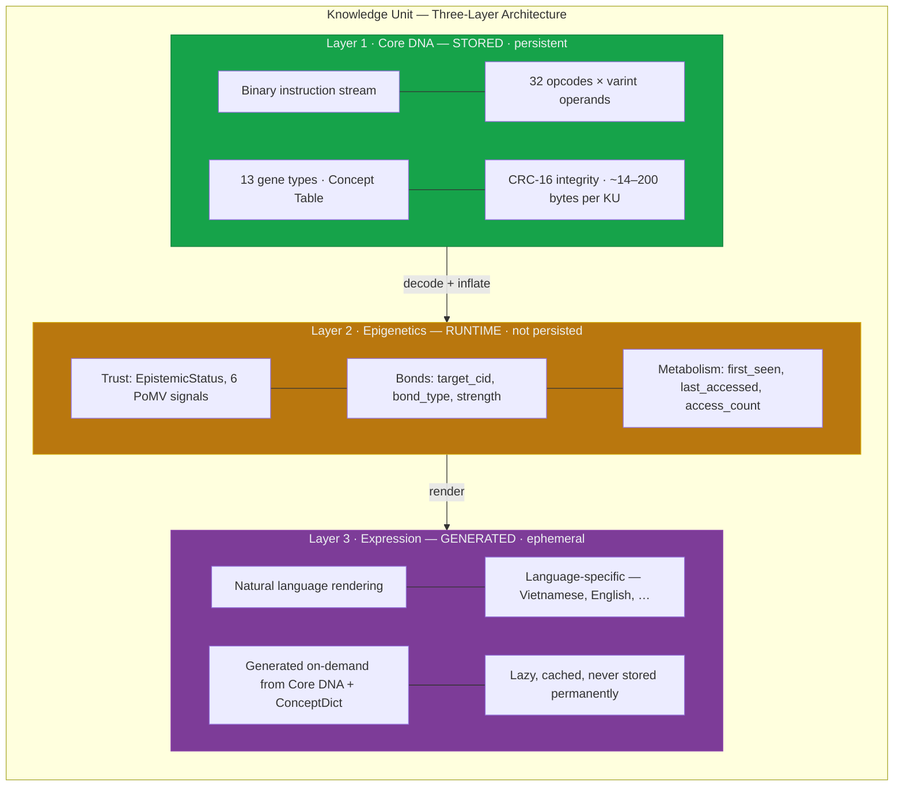

# 3. Core Architecture

> *"The question is not how to store knowledge, but how to encode meaning so that it can be composed, verified, evolved, and forgotten—all without words."*

The Knowledge Unit (KU) is the atomic data structure at the heart of the OneBrain knowledge representation system. Drawing on a sustained biological metaphor—where knowledge is treated as a living organism subject to selection, mutation, and decay—the KU architecture organises every representable assertion into three orthogonal layers: **Core DNA** (the persistent binary encoding), **Epigenetics** (runtime metadata for trust, bonds, and metabolism), and **Expression** (ephemeral natural-language rendering). This chapter provides a complete formal specification of each layer, from the compact opcode-based instruction set that defines the Core DNA through to the epigenetic metadata that governs a unit's lifecycle within the broader knowledge ecosystem.

---

## 3.1 Design Principles

Seven foundational principles constrain every design decision in the KU architecture. These principles are not aspirational; each is directly enforced by the type system and wire format.

### Principle 1: Immutability

Core DNA is immutable once created. Its Content Identifier (CID)—a 32-byte BLAKE3 hash of the encoded bytes—is its permanent, tamper-evident name. Any modification to the content produces a new CID and therefore a new Knowledge Unit. All mutable state resides exclusively in the Epigenetics layer, which modifies a KU's behaviour and visibility without altering the underlying DNA. This separation provides a strong invariant: the CID referenced in a bond, a `CID_REF` instruction, or a Concept Table entry is a cryptographic commitment to exact content.

### Principle 2: Content Addressability

Every serialised KU is identified by its BLAKE3 content identifier (CID), computed deterministically over the canonical Core DNA wire bytes. Two KUs with identical content always produce the same CID; a single-bit mutation produces a completely different identifier. Content addressing provides three guarantees simultaneously: (a) deduplication is trivially detectable via CID comparison, (b) integrity verification requires only recomputing the hash, and (c) immutability is enforced without requiring a centralised authority—once a KU is published, its CID is its permanent identity.

### Principle 3: Language Agnosticism

Concepts are represented exclusively as numeric identifiers (`ConceptId: u64`), never as natural-language strings. A given concept—say, *water*—receives the same identifier regardless of whether the originating knowledge was expressed in English, Vietnamese, Mandarin, or mathematical notation. The concept dictionary that maps identifiers to human-readable labels is maintained externally; the KU itself is entirely language-free. This design eliminates the synonymy and polysemy problems that plague string-keyed knowledge bases and makes cross-lingual knowledge fusion a zero-cost operation at the structural level.

### Principle 4: Layered Separation

The architecture enforces strict separation between three orthogonal concerns: *what* is known (Core DNA), *how it is assessed* (Epigenetics), and *how it is displayed* (Expression). Only Core DNA is persisted to disk or transmitted over the network. Epigenetics is managed by local subsystems (Epistemic Engine, Metabolism Store). Expression is regenerated on demand. This separation enables each layer to evolve independently and ensures that wire sizes remain minimal—typically smaller than the equivalent natural-language text.

### Principle 5: Evolutionary Extensibility

The Core DNA format uses a 5-bit opcode field, supporting 32 distinct instruction types; the `EXTENDED` opcode (`0x1F`) provides an escape mechanism for future expansion beyond 32. Gene types are encoded in 4 bits of the `VER_META` byte (bits[4:1]), with types 0–6 directly encoded and types 7–12 accessed via extension bytes. Unknown opcodes can be safely skipped by consulting a width table, preserving forward compatibility. This design mirrors the biological concept of gene duplication followed by neofunctionalisation—new semantic capacity emerges without disrupting existing structures.

### Principle 6: Offline-First

Every KU is self-contained. The Concept Table (§3.8) embeds all concept identity mappings needed to interpret the instruction stream, so a KU can be decoded without network access. The ConceptRegistry ships as a local file (~200 MB) providing O(1) lookup for ~8 million concepts. Together, these mechanisms ensure that knowledge processing operates fully offline, with network connectivity enhancing but never gating functionality.

### Principle 7: Verifiability

Integrity is enforced at two levels. A CRC-16/CCITT checksum (polynomial `0x1021`, init `0xFFFF`) appended to every Core DNA wire frame provides lightweight error detection for transport-level bit flips. The 32-byte BLAKE3 CID provides cryptographic tamper evidence. The combination gives defense-in-depth: CRC-16 detects accidental corruption; CID detects intentional modification.

---

## 3.2 Three-Layer Architecture Overview

The KU architecture splits a Knowledge Unit into three orthogonal layers, each optimised for a distinct concern: persistence, runtime management, and human consumption.



### 3.2.1 Design Rationale

The three-layer separation was driven by a key insight: by separating the persistent encoding (Core DNA) from runtime metadata (Epigenetics) and ephemeral rendering (Expression), the architecture achieves wire sizes consistently **smaller than natural-language text** while preserving all semantic expressiveness. Only the Core DNA layer is persisted to disk or transmitted over the network; the Epigenetics layer is managed by local subsystems, and the Expression layer is regenerated on demand.

### 3.2.2 Biological Analogy

**Table 3.1.** Biological-to-KU analogy mapping.

| Biological Entity | KU Analog | Layer | Function |
|---|---|---|---|
| DNA sequence | Core DNA instruction stream | Core DNA | Complete blueprint of the knowledge unit |
| Nucleotide base | `ConceptId` (u64) | Core DNA | Smallest indivisible semantic symbol |
| Codon (3-base triplet) | Opcode instruction (e.g., `TRIPLE s p o`) | Core DNA | Minimal meaning-bearing unit |
| Gene | Gene type (13 variants) | Core DNA | Classifies the type of knowledge payload |
| Epigenetic marks | Trust, Bonds, Metabolism | Epigenetics | Modifies expression without altering the DNA |
| Chemical bond | `Bond` (directed edge) | Epigenetics | Connects organisms to form networks |
| Immune system | `TrustSection` + `EpistemicStatus` | Epigenetics | Assesses and defends against misinformation |
| Metabolic rate | `metabolic_rate` (PoMV) | Epigenetics | Measures ongoing utilisation and vitality |
| Phenotype | Expression (natural language) | Expression | Observable traits generated from the genotype |
| Natural selection | Proof-of-Metabolic-Value | Epigenetics | High-value knowledge survives; low-value decays |

---

## 3.3 Layer 1: CoreDna — The Immutable Genome

The Core DNA layer is the persistent, binary encoding of a Knowledge Unit. It is structured as a sequential instruction stream enclosed in a minimal frame:

```
MAGIC(0x4B) | VER_META(1B) | [CONCEPT_TABLE] | INSTRUCTIONS | END(0x1E) | CRC-16(2B)
```

### 3.3.1 CoreDnaHeader

The header metadata is extracted from the first two bytes of the wire format:

```rust
pub struct CoreDnaHeader {
    pub version: u8,             // Format version (0–7, current = 2)
    pub gene_type: u8,           // Gene type (0–15)
    pub has_concept_table: bool,  // Whether this KU contains a concept table
}
```

The `VER_META` byte packs three fields into a single octet:

```
Bit:  7  6  5  4  3  2  1  0
      ├────────┤├──────────┤├┤
      version    gene_type   has_concept_table
      (3 bits)   (4 bits)    (1 bit)
```

Encoding and decoding:

$$\text{VER\_META} = (\text{version} \wedge \texttt{0x07}) \ll 5 \;\big|\; (\text{gene\_type} \wedge \texttt{0x0F}) \ll 1 \;\big|\; \text{has\_concept\_table}$$

The current version is `2` (binary `010`), yielding bits[7:5] = `010`.

### 3.3.2 CoreDna Struct

The complete Core DNA unit comprises the header, an optional concept table, and the instruction sequence:

```rust
pub struct CoreDna {
    pub header: CoreDnaHeader,
    pub concept_table: ConceptTable,
    pub instructions: Vec<Instruction>,
}
```

### 3.3.3 Instruction Set Overview

The Core DNA instruction set defines **32 opcodes** (`0x00`–`0x1F`), each encoded in a single opcode byte where bits[7:3] carry the 5-bit opcode and bits[2:0] carry a 3-bit modifier (reserved, currently zero). The instructions are organised into six functional categories:

- **Relational** (0x00–0x0B): `TRIPLE`, `QUALITY`, `QUANTITY`, `SEQUENCE`, `PART_OF`, `LOCATED`, `TEMPORAL`, `CAUSAL`, `SIMULATES`, `CONDITION`, `AGENT`, `TOOL`
- **Quantitative** (0x0C–0x0F): `RANGE`, `TOLERANCE`, `CONSTRAINT`, `ENUM_VAL`
- **Metadata** (0x10–0x12, 0x17): `CERTAINTY`, `DIFFICULTY`, `CID_REF`, `LABEL`
- **Procedural** (0x13–0x15): `STEP`, `PRECOND`, `EFFECT`
- **Gene-specific** (0x16, 0x18–0x1D): `AFFECT`, `TEXT_REF`, `FORMULA`, `WITNESS`, `MEDIA_REF`, `COMPOSITE_HDR`, `MEMBER`
- **Control** (0x1E–0x1F): `END`, `EXTENDED`

The complete instruction set specification, including operand layouts and wire byte mappings, is presented in §4.4.

### 3.3.4 Gene Types

The gene type classifies the kind of knowledge a KU encodes. The KU architecture defines **13 gene types**, encoded in the VER_META byte's bits[4:1]. Types 0–6 are encoded directly; types 7–12 share the base value `7` in the VER_META field and are disambiguated by an extension byte in the instruction stream.

```rust
#[repr(u8)]
pub enum GeneType {
    Fact            = 0,   // VER_META[4:1] = 0, wire: (0, —)
    Procedure       = 1,   // VER_META[4:1] = 1, wire: (1, —)
    Experience      = 2,   // VER_META[4:1] = 2, wire: (2, —)
    Creative        = 3,   // VER_META[4:1] = 3, wire: (3, —)
    MediaExperience = 4,   // VER_META[4:1] = 4, wire: (4, —)
    Testimony       = 5,   // VER_META[4:1] = 5, wire: (5, —)
    Formal          = 6,   // VER_META[4:1] = 6, wire: (6, —)
    Hypothesis      = 7,   // VER_META[4:1] = 7, wire: (7, 0x00)
    Narrative       = 8,   // VER_META[4:1] = 7, wire: (7, 0x01)
    Sensory         = 9,   // VER_META[4:1] = 7, wire: (7, 0x02)
    Composite       = 10,  // VER_META[4:1] = 7, wire: (7, 0x03)
    Normative       = 11,  // VER_META[4:1] = 7, wire: (7, 0x04)
    Definition      = 12,  // VER_META[4:1] = 7, wire: (7, 0x05)
}
```

**Table 3.2.** Gene type summary.

| Value | Name | Wire Encoding | Description |
|---|---|---|---|
| 0 | Fact | `(0, —)` | Verified factual statement as SPO triples |
| 1 | Procedure | `(1, —)` | Step-by-step process with preconditions and effects |
| 2 | Experience | `(2, —)` | First-person experiential knowledge with VAD affect |
| 3 | Creative | `(3, —)` | Creative/artistic content with cultural context |
| 4 | MediaExperience | `(4, —)` | Multi-sensory media experience and reaction |
| 5 | Testimony | `(5, —)` | Witnessed account with proximity and witness count |
| 6 | Formal | `(6, —)` | Formally proven content (mathematics, logic) |
| 7 | Hypothesis | `(7, 0x00)` | Testable proposition with confidence level |
| 8 | Narrative | `(7, 0x01)` | Story/narrative structure with cultural origin |
| 9 | Sensory | `(7, 0x02)` | Sensory description with modality descriptors |
| 10 | Composite | `(7, 0x03)` | Multi-gene composite KU aggregating members |
| 11 | Normative | `(7, 0x04)` | Prescriptive rule (should/ought) |
| 12 | Definition | `(7, 0x05)` | Concept definition |

### 3.3.5 Content Identifier (CID)

Every KU is identified by a 32-byte BLAKE3 hash of its encoded Core DNA bytes:

```rust
let encoded = encode_core_dna(&dna)?;
let cid: [u8; 32] = blake3::hash(&encoded).into();
```

The CID serves as a globally unique, content-derived address. Two independently encoded copies of the same knowledge produce the same CID, enabling deduplication and convergence without coordination. Any modification—even a single-bit flip—produces a completely different CID with probability $1 - 2^{-256}$.

---

## 3.4 Layer 2: Epigenetics — Runtime Metadata

> **Architectural note.** The Epigenetics layer is maintained at runtime by the Epistemic Engine and Metabolism Store. It is not persisted in the Core DNA wire format.

In molecular biology, epigenetic modifications (methylation, acetylation, chromatin remodelling) alter gene expression without changing the underlying DNA sequence. The KU Epigenetics layer serves an analogous function: it modifies how a KU is discovered, assessed, connected, and managed without altering its Core DNA content.

### 3.4.1 Epigenetics Struct

```rust
pub struct Epigenetics {
    pub trust: TrustSection,
    pub bonds: Vec<Bond>,
    pub epistemic_status: EpistemicStatus,
    pub first_seen: u64,
    pub last_accessed: u64,
    pub access_count: u32,
}
```

### 3.4.2 TrustSection — Six PoMV Signals

The `TrustSection` implements Proof-of-Metabolic-Value (PoMV), a bio-inspired mechanism for assessing a KU's ongoing value within the knowledge ecosystem. Six signals collectively determine whether a KU is preferentially cached, replicated, and surfaced—or archived and decayed.

```rust
pub struct TrustSection {
    pub epistemic_status: EpistemicStatus,
    pub metabolic_rate: u16,         // [0, 10000]
    pub prediction_score: u16,       // [0, 10000]
    pub entropy_at_creation: u16,    // [0, 10000]
    pub survival_score: u16,         // [0, 10000]
    pub synaptic_centrality: u16,    // [0, 10000]
    pub niche_fitness: u16,          // [0, 10000]
}
```

All six signals use a `u16` representation in the range [0, 10000], mapping linearly to [0.0, 1.0]. This fixed-point encoding provides four decimal digits of precision at 2 bytes per signal—12 bytes total for the full PoMV vector.

**Table 3.3.** PoMV signals with biological analogs.

| Signal | Description | Biological Analog |
|---|---|---|
| `metabolic_rate` | Frequency of access and citation | Cellular metabolic rate |
| `prediction_score` | Accuracy of predictions derived from this KU | Fitness (reproductive success) |
| `entropy_at_creation` | Novelty/information content when created | Genetic diversity at birth |
| `survival_score` | Duration of survival without deprecation | Organism lifespan |
| `synaptic_centrality` | Number and weight of incoming/outgoing bonds | Neural hub centrality |
| `niche_fitness` | Relevance within the user's current knowledge domains | Ecological niche fitness |

### 3.4.3 Bond Struct

A **bond** is a directed, typed edge from the current KU to another KU identified by its CID. Bonds form the connective tissue of the knowledge graph.

```rust
pub struct Bond {
    pub target_cid: [u8; 32],   // Target KU CID (32 bytes)
    pub bond_type: BondType,     // Bond type enumeration
    pub strength: f32,           // Connection strength
    pub created_at: u64,         // Unix timestamp
}
```

The `target_cid` field contains the 32-byte BLAKE3 hash of the target KU's Core DNA, establishing a cryptographic commitment to the exact content of the referenced unit.

### 3.4.4 EpistemicStatus

The `EpistemicStatus` classifies the epistemic standing of a knowledge claim on an ordinal scale, from unverified rumor through axiomatic truth. It provides an at-a-glance assessment of how much verification a KU has undergone, enabling query engines to calibrate trust and prefer well-supported knowledge over newly ingested, unverified units.

---

## 3.5 Layer 3: Expression — Language-Specific Rendering

The Expression layer generates human-readable natural language text from the Core DNA encoding and a concept dictionary. It is the *phenotype* of the knowledge organism—the observable output produced from the genotype.

### 3.5.1 Expression Struct

```rust
pub struct Expression {
    pub text: String,
    pub lang: String,
    pub concept_names: Vec<(ConceptId, String)>,
}
```

The `concept_names` field caches the resolved names of all ConceptIds referenced in the instruction stream, enabling efficient re-rendering without repeated dictionary lookups.

### 3.5.2 Lazy Rendering

Expression is computed on-demand via `KuRuntime::expression(lang, dict)` and cached until the language or dictionary changes. This lazy evaluation strategy avoids the cost of rendering for KUs that are only machine-processed (e.g., during graph traversal or batch indexing) and ensures that storage is never consumed by language-specific text.

### 3.5.3 Rendering Rules

**Table 3.4.** Expression rendering rules for Core DNA instructions.

| Instruction | Rendering Pattern |
|---|---|
| `Triple(s, p, o)` | "{s} {p} {o}" |
| `Quality(s, q)` | "{s}: {q}" |
| `Quantity(s, v, u)` | "{s} = {v} {u}" |
| `Step(n, a, t)` | "Step {n}: {a} {t}" |
| `Precond(c)` | "Requires: {c}" |
| `Effect(c)` | "Effect: {c}" |
| `PartOf(p, w)` | "{p} ⊂ {w}" |
| `Located(s, l)` | "{s} @ {l}" |
| `Temporal(s, t)` | "{s} → {t}" |
| `Causal(c, e)` | "{c} → {e}" |
| `Certainty(l)` | "Certainty: {l/100}%" |
| `Tolerance(s, v, d)` | "{s} = {v} ± {d}" |
| `Range(s, min, max)` | "{s} ∈ [{min}, {max}]" |
| `Constraint(s, op, t)` | "{s} {op} {t}" |

---

## 3.6 KuRuntime — The Composite Organism

The `KuRuntime` struct integrates all three layers into a single runtime representation—the living organism composed of its DNA, its epigenetic state, its expressed phenotype, and its identity.

### 3.6.1 Struct

```rust
pub struct KuRuntime {
    pub dna: CoreDna,
    pub epi: Epigenetics,
    pub expr: Option<Expression>,
    pub cid: [u8; 32],
}
```

### 3.6.2 Key Methods

**Table 3.5.** Principal `KuRuntime` methods.

| Method | Signature | Description |
|---|---|---|
| `from_dna` | `from_dna(dna) → Result<KuRuntime>` | Create from CoreDna, computing CID |
| `expression` | `&mut self, lang, dict → &Expression` | Lazy render and cache |
| `apply_pomv_update` | `&mut self, update` | Apply PoMV tick results |
| `cid_bytes` | `() → [u8; 32]` | Get CID for PomvRuntime key |
| `extract_field` | `field → ExtractedValue` | Extract field for KQL queries |

---

## 3.7 CCID — Content-Addressed Concept Identity

### 3.7.1 Definition

A CCID (Content-Addressed Concept Identity) is a 16-byte (128-bit) truncated BLAKE3 hash used to globally identify concepts across nodes, without centralised coordination.

```rust
pub type Ccid = [u8; 16];

pub fn ccid(canonical: &[u8]) -> Ccid {
    let hash = blake3::hash(canonical);
    let mut result = [0u8; 16];
    result.copy_from_slice(&hash.as_bytes()[0..16]);
    result
}
```

The input to the hash function is a **canonical form** byte string, chosen according to a strict priority order that ensures global determinism.

### 3.7.2 Canonical Form Priority

When generating a CCID, the highest-priority canonical form available is used:

**Table 3.6.** CCID canonical form priority.

| Priority | Prefix | Example | Source |
|---|---|---|---|
| 1 (highest) | `wd:` | `wd:Q283` (water) | Wikidata QID |
| 2 | `gn:` | `gn:2643743` (London) | GeoNames ID |
| 3 | `ncbi:` | `ncbi:9606` (Homo sapiens) | NCBI Taxonomy |
| 4 | `chebi:` | `chebi:15377` (water) | ChEBI ID |
| 5 | `cas:` | `cas:7732-18-5` (water) | CAS Registry Number |
| 6 | `ob:` | `ob:chemistry/water` | OneBrain namespace |
| 7 (lowest) | *(raw bytes)* | BLAKE3 of definition KU | Fallback for novel concepts |

Convenience functions generate CCIDs from each source:

```rust
pub fn ccid_from_wikidata(qid: u32) -> Ccid {
    let canonical = format!("wd:Q{}", qid);
    ccid(canonical.as_bytes())
}

pub fn ccid_from_geonames(gn_id: u32) -> Ccid {
    let canonical = format!("gn:{}", gn_id);
    ccid(canonical.as_bytes())
}

pub fn ccid_from_ncbi(taxid: u32) -> Ccid {
    let canonical = format!("ncbi:{}", taxid);
    ccid(canonical.as_bytes())
}

pub fn ccid_from_chebi(chebi_id: u32) -> Ccid {
    let canonical = format!("chebi:{}", chebi_id);
    ccid(canonical.as_bytes())
}

pub fn ccid_from_onebrain(path: &str) -> Ccid {
    let canonical = format!("ob:{}", path);
    ccid(canonical.as_bytes())
}
```

### 3.7.3 Collision Resistance

A 128-bit hash provides a birthday bound of approximately $2^{64} \approx 1.8 \times 10^{19}$. Projecting forward to a universe of 50 billion concepts (a generous upper bound for the 2526 timeframe), the collision probability is:

$$P(\text{collision}) \approx \frac{n^2}{2^{129}} = \frac{(5 \times 10^{10})^2}{2^{129}} \approx 3.67 \times 10^{-18}$$

This is seven orders of magnitude below the probability of a single undetected hardware bit flip during computation, confirming that 128-bit CCIDs provide ample collision resistance for practical concept namespaces.

---

## 3.8 Concept Table

### 3.8.1 Purpose

The Concept Table provides a self-contained mapping from wire-local ConceptIds to globally unique CCIDs, embedded directly within the Core DNA wire format. This ensures that any KU can be interpreted without access to external registries—a critical property for offline operation and long-term archival.

### 3.8.2 Wire Encoding

When the `has_concept_table` flag (bit[0] of VER_META) is set, the Concept Table appears immediately after the VER_META byte:

```
COUNT(varint) | ENTRY[0] | ENTRY[1] | ... | ENTRY[COUNT-1]
```

Each entry maps a local ConceptId to a 16-byte CCID:

```rust
pub struct ConceptTableEntry {
    pub local_id: ConceptId,  // Local ID used in instruction stream
    pub ccid: [u8; 16],       // 128-bit CCID
}

pub type ConceptTable = Vec<ConceptTableEntry>;
```

Wire layout per entry:

```
LOCAL_ID(varint) | CCID(16 bytes raw)
```

### 3.8.3 Tier Threshold

Only **Tier 2+ concepts** (ConceptId ≥ 16,512) require Concept Table entries. Tier 0 concepts (0–127) and Tier 1 concepts (128–16,511) are universally known and hardcoded; their CCID mappings are built into every implementation. This threshold minimises the Concept Table's wire overhead: most KUs reference predominantly Tier 0 and Tier 1 concepts, so the table is either empty or contains only a few entries.

---

## 3.9 Tier 0 Universal Concepts

Tier 0 occupies the first 128 slots of the ConceptId namespace (IDs 0–127). These concepts are hardcoded into every KU implementation and encoded as single-byte varints (prefix `0xxxxxxx`). They constitute the *genetic code* of the KU system—fixed, universal, and immutable. Currently, 80 concepts are defined (IDs 0–79), 47 slots are reserved for future universal concepts (IDs 80–126), and 1 serves as a sentinel (ID 127).

The 80 defined concepts are organised into 8 semantic groups:

### 3.9.1 Structural Predicates (IDs 0–15)

**Table 3.7.** Structural predicate concepts.

| ID | Constant | Semantics |
|---|---|---|
| 0 | `SELF_REF` | Self-reference / identity |
| 1 | `IS_A` | Taxonomy: X is a Y |
| 2 | `HAS_PART` | Meronymy: X has part Y |
| 3 | `RELATED_TO` | Generic relation (fallback) |
| 4 | `INSTANCE_OF` | X is instance of class Y |
| 5 | `SUBCLASS_OF` | X is subclass of Y |
| 6 | `OPPOSITE_OF` | Antonymy |
| 7 | `SIMILAR_TO` | Analogy / synonymy |
| 8 | `DERIVES_FROM` | Origin / etymology |
| 9 | `IMPLIES` | Logical implication |
| 10 | `EQUIVALENT` | Equivalence / identity |
| 11 | `DISTINCT` | Distinctness |
| 12 | `PROPERTY_OF` | X is property of Y |
| 13 | `VALUE_OF` | X is value of property Y |
| 14 | `MADE_OF` | Material composition |
| 15 | `USED_FOR` | Purpose / function |

These 16 predicates provide a minimal ontological vocabulary sufficient to express taxonomic, mereological, and functional relationships—the structural backbone of any knowledge graph [Sowa, 2000].

### 3.9.2 Causal & Temporal (IDs 16–27)

**Table 3.8.** Causal and temporal concepts.

| ID | Constant | Semantics |
|---|---|---|
| 16 | `CAUSES` | X causes Y |
| 17 | `PREVENTS` | X prevents Y |
| 18 | `ENABLES` | X enables Y |
| 19 | `PRECEDES` | X before Y |
| 20 | `FOLLOWS` | X after Y |
| 21 | `DURING` | X during Y |
| 22 | `BEGINS` | Start point |
| 23 | `ENDS` | End point |
| 24 | `SIMULTANEOUS` | Co-occurrence |
| 25 | `CORRELATES` | Correlation (not causation) |
| 26 | `REQUIRES` | Prerequisite |
| 27 | `PRODUCES` | Production / output |

The explicit separation of `CAUSES` (ID 16) from `CORRELATES` (ID 25) reflects the fundamental epistemological distinction between causation and correlation [Pearl, 2009].

### 3.9.3 Spatial (IDs 28–35)

**Table 3.9.** Spatial concepts.

| ID | Constant | Semantics |
|---|---|---|
| 28 | `AT` | Location: X at Y |
| 29 | `CONTAINS` | X contains Y |
| 30 | `ABOVE` | Spatial above |
| 31 | `BELOW` | Spatial below |
| 32 | `NEAR` | Spatial proximity |
| 33 | `INSIDE` | Spatial inside |
| 34 | `BETWEEN` | Spatial between |
| 35 | `ADJACENT` | Spatial adjacency |

These eight spatial primitives are drawn from research on spatial cognition and language universals [Levinson, 2003], providing a minimal set sufficient to express the spatial relationships that appear across all human languages.

### 3.9.4 Logical & Modal (IDs 36–43)

**Table 3.10.** Logical and modal concepts.

| ID | Constant | Semantics |
|---|---|---|
| 36 | `NOT` | Negation |
| 37 | `AND` | Conjunction |
| 38 | `OR` | Disjunction |
| 39 | `IF_THEN` | Conditional |
| 40 | `POSSIBLE` | Possibility |
| 41 | `NECESSARY` | Necessity |
| 42 | `EXISTS` | Existential quantifier |
| 43 | `FOR_ALL` | Universal quantifier |

The logical operators (`NOT`, `AND`, `OR`, `IF_THEN`) provide propositional logic; the quantifiers (`EXISTS`, `FOR_ALL`) extend to first-order logic; the modal operators (`POSSIBLE`, `NECESSARY`) provide alethic modality [Kripke, 1963].

### 3.9.5 SI Base Units (IDs 44–50)

**Table 3.11.** SI base unit concepts.

| ID | Constant | Unit |
|---|---|---|
| 44 | `UNIT_METER` | Length (m) |
| 45 | `UNIT_KILOGRAM` | Mass (kg) |
| 46 | `UNIT_SECOND` | Time (s) |
| 47 | `UNIT_AMPERE` | Electric current (A) |
| 48 | `UNIT_KELVIN` | Temperature (K) |
| 49 | `UNIT_MOLE` | Amount of substance (mol) |
| 50 | `UNIT_CANDELA` | Luminous intensity (cd) |

All seven SI base units [BIPM, 2019] are embedded in Tier 0 as single-byte ConceptIds, ensuring that quantitative measurements in the `QUANTITY`, `RANGE`, and `TOLERANCE` instructions can reference their units at minimal wire cost.

### 3.9.6 Common Derived Units (IDs 51–63)

**Table 3.12.** Common derived unit concepts.

| ID | Constant | Unit |
|---|---|---|
| 51 | `UNIT_HERTZ` | Frequency (Hz) |
| 52 | `UNIT_NEWTON` | Force (N) |
| 53 | `UNIT_PASCAL` | Pressure (Pa) |
| 54 | `UNIT_JOULE` | Energy (J) |
| 55 | `UNIT_WATT` | Power (W) |
| 56 | `UNIT_VOLT` | Voltage (V) |
| 57 | `UNIT_DEGREE` | Angle (°) |
| 58 | `UNIT_RADIAN` | Angle (rad) |
| 59 | `UNIT_PERCENT` | Percentage (%) |
| 60 | `UNIT_BYTE` | Digital storage (byte) |
| 61 | `UNIT_BIT` | Digital information (bit) |
| 62 | `UNIT_LITER` | Volume (L) |
| 63 | `UNIT_DIMENSIONLESS` | Dimensionless quantity |

These 13 derived units cover the most frequently encountered measurement domains: mechanics, electromagnetism, thermodynamics, information theory, and angular measurement.

### 3.9.7 Epistemological (IDs 64–69)

**Table 3.13.** Epistemological concepts.

| ID | Constant | Semantics |
|---|---|---|
| 64 | `TRUE_VAL` | Truth |
| 65 | `FALSE_VAL` | Falsehood |
| 66 | `UNKNOWN_VAL` | Unknown |
| 67 | `APPROXIMATE` | Approximate value |
| 68 | `EXACT` | Exact value |
| 69 | `MEASURED` | Measured value |

These six concepts encode the epistemic status of individual values, distinguishing exact theoretical values from approximate estimates and empirical measurements.

### 3.9.8 Agentive / Thematic Roles (IDs 70–79)

**Table 3.14.** Agentive and thematic role concepts.

| ID | Constant | Semantics |
|---|---|---|
| 70 | `AGENT` | Who does (actor) |
| 71 | `PATIENT` | Who receives (affected) |
| 72 | `INSTRUMENT` | With what (tool) |
| 73 | `BENEFICIARY` | For whom |
| 74 | `SOURCE` | From where |
| 75 | `GOAL` | To where/what |
| 76 | `PURPOSE` | Why |
| 77 | `METHOD` | How |
| 78 | `RESULT` | Outcome |
| 79 | `CONDITION` | Under what condition |

These 10 thematic roles are inspired by case grammar [Fillmore, 1968] and thematic role theory [Dowty, 1991]. They provide a language-agnostic vocabulary for annotating the participants of events and processes.

### 3.9.9 Reserved and Sentinel

**Table 3.15.** Reserved and sentinel ranges.

| Range | Purpose |
|---|---|
| 80–126 | Reserved for future universal concepts (47 slots) |
| 127 | `UNKNOWN_CONCEPT` — sentinel / fallback value |

The `UNKNOWN_CONCEPT` sentinel (ID 127) is used when a concept cannot be resolved during encoding. It serves as a safe fallback that preserves structural validity while signalling incomplete concept resolution.

---

## 3.10 Concept Registry

### 3.10.1 Overview

The ConceptRegistry is a binary file in `.obr` (OneBrain Registry) format, shipped with every node. It provides offline, O(1) concept name-to-CCID resolution, enabling accurate concept encoding without network access.

**Table 3.16.** ConceptRegistry specifications.

| Property | Value |
|---|---|
| File format | `.obr` (OneBrain Registry) |
| Initial size | ~200 MB |
| Capacity | ~8 million concepts |
| Coverage target | 99.9% of general-domain knowledge |
| Lookup | O(1) hash table (`String → CCID`) |
| Update cycle | Quarterly |

### 3.10.2 Concept Sources

**Table 3.17.** ConceptRegistry data sources.

| Source | Coverage | Canonical Form |
|---|---|---|
| Wikidata | Entities, properties | `wd:Q{id}` |
| GeoNames | Geographic features | `gn:{id}` |
| NCBI Taxonomy | Species, organisms | `ncbi:{taxid}` |
| ChEBI | Chemical compounds | `chebi:{id}` |

### 3.10.3 Resolution Algorithm

The registry implements a cascading resolution strategy:

```
1. Exact match:          "water"    → Found(CCID)
2. Case-insensitive:     "Water"    → Found(CCID)
3. Fuzzy match:          "ngua van" → Fuzzy("ngựa vằn", CCID)
4. Ambiguous:            "Mercury"  → Ambiguous([planet, element, god])
5. Not found:                       → AI fallback (generate CCID from context)
```

Step 3 handles Vietnamese diacritics by stripping tone marks before comparison. Step 4 returns all candidate CCIDs for ambiguous terms, deferring disambiguation to the encoding pipeline. Step 5 invokes the novel concept protocol.

### 3.10.4 Novel Concept Protocol

When a node encounters a genuinely novel concept—one absent from the registry—the following protocol generates a deterministic CCID:

1. The AI encoder generates a `Definition` gene (GeneType = 12) encoding the concept's defining characteristics.
2. The CCID is computed as `blake3(encoded_definition_ku)[0..16]`.
3. The definition KU propagates to peers via the gossip protocol.
4. Quarterly registry updates absorb community-validated novel concepts into the global registry.

This protocol ensures that novel concepts receive stable identities immediately upon creation, while the quarterly update cycle provides convergence across the decentralised network.

---

## References

- BIPM (2019). *The International System of Units (SI)*, 9th edition. Bureau International des Poids et Mesures.
- Dowty, D. (1991). Thematic proto-roles and argument selection. *Language*, 67(3), 547–619.
- Fillmore, C. J. (1968). The case for case. In *Universals in Linguistic Theory* (pp. 1–88). Holt, Rinehart and Winston.
- Kripke, S. A. (1963). Semantical considerations on modal logic. *Acta Philosophica Fennica*, 16, 83–94.
- Levinson, S. C. (2003). *Space in Language and Cognition: Explorations in Cognitive Diversity*. Cambridge University Press.
- Pearl, J. (2009). *Causality: Models, Reasoning, and Inference*, 2nd edition. Cambridge University Press.
- Sowa, J. F. (2000). *Knowledge Representation: Logical, Philosophical, and Computational Foundations*. Brooks/Cole.
