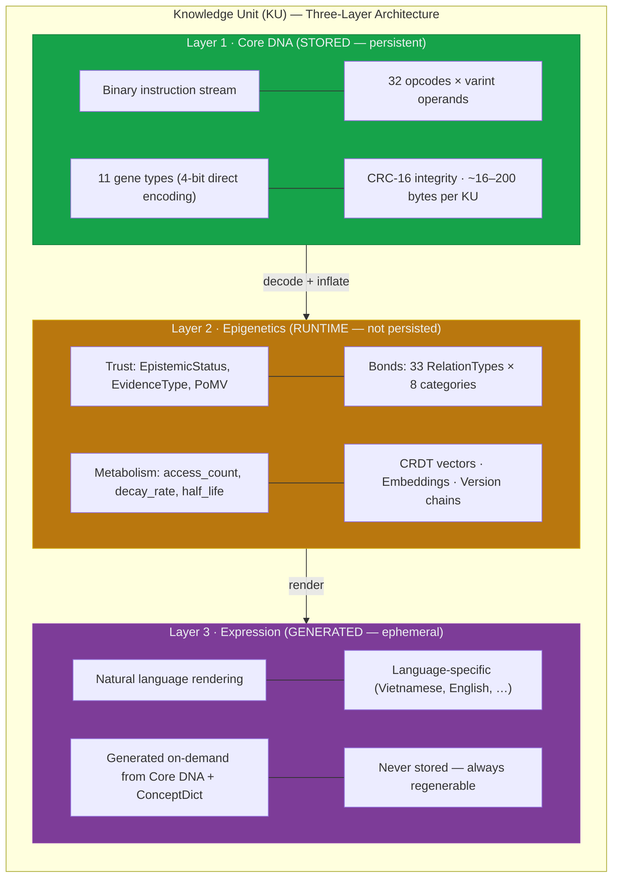
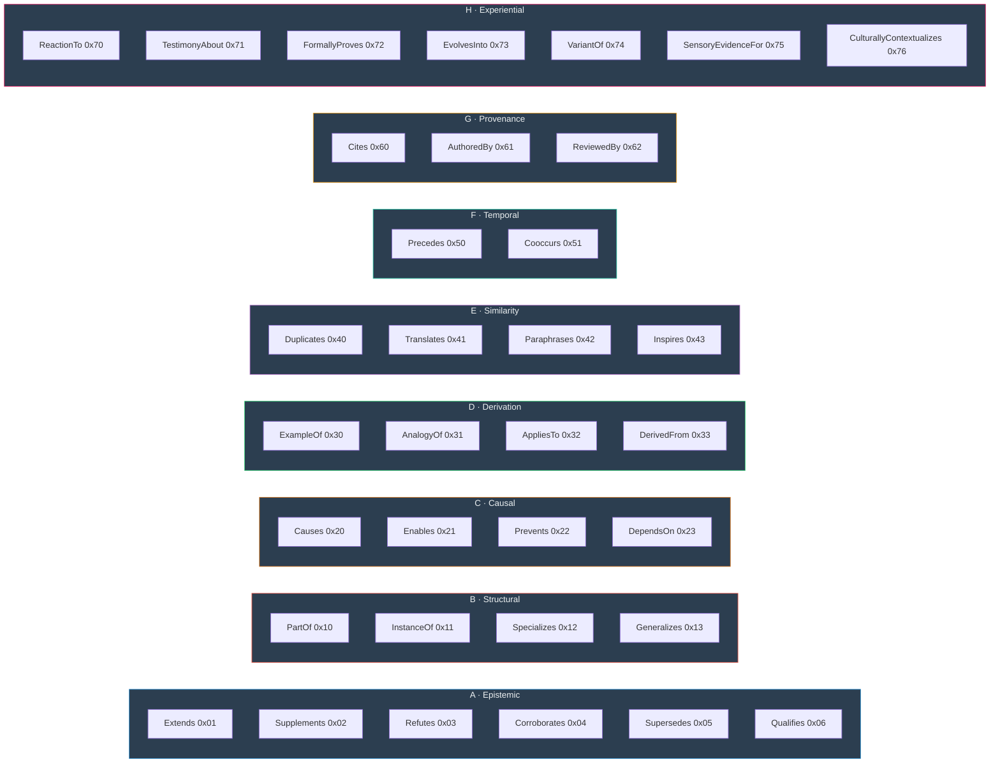
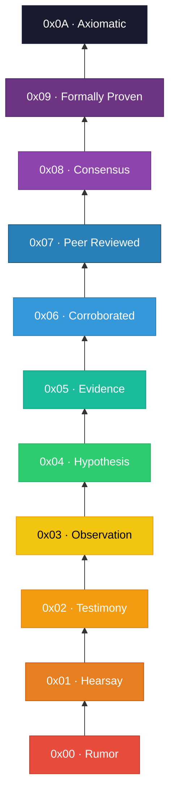
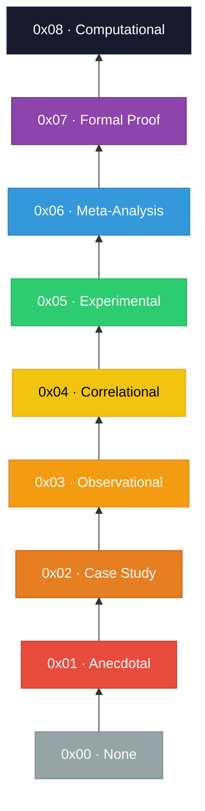
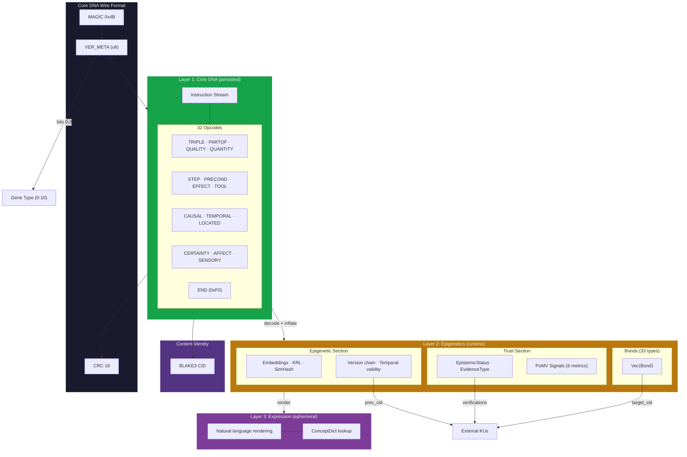

# §3. The Three-Layer Knowledge Unit Architecture

> *"The question is not how to store knowledge, but how to encode meaning so that it can be composed, verified, evolved, and forgotten—all without words."*

The Knowledge Unit (KU) is the atomic data structure at the heart of the OneBrain knowledge representation system. Drawing on a sustained biological metaphor—where knowledge is treated as a living organism subject to selection, mutation, and decay—the KU architecture organises every representable assertion into three orthogonal layers: **Core DNA** (the persistent binary encoding), **Epigenetics** (runtime metadata for trust, bonds, and metabolism), and **Expression** (ephemeral natural-language rendering). This section provides a complete formal specification of each layer, from the compact opcode-based instruction set that defines the Core DNA through to the epigenetic metadata that governs a unit's lifecycle within the broader knowledge ecosystem.

## 3.1 Design Principles

Seven foundational principles constrain every design decision in the KU architecture. These principles are not aspirational; each is directly enforced by the type system and wire format.

### Principle 1: Language Agnosticism

Concepts are represented exclusively as numeric identifiers (`ConceptId: u64`), never as natural-language strings. A given concept—say, *water*—receives the same identifier regardless of whether the originating knowledge was expressed in English, Vietnamese, Mandarin, or mathematical notation. The concept dictionary that maps identifiers to human-readable labels is maintained externally; the KU itself is entirely language-free. This design eliminates the synonymy and polysemy problems that plague string-keyed knowledge bases, and it makes cross-lingual knowledge fusion a zero-cost operation at the structural level.

### Principle 2: Content Addressing

Every serialised KU is identified by its BLAKE3 content identifier (CID). The CID is computed deterministically over the canonical Core DNA wire bytes of the unit's payload. Two KUs with identical content will always produce the same CID; a single-bit mutation produces a completely different identifier. Content addressing provides three guarantees simultaneously: (a) deduplication is trivially detectable via CID comparison, (b) integrity verification requires only recomputing the hash, and (c) immutability is enforced without requiring a centralised authority—once a KU is published, its CID is its permanent, tamper-evident name.

### Principle 3: Incremental Parseability

The Core DNA wire format is designed as a sequential instruction stream terminated by an explicit `END` marker (`0xF0`). Each instruction is self-delimiting: the opcode byte determines the operand count and types, so a decoder can skip unknown instructions without losing synchronisation. A query engine that needs only `TRIPLE` instructions can ignore `STEP`, `AFFECT`, and other opcodes. Incremental parseability is essential for constrained environments (embedded devices, edge nodes) and for network protocols where partial KU exchange reduces bandwidth.

### Principle 4: Evolutionary Extensibility

The Core DNA format uses a 4-bit gene type field in the `VER_META` byte (bits 0–3), directly encoding all 11 gene types (0–10) without requiring an extension mechanism. The remaining 4 bits (4–7) encode the format version. Because the instruction set uses a full opcode byte (`u8`), up to 256 distinct instruction types are available; currently 32 are defined, leaving ample room for future semantic extensions. Unknown opcodes can be safely skipped by consulting a width table, preserving forward compatibility. This design mirrors the biological concept of gene duplication followed by neofunctionalisation—new semantic capacity emerges without disrupting existing structures.

### Principle 5: CRDT Nativity

Every mutable field in the KU architecture uses an appropriate Conflict-free Replicated Data Type (CRDT). Bond weights use last-writer-wins (LWW) registers with lamport timestamps. Codon sets use add-only sets (G-Sets). The `reinforce_count` field on bonds is a grow-only counter (G-Counter). This ensures that concurrent modifications from multiple nodes converge to a consistent state without coordination, making the KU natively suitable for distributed, peer-to-peer knowledge networks.

### Principle 6: Wire Efficiency

A minimal Fact-type KU—one triple, no bonds, no trust metadata—serialises to approximately **16 bytes** in the Core DNA wire format. This figure includes the 1-byte magic (`0x4B`), 1-byte `VER_META`, the instruction stream, the `END` marker (`0xF0`), and the trailing CRC-16 checksum. A richer KU with multiple triples, procedural steps, and metadata instructions typically occupies **16–88 bytes**—consistently *smaller than the equivalent natural-language text* in UTF-8. By using varint encoding for concept IDs (1–4 bytes depending on tier), typed numeric values (`NumericValue` enum selecting the minimal wire width), and structured opcodes that replace entire grammatical patterns with single bytes, the Core DNA format achieves information density that surpasses hand-tuned binary protocols.

### Principle 7: Bio-Inspired Throughout

The biological metaphor is not decorative; it is carried to the implementation level. Knowledge Units are *organisms*. Their content payloads are *genes*. The connections between them are *bonds* (analogous to molecular bonds or synaptic connections). Their trustworthiness metadata is a *trust section* (analogous to an immune system). Their lifecycle metadata is *epigenetic*—it modifies expression without altering the underlying gene. The entire system evolves through *selection pressure* (Proof-of-Metabolic-Value), *mutation* (version chains via `prev_cid`), and *extinction* (decay functions and deprecation states). This coherent metaphor provides not just naming conventions but genuine architectural guidance: when a design question arises, asking "how does biology solve this?" reliably produces the right answer.

---

## 3.2 Three-Layer Architecture Overview

The KU architecture splits a Knowledge Unit into three orthogonal layers, each optimised for a distinct concern: persistence, runtime management, and human consumption. The layers are designed so that any layer can be omitted, extended, or replaced without affecting the others.



### 3.2.1 Design Rationale

The three-layer separation was driven by a key insight: by separating the persistent encoding (Core DNA) from runtime metadata (Epigenetics) and ephemeral rendering (Expression), the architecture achieves wire sizes consistently **smaller than natural-language text** while preserving all semantic expressiveness. Only the Core DNA layer is persisted to disk or transmitted over the network; the Epigenetics layer is managed by local subsystems (Epistemic Engine, Metabolism Store), and the Expression layer is regenerated on demand.

### 3.2.3 Biological Analogy

**Table 3.1.** Biological-to-KU analogy mapping (updated for three-layer architecture).

| Biological Entity | KU Analog | Layer | Function |
|---|---|---|---|
| DNA sequence | Core DNA instruction stream | Core DNA | Complete blueprint of the knowledge unit |
| Nucleotide base | `ConceptId` (u64) | Core DNA | Smallest indivisible semantic symbol |
| Codon (3-base triplet) | Opcode instruction (e.g., `TRIPLE s p o`) | Core DNA | Minimal meaning-bearing unit |
| Gene | Gene type (11 variants, 4-bit encoded) | Core DNA | Classifies the type of knowledge payload |
| Epigenetic marks | Trust, Bonds, Embeddings, Metabolism | Epigenetics | Modifies expression without altering the DNA |
| Chemical bond | `Bond` (directed edge, 33 types) | Epigenetics | Connects organisms to form networks |
| Immune system | `TrustSection` + `EpistemicStatus` | Epigenetics | Assesses and defends against misinformation |
| Metabolic rate | `metabolic_rate` (PoMV) | Epigenetics | Measures ongoing utilisation and vitality |
| Synaptic strength | `weight` (u16) on bonds | Epigenetics | Connection strength, subject to reinforcement and decay |
| Phenotype | Expression (natural language) | Expression | Observable traits generated from the genotype |
| Apoptosis | `EdgeState::Deprecated` | Epigenetics | Programmed knowledge death |
| Mutation | Version chain (`prev_cid`) | Epigenetics | Knowledge evolves through successive revisions |
| Natural selection | Proof-of-Metabolic-Value | Epigenetics | High-value knowledge survives; low-value decays |

---

## 3.3 Core DNA: Instruction Set and Concept Encoding

The Core DNA layer is the persistent, binary encoding of a Knowledge Unit. It is structured as a sequential instruction stream: a 1-byte magic marker (`0x4B`), a `VER_META` byte encoding the format version and gene type, a variable-length sequence of opcode instructions, an `END` marker (`0xF0`), and a CRC-16 checksum. The instruction set defines 32 opcodes organised into six categories (Relationship, Procedural, Causal/Spatial, Meta/Experiential, Structural, and Control), each taking varint-encoded `ConceptId` operands. The following subsections describe the concept encoding scheme and the complete instruction set.

### 3.3.1 Instruction Format

Each Core DNA instruction consists of a 1-byte opcode followed by zero or more varint-encoded operands. The opcode determines the number and types of operands, making the stream self-delimiting:

$$\text{Instruction} = \langle \text{opcode}, \text{operand}_1, \text{operand}_2, \ldots, \text{operand}_k \rangle$$

where $k$ is determined by the opcode. For example, `TRIPLE` ($k=3$) takes three `ConceptId` operands (subject, predicate, object), while `CERTAINTY` ($k=1$) takes a single `u16` level.

**Table 3.1a.** Complete Core DNA instruction set (32 opcodes).

| Category | Opcode | Name | Operands | Semantics |
|---|---|---|---|---|
| **Relationship** | `0x01` | `TRIPLE` | s, p, o | Subject-Predicate-Object assertion |
| | `0x02` | `PARTOF` | part, whole | Part-whole relationship |
| | `0x03` | `QUALITY` | s, q | Subject has quality |
| | `0x04` | `QUANTITY` | s, numtype+value, unit | Quantitative measurement |
| | `0x05` | `TOLERANCE` | s, numtype+value, numtype+δ | Value with tolerance (±δ) |
| | `0x06` | `RANGE` | s, numtype+lo, numtype+hi | Value range |
| | `0x07` | `ENUM_VAL` | s, count, [values…] | Enumerated value set |
| | `0x08` | `FORMULA` | s, op, a, b | Arithmetic formula (s = a op b) |
| **Procedural** | `0x10` | `STEP` | ord, action, target | Procedural step |
| | `0x11` | `PRECOND` | concept | Precondition |
| | `0x12` | `EFFECT` | concept | Effect/outcome |
| | `0x13` | `TOOL` | action, instrument | Tool requirement |
| | `0x14` | `DURATION` | numtype+value, unit | Time duration |
| **Causal/Spatial** | `0x20` | `CAUSAL` | cause, effect | Causal relationship |
| | `0x21` | `TEMPORAL` | before, after | Temporal ordering |
| | `0x22` | `LOCATED` | s, location | Spatial location |
| | `0x23` | `SPATIAL_REL` | s, relation, target | Spatial relation (above/below/inside…) |
| **Meta/Experiential** | `0x30` | `CERTAINTY` | u16 level | Confidence (0–10000) |
| | `0x31` | `DIFFICULTY` | u8 level | Complexity (0–5) |
| | `0x32` | `IMPORTANCE` | u16 level | Significance (0–10000) |
| | `0x33` | `CONTEXT` | concept | Domain/context marker |
| | `0x34` | `SOURCE` | concept | Origin/source reference |
| | `0x35` | `TIMESTAMP` | u32 value | Unix timestamp |
| | `0x40` | `AFFECT` | s, emotion, u8 intensity | Emotional affect |
| | `0x41` | `SENSORY` | modality, s, q | Sensory perception |
| | `0x42` | `WITNESS` | observer, event | Witness testimony |
| **Structural** | `0x50` | `ANALOGY` | s_src, s_tgt, p | Analogical mapping |
| | `0x51` | `CONTRAST` | a, b, dimension | Contrastive comparison |
| | `0x52` | `EXAMPLE` | general, specific | Example-of relation |
| | `0x53` | `COMPOSITE` | comp_type, count, [members…] | Multi-KU aggregation |
| | `0x54` | `CONSTRAINT` | s, op, value | Constraint |
| **Control** | `0xF0` | `END` | (none) | End of instruction stream |
| | `0xF1` | `NOP` | (none) | No operation (padding) |

The instruction set is designed so that any *type* of knowledge—facts, procedures, experiences, hypotheses—can be expressed as a composition of these primitive instructions. The gene type (encoded in `VER_META`) determines the *expected* instruction patterns, but the decoder does not enforce a fixed schema per gene type.

### 3.3.2 Codons as Instructions

In the Core DNA architecture, the **codon** is the smallest semantic unit, defined as a triple $\langle c, r, Q \rangle$. Each codon maps directly to one or more opcode instructions. The formal definition is:

A **codon** is a triple:

$$\text{Codon} = \langle c, r, Q \rangle$$

where:

- $c \in \mathbb{Z}_{2^{64}}$ is the **concept identifier**, a language-agnostic numeric reference to a concept in the global concept dictionary.
- $r \in R$ is the **semantic role**, drawn from a fixed enumeration $R$ of 14 roles that specify the codon's function within the KU.
- $Q = \{(k_i, v_i)\}_{i=1}^{n}$ is the **qualifier set**, a possibly empty collection of key-value pairs that refine the codon's meaning.

The Rust implementation encodes this as:

```rust
pub struct Codon {
    pub concept_id: ConceptId,   // u64, varint on wire (1–5 bytes)
    pub role: RoleId,            // u8, 14 variants
    pub qualifiers: Vec<Qualifier>,
}
```

### 3.3.3 Concept Identifiers and Tiered Resolution

Concept identifiers are encoded on the wire as variable-length integers using a four-tier scheme that optimises for frequency of use:

| Tier | Wire Bytes | ID Range | Capacity | Intended Use |
|------|-----------|----------|----------|-------------|
| 0 | 1 | 0–127 | 128 | Universal primitives (water, time, cause, …) |
| 1 | 2 | 128–16,511 | ~16K | Common everyday concepts |
| 2 | 3 | 16,512–2,113,663 | ~2M | Standard domain concepts |
| 3 | 4–5 | 2,113,664+ | ~4B | Extended/community concepts |

This encoding ensures that the most frequently referenced concepts consume the fewest bytes—a property directly analogous to Huffman coding and to the observation that natural languages assign shorter words to more frequent concepts (Zipf's law).

### 3.3.4 Semantic Roles

The `RoleId` enumeration defines 14 semantic roles, each assigned a fixed byte value. These roles are inspired by case grammar (Fillmore, 1968) and thematic role theory (Dowty, 1991), extended with two compound-concept roles for complex concept composition.

**Table 3.2.** Complete RoleId enumeration.

| Byte | Name | Linguistic Analog | Description |
|------|------|-------------------|-------------|
| `0x01` | `Agent` | Agent / Actor | The entity performing an action |
| `0x02` | `Object` | Patient / Theme | The entity acted upon or described |
| `0x03` | `Tool` | Instrument | The instrument or means used |
| `0x04` | `Location` | Locative | Spatial context or setting |
| `0x05` | `Time` | Temporal | Temporal context or timestamp |
| `0x06` | `Cause` | Cause / Source | The causal factor or origin |
| `0x07` | `Result` | Result / Goal | The outcome or consequence |
| `0x08` | `Manner` | Manner | How the action is performed |
| `0x09` | `Condition` | Conditional | Prerequisite or constraint |
| `0x0A` | `Quantity` | Measure | Numeric amount or magnitude |
| `0x0B` | `Quality` | Attribute | Qualitative property or characteristic |
| `0x0C` | `Purpose` | Benefactive / Purpose | The goal or intended benefit |
| `0x0D` | `CompoundHead` | Head (X-bar) | Head of a compound concept |
| `0x0E` | `CompoundMod` | Modifier / Adjunct | Modifier of a compound concept |

The `CompoundHead` and `CompoundMod` roles enable the representation of complex concepts as compositional structures. For example, the concept *"sea level atmospheric pressure"* can be decomposed into a head concept (*atmospheric pressure*) modified by a location concept (*sea level*), without requiring a dedicated concept ID for every possible compound.

### 3.3.5 Qualifiers

Qualifiers provide typed key-value metadata on individual codons. The `QualifierValue` enum supports three payload types:

```rust
pub enum QualifierValue {
    Concept(ConceptId),   // Reference to another concept
    Integer(i64),         // Numeric literal
    Text(String),         // Free-text (escape hatch, discouraged)
}
```

The `Text` variant exists as a controlled escape hatch for cases where no concept ID has yet been assigned (e.g., proper nouns in early-stage ingestion). Production systems are expected to resolve text qualifiers to concept references through subsequent canonicalisation passes.

### 3.3.6 Encoding Example: "Water boils at 100°C at sea level"

To illustrate Core DNA encoding concretely, consider the scientific fact *"Water boils at 100°C at sea level"*. Assume the following concept ID assignments from the global dictionary:

| Concept | ConceptId |
|---------|-----------|
| Water | `42` (Tier 0) |
| Boiling | `187` (Tier 1) |
| Temperature | `91` (Tier 0) |
| Celsius | `203` (Tier 1) |
| Sea level | `1044` (Tier 1) |
| Standard pressure | `1045` (Tier 1) |

**Core DNA instruction stream:**

```
0x4B                         — Magic byte
VER_META (gene_type=0 Fact)  — Version + gene type
0x01 [42] [187] [91]         — TRIPLE(Water, Boiling, Temperature)
0x04 [91] [0x01 0x64] [203]  — QUANTITY(Temperature, u8:100, Celsius)
0x33 [1044]                  — CONTEXT(Sea level)
0x33 [1045]                  — CONTEXT(Standard pressure)
0x30 [0x27 0x0F]             — CERTAINTY(9999)
0xF0                         — END
[CRC-16]                     — Integrity checksum
```

This instruction stream serialises to approximately **18–22 bytes**, depending on the varint lengths of the concept IDs. The semantic content is fully preserved, entirely language-independent, and directly queryable.

---

## 3.4 Epigenetics Layer: Relation Bonds

> **Architectural note.** Bonds belong to the **Epigenetics layer**—they are runtime metadata managed by the Epistemic Engine and Metabolism Store, not persisted in the Core DNA wire format.

### 3.4.1 Overview

A **bond** is a directed, weighted, typed edge from the current KU to another KU identified by its content address (CID). Bonds form the connective tissue of the knowledge graph, enabling reasoning, traversal, and discovery across the network of knowledge units.

### 3.4.2 Bond Structure

The complete `Bond` struct contains 13 fields spanning identity, typing, weight dynamics, lifecycle management, and context:

```rust
pub struct Bond {
    pub target_cid: Vec<u8>,          // Target KU CID (36 bytes)
    pub relation: RelationType,       // One of 33 relation types
    pub weight: u16,                  // [0, 10000] → [0.0, 1.0]
    pub creator: Creator,             // Human(0) | Ai(1) | System(2) | Hybrid(3)
    pub created_at: u32,              // Unix seconds
    pub evidence: Vec<Vec<u8>>,       // Supporting evidence CIDs
    pub state: EdgeState,             // Active(0) | Weakened(1) | Deprecated(2)
    pub initial_weight: Option<u16>,  // w₀ for decay computation
    pub decay: Option<DecayRate>,     // None | Slow | Med | Fast
    pub last_reinforced: Option<u32>, // Last reinforcement timestamp
    pub reinforce_count: Option<u8>,  // Number of reinforcements
    pub bidirectional: Option<bool>,  // Symmetric edge flag
    pub context: Vec<ConceptId>,      // Contextual concept IDs
}
```

Weight values use a fixed-point `u16` representation where the integer range [0, 10000] maps linearly to the real interval [0.0, 1.0]. This representation provides four decimal digits of precision (0.0001 resolution) at half the wire cost of IEEE 754 `f32`, and it eliminates floating-point comparison pitfalls in CRDT merge operations.

### 3.4.3 Relation Taxonomy

The 33 `RelationType` variants are organised into eight semantic categories, each occupying a distinct range of the `u8` code space. The hexadecimal spacing (categories at `0x10` intervals) reserves room for future intra-category additions without renumbering.



**Table 3.3.** Complete RelationType enumeration by category.

| Cat. | Code | Name | Semantics |
|------|------|------|-----------|
| **A** | `0x01` | `Extends` | Target KU extends this KU's content |
| | `0x02` | `Supplements` | Target adds complementary information |
| | `0x03` | `Refutes` | Target contradicts this KU's claims |
| | `0x04` | `Corroborates` | Target independently confirms this KU |
| | `0x05` | `Supersedes` | Target replaces this KU (newer version) |
| | `0x06` | `Qualifies` | Target adds conditions or caveats |
| **B** | `0x10` | `PartOf` | This KU is a component of target |
| | `0x11` | `InstanceOf` | This KU is an instance of target class |
| | `0x12` | `Specializes` | This KU is a more specific form of target |
| | `0x13` | `Generalizes` | This KU is a more general form of target |
| **C** | `0x20` | `Causes` | This KU's content causally produces target's |
| | `0x21` | `Enables` | This KU's content is a necessary precondition |
| | `0x22` | `Prevents` | This KU's content inhibits target's |
| | `0x23` | `DependsOn` | This KU logically depends on target |
| **D** | `0x30` | `ExampleOf` | This KU is a concrete example of target |
| | `0x31` | `AnalogyOf` | This KU is structurally analogous to target |
| | `0x32` | `AppliesTo` | This KU applies target's principle to a context |
| | `0x33` | `DerivedFrom` | This KU was derived from target through reasoning |
| **E** | `0x40` | `Duplicates` | This KU is a semantic duplicate of target |
| | `0x41` | `Translates` | This KU is a cross-lingual equivalent of target |
| | `0x42` | `Paraphrases` | This KU restates target in different terms |
| | `0x43` | `Inspires` | This KU was creatively inspired by target |
| **F** | `0x50` | `Precedes` | This KU's content temporally precedes target's |
| | `0x51` | `Cooccurs` | This KU's content is contemporaneous with target's |
| **G** | `0x60` | `Cites` | This KU cites target as a source |
| | `0x61` | `AuthoredBy` | Target KU identifies the author |
| | `0x62` | `ReviewedBy` | Target KU identifies a reviewer |
| **H** | `0x70` | `ReactionTo` | This KU is an emotional/critical reaction to target |
| | `0x71` | `TestimonyAbout` | This KU is testimony regarding target's subject |
| | `0x72` | `FormallyProves` | This KU formally proves target's claim |
| | `0x73` | `EvolvesInto` | This KU evolved into target (knowledge lineage) |
| | `0x74` | `VariantOf` | This KU is a variant or alternative of target |
| | `0x75` | `SensoryEvidenceFor` | This KU provides sensory data supporting target |
| | `0x76` | `CulturallyContextualizes` | This KU provides cultural framing for target |

Category H (Experiential) supports first-person knowledge, sensory evidence, and cultural contextualisation—capabilities absent from most existing knowledge representation systems.

### 3.4.4 Edge Weight Decay Model

Bond weights are not static. They decay over time according to an exponential decay model modulated by reinforcement, directly analogous to synaptic plasticity in neuroscience (Hebbian learning and long-term potentiation):

$$w_{\text{effective}} = w_0 \times e^{-\lambda \cdot (t_{\text{now}} - t_{\text{last\_reinforced}})} \times (1 + 0.1 \times n_{\text{reinforce}})$$

where:

- $w_0$ is the initial weight (`initial_weight`, u16)
- $\lambda$ is the decay constant, determined by `DecayRate`:
  - `None`: $\lambda = 0$ (permanent)
  - `Slow`: $\lambda = \ln(2) / (365.25 \times 86400)$ (half-life = 1 year)
  - `Med`: $\lambda = \ln(2) / (91.3 \times 86400)$ (half-life = 3 months)
  - `Fast`: $\lambda = \ln(2) / (7 \times 86400)$ (half-life = 1 week)
- $t_{\text{now}} - t_{\text{last\_reinforced}}$ is the elapsed time in seconds since the last reinforcement event
- $n_{\text{reinforce}}$ is the cumulative reinforcement count (`reinforce_count`, u8, max 255)

The reinforcement bonus $(1 + 0.1 \times n_{\text{reinforce}})$ ensures that frequently-accessed connections strengthen over time—a computational Hebbian rule. Each access that triggers reinforcement increments the counter and resets `last_reinforced`, effectively extending the bond's effective lifetime. The `EdgeState` lifecycle provides a coarse override: bonds transition from `Active` → `Weakened` → `Deprecated` based on decay thresholds or explicit deprecation events, analogous to programmed cell death (apoptosis).

---

## 3.5 Core DNA: Knowledge Gene Types

### 3.5.1 Gene Type System

The gene type classifies the kind of knowledge a KU encodes—the *what* of the content payload. The KU architecture defines 11 gene types, reflecting the observation that human knowledge is not monolithic but falls into qualitatively distinct categories that demand different structural representations.

Gene types are encoded using a **4-bit direct scheme** within the `VER_META` byte (bits 0–3), supporting all 11 types without an extension mechanism. The remaining 4 bits (bits 4–7) encode the format version.

```rust
#[repr(u8)]
pub enum GeneType {
    Fact            = 0,   // VER_META[0:3] = 0
    Procedure       = 1,   // VER_META[0:3] = 1
    Experience      = 2,   // VER_META[0:3] = 2
    Creative        = 3,   // VER_META[0:3] = 3
    MediaExperience = 4,   // VER_META[0:3] = 4
    Testimony       = 5,   // VER_META[0:3] = 5
    Formal          = 6,   // VER_META[0:3] = 6
    Hypothesis      = 7,   // VER_META[0:3] = 7
    Narrative       = 8,   // VER_META[0:3] = 8
    Sensory         = 9,   // VER_META[0:3] = 9
    Composite       = 10,  // VER_META[0:3] = 10
}
```

> **Note on Core DNA mapping.** The gene type determines the *expected* instruction patterns in the Core DNA stream, but the content itself is expressed through the 32-opcode instruction set (§3.3.1). For example, a Fact gene typically contains `TRIPLE`, `QUALITY`, `QUANTITY`, and `CERTAINTY` instructions; a Procedure gene contains `STEP`, `PRECOND`, `EFFECT`, and `TOOL` instructions.

### 3.5.2 Type 0: Fact Gene

The Fact gene encodes established, assertive knowledge as a set of Subject-Predicate-Object (SPO) triples augmented with certainty and evidence metadata.

```rust
Gene::Fact {
    triples: Vec<Triple>,        // SPO assertions
    certainty: u16,              // [0, 10000] → [0.0, 1.0]
    evidence: Vec<Vec<u8>>,      // CIDs of supporting evidence KUs
}

pub struct Triple {
    pub subject: ConceptId,      // S
    pub predicate: ConceptId,    // P
    pub object: ConceptId,       // O
}
```

**Example.** The fact *"The Earth orbits the Sun with an orbital period of approximately 365.25 days"* encodes as:

```
Gene::Fact {
    triples: [
        Triple { subject: EARTH, predicate: ORBITS, object: SUN },
        Triple { subject: EARTH, predicate: HAS_ORBITAL_PERIOD, object: YEAR_365D },
    ],
    certainty: 9999,   // 0.9999 — well-established scientific fact
    evidence: [cid_of_kepler_laws_ku, cid_of_astronomical_observations_ku],
}
```

### 3.5.3 Type 1: Procedure Gene

The Procedure gene encodes step-by-step procedural knowledge with explicit preconditions, effects, tool requirements, and warnings at each step.

```rust
Gene::Procedure {
    steps: Vec<ProcedureStep>,
    total_time: Option<u32>,     // Estimated time in seconds
    difficulty: u8,              // 0 = beginner → 4 = expert
    tools_req: Vec<ConceptId>,   // Required tools
}

pub struct ProcedureStep {
    pub ord: u16,                // Step ordering
    pub act: ConceptId,          // Action concept
    pub pre: Vec<Codon>,         // Preconditions
    pub tgt: ConceptId,          // Target of the action
    pub tools: Vec<ConceptId>,   // Tools for this step
    pub eff: Vec<Codon>,         // Effects/outcomes
    pub warn: Vec<Codon>,        // Warnings/cautions
}
```

### 3.5.4 Type 2: Experience Gene

The Experience gene captures subjective, first-person experiential knowledge using the Valence-Arousal-Dominance (VAD) affect model (Russell & Mehrabian, 1977). This is a critical differentiator from conventional knowledge bases, which typically discard subjective experience as noise.

```rust
Gene::Experience {
    scene: Vec<Codon>,                    // Scene description as codons
    affect: Affect,                       // VAD emotional state
    canonical: Option<CanonicalText>,     // Original text (compressed)
    perspective: Option<Perspective>,     // Expertise + objectivity
}

pub struct Affect {
    pub v: i16,   // Valence:   [-10000, +10000] → [-1.0, +1.0]
    pub a: i16,   // Arousal:   [0, 10000]       → [0.0, 1.0]
    pub d: i16,   // Dominance: [0, 10000]       → [0.0, 1.0]
}

pub struct Perspective {
    pub expertise: u8,          // 0=novice, 1=beginner, 2=intermediate, 3=advanced, 4=expert
    pub perspective_type: u8,   // 0=OBJECTIVE, 1=SUBJECTIVE, 2=INTERSUBJECTIVE, 3=CONTESTED
}
```

**Example.** A sommelier's tasting note: *"This 2015 Barolo has intense dried cherry aromas with subtle tar undertones. Powerful but elegant tannins."* Encoded:

```
Gene::Experience {
    scene: [
        ⟨BAROLO_2015, Object, ∅⟩,
        ⟨DRIED_CHERRY, Quality, {("intensity", Integer(8500))}⟩,
        ⟨TAR, Quality, {("intensity", Integer(3000))}⟩,
        ⟨TANNIN, Quality, {("power", Integer(8000)), ("elegance", Integer(7500))}⟩,
    ],
    affect: Affect { v: 7500, a: 4000, d: 6000 },   // Positive, moderate arousal, in control
    canonical: Some(CanonicalText { lang: EN, text: zstd("This 2015 Barolo...") }),
    perspective: Some(Perspective { expertise: 4, perspective_type: 1 }),  // Expert, subjective
}
```

### 3.5.5 Type 3: Creative Gene

The Creative gene extends the Procedure gene with cultural context and provenance, designed for recipes, compositions, craft techniques, and other creative-procedural knowledge.

```rust
Gene::Creative {
    steps: Vec<ProcedureStep>,           // Same step structure as Procedure
    cultural_context: Vec<ConceptId>,    // Cultural/geographic origin concepts
    origin_story: Option<CanonicalText>, // Provenance narrative
}
```

### 3.5.6 Type 4: MediaExperience Gene

The MediaExperience gene encodes reactions to media works (films, books, music, games) with structured affect and spoiler management.

```rust
Gene::MediaExperience {
    id_sys: u8,              // 0=WIKIDATA, 1=IMDB, 2=MUSICBRAINZ, ...
    ext_id: Vec<u8>,         // External identifier
    media_type: u8,          // 0=FILM, 1=SERIES, 2=BOOK, 3=MUSIC, 4=GAME, ...
    rating: u8,              // 0–100 scale
    affect: Affect,          // VAD emotional response
    spoiler_level: u8,       // 0=NONE, 1=MILD, 2=MAJOR, 3=FULL_PLOT
}
```

### 3.5.7 Type 5: Testimony Gene

The Testimony gene represents witness accounts and eyewitness reports, capturing claim characteristics, witness reliability metadata, and verification status.

```rust
Gene::Testimony {
    triples: Vec<Triple>,        // Claimed facts (SPO)
    claim_type: u8,              // 0=SIGHTING, 1=EVENT, 2=PHENOMENON, ...
    extraordinary: u8,           // 0=MUNDANE, 1=UNUSUAL, 2=EXTRAORDINARY, 3=UNPRECEDENTED
    witness_count: u16,          // Number of independent witnesses
    proximity: u8,               // 0=FIRSTHAND, 1=SECONDHAND, 2=THIRDHAND, 3=HEARSAY
    verification_status: u8,     // 0=UNVERIFIED, 1=PARTIAL, 2=VERIFIED, 3=DEBUNKED, 4=INCONCLUSIVE
}
```

### 3.5.8 Type 6: Formal Gene

The Formal gene captures mathematical, logical, and scientific formalisms in their native notation.

```rust
Gene::Formal {
    domain: u8,              // 0=MATH, 1=PHYSICS, 2=CHEMISTRY, 3=LOGIC, ...
    notation_format: u8,     // 0=LATEX, 1=MATHML, 2=ASCIIMATH, ...
    notation_source: Vec<u8>,// Raw notation (compressed)
    statement_type: u8,      // 0=DEFINITION, 1=AXIOM, 2=THEOREM, 3=LEMMA, 4=CONJECTURE, ...
    verification_status: u8, // 0=UNVERIFIED, 1=HAND_CHECKED, 2=PEER_REVIEWED, 3=FORMALLY_PROVED
}
```

### 3.5.9 Type 7: Hypothesis Gene

The Hypothesis gene represents knowledge in draft or speculative form, with explicit maturity tracking that enables a KU to graduate from intuition to established fact.

```rust
Gene::Hypothesis {
    base_type: u8,               // Target gene type when mature (0=Fact, 1=Procedure, ...)
    body_codons: Vec<Codon>,     // The hypothesised content
    maturity_level: u8,          // 0=INTUITION, 1=SPECULATION, 2=CONJECTURE, 3=HYPOTHESIS,
                                 // 4=TESTED, 5=SUPPORTED, 6=CORROBORATED, 7=REPLICATED
    confidence: u16,             // [0, 10000] → [0.0, 1.0]
    completeness: u16,           // [0, 10000] → [0.0, 1.0]
    falsifiable: bool,           // Is this hypothesis falsifiable?
}
```

The `maturity_level` field provides an 8-point Likert scale that tracks the hypothesis through the scientific method. A hypothesis at level 7 (`REPLICATED`) with high confidence is a candidate for promotion to a Fact gene via the `EvolvesInto` bond type—a computational analog of the peer review process.

### 3.5.10 Type 8: Narrative Gene

The Narrative gene represents myths, folktales, legends, parables, and other narrative forms of knowledge transmission.

```rust
Gene::Narrative {
    narrative_type: u8,           // 0=FOLKTALE, 1=MYTH, 2=LEGEND, 3=PARABLE, 4=FABLE, ...
    origin_culture: Vec<ConceptId>,// Cultural origin concept IDs
    era: u8,                      // 0=PREHISTORIC, 1=ANCIENT, ..., 5=MODERN, 6=TIMELESS
    function: u8,                 // 0=ENTERTAINMENT, 1=MORAL_TEACHING, 2=ORIGIN_STORY, ...
    sacred: bool,                 // Religious/sacred status
    moral: Vec<Codon>,            // Encoded moral/lesson
    canonical: Option<CanonicalText>, // Original narrative text
}
```

### 3.5.11 Type 9: Sensory Gene

The Sensory gene captures raw or processed sensory observations with explicit modality, sensor characterisation, and quality metadata.

```rust
Gene::Sensory {
    modality: u8,             // 0=VISUAL, 1=AUDITORY, 2=OLFACTORY, 3=GUSTATORY,
                              // 4=TACTILE, 5=PROPRIOCEPTIVE, 6=VESTIBULAR, ...
    property: ConceptId,      // Property being observed
    feature: ConceptId,       // Feature of interest
    result_codons: Vec<Codon>,// Observation data as codons
    sensor_type: u8,          // 0=HUMAN_EYE, 1=HUMAN_EAR, 2=CAMERA, 3=MICROPHONE, ...
    quality: u8,              // 0=RAW, 1=PROCESSED, 2=VERIFIED, 3=CALIBRATED
}
```

---

## 3.6 Epigenetics Layer: Trust Section

> **Architectural note.** The Trust Section belongs to the **Epigenetics layer**—it is computed and maintained at runtime by the Epistemic Engine, not stored in the Core DNA wire format. The `CERTAINTY` instruction in Core DNA captures a snapshot of the trust score at encoding time; the full Trust Section is managed separately.

### 3.6.1 Rationale

The Trust Section replaces the single `certainty: float16` field of earlier KU versions with a comprehensive epistemic framework. The design is motivated by two observations: (1) a single scalar cannot capture the multidimensional nature of knowledge reliability—a peer-reviewed clinical trial and a grandmother's folk remedy may both have high certainty but differ fundamentally in their epistemic character; and (2) automated systems that process knowledge need machine-readable bias indicators, not just aggregate scores.

### 3.6.2 Structure

```rust
pub struct TrustSection {
    pub epistemic_status: EpistemicStatus,     // 11 levels
    pub evidence_type: EvidenceType,           // 9 types
    pub verification_level: u8,                // 0–4
    pub corroboration_count: u16,              // Independent confirmations
    pub challenge_count: u16,                  // Challenges received
    pub error_susceptibility: u16,             // 16-bit bitfield
    pub trust_score: u16,                      // [0, 10000]
    pub confidence: u16,                       // [0, 10000]
    pub domain_codes: Vec<u64>,                // Relevant domain ConceptIDs
    pub verifications: Vec<Vec<u8>>,           // Verification KU CIDs
    pub challenges: Vec<Vec<u8>>,              // Challenge KU CIDs
    // Proof-of-Metabolic-Value (PoMV) signals
    pub metabolic_rate: u16,                   // [0, 10000]
    pub prediction_score: u16,                 // [0, 10000]
    pub entropy_at_creation: u16,              // [0, 10000]
    pub survival_score: u16,                   // [0, 10000]
    pub synaptic_centrality: u16,              // [0, 10000]
    pub niche_fitness: u16,                    // [0, 10000]
}
```

### 3.6.3 Epistemic Status Ladder

The `EpistemicStatus` enumeration defines an 11-level ordinal scale that classifies the epistemic standing of a knowledge claim. The scale is designed to be monotonically increasing in evidential strength, spanning the full range from unverified rumor to axiomatic truth.



**Table 3.4.** Epistemic Status levels with operational definitions.

| Code | Level | Definition | Example |
|------|-------|-----------|---------|
| `0x00` | Rumor | Unattributed claim from unknown source | "I heard that…" |
| `0x01` | Hearsay | Attributed but unverified second-hand report | "My colleague says…" |
| `0x02` | Testimony | First-person account from identified witness | Eyewitness report |
| `0x03` | Observation | Direct observation, potentially by instruments | Lab measurement |
| `0x04` | Hypothesis | Proposed explanation, not yet tested | Scientific conjecture |
| `0x05` | Evidence | Supported by systematic evidence gathering | Experimental result |
| `0x06` | Corroborated | Independently confirmed by multiple sources | Replicated study |
| `0x07` | Peer Reviewed | Subjected to formal expert review | Published journal paper |
| `0x08` | Consensus | Accepted by the relevant expert community | IPCC assessment |
| `0x09` | Formally Proven | Demonstrated via formal deductive proof | Mathematical theorem |
| `0x0A` | Axiomatic | Foundational assumption, not subject to proof | Laws of logic |

### 3.6.4 Evidence Type Pyramid

The `EvidenceType` enumeration classifies the methodological basis of a knowledge claim, aligned with the Cochrane Collaboration and GRADE (Grading of Recommendations Assessment, Development and Evaluation) evidence hierarchy used in evidence-based medicine.



**Table 3.5.** Evidence Type levels with GRADE alignment.

| Code | Type | GRADE Level | Description |
|------|------|-------------|-------------|
| `0x00` | None | — | No evidence provided |
| `0x01` | Anecdotal | Very Low | Individual stories, unstructured reports |
| `0x02` | Case Study | Low | Systematic documentation of individual cases |
| `0x03` | Observational | Low–Moderate | Cohort or cross-sectional studies |
| `0x04` | Correlational | Moderate | Statistical association without causal claim |
| `0x05` | Experimental | High | Controlled experiments (RCTs) |
| `0x06` | Meta-Analysis | Very High | Systematic reviews of multiple experiments |
| `0x07` | Formal Proof | Definitive | Deductive proof from axioms |
| `0x08` | Computational | Variable | Machine-generated evidence (simulations, ML) |

### 3.6.5 Error Susceptibility Bitfield

The `error_susceptibility` field is a 16-bit bitfield where each bit flags a specific cognitive, methodological, or contextual bias that may affect the reliability of the knowledge claim. Multiple bits can be set simultaneously, enabling compound bias profiling.

**Table 3.6.** Error susceptibility flags.

| Bit | Flag | Description |
|-----|------|-------------|
| 0 | `EYEWITNESS_MEMORY` | Subject to known unreliability of eyewitness memory |
| 1 | `SINGLE_SOURCE` | Based on a single source with no independent corroboration |
| 2 | `NO_INSTRUMENT` | Observation made without instrumentation |
| 3 | `EMOTIONAL_STATE` | Reporter was in a heightened emotional state |
| 4 | `SELF_REPORTED` | Data is self-reported (subject to social desirability bias) |
| 5 | `SELECTION_BIAS` | Sample or source selection may be biased |
| 6 | `CONFIRMATION_BIAS` | Observation may reflect pre-existing beliefs |
| 7 | `TEMPORAL_DISTANCE` | Significant time elapsed between event and recording |
| 8 | `CULTURAL_SPECIFIC` | Claim may be culturally contingent |
| 9 | `TRANSLATION_LOSS` | Information was translated, with possible fidelity loss |
| 10 | `CORRELATION_NOT_CAUSE` | Causal claim based on correlational data |
| 11 | `SMALL_SAMPLE` | Based on a small or non-representative sample |
| 12 | `UNFALSIFIABLE` | Claim is not falsifiable in principle |
| 13 | `CONFLICT_OF_INTEREST` | Source has a potential conflict of interest |
| 14 | `AI_GENERATED` | Content was generated by an AI system |
| 15 | `SUPERSEDED_METHOD` | Based on a methodology now considered outdated |

For example, an AI-generated summary of a single blog post would carry flags `0b0100_0000_0000_0110` (bits 1, 2, 14 = `SINGLE_SOURCE | NO_INSTRUMENT | AI_GENERATED`), giving downstream consumers a machine-readable basis for calibrating trust.

### 3.6.6 Proof-of-Metabolic-Value (PoMV) Signals

The PoMV subsystem provides six bio-inspired metrics that collectively assess a KU's ongoing value within the knowledge ecosystem. These signals drive the evolutionary selection mechanism: KUs with high metabolic value are preferentially cached, replicated, and surfaced; KUs with low metabolic value are candidates for archival or expiry.

| Field | Description | Biological Analog |
|-------|-------------|-------------------|
| `metabolic_rate` | Frequency of access and citation | Cellular metabolic rate |
| `prediction_score` | Accuracy of predictions derived from this KU | Fitness (reproductive success) |
| `entropy_at_creation` | Novelty/information content when created | Genetic diversity at birth |
| `survival_score` | Duration of survival without deprecation | Organism lifespan |
| `synaptic_centrality` | Number and weight of incoming/outgoing bonds | Neural hub centrality |
| `niche_fitness` | Relevance within the user's current knowledge domains | Ecological niche fitness |

---

## 3.7 Epigenetics Layer: Epigenetic Section

> **Architectural note.** The Epigenetic Section, like the Trust Section (§3.6), belongs to the **Epigenetics layer**. It is maintained at runtime and not persisted in the Core DNA wire format.

### 3.7.1 Rationale

In molecular biology, epigenetic modifications (methylation, acetylation, chromatin remodelling) alter gene expression without changing the underlying DNA sequence. The KU Epigenetic Section serves an analogous function: it modifies how a KU is discovered, rendered, and managed without altering its Core DNA content or its trust assessment.

### 3.7.2 Structure

```rust
pub struct EpigeneticSection {
    // === Semantic Embeddings ===
    pub embedding: Vec<u8>,           // int8[512] — 512 bytes
    pub embedding_binary: Vec<u8>,    // binary[1024] = 128 bytes
    pub embed_version: Option<u16>,   // Embedding model version

    // === Temporal Validity ===
    pub valid_from: Option<u64>,      // Epoch seconds
    pub valid_until: Option<u64>,     // Epoch seconds
    pub recorded_at: Option<u64>,     // Bitemporal: when recorded
    pub temporal_precision: Option<u8>,// 0=EXACT → 10=MILLENNIUM
    pub temporal_uncertainty: Option<u32>,// ± seconds
    pub half_life: Option<u32>,       // Knowledge decay in seconds

    // === Knowledge Maturity ===
    pub krl: Option<u8>,              // Knowledge Readiness Level 0–9

    // === Presentation ===
    pub language: Option<u8>,         // ISO 639-1 numeric code
    pub template: Option<u8>,         // Rendering template
    pub difficulty: Option<u8>,       // 0=BEGINNER → 4=EXPERT

    // === Discovery ===
    pub categories: Vec<ConceptId>,   // Category ConceptIDs
    pub tags: Vec<ConceptId>,         // Tag ConceptIDs
    pub simhash: Vec<u8>,            // 128-bit SimHash (16 bytes)
    pub lsh_buckets: Vec<u8>,        // LSH bucket IDs (16 bytes)

    // === Versioning ===
    pub schema_ver: Option<u16>,      // Schema version
    pub version: Option<u32>,         // Content version
    pub prev_cid: Option<Vec<u8>>,    // Previous version CID
    pub superseded_by: Option<Vec<u8>>,// Replacement CID
}
```

### 3.7.3 Semantic Embeddings

Each KU carries two complementary embedding representations:

1. **Dense embedding** (`embedding`, int8[512], 512 bytes): A quantised 512-dimensional vector produced by the configured embedding model. Int8 quantisation (from float32) reduces storage by 4× with minimal retrieval quality loss (typically <2% recall degradation at top-100). This embedding supports cosine-similarity search for semantic retrieval.

2. **Binary embedding** (`embedding_binary`, binary[1024] = 128 bytes): A 1024-bit binary vector where each bit represents the sign of a projection onto a random hyperplane. Binary embeddings enable extremely fast approximate nearest-neighbor search using Hamming distance (XOR + popcount), suitable for first-pass candidate screening before full dense comparison.

The `embed_version` field tracks which embedding model version produced the vectors, enabling graceful migration when models are updated.

### 3.7.4 Knowledge Readiness Level (KRL)

Inspired by NASA's Technology Readiness Level (TRL) scale, the Knowledge Readiness Level classifies a KU's maturity on a 10-point scale:

**Table 3.7.** Knowledge Readiness Level scale.

| Level | Name | Description |
|-------|------|-------------|
| 0 | Raw | Unprocessed input, no semantic encoding |
| 1 | Parsed | Successfully parsed into KU structure |
| 2 | Validated | Schema validation passed |
| 3 | Enriched | Concept IDs resolved, embeddings generated |
| 4 | Cross-referenced | Bonds to existing KUs established |
| 5 | Verified | Trust section populated, evidence linked |
| 6 | Peer-checked | Reviewed by at least one independent agent |
| 7 | Integrated | Fully integrated into the knowledge graph |
| 8 | Battle-tested | Survived multiple query/retrieval cycles |
| 9 | Canonical | Authoritative reference, unlikely to change |

KRL provides an at-a-glance assessment of how much processing a KU has undergone, enabling query engines to prefer mature knowledge over newly ingested, unverified units.

### 3.7.5 SimHash and LSH for Near-Duplicate Detection

The `simhash` field stores a 128-bit SimHash (Charikar, 2002) computed over the KU's codon set. SimHash has the property that semantically similar KUs produce hashes with small Hamming distance, enabling approximate duplicate detection in $O(1)$ time per comparison. Two KUs with SimHash Hamming distance ≤ 3 (out of 128 bits) are considered near-duplicates and flagged for manual review or automatic deduplication.

The `lsh_buckets` field stores 16 bytes of Locality-Sensitive Hashing (LSH) bucket identifiers. LSH partitions the embedding space into buckets such that similar items are likely to fall into the same bucket. By checking only within-bucket pairs, the system reduces the duplicate-detection search space from $O(n^2)$ to $O(n \cdot b)$ where $b$ is the average bucket size—typically several orders of magnitude smaller than $n$.

### 3.7.6 Temporal Model

The epigenetic section supports a full bitemporal model with three timestamps:

- **`valid_from` / `valid_until`**: The *valid time*—the real-world time interval during which the knowledge claim is asserted to hold. For example, a KU about a country's GDP figure might be valid from January 1 to December 31 of a specific year.
- **`recorded_at`**: The *transaction time*—when the KU was entered into the system. This enables answering questions like "what did the system know as of date X?"

The `temporal_precision` field (0–10) indicates the granularity of the time assertion, from `EXACT` (nanosecond precision) through `MILLENNIUM`. The `temporal_uncertainty` field provides a symmetric uncertainty bound in seconds. The `half_life` field specifies the expected knowledge decay time in seconds—after this period, the KU's relevance halves, triggering re-evaluation or archival.

---

## 3.8 Integration: The Complete KnowledgeUnit

### 3.8.1 Three-Layer Runtime Structure

The `KnowledgeUnit` struct integrates all three layers into a single runtime representation. The Core DNA layer is the persistent binary encoding; the Epigenetics layer fields are populated at runtime from the Epistemic Engine, Metabolism Store, and embedding pipeline:

```rust
pub struct KnowledgeUnit {
    // === Core DNA (Layer 1 — persisted) ===
    pub codons: Vec<Codon>,          // Decoded from Core DNA instructions
    pub gene: Gene,                   // Content payload (11 gene types)
    pub flags: HeaderFlags,           // Header flags

    // === Epigenetics (Layer 2 — runtime) ===
    pub bonds: Vec<Bond>,             // Relation bonds (33 types)
    pub epistemic_status: Option<EpistemicStatus>,  // Trust shorthand
    pub evidence_type: Option<EvidenceType>,        // Evidence shorthand
    pub trust: Option<TrustSection>,                // Full trust metadata
    pub epigenetic: Option<EpigeneticSection>,       // Lifecycle metadata
    pub encoding_status: EncodingStatus,            // Encoding consensus (RAW/SELF/PART/FULL)
}
```

> **Note.** The `codons` and `gene` fields are decoded from the Core DNA instruction stream. The `bonds`, `trust`, and `epigenetic` fields are populated from the Epigenetics layer stores. The `encoding_status` field tracks the distributed encoding verification lifecycle (RAW → SELF → PART → FULL) — see §4.9.4. This lifecycle is **parallel but independent** from the PoMV epistemic lifecycle. The Expression layer (Layer 3) is not represented in the struct—it is generated on-demand by the Expression renderer.

### 3.8.2 Header and `VER_META` Byte

In the Core DNA format, the `HeaderFlags` struct is replaced by the `VER_META` byte, which packs the format version and gene type into a single byte:

```
VER_META byte layout:
Bit:  7  6  5  4  3  2  1  0
      ├────────┤  ├────────┤
      version     gene_type
      (4 bits)    (4 bits, 0–10)
```

The `HeaderFlags` struct packs boolean flags and gene type into bits 0–7.

### 3.8.3 Wire Format

The Core DNA wire format is:

```
┌──────────┬──────────┬──────────────────────────────┬───────┬───────┐
│ MAGIC    │ VER_META │ INSTRUCTION STREAM            │ END   │ CRC16 │
│ 0x4B     │ u8       │ [opcode + operands]...        │ 0xF0  │ u16   │
│ 1 byte   │ 1 byte   │ variable                      │ 1 byte│ 2 bytes│
└──────────┴──────────┴──────────────────────────────┴───────┴───────┘
```

The magic byte `0x4B` encodes "K" (Knowledge). The `VER_META` byte packs the format version (bits 4–7) and gene type (bits 0–3). The instruction stream contains a variable number of opcode instructions terminated by the `END` marker (`0xF0`). The trailing CRC-16/CCITT provides integrity verification for transport.


### 3.8.4 Integration Diagram



### 3.8.5 Size Analysis

**Table 3.8.** Approximate wire sizes for representative KU configurations.

| Configuration | Core DNA | Epigenetics (runtime) | Ratio vs Text |
|---|---|---|---|
| Minimal fact (1 triple) | **~16 B** | — | 1.3× smaller |
| Typical fact (2 triples + certainty) | **~28 B** | Basic trust | 3.7× smaller |
| Rich experience (VAD + sensory) | **~52 B** | Full trust + embeddings | 4.2× smaller |
| Full procedure (10 steps) | **~88 B** | Full trust + metabolism | 6.3× smaller |
| Composite (multi-KU aggregation) | **~172 B** | Full + PoMV + embeddings | 6.3× smaller |

The Core DNA wire size is consistently **smaller than the equivalent natural-language text** in UTF-8. Epigenetics metadata is stored separately at runtime and does not contribute to the wire size for persistence or network transmission.

### 3.8.6 Optionality and Graceful Degradation

The three-layer architecture enables graceful degradation by design. A minimal KU need only contain a Core DNA instruction stream (as few as 16 bytes). The Epigenetics layer fields (bonds, trust, metabolism, embeddings) are populated incrementally as the KU matures through the KRL pipeline. The Expression layer is generated on-demand and requires only the Core DNA and a ConceptDict. This design supports a "progressive enrichment" workflow where KUs are created cheaply during ingestion and enriched asynchronously by background processes—much as a newly transcribed gene acquires epigenetic marks over time in a living cell.

---

## 3.9 Summary

The three-layer KU architecture achieves a rare combination of properties: language independence, content addressability, type safety, epistemic rigour, wire efficiency, and biological coherence. **Core DNA** (Layer 1) provides the persistent binary encoding—32 opcodes capture semantic relationships, procedural steps, causal chains, experiential affect, and structural patterns in a wire format consistently smaller than natural-language text. **Epigenetics** (Layer 2) provides the runtime metadata layer—bonds, trust, metabolism, embeddings, and version chains govern how knowledge is connected, assessed, discovered, and evolved without altering the underlying DNA. **Expression** (Layer 3) provides the ephemeral rendering layer—natural language text generated on-demand from Core DNA and the ConceptDict, enabling multilingual output without storing any language-specific data.

The three-layer separation was driven by the insight that separating persistent encoding from runtime metadata yields compact wire sizes while preserving all semantic expressiveness. Together, these layers define a data structure that treats knowledge not as static text to be stored, but as a living entity—born, connected, assessed, discovered, and eventually deprecated—within a self-organising ecosystem governed by metabolic selection pressure.
