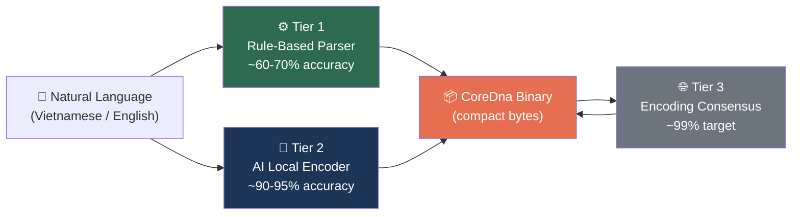

# §4. Wire Format & Encoding

The Knowledge Unit's wire format constitutes the physical representation through which semantic knowledge traverses network boundaries, persists on storage media, and achieves content-addressable identity. This section presents the Core DNA binary encoding specification — a custom instruction-stream format that achieves the goal of binary representations that are *smaller* than natural language text. We detail the complete wire layout, the 30-instruction opcode set, a novel 5-tier variable-length integer encoding aligned with Zipfian frequency classes, and a three-tier encoding pipeline that progressively transforms natural language into language-agnostic binary.

## 4.1 Design Goals

The wire format design is governed by six orthogonal objectives, each motivated by concrete deployment constraints within the OneBrain decentralized network.

**Compactness — smaller than text.** Core DNA achieves wire sizes consistently *smaller* than the natural language it represents. For example, the Vietnamese text "bơi ếch" (breaststroke swimming technique, 323 bytes UTF-8) encodes to 88 bytes — a 3.7× compression *below* the source text. This transformation is possible because Core DNA encodes semantic *structure* (concept identifiers, typed instructions, numeric literals) rather than linguistic *surface forms* (natural language strings with their inherent redundancy). Every superfluous byte imposes measurable cost in latency, energy consumption, and monetary expenditure on bandwidth-constrained links — including mobile cellular connections, Bluetooth Low Energy mesh relays, and intermittently connected satellite uplinks.

**Language-agnostic representation.** The core binary layer contains only unsigned integer ConceptIds, typed numeric literals, and structural opcodes. No natural language strings appear in the Core DNA instruction stream. A Knowledge Unit about "breaststroke swimming" and one about "bơi ếch" produce *identical* binary encodings when they reference the same ConceptIds, enabling convergence across linguistic boundaries without translation.

**Machine-queryable structure.** Unlike opaque byte blobs or serialized key-value stores, Core DNA is a typed instruction stream where each instruction carries explicit semantic intent (Triple, Quantity, Constraint, Step, etc.). A decoder can extract all quantity measurements, enumerate procedure steps, or filter constraint violations without deserializing the entire structure — enabling efficient indexing and query processing at the wire level.

**Numeric precision.** Quantities, tolerances, and ranges require faithful numeric representation. Core DNA provides six inline numeric types (§4.3.3) covering unsigned and signed integers (8-, 16-, and 32-bit) as well as IEEE 754 single-precision floats, sufficient for engineering measurements ($\pm 3.4 \times 10^{38}$), scaled confidence levels (0–10,000 → 0.0000–1.0000), and emotional valence models.

**CRC-protected integrity.** In a decentralized network lacking central arbiters, bit-level corruption during transmission or storage must be detected with high probability before a KU enters any node's knowledge base. A CRC-16/CCITT checksum (§4.4), computed over the header and instruction stream, provides lightweight error detection with the polynomial $x^{16} + x^{12} + x^5 + 1$. This checksum operates independently of transport-layer error detection, providing defense-in-depth against silent corruption in store-and-forward relay scenarios. The choice of CRC-16 over CRC-32 saves 2 bytes per KU — significant when the total wire size may be as small as 9 bytes.

**Extensibility.** The 5-bit opcode field supports up to 32 opcodes, with 30 currently defined and 2 reserved for future extension. The `EXTENDED` opcode (`0x1F`) provides an escape mechanism for future instruction set expansion beyond 32 opcodes.

## 4.2 Wire Format Structure

The Core DNA wire format follows a compact architecture with only 5 bytes of fixed overhead:

```
┌────────┬──────────┬──────────────────────────────┬──────────┬──────────┐
│ MAGIC  │ VER_META │      INSTRUCTION STREAM      │   END    │  CRC-16  │
│  (1B)  │  (1B)    │      (variable length)       │  (1B)    │  (2B)    │
├────────┼──────────┼──────────────────────────────┼──────────┼──────────┤
│  0x4B  │ see §4.2.2│ op(1B) + operands...  × N   │  0xF0    │ BE u16   │
└────────┴──────────┴──────────────────────────────┴──────────┴──────────┘
 ◄──────────────────── CRC covers this range ───────────────────►
```

> **Definition 4.1 (Minimum wire size).** An empty Core DNA with zero data instructions encodes to exactly 5 bytes: MAGIC(1) + VER\_META(1) + END(1) + CRC-16(2). This represents the irreducible fixed overhead of the format.

### 4.2.1 Magic Byte

The magic byte is the single byte `0x4B` (ASCII `'K'`), positioned at offset 0. The single-byte design serves dual purposes: rapid rejection of non-KU byte streams during parsing, and human-readable identification in hex dumps during debugging.

### 4.2.2 VER_META Byte

The second byte packs three fields into a single octet using bit-level multiplexing:

```
Offset: 1
Layout:
  ┌───────────┬────────────────┬──────────────────┐
  │ Bits 7-5  │   Bits 4-1     │     Bit 0        │
  │ version   │   gene_type    │ has_qualifiers   │
  │ (3 bits)  │   (4 bits)     │   (1 bit)        │
  └───────────┴────────────────┴──────────────────┘
```

The encoding and decoding formulae are:

$$\text{VER\_META} = (\text{version} \wedge \texttt{0x07}) \ll 5 \;\big|\; (\text{gene\_type} \wedge \texttt{0x0F}) \ll 1 \;\big|\; \text{has\_qualifiers}$$

$$\text{version} = (\text{VER\_META} \gg 5) \wedge \texttt{0x07}, \quad \text{gene\_type} = (\text{VER\_META} \gg 1) \wedge \texttt{0x0F}$$

| Field | Bits | Range | Description |
|-------|------|-------|-------------|
| `version` | 7–5 | 0–7 | Format version; current = **1** (binary `001`) |
| `gene_type` | 4–1 | 0–15 | Gene type index (see Table 4.1) |
| `has_qualifiers` | 0 | 0–1 | `1` if any instructions carry qualifier metadata |

**Table 4.1: Gene Type Values (4-bit)**

| Value | GeneType | Description |
|-------|----------|-------------|
| 0 | Fact | Factual knowledge with subject-predicate-object triples |
| 1 | Procedure | Step-by-step processes with preconditions and effects |
| 2 | Experience | Experiential knowledge with VAD (Valence-Arousal-Dominance) affect |
| 3 | Creative | Creative content with process and cultural context |
| 4 | MediaExperience | Media-based perceptual experience |
| 5 | Testimony | Witness testimony with proximity and count |
| 6 | Formal | Mathematical/logical notation (LaTeX, MathML) |
| 7 | Hypothesis | Hypothesis with confidence and maturity level |
| 8 | Narrative | Narrative structure with canonical text |
| 9 | Sensory | Sensory perception with modality descriptors |
| 10 | Composite | Composite KU aggregating member KUs by CID reference |
| 11–15 | *Reserved* | Future gene types |

> Core DNA stores all 11 gene types directly in 4 bits (values 0–10), with values 11–15 reserved for future gene types.

**Worked example.** A Fact gene (type 0), version 1, no qualifiers:
$$\text{VER\_META} = (1 \ll 5) \mid (0 \ll 1) \mid 0 = \texttt{0x20}$$
Full header: `0x4B 0x20` (2 bytes).

### 4.2.3 Instruction Stream

The instruction stream is a sequence of variable-length instructions. Each instruction consists of a 1-byte opcode followed by zero or more operands:

```
┌──────────────────┬────────────────────────────┐
│   OPCODE BYTE    │        OPERANDS            │
│     (1 byte)     │   (variable, 0–N bytes)    │
├──────────────────┼────────────────────────────┤
│  [op:5][mod:3]   │  varint / numeric / raw    │
└──────────────────┴────────────────────────────┘
```

The opcode byte encodes two fields in 8 bits:

$$\text{opcode\_byte} = (\text{op} \ll 3) \mid (\text{modifier} \wedge \texttt{0x07})$$

where **op** (bits 7–3) is the 5-bit opcode value (`0x00`–`0x1F`, yielding 32 possible opcodes) and **modifier** (bits 2–0) is a 3-bit field reserved for future use (currently always 0 in version 1).

### 4.2.4 END Marker and CRC-16

The END marker is the opcode byte for `Op::End` (opcode `0x1E`), which encodes to wire byte `0x1E \ll 3 = \texttt{0xF0}`. It terminates the instruction stream unambiguously.

The CRC-16 occupies the final 2 bytes of the wire format, stored as a big-endian unsigned 16-bit integer. The checksum is computed over all preceding bytes (MAGIC + VER\_META + INSTRUCTION\_STREAM + END). See §4.4 for the complete algorithm specification.

### 4.2.5 Overhead Budget

| Component | Size | Notes |
|-----------|------|-------|
| MAGIC | 1 byte | Fixed: `0x4B` |
| VER\_META | 1 byte | Version + gene type + qualifier flag |
| END marker | 1 byte | Fixed: `0xF0` |
| CRC-16 | 2 bytes | Fixed trailer |
| **Total overhead** | **5 bytes** | Constant regardless of instruction count |

For a typical 88-byte Fact KU (the "bơi ếch" example), the 5-byte overhead represents 5.7% of the total wire size. For a minimal 9-byte KU encoding a single triple, the overhead is 55.6%, reflecting the format's efficiency even at the smallest scales.

### 4.2.6 Worked Example — Complete Hex Diagram

Encoding `Triple(s=1, p=2, o=3)` as a Fact gene:

```
Offset  Hex    Description
──────  ─────  ──────────────────────────────────────
 00     4B     MAGIC byte ('K')
 01     20     VER_META: version=1, gene_type=0(Fact), qualifiers=false
                 (0b001_0000_0 = 0x20)
 02     00     OPCODE: Triple (op=0x00, mod=0) → byte = 0x00
 03     01     Varint: s=1 (Tier 0, 1 byte)
 04     02     Varint: p=2 (Tier 0, 1 byte)
 05     03     Varint: o=3 (Tier 0, 1 byte)
 06     F0     END marker (Op::End = 0x1E, byte = 0x1E≪3 = 0xF0)
 07-08  XX XX  CRC-16/CCITT over bytes [00..06]
```

Total: **9 bytes** for a complete, CRC-protected Knowledge Unit.

## 4.3 Instruction Set

The Core DNA instruction set comprises 30 data instructions (opcodes `0x00`–`0x1D`), plus the `END` terminator (`0x1E`) and an `EXTENDED` opcode (`0x1F`) reserved for future extensions. Each instruction maps 1:1 to an opcode value and carries a fixed operand layout determined entirely by the opcode.

### 4.3.1 Op Enum — All 32 Opcodes

Each opcode is a 5-bit value. The wire byte is computed as $\text{op} \ll 3$ (with modifier 0 in version 1):

| Op | Wire Byte | Name | Operand Layout |
|----|-----------|------|----------------|
| `0x00` | `0x00` | `TRIPLE` | varint(S), varint(P), varint(O) |
| `0x01` | `0x08` | `QUALITY` | varint(S), varint(Q) |
| `0x02` | `0x10` | `QUANTITY` | varint(S), numeric(value), varint(unit) |
| `0x03` | `0x18` | `SEQUENCE` | u8(N), varint(item₁), …, varint(itemₙ) |
| `0x04` | `0x20` | `PART_OF` | varint(part), varint(whole) |
| `0x05` | `0x28` | `LOCATED` | varint(S), varint(location) |
| `0x06` | `0x30` | `TEMPORAL` | varint(S), varint(time) |
| `0x07` | `0x38` | `CAUSAL` | varint(cause), varint(effect) |
| `0x08` | `0x40` | `SIMULATES` | varint(S), varint(model) |
| `0x09` | `0x48` | `CONDITION` | varint(if), varint(then) |
| `0x0A` | `0x50` | `AGENT` | varint(actor), varint(action) |
| `0x0B` | `0x58` | `TOOL` | varint(action), varint(instrument) |
| `0x0C` | `0x60` | `RANGE` | varint(S), numeric(min), numeric(max) |
| `0x0D` | `0x68` | `TOLERANCE` | varint(S), numeric(value), numeric(±δ) |
| `0x0E` | `0x70` | `CONSTRAINT` | varint(source), u8(op\_code), varint(target) |
| `0x0F` | `0x78` | `ENUM_VAL` | varint(S), u8(N), varint(val₁), …, varint(valₙ) |
| `0x10` | `0x80` | `CERTAINTY` | u16\_be(level) |
| `0x11` | `0x88` | `DIFFICULTY` | u8(level) |
| `0x12` | `0x90` | `CID_REF` | raw(32 bytes BLAKE3 hash) |
| `0x13` | `0x98` | `STEP` | u8(ord), varint(action), varint(target) |
| `0x14` | `0xA0` | `PRECOND` | varint(concept) |
| `0x15` | `0xA8` | `EFFECT` | varint(concept) |
| `0x16` | `0xB0` | `AFFECT` | i16\_be(V), i16\_be(A), i16\_be(D) |
| `0x17` | `0xB8` | `LABEL` | varint(key), varint(value) |
| `0x18` | `0xC0` | `TEXT_REF` | u8(lang), u16\_be(len), raw(bytes) |
| `0x19` | `0xC8` | `FORMULA` | u8(format), u16\_be(len), raw(bytes) |
| `0x1A` | `0xD0` | `WITNESS` | u16\_be(count), u8(proximity) |
| `0x1B` | `0xD8` | `MEDIA_REF` | u8(system), u8(len), raw(id\_bytes) |
| `0x1C` | `0xE0` | `COMPOSITE_HDR` | u8(type), u8(completeness), u32\_be(version) |
| `0x1D` | `0xE8` | `MEMBER` | u16\_be(order), u8(role), u8(required), varint(label), raw(32B cid) |
| `0x1E` | `0xF0` | `END` | *(none — terminates stream)* |
| `0x1F` | `0xF8` | `EXTENDED` | u8(ext\_byte), … *(future extension)* |

### 4.3.2 Instruction Categories

The 30 data instructions are organized into five functional categories:

**Relational instructions** (opcodes `0x00`–`0x0B`) encode semantic relationships between concepts. The foundational `TRIPLE` instruction represents subject-predicate-object facts; `QUALITY`, `PART_OF`, `LOCATED`, `TEMPORAL`, `CAUSAL`, `SIMULATES`, `CONDITION`, `AGENT`, and `TOOL` provide specialized relationship types that would otherwise require verbose triple chains. `SEQUENCE` encodes ordered lists of up to 255 concepts.

**Quantitative instructions** (opcodes `0x0C`–`0x0F`, `0x02`) encode numeric measurements and constraints. `QUANTITY` attaches a typed numeric value and unit to a concept; `RANGE` and `TOLERANCE` express measurement bounds and precision margins; `CONSTRAINT` applies relational operators ($=$, $\neq$, $<$, $\leq$, $>$, $\geq$); `ENUM_VAL` enumerates valid value sets.

**Metadata instructions** (opcodes `0x10`–`0x12`, `0x17`) encode KU-level metadata. `CERTAINTY` expresses confidence as a scaled integer 0–10,000 (representing 0.0000–1.0000 probability); `DIFFICULTY` rates complexity on a 5-level ordinal scale; `CID_REF` embeds a 32-byte BLAKE3 hash reference to another KU; `LABEL` provides a generic key-value mechanism for semantic roles not covered by dedicated opcodes.

**Procedural instructions** (opcodes `0x13`–`0x15`) encode step-by-step processes. `STEP` carries an ordinal, action concept, and target concept; `PRECOND` and `EFFECT` attach prerequisite and outcome concepts to the preceding step, forming a directed acyclic workflow graph.

**Gene-specific instructions** (opcodes `0x16`–`0x1D`) encode data structures unique to particular gene types. `AFFECT` stores VAD emotional dimensions as signed 16-bit integers; `TEXT_REF` and `FORMULA` embed compressed text blobs with language or format tags; `WITNESS` carries testimony metadata; `MEDIA_REF` references external media systems; `COMPOSITE_HDR` and `MEMBER` define composite KU structures with typed membership.

### 4.3.3 MediaRef and OBS Blob Store Integration

The `MEDIA_REF` instruction (opcode `0x1B`, wire byte `0xD8`) provides the linkage between a Knowledge Unit and external binary large objects (blobs). The instruction encodes a typed reference to a storage backend:

```
MEDIA_REF wire layout:
┌──────────┬──────────┬──────────┬─────────────────────┐
│  OPCODE  │  SYSTEM  │   LEN    │      ID BYTES       │
│  (1 B)   │  (1 B)   │  (1 B)   │    (LEN bytes)      │
├──────────┼──────────┼──────────┼─────────────────────┤
│   0xD8   │   0x01   │   0x22   │  OB-CID (34 bytes)  │
└──────────┴──────────┴──────────┴─────────────────────┘
 Total: 37 bytes for an OBS Blob Store reference
```

The `system` byte identifies the storage backend:

| System | Value | ID Format | ID Size | Status |
|--------|-------|-----------|---------|--------|
| OneBrain Blob Store | `0x01` | OB-CID `[version:u8][type:u8][blake3:32B]` | 34 bytes | **Implemented** |
| IPFS CIDv1 | `0x02` | CIDv1 multihash | variable | Designed (Phase 2) |
| Arweave | `0x03` | Transaction ID | 32 bytes | Designed (Phase 2) |

For `system = 0x01` (OneBrain Blob Store), the `id` field carries a 34-byte **OB-CID** (OneBrain Content Identifier):

$$\text{OB-CID} = [\text{version}: \text{u8}] \parallel [\text{type}: \text{u8}] \parallel [\text{blake3}: 32\text{B}] = 34 \text{ bytes}$$

The `type` byte encodes the media type of the referenced blob:

| Type Code | Name | Description |
|-----------|------|-------------|
| `0x00` | `Raw` | Unclassified binary data |
| `0x01` | `Image` | Image files (JPEG, PNG, WebP, GIF, etc.) |
| `0x02` | `Video` | Video files (MP4, WebM, MKV, etc.) |
| `0x03` | `Audio` | Audio files (MP3, OGG, FLAC, WAV, etc.) |
| `0x04` | `Document` | Document files (PDF, DOCX, TXT, etc.) |

**Implementation constraints.** A single KU may contain up to **10 `MEDIA_REF` instructions** (`BLOB_MAX_PER_KU = 10`), enabling rich multi-media knowledge units while bounding the reference count. Each referenced blob is limited to **100 MB** (`BLOB_MAX_SIZE`). The encoding verifier currently **skips** `MEDIA_REF` instructions during semantic agreement checks — media references are not subject to Tier 3 encoding consensus verification (§4.9.4). Expression rendering also currently omits `MEDIA_REF` instructions, as visual rendering of blob references is deferred to Phase 2.

### 4.3.4 NumericValue Inline Encoding

Numeric values within `QUANTITY`, `RANGE`, and `TOLERANCE` instructions are encoded inline using a 1-byte type prefix followed by the value in big-endian byte order. The prefix bytes (`0xFA`–`0xFF`) are chosen to lie *outside* the varint range (varints use `0x00`–`0xF7` as first bytes), enabling unambiguous disambiguation:

| Prefix | Type | Payload | Total Bytes | Value Range |
|--------|------|---------|-------------|-------------|
| `0xFA` | U8 | 1 byte unsigned | 2 | 0 – 255 |
| `0xFB` | U16 | 2 bytes BE | 3 | 0 – 65,535 |
| `0xFC` | I16 | 2 bytes BE signed | 3 | −32,768 – 32,767 |
| `0xFD` | U32 | 4 bytes BE | 5 | 0 – 4,294,967,295 |
| `0xFE` | I32 | 4 bytes BE signed | 5 | −2,147,483,648 – 2,147,483,647 |
| `0xFF` | F32 | 4 bytes BE IEEE 754 | 5 | $\pm 3.4 \times 10^{38}$ |

> **Definition 4.2 (Numeric/varint disambiguation).** Given a byte $b$ at a position where either a NumericValue or a varint ConceptId may appear:
> - If $b \geq \texttt{0xFA}$: decode as NumericValue (prefix + payload).
> - If $b \leq \texttt{0xF7}$: decode as varint ConceptId.
> - Bytes `0xF8`–`0xF9` are reserved for future extension.

**Encoding examples:**

```
NumericValue::U8(42)       → [0xFA, 0x2A]                   (2 bytes)
NumericValue::F32(35.2)    → [0xFF, 0x42, 0x0C, 0xCC, 0xCD] (5 bytes)
NumericValue::I16(-500)    → [0xFC, 0xFE, 0x0C]             (3 bytes)
```

### 4.3.5 Constraint Operators

The `op_code` operand of the `CONSTRAINT` instruction is a single unsigned byte encoding six relational operators:

| Value | Operator | Symbol |
|-------|----------|--------|
| 0 | Equal | $=$ |
| 1 | Not Equal | $\neq$ |
| 2 | Less Than | $<$ |
| 3 | Less or Equal | $\leq$ |
| 4 | Greater Than | $>$ |
| 5 | Greater or Equal | $\geq$ |

## 4.4 CRC-16/CCITT Integrity

### 4.4.1 Algorithm Specification

Core DNA uses CRC-16/CCITT (XMODEM variant), providing efficient error detection for the format's typical wire sizes while minimising overhead at 2 bytes.

| Parameter | Value |
|-----------|-------|
| Algorithm | CRC-16/CCITT (XMODEM) |
| Polynomial | `0x1021` ($x^{16} + x^{12} + x^5 + 1$) |
| Init value | `0xFFFF` |
| Input reflected | No |
| Output reflected | No |
| Final XOR | `0x0000` |
| Check value | `0x29B1` (for ASCII `"123456789"`) |
| Wire encoding | Big-endian u16 |

### 4.4.2 Computation

The CRC is computed over all bytes *preceding* the CRC itself (MAGIC + VER\_META + INSTRUCTION\_STREAM + END), then appended as 2 bytes in big-endian order:

```
function crc16_ccitt(data: byte[]) → u16:
    crc ← 0xFFFF
    for byte in data:
        crc ← crc ⊕ (byte ≪ 8)
        repeat 8 times:
            if (crc ∧ 0x8000) ≠ 0:
                crc ← (crc ≪ 1) ⊕ 0x1021
            else:
                crc ← crc ≪ 1
        crc ← crc ∧ 0xFFFF
    return crc
```

### 4.4.3 Error Detection Properties

CRC-16/CCITT with polynomial `0x1021` provides the following guarantees:

- **Single-bit errors:** 100% detection for any single-bit flip.
- **Burst errors:** 100% detection for burst errors up to 16 bits in length.
- **Random error patterns:** Undetected error probability of approximately $2^{-16} \approx 1.5 \times 10^{-5}$ for random multi-bit error patterns.

The CRC-16 checksum is explicitly *not* a cryptographic integrity mechanism. Tamper detection is provided separately by the BLAKE3 Content Identifier (§4.6), which serves as a cryptographic commitment to the wire bytes.

> **Theorem 4.1 (Fixed overhead bound).** The fixed overhead of the Core DNA wire format is exactly 5 bytes: MAGIC(1) + VER\_META(1) + END(1) + CRC-16(2). For a minimal KU, this yields an overhead-to-payload ratio of $\frac{5}{5 + |P|}$.

### 4.4.4 Verification

Implementations MUST pass the standard check value test:

```
Input:  b"123456789"  (9 bytes: 0x31..0x39)
Output: 0x29B1
```

## 4.5 5-Tier Variable-Length Integer Encoding

### 4.5.1 Motivation

The Knowledge Unit's instruction set encodes semantic concepts as unsigned integer identifiers (ConceptIds). The distribution of concept frequencies in natural knowledge follows a Zipfian pattern: a small core of universal primitives (actions, objects, spatial relations, basic qualities) appears with high frequency, while the vast majority of domain-specific and culturally situated concepts are rare. An optimal encoding should assign shorter byte representations to frequent concepts, following the foundational principle of Shannon's source coding theorem.

Existing variable-length integer encodings — notably LEB128 (used in DWARF, WebAssembly, and Protocol Buffers) and SQLite's varint — treat all values within a given range uniformly and determine encoded length through sequential byte scanning. We propose a **5-tier variable-length integer encoding** that partitions the concept namespace into semantically aligned frequency classes, enables $O(1)$ length determination from the first byte's prefix pattern, and supports branchless decoding on modern processors.

### 4.5.2 Encoding Structure

The encoding uses a prefix-free code inspired by UTF-8's leading-byte structure. The first byte's high bits determine the tier (and thus the total byte count), while the remaining bits contribute to the data value:

| Tier | Bytes | First Byte Prefix | Data Bits | Encoded Range | Capacity |
|------|-------|--------------------|-----------|---------------|----------|
| 0 | 1 | `0xxxxxxx` | 7 | 0 – 127 | 128 |
| 1 | 2 | `10xxxxxx xxxxxxxx` | 14 | 128 – 16,511 | 16,384 |
| 2 | 3 | `110xxxxx xxxxxxxx xxxxxxxx` | 21 | 16,512 – 2,113,663 | 2,097,152 |
| 3 | 4 | `1110xxxx` + 3 bytes | 28 | 2,113,664 – 270,549,119 | 268,435,456 |
| 3+ | 5 | `11110xxx` + 4 bytes | 35 | 270,549,120 – ~34.6 billion | ~34.4 billion |

The tier boundaries are defined by cumulative offset constants:

```
TIER0_MAX    = 127
TIER1_OFFSET = 128          TIER1_MAX = 16,511
TIER2_OFFSET = 16,512       TIER2_MAX = 2,113,663
TIER3_OFFSET = 2,113,664    TIER3_MAX = 270,549,119
TIER3P_OFFSET = 270,549,120
```

Each tier's range is contiguous and non-overlapping. The offset for tier $k$ equals the sum of capacities of all lower tiers:

$$\text{OFFSET}_k = \sum_{i=0}^{k-1} 2^{7 + 7(i-1) \cdot \mathbb{1}[i>0]}$$

### 4.5.3 Semantic Alignment with Zipfian Distribution

The tier structure is not merely a compression optimization — it constitutes a deliberate architectural alignment between byte-width and conceptual frequency class. This alignment is inspired by Zipf's law, which observes that the frequency of the $n$-th most common item in a natural corpus is proportional to $1/n^\alpha$ for $\alpha \approx 1$. We map each tier to a semantic stratum of the concept namespace:

**Tier 0 (1 byte, 128 slots): Universal Primitives.** This tier encodes the most fundamental concepts that appear across virtually all knowledge domains and cultures: core actions (move, create, change, observe), basic objects (person, place, thing, time), spatial relations (above, inside, near), and elementary qualities (large, fast, true). These concepts correspond to the highest-frequency entries in concept co-occurrence matrices derived from multilingual corpora. Encoding them in a single byte ensures that the most common instruction operands impose minimal wire overhead.

**Tier 1 (2 bytes, ~16K slots): Common Concepts.** This tier accommodates concepts that are widely used but not universal: common emotions (joy, fear, surprise), everyday objects (chair, window, road), standard activities (cooking, reading, traveling), and basic scientific terms (energy, cell, force). The 16,384-slot capacity aligns with estimates of the active vocabulary size for a literate adult in any single language.

**Tier 2 (3 bytes, ~2M slots): Standard Domain Concepts.** This tier covers domain-specific terminology encountered in professional and academic contexts: medical diagnoses, legal concepts, engineering terms, and cultural references. The ~2 million slot capacity accommodates the combined specialized vocabularies of approximately 50 professional domains.

**Tier 3 (4 bytes, ~268M slots): Extended Concepts.** This tier encodes highly specific concepts: individual chemical compounds, specific gene variants, niche cultural practices, and particular geographic features. The ~268 million slot capacity is sufficient for comprehensive domain ontologies across all human knowledge domains.

**Tier 3+ (5 bytes, ~34.6B slots): Community and Rare Concepts.** This tier serves as the long tail: community-coined neologisms, ephemeral cultural memes, individual-specific experiential concepts, and hyper-specialized technical identifiers. The ~34.6 billion slot capacity provides a practically inexhaustible namespace for organic concept growth within the decentralized network.

### 4.5.4 Encode Algorithm

```
function encode(value: u64) → bytes:
    if value ≤ TIER0_MAX:
        return [value as u8]                           // 0xxxxxxx

    elif value ≤ TIER1_MAX:
        v = value - TIER1_OFFSET                       // Normalize to tier-local index
        return [0x80 | (v >> 8) as u8,                 // 10xxxxxx
                (v & 0xFF) as u8]                      // xxxxxxxx

    elif value ≤ TIER2_MAX:
        v = value - TIER2_OFFSET
        return [0xC0 | (v >> 16) as u8,                // 110xxxxx
                ((v >> 8) & 0xFF) as u8,               // xxxxxxxx
                (v & 0xFF) as u8]                      // xxxxxxxx

    elif value ≤ TIER3_MAX:
        v = value - TIER3_OFFSET
        return [0xE0 | (v >> 24) as u8,                // 1110xxxx
                ((v >> 16) & 0xFF) as u8,              // xxxxxxxx
                ((v >> 8) & 0xFF) as u8,               // xxxxxxxx
                (v & 0xFF) as u8]                      // xxxxxxxx

    else:
        v = value - TIER3P_OFFSET
        return [0xF0 | (v >> 32) as u8,                // 11110xxx
                ((v >> 24) & 0xFF) as u8,              // xxxxxxxx
                ((v >> 16) & 0xFF) as u8,              // xxxxxxxx
                ((v >> 8) & 0xFF) as u8,               // xxxxxxxx
                (v & 0xFF) as u8]                      // xxxxxxxx
```

### 4.5.5 Decode Algorithm

```
function decode(buf: &[u8]) → (value: u64, bytes_consumed: usize):
    let first = buf[0]

    if first & 0x80 == 0:                              // Tier 0: 0xxxxxxx
        return (first as u64, 1)

    elif first & 0xC0 == 0x80:                         // Tier 1: 10xxxxxx
        v = ((first & 0x3F) as u64) << 8
            | buf[1] as u64
        return (v + TIER1_OFFSET, 2)

    elif first & 0xE0 == 0xC0:                         // Tier 2: 110xxxxx
        v = ((first & 0x1F) as u64) << 16
            | (buf[1] as u64) << 8
            | buf[2] as u64
        return (v + TIER2_OFFSET, 3)

    elif first & 0xF0 == 0xE0:                         // Tier 3: 1110xxxx
        v = ((first & 0x0F) as u64) << 24
            | (buf[1] as u64) << 16
            | (buf[2] as u64) << 8
            | buf[3] as u64
        return (v + TIER3_OFFSET, 4)

    elif first & 0xF8 == 0xF0:                         // Tier 3+: 11110xxx
        v = ((first & 0x07) as u64) << 32
            | (buf[1] as u64) << 24
            | (buf[2] as u64) << 16
            | (buf[3] as u64) << 8
            | buf[4] as u64
        return (v + TIER3P_OFFSET, 5)

    else:
        error("Invalid varint prefix")
```

### 4.5.6 Comparison with LEB128

The following comparison highlights the structural advantages of the OneBrain 5-tier varint over the widely used LEB128 encoding (employed in Protocol Buffers, WebAssembly, and DWARF):

| Property | LEB128 / Protocol Buffers | OneBrain 5-Tier Varint |
|----------|---------------------------|------------------------|
| Length determination | $O(n)$ sequential scan for continuation bits | $O(1)$ from first byte prefix pattern |
| Self-synchronizing | No; mid-stream entry requires scanning to next boundary | Yes; UTF-8-like prefix unambiguously identifies boundaries |
| Semantic alignment | None; encoding is value-agnostic | Tier = frequency class in concept namespace |
| Maximum 1-byte range | 0 – 127 | 0 – 127 |
| Maximum 2-byte range | 0 – 16,383 | 128 – 16,511 |
| Maximum 5-byte range | 0 – 4,294,967,295 | 270,549,120 – ~34.6 billion |
| Branchless decoding | Not feasible (continuation bit chain) | Feasible via prefix-pattern lookup table |
| Encoding uniqueness | Not canonical (leading zeros permitted) | Canonical (unique encoding per value) |

The $O(1)$ length determination property is particularly significant for batch processing of instruction streams containing multiple varint operands. A decoder can determine the total byte span of an instruction by examining only the first byte of each varint, enabling efficient skip-scanning and parallel decode of non-adjacent instructions.

The design's intellectual lineage traces to Huffman coding: given a source alphabet with known frequency distribution (Zipfian, in our case), the optimal prefix-free code assigns shorter codewords to more probable symbols. Our 5-tier encoding applies this principle not to individual bits but to byte-width tiers, creating a practical, byte-aligned Huffman-like code for concept identifiers.

## 4.6 Content Addressing: BLAKE3 CID

### 4.6.1 CID Construction

The Content Identifier (CID) of a Knowledge Unit is defined as the first 256 bits of the BLAKE3 hash of the complete wire-format byte sequence:

$$\text{CID}(ku) = \text{BLAKE3}(\text{wire\_bytes}(ku))[0..32]$$

This 32-byte fingerprint serves as the globally unique, content-derived address for the KU within the OneBrain network. Two properties are essential:

**Determinism.** The encoding pipeline produces byte-identical wire output for semantically identical KUs. Combined with BLAKE3's deterministic hash function, this ensures that independently encoded copies of the same knowledge produce the same CID, enabling deduplication and convergence across the decentralized network without coordination.

**Tamper evidence.** Any modification to the KU's content — whether a changed instruction operand, an altered gene type, or a flipped qualifier bit — produces a completely different CID with overwhelming probability ($1 - 2^{-256}$). This property underpins the integrity of the knowledge graph: a CID referenced in a bond's target field or a `CID_REF` instruction constitutes a cryptographic commitment to the referenced KU's exact content.

### 4.6.2 BLAKE3 Selection Rationale

BLAKE3 was selected over alternative hash functions (SHA-256, SHA-3, BLAKE2b) based on three criteria:

**Speed.** BLAKE3 achieves approximately 3.5 GB/s on a single core of modern x86_64 hardware, and scales linearly with additional cores via its inherent parallelism (Merkle tree internal structure). This is approximately 5× faster than SHA-256 and 8× faster than SHA-3-256, making CID computation negligible relative to network I/O for all practical KU sizes.

**Security.** BLAKE3 provides 256-bit preimage resistance and 128-bit collision resistance, matching the security level of SHA-256 while offering superior performance. The hash function's design derives from the well-analyzed BLAKE2 and ChaCha constructions, with formal security proofs in the ideal cipher model.

**Parallelism.** BLAKE3's internal Merkle tree structure enables parallel hashing of large inputs across multiple cores and SIMD lanes. While individual KUs are small (typically < 200 bytes), the parallel structure benefits batch CID computation when a node ingests a large set of KUs simultaneously.

### 4.6.3 CID Properties

The CID provides a decentralized, coordination-free identity system:

- **No central authority:** CIDs are computed locally from content; no registry or allocation service is required.
- **Collision resistance:** The probability of two distinct KUs sharing a CID is approximately $2^{-128}$, negligible for any practical knowledge base size.
- **Immutability linkage:** Because a KU's CID is derived from its wire bytes, any mutation to the KU produces a new CID. The original CID becomes a permanent, immutable reference to the original content — a property exploited by the bond system for stable cross-references.

## 4.7 Size Analysis

### 4.7.1 Measured Encoding Sizes

The following measurements are obtained from the reference Rust implementation encoding real-world knowledge content into Core DNA.

**Test Case 1: "Bơi ếch" (Breaststroke).** Vietnamese text describing breaststroke swimming technique (323 bytes UTF-8), decomposed into 3 Knowledge Units:

| Encoding | Size | Ratio vs. Text |
|----------|------|----------------|
| Original Vietnamese text (UTF-8) | 323 bytes | 1.0× (baseline) |
| Core DNA KU #1 (Fact: Definition) — 4 instructions | ~20 bytes | — |
| Core DNA KU #2 (Procedure: Swimming Cycle) — 9 instructions | ~38 bytes | — |
| Core DNA KU #3 (Fact: Properties) — 3 instructions | ~14 bytes | — |
| **Core DNA total (3 KUs)** | **88 bytes** | **3.7× smaller** |


**Test Case 2: Rocket Systems ("Tên lửa").** 1,078-byte Vietnamese text about rocket systems, decomposed into 5 Knowledge Units:

| Encoding | Size | Ratio vs. Text |
|----------|------|----------------|
| Original Vietnamese text (UTF-8) | 1,078 bytes | 1.0× (baseline) |
| Core DNA KU #1 (Body & Shell) — 8 instructions | ~40 bytes | — |
| Core DNA KU #2 (Liquid Fuel Engine) — 8 instructions | ~38 bytes | — |
| Core DNA KU #3 (Solid Fuel) — 4 instructions | ~20 bytes | — |
| Core DNA KU #4 (Guidance & Control) — 6 instructions | ~30 bytes | — |
| Core DNA KU #5 (Payload Bay) — 4 instructions | ~20 bytes | — |
| **Core DNA total (5 KUs)** | **~172 bytes** | **~6.3× smaller** |

**Test Case 3: Airplane Wing Design.** 131-byte English text describing wing parameters with 10 numeric measurements and 1 constraint:

| Encoding | Size | Ratio vs. Text |
|----------|------|----------------|
| English text (UTF-8) | 131 bytes | 1.0× (baseline) |
| **Core DNA (1 KU)** — 12 instructions | **~118 bytes** | **1.1× smaller** |

> The airplane test case represents the lower bound of compression advantage. Highly numeric, short descriptions with many floating-point values approach text size because each F32 requires 5 bytes (prefix + 4 bytes IEEE 754). The advantage remains positive, and Core DNA preserves machine-queryable structure that text lacks.

### 4.7.2 Minimal Encoding

The smallest meaningful KU — a single `Triple(s, p, o)` with all three ConceptIds in Tier 0 — encodes to approximately 9 bytes:

$$|\text{wire}|_{\min} = \underbrace{1}_{\text{MAGIC}} + \underbrace{1}_{\text{VER\_META}} + \underbrace{1}_{\text{opcode}} + \underbrace{3}_{\text{3 × varint(Tier 0)}} + \underbrace{1}_{\text{END}} + \underbrace{2}_{\text{CRC-16}} = 9 \text{ bytes}$$

A minimal fact with a certainty level adds only 3 bytes (1 opcode + 2 u16\_be), yielding ~12 bytes.

### 4.7.3 Bandwidth Implications

At the typical KU size of 20–172 bytes (median ~60 bytes), a 2G cellular connection (50 Kbps) can transmit approximately 104 KUs per second, while a 4G connection (10 Mbps) achieves approximately 20,800 KUs per second. These throughput figures confirm that the Core DNA wire format is viable for real-time knowledge synchronization on bandwidth-constrained mobile devices.

## 4.8 Three-Tier Encoding Pipeline

### 4.9.1 Overview

The conversion of natural language text into Core DNA binary is performed by a three-tier encoding pipeline. Each tier operates at increasing accuracy, and all three produce the same `CoreDna` binary format:



| Tier | Name | Accuracy | Requires AI | Status |
|------|------|----------|-------------|--------|
| T1 | Rule-Based Parser | ~60–70% | No | Implemented |
| T2 | AI Local Encoder | ~90–95% | Local LLM | Implemented |
| T3 | Distributed Encoding Consensus | ~99% | P2P network | Designed |

### 4.9.2 Tier 1: Rule-Based Parser

Tier 1 converts text into CoreDna instructions using pure pattern matching — no AI model is required. The parser (`text_parser.rs`, ~1,100 lines of Rust) operates entirely offline, processing input text line-by-line through a priority-ordered cascade of pattern matchers:

1. **Gene type detection.** The input text is classified into a gene type (Fact, Procedure, etc.) based on structural cues (e.g., presence of `"Bước N:"` / `"Step N:"` patterns indicates a Procedure).

2. **Line-by-line pattern matching.** Each line is tested against parsers in priority order:
   - `try_parse_step()` — procedural steps (`"Bước 1:"`, `"Step 1:"`)
   - `try_parse_consists_of()` — part-whole relations (`"X gồm A, B"`, `"X consists of A, B"`)
   - `try_parse_is_a()` — definitional triples (`"X là Y"`, `"X is Y"`)
   - `parse_inline_numerics()` — quantity extraction (`"= 35.2°"`, `"± 0.1"`, bare numbers)
   - `try_parse_fallback()` — extract known tokens as Quality instructions

3. **Concept resolution.** A `ConceptDict` maps lowercase word stems to numeric ConceptIds. Approximately 130 pre-mapped entries cover structural predicates, unit mappings (degree, meter, second, kg, etc.), and domain vocabulary (bilingual Vietnamese/English). Unknown words are either mapped to `UNKNOWN_CONCEPT` (ID 127) or auto-assigned new IDs starting from 1,000.

Tier 1's accuracy of ~60–70% is sufficient for offline indexing and approximate search, and it provides a baseline encoding that can be refined by higher tiers.

### 4.9.3 Tier 2: AI Local Encoder

Tier 2 uses a local large language model (LLM) with function-calling capabilities to perform semantically accurate encoding. The AI encoder is provided with 15 structured tools that map directly to Core DNA instruction types (e.g., `add_triple()`, `add_quantity()`, `add_step()`, `set_certainty()`). The model reads the input text, reasons about its semantic structure, and invokes the appropriate tools to construct a CoreDna instruction sequence.

Key properties of Tier 2:

- **Offline operation.** The LLM runs locally; no cloud API is required.
- **Pluggable runtime.** Any model supporting function calling (tool use) can serve as the encoding engine, enabling upgrade as model capabilities improve.
- **Higher accuracy.** The model's linguistic understanding captures semantic nuances that rule-based patterns miss — disambiguation of polysemous words, implicit causal relations, and domain-specific quantity extraction.

### 4.9.4 Tier 3: Distributed Encoding Consensus

Tier 3 performs distributed verification and refinement of KU encodings through the **Encoding Consensus Protocol** — a peer-to-peer mechanism that ensures encoding fidelity without centralised coordination. Unlike the earlier tiers which produce encodings locally, Tier 3 operates on existing Core DNA binaries and converges toward network-verified consensus.

#### 4.9.4.1 Encoding Status Lifecycle

Each KU carries an `encoding_status` field that tracks its verification progress through four states:

```
RAW → SELF → PART → FULL
```

| Status | Meaning | Transition trigger |
|--------|---------|-------------------|
| `RAW` | Unprocessed or received via network sync | Initial state for imported KUs |
| `SELF` | Locally encoded by the originating node's AI | Tier 1 or Tier 2 encoding completes |
| `PART` | Partially verified — at least one peer has confirmed | First verifier submits agreement |
| `FULL` | Fully verified — consensus threshold reached | Weighted score ≥ 0.70 across ≥ 2 verifiers |

Once a KU reaches `FULL` status, its Core DNA is **immutable**. If new raw content is available, it must be encoded as a new KU with a new CID. This immutability guarantee preserves content-addressable identity: any mutation would invalidate the BLAKE3 hash.

#### 4.9.4.2 Two-Phase Verification

Each verifier independently performs a two-phase check:

**Phase A — AI Decomposition Agreement.** The verifier's AI independently decomposes the source text into semantic components (gene type, instruction set, concept assignments) and compares its decomposition against the original encoding. Agreement is measured by three Jaccard similarity indices: gene type match (boolean), opcode sequence similarity, and concept ID overlap. Phase A validates that the AI's *semantic interpretation* of the source material is consistent with the original encoder's interpretation.

**Phase B — Tool Encoding Round-Trip.** The verifier re-encodes the source text through Tier 2 (AI function-calling tools) and compares the resulting Core DNA binary against the original. Binary equivalence confirms that the encoding tools produced deterministic, reproducible output. Phase B validates the *mechanical correctness* of the encoding pipeline.

A verification is considered successful when both phases produce agreement scores above configurable thresholds.

#### 4.9.4.3 Consensus Scoring

When multiple verifiers submit results, the system computes a weighted consensus score:

$$S_{\text{consensus}} = 0.50 \cdot S_{\text{agreement}} + 0.30 \cdot S_{\text{detail}} + 0.20 \cdot S_{\text{reputation}}$$

where $S_{\text{agreement}}$ measures cross-verifier structural agreement, $S_{\text{detail}}$ measures the granularity of the verification (number of instructions checked), and $S_{\text{reputation}}$ reflects the verifier's historical accuracy. When $S_{\text{consensus}} \geq 0.70$ with at least 2 verifiers, the KU transitions to `FULL` status.

The verifier count is **capped at 3** per encoding job. This cap is justified by the observation that encoding consensus verifies *structural fidelity* (whether the binary correctly represents the source text), not *knowledge correctness* (whether the asserted knowledge is true). An attacker who produces a deliberately malformed encoding gains no advantage — the PoMV epistemic lifecycle independently evaluates knowledge quality through metabolic signals.

#### 4.9.4.4 Network Discovery

Encoding jobs are discovered through a **hybrid DHT + PubSub** mechanism:

- **DHT persistence.** When a KU transitions from RAW to SELF, the originating node publishes an `EncodingJob` entry to the distributed hash table. Jobs are stored as `DhtEntry` records with a 7-day TTL, automatically expired by the `expire_stale()` garbage collector. DHT storage ensures that newly joining or restarting nodes can discover pending verification work.

- **PubSub real-time push.** Simultaneously, an `EncodingJobAnnounce` message (opcode `0x90`) is broadcast on the reserved PubSub topic `ENCODING_JOBS_TOPIC (0xFFFF)`. Active verifier nodes subscribed to this topic receive job announcements in real-time, enabling sub-second claim latency.

- **Anti-stampede.** A `ClaimToken` mechanism ensures that at most 3 concurrent verifiers work on any given job. Claim requests include a 60-second cooldown (`ENCODING_CLAIM_COOLDOWN_S`) to prevent rapid re-claiming after rejection.

#### 4.9.4.5 OBT Token Rewards

Encoding participation is compensated through OBT token rewards, proportional to the raw text complexity (measured in kilobytes):

| Role | Multiplier | Description |
|------|-----------|-------------|
| Contributor | 0× | Rewarded through PoMV lifecycle, not encoding |
| First Encoder | 2× + bonus | First AI to produce SELF encoding |
| Verifier | 1× | Confirmed existing encoding |
| Corrector | 3× | Found and fixed encoding errors |
| Pro-Bono | 2× + bonus | Encoded for a node without AI capability |

OBT rewards are **utility tokens** that incentivize knowledge contribution, encoding, verification, and storage. Value derives from knowledge utility, not speculation — see the OBT specification (docs/specs/obt/) for the complete tokenomics design. The reward model incentivises verification participation while the corrector multiplier creates a natural error-detection bounty.

#### 4.9.4.6 Relationship to PoMV

The encoding consensus lifecycle (RAW → SELF → PART → FULL) and the PoMV epistemic lifecycle (Rumor → … → Axiomatic) are **parallel but independent** processes. Encoding consensus evaluates *structural fidelity* — whether the Core DNA binary correctly represents the source text. PoMV evaluates *knowledge quality* — whether the asserted knowledge has metabolic value in the network. The two lifecycles run concurrently on each KU and do not gate each other: a KU may reach `Corroborated` epistemic status while still at `SELF` encoding status, or vice versa.

