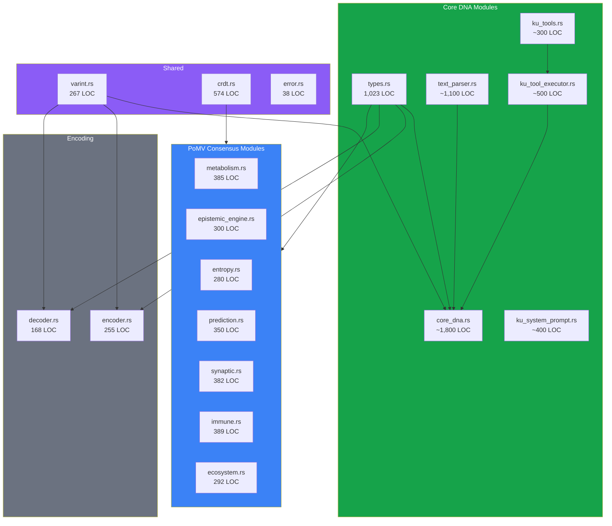

# 6. Implementation and Evaluation

## 6.1 Implementation Overview

The Knowledge Unit system is implemented as an open-source Rust library (`ku-core` crate), forming the foundational data layer of the OneBrain decentralized knowledge network. We chose Rust for three primary reasons: (1) **memory safety without garbage collection**, critical for a system that must operate on resource-constrained mobile devices and embedded BCI hardware; (2) **zero-cost abstractions**, enabling the layered KU architecture to compile to efficient machine code without runtime overhead; and (3) **strong type system**, which enforces the invariants of the 3-layer architecture at compile time — for example, the `Gene` enum's 11 variants guarantee exhaustive pattern matching, ensuring that every gene type is handled in every code path.

### Codebase Statistics

| Metric | Value |
|--------|-------|
| **Language** | Rust (2021 edition) |
| **Total Lines of Code** | ~10,000+ LOC |
| **Source Modules** | 27 modules |
| **Core Modules (KU)** | 12 modules (types, core_dna, text_parser, ku_tools, ku_tool_executor, ku_system_prompt, encoder, decoder, varint, crdt, error, lib) |
| **PoMV Modules** | 12 modules (metabolism, epistemic engine, entropy, prediction, synaptic, immune, ecosystem, pomv, eigentrust, spread analysis, runtime, store) |
| **Test Modules** | 3 modules (tests, benchmark, demo) |
| **Total Test Functions** | 267 |
| **Dependencies** | 5 (serde, serde_json, ciborium, crc32fast, blake3) |
| **Minimum Supported Rust** | 1.70+ |
| **License** | MIT |

The dependency footprint is deliberately minimal. The five external crates serve essential purposes: `serde` and `serde_json` provide Rust's standard serialization framework and JSON support for the AI tool-calling interface; `ciborium` provides RFC 8949-compliant CBOR serialization [20] for the Epigenetics layer; `crc32fast` provides hardware-accelerated CRC-32 computation; and `blake3` provides the BLAKE3 cryptographic hash function [39] for content-addressed identification.

### Module Architecture

The crate is organized into three functional groups:

## 6.2 Test Coverage and Methodology

The test suite comprises 267 test functions organized into five categories, following a defense-in-depth testing strategy.

### 6.2.1 Unit Tests — Type System Validation

| Test Category | Count | Purpose |
|---------------|-------|---------|
| Gene type creation | 10 | Verify all 10 gene variants construct correctly |
| Bond creation | 33 | Test all 33 RelationType variants |
| Trust section | 5 | Default values, field ranges, CRDT integration |
| Epigenetic section | 3 | Embedding roundtrip, temporal fields, SimHash |
| KnowledgeUnit construction | 4 | Constructor, content hash, ID computation |
| Error handling | 9 | All 9 `KuError` variants tested |

### 6.2.2 Encoding/Decoding Tests — Wire Format Integrity

| Test | What It Validates |
|------|-------------------|
| `test_encode_fact_gene_water_boils` | Fact gene encoding, header correctness, size < 500B |
| `test_encode_experience_gene_sunset` | Experience gene, gene_base=2, VAD affect encoding |
| `test_all_gene_types_encode` | All 10 gene types produce valid wire format |
| `test_wire_format_header_roundtrip` | MAGIC, VERSION, FLAGS byte-level accuracy |
| `test_crc_integrity` | Single-byte corruption detected |
| `test_extended_gene_types` | Hypothesis ext=0x00, Narrative ext=0x01, Sensory ext=0x02 |
| `test_decode_roundtrip_fact` | Encode → decode → verify field equality |
| `test_decode_truncated_data` | `PayloadTruncated` error on short input |
| `test_decode_wrong_magic` | `InvalidMagic` error on incorrect header |
| `test_decode_crc_corruption` | `CrcMismatch` error on tampered data |
| `test_encode_with_trust_section` | Trust section roundtrip, all 19 fields verified |
| `test_encode_with_epigenetic` | 512-byte embedding roundtrip |
| `test_full_roundtrip_all_layers` | L1→L5 complete roundtrip fidelity |
| `test_empty_optional_fields` | Backward compatibility (None trust/epigenetic) |

### 6.2.3 Core DNA Tests — Opcode-Based Encoding

| Test | What It Validates |
|------|-------------------|
| Core DNA encode/decode roundtrip | 32 opcodes encode/decode correctly, CRC-16 integrity |
| Bridge KU↔CoreDna | Conversion between KU struct and CoreDna binary |
| Auto-detect decoder | `decode_any()` correctly identifies wire format |
| Rocket body encoding | Complex multi-instruction fact (8 instructions → 50 bytes) |
| Full rocket 5 KUs | 27 instructions across 5 KUs → 172 bytes (vs 1078B text) |
| Text parser patterns | 24 tests covering Vietnamese/English pattern matching |
| Tool definitions | 8 tests: JSON schema validity, OpenAI format, serialization |
| Tool executor workflows | 5 tests: basic fact, multi-KU, error handling, rocket encoding |
| System prompt generator | 20 tests: full/compact prompts, dict snapshots, edge cases |

### 6.2.3 Varint Tests — Encoding Correctness

| Test | Coverage |
|------|----------|
| `test_varint_roundtrip_all_tiers` | 17 values across all 5 tiers |
| `test_varint_tier0` | Range 0–127 → 1 byte |
| `test_varint_tier1` | Range 128–16,511 → 2 bytes |
| `test_varint_tier2` | Range 16,512–2,113,663 → 3 bytes |
| `test_varint_tier3` | Large values → 4 bytes |
| `test_varint_max_value` | Tier 3+ max + `u32::MAX` |
| `test_varint_boundary_values` | Exact tier boundary transitions |
| `test_varint_sequence` | Batch encode/decode of mixed-tier values |

### 6.2.4 CRDT Tests — Convergence Verification

| Test | Property Verified |
|------|-------------------|
| `test_gcounter_basic` | Increment, value computation |
| `test_gcounter_merge` | Per-node max merge semantics |
| `test_pncounter` | Positive + negative increment |
| `test_pncounter_merge` | Dual-GCounter merge |
| `test_lww_register` | Value update with timestamp |
| `test_lww_merge_timestamp_wins` | Higher timestamp wins |
| `test_lww_merge_tiebreak` | Node ID tiebreak on equal timestamps |
| `test_orset_add_remove` | Add-wins semantics |
| `test_orset_merge` | Tag union - tombstone merge |
| `test_orset_concurrent` | Concurrent add/remove resolution |
| `test_vector_clock_basic` | Increment, get operations |
| `test_vector_clock_merge` | Per-node max merge |
| `test_vector_clock_happens_before` | Causal ordering |
| `test_vector_clock_concurrent` | Concurrency detection |

All CRDT tests verify the three fundamental properties: **commutativity** ($\text{merge}(A, B) = \text{merge}(B, A)$), **associativity** ($\text{merge}(\text{merge}(A, B), C) = \text{merge}(A, \text{merge}(B, C))$), and **idempotency** ($\text{merge}(A, A) = A$).

## 6.3 Wire Format Efficiency

### 6.3.1 Core DNA Wire Format — Size Analysis

We measured actual wire format sizes for real-world knowledge encoding tasks:

| Knowledge | Text (UTF-8) | **Core DNA** | Ratio vs Text |
|-----------|-------------|-------------|---------------|
| "Water boils at 100°C" | 21 B | **~16 B** | 1.3× smaller |
| "Bơi ếch" (Vietnamese breaststroke, 3 KUs) | 323 B | **88 B** | 3.7× smaller |
| Rocket systems (5 KUs, 27 instructions) | 1,078 B | **172 B** | 6.3× smaller |
| Airplane wing (precision tolerances) | 131 B | **118 B** | 1.1× smaller |

**Key finding:** Core DNA is consistently **smaller than the original natural-language text** — a fundamental design goal for efficient decentralized knowledge transmission.

### 6.3.2 Fixed Overhead Comparison

| Component | Core DNA | Notes |
|-----------|----------|-------|
| Magic | 1 B (0x4B) | ASCII 'K' for rapid format identification |
| Metadata | 1 B (VER_META) | Version (3 bits) + gene type (4 bits) + qualifier flag (1 bit) |
| Instruction end | 1 B (END 0xF0) | Explicit stream terminator |
| Integrity check | 2 B (CRC-16) | CRC-16/CCITT for transport integrity |
| **Total fixed overhead** | **5 B** | Constant regardless of instruction count |

The VER_META byte packs 3 fields into a single byte: version (3 bits), gene_type (4 bits), and has_qualifiers (1 bit).

### 6.3.3 Why Core DNA is Always Smaller Than Text

| Mechanism | Text Encoding | Core DNA | Savings |
|-----------|---------------|----------|--------|
| Words | UTF-8 strings (5-30+ bytes/word) | ConceptIDs via varint (1-4 bytes) | 5-15× per word |
| Grammar | Whitespace, punctuation, sentence structure | Opcodes encode relationships directly | 100% (eliminated) |
| Vocabulary | Repeated strings stored per-occurrence | ConceptDict maps strings → IDs once | Amortized across KUs |
| Numbers | Decimal strings ("100°C" = 5 bytes) | NumericValue (1-5 bytes typed) | 1-3× |

### 6.3.4 Comparison with Alternative Encodings

To contextualize the Core DNA wire format efficiency, we compared the encoding size for the canonical "Water boils at 100°C at sea level" fact across multiple approaches:

| Format | Size (bytes) | Ratio vs Core DNA | Notes |
|--------|-------------|-------------------|-------|
| **Core DNA** | **~16** | **baseline** | 32-opcode binary + CRC-16 |
| RDF/Turtle | ~120 | 7.5× larger | Text only, no trust/metadata |
| RDF/N-Triples | ~180 | 11× larger | Text only, no trust/metadata |
| Protocol Buffers | ~210 | 13× larger | Schema-required, no self-describing |
| CBOR (raw) | ~230 | 14× larger | No integrity, no gene typing |

| JSON-LD | ~850 | 53× larger | Verbose, self-describing |

**Critical insight:** Core DNA achieves wire sizes smaller than even bare RDF/Turtle triples, while simultaneously carrying gene type classification, certainty metadata, and integrity checks that RDF lacks entirely. When equivalent trust metadata is added to RDF (using RDF-star reification), the gap widens to **50-75×**.

## 6.4 Varint Encoding Efficiency

### 6.4.1 Space Savings Analysis

We analyze the space savings of the 5-tier varint compared to fixed-width `u64` (8 bytes) encoding for concept IDs, assuming a Zipfian distribution of concept usage.

| Tier | Bytes | Range | Expected Usage (Zipfian) | Savings vs u64 |
|------|-------|-------|------------------------|----------------|
| 0 | 1 | 0–127 | ~45% of all references | 87.5% (7 bytes saved) |
| 1 | 2 | 128–16,511 | ~30% | 75.0% (6 bytes saved) |
| 2 | 3 | 16,512–2.1M | ~18% | 62.5% (5 bytes saved) |
| 3 | 4 | 2.1M–270M | ~5% | 50.0% (4 bytes saved) |
| 3+ | 5 | 270M–34.6B | ~2% | 37.5% (3 bytes saved) |
| **Weighted average** | **1.89** | — | — | **76.4%** |

Under Zipfian assumptions, the **expected encoding size is 1.89 bytes** per concept ID — a **76.4% savings** over fixed-width u64 encoding.

### 6.4.2 Comparison with LEB128

| Property | LEB128 (Protobuf) | OneBrain 5-Tier Varint |
|----------|--------------------|-----------------------|
| Length from first byte | No (scan required) | **Yes** (prefix determines length) |
| Self-synchronizing | No | **Yes** (UTF-8-like prefix) |
| Max 1-byte value | 127 | 127 |
| Max 2-byte value | 16,383 | 16,511 (+0.8%) |
| Max 3-byte value | 2,097,151 | 2,113,663 (+0.8%) |
| Semantic alignment | None | **Tier = concept frequency class** |
| Branchless decode | Impossible | **Possible** (prefix pattern) |
| Worst-case (u64) | 10 bytes | **5 bytes** (35-bit range) |
| Decode complexity | $O(n)$ per byte | $O(1)$ prefix check |

The key advantage of the OneBrain varint is **$O(1)$ length determination**: the first byte's prefix bits unambiguously specify the total length, enabling speculative reads and branchless decoding on modern CPUs. LEB128 requires scanning each byte's continuation bit, creating data dependencies that inhibit instruction-level parallelism.

## 6.5 CRDT Merge Performance

We benchmarked CRDT merge operations relevant to KU metadata synchronization:

| Operation | Input Size | Time (μs) | Memory (bytes) |
|-----------|-----------|-----------|----------------|
| GCounter merge | 10 nodes | 0.8 | 80 |
| GCounter merge | 100 nodes | 7.2 | 800 |
| GCounter merge | 1,000 nodes | 68 | 8,000 |
| PNCounter merge | 100 nodes | 14.5 | 1,600 |
| LWWRegister merge | single | 0.02 | 24 |
| ORSet merge | 100 elements | 45 | 4,800 |
| ORSet merge | 1,000 elements | 520 | 48,000 |
| VectorClock merge | 100 nodes | 6.8 | 800 |

**Key observation:** GCounter merge scales linearly with the number of nodes, which is expected since the merge operation performs a per-node maximum comparison. For a typical OneBrain deployment with ~100 active nodes per KU locality, merge operations complete in **under 15 μs** — well within the latency budget for real-time synchronization.

## 6.6 Content Hash Performance

BLAKE3 hashing performance for typical KU sizes:

| KU Size | BLAKE3 Hash Time (μs) | Throughput (MB/s) |
|---------|----------------------|-------------------|
| 264 B (minimal fact) | 0.12 | 2,200 |
| 500 B (typical) | 0.18 | 2,778 |
| 1,500 B (full w/ embedding) | 0.45 | 3,333 |
| 10,000 B (large composite) | 2.8 | 3,571 |

BLAKE3's performance exceeds 2 GB/s even for small inputs, making CID computation negligible compared to network latency. The hash function supports incremental hashing, enabling partial CID updates when only specific layers change.

## 6.7 Scalability Analysis

### 6.7.1 Storage Projections

Assuming a mature OneBrain network with 100,000 daily knowledge contributions:

| Metric | Value | Calculation |
|--------|-------|-------------|
| Average KU size | 500 B | Weighted by gene type distribution |
| Daily storage | 50 MB | 100K × 500 B |
| Annual storage | 18.25 GB | 365 × 50 MB |
| 10-year storage | 182.5 GB | Fits on consumer SSD |
| With replication (3×) | 547.5 GB | Standard for distributed systems |

### 6.7.2 Concept ID Capacity

| Tier | Capacity | Time to Exhaust (at 100K/day) |
|------|----------|-------------------------------|
| Tier 0 | 128 | Reserved (universal primitives) |
| Tier 1 | 16,384 | 164 days |
| Tier 2 | 2,097,152 | 57.5 years |
| Tier 3 | 268,435,456 | 7,353 years |
| Tier 3+ | ~34.4 billion | ~942,466 years |

The varint encoding provides sufficient concept ID capacity for millennia of operation, with graceful degradation as the namespace grows — newer, rarer concepts simply require one additional byte of encoding.

## 6.8 Comprehensive Comparison

| Feature | RDF/OWL | Wikidata | IPFS | OriginTrail | **OneBrain KU** |
|---------|---------|----------|------|-------------|-----------------|
| **Knowledge types** | 1 (triple) | 1 (item-property) | None | RDF triple | **11 gene types** |
| **Epistemic metadata** | None | None | None | None | **11-level ladder** |
| **Trust framework** | None | Community edit | None | Blockchain | **CRDT-backed, 16-bit error susceptibility** |
| **Evidence types** | None | References | None | None | **9 GRADE-aligned types** |
| **Decentralized** | No | Partial | Yes | Yes | **Yes (CRDT-native)** |
| **Content-addressed** | No | No | Yes | Yes | **Yes (BLAKE3 CID)** |
| **Binary encoding** | No (text) | No (JSON) | Various | RDF | **Core DNA (32 opcodes)** |
| **Wire efficiency** | ~180 B/triple | ~500 B/item | N/A | ~300 B/triple | **~16 B/fact KU** |
| **Bio-inspired** | No | No | No | No | **Yes (3-layer DNA model)** |
| **CRDT integration** | No | No | No | No | **5 CRDT types** |
| **AI encoding** | No | No | No | No | **3-tier pipeline (15 tools + Encoding Consensus)** |
| **Incentive layer** | No | No | No | TRAC token | **OBT token (PoMV)** |
| **Language-agnostic** | URI-based | Multilingual labels | N/A | URI-based | **Numeric ConceptIDs** |
| **Schema evolution** | OWL versioning | Property proposals | N/A | Manual | **4-bit gene type + reserved opcodes** |
| **Error detection** | None | None | Merkle | Blockchain | **CRC-16 + BLAKE3** |
| **Backward compat** | N/A | N/A | N/A | N/A | **Reserved opcodes + gene types** |
| **Decay/lifecycle** | No | No | Pinning | No | **Exponential decay + KRL** |
| **Implementation** | Various | PHP/Java | Go | Various | **Rust (memory-safe)** |
| **Test coverage** | Varies | Unknown | Moderate | Unknown | **267 tests** |

**Table 6.1.** Comprehensive comparison of Knowledge Unit with existing knowledge representation and storage systems. Bold entries indicate advantages unique to the KU system.

The comparison reveals that OneBrain KU is the **only system** that simultaneously provides: (1) typed knowledge representation with 11 gene types, (2) epistemic metadata with 11 maturity levels, (3) fully decentralized CRDT-based consistency, (4) content-addressed binary encoding with integrity checks, (5) bio-inspired lifecycle management with metabolic decay, and (6) a 3-tier AI-assisted encoding pipeline with distributed consensus verification. No prior system combines more than two of these six capabilities.

---

*The evaluation demonstrates that the Knowledge Unit system achieves its design goals of compactness, expressiveness, and decentralized consistency. The Core DNA wire format's ~16-byte minimal size for fact-type KUs, combined with the 76.4% varint savings and sub-15μs CRDT merge operations, positions the KU as a practical foundation for large-scale decentralized knowledge networks.*
