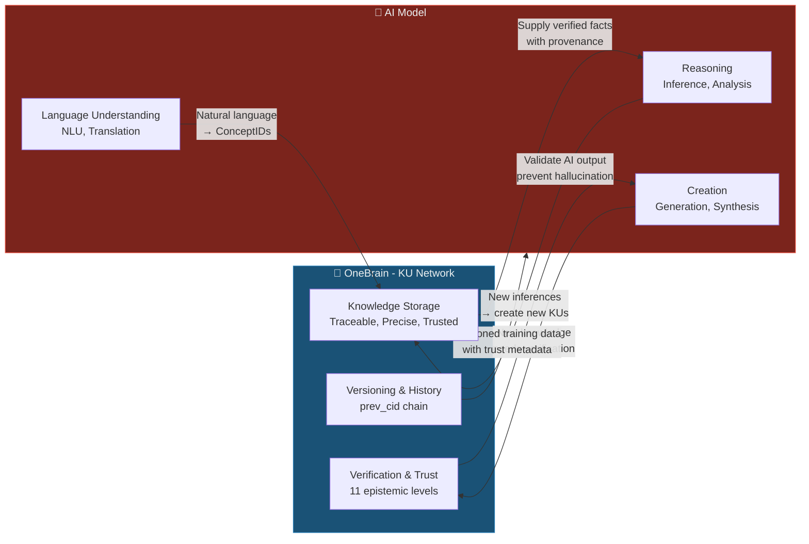

# Knowledge DNA vs AI Models: A Paradigm Comparison

> **OneBrain Technical Paper — Supplementary Analysis**
>
> **Abstract:** This document addresses the fundamental question: "How does OneBrain's Knowledge Unit (Knowledge DNA) differ from training an AI model with billions of parameters?" We demonstrate that KU and AI models represent two orthogonal paradigms — explicit structured memory vs. implicit statistical reasoning — that are complementary, not competing.

---

## 1. Core Analogy

> **KU is a Library. An AI Model is a Brain.**

| | 📚 Library (KU) | 🧠 Brain (AI Model) |
|---|---|---|
| Where is knowledge? | In individual **books** with author, publication date, ISBN | **Dissolved** across 175 billion synaptic connections, inseparable |
| Ask "who said this?" | Open the book → see author, publisher, edition | "I don't remember, but I *think*..." |
| Correct one fact | Replace one book; all others remain unaffected | Must **retrain the entire brain** ($100M+) |
| Can you trust it? | Check reviews, publisher reputation, read footnotes | "Trust me" — or hallucinate |
| Who owns it? | Author holds copyright, library holds the copy | OpenAI/Google own it; you merely rent access |
| Power outage? | Books remain on shelves | Brain stops functioning |

**Both are essential.** You visit the library to look up facts (KU), but you also need a brain (AI) to **understand**, connect, and create. The problem today: the world **only has brains (AI) without a good library** — so brains must memorize everything → hallucination.

---

## 2. Ten Fundamental Differences

| # | Dimension | 🧬 Knowledge DNA (KU) | 🧠 AI Model (LLM) |
|---|-----------|----------------------|-------------------|
| 1 | **Knowledge form** | **Explicit** — each fact is a discrete, readable unit | **Implicit** — knowledge dissolved across billions of weights, inseparable |
| 2 | **Provenance** | **Traceable** — every KU has CID, author DID, evidence type | **Opaque** — "trained on internet data"; cannot trace any fact to its source |
| 3 | **Updates** | **Granular** — modify one KU; everything else remains intact | **Catastrophic** — fine-tuning one fact may destroy thousands of others |
| 4 | **Trustworthiness** | **Verifiable** — 11 epistemic levels + trust score + evidence type | **Hallucinating** — confidently states falsehoods without self-awareness |
| 5 | **Structure** | **Composable** — assemble/disassemble like LEGO blocks | **Entangled** — everything intertwined, cannot isolate components |
| 6 | **Ownership** | **Ownable** — author signs with DID, retains attribution forever | **Collective** — training data loses all traceability |
| 7 | **Durability** | **Immortal** — replicated across thousands of P2P nodes | **Decaying** — knowledge cutoff date; outdated immediately |
| 8 | **Precision** | **Exact** — "sweep angle = 25.000°" stored precisely | **Approximate** — "about 25 degrees" (if not hallucinated) |
| 9 | **Governance** | **Democratic** — Proof-of-Knowledge; anyone can contribute | **Centralized** — only Google/OpenAI decide training data |
| 10 | **Role** | **Memory** — storage, organization, retrieval | **Processor** — reasoning, synthesis, creation |

---

## 3. Detailed Analysis

### 3.1 Explicit vs. Implicit Knowledge

**AI models know implicitly:**
```
Input:  "What is the sweep angle of the Boeing 737?"
Output: "The sweep angle of the Boeing 737 is approximately 25 degrees."

But: WHERE in 175 billion parameters does this fact reside?
→ NOBODY KNOWS. Not even OpenAI.
→ It is a statistical consequence of patterns in training data.
```

**KU knows explicitly:**
```
KU #4782:
  Gene: Fact
  Codons: (Boeing_737_Wing, sweep_angle, 25.0°)
  Trust: PeerReviewed, EvidenceType::Experimental
  Author: DID:ob:boeing_eng_team
  Evidence: Boeing 737-800 TCDS A16WE, Rev 72
  Confidence: 0.99
  → You know EXACTLY where this fact comes from, who wrote it,
    and how trustworthy it is.
```

> **Practical significance:** When the FAA asks "on what basis do you claim the sweep angle is 25°?" — KU can answer. AI cannot.

### 3.2 Granular vs. Catastrophic Updates

**AI Model — Catastrophic Forgetting:**
```
Discovery: "Latest sweep angle is 25.5° (after modification)"

To update AI:
1. Recollect entire training dataset        → $2M
2. Retrain model for 3 months              → $100M+ (GPT-4 class)
3. OR fine-tune → RISK: "catastrophic forgetting"
   (fixing 1 fact may corrupt 1,000 others)
4. OR RAG → external patch, not true learning
```

**KU — Surgical Update:**
```
To update KU:
1. Create new KU: (Boeing_737_Wing, sweep_angle, 25.5°)
2. prev_cid points to old KU → version history preserved
3. Trust section: EpistemicStatus::Updated
4. Cost: ~300 bytes + 1 microsecond
5. All other KUs remain COMPLETELY UNAFFECTED
```

### 3.3 Verifiable vs. Hallucinating

This is the **killer difference**.

```
Ask AI:  "What is the stall speed of the 737?"
AI:      "The stall speed of the Boeing 737 is approximately 115 knots."

Follow-up: "Source?"
AI:        "Based on publicly available Boeing data."
           (NO SPECIFIC SOURCE — may be correct, may be wrong,
            may be entirely hallucinated)
```

```
Query KU: FIND (k:KU) WHERE k.codons CONTAINS concept_id = STALL_SPEED 
          AND k.codons CONTAINS concept_id = BOEING_737

KU returns:
  KU #5201:
    Fact: (Boeing_737, stall_speed_clean, 110_knots)
    EpistemicStatus: Consensus (level 9/11)
    EvidenceType: Experimental
    Verification: 4 (Formal)
    Trust score: 8,750
    Corroborations: 47
    Challenges: 0
    Error susceptibility: 0x0000 (no known biases)
    Source: FAA TCDS A16WE Rev 72, Section 5
    → EXACT answer: 110 knots (not "approximately 115"),
      47 corroborating sources, 0 challenges, experimental evidence.
```

### 3.4 Composable vs. Entangled

```
KU Knowledge = LEGO blocks
┌──────┐ ┌──────┐ ┌──────┐
│ Fact │ │ Fact │ │Formal│  ← Each block separable
│sweep │ │area  │ │drag  │  ← Compose arbitrarily
│ 25°  │ │124m² │ │polar │  ← Replace one; others unchanged
└──┬───┘ └──┬───┘ └──┬───┘
   └────────┴────────┘
        Composite KU
    "Wing Geometry"

AI Knowledge = Mixed concrete
┌─────────────────────────────────┐
│  ██████████████████████████████ │  ← Everything poured together
│  █ sweep? area? drag? █████████ │  ← Cannot extract individual facts
│  ██████████████████████████████ │  ← Crack one spot → fracture all
│  ██████ 175 BILLION PARAMS ████ │
└─────────────────────────────────┘
```

### 3.5 Ownership & Attribution

| Scenario | KU | AI Model |
|----------|-----|----------|
| You contribute a fact | DID-signed → permanent attribution | Fact dissolves into training data → lost |
| You want to remove your contribution | Deprecate KU → signed by author | Cannot "unlearn" from model |
| Who gets credit? | KU author, via PoK → OBT tokens | AI corporation (OpenAI, Google) |
| You want to control access? | Encryption flag on KU | Impossible — model has already learned |

### 3.6 Precision for Safety-Critical Domains

> **This is where AI FAILS COMPLETELY for safety-critical applications.**

| Parameter | KU stores | AI "knows" |
|-----------|-----------|-----------|
| Sweep angle | **25.000° ± 0.001°** | "about 25 degrees" |
| Load factor | **2.5g (FAR 25.337)** | "usually 2.5g" |
| Fatigue life | **75,000 cycles (MIL-HDBK-5)** | "tens of thousands of cycles" |
| Drag polar | **$C_D = 0.015 + 0.045 C_L^2$** | May get coefficients wrong |
| Material yield | **324 MPa (Al 2024-T3)** | "around 300-350 MPa" |

In aviation: **"approximately" ≈ fatal**. KU stores exact values. AI approximates.

---

## 4. Where AI Excels Over KU

> An honest comparison must acknowledge AI's strengths.

| Capability | AI Model ✅ | KU ❌ |
|-----------|-----------|------|
| **Reasoning** | "If sweep > 25° without slats, stall speed increases ~15%" | KU does not reason — only stores facts |
| **Creativity** | Propose novel wing designs based on learned patterns | KU does not create — only organizes |
| **Natural language** | Explain in Vietnamese to non-experts | KU uses ConceptIDs; requires an interface |
| **Pattern recognition** | Detect "this CFD result resembles case XYZ from 2019" | KU requires explicit bonds |
| **Synthesis** | Summarize 200 papers into one paragraph | KU requires query + processing |
| **Generalization** | Transfer knowledge across domains | KU is domain-specific |

---

## 5. The Real Answer: KU + AI = Superpower

> **KU and AI DO NOT COMPETE — they COMPLEMENT each other.**
>
> KU is the **long-term, trustworthy, traceable memory** for AI.
> AI is the **reasoning, synthesis, and creativity engine** for KU.



### Practical Workflow Example:

```
Engineer: "Design a winglet for 737 MAX to reduce drag by 3%"

1. AI queries OneBrain:
   FIND KU WHERE codons CONTAINS (Boeing_737, wing_geometry) 
   → Receives 47 precise KUs: sweep=25°, AR=9.45, area=124.6m²...
   → Each KU includes trust score, source, evidence type

2. AI reasons:
   "Based on precise data from KU, I propose a winglet profile 
    with cant angle 8° and height 2.4m..."

3. AI creates new KU:
   Gene::Hypothesis {
     body: (Winglet_737MAX, drag_reduction, 3.2%),
     confidence: THEORETICAL,
     methodology: CFD_SIMULATION,
     maturity: SIMULATED
   }

4. OneBrain stores + verifies:
   - Trust: EpistemicStatus::Hypothesis
   - Evidence: Theoretical (will upgrade after wind tunnel test)
   - CID → immutable, traceable
   - Other engineers can corroborate or challenge
```

**Without KU:** AI hallucinates "sweep angle about 27°" → winglet design fails → money lost.
**Without AI:** KU has raw facts only → engineer must reason manually → slow.
**With both:** AI reasons on precise facts → trustworthy results, fast.

---

## 6. Counter-Arguments and Responses

### "AI is already sufficient; why do we need KU?"

| Objection | Response |
|-----------|----------|
| "GPT already knows everything" | GPT **does not know** — GPT **guesses** based on statistics. Ask it the same specific fact 3 times → you may get 3 different answers. |
| "AI has RAG already" | RAG is "search Google + paste into prompt." KU provides **trust scores, epistemic levels, versioning, and provenance** — RAG has none of these. |
| "Training is expensive but done once" | "Done once" means **outdated immediately**. GPT-4 has a knowledge cutoff. KU updates in real-time, fact by fact. |
| "AI will keep getting better" | True — and it will **need KU even more**, because better AI requires **more reliable, traceable data** to avoid hallucination. |
| "Billions of parameters store more" | GPT-4 has ~1.8 trillion params × 2 bytes = 3.6 TB. But you **cannot extract a single fact**. 3.6 TB of KUs = **~13 billion facts**, each traceable. |

### "So KU doesn't need AI?"

> It does! KU **needs AI** for:
> - Converting natural language → ConceptIDs
> - Detecting duplicates and contradictions
> - Reasoning over stored facts
> - Synthesizing and presenting knowledge to users

---

## 7. Summary

### Elevator Pitch (30 seconds)

> "AI models are like brains — great at reasoning but with fuzzy memory, no source attribution, and a tendency to hallucinate. Knowledge DNA is like structured memory — storing each fact precisely, knowing who said it, how trustworthy it is, and updating individual facts without breaking anything else. You don't choose between a brain and memory — you need BOTH. OneBrain is the trustworthy memory that every AI needs."

### One Sentence

> **KU stores knowledge for AI to USE — just as books store knowledge for brains to USE. Nobody asks "why do we need books when we already have brains?"**
