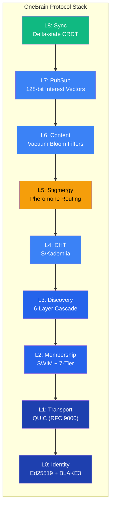

# 1. Introduction

## 1.1 Problem Statement

The architecture of contemporary peer-to-peer (P2P) networks reflects their origins in file-sharing applications. BitTorrent [1] optimizes for the distribution of large, static files through piece-based swarming. IPFS [2] generalizes content-addressed storage into a Merkle DAG structure, treating all data as opaque blocks addressable by cryptographic hash. Ethereum's devp2p [3] provides a minimal gossip substrate for propagating transactions and blocks. In each case, the fundamental data model is a **content-addressed blob** — an unstructured byte sequence identified by its hash.

Human knowledge, however, is fundamentally different from files. Knowledge is:

- **Structured**: A fact has subjects, predicates, objects, qualifiers, and epistemic context — not just bytes.
- **Queryable by meaning**: Users seek knowledge by semantic content ("What causes malaria?"), not by content hash.
- **Trust-annotated**: The same claim carries different weight depending on its source, evidence type, and verification history.
- **Evolving**: Knowledge metadata (usage counts, citations, trust scores) changes continuously, requiring efficient synchronization without replacing the entire object.
- **Heterogeneous in node capability**: A smartphone and a datacenter server should not play identical roles in a knowledge network.

No existing P2P protocol addresses these requirements natively. IPFS/libp2p provides no semantic routing, no built-in reputation system, and no knowledge-specific data types [4]. BitTorrent lacks any query mechanism beyond exact hash lookups [1]. Ethereum's P2P layer is optimized for block propagation, not knowledge discovery [3].

The scale challenge compounds the problem. Current P2P deployments operate at millions of nodes (IPFS: ~100K active [4], Bitcoin: ~15K full nodes, Ethereum: ~8K). OneBrain targets **100 billion nodes** — every human with a smartphone, every IoT device, every AI agent. At this scale, flat Kademlia routing requires ~37 hops (~1.85 seconds) per lookup — unacceptable for interactive knowledge queries.

Finally, mobile-first design is essential. Over 5 billion people access the internet primarily through smartphones [5]. A knowledge-sharing protocol that drains battery or requires constant connectivity will fail to achieve universal adoption. The target is **<0.5% battery per day** — barely noticeable to users.

## 1.2 Motivation: Knowledge Networks vs. File Networks

The distinction between file networks and knowledge networks is architectural, not superficial:

| Aspect               | File Network                      | Knowledge Network                              |
| -------------------- | --------------------------------- | ---------------------------------------------- |
| **Data unit**  | Opaque blob (bytes)               | Structured Knowledge Unit (typed, annotated)   |
| **Addressing** | Content hash (exact match)        | Semantic query (meaning-based)                 |
| **Routing**    | Hash-based DHT lookup             | Semantic routing (which nodes have expertise?) |
| **Node roles** | Homogeneous (all peers equal)     | Heterogeneous (phones ≠ servers)              |
| **Metadata**   | Static (immutable after creation) | Evolving (trust, usage, citations change)      |
| **Sync**       | Full object transfer              | Delta-state (only metadata changes)            |
| **Offline**    | Requires bootstrap servers        | Operates without internet                      |

*Table 1: Architectural differences between file networks and knowledge networks.*

In a file network, a node requests content by its exact hash and receives bytes. In a knowledge network, a node queries by meaning — "How do I repair a bicycle tire?" — and the network must route this query to nodes that possess relevant knowledge, rank results by trust and relevance, and return structured Knowledge Units [6] that include not just the answer but its evidence type, epistemic status, and provenance.

This requires **semantic routing**: the ability to direct queries toward nodes with demonstrated expertise in the relevant domain. We draw inspiration from **ant colony foraging** [7]: ants lay pheromone trails that guide others to food sources. Over time, the strongest trails converge on the best food sources. Similarly, OneBrain nodes lay digital pheromone trails that guide queries to knowledge sources. Successful query paths are reinforced; unsuccessful paths evaporate. The network self-organizes its routing topology to match knowledge demand patterns — without any central coordination.

## 1.3 Design Principles

The OneBrain Protocol (OBP) is governed by six design principles:

1. **No central servers.** The network self-sustains through peer-to-peer coordination. There is no bootstrap server, no coordinator, no single point of failure. This is not aspirational — it is a hard architectural constraint.
2. **Internet is optimization, not requirement.** The protocol operates over local wireless (BLE, WiFi Direct) without internet connectivity. Internet access improves performance but is not necessary for basic knowledge sharing. The 6-layer bootstrap cascade (§3.5) begins with offline-capable methods (QR code, NFC, mDNS) before attempting internet-dependent methods.
3. **Scale target: 100 billion+ nodes.** Every smartphone, IoT device, and AI agent should be a potential network participant. The 7-tier node hierarchy (§3.4) and hierarchical DHT routing reduce lookup latency from O(log₂ N) × RTT to approximately 7 hops for 100 billion nodes.
4. **Mobile-first: <0.5% battery per day.** All protocol decisions prioritize energy efficiency: QUIC's 0-RTT resumption (§3.3), SWIM's piggybacked gossip (§3.4), delta-state CRDT sync (§3.10), and Bloom filter content summaries (§3.8) all reduce the number of messages and bytes transmitted.
5. **Bio-inspired throughout.** Stigmergy routing (§3.7), fitness-based node hierarchy (§3.4), pheromone reinforcement/evaporation (§3.7), and ecological niche concepts guide architectural decisions at every layer.
6. **Content-agnostic trust.** Node reputation is based on behavioral patterns (uptime, bandwidth contribution, query success rate), not content moderation. The protocol does not inspect or judge the knowledge it carries.

*Figure 1: The 9-layer OneBrain Protocol stack. Layer 5 (Stigmergy) is highlighted as the primary novel contribution — bio-inspired pheromone routing for semantic knowledge queries.*

## 1.4 Contributions

This paper makes the following contributions:

1. **A 9-layer integrated P2P protocol stack purpose-built for knowledge sharing** (§3), combining identity, transport, membership, discovery, DHT, stigmergy routing, content filtering, publish/subscribe, and CRDT synchronization into a cohesive architecture.
2. **Bio-inspired stigmergy routing for semantic query optimization** (§3.7), applying ant colony pheromone reinforcement and evaporation to knowledge query routing — the first application of stigmergy to semantic content retrieval rather than packet or telecommunication routing.
3. **A 7-tier fitness-based node hierarchy with automated promotion/demotion** (§3.4), extending the SWIM membership protocol [8] with a capability-aware hierarchy spanning Leaf nodes (smartphones) to GlobalBackbone nodes (datacenters), with fitness scoring across 7 weighted dimensions.
4. **A 6-layer offline-first bootstrap cascade** (§3.5), enabling network formation without internet access through social exchange (QR/NFC/BLE) and local discovery (mDNS) before escalating to internet-dependent methods.
5. **Delta-state CRDT synchronization for distributed knowledge metadata** (§3.10), applying the delta-state CRDT framework of Almeida et al. [9] to knowledge trust scores and usage counters, achieving 10–100× bandwidth reduction over full-state replication.
6. **A comprehensive wire format supporting 74 message types** (§3.11) with a compact 6-byte universal header, enabling energy-efficient communication targeting <0.5% battery per day on mobile devices.

## 1.5 Paper Organization

The remainder of this paper is organized as follows. Section 2 surveys related work across distributed hash tables, membership protocols, bio-inspired routing, transport protocols, and CRDT synchronization. Section 3 presents the core 9-layer architecture with full technical detail. Section 4 describes the distributed query engine built atop the protocol stack. Section 5 evaluates the implementation, presents scale and energy analysis, and compares with IPFS/libp2p. Section 6 discusses findings, limitations, and future work.

---

## References

[1] B. Cohen, "Incentives Build Robustness in BitTorrent," in *Proc. Workshop on Economics of Peer-to-Peer Systems*, 2003.

[2] J. Benet, "IPFS — Content Addressed, Versioned, P2P File System," *arXiv preprint arXiv:1407.3561*, 2014.

[3] Ethereum Foundation, "devp2p: Ethereum Peer-to-Peer Networking Specifications," 2024. [Online]. Available: https://github.com/ethereum/devp2p

[4] D. J. Trautwein *et al.*, "Design and Evaluation of IPFS: A Storage Layer for the Decentralized Web," in *Proc. ACM SIGCOMM '22*, 2022.

[5] GSMA, "The Mobile Economy 2024," 2024.

[6] OneBrain Project, "Knowledge Unit: A Bio-Inspired Knowledge Representation for Decentralized Knowledge Networks," 2026 (companion paper).

[7] M. Dorigo and T. Stützle, *Ant Colony Optimization*. MIT Press, 2004.

[8] A. Das, I. Gupta, and A. Motivala, "SWIM: Scalable Weakly-consistent Infection-style Process Group Membership Protocol," in *Proc. IEEE/IFIP DSN '02*, 2002.

[9] P. S. Almeida, A. Shoker, and C. Baquero, "Delta State Replicated Data Types," *Journal of Parallel and Distributed Computing*, vol. 111, pp. 162–173, 2018.