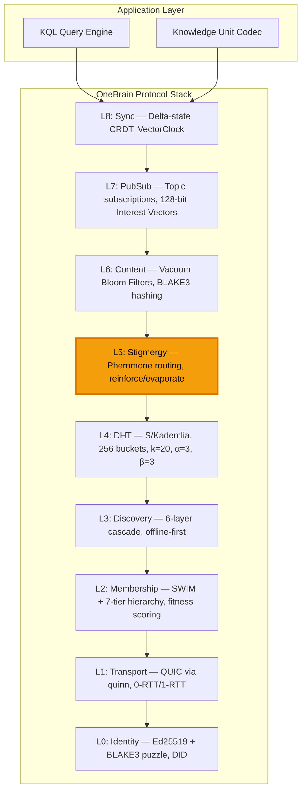
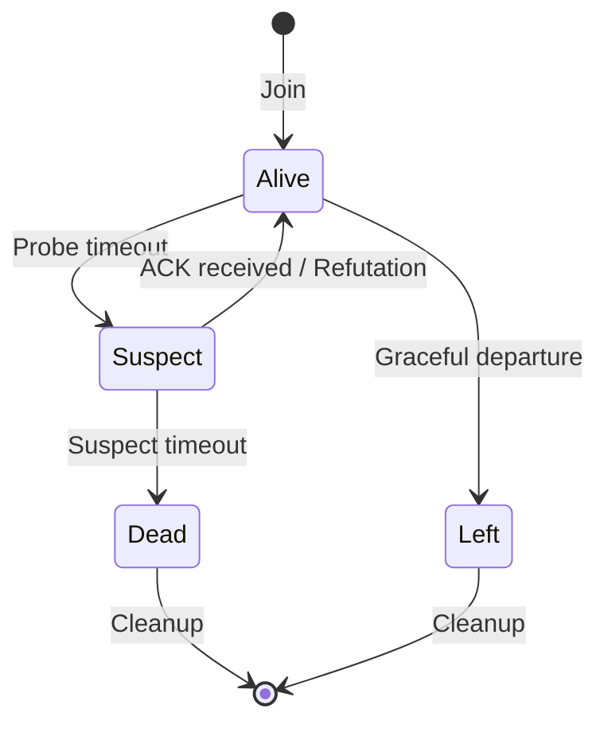
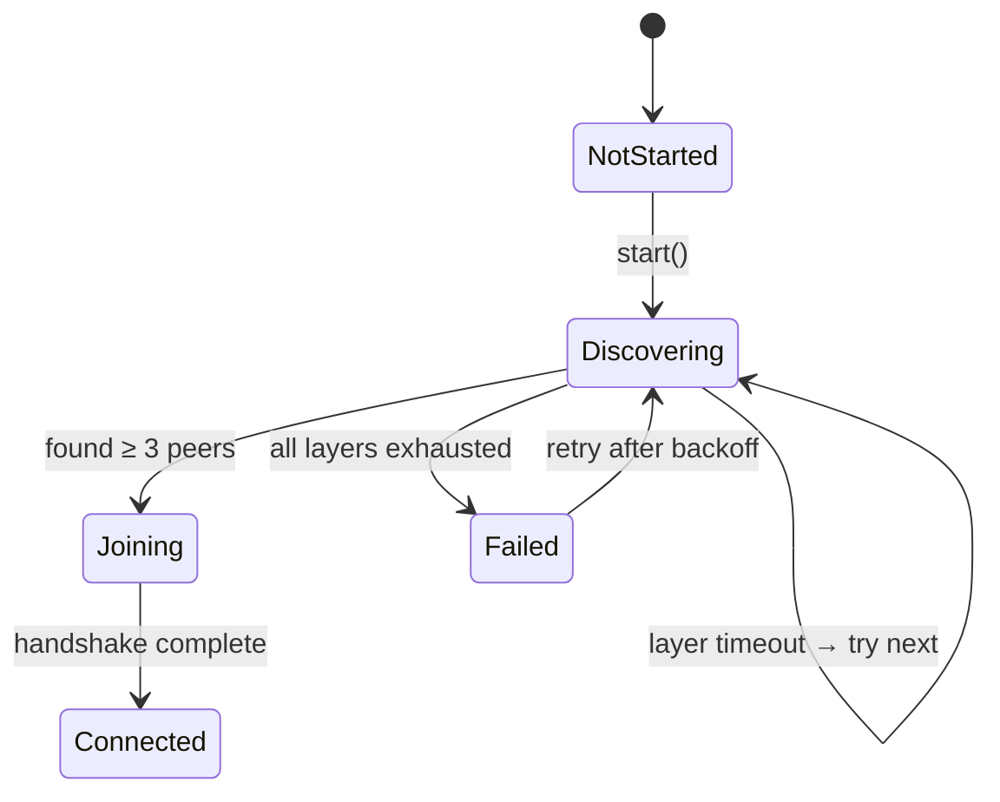
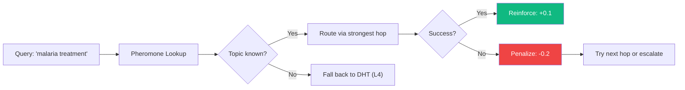

# 3. Protocol Architecture

This section presents the complete technical architecture of the OneBrain Protocol (OBP) — a 9-layer integrated P2P stack purpose-built for decentralized knowledge sharing.

## 3.1 System Overview

The OneBrain Protocol comprises nine layers, each addressing a specific concern in the knowledge-sharing stack. Unlike libp2p's modular approach — where protocols are composed independently — OBP's layers are designed as an integrated system with cross-layer optimizations: SWIM membership updates are piggybacked on transport messages (L2→L1), pheromone reinforcement is triggered by query results (L5←L4), and Bloom filter exchanges occur during membership protocol rounds (L6→L2).



*Figure 2: Complete OBP architecture. Layer 5 (Stigmergy) is highlighted as the primary novel contribution.*

**Design constraints** governing all architectural decisions:

| Constraint          | Target            | Rationale                            |
| ------------------- | ----------------- | ------------------------------------ |
| No central servers  | Zero              | Self-sustaining network              |
| Internet dependency | Optional          | Offline-first for developing regions |
| Scale               | 100B+ nodes       | Every smartphone, IoT, AI agent      |
| Energy              | <0.5% battery/day | Mobile-first adoption                |
| Latency             | <500ms query      | Interactive knowledge access         |
| Byzantine tolerance | 20% malicious     | Open, permissionless network         |

## 3.2 Layer 0: Identity

Layer 0 establishes cryptographic identity for every network participant through three components: keypairs, puzzle-derived NodeIds, and decentralized identifiers.

### 3.2.1 Keypair Generation

Each node generates an **Ed25519** keypair [1] using the `ed25519-dalek` crate. Ed25519 provides 128-bit security with 64-byte signatures and 32-byte public keys — compact enough for mobile devices.

```rust
pub struct KeyPair {
    signing_key: SigningKey,  // Ed25519 private key
}
```

The `KeyPair` supports: `generate()` (random), `sign(&[u8]) → Signature`, `verify(&[u8], &Signature) → bool`, and `pubkey_bytes() → [u8; 32]`.

### 3.2.2 Cryptographic Puzzle for NodeId

To prevent Sybil attacks (where an adversary creates many identities cheaply), NodeIds are derived through a computational puzzle inspired by S/Kademlia [2]:

$$
\text{NodeId} = \text{BLAKE3}(\text{pubkey} \| \text{nonce})[0..32]
$$

subject to the constraint:

$$
\text{leading\_zeros}(\text{NodeId}) \geq \text{difficulty}
$$

The node iterates nonces until finding one satisfying the difficulty requirement. Expected iterations: $2^{\text{difficulty}}$.

**Adaptive difficulty scaling:**

| Constant            | Value | Network Size | Expected Iterations | Time (Phone) |
| ------------------- | ----- | ------------ | ------------------: | -----------: |
| `PUZZLE_C_SMALL`  | 16    | <1M nodes    |             ~65,536 |        ~50ms |
| `PUZZLE_C_MEDIUM` | 20    | 1M–1B nodes |          ~1,048,576 |       ~800ms |
| `PUZZLE_C_LARGE`  | 24    | >1B nodes    |         ~16,777,216 |         ~13s |

*Table 3: Puzzle difficulty scaling. BLAKE3's throughput (~1 GB/s on modern CPUs) enables rapid puzzle solving even on constrained devices.*

The puzzle provides two guarantees: (1) **identity cost** — creating a new identity requires non-trivial computation; (2) **NodeId uniformity** — puzzle solutions are uniformly distributed in the 256-bit space, preventing adversaries from choosing specific NodeIds to target DHT key ranges.

```
Algorithm 1: NodeId Generation
INPUT: pubkey (32 bytes), difficulty (u8)
OUTPUT: NodeIdProof { node_id, nonce, difficulty }

nonce ← 0
LOOP:
    candidate ← BLAKE3(pubkey ‖ nonce)[0..32]
    IF leading_zeros(candidate) ≥ difficulty:
        RETURN NodeIdProof { node_id: candidate, nonce, difficulty }
    nonce ← nonce + 1
```

### 3.2.3 Device Identity and DID

Each physical device has a **DeviceId** derived from its device-specific keypair: `DeviceId = BLAKE3(device_pubkey)[0..32]`. Up to `DEVICE_GROUP_MAX = 16` devices can share a single DID identity.

The DID format follows W3C conventions [3]: `did:key:z6Mk<hex(pubkey)>`.

**Protocol identifiers:**

- `OBP_ALPN = b"obp/1"` — QUIC Application-Layer Protocol Negotiation
- `OBP_PORT = 4242` — Default listening port

## 3.3 Layer 1: Transport (QUIC)

Layer 1 provides encrypted, multiplexed transport using **QUIC** (RFC 9000) [4] via the `quinn` Rust crate.

### 3.3.1 Connection Establishment

```rust
pub struct TransportConfig {
    pub bind_addr: SocketAddr,        // Default: 0.0.0.0:4242
    pub alpn: Vec<u8>,                // "obp/1"
    pub idle_timeout: Duration,       // 30 seconds
    pub keep_alive: Duration,         // 15 seconds
    pub max_bi_streams: u32,          // 100
    pub max_uni_streams: u32,         // 100
}
```

OBP uses **self-signed certificates** generated by `rcgen` — identity is established through the cryptographic puzzle (L0), not through a PKI certificate authority. The custom `SkipServerVerification` TLS verifier accepts any peer certificate, relying on NodeId verification for authentication.

### 3.3.2 Communication Patterns

`OBPConnection` provides four communication patterns:

| Method                                    | Direction     | Reliability       | Use Case          | 0-RTT Safe? |
| ----------------------------------------- | ------------- | ----------------- | ----------------- | :---------: |
| `send_uni(&[u8])`                       | One-way       | Fire-and-forget   | KU_PUSH, GOSSIP   |   Varies   |
| `request(&[u8]) → Vec<u8>`             | Bidirectional | Request/Response  | FIND_NODE, QUERY  |   Varies   |
| `recv_uni() → Vec<u8>`                 | Incoming      | Accept uni-stream | Receiving pushes  |     —     |
| `accept_bi() → (Vec<u8>, BiResponder)` | Incoming      | Accept bi-stream  | Handling requests |     —     |

**0-RTT vs 1-RTT classification:**

- **0-RTT safe** (idempotent): `SwimPing`, `SwimAck`, `FindNodeReq`, `FindNodeResp`, `BloomFilter`, `PeerExchange`
- **1-RTT required** (non-idempotent): `KuPush`, `QueryForward`, `StoreReq`, `CrdtSyncDelta`

0-RTT eliminates one round-trip for repeat connections, critical for energy efficiency on mobile devices.

## 3.4 Layer 2: Membership (SWIM + 7-Tier Hierarchy)

Layer 2 combines the SWIM protocol [5] for failure detection with a novel 7-tier node hierarchy for capability-aware routing.

### 3.4.1 SWIM Protocol Parameters

| Parameter             |  Value | Description                           |
| --------------------- | -----: | ------------------------------------- |
| `T_PERIOD_MS`       |  1,000 | Protocol period (probe interval)      |
| `T_DIRECT_MS`       |    200 | Direct probe timeout                  |
| `T_INDIRECT_MS`     |    500 | Indirect probe timeout                |
| `K_INDIRECT`        |      3 | Indirect probes per suspicion         |
| `T_SUSPECT_BASE_MS` |  5,000 | Base suspect timeout                  |
| `MAX_PIGGYBACK`     |      6 | Max piggybacked updates per message   |
| `MAX_MEMBERS`       | 10,000 | Max membership list size              |
| `LHA_MAX`           |      8 | Max Local Health Awareness multiplier |

*Table 4: SWIM protocol constants.*

**Member status state machine:**



**Suspect timeout** adapts to network size:

$$
T_{\text{suspect}} = T_{\text{base}} \times \ln(N) \times (1 + \text{LHA})
$$

where $N$ is the membership size and LHA is the Local Health Awareness multiplier (increases when a node detects its own degradation).

**Piggyback priority** ensures critical updates propagate first: Dead > Suspect > Left > Alive.

### 3.4.2 Seven-Tier Node Hierarchy

The 7-tier hierarchy is OBP's primary contribution to membership protocol design. Each tier corresponds to a node's capability and geographic scope:

| Tier | Name           | Promotion | Demotion | Role                  | Typical Device |
| :--: | -------------- | :-------: | :------: | --------------------- | -------------- |
|  0  | Leaf           |    —    |    —    | Passive consumer      | IoT sensor     |
|  1  | Contributor    |   0.30   |   0.20   | Active participant    | Smartphone     |
|  2  | LocalSP        |   0.60   |   0.50   | Local super-peer      | Laptop         |
|  3  | RegionalSP     |   0.75   |   0.65   | Regional coordinator  | Desktop        |
|  4  | CountrySP      |   0.85   |   0.78   | Country-level hub     | Small server   |
|  5  | ContinentalSP  |   0.92   |   0.87   | Continental backbone  | Server         |
|  6  | GlobalBackbone |   0.97   |   0.93   | Global infrastructure | Datacenter     |

*Table 5: 7-tier node hierarchy. Promotion and demotion thresholds include hysteresis (gap = 0.10) to prevent oscillation.*

### 3.4.3 Fitness Scoring

Each node's fitness is computed as a weighted linear combination of 7 dimensions:

$$
f = w_u \cdot u + w_b \cdot b + w_w \cdot w + w_s \cdot s + w_c \cdot c + w_n \cdot n + w_r \cdot r
$$

| Weight | Dimension          | Description                        | Range |
| :----: | ------------------ | ---------------------------------- | :----: |
|  0.20  | $u$ (uptime)     | Fraction of time online            | [0, 1] |
|  0.15  | $b$ (battery)    | Battery level or 1.0 if plugged in | [0, 1] |
|  0.20  | $w$ (bandwidth)  | Available bandwidth normalized     | [0, 1] |
|  0.15  | $s$ (storage)    | Available storage normalized       | [0, 1] |
|  0.10  | $c$ (CPU)        | Processing capability              | [0, 1] |
|  0.10  | $n$ (network)    | Network quality                    | [0, 1] |
|  0.10  | $r$ (reputation) | EigenTrust reputation score        | [0, 1] |

*Table 6: Fitness scoring weights. Network quality: WiFi=1.0, 5G=0.8, 4G=0.5, 3G=0.2.*

The fitness score $f \in [0, 1]$ determines tier eligibility. **Hysteresis** (gap of 0.05–0.10 between promotion and demotion thresholds) prevents oscillation when fitness fluctuates near tier boundaries.

**MemberEntry** fields: `node_id: NodeId`, `address: NetworkAddress`, `incarnation: u32`, `status: MemberStatus`, `tier: NodeTier`, `last_seen: Instant`, `fitness_score: f32`, `topic_vector: [u8; 16]`.

## 3.5 Layer 3: Discovery (6-Layer Bootstrap Cascade)

Layer 3 implements an offline-first bootstrap cascade. The cascade tries each layer in priority order; the first layer to discover ≥3 peers succeeds.

| Priority | Layer     | Method                        | Internet? | Timeout |
| :------: | --------- | ----------------------------- | :-------: | :-----: |
|    0    | Social    | QR code / NFC / BLE           |    No    |   —   |
|    1    | Local     | mDNS`_obp._udp.local`       |    No    |   10s   |
|    2    | HTTP      | GET`/.well-known/obp-peers` |    Yes    |   10s   |
|    3    | DHT       | Connect to bootstrap nodes    |    Yes    |   10s   |
|    4    | DNS       | TXT records                   |    Yes    |   10s   |
|    5    | Hardcoded | Compiled-in peer addresses    |    Yes    |   10s   |

*Table 7: 6-layer bootstrap cascade. First two layers operate without internet access.*

**Bootstrap state machine:**



**Peer Exchange (PEX):** After bootstrap, nodes continuously discover new peers through PEX messages piggybacked on SWIM protocol rounds. `PexEntry` includes: `node_id`, `address`, `tier: u8`, `fitness: u16` (0–10,000 fixed-point). Maximum exchange: 10 peers per round, selected by fitness.

**Constants:** `MIN_BOOTSTRAP_PEERS = 3`, `BOOTSTRAP_LAYER_TIMEOUT_S = 10`, `MAX_SEEDS_PER_SOURCE = 20`, `PEX_MAX_PEERS = 32`.

## 3.6 Layer 4: DHT (S/Kademlia)

Layer 4 implements an S/Kademlia [2] routing table for distributed key-value storage and node lookup.

### 3.6.1 Parameters

| Parameter         | Value | Description                                  |
| ----------------- | ----: | -------------------------------------------- |
| `K_BUCKET_SIZE` |    20 | Max entries per k-bucket                     |
| `ALPHA`         |     3 | Concurrent lookup RPCs                       |
| `BETA`          |     3 | Disjoint lookup paths                        |
| `NUM_BUCKETS`   |   256 | Number of k-buckets (= bit length of NodeId) |

### 3.6.2 XOR Distance Metric

The distance between two NodeIds is the bitwise XOR:

$$
d(a, b) = a \oplus b
$$

The XOR metric satisfies: (1) $d(a,a) = 0$; (2) $d(a,b) > 0$ for $a \neq b$; (3) $d(a,b) = d(b,a)$ (symmetry); (4) $d(a,c) \leq d(a,b) + d(b,c)$ (triangle inequality). Symmetry ensures that every lookup also updates the contacted node's routing table — a key self-organization property.

### 3.6.3 Routing Table Structure

The routing table contains 256 k-buckets, indexed by the position of the first differing bit between the local NodeId and the target:

$$
\text{bucket\_index}(a, b) = \text{first\_differing\_bit}(a \oplus b)
$$

Each `KBucket` maintains:

- `entries: Vec<KBucketEntry>` — up to K=20 entries, LRU ordered (most-recently-seen at tail)
- `replacement_cache: Vec<KBucketEntry>` — backup entries promoted when active entries are evicted
- Stale eviction: entries with `stale_count ≥ 3` are replaced

### 3.6.4 Iterative Lookup

```
Algorithm 2: Kademlia Iterative Lookup
INPUT: target_key (32 bytes)
OUTPUT: K closest nodes to target_key

candidates ← find_closest(target_key, α) from local routing table
queried ← ∅

WHILE candidates has unqueried entries:
    batch ← take α closest unqueried from candidates
    FOR EACH node IN batch (PARALLEL):
        response ← RPC FindNode(target_key) to node
        candidates ← candidates ∪ response.nodes
        queried ← queried ∪ {node}
    IF no new closer nodes found:
        BREAK

RETURN K closest nodes from candidates
```

**S/Kademlia extension:** The lookup is performed along β=3 disjoint paths simultaneously. Each path maintains independent candidate sets, and results are merged at the end. This prevents a single malicious node from poisoning the entire lookup. With 20% adversarial nodes, β=3 achieves 92% lookup success [2].

### 3.6.5 Local Storage

`DhtNode` maintains a local key-value store (`HashMap<[u8; 32], Vec<u8>>`) with a capacity limit of 10,000 items. `find_value(key)` returns either the stored value or the K closest known nodes — enabling progressive refinement during lookups.

## 3.7 Layer 5: Stigmergy (Bio-Inspired Pheromone Routing)

Layer 5 is the protocol's **primary novel contribution**: a bio-inspired routing system that learns optimal query paths through reinforcement and evaporation, inspired by ant colony optimization [6].

### 3.7.1 Pheromone Data Model

```rust
pub struct PheromoneTable {
    entries: HashMap<TopicId, PheromoneEntry>,  // Max 10,000 entries
    // ...
}

pub struct PheromoneEntry {
    topic_id: TopicId,                          // BLAKE3(topic_label), 32 bytes
    next_hops: Vec<PheromoneHop>,               // Max 10 hops, sorted by strength
    last_reinforced: Instant,
}

pub struct PheromoneHop {
    node_id: NodeId,
    strength: f32,          // [0.0, 1.0]
    success_count: u32,
    failure_count: u32,
}
```

### 3.7.2 Reinforcement and Evaporation

**Reinforcement** occurs when a query routed through a specific hop returns a successful result:

$$
s_{\text{new}} = \min(s_{\text{old}} + \delta_+, s_{\max}) \quad \text{where } \delta_+ = 0.1, \; s_{\max} = 1.0
$$

**Penalty** occurs when a query routed through a hop fails:

$$
s_{\text{new}} = \max(s_{\text{old}} - \delta_-, s_{\min}) \quad \text{where } \delta_- = 0.2, \; s_{\min} = 0.0
$$

The asymmetric penalty ($\delta_- = 2 \times \delta_+$) ensures that failed paths are forgotten faster than successful paths are reinforced — a conservative approach that prevents the network from routing queries through unreliable paths.

**New hop initialization:** When a previously unknown node successfully answers a query, a new hop is created with initial strength 0.3 (moderate confidence). Maximum 10 hops per topic, sorted by descending strength.

**Evaporation** occurs hourly, decaying all pheromone strengths exponentially:

$$
s_{\text{new}} = s_{\text{old}} \times \gamma^{\Delta t / T}
$$

where $\gamma = 0.95$ (decay rate), $\Delta t$ is elapsed time, and $T = 1$ hour. Hops with strength below 0.01 are removed. Empty entries are garbage collected.

### 3.7.3 Query Routing

Two routing functions:

1. **`best_next_hop(topic)`** → Returns the hop with highest pheromone strength for a given topic. Used for deterministic single-path routing.
2. **`route_query(topic, exclude)`** → Returns all hops with strength ≥ 0.05, excluding previously tried nodes. Used for multi-path exploration when the best hop fails.



*Figure 3: Stigmergy routing flow with reinforcement/penalty feedback loop.*

### 3.7.4 Comparison with AntNet

| Aspect                      | AntNet [7]             | OneBrain Stigmergy                 |
| --------------------------- | ---------------------- | ---------------------------------- |
| **Domain**            | Telecom packet routing | Knowledge query routing            |
| **Destination**       | Known address          | Unknown capability                 |
| **Ants**              | Forward + backward     | Query = forward, result = backward |
| **Pheromone meaning** | "Path reaches Node X"  | "Path answers Topic Y"             |
| **Evaporation**       | Periodic decay         | Hourly, γ=0.95                    |
| **Reinforcement**     | Delay-proportional     | Binary success/failure             |
| **Novel aspect**      | —                     | Routing to capability, not address |

*Table 8: Comparison of AntNet and OneBrain stigmergy routing.*

## 3.8 Layer 6: Content Routing (Vacuum Filters)

Layer 6 uses probabilistic data structures — specifically, BLAKE3-based Bloom filters — to enable efficient content capability assessment without full index exchange.

### 3.8.1 Vacuum Filter Design

```rust
pub struct VacuumFilter {
    bits: Vec<u64>,           // Bit array
    num_bits: u32,            // Total bits
    hash_count: u8,           // Number of hash functions
    num_items: u16,           // Items inserted
    bits_per_item: u8,        // Bits allocated per item
}
```

**Optimal parameterization:**

$$
\text{bits\_per\_item} = \lceil -\log_2(\text{fpr}) \times 1.44 \rceil \quad \text{clamped } [4, 20]
$$

$$
\text{hash\_count} = \lceil \text{bits\_per\_item} \times 0.693 \rceil \quad \text{clamped } [1, 16]
$$

Default: `VACUUM_BITS_PER_ITEM = 10`, `VACUUM_TARGET_FPR = 0.001` (0.1%).

**False positive rate:**

$$
\text{FPR} = \left(1 - e^{-kn/m}\right)^k
$$

where $k$ = hash functions, $n$ = items inserted, $m$ = total bits.

### 3.8.2 Wire Format

```
Offset  Size    Field
0       4B      num_bits (u32 BE)
4       1B      hash_count
5       1B      bits_per_item
6       2B      num_items (u16 BE)
8       var     bit_array (⌈num_bits/8⌉ bytes)
```

**Operations:** `insert(item)` — BLAKE3 hash → set `hash_count` bit positions; `contains(item)` — check all positions (no false negatives); `merge(other)` — bitwise OR of compatible filters.

## 3.9 Layer 7: PubSub

Layer 7 enables topic-based publish/subscribe for real-time knowledge dissemination.

**InterestVector:** A compact 128-bit Bloom filter encoding subscribed domain codes (`DomainCode = u16`). Three hash functions per domain:

$$
h_1 = \text{topic} \bmod 128, \quad h_2 = (\text{topic} \times 7 + 13) \bmod 128, \quad h_3 = (\text{topic} \times 11 + 37) \bmod 128
$$

**Interest overlap detection:** `interests_overlap(a, b)` performs bitwise AND across 16 bytes — if any bit is set in both vectors, the nodes share interests. This enables efficient topic-based peer selection during gossip rounds.

**Constraints:** `max_subs_per_topic = 100` subscribers per topic per node.

## 3.10 Layer 8: Delta-State CRDT Synchronization

Layer 8 provides eventually consistent knowledge metadata synchronization using delta-state CRDTs [8].

### 3.10.1 Sync Protocol

The synchronization protocol uses 4 message types:

| Step | Message          | Content                                    |
| :--: | ---------------- | ------------------------------------------ |
|  1  | `SyncRequest`  | sender, clock: VectorClock, requested_cids |
|  2  | `SyncResponse` | sender, clock, deltas: Vec\<SyncDelta\>    |
|  3  | `SyncAck`      | sender, clock, received_cids               |

Each `SyncDelta` contains: `cid: [u8; 32]`, `data: Vec<u8>`, `version: VectorClock`.

### 3.10.2 Delta-State Optimization

Rather than exchanging full CRDT state on every sync, the protocol sends only **deltas** — state changes since the requester's last known VectorClock:

1. Node A sends `SyncRequest` with its current VectorClock
2. Node B identifies KUs where A's clock doesn't dominate B's version
3. Node B sends only those deltas in `SyncResponse`
4. Node A merges received deltas and acknowledges

This achieves **10–100× bandwidth reduction** over full-state replication, essential for mobile nodes on cellular networks.

**Anti-entropy modes:**

- **Periodic:** Every 10 seconds, sync with a randomly selected peer
- **Triggered:** On local change, immediately push delta to K nearest neighbors

**CRDT overhead:** ~530 bytes per KU for metadata (GCounters + LWWRegister + ORSet + VectorClock).

## 3.11 Message System

### 3.11.1 Universal Header

Every OBP message begins with a 6-byte header:

```
Offset  Size  Field
0       1B    msg_type     (MessageType discriminant, u8)
1       1B    flags        (MessageFlags bitfield)
2       4B    payload_len  (u32 big-endian, max ~16 MB practical)
```

**MessageFlags (u8) bit layout:**

| Bits | Field       | Values                                      |
| :--: | ----------- | ------------------------------------------- |
| 0–1 | Compression | 0=None, 1=PackedCbor, 2=PackedZstd, 3=Delta |
|  2  | dict_id     | Dictionary identifier present               |
|  3  | fragmented  | Multi-frame message                         |
|  4  | 0-RTT safe  | Idempotent, safe for 0-RTT                  |
| 5–7 | reserved    | Future use                                  |

### 3.11.2 Complete Message Type Registry

OBP defines **81 message types** across 9 functional ranges:

| Range      | Layer              | Count | Message Types                                                                                                                                                                                                    |
| ---------- | ------------------ | :---: | ---------------------------------------------------------------------------------------------------------------------------------------------------------------------------------------------------------------- |
| 0x01–0x0F | Core Transport     |  14  | KuPush(01), KuPull(02), Gossip(03), TrustUpdate(04), DhtRequest(05), Ping(06), Pong(07), Bundle(08), BloomFilter(09), PeerExchange(0A), RelayRequest(0B), RelayData(0C), RelayClose(0D), Capability(0F)          |
| 0x10–0x1C | Membership         |  13  | SwimPing(10), SwimAck(11), SwimPingReq(12), SwimNack(13), SpFitness(14), SpHandoff(15), SpRedirect(16), SpRegister(17), SpOverloaded(18), Goodbye(19), HealthReport(1A), DepartingSoon(1B), ClusterAggregate(1C) |
| 0x20–0x26 | DHT                |   7   | FindNodeReq(20), FindNodeResp(21), FindValueReq(22), FindValueResp(23), StoreReq(24), StoreAck(25), HierLookup(26)                                                                                               |
| 0x30–0x38 | Content            |   9   | VacuumFilter(30), VacuumExchange(31), PheromoneUpdate(32), TopicSubscribe(33), TopicUnsubscribe(34), TopicPublish(35), TopicDeliver(36), NdnInterest(37), NdnData(38)                                            |
| 0x40–0x52 | Query/Watch        |   9   | WatchNotify(40), WatchRegister(41), WatchUnregister(42), TrustGossip(48), TrustVaccine(49), KuPropagation(4A), QueryForward(50), QueryResponse(51), QueryCancel(52)                                              |
| 0x60–0x68 | Sync               |   6   | CrdtSyncInit(60), CrdtSyncDelta(61), CrdtSyncAck(62), CrdtSyncComplete(63), MeshDelta(64), CacheInvalidate(68)                                                                                                   |
| 0x80–0x89 | Security           |  10  | PowChallenge(80), PowResponse(81), Backpressure(82), ProofOfStorage(83), ProofOfBandwidth(84), SpDemotion(85), MetabolismUpdate(86), MetabolismQuery(87), BlacklistUpdate(88), MetabolismResponse(89)            |
| 0x90–0x95 | Encoding Consensus |   6   | EncodingJobAnnounce(90), EncodingClaimReq(91), EncodingClaimResp(92), EncodingSubmission(93), EncodingConsensusResult(94), EncodingJobUpdate(95)                                                                 |
| 0xA0–0xA6 | OBT Token Protocol |   7   | ObtTransferRequest(A0), ObtTransferConfirm(A1), ObtBalanceQuery(A2), ObtBalanceResponse(A3), ObtMintBroadcast(A4), ObtStorageChallenge(A5), ObtForkWarrant(A6)                                                   |

*Table 9: Complete OBP message type registry (81 types across 9 ranges). Hex codes are the wire `msg_type` byte values.*

### 3.11.3 Network Address Encoding

Dual-stack IPv4/IPv6 address encoding:

```
addr_type (1B): 0x04 = IPv4, 0x06 = IPv6
address   (4B or 16B): Raw IP bytes
port      (2B BE): Port number
```

Total wire size: IPv4 = 7 bytes, IPv6 = 19 bytes.

## 3.12 Wire Format Integration

OBP frames wrap the KU wire format (defined in the companion paper [9]):

```
┌──────────────────────────────────────────────────┐
│  OBP Message Frame                                │
│  ┌──────────────────────────────────────────────┐ │
│  │  6-byte OBP Header                          │ │
│  │  [msg_type] [flags] [length — 4 bytes BE]   │ │
│  ├──────────────────────────────────────────────┤ │
│  │  Payload (0 – ~16 MB bytes)                 │ │
│  │  ┌────────────────────────────────────────┐  │ │
│  │  │  KU Wire Format (Core DNA v6)          │  │ │
│  │  │  [MAGIC=0x4B] [VER_META]               │  │ │
│  │  │  [INSTRUCTION STREAM...]               │  │ │
│  │  │  [END=0xF0] [CRC-16 — 2 bytes]        │  │ │
│  │  └────────────────────────────────────────┘  │ │
│  └──────────────────────────────────────────────┘ │
│  [Ed25519 Signature — 64 bytes] (optional)        │
└──────────────────────────────────────────────────┘
```

*Figure 4: OBP frame encapsulating a KU wire format payload. The 6-byte OBP header provides message typing and framing; the KU Core DNA v6 wire format provides knowledge-specific encoding; the optional Ed25519 signature provides authenticity.*

Typical wire sizes: Minimal Fact KU = 22 bytes (6-byte header + 16-byte CoreDna), typical multi-instruction KU = ~94 bytes (6-byte header + 88-byte CoreDna). Total OBP overhead: 6 bytes (header) + 64 bytes (optional signature) = 6–70 bytes per message.

---

## References

[1] D. J. Bernstein *et al.*, "High-speed high-security signatures," *Journal of Cryptographic Engineering*, vol. 2, no. 2, pp. 77–89, 2012.

[2] I. Baumgart and S. Mies, "S/Kademlia: A Practicable Approach Towards Secure Key-Based Routing," in *Proc. IEEE ICPADS '07*, 2007.

[3] M. Sporny, D. Reed *et al.*, "Decentralized Identifiers (DIDs) v1.0," W3C Recommendation, Jul. 2022.

[4] J. Iyengar and M. Thomson, "QUIC: A UDP-Based Multiplexed and Secure Transport," *IETF RFC 9000*, May 2021.

[5] A. Das, I. Gupta, and A. Motivala, "SWIM: Scalable Weakly-consistent Infection-style Process Group Membership Protocol," in *Proc. IEEE/IFIP DSN '02*, 2002.

[6] M. Dorigo and T. Stützle, *Ant Colony Optimization*. MIT Press, 2004.

[7] G. Di Caro and M. Dorigo, "AntNet: Distributed Stigmergetic Control for Communications Networks," *JAIR*, vol. 9, pp. 317–365, 1998.

[8] P. S. Almeida, A. Shoker, and C. Baquero, "Delta State Replicated Data Types," *Journal of Parallel and Distributed Computing*, vol. 111, pp. 162–173, 2018.

[9] OneBrain Project, "Knowledge Unit: A Bio-Inspired Knowledge Representation for Decentralized Knowledge Networks," 2026 (companion paper).