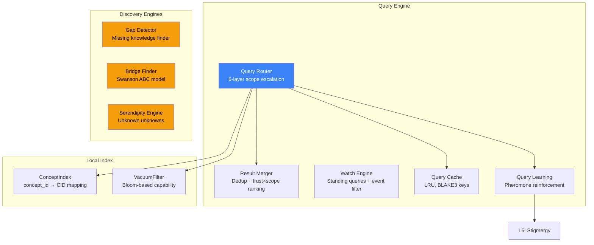

# 4. Distributed Query Engine

Built atop the 9-layer protocol stack, the OneBrain Distributed Query Engine transforms semantic knowledge queries into structured network operations. This section describes the query router, result merger, standing queries, three novel discovery engines, and the pheromone-based learning feedback loop.

## 4.1 Architecture Overview

The query engine consists of 9 modules (~2,500 LOC) layered above the core protocol:



*Figure 5: Distributed Query Engine architecture. Discovery Engines (highlighted) are novel contributions.*

## 4.2 Query Router: 6-Layer Scope Escalation

The query router implements **progressive scope escalation** — starting with the cheapest, most local resolution and expanding outward only when necessary:

| Scope | Layer | Method | Cost | Latency |
|:-----:|-------|--------|:----:|:-------:|
| 1 | Local | ConceptIndex lookup | O(1) | <1ms |
| 2 | DHT | S/Kademlia find_value | O(log N) | ~200ms |
| 3 | Stigmergy | Follow pheromone trails (L5) | O(hops) | ~150ms |
| 4 | PubSub | Broadcast to interest-matched peers (L7) | O(subs) | ~100ms |
| 5 | Mesh | Flood to K nearest neighbors | O(K) | ~300ms |
| 6 | External | Cross-network bridges | O(1) | ~500ms+ |

*Table 10: Query scope escalation. Each layer is attempted sequentially; the first successful result terminates escalation.*

**Wire messages:**
- `QueryForward(0x50)`: Forward query to next hop with TTL and scope metadata
- `QueryResponse(0x51)`: Return matching KUs with trust scores
- `QueryCancel(0x52)`: Cancel an in-flight query (e.g., after timeout or sufficient results)

**Scope escalation algorithm:**

```
Algorithm 3: Query Scope Escalation
INPUT: query (semantic query), max_results, timeout
OUTPUT: ranked list of KUs

results ← ∅
FOR scope IN [Local, DHT, Stigmergy, PubSub, Mesh, External]:
    new_results ← execute_scope(query, scope)
    results ← results ∪ new_results
    IF |results| ≥ max_results OR timeout expired:
        BREAK
    IF scope = Stigmergy AND new_results ≠ ∅:
        reinforce_pheromone(query.topic, successful_hop)

RETURN merge_and_rank(results)
```

**Query constraints:** `MAX_QUERY_DEPTH = 10` (max forwarding hops), `QUERY_TIMEOUT_S = 30`, `MAX_CONCURRENT_QUERIES = 50`.

## 4.3 Result Merger

The Result Merger performs deduplication and trust-weighted ranking:

1. **Deduplication**: Results with identical CIDs are collapsed, preserving the highest-trust variant
2. **Ranking**: Each result is scored by:

$$\text{score}(r) = \text{trust\_score}(r) \times \text{scope\_proximity}(r)$$

where `trust_score` is the source node's EigenTrust reputation and `scope_proximity` rewards local results (scope 1 = 1.0, scope 6 = 0.3, linearly interpolated).

3. **Sorting**: Results are returned in descending score order

This ensures that locally-available, high-trust results always rank above distant, lower-trust alternatives — reducing latency and reinforcing local knowledge caching.

## 4.4 Standing Queries (Watch Engine)

The Watch Engine enables **persistent, event-driven queries** — clients register interest in topics and receive push notifications when matching Knowledge Units arrive:

- `WatchRegister(0x41)`: Register a standing query with topic filter, gene type filter, domain filter, and optional author filter
- `WatchNotify(0x40)`: Push notification containing matching KU CID and metadata
- `WatchUnregister(0x42)`: Cancel a standing query

**Event filters** support matching on:
- Gene type (e.g., only Fact or Hypothesis)
- Domain codes (e.g., only medicine or physics)
- Author NodeId (e.g., follow a specific contributor)
- Epistemic status threshold (e.g., only Evidence or higher)
- Temporal range (e.g., only KUs created in last 7 days)

Standing queries are propagated to the subscriber's nearest super-peer (L2 tier ≥ 2), which aggregates filters from multiple clients and efficiently evaluates incoming KUs against all registered watches.

## 4.5 Discovery Engines

Three novel discovery engines extend beyond traditional search to proactively surface valuable knowledge connections:

### 4.5.1 Knowledge Gap Detector

The Gap Detector identifies **missing knowledge** in the local graph by analyzing concept connectivity:

1. For each concept with high query volume but low retrieval success, flag as a **demand gap**
2. For each pair of related concepts (connected by Bond type PartOf, Causes, or Enables) where intermediate concepts are missing, flag as a **structural gap**
3. Prioritize gaps by: query demand × concept importance × domain coverage

Gaps are surfaced as suggestions for knowledge creation — incentivizing contributors to fill high-value knowledge voids.

### 4.5.2 Swanson ABC Cross-Domain Bridge Finder

Inspired by Swanson's discovery of undiscovered public knowledge [1], the Bridge Finder identifies potential cross-domain connections:

**Principle:** If Domain A establishes "X relates to Y" and Domain B establishes "Y relates to Z," then the potential connection "X relates to Z" may represent undiscovered knowledge — invisible to researchers in either domain alone.

**Algorithm:**
1. Index all Bond relationships by concept IDs
2. For each pair of KUs from different domains sharing a common concept, compute bridge potential:

$$\text{bridge\_score} = \text{trust}(KU_A) \times \text{trust}(KU_B) \times \text{domain\_distance}(A, B) \times \text{novelty}(X \to Z)$$

3. Rank bridges by score and surface top candidates

Swanson famously used this technique to discover the connection between fish oil and Raynaud's syndrome [1] — a finding later confirmed clinically. The Bridge Finder automates this process across the entire OneBrain knowledge graph.

### 4.5.3 Serendipity Engine (Unknown Unknowns)

The Serendipity Engine surfaces knowledge the user **didn't know they needed** — exploiting the richness of the 33 bond types (§3 of companion paper) to find surprising connections:

1. Start from the user's interest vector (L7 PubSub, 128-bit Bloom filter)
2. Traverse bonds of type `AnalogyOf`, `Inspires`, `CulturallyContextualizes`, and `EvolvesInto` — types that connect semantically distant concepts
3. Score candidates by:

$$\text{serendipity} = \text{concept\_distance} \times \text{relevance\_to\_interests} \times \text{metabolic\_rate}$$

High serendipity = conceptually distant but relevant and actively used. This balances surprise (novelty) with utility (demonstrated value through metabolism).

## 4.6 Query Learning (Pheromone Reinforcement)

The query engine closes the feedback loop with Layer 5 (Stigmergy):

1. When a query through scope 3 (Stigmergy) returns results the user engages with (dwell time > threshold):
   - **Reinforce** the pheromone trail: $s \leftarrow \min(s + 0.1, 1.0)$
   
2. When a query returns no results or the user immediately discards them:
   - **Penalize** the pheromone trail: $s \leftarrow \max(s - 0.2, 0.0)$

3. When a query succeeds through scope 2 (DHT) for a topic with no existing pheromone:
   - **Create** a new pheromone entry with initial strength 0.3

This creates a **self-optimizing routing topology**: over time, the network learns which nodes are the best sources for each knowledge domain, without any central coordination or explicit reputation declaration.

## 4.7 LRU Query Cache

The query cache reduces redundant network queries:

- **Key**: BLAKE3 hash of the canonicalized query
- **Value**: Cached result set with timestamp
- **Eviction**: LRU (Least Recently Used) with configurable capacity
- **Invalidation**: `CacheInvalidate(0x68)` message propagated when a KU is updated

Cache hit rates are expected to follow Zipfian distributions — a small number of popular queries account for a large fraction of total queries — making caching highly effective.

---

## References

[1] D. R. Swanson, "Fish Oil, Raynaud's Syndrome, and Undiscovered Public Knowledge," *Perspectives in Biology and Medicine*, vol. 30, no. 1, pp. 7–18, 1986.
