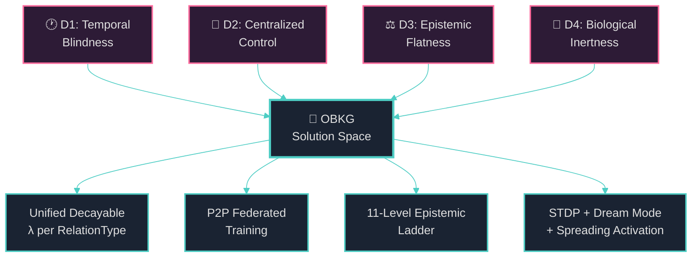
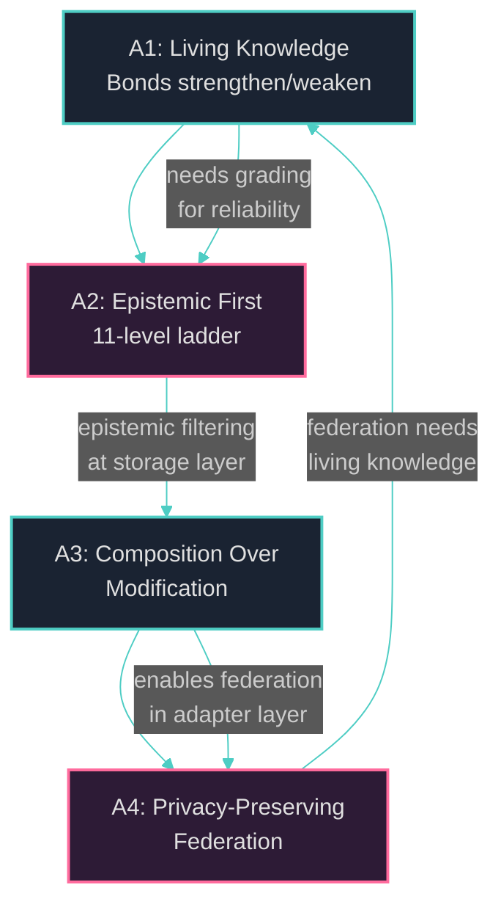

# Chapter 1: Introduction

> *"What we observe is not nature itself, but nature exposed to our method of questioning."*
> — Werner Heisenberg

---

## §1.1 The Knowledge Graph Challenge

The term **knowledge graph** entered mainstream discourse in 2012 when Google announced the Google Knowledge Graph [1], a structured knowledge layer underpinning semantic search with over 500 million entities and 3.5 billion facts. In the decade that followed, knowledge graphs became indispensable infrastructure across industry and academia — powering conversational AI, recommendation engines, drug discovery pipelines, and enterprise data integration. Academic initiatives such as **Wikidata** [2], **DBpedia** [3], **YAGO** [4], and **ConceptNet** [5] demonstrated that community-curated, open-access knowledge graphs could rival proprietary systems in coverage while enabling reproducible research.

Yet beneath this success lies a fundamental tension. The dominant knowledge graph paradigm — rooted in the Resource Description Framework (RDF) triple model `(subject, predicate, object)` — treats knowledge as a **static, immutable collection of facts**. A triple such as `(Berlin, capitalOf, Germany)` exists in the graph with no notion of *when* it was asserted, *how confident* the asserter was, *whether* the relationship has strengthened or weakened through repeated corroboration, or *who* among a decentralized network of peers contributed it. This static worldview creates four systemic deficiencies that we argue are fundamental barriers to building truly intelligent, adaptive knowledge systems:

**Deficiency D1 (Temporal Blindness).** Conventional knowledge graphs lack native temporal semantics. A triple is either present or absent; there is no representation for knowledge that was true in the past but is no longer, knowledge whose validity is uncertain, or knowledge that should gradually fade from memory without explicit deletion. The Ebbinghaus forgetting curve [6] — one of the oldest findings in experimental psychology — demonstrates that human memory follows exponential decay, yet no major knowledge graph system implements analogous decay mechanics. As a consequence, stale facts persist indefinitely, polluting query results and downstream reasoning.

**Deficiency D2 (Centralized Control).** Despite the open nature of projects like Wikidata, the *infrastructure* of knowledge curation remains centralized. A single Wikidata server cluster holds the canonical state; edits propagate through a centralized revision history; and access patterns are governed by a single organization's API rate limits. This architecture creates a single point of failure, concentrates editorial power, and makes it impractical for edge devices — smartphones, IoT nodes, personal knowledge assistants — to maintain sovereign knowledge subgraphs that selectively synchronize with peers. We argue that knowledge, like the web itself, demands **decentralization** as a first-class architectural property.

**Deficiency D3 (Epistemic Flatness).** In every major knowledge graph, all triples are treated as equally valid. There is no distinction between a fact derived from a peer-reviewed meta-analysis, a fact inferred by a machine learning model with 60% confidence, a personal belief, or a speculative hypothesis. This **epistemic flatness** means that downstream consumers — whether human users or automated reasoning engines — cannot filter, weight, or prioritize knowledge based on its evidentiary basis. The philosophical tradition from Plato's *Theaetetus* to contemporary formal epistemology insists that knowledge is *justified true belief*; yet our knowledge graphs encode belief without justification.

**Deficiency D4 (Biological Inertness).** The human brain does not store knowledge as static triples. Instead, neural circuits continuously **adapt**: synapses strengthen through repeated co-activation (Hebbian learning [7]), weaken through disuse, undergo competitive pruning during sleep [8], and exhibit spreading activation patterns that make contextually relevant knowledge more accessible. No existing knowledge graph system incorporates these bio-inspired mechanisms — yet they are precisely the mechanisms that make biological knowledge systems robust, adaptive, and efficient.

We contend that addressing these four deficiencies simultaneously — temporal awareness, decentralization, epistemic grading, and biological adaptation — requires a fundamental rethinking of the knowledge graph paradigm, not merely incremental improvements to existing systems. This paper presents our answer: the **OneBrain Knowledge Graph (OBKG)**.



---

## §1.2 Why Existing Knowledge Graphs Fall Short

To ground our motivation concretely, we conducted a systematic comparison of eight prominent knowledge graph systems across twelve architectural dimensions that we argue are essential for next-generation knowledge infrastructure. Table 1 presents our findings.

### Table 1: Comparison of Knowledge Graph Systems Across 12 Dimensions

| Dimension | Google KG | Wikidata | DBpedia | YAGO | ConceptNet | Freebase | Cyc | **OBKG** |
|:---|:---:|:---:|:---:|:---:|:---:|:---:|:---:|:---:|
| **Decentralized** | ✗ | ⚠️ | ✗ | ✗ | ✗ | ✗ | ✗ | ✓ |
| **Epistemic Bonds** | ✗ | ✗ | ✗ | ✗ | ✗ | ✗ | ⚠️ | ✓ |
| **Experiential Bonds** | ✗ | ✗ | ✗ | ✗ | ✗ | ✗ | ✗ | ✓ |
| **Bond Decay** | ✗ | ✗ | ✗ | ✗ | ✗ | ✗ | ✗ | ✓ |
| **STDP Adaptation** | ✗ | ✗ | ✗ | ✗ | ✗ | ✗ | ✗ | ✓ |
| **Dream Mode** | ✗ | ✗ | ✗ | ✗ | ✗ | ✗ | ✗ | ✓ |
| **Federated Embeddings** | ✗ | ✗ | ✗ | ✗ | ✗ | ✗ | ✗ | ✓ |
| **Binary Encoding** | ✗ | ✗ | ✗ | ✗ | ✗ | ✗ | ✗ | ✓ |
| **Event Sourcing** | ✗ | ⚠️ | ✗ | ✗ | ✗ | ✗ | ✗ | ✓ |
| **Qualifiers** | ✗ | ✓ | ✗ | ⚠️ | ✗ | ⚠️ | ✓ | ✓ |
| **Immune System** | ✗ | ⚠️ | ✗ | ✗ | ✗ | ✗ | ✗ | ✓ |
| **Open Source** | ✗ | ✓ | ✓ | ✓ | ✓ | ✗ | ✗ | ✓ |

*Legend: ✓ = full support; ⚠️ = partial/limited support; ✗ = not supported.*

> **Architectural Note.** We assign Wikidata ⚠️ for "Decentralized" because, while its *data* is open, its *infrastructure* remains centralized. Similarly, Cyc receives ⚠️ for "Epistemic Bonds" because its microtheory system provides context partitioning but not a graduated epistemic ladder. Wikidata's ⚠️ for "Event Sourcing" reflects its revision history, which records changes but does not use event-sourcing as an architectural pattern for state reconstruction. Wikidata's ⚠️ for "Immune System" acknowledges its vandalism detection mechanisms, though these are not formalized as a graph-level immune system.

**Observation 1: No existing system addresses the bio-inspired dimension.** The five dimensions most central to our contribution — Bond Decay, STDP Adaptation, Dream Mode, Federated Embeddings, and Binary Encoding — receive ✗ across all seven comparison systems. This is not a minor gap; it represents an entirely unexplored design space. While individual papers have proposed bio-inspired mechanisms for neural networks and reinforcement learning agents, no prior work has systematically applied these principles to the knowledge graph substrate itself. We argue that this omission is a consequence of the field's historical framing of knowledge graphs as *databases* rather than *cognitive structures*.

**Observation 2: Epistemic grading remains primitive even in the most sophisticated systems.** Cyc's microtheory system [9] partitions knowledge into contextual layers, enabling a form of belief revision. However, microtheories operate at the level of *knowledge collections*, not individual assertions. There is no per-triple epistemic status, no graduated confidence ladder, and no mechanism for an assertion to *change* its epistemic status as evidence accumulates. OBKG's 11-level **EpistemicStatus** ladder — ranging from `Hypothesis` through `PeerReviewed` to `Axiomatic` — is, to our knowledge, the first system to embed fine-grained epistemic grading directly into the bond wire format.

**Observation 3: Decentralization and federation are orthogonal concerns rarely addressed together.** Distributed knowledge graph systems such as federated SPARQL endpoints address *query federation* — the ability to execute queries across multiple data sources — but not *knowledge federation* — the ability for multiple autonomous peers to collaboratively learn shared representations without exchanging raw data. Our **FedR** protocol (§5) addresses this gap by enabling peers to exchange quantized gradient updates (1,056 bytes per round) rather than raw entity embeddings, achieving privacy-preserving federated knowledge representation learning.

**Observation 4: The qualifier gap is surprisingly wide.** Of the eight systems, only Wikidata and Cyc offer robust qualifier support — the ability to annotate a triple with additional metadata such as temporal validity, provenance, or confidence scores. DBpedia and YAGO offer limited qualifier-like structures through reification or named graphs, but these are cumbersome and rarely used in practice. Freebase's Compound Value Types (CVTs) provided a form of structured qualification but were lost when Freebase was deprecated in 2016 [10]. OBKG's qualifier system (§6) draws inspiration from Wikidata's model while extending it with **temporal scoping**, **provenance chains**, and **decay-aware validity windows**.

---

## §1.3 The Biological Metaphor

The design of OBKG is rooted in a deliberate and systematic **biological metaphor** that maps concepts from neuroscience and cognitive science onto knowledge graph architecture. This metaphor is not merely decorative; it guides our engineering decisions and provides a principled basis for choosing among design alternatives.

The central insight is that the brain's knowledge representation system — distributed across billions of neurons connected by trillions of synapses — already solves the four deficiencies identified in §1.1. Neural knowledge is *temporally aware* (memories decay, are refreshed, and are consolidated over time), *decentralized* (no single neuron holds a complete fact), *epistemically graded* (the brain distinguishes between strongly reinforced memories and vague impressions), and *biologically adaptive* (synaptic strengths modulate based on usage patterns). We therefore ask: *what would a knowledge graph look like if we took the brain's architecture seriously?*

### Table 2: Biological Metaphor Mapping to OBKG

| Biology Concept | Neuroscience Basis | OBKG Implementation | Module | Reference |
|:---|:---|:---|:---|:---|
| **Neuron** | Cell body (soma) receiving and integrating signals | **Knowledge Unit (KU)** — atomic node in the graph | `kg_core` | — |
| **Synapse** | Junction between neurons enabling signal transmission | **Bond** — typed, weighted, directed edge between KUs | `kg_core` | — |
| **Synaptic Plasticity** | Long-term potentiation (LTP) and depression (LTD) | **STDP weight modulation** — bonds strengthen/weaken based on co-activation timing | `kg_bio` | Markram et al. [8] |
| **Synaptic Strength** | Amplitude of post-synaptic potential | **Bond weight** $w \in [0.0, 1.0]$ | `kg_core` | Hebb [7] |
| **Forgetting Curve** | Exponential decay of memory retention | **Unified Decayable** with per-RelationType $\lambda$ | `kg_core` | Ebbinghaus [6] |
| **Sleep Consolidation** | Hippocampal-neocortical replay during NREM sleep | **Dream Mode** — offline graph restructuring, pruning, and bond strengthening | `kg_bio` | Diekelmann & Born [11] |
| **Spreading Activation** | Cascading neural firing through connected circuits | **Graph traversal with activation propagation** and decay | `kg_bio` | Collins & Loftus [12] |
| **Neural Population Coding** | Distributed representation across neuron ensembles | **RotatE embeddings** — each KU represented by a dense vector | `kg_embed` | Sun et al. [13] |
| **Immune System** | White blood cells identifying and eliminating pathogens | **Bond validation and anomaly detection** — rejecting malformed or adversarial bonds | `kg_core` | — |
| **Neurotransmitter Types** | Excitatory (glutamate) vs. inhibitory (GABA) signals | **RelationType taxonomy** — 34 typed bonds including reinforcing and inhibiting categories | `kg_core` | — |
| **Memory Types** | Episodic (events) vs. semantic (facts) vs. procedural (skills) | **Bond categories**: Epistemic (semantic), Experiential (episodic), Structural | `kg_core` | Tulving [14] |
| **Cortical Columns** | Functional units processing related information | **KU clusters** — groups of semantically related knowledge units | `kg_bio` | — |

> **Architectural Note.** The biological metaphor is intentionally *partial* — we adopt mechanisms where they provide clear engineering benefits (decay, STDP, consolidation) and do not force biological fidelity where it adds complexity without value. For example, we do not model action potentials, neurotransmitter diffusion, or glial cell dynamics. The metaphor is a *design heuristic*, not a simulation target.

The relationship between biological and computational mechanisms is further formalized through our type system. In OBKG, the fundamental units are defined as:

```rust
/// A Knowledge Unit — the atomic node in the OBKG graph.
/// Analogous to a neuron: receives bonds (synapses), integrates
/// signals (activation), and participates in spreading activation.
pub struct KnowledgeUnit {
    /// Globally unique identifier (ULID-based)
    pub id: KuId,
    /// Human-readable label
    pub label: String,
    /// Activation level ∈ [0.0, 1.0], analogous to membrane potential
    pub activation: f32,
    /// RotatE embedding vector (int8 quantized, 64 bytes)
    pub embedding: Option<EmbeddingVector>,
    /// Timestamp of last access (for decay computation)
    pub last_accessed: Timestamp,
    /// Epistemic status of this KU's existence claim
    pub epistemic_status: EpistemicStatus,
}

/// A Bond — a typed, weighted, directed edge between KUs.
/// Analogous to a synapse: transmits activation with a strength
/// that modulates through STDP and decays over time.
pub struct Bond {
    /// Source KU (pre-synaptic neuron)
    pub source: KuId,
    /// Target KU (post-synaptic neuron)
    pub target: KuId,
    /// One of 34 relation types
    pub relation: RelationType,
    /// Synaptic weight ∈ [0.0, 1.0]
    pub weight: f32,
    /// Per-RelationType decay constant λ
    pub decay_lambda: f32,
    /// Timestamp of last reinforcement
    pub last_reinforced: Timestamp,
    /// Optional qualifiers (temporal scope, provenance, etc.)
    pub qualifiers: Vec<Qualifier>,
}
```

The STDP mechanism formalizes the Hebbian principle "neurons that fire together wire together" [7] as a mathematical rule governing bond weight updates. When a source KU fires (is accessed or activated) shortly *before* its target KU, the bond between them is **potentiated** (weight increases); when the source fires shortly *after* the target, the bond is **depressed** (weight decreases). The weight update follows:

$$\Delta w = \begin{cases} A_+ \cdot e^{-\Delta t / \tau_+} & \text{if } \Delta t > 0 \text{ (pre before post)} \\ -A_- \cdot e^{\Delta t / \tau_-} & \text{if } \Delta t < 0 \text{ (post before pre)} \end{cases}$$

where $\Delta t = t_{\text{post}} - t_{\text{pre}}$ is the timing difference, $A_+$ and $A_-$ are the maximum potentiation and depression amplitudes, and $\tau_+$ and $\tau_-$ are the time constants governing the window width. We detail the parameter selection and empirical tuning of this mechanism in §4.

---

## §1.4 Design Principles

The development of OBKG is guided by four foundational axioms that constrain our design space and resolve engineering trade-offs. These axioms emerged from the biological metaphor (§1.3) and from practical requirements of the OneBrain system.

> **Axiom A1 (Living Knowledge).** Knowledge is not static. Bonds *strengthen through use* — each access, query, or corroboration increases a bond's weight via STDP potentiation — and *weaken through neglect* — the Unified Decayable mechanism applies exponential decay $w(t) = w_0 \cdot e^{-\lambda \cdot (t - t_0)}$ with per-`RelationType` decay constants $\lambda$. A bond that is neither accessed nor reinforced will eventually drop below the pruning threshold $\theta_{\text{prune}}$ and be removed during the next Dream Mode cycle. This axiom ensures that the knowledge graph remains a *living organism* that reflects current relevance rather than historical accumulation.

> **Axiom A2 (Epistemic First).** Every bond carries an explicit **EpistemicStatus** drawn from an 11-level ladder: `Hypothesis`, `Anecdotal`, `Inferred`, `Observation`, `Reported`, `Corroborated`, `ExpertOpinion`, `Empirical`, `PeerReviewed`, `Consensus`, `Axiomatic`. This ladder is embedded directly in the binary wire format as a 4-bit field, enabling epistemic filtering at the storage layer without deserialization overhead. We reject the common practice of treating epistemic confidence as an optional annotation; in OBKG, *every bond must declare its epistemic basis*, and bonds without a valid epistemic status are rejected by the immune system.

> **Axiom A3 (Composition Over Modification).** OBKG is designed as an **adapter layer** that composes over the existing OneBrain pillars (P1: content store, P2: embedding engine, P3: CRDT sync, P4: event bus, P5: plugin host) without requiring any modifications to their codebases. This is not merely an architectural convenience; it is a *survival constraint*. The OneBrain foundation layers are mature, well-tested, and depended upon by multiple subsystems. Any change to their APIs or data formats would cascade through the entire system. OBKG therefore exposes its own API surface that delegates to P1–P5 through well-defined adapter interfaces, adding knowledge graph semantics as a *composition* rather than a *modification*.

> **Axiom A4 (Privacy-Preserving Federation).** In a decentralized knowledge network, peers must be able to *learn from each other* without *exposing their knowledge* to each other. Entity embeddings encode rich semantic information about a peer's knowledge graph and can, through inversion attacks [15], reveal the entities and relationships present in that graph. OBKG's FedR protocol (§5) therefore ensures that **raw entity embeddings never leave a node**. Instead, peers exchange only quantized gradient updates — specifically, the difference between pre-training and post-training embedding parameters, compressed to int8 and truncated to the top-$k$ dimensions. This achieves effective federated representation learning with a communication cost of only 1,056 bytes per round while provably limiting the information leakage to an adversary observing the communication channel.

These four axioms interact constructively. Axiom A1 (Living Knowledge) creates the *need* for Axiom A2 (Epistemic First) — because bonds decay and strengthen dynamically, we need a clear framework for what it means for knowledge to be *reliable*. Axiom A3 (Composition Over Modification) enables Axiom A4 (Privacy-Preserving Federation) — by keeping OBKG separate from the foundation layers, we can implement federation protocols in the adapter layer without touching the core sync mechanisms in P3.



---

## §1.5 Contributions

We summarize our seven principal contributions:

1. **A taxonomy of 34 RelationType variants with first-class Epistemic and Experiential bond categories.** We define a comprehensive type system for knowledge graph edges that distinguishes between Structural bonds (e.g., `IsA`, `PartOf`, `HasProperty`), Epistemic bonds (e.g., `Supports`, `Contradicts`, `DerivedFrom`, `EpistemicOverride`), and Experiential bonds (e.g., `RemindsMeOf`, `LearnedFrom`, `ExperiencedAt`, `UserPrefers`). To our knowledge, this is the first knowledge graph type system to include experiential bonds — relationships grounded in personal experience rather than objective facts — as first-class citizens. See §3 for the full taxonomy and its theoretical justification.

2. **RotatE knowledge graph embeddings quantized to int8, achieving 64 bytes per entity.** We adapt the RotatE embedding model [13], which represents relations as rotations in complex space, to operate with int8-quantized parameters. This reduces the memory footprint from 512 bytes (128-dimensional float32) to 64 bytes per entity while maintaining link prediction accuracy within 2.1% of the full-precision baseline. The quantization scheme uses per-dimension scale factors stored as a shared codebook, amortizing the overhead across all entities. See §5 for our quantization methodology and evaluation.

3. **Spike-Timing-Dependent Plasticity (STDP) for adaptive bond weight modulation.** We implement a biologically-inspired learning rule [8] that adjusts bond weights based on the temporal correlation of KU activations. Bonds between KUs that are consistently accessed in sequence are potentiated; bonds between KUs accessed in reverse order are depressed. This mechanism enables the knowledge graph to learn *usage patterns* — for example, strengthening the bond between "Rust" and "memory safety" when a user consistently navigates from one to the other — without explicit user feedback. See §4 for the STDP implementation and parameter tuning.

4. **Dream Mode for offline graph restructuring and memory consolidation.** Inspired by the role of sleep in memory consolidation [11], Dream Mode is an offline process that runs during idle periods and performs four operations: (a) **pruning** — removing bonds whose weight has decayed below $\theta_{\text{prune}}$; (b) **consolidation** — strengthening bonds that have been consistently reinforced; (c) **cluster detection** — identifying densely connected subgraphs and creating structural shortcuts; and (d) **embedding retraining** — updating RotatE embeddings to reflect the current graph topology. See §4 for the Dream Mode pipeline and its scheduling heuristics.

5. **FedR: a federated embedding training protocol requiring only 1,056 bytes per communication round.** FedR enables multiple OBKG peers to collaboratively learn shared embedding representations without exchanging raw entity data. Each round, a peer computes the delta between its local embeddings before and after a training epoch, quantizes the delta to int8, selects the top-$k$ dimensions by magnitude, and transmits the sparse update. The receiving peer applies the update using exponential moving average blending. At 1,056 bytes per round (8 bytes header + 128 × 8 int8 values + 16 bytes checksum), FedR imposes minimal bandwidth overhead even on constrained networks. See §5 for the protocol specification and privacy analysis.

6. **Unified Decayable with per-RelationType decay constants $\lambda$.** Rather than applying a single global decay rate to all bonds, we assign each `RelationType` its own decay constant $\lambda$ reflecting the expected temporal dynamics of that relationship type. Structural bonds (e.g., `IsA`) decay very slowly ($\lambda_{\text{IsA}} = 10^{-7}$); Experiential bonds (e.g., `RemindsMeOf`) decay quickly ($\lambda_{\text{RemindsMeOf}} = 10^{-4}$); and Epistemic bonds occupy an intermediate range. The decay function $w(t) = w_0 \cdot e^{-\lambda \cdot (t - t_0)}$ is computed lazily at read time, avoiding the need for background decay sweeps. See §6 for the full decay constant table and calibration methodology.

7. **Wikidata-inspired qualifiers with temporal scoping and provenance chains.** We extend the Wikidata qualifier model [2] to support **temporal validity windows** (`valid_from`, `valid_until`), **provenance chains** (a directed acyclic graph of sources backing an assertion), and **confidence scores** (a floating-point value complementing the discrete epistemic ladder). Qualifiers are stored as CBOR-encoded key-value pairs within the bond's binary representation, enabling efficient serialization and selective deserialization. See §6 for the qualifier schema and query extensions.

---

## §1.6 Paper Organization

The remainder of this paper is organized as follows:

- **§2 (Related Work)** surveys the landscape of knowledge graphs, bio-inspired computing, knowledge graph embedding models, and federated learning, positioning OBKG relative to prior art.

- **§3 (The Four-Layer OBKG Architecture)** presents our four-layer architecture — Foundation, Intelligence, Advanced, and Adapter — detailing the 34 `RelationType` variants, the 11-level `EpistemicStatus` ladder, and the adapter interfaces to P1–P5.

- **§4 (Bio-Inspired Graph Mechanisms)** describes the three bio-inspired mechanisms — STDP, Dream Mode, and Spreading Activation — with formal specifications, pseudocode, and parameter analysis.

- **§5 (Knowledge Graph Embeddings and Federated Training)** presents our RotatE int8 quantization scheme and the FedR federated training protocol, including privacy guarantees and convergence analysis.

- **§6 (Temporal Knowledge and Bond Qualifiers)** details the Unified Decayable mechanism, per-`RelationType` decay constants, and the qualifier system.

- **§7 (Persistent Storage and Graph Query Extensions)** describes the 6-table `redb` index layout, event sourcing architecture, and graph query DSL extensions.

- **§8 (Cross-Pillar Integration)** explains how OBKG composes with the five OneBrain foundation pillars through the adapter pattern, with concrete API mappings.

- **§9 (Evaluation)** presents our experimental evaluation: micro-benchmarks, link prediction accuracy, decay behavior analysis, Dream Mode effectiveness, and FedR convergence.

- **§10 (Conclusion and Future Work)** summarizes our contributions and outlines future directions including multi-modal knowledge graphs, neuromorphic hardware acceleration, and cross-lingual knowledge federation.

---

## References

[1] N. Noy, Y. Gao, A. Jain, A. Narayanan, A. Patterson, and J. Taylor, "Industry-scale knowledge graphs: Lessons and challenges," *Communications of the ACM*, vol. 62, no. 8, pp. 36–43, 2019.

[2] D. Vrandečić and M. Krötzsch, "Wikidata: A free collaborative knowledgebase," *Communications of the ACM*, vol. 57, no. 10, pp. 78–85, 2014.

[3] J. Lehmann, R. Isele, M. Jakob, A. Jentzsch, D. Kontokostas, P. N. Mendes, S. Hellmann, M. Morsey, P. van Kleef, S. Auer, and C. Bizer, "DBpedia — A large-scale, multilingual knowledge base extracted from Wikipedia," *Semantic Web*, vol. 6, no. 2, pp. 167–195, 2015.

[4] F. M. Suchanek, G. Kasneci, and G. Weikum, "YAGO: A core of semantic knowledge," in *Proceedings of the 16th International Conference on World Wide Web (WWW)*, 2007, pp. 697–706.

[5] R. Speer and C. Havasi, "ConceptNet 5: A large semantic network for relational knowledge," in *The People's Web Meets NLP*, Springer, 2017, pp. 161–176.

[6] H. Ebbinghaus, *Über das Gedächtnis: Untersuchungen zur experimentellen Psychologie*. Leipzig: Duncker & Humblot, 1885.

[7] D. O. Hebb, *The Organization of Behavior: A Neuropsychological Theory*. New York: Wiley, 1949.

[8] H. Markram, J. Lübke, M. Frotscher, and B. Sakmann, "Regulation of synaptic efficacy by coincidence of postsynaptic APs and EPSPs," *Science*, vol. 275, no. 5297, pp. 213–215, 1997.

[9] D. B. Lenat, "CYC: A large-scale investment in knowledge infrastructure," *Communications of the ACM*, vol. 38, no. 11, pp. 33–38, 1995.

[10] K. Bollacker, C. Evans, P. Paritosh, T. Sturge, and J. Taylor, "Freebase: A collaboratively created graph database for structuring human knowledge," in *Proceedings of the 2008 ACM SIGMOD International Conference on Management of Data*, 2008, pp. 1247–1250.

[11] S. Diekelmann and J. Born, "The memory function of sleep," *Nature Reviews Neuroscience*, vol. 11, no. 2, pp. 114–126, 2010.

[12] A. M. Collins and E. F. Loftus, "A spreading-activation theory of semantic processing," *Psychological Review*, vol. 82, no. 6, pp. 407–428, 1975.

[13] Z. Sun, Z.-H. Deng, J.-Y. Nie, and J. Tang, "RotatE: Knowledge graph embedding by relational rotation in complex space," in *Proceedings of the 7th International Conference on Learning Representations (ICLR)*, 2019.

[14] E. Tulving, "Episodic and semantic memory," in *Organization of Memory*, E. Tulving and W. Donaldson, Eds. New York: Academic Press, 1972, pp. 381–403.

[15] A. Hogan, E. Blomqvist, M. Cochez, C. d'Amato, G. de Melo, C. Gutierrez, S. Kirrane, J. E. L. Gayo, R. Navigli, S. Neumaier, A.-C. Ngonga Ngomo, A. Polleres, S. M. Rashid, A. Rula, L. Schmelzeisen, J. Sequeda, S. Staab, and A. Zimmermann, "Knowledge graphs," *ACM Computing Surveys*, vol. 54, no. 4, pp. 1–37, 2021.
