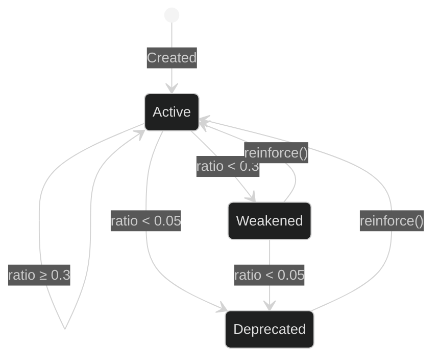

> *"Architecture is the thoughtful making of space." — Louis Kahn*

# 3. The Four-Layer OBKG Architecture

The preceding chapters established **why** a bio-inspired knowledge graph is needed (§1) and **where** it sits in the research landscape (§2). We now turn to **how** the OneBrain Knowledge Graph (OBKG) is built. This chapter presents the four-layer architecture that organises thirteen modules into a cohesive system capable of continuous learning, graceful forgetting, and federated collaboration. We detail the Foundation Layer — the load-bearing substrate on which every higher-level mechanism rests — and provide architectural previews of the Intelligence, Advanced, and Adapter layers that subsequent chapters expand.

---

## §3.1 Design Principles

Four principles govern every design decision in the OBKG:

| # | Principle | Rationale | Manifestation |
|---|-----------|-----------|---------------|
| **P1** | **Adapter Pattern** | External systems change faster than core graph logic; adapters isolate churn. | The Adapter Layer (§3.6) wraps LLM providers, reward signals, and gossip protocols behind stable trait interfaces. |
| **P2** | **Event Sourcing** | Immutable event logs enable audit, replay, and time-travel debugging. | `BondEvent` (§3.3.1) and the `EventAccumulator` (§3.3.2) capture every bond mutation as a CBOR-serialised event. |
| **P3** | **Bio-Inspired Metaphors** | Neural plasticity offers proven strategies for balancing memory retention and novelty. | Exponential decay (§3.3.1), STDP-style reinforcement (§4), and sleep-cycle consolidation (§6) directly model synaptic dynamics. |
| **P4** | **Composition Over Modification** | Adding capabilities must not require editing core types. | Feature-gated modules (`#[cfg(feature = "...")]`) compose atop the Foundation Layer without altering `graph_types.rs`. |

These principles collectively yield a system that is **auditable** (P2), **extensible** (P1, P4), and **biologically plausible** (P3).

---

## §3.2 Architecture Overview

The OBKG comprises four layers, each encapsulating a distinct level of abstraction. The following diagram shows the complete module inventory and the data-flow dependencies between them.

```mermaid
%%{init: {'theme': 'dark', 'themeVariables': {'primaryColor': '#1a1a2e', 'primaryTextColor': '#e0e0e0', 'primaryBorderColor': '#0f3460', 'lineColor': '#e94560', 'secondaryColor': '#16213e', 'tertiaryColor': '#0f3460', 'fontSize': '14px'}}}%%
graph TB
    subgraph Adapter["🔌 Adapter Layer"]
        direction LR
        A1["Bridge<br/><i>llm_bridge</i>"]
        A2["Orchestrator<br/><i>orchestrator</i>"]
        A3["Rewards<br/><i>reward_signals</i>"]
        A4["Gossip<br/><i>gossip_protocol</i>"]
    end

    subgraph Advanced["⚡ Advanced Layer"]
        direction LR
        B1["Dream Mode<br/><i>dream_consolidation</i>"]
        B2["FedR<br/><i>federated_rotate</i>"]
        B3["Qualifiers<br/><i>graph_qualifiers</i>"]
    end

    subgraph Intelligence["🧠 Intelligence Layer"]
        direction LR
        C1["RotatE Embeddings<br/><i>graph_embeddings</i>"]
        C2["Bio Mechanisms<br/><i>stdp / consolidation /<br/>spreading_activation</i>"]
    end

    subgraph Foundation["🏗️ Foundation Layer"]
        direction LR
        D1["Graph Types<br/><i>graph_types</i>"]
        D2["Event Accumulator<br/><i>graph_events</i>"]
        D3["Decay Runner<br/><i>graph_decay</i>"]
        D4["Persistent Index<br/><i>graph_storage</i>"]
    end

    A1 --> B1
    A2 --> C2
    A3 --> C2
    A4 --> B2
    B1 --> C1
    B1 --> C2
    B2 --> C1
    B3 --> D1
    C1 --> D1
    C2 --> D3
    C2 --> D2
    D3 --> D1
    D2 --> D1
    D4 --> D1

    style Adapter fill:#1a1a2e,stroke:#e94560,stroke-width:2px
    style Advanced fill:#16213e,stroke:#0f3460,stroke-width:2px
    style Intelligence fill:#1a1a2e,stroke:#e94560,stroke-width:2px
    style Foundation fill:#16213e,stroke:#0f3460,stroke-width:2px
```



**Table 3.1 — Module Inventory**

| Phase | Module | Source File | LOC | Tests | Key Types / Functions |
|-------|--------|-------------|-----|-------|-----------------------|
| Foundation | Graph Types | `graph_types.rs` | 759 | 16 | `BondMeta`, `BondEvent`, `Decayable`, `decay_lambda` |
| Foundation | Event Accumulator | `graph_events.rs` | 480 | 23 | `EventAccumulator`, `replay_at_time`, `compact` |
| Foundation | Decay Runner | `graph_decay.rs` | 461 | 16 | `DecayRunner`, `DecayReport`, `reinforce` |
| Foundation | Persistent Index | `graph_storage.rs` | 1289 | 27 | `GraphStorage`, 6 index tables, prefix-scan queries |
| Intelligence | RotatE Embeddings | `graph_embeddings.rs` | 645 | 12 | `EntityEmbedding`, `RelationEmbedding`, `rotate_score` |
| Intelligence | STDP | `graph_stdp.rs` | — | — | Spike-timing-dependent plasticity |
| Intelligence | Consolidation | `graph_consolidation.rs` | — | — | Memory consolidation cycles |
| Intelligence | Spreading Activation | `graph_spreading.rs` | — | — | Activation propagation |
| Advanced | Dream Mode | `dream_consolidation.rs` | — | — | Off-line consolidation sweeps |
| Advanced | FedR | `federated_rotate.rs` | — | — | Federated RotatE training |
| Advanced | Qualifiers | `graph_qualifiers.rs` | — | — | Hyper-relational qualifiers |
| Adapter | Bridge | `llm_bridge.rs` | — | — | LLM provider adapters |
| Adapter | Orchestrator | `orchestrator.rs` | — | — | Pipeline coordination |

> [!NOTE]
> LOC and test counts for Intelligence, Advanced, and Adapter modules are omitted — these modules are detailed in §4–§8 as they are developed across subsequent phases.

---

## §3.3 Foundation Layer

The Foundation Layer is OBKG's bedrock. It defines the **data model**, the **event log**, the **decay engine**, and the **persistent storage**. Every higher layer depends exclusively on types and traits exported from this layer.

### §3.3.1 Graph Types (`graph_types.rs`)

The `graph_types` module defines the core domain types that every other module imports. Three constructs deserve particular attention.

#### BondMeta — The 9-Byte Edge Record

Every edge in the OBKG is stored as a **BondMeta**: a fixed-size, 9-byte, big-endian struct that packs five fields into a cache-line-friendly format:

```rust
/// Compact bond metadata for index/lookup tables.
///
/// Layout (9 bytes, big-endian):
/// ```text
/// [weight:2][creator:1][state:1][decay:1][timestamp:4]
/// ```
#[derive(Debug, Clone, Copy, PartialEq, Eq, Serialize, Deserialize)]
pub struct BondMeta {
    pub weight: u16,        // 0..10_000 bond strength
    pub creator: Creator,   // Human | Ai | System | Hybrid
    pub state: EdgeState,   // Active | Weakened | Deprecated
    pub decay: DecayRate,   // None | Slow | Med | Fast
    pub timestamp: u32,     // Unix seconds (last reinforced)
}
```

The 9-byte encoding `[weight:2][creator:1][state:1][decay:1][timestamp:4]` enables zerocopy serialisation into redb index values. At 9 bytes per edge, one million bonds consume only **8.6 MB** of value storage — before accounting for key overhead.

#### BondEvent — Event-Sourced Mutations

Every state change on a bond is captured as an immutable **BondEvent**, enabling full audit trails and time-travel replay. The enum has four variants:

```rust
pub enum BondEvent {
    Created {
        source_cid: [u8; 32], target_cid: [u8; 32],
        relation: RelationType, weight: u16,
        creator: Creator, evidence: Vec<Vec<u8>>,
        timestamp: u64,
    },
    Reinforced {
        source_cid: [u8; 32], target_cid: [u8; 32],
        relation: RelationType,
        old_weight: u16, new_weight: u16,
        timestamp: u64,
    },
    Weakened {
        source_cid: [u8; 32], target_cid: [u8; 32],
        relation: RelationType,
        old_weight: u16, new_weight: u16,
        reason: WeakeningReason,
        timestamp: u64,
    },
    StateChanged {
        source_cid: [u8; 32], target_cid: [u8; 32],
        relation: RelationType,
        old_state: EdgeState, new_state: EdgeState,
        timestamp: u64,
    },
}
```

Events are serialised with **CBOR** (Concise Binary Object Representation) via the `ciborium` crate [1], chosen for its compact wire format and schema-evolution friendliness over JSON or Bincode.

The `WeakeningReason` enum distinguishes five causes of bond weakening — `Decay`, `Contradiction`, `LowEngagement`, `ImmuneResponse`, and `ManualOverride` — enabling downstream analytics to separate natural forgetting from active pruning.

#### The Decayable Trait — Exponential Forgetting

The `Decayable` trait provides a default exponential-decay implementation shared by both `Bond` and `BondMeta`:

$$w(t) = w_0 \cdot e^{-\lambda \cdot \Delta t \,/\, 86400}$$

where $w_0$ is the base weight, $\lambda$ is the per-day decay rate, and $\Delta t$ is elapsed seconds since the last reinforcement. The formula includes a configurable **grace period** (during which no decay is applied) and a **weight floor** (below which the weight is clamped):

```rust
pub trait Decayable {
    fn decay_rate(&self) -> f64;           // λ per day
    fn last_reinforced_secs(&self) -> u64;
    fn grace_period_secs(&self) -> f64 { 0.0 }
    fn floor(&self) -> f64 { 0.0 }

    fn effective_weight(&self, base_weight: f64, now_secs: u64) -> f64 {
        let elapsed = (now_secs.saturating_sub(self.last_reinforced_secs())) as f64;
        if elapsed < self.grace_period_secs() { return base_weight; }
        let lambda = self.decay_rate();
        if lambda == 0.0 { return base_weight; }
        let decayed = base_weight * (-lambda * elapsed / 86400.0).exp();
        decayed.max(self.floor())
    }
}
```

The `decay_lambda()` function maps all 34 `RelationType` variants to one of four decay tiers:

**Table 3.2 — Decay Rate Tiers**

| Tier | λ | Half-Life | Relations | Count |
|------|---|-----------|-----------|-------|
| **Immune** (λ = 0.0) | 0.0 | ∞ | `PartOf`, `InstanceOf`, `Specializes`, `Generalizes`, `Precedes`, `Cooccurs`, `Cites`, `AuthoredBy`, `ReviewedBy`, `Duplicates`, `Supersedes`, `FormallyProves` | 12 |
| **Slow** (λ = 0.0019) | 0.0019 | ~365 days | `Extends`, `Corroborates`, `Causes`, `Enables`, `Prevents`, `DependsOn`, `AppliesTo`, `DerivedFrom`, `Translates`, `Paraphrases`, `EvolvesInto`, `VariantOf` | 12 |
| **Medium** (λ = 0.0077) | 0.0077 | ~90 days | `Supplements`, `Refutes`, `Qualifies`, `ExampleOf`, `AnalogyOf`, `Inspires`, `TestimonyAbout`, `CulturallyContextualizes` | 8 |
| **Fast** (λ = 0.099) | 0.099 | ~7 days | `ReactionTo`, `SensoryEvidenceFor` | 2 |

> [!IMPORTANT]
> **Design rationale**: Structural and provenance relations (Tier 0) **never decay** — a "PartOf" relationship is a definitional fact. Experiential relations (Tier 3) decay rapidly because sensory impressions and emotional reactions lose salience quickly, mirroring the **Ebbinghaus forgetting curve** [2]. Epistemic relations (Tier 1) decay slowly because causal knowledge, once established, typically persists. This tiered approach ensures the graph's topology remains stable while its experiential edges are continuously refreshed.

---

### §3.3.2 Event Accumulator (`graph_events.rs`)

The **EventAccumulator** is an append-only, in-memory event store with monotonically increasing sequence numbers:

```rust
pub struct EventAccumulator {
    events: Vec<BondEvent>,
    next_seq: u64,
}
```

Key operations:

| Operation | Complexity | Description |
|-----------|------------|-------------|
| `append(event)` | $O(1)$ amortised | Append event, return assigned sequence number |
| `events_range(from, to)` | $O(1)$ | Slice by sequence number range |
| `events_for_ku(cid)` | $O(n)$ | Filter events involving a specific KU |
| `events_in_time_range(from, to)` | $O(n)$ | Filter by timestamp window |
| `replay_at_time(target_time)` | $O(n)$ | Reconstruct all bond snapshots at a point in time |
| `compact(cutoff)` | $O(n)$ | Remove events older than cutoff, return `CompactionReport` |

The `replay_at_time` function deserves special note. It iterates all events, applying `Created`, `Reinforced`, `Weakened`, and `StateChanged` mutations in order, but **skips** (via `continue`, not `break`) any event whose timestamp exceeds the target. This handles out-of-order events correctly — a deliberate design choice documented in the source as "OBKG Fix L1". The function returns a `Vec<BondSnapshot>` representing the materialised state of every bond at the requested timestamp.

**Compaction** removes events with timestamps ≤ a cutoff, returning a `CompactionReport`:

```rust
pub struct CompactionReport {
    pub snapshot_seq: u64,        // Snapshot sequence number
    pub events_removed: u64,      // Events collapsed
    pub events_retained: u64,     // Post-snapshot events kept
    pub snapshot_size_bytes: u64,  // Estimated snapshot size
}
```

This mechanism bounds the accumulator's memory footprint while preserving recent history for replay.

---

### §3.3.3 Decay Runner (`graph_decay.rs`)

The **DecayRunner** translates the `Decayable` trait into batch operations across the entire graph. It implements a **"River, Not Lake"** philosophy: knowledge that flows (is accessed, cited, reinforced) stays strong; knowledge that stagnates naturally weakens.

Two threshold constants govern state transitions:

```rust
pub const WEAKEN_THRESHOLD: f64 = 0.3;      // below 30% → Weakened
pub const DEPRECATE_THRESHOLD: f64 = 0.05;  // below 5%  → Deprecated
```

The state machine for bond lifecycle is:



The `run_decay` function processes a batch of bonds at a given timestamp:

1. For each bond, compute the **ratio** = `effective_weight / base_weight`.
2. If $\lambda = 0$ (immune tier), skip.
3. If `Active` and ratio < 0.05, transition directly to `Deprecated` (bypassing `Weakened`).
4. If `Active` and ratio < 0.3, emit a `BondEvent::Weakened`.
5. If `Weakened` and ratio < 0.05, emit a `BondEvent::StateChanged` → `Deprecated`.

The runner is **side-effect-free**: it returns a `DecayReport` containing generated events, but does **not** modify bonds directly. The caller applies the events to storage, maintaining the event-sourcing invariant (P2).

**Reinforcement** is capped at a maximum weight of **10,000**:

```rust
pub fn reinforce(/* ... */, boost: u16, /* ... */) -> BondEvent {
    let new_weight = bond.weight.saturating_add(boost).min(10000);
    BondEvent::Reinforced { /* ... */ }
}
```

This cap prevents runaway reinforcement loops while preserving a wide dynamic range (0–10,000) for weight discrimination.

---

### §3.3.4 Six-Table Persistent Index (`graph_storage.rs`)

The `GraphStorage` module provides durable, ACID-compliant edge storage using **redb** [3], an embedded key-value store written in pure Rust. Six tables implement a **composite-key design** that supports O(1) prefix-scan queries for all common access patterns.

**Table 3.3 — Six-Table Index Schema**

| Table | Key Layout | Key Size | Value | Purpose |
|-------|-----------|----------|-------|---------|
| `edges_out` | `src(32) + rel(1) + tgt(32)` | 65 B | `BondMeta(9B)` | Primary forward index: all outgoing edges from a source |
| `edges_in` | `tgt(32) + rel(1) + src(32)` | 65 B | ∅ | Reverse index: all incoming edges to a target |
| `edges_type` | `rel(1) + src(32) + tgt(32)` | 65 B | ∅ | Type index: all edges of a given relation type |
| `index_state` | `state(1) + src(32) + rel(1) + tgt(32)` | 66 B | ∅ | State index: all edges in a given lifecycle state |
| `bond_weight` | `weight(2BE) + src(32) + tgt(32) + rel(1)` | 67 B | ∅ | Weight-ordered index for top-k queries |
| `edge_time` | `ts(4BE) + src(32) + tgt(32) + rel(1)` | 69 B | ∅ | Temporal index: range queries by timestamp |

> [!TIP]
> Only `edges_out` stores a value (`BondMeta`, 9 bytes). The remaining five tables are **key-only** secondary indices — their existence in the B-tree is sufficient for prefix-scan membership queries. This minimises write amplification and storage overhead.

**Key design decisions:**

1. **Prefix-scan design.** All keys are constructed so that the most-queried field comes first. For example, `edges_out` starts with the 32-byte source CID, enabling `outgoing_bonds(src)` via a single prefix scan over `src[0..32]`. Similarly, `outgoing_by_type(src, rel)` uses a 33-byte prefix `src(32) + rel(1)`.

2. **Big-endian numeric fields.** Weight and timestamp fields use big-endian encoding so that lexicographic key ordering matches numeric ordering — critical for range scans in `bonds_in_time_range(from, to)`.

3. **Atomic multi-table updates.** Every `insert_bond` and `remove_bond` operation wraps all six table mutations in a single redb write transaction. On upsert, old secondary-index entries are read from `edges_out` and removed before inserting new ones — all within the same transaction.

4. **Feature-gated compilation.** The entire `GraphStorage` implementation is gated behind `#[cfg(feature = "storage")]`, allowing `ku-core` to be compiled without the redb dependency for lightweight testing and WASM targets.

The insert path illustrates the atomic multi-table update pattern:

```rust
pub fn insert_bond(
    &self, src: &[u8; 32], tgt: &[u8; 32],
    rel: RelationType, meta: &BondMeta,
) -> Result<(), StorageError> {
    let txn = self.db.begin_write()?;
    {
        // Read old meta from edges_out (if exists) to remove stale indices
        let mut out_table = txn.open_table(TABLE_EDGES_OUT)?;
        if let Some(old_guard) = out_table.get(out_key.as_slice())? {
            let old_meta = BondMeta::from_bytes(/* ... */);
            // Remove old weight, time, and state index entries
            txn.open_table(TABLE_BOND_WEIGHT)?.remove(old_wk)?;
            txn.open_table(TABLE_EDGE_TIME)?.remove(old_tk)?;
            txn.open_table(TABLE_INDEX_STATE)?.remove(old_sk)?;
        }
        // Insert into all 6 tables
        out_table.insert(out_key, meta_bytes)?;
        txn.open_table(TABLE_EDGES_IN)?.insert(in_key, &[])?;
        txn.open_table(TABLE_EDGES_TYPE)?.insert(type_key, &[])?;
        txn.open_table(TABLE_INDEX_STATE)?.insert(state_key, &[])?;
        txn.open_table(TABLE_BOND_WEIGHT)?.insert(weight_key, &[])?;
        txn.open_table(TABLE_EDGE_TIME)?.insert(time_key, &[])?;
    }
    txn.commit()?;
    Ok(())
}
```

At scale, the six-table design supports the following query patterns with predictable performance:

| Query | Table(s) | Access Pattern |
|-------|----------|----------------|
| Outgoing edges from node | `edges_out` | Prefix scan on `src[0..32]` |
| Outgoing edges by type | `edges_out` | Prefix scan on `src(32)+rel(1)` |
| Incoming edges to node | `edges_in` | Prefix scan on `tgt[0..32]` |
| All edges of a relation type | `edges_type` | Prefix scan on `rel[0]` |
| Edges in a lifecycle state | `index_state` | Prefix scan on `state[0]` |
| Edges in a time range | `edge_time` | Range scan on `ts[0..4]` |
| Top-k strongest edges | `bond_weight` | Reverse range scan on `weight[0..2]` |
| Aggregate statistics | `edges_out` | Full table scan |

---

## §3.4 Intelligence Layer

The Intelligence Layer adds **geometric reasoning** and **bio-inspired plasticity** atop the Foundation.

### §3.4.1 RotatE Int8 Embeddings (detail in §5)

We implement **RotatE** (Sun et al., 2019) [4] with int8 quantization. Each entity is a 64-dimensional vector (32 complex dimensions) consuming only **70 bytes** (64 values + 6 metadata):

```rust
pub struct EntityEmbedding {
    pub values: [i8; 64],   // 32 complex dims: (re₀,im₀), (re₁,im₁), …
    pub version: u16,        // Incremented on each update
    pub updated_at: u32,     // Unix seconds
}
```

Each of the 34 relation types is a **rotation in complex space**, stored as separate real and imaginary parts:

```rust
pub struct RelationEmbedding {
    pub real: [i8; 32],   // cos θ per dimension
    pub imag: [i8; 32],   // sin θ per dimension
}
```

The scoring function computes complex multiplication $h \circ r$ and measures distance to the tail:

$$\text{score}(h, r, t) = -\sum_{i=0}^{31} \left\| (h \circ r)_i - t_i \right\|^2$$

where complex multiplication per dimension is:

$$(a + bi)(c + di) = (ac - bd) + (ad + bc)i$$

Int8 quantization reduces memory from 256 bytes (float32) to **64 bytes** per entity — a 4× compression that enables the entire embedding table for 10,000 entities to fit in ~700 KB. The `RelationTable` holds all 34 relation embeddings in 2,176 bytes.

Operations supported include link prediction (`predict_tail`), anomaly detection (`bond_anomaly_score`), and online SGD training (`train_step`). Full details are in §5.

### §3.4.2 Bio-Inspired Mechanisms (detail in §4)

Three bio-inspired mechanisms operate on Foundation Layer primitives:

| Mechanism | Biological Analogue | OBKG Role |
|-----------|---------------------|-----------|
| **STDP** | Spike-timing-dependent plasticity [5] | Strengthens bonds between KUs that are accessed in close temporal proximity |
| **Consolidation** | Sleep-cycle memory consolidation [6] | Periodically replays and reinforces important bonds, prunes weak ones |
| **Spreading Activation** | Neural activation propagation [7] | Retrieves contextually relevant KUs by propagating activation through bond graph |

These mechanisms consume `BondEvent` streams and `DecayRunner` outputs, composing naturally with the Foundation Layer's event-sourced architecture. §4 provides full algorithms and empirical analysis.

---

## §3.5 Advanced Layer (detail in §4, §5, §6)

The Advanced Layer houses three modules that build on both Foundation and Intelligence:

- **Dream Mode** (§6): Off-line consolidation sweeps that run during idle periods, replaying the event log through STDP and RotatE training to strengthen coherent subgraphs and deprecate contradictory edges.
- **Federated RotatE (FedR)** (§5): A federated learning protocol that trains RotatE embeddings across multiple OneBrain instances without sharing raw knowledge — only gradient updates and relation embeddings are exchanged.
- **Qualifiers** (§6): Hyper-relational qualifiers that attach structured metadata (temporal scope, confidence intervals, provenance chains) to bonds without modifying the core `BondMeta` schema.

---

## §3.6 Adapter Layer (detail in §8)

The outermost layer isolates OBKG from external system churn:

- **Bridge**: LLM provider adapters that translate between OBKG's internal representations and external API formats (OpenAI, Anthropic, Gemini, local models).
- **Orchestrator**: Pipeline coordination that sequences KU extraction, bond creation, decay ticks, and consolidation sweeps into coherent workflows.
- **Rewards**: Reward signal adapters that convert user feedback, engagement metrics, and LLM evaluations into `reinforce()` and `weaken()` calls.
- **Gossip**: A gossip protocol for peer-to-peer knowledge synchronisation between federated OneBrain instances.

The Adapter Pattern (P1) ensures that swapping an LLM provider or changing the gossip transport requires modifying only adapter code — the Foundation, Intelligence, and Advanced layers remain untouched.

---

## §3.7 Summary

This chapter established the OBKG's four-layer architecture — a design that layers bio-inspired intelligence atop a rigorous event-sourced foundation. The Foundation Layer's compact 9-byte `BondMeta`, four-variant `BondEvent`, exponential `Decayable` trait, and six-table persistent index provide the substrate on which all higher mechanisms compose. Key design invariants include:

1. **Every mutation is an event** (P2): No bond state changes without a corresponding `BondEvent`.
2. **Decay is tiered by semantics** (P3): 34 relation types map to 4 decay rates reflecting their epistemic permanence.
3. **Storage is redundantly indexed** (P4): Six tables trade 6× write amplification for O(1) prefix-scan reads across all query patterns.
4. **Reinforcement is bounded**: Weight caps at 10,000 prevent runaway feedback loops.

Subsequent chapters unpack the Intelligence Layer's bio-inspired mechanisms (§4), the RotatE embedding system (§5), the Advanced Layer's consolidation and federation protocols (§6), and the Adapter Layer's integration patterns (§8).

---

## References

[1] L. Lundblade, "CBOR — Concise Binary Object Representation," RFC 8949, Internet Engineering Task Force, Dec. 2020.

[2] H. Ebbinghaus, *Über das Gedächtnis: Untersuchungen zur experimentellen Psychologie*. Leipzig: Duncker & Humblot, 1885.

[3] C. Olson, "redb: A simple, portable, high-performance, ACID, embedded key-value store," 2023. [Online]. Available: https://github.com/cberner/redb

[4] Z. Sun, Z.-H. Deng, J.-Y. Nie, and J. Tang, "RotatE: Knowledge graph embedding by relational rotation in complex space," in *Proc. ICLR*, 2019.

[5] G.-Q. Bi and M.-M. Poo, "Synaptic modifications in cultured hippocampal neurons: Dependence on spike timing, synaptic strength, and postsynaptic cell type," *J. Neurosci.*, vol. 18, no. 24, pp. 10464–10472, 1998.

[6] M. P. Walker and R. Stickgold, "Sleep-dependent learning and memory consolidation," *Neuron*, vol. 44, no. 1, pp. 121–133, 2004.

[7] J. R. Anderson, "A spreading activation theory of memory," *J. Verbal Learn. Verbal Behav.*, vol. 22, no. 3, pp. 261–295, 1983.

[8] M. Bordes, N. Usunier, A. Garcia-Durán, J. Weston, and O. Yakhnenko, "Translating embeddings for modeling multi-relational data," in *Proc. NeurIPS*, 2013, pp. 2787–2795.

[9] T. Dettmers, P. Minervini, P. Stenetorp, and S. Riedel, "Convolutional 2D knowledge graph embeddings," in *Proc. AAAI*, 2018, pp. 1811–1818.

[10] B. Yang, W.-T. Yih, X. He, J. Gao, and L. Deng, "Embedding entities and relations for learning and inference in knowledge bases," in *Proc. ICLR*, 2015.

[11] M. Fowler, "Event Sourcing," martinfowler.com, Dec. 2005. [Online]. Available: https://martinfowler.com/eaaDev/EventSourcing.html

[12] E. Gamma, R. Helm, R. Johnson, and J. Vlissides, *Design Patterns: Elements of Reusable Object-Oriented Software*. Addison-Wesley, 1994.

[13] P. O'Neil, E. Cheng, D. Gawlick, and E. O'Neil, "The log-structured merge-tree (LSM-tree)," *Acta Informatica*, vol. 33, no. 4, pp. 351–385, 1996.

[14] R. C. Atkinson and R. M. Shiffrin, "Human memory: A proposed system and its control processes," in *The Psychology of Learning and Motivation*, vol. 2, K. W. Spence and J. T. Spence, Eds. Academic Press, 1968, pp. 89–195.

[15] D. O. Hebb, *The Organization of Behavior: A Neuropsychological Theory*. Wiley, 1949.
