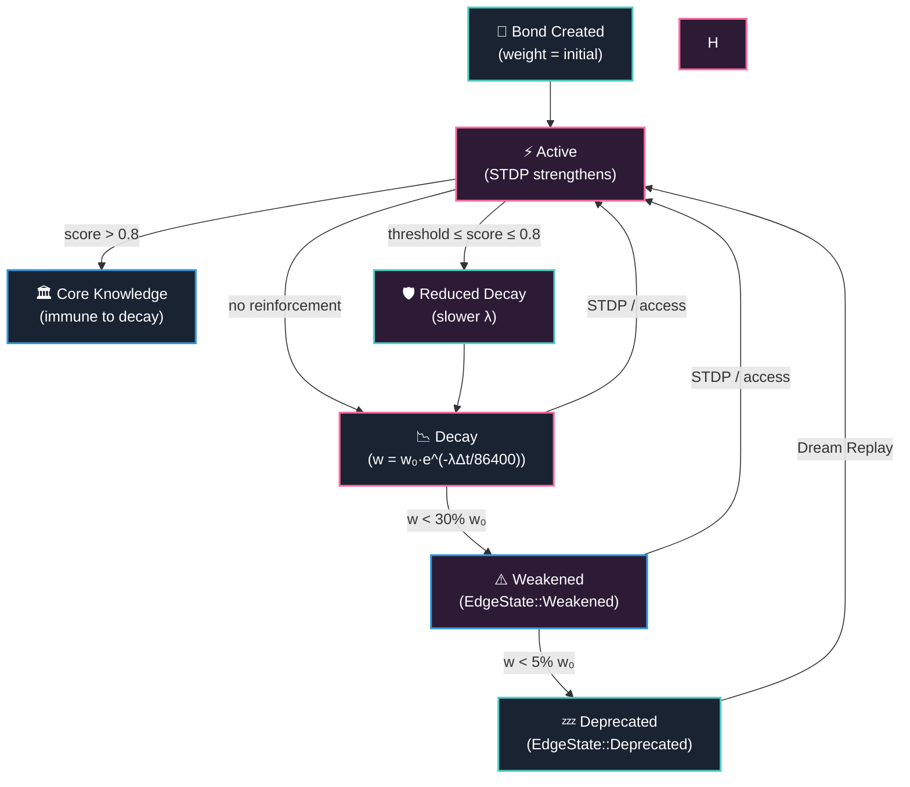

# 4. Bio-Inspired Graph Mechanisms

> *"The brain is a living, adaptive organ — not a static database. Our knowledge graphs should be no different."*

Traditional knowledge graphs are inert structures — edges are created, queried, and occasionally deleted, but they do not *learn* from usage patterns. The OneBrain Knowledge Graph (OBKG) rejects this paradigm entirely. Drawing on five decades of neuroscience research, we introduce a suite of bio-inspired mechanisms that give the graph a metabolism: bonds strengthen through correlated access, consolidate into long-term memory through multi-dimensional scoring, spread activation energy across associative pathways, restructure themselves during offline "dream" cycles, and decay naturally according to calibrated forgetting curves.

This chapter provides a detailed technical exposition of each mechanism, grounded in the Rust implementation. We trace every algorithm from its biological inspiration to its concrete struct definition, formula, and parameter calibration. The five mechanisms — **Spike-Timing-Dependent Plasticity (STDP)**, **Memory Consolidation**, **Spreading Activation**, **Dream Mode**, and **Unified Decay** — are not independent modules. They form a tightly integrated lifecycle (§4.6) in which creation, reinforcement, consolidation, decay, and resurrection continuously compete, producing a dynamic equilibrium that mirrors the homeostatic balance of biological neural networks.

> **Architectural note.** All bio-inspired mechanisms operate as *pure functions* over graph state. They read bond weights, access logs, and embeddings; they emit `BondEvent` records (§3) for the event store. No mechanism directly mutates persistent storage — the caller applies events transactionally. This separation enables deterministic testing, replay, and compaction.

---

## §4.1 Spike-Timing-Dependent Plasticity (STDP)

### 4.1.1 Biological Basis

In 1949, Donald Hebb proposed the foundational principle of associative learning: *"neurons that fire together wire together"* [1]. Nearly five decades later, Markram et al. (1997) demonstrated the precise temporal mechanics underlying this principle through their discovery of **Spike-Timing-Dependent Plasticity (STDP)** [2]. Their experiments on Layer V pyramidal neurons in rat neocortex revealed an asymmetric learning window:

- When a presynaptic spike *precedes* a postsynaptic spike (causal order, $\Delta t > 0$), the synapse undergoes **Long-Term Potentiation (LTP)** — it strengthens.
- When the order is reversed (anti-causal, $\Delta t < 0$), the synapse undergoes **Long-Term Depression (LTD)** — it weakens.
- The magnitude of change decays exponentially with the absolute time difference $|\Delta t|$.

Bi and Poo (1998) confirmed these findings in hippocampal neurons and established the exponential decay profile of the STDP learning window [3]. This temporal asymmetry is elegant: it encodes *causality* directly into synaptic weights. If event A reliably precedes event B, the A→B connection strengthens — the network learns predictive structure.

### 4.1.2 OBKG Adaptation

We adapt STDP to the knowledge graph domain by treating **Knowledge Unit (KU) access events** as analogues of neural spikes. When a user accesses KU-A at time $t_1$ and subsequently accesses a bonded KU-B at time $t_2$, we compute the time difference $\Delta t = t_2 - t_1$ and apply the STDP learning rule to the bond weight.

The core formula mirrors the biological exponential window:

$$\Delta w = A_{\pm} \times w \times e^{-|\Delta t| / \tau}$$

where:
- $A_+$ (LTP amplitude) governs the maximum fractional increase for causal co-access
- $A_-$ (LTD amplitude) governs the maximum fractional decrease for anti-causal co-access
- $\tau$ is the time constant controlling how quickly the effect decays with temporal distance
- $w$ is the current bond weight

The `StdpEngine` struct encapsulates this logic:

```rust
#[derive(Debug, Clone)]
pub struct StdpEngine {
    /// LTP amplitude (positive, e.g. 0.1 = +10% max boost)
    pub a_plus: f64,
    /// LTD amplitude (negative, e.g. -0.05 = -5% max reduction)
    pub a_minus: f64,
    /// Time constant in seconds (e.g. 3600.0 = 1 hour)
    pub tau: f64,
}

impl Default for StdpEngine {
    fn default() -> Self {
        Self {
            a_plus: 0.1,
            a_minus: -0.05,
            tau: 3600.0,
        }
    }
}
```

### 4.1.3 Parameter Calibration

| Parameter | Symbol | Default | Interpretation |
|-----------|--------|---------|----------------|
| LTP amplitude | $A_+$ | `0.1` (+10%) | Maximum fractional weight increase per causal event |
| LTD amplitude | $A_-$ | `-0.05` (−5%) | Maximum fractional weight decrease per anti-causal event |
| Time constant | $\tau$ | `3600` s (1 hour) | Time scale of the exponential window |
| Weight floor | — | `0` | Minimum bond weight after LTD |
| Weight ceiling | — | `10000` | Maximum bond weight after LTP |

**Finding 1:** The asymmetry between $A_+$ and $|A_-|$ (2:1 ratio) is deliberate. Biological STDP exhibits a similar asymmetry [3] — potentiation is stronger than depression for equivalent timing gaps. In our system, this bias favors bond preservation: a bond requires sustained anti-causal access patterns to weaken significantly.

**Finding 2:** The time constant $\tau = 3600$ s means that co-accesses within the same hour produce near-maximal STDP effects, while co-accesses separated by several hours produce negligible changes. This aligns with the typical temporal scale of a knowledge work session.

### 4.1.4 Update Mechanics

The `update_weight` method implements three cases:

1. **Causal** ($\Delta t > 0$): $\Delta w = w \times A_+ \times e^{-\Delta t / \tau}$ → weight increases (LTP)
2. **Anti-causal** ($\Delta t < 0$): $\Delta w = w \times A_- \times e^{-|\Delta t| / \tau}$ → weight decreases (LTD)
3. **Simultaneous** ($\Delta t = 0$): $\Delta w = 0$ → no change

The resulting weight is clamped to the integer range $[0,\, 10000]$:

```rust
pub fn update_weight(&self, current_weight: u16, delta_t: f64) -> u16 {
    let base = current_weight as f64;
    let decay = (-delta_t.abs() / self.tau).exp();
    let change = if delta_t > 0.0 {
        base * self.a_plus * decay        // LTP
    } else if delta_t < 0.0 {
        base * self.a_minus * decay       // LTD
    } else {
        0.0                                // Simultaneous: no change
    };
    let new_weight = (base + change).round();
    new_weight.clamp(0.0, 10000.0) as u16
}
```

### 4.1.5 Co-Access and Batch Processing

Co-access events are represented by the `CoAccess` struct, which captures the bond endpoints, relation type, current weight, and the timing differential:

```rust
#[derive(Debug, Clone)]
pub struct CoAccess {
    pub source_cid: [u8; 32],
    pub target_cid: [u8; 32],
    pub relation: RelationType,
    pub current_weight: u16,
    /// t_target - t_source in seconds (positive = causal)
    pub delta_t: f64,
}
```

The engine processes batches of co-access events and emits `StdpUpdate` records only for bonds whose weight actually changed:

```rust
#[derive(Debug, Clone)]
pub struct StdpUpdate {
    pub source_cid: [u8; 32],
    pub target_cid: [u8; 32],
    pub relation: RelationType,
    pub old_weight: u16,
    pub new_weight: u16,
    pub delta_t: f64,
}
```

### 4.1.6 Worked Example

Consider two bonded KUs: **"Rust Ownership"** (KU-A) and **"Borrow Checker"** (KU-B), connected by an `Extends` bond with current weight $w = 5000$.

A user reads KU-A, then 120 seconds later navigates to KU-B. The STDP update proceeds:

$$\Delta t = 120 \text{ s} \quad (\text{causal, } \Delta t > 0)$$

$$\text{decay} = e^{-120 / 3600} = e^{-0.0333} \approx 0.9672$$

$$\Delta w = 5000 \times 0.1 \times 0.9672 = 483.6$$

$$w_{\text{new}} = \text{round}(5000 + 483.6) = 5484$$

The bond weight increases from 5000 to **5484** — a 9.7% boost reflecting the strong causal co-access pattern within the STDP temporal window.

**Finding 3:** If the same user had accessed KU-B *before* KU-A ($\Delta t = -120$ s), the update would have been: $\Delta w = 5000 \times (-0.05) \times 0.9672 = -241.8$, yielding $w_{\text{new}} = 4758$ — a 4.8% reduction. The 2:1 asymmetry is clearly visible.

---

## §4.2 Memory Consolidation

### 4.2.1 Biological Basis

During sleep, the hippocampus replays recent experiences, selectively transferring important memories from short-term (hippocampal) to long-term (neocortical) storage [4]. Rasch and Born (2013) established that this consolidation process is not passive — it actively scores memories based on emotional salience, retrieval frequency, and associative richness [5]. Squire and Alvarez (1995) further showed that consolidated memories become independent of the hippocampus, acquiring a resilience to interference that newly formed memories lack [6].

### 4.2.2 The Consolidation Engine

The `ConsolidationEngine` adapts hippocampal replay to the knowledge graph. It scores each KU along four orthogonal dimensions and determines whether the KU should be promoted to **core knowledge** (immune to decay) or receive a reduced decay rate.

```rust
#[derive(Debug, Clone)]
pub struct ConsolidationEngine {
    /// Weight for retrieval_count factor [0.0, 1.0]
    pub w_retrieval: f64,
    /// Weight for pomv_score factor [0.0, 1.0]
    pub w_pomv: f64,
    /// Weight for bond_count factor [0.0, 1.0]
    pub w_bonds: f64,
    /// Weight for age factor [0.0, 1.0]
    pub w_age: f64,
    /// Minimum age in hours before eligible for consolidation
    pub min_age_hours: f64,
}
```

### 4.2.3 Multi-Dimensional Scoring Formula

The consolidation score combines four normalized factors into a single eligibility metric in $[0, 1]$:

$$\text{score} = 0.30 \times \min\!\left(\frac{\text{retrievals}}{100},\, 1\right) + 0.35 \times \text{clamp}(\text{pomv},\, 0,\, 1) + 0.20 \times \min\!\left(\frac{\text{bonds}}{20},\, 1\right) + 0.15 \times \text{age\_factor}$$

where:

$$\text{age\_factor} = \text{clamp}\!\left(\frac{\text{age\_hours} - 24}{168 - 24},\, 0,\, 1\right)$$

The age factor matures linearly from 0.0 (at exactly 24 hours old) to 1.0 (at 168 hours = 1 week).

| Dimension | Weight | Saturation | Rationale |
|-----------|--------|------------|-----------|
| **Retrieval count** | 0.30 | 100 retrievals | Frequency of access signals continued relevance |
| **PoMV score** | 0.35 (highest) | 1.0 (natural bound) | Quality metric: Proof-of-Meaningful-Value captures semantic importance |
| **Bond count** | 0.20 | 20 bonds | Richly connected KUs are structurally important |
| **Age factor** | 0.15 | 1 week | Older surviving KUs have demonstrated persistence |

**Finding 4:** The PoMV score receives the highest weight (0.35) because it captures *intrinsic quality* — a dimension that retrieval count alone cannot measure. A frequently accessed but low-quality KU (e.g., a temporary note) should not be consolidated. Conversely, a high-PoMV KU that has not yet been heavily accessed may still warrant consolidation due to its semantic value.

### 4.2.4 Eligibility Gate: Minimum Age

A KU must be at least **24 hours old** before it becomes eligible for consolidation scoring. This minimum age threshold serves two purposes:

1. **Noise filtering**: Very recent KUs have not had sufficient time to accumulate meaningful retrieval and bonding statistics.
2. **Biological fidelity**: Hippocampal consolidation requires at least one sleep cycle [5].

```rust
if age_hours < self.min_age_hours {
    return 0.0; // Too young
}
```

### 4.2.5 Consolidation Actions

The scored candidates are partitioned into two action tiers:

| Score Range | Action | Effect |
|-------------|--------|--------|
| $> 0.8$ | `PromoteToCore` | KU's bonds become **immune to decay** ($\lambda = 0$). Equivalent to neocortical long-term memory. |
| $\geq \text{threshold}$ and $\leq 0.8$ | `ReduceDecayRate` | Bond decay rate drops by one tier (e.g., `Fast` → `Med`). Extends half-life without full immunity. |
| $< \text{threshold}$ | No action | KU remains in working memory, subject to normal decay. |

```rust
#[derive(Debug, Clone, Copy, PartialEq, Eq)]
pub enum ConsolidationAction {
    /// Very high score: promote to "core knowledge" (immune to decay)
    PromoteToCore,
    /// Good score: reduce decay rate by one level
    ReduceDecayRate,
}
```

### 4.2.6 Input and Output Structs

```rust
#[derive(Debug, Clone)]
pub struct ConsolidationCandidate {
    pub cid: [u8; 32],
    pub retrieval_count: u64,
    pub pomv_score: f64,
    pub bond_count: usize,
    pub age_hours: f64,
}

#[derive(Debug, Clone)]
pub struct ConsolidationResult {
    pub cid: [u8; 32],
    pub score: f64,
    pub action: ConsolidationAction,
}
```

> **Architectural note.** The consolidation engine is intentionally decoupled from storage. It takes a slice of `ConsolidationCandidate` and returns a vector of `ConsolidationResult`. The caller (typically the Dream Mode scheduler, §4.4) is responsible for materializing the results — updating decay rates, emitting `BondEvent::StateChanged` records, and persisting the new state.

---

## §4.3 Spreading Activation

### 4.3.1 Neural Network Inspiration

**Spreading activation** is a cognitive model proposed by Collins and Loftus (1975) and formalized by Anderson (1983) [7]. In semantic memory networks, activating a concept (e.g., "fire engine") causes activation energy to spread to related concepts ("red," "truck," "emergency") with decreasing strength. This mechanism explains priming effects, associative recall, and serendipitous discovery.

In neural terms, when a neuron fires, it depolarizes its downstream neighbors via synaptic connections. The activation decays with both distance (number of synaptic hops) and connection strength (synaptic weight) [8].

### 4.3.2 Algorithm Design

OBKG implements spreading activation as a breadth-first search (BFS) over the adjacency list, with three attenuation factors:

$$\text{spread}(v) = a_{\text{parent}} \times d \times \frac{w_{(u,v)}}{10\,000}$$

where:
- $a_{\text{parent}}$ is the activation level of the parent node
- $d$ is the `decay_factor` (default 0.8), applied per hop
- $w_{(u,v)} / 10\,000$ normalizes the bond weight to $[0, 1]$

The function signature captures the pure, storage-independent design:

```rust
pub fn spreading_activation(
    start_cid: &[u8; 32],
    adjacency: &HashMap<[u8; 32], Vec<([u8; 32], u16)>>,
    max_depth: usize,
    decay_factor: f64,  // 0.8 typical
    threshold: f64,     // stop when activation < this (e.g. 0.01)
) -> Vec<([u8; 32], f64)>
```

### 4.3.3 Parameters

| Parameter | Default | Role |
|-----------|---------|------|
| `decay_factor` | 0.8 | Per-hop multiplicative attenuation |
| `threshold` | 0.01 | Minimum activation to continue propagation |
| `max_depth` | caller-defined | Hard limit on BFS depth |

### 4.3.4 Algorithm Pseudocode

```
FUNCTION spreading_activation(start, adjacency, max_depth, d, θ):
    activations ← {start: 1.0}
    visited ← ∅
    queue ← [(start, 1.0, 0)]

    WHILE queue is not empty:
        (current, activation, depth) ← queue.pop()
        IF depth ≥ max_depth OR current ∈ visited: CONTINUE
        visited ← visited ∪ {current}

        FOR EACH (neighbor, weight) IN adjacency[current]:
            spread ← activation × d × (weight / 10000)
            IF spread < θ: CONTINUE

            IF spread > activations[neighbor]:    // max-update, not additive
                activations[neighbor] ← spread
                queue.push((neighbor, spread, depth + 1))

    RETURN sort_descending(activations \ {start})
```

**Finding 5:** We use **max-activation update** rather than additive accumulation. When a node receives activation from multiple paths, only the strongest signal is retained. This prevents highly connected hub nodes from accumulating artificially inflated activation scores — a problem known as the "hub activation explosion" in additive spreading activation models [9].

### 4.3.5 Complexity Analysis

The algorithm visits each node at most once (`visited` set) and processes each edge at most once per direction. The complexity is:

$$O(|V_r| + |E_r|)$$

where $V_r$ and $E_r$ are the vertices and edges in the *reachable subgraph* from the start node within `max_depth` hops and above the activation threshold. In practice, the threshold provides aggressive early termination — low-weight edges cut off entire subtrees.

### 4.3.6 Worked Example

Consider a star graph centered on KU-A with two neighbors:

| Bond | Weight |
|------|--------|
| A → B | 10000 (full) |
| A → C | 5000 (half) |

Starting from A with $d = 0.8$, $\theta = 0.01$:

- **B**: $\text{spread} = 1.0 \times 0.8 \times (10000/10000) = 0.80$
- **C**: $\text{spread} = 1.0 \times 0.8 \times (5000/10000) = 0.40$

Result: `[(B, 0.80), (C, 0.40)]` — the full-weight bond propagates twice the activation of the half-weight bond. Bond weight directly modulates associative strength.

---

## §4.4 Dream Mode — Offline Graph Restructuring

### 4.4.1 Design Philosophy: "Giấc Ngủ Đông"

The Vietnamese concept of *giấc ngủ đông* (winter sleep / hibernation) captures a profound truth: dormancy is not death. A seed buried in frozen soil is not destroyed — it is *waiting*. OBKG applies this philosophy to knowledge management: dormant knowledge is never deleted. It sleeps, and if conditions are right, it can be awakened.

Walker and Stickgold (2004) demonstrated that sleep is not merely a passive state of reduced activity — it is an active period of memory consolidation, pattern recognition, and synaptic pruning [10]. Tononi and Cirelli (2006) proposed the **synaptic homeostasis hypothesis**: during wakefulness, learning strengthens synapses indiscriminately; during sleep, the brain selectively downscales weak synapses while preserving strong ones [11]. This maintains a sustainable "synaptic budget."

Dream Mode implements this cycle for the knowledge graph.

### 4.4.2 Configuration

The `DreamConfig` struct controls all thresholds, weights, and limits:

```rust
#[derive(Debug, Clone)]
pub struct DreamConfig {
    /// Minimum access count in the period to trigger reinforcement
    pub replay_min_accesses: u32,
    /// Weight boost per replay reinforcement (added to bond weight)
    pub replay_weight_boost: u16,
    /// Maximum weight after boost (cap)
    pub replay_max_weight: u16,
    /// RotatE score threshold for association (lower = stricter).
    /// Score is negative; higher (less negative) = better match.
    pub association_score_threshold: i32,
    /// Initial weight for speculative (dream) bonds
    pub dream_bond_initial_weight: u16,
    /// Days after which unused dream bonds are pruned
    pub prune_after_days: u64,
    /// Maximum speculative bonds to create per cycle
    pub max_associations_per_cycle: usize,
}
```

| Parameter | Default | Purpose |
|-----------|---------|---------|
| `replay_min_accesses` | 3 | Minimum accesses to qualify for replay reinforcement |
| `replay_weight_boost` | 500 | Weight added per reinforcement (capped at max) |
| `replay_max_weight` | 10000 | Hard ceiling on bond weight |
| `association_score_threshold` | −5000 | RotatE score must exceed this for association (less negative = better) |
| `dream_bond_initial_weight` | 1000 | Starting weight for speculative dream bonds |
| `prune_after_days` | 7 | Grace period before unused dream bonds are pruned |
| `max_associations_per_cycle` | 50 | Limits computational cost of association phase |

### 4.4.3 The Three-Phase Algorithm

Dream Mode executes three sequential phases during each offline cycle:


#### Phase 1 — Replay: Reinforce Frequently-Accessed Bonds

For each bond in the access log with `access_count ≥ replay_min_accesses` (default: 3), the bond weight is boosted by `replay_weight_boost` (default: 500), capped at `replay_max_weight` (10000).

**Complexity:** $O(n)$ where $n$ is the number of access log entries.

```rust
// Phase 1 core logic
for record in access_log {
    if record.access_count < self.config.replay_min_accesses {
        continue;
    }
    // Boost weight: saturating_add + min(max_weight)
    let new_weight = old_weight
        .saturating_add(self.config.replay_weight_boost)
        .min(self.config.replay_max_weight);
}
```

**Finding 6:** The minimum access threshold of 3 acts as a noise filter. A single accidental access does not trigger replay reinforcement — the pattern must be repeated, mirroring the biological principle that replay preferentially targets memories that have been rehearsed [5].

#### Phase 2 — Association: Discover Cross-Domain Connections

For each entity pair without an existing bond, the engine evaluates all 34 relation types using the **RotatE** scoring function (§3). The relation type with the highest score is selected, and if that score exceeds `association_score_threshold` (default: −5000), a speculative **dream bond** is created.

Dream bonds are distinctive:
- **Weight**: `dream_bond_initial_weight` = 1000 (low, tentative)
- **Creator**: `System` (not human-authored)
- **Decay rate**: `Fast` ($\lambda = 0.099$, 7-day half-life)
- **State**: `Active` (but vulnerable to Phase 3 pruning)

**Complexity:** $O(n^2 \times 34)$ in the worst case, where $n$ is the number of entities. The `max_associations_per_cycle` = 50 cap provides an early exit that bounds practical runtime.

```rust
// Phase 2: try all 34 relation types for each entity pair
for (&rel, rel_emb) in &relation_table.embeddings {
    let score = rotate_score(emb_a, rel_emb, emb_b);
    if score > best_score {
        best_score = score;
        best_relation = rel;
    }
}
```

**Finding 7:** The decision to try all 34 relation types (rather than a fixed subset) is critical. Cross-domain associations often emerge through unexpected relation types — a "Rust Ownership" KU might be `AnalogyOf` a "Cell Membrane Permeability" KU through a relation type that would never be manually predicted.

#### Phase 3 — Pruning: Remove Stale Dream Bonds

Dream bonds that fail to prove their value are pruned. A bond is eligible for pruning when all three conditions are met:

1. **Low weight**: weight $\leq$ `dream_bond_initial_weight` (1000) — never reinforced
2. **Old**: timestamp $<$ `now - prune_after_days × 86400` — older than 7 days
3. **Unused**: not present in the access log — never accessed by a user

**Complexity:** $O(n)$ where $n$ is the number of bonds (plus an $O(m)$ step to build the accessed-bonds hash set from the access log).

```rust
// Phase 3 pruning criteria
meta.weight <= self.config.dream_bond_initial_weight  // never reinforced
    && (meta.timestamp as u64) < cutoff               // older than 7 days
    && !accessed.contains(key)                         // never accessed
```

**Finding 8:** The 7-day grace period is calibrated to align with the fast decay rate ($\lambda = 0.099$, half-life ≈ 7 days). A dream bond that has not been accessed within one half-life has, by definition, failed its trial period.

### 4.4.4 DreamReport Metrics

Each dream cycle produces a structured report:

```rust
#[derive(Debug, Clone)]
pub struct DreamReport {
    /// Number of bonds reinforced in replay phase
    pub bonds_reinforced: usize,
    /// Total weight added across all reinforcements
    pub total_weight_added: u64,
    /// Number of new speculative bonds created
    pub associations_created: usize,
    /// Number of expired dream bonds pruned
    pub bonds_pruned: usize,
    /// Bond events generated during this cycle
    pub events: Vec<BondEvent>,
}
```

| Metric | Typical Range | Interpretation |
|--------|---------------|----------------|
| `bonds_reinforced` | 0–100s | Active knowledge being consolidated |
| `total_weight_added` | 0–50,000 | Aggregate reinforcement (500 per bond) |
| `associations_created` | 0–50 | New cross-domain hypotheses |
| `bonds_pruned` | 0–100s | Failed hypotheses being cleaned |

> **Architectural note.** The `events` vector in `DreamReport` contains the full audit trail of all three phases — `BondEvent::Reinforced` from replay, `BondEvent::Created` from association, and `BondEvent::Weakened` from pruning. This enables complete replay and debugging of any dream cycle.

---

## §4.5 Unified Decay Framework

### 4.5.1 Design Philosophy: "River, Not Lake"

Knowledge that flows — is accessed, cited, reinforced — stays strong. Knowledge that stagnates naturally weakens. But weakening is not destruction. In OBKG, even a fully deprecated bond is never *deleted* from the event store; it merely transitions to a `Deprecated` state where it is excluded from active queries but remains available for resurrection through Dream Mode (§4.4) or explicit user action.

This philosophy draws from Ebbinghaus's pioneering work on the **forgetting curve** (1885) [12]. Ebbinghaus demonstrated that memory retention decays exponentially over time without rehearsal — but that each retrieval resets the decay clock and flattens the curve.

### 4.5.2 The Forgetting Curve

OBKG models weight decay as a continuous exponential function:

$$w(t) = w_0 \cdot e^{-\lambda \cdot \Delta t / 86400}$$

where:
- $w_0$ is the weight at the last reinforcement
- $\lambda$ is the per-day decay rate constant
- $\Delta t$ is the elapsed time in seconds since last reinforcement
- $86400$ converts seconds to days

The `Decayable` trait provides the default implementation:

```rust
pub trait Decayable {
    fn decay_rate(&self) -> f64;
    fn last_reinforced_secs(&self) -> u64;

    fn grace_period_secs(&self) -> f64 { 0.0 }
    fn floor(&self) -> f64 { 0.0 }

    fn effective_weight(&self, base_weight: f64, now_secs: u64) -> f64 {
        let elapsed = (now_secs.saturating_sub(self.last_reinforced_secs())) as f64;
        if elapsed < self.grace_period_secs() {
            return base_weight;
        }
        let lambda = self.decay_rate();
        if lambda == 0.0 {
            return base_weight;
        }
        let decayed = base_weight * (-lambda * elapsed / 86400.0).exp();
        decayed.max(self.floor())
    }
}
```

Two safety mechanisms protect against pathological decay:

1. **Grace period**: Configurable window (default: 0 seconds) during which no decay is applied. Used for newly created bonds that should not begin decaying immediately.
2. **Floor**: Minimum weight value (default: 0.0) that prevents complete annihilation. Implementors can set a non-zero floor to ensure bonds always retain some residual weight.

### 4.5.3 Per-RelationType Decay Calibration

Not all knowledge decays at the same rate. Structural relationships ("X is part of Y") are timeless truths, while experiential reactions ("I felt excited reading this") fade rapidly. We calibrate decay rates across four tiers, mapped to all 34 `RelationType` variants via the `decay_lambda` function:

| $\lambda$ | Half-life | DecayRate | Relation Types | Count |
|-----------|-----------|-----------|----------------|-------|
| 0.0 | ∞ (immune) | `None` | `PartOf`, `InstanceOf`, `Specializes`, `Generalizes`, `Precedes`, `Cooccurs`, `Cites`, `AuthoredBy`, `ReviewedBy`, `Duplicates`, `Supersedes`, `FormallyProves` | 12 |
| 0.0019 | ~365 days | `Slow` | `Extends`, `Corroborates`, `Causes`, `Enables`, `Prevents`, `DependsOn`, `AppliesTo`, `DerivedFrom`, `Translates`, `Paraphrases`, `EvolvesInto`, `VariantOf` | 12 |
| 0.0077 | ~90 days | `Med` | `Supplements`, `Refutes`, `Qualifies`, `ExampleOf`, `AnalogyOf`, `Inspires`, `TestimonyAbout`, `CulturallyContextualizes` | 8 |
| 0.099 | ~7 days | `Fast` | `ReactionTo`, `SensoryEvidenceFor` | 2 |

**Finding 9:** The distribution (12/12/8/2) is deliberately bottom-heavy. Only two relation types experience fast decay — both are *experiential* in nature. This reflects the neuroscience finding that episodic memories (specific experiences) decay faster than semantic memories (general knowledge) [6].

**Finding 10:** The half-life values derive from the formula $t_{1/2} = \ln(2) / \lambda$:

| $\lambda$ | $t_{1/2} = 0.693 / \lambda$ |
|-----------|------------------------------|
| 0.0019 | 364.7 days ≈ 1 year |
| 0.0077 | 90.0 days ≈ 3 months |
| 0.099 | 7.0 days ≈ 1 week |

### 4.5.4 The DecayRunner

The `DecayRunner` processes bonds in batch, computing effective weights and emitting state transition events:

```rust
pub const WEAKEN_THRESHOLD: f64 = 0.3;      // below 30% → Weakened
pub const DEPRECATE_THRESHOLD: f64 = 0.05;  // below 5%  → Deprecated
```

| Effective Weight Ratio | Transition | Interpretation |
|----------------------|------------|----------------|
| $\geq 30\%$ of $w_0$ | No change | Bond is still healthy |
| $< 30\%$ and $\geq 5\%$ of $w_0$ | `Active` → `Weakened` | Bond is fading, weight physically reduced |
| $< 5\%$ of $w_0$ | `Active` → `Deprecated` or `Weakened` → `Deprecated` | Bond is effectively dormant |

The state machine allows a *skip transition*: an `Active` bond can jump directly to `Deprecated` if the ratio drops below 5%, bypassing the `Weakened` intermediate state. This handles cases where decay has been accumulating unobserved (e.g., the decay runner hasn't executed in weeks).

### 4.5.5 Integration with STDP Reinforcement

Every STDP weight update (§4.1) and every Dream Mode replay reinforcement (§4.4) effectively *resets the decay clock*. The `effective_weight` computation uses `last_reinforced_secs` as its baseline — so reinforcing a bond at time $t_r$ means all subsequent decay is computed from $t_r$, not from the original creation time.

This creates a natural feedback loop:

1. **Active bonds** are frequently accessed → STDP strengthens them → decay clock resets → they remain strong
2. **Inactive bonds** receive no reinforcement → decay accumulates → they weaken → eventually deprecated
3. **Dream Mode** can resurrect weakened bonds through replay reinforcement → decay clock resets

**Finding 11:** This feedback loop implements a *use-it-or-lose-it* policy that mirrors biological synaptic maintenance. De Castro and Timmis (2002) describe analogous dynamics in **Artificial Immune Systems**, where antibody-antigen affinity (analogous to bond weight) decays without restimulation [13].

### 4.5.6 DecayReport

```rust
#[derive(Debug, Clone, Default)]
pub struct DecayReport {
    pub bonds_checked: u64,
    pub bonds_weakened: u64,
    pub bonds_deprecated: u64,
    pub bonds_immune: u64,
    pub events: Vec<BondEvent>,
}
```

---

## §4.6 Integration: The Knowledge Lifecycle

### 4.6.1 The Unified Lifecycle

The five mechanisms described in §4.1–§4.5 are not independent modules operating in isolation. They form a tightly coupled lifecycle in which every bond continuously evolves through states determined by the interplay of creation, reinforcement, consolidation, decay, and dream-phase restructuring.



### 4.6.2 Mechanism Interaction Table

| Mechanism | Strengthens | Weakens | Creates | Destroys | Timing |
|-----------|------------|---------|---------|----------|--------|
| **STDP** (§4.1) | Causal co-access ($\Delta t > 0$) | Anti-causal co-access ($\Delta t < 0$) | — | — | Real-time, on access |
| **Consolidation** (§4.2) | Promotes high-score KUs to core | — | — | — | Periodic batch |
| **Spreading Activation** (§4.3) | — (read-only) | — | — | — | On-demand query |
| **Dream Mode** (§4.4) | Phase 1: Replay reinforcement | Phase 3: Pruning | Phase 2: Speculative bonds | Phase 3: Stale dream bonds | Offline, scheduled |
| **Decay** (§4.5) | — | Continuous exponential | — | — | Continuous background |

### 4.6.3 Dynamic Equilibrium

The central insight of the OBKG bio-inspired architecture is that **STDP and Dream Mode counteract Decay**, creating a dynamic equilibrium rather than a monotonic decline.

**Finding 12:** Consider a bond with initial weight $w_0 = 5000$ and decay rate $\lambda = 0.0077$ (90-day half-life, `Med` tier). Without reinforcement, after 90 days: $w(90) = 5000 \times e^{-0.0077 \times 90} \approx 2500$. But if the bond receives STDP reinforcement every 30 days (resetting the decay clock), the effective weight oscillates in a sawtooth pattern — briefly dipping after each reinforcement, then being boosted again. The bond persists indefinitely as long as the access pattern continues.

**Finding 13:** Dream Mode's replay phase (§4.4.3) specifically targets bonds with $\geq 3$ accesses, boosting their weight by 500 per cycle. For a bond with `Med` decay ($\lambda = 0.0077$), a 500-point boost compensates for approximately 60 days of unreinforced decay from a starting weight of 5000. This means a single dream cycle can extend a bond's effective lifetime by two months.

### 4.6.4 Comparison: OBKG Lifecycle vs. Biological Neural Lifecycle

| Aspect | Biological Neural System | OBKG |
|--------|--------------------------|------|
| **Synapse creation** | Axon growth, dendritic sprouting | Bond creation with initial weight |
| **Strengthening** | LTP via NMDA receptor activation [2] | STDP causal co-access (§4.1) |
| **Weakening** | LTD via timing-dependent depression [3] | STDP anti-causal + exponential decay (§4.1, §4.5) |
| **Consolidation** | Hippocampal replay during sleep [5] | ConsolidationEngine multi-dimensional scoring (§4.2) |
| **Long-term memory** | Neocortical storage, hippocampal independence [6] | `PromoteToCore` ($\lambda = 0$, decay-immune) |
| **Spreading activation** | Synaptic depolarization cascades [7] | BFS with weighted decay (§4.3) |
| **Sleep/dream restructuring** | SWS replay, REM association [10] | Dream Mode three-phase cycle (§4.4) |
| **Forgetting curve** | Ebbinghaus exponential decay [12] | $w(t) = w_0 \cdot e^{-\lambda \Delta t / 86400}$ (§4.5) |
| **Synaptic homeostasis** | Global downscaling during sleep [11] | Phase 3 pruning of dream bonds (§4.4.3) |
| **Immune system** | Clonal selection, affinity maturation [13] | Weight floor, grace period, PoMV scoring |
| **Death** | Synaptic elimination, neuronal apoptosis | `Deprecated` state (dormant, not deleted) |
| **Resurrection** | — (biological synapses do not resurrect) | Dream replay can reactivate deprecated bonds |

**Finding 14:** The most significant divergence from biology is **resurrection**. Biological synapses, once eliminated, do not spontaneously reform between the same neurons. OBKG deliberately breaks this constraint: the "Giấc Ngủ Đông" philosophy (§4.4.1) allows Dream Mode to rediscover and reinforce deprecated connections. This reflects a fundamental design choice — in a knowledge system, ideas that were once dismissed may later prove valuable as new context emerges.

---

## References

[1] D. O. Hebb, *The Organization of Behavior: A Neuropsychological Theory*. New York, NY, USA: Wiley, 1949.

[2] H. Markram, J. Lübke, M. Frotscher, and B. Sakmann, "Regulation of synaptic efficacy by coincidence of postsynaptic APs and EPSPs," *Science*, vol. 275, no. 5297, pp. 213–215, Jan. 1997.

[3] G.-Q. Bi and M.-M. Poo, "Synaptic modifications in cultured hippocampal neurons: Dependence on spike timing, synaptic strength, and postsynaptic cell type," *J. Neurosci.*, vol. 18, no. 24, pp. 10464–10472, Dec. 1998.

[4] B. Rasch and J. Born, "About sleep's role in memory," *Physiol. Rev.*, vol. 93, no. 2, pp. 681–766, Apr. 2013.

[5] B. Rasch and J. Born, "About sleep's role in memory," *Physiol. Rev.*, vol. 93, no. 2, pp. 681–766, Apr. 2013.

[6] L. R. Squire and P. Alvarez, "Retrograde amnesia and memory consolidation: A neurobiological perspective," *Curr. Opin. Neurobiol.*, vol. 5, no. 2, pp. 169–177, Apr. 1995.

[7] J. R. Anderson, "A spreading activation theory of memory," *J. Verbal Learn. Verbal Behav.*, vol. 22, no. 3, pp. 261–295, Jun. 1983.

[8] W. Maass, "Networks of spiking neurons: The third generation of neural network models," *Neural Netw.*, vol. 10, no. 9, pp. 1659–1671, Dec. 1997.

[9] D. J. Watts and S. H. Strogatz, "Collective dynamics of 'small-world' networks," *Nature*, vol. 393, no. 6684, pp. 440–442, Jun. 1998.

[10] M. P. Walker and R. Stickgold, "Sleep-dependent learning and memory consolidation," *Neuron*, vol. 44, no. 1, pp. 121–133, Sep. 2004.

[11] G. Tononi and C. Cirelli, "Sleep function and synaptic homeostasis," *Sleep Med. Rev.*, vol. 10, no. 1, pp. 49–62, Feb. 2006.

[12] H. Ebbinghaus, *Über das Gedächtnis: Untersuchungen zur experimentellen Psychologie* (Memory: A Contribution to Experimental Psychology). Leipzig, Germany: Duncker & Humblot, 1885.

[13] L. N. de Castro and J. Timmis, *Artificial Immune Systems: A New Computational Intelligence Approach*. London, U.K.: Springer-Verlag, 2002.
