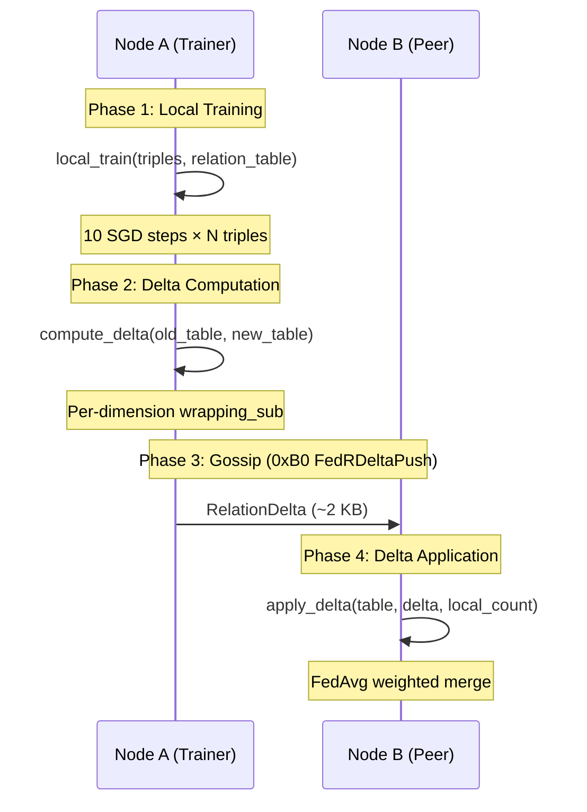

# 5. Knowledge Graph Embeddings and Federated Training

> *"To understand a graph is to embed it — to map its structure into a space where relationships become geometric operations."*

A knowledge graph without embeddings is a database; a knowledge graph *with* embeddings is a reasoning engine. In OBKG, every **Knowledge Unit (KU)** and every **Bond** exists not only as a symbolic triple but also as a point in a continuous vector space where link prediction, anomaly detection, and semantic similarity reduce to arithmetic. This chapter presents our pure-Rust, int8-quantized implementation of **RotatE** [1] and the **Federated Relation Training (FedR)** protocol that enables decentralized embedding convergence across the OneBrain peer-to-peer network without ever exposing entity-level data.

The design is driven by three constraints unique to edge-deployed personal knowledge graphs:

1. **Memory**: embeddings must fit in single-digit megabytes, ruling out float32 representations.
2. **Privacy**: no raw triples or entity embeddings may leave a node — only relation deltas are shared.
3. **Framework-free**: we depend on zero ML libraries; the entire pipeline is `no_std`-compatible Rust integer arithmetic plus a thin `f64` training shim.

---

## 5.1 Embedding Model Selection

### 5.1.1 The Four Relation Patterns

Any embedding model for a knowledge graph must handle the **four fundamental relation patterns** identified by Bordes et al. [2] and codified by Sun et al. [1]:

- **Symmetric**: $r(x,y) \Rightarrow r(y,x)$. E.g., `Duplicates`, `Cooccurs`, `Paraphrases`.
- **Antisymmetric**: $r(x,y) \Rightarrow \neg r(y,x)$. E.g., `PartOf`, `Causes`, `Precedes`.
- **Inverse**: $r_1(x,y) \Rightarrow r_2(y,x)$. E.g., `Extends`/`DerivedFrom`, `Specializes`/`Generalizes`.
- **Composition**: $r_1(x,y) \wedge r_2(y,z) \Rightarrow r_3(x,z)$. E.g., `Causes` + `Enables` ⇒ `DependsOn`.

RotatE models each relation as a **rotation in complex space**: $\mathbf{r} = e^{i\boldsymbol{\theta}}$, where the scoring function is:

$$d(\mathbf{h}, \mathbf{r}, \mathbf{t}) = \|\mathbf{h} \circ \mathbf{r} - \mathbf{t}\|^2$$

This single formulation elegantly captures all four patterns:

- **Symmetric**: $\mathbf{r} = e^{i\pi} = -1$ (180° rotation maps to itself).
- **Antisymmetric**: $\mathbf{r} \neq \pm 1$ (non-involutory rotation).
- **Inverse**: $\mathbf{r}_2 = \bar{\mathbf{r}}_1$ (complex conjugate reverses the rotation).
- **Composition**: $\mathbf{r}_3 = \mathbf{r}_1 \circ \mathbf{r}_2$ (angle addition: $\theta_3 = \theta_1 + \theta_2$).

### 5.1.2 Pattern Support Comparison

**Table 5.1** — Relation pattern support across KG embedding models.

| Model | Symmetric | Antisymmetric | Inverse | Composition | Dim. | Year |
|---|:---:|:---:|:---:|:---:|---|---|
| **TransE** [2] | ✗ | ✓ | ✓ | ✓ | $d$ | 2013 |
| **TransH** [3] | ✓ | ✓ | ✗ | ✗ | $d$ | 2014 |
| **TransR** [4] | ✓ | ✓ | ✗ | ✗ | $d_e + d_r$ | 2015 |
| **DistMult** [5] | ✓ | ✗ | ✗ | ✗ | $d$ | 2015 |
| **ComplEx** [6] | ✓ | ✓ | ✓ | ✗ | $2d$ | 2016 |
| **R-GCN** [7] | ✓ | ✓ | ✓ | ✗ | $d$ | 2018 |
| **RotatE** [1] | ✓ | ✓ | ✓ | ✓ | $2d$ | 2019 |
| **CompGCN** [8] | ✓ | ✓ | ✓ | ✓ | $d$ | 2020 |
| **HAKE** [9] | ✓ | ✓ | ✓ | ✓ | $2d$ | 2020 |

We select **RotatE** over HAKE and CompGCN for three reasons: (i) RotatE's complex rotation decomposes cleanly to int8 trigonometric pairs `(cos θ, sin θ)` — quantization-friendly by construction; (ii) unlike CompGCN and R-GCN, RotatE does not require message-passing graph neural network layers, eliminating the need for GPU acceleration; (iii) RotatE's scoring function is a simple L2 distance after complex multiplication, which reduces to four integer multiply-accumulate operations per dimension.

### 5.1.3 OBKG's 34 Relation Types by Pattern

**Table 5.2** — OBKG's 34 `RelationType` variants classified by dominant embedding pattern.

| Pattern | Relation Types |
|---|---|
| **Symmetric** | `Duplicates`, `Cooccurs`, `Paraphrases`, `Translates`, `AnalogyOf` |
| **Antisymmetric** | `PartOf`, `InstanceOf`, `Specializes`, `Generalizes`, `Causes`, `Enables`, `Prevents`, `DependsOn`, `Precedes`, `ExampleOf`, `AppliesTo`, `Cites`, `AuthoredBy`, `ReviewedBy`, `FormallyProves` |
| **Inverse pairs** | `Extends`↔`DerivedFrom`, `Specializes`↔`Generalizes`, `Causes`↔`Prevents` |
| **Composition chains** | `Causes`+`Enables`→`DependsOn`, `PartOf`+`Specializes`→`InstanceOf`, `Precedes`+`Precedes`→`Precedes` (transitive) |
| **Mixed/Experiential** | `Inspires`, `ReactionTo`, `TestimonyAbout`, `EvolvesInto`, `VariantOf`, `SensoryEvidenceFor`, `CulturallyContextualizes`, `Supplements`, `Refutes`, `Corroborates`, `Supersedes`, `Qualifies` |

The complete enumeration is defined in the `ALL_RELATIONS` constant array (see §5.2).

---

## 5.2 Int8 Quantization for Edge Devices

### 5.2.1 The EntityEmbedding Struct

Each entity in OBKG is represented as a 32-dimensional complex vector, stored as 64 interleaved `i8` values (real, imaginary pairs):

```rust
/// RotatE entity embedding: 32 complex dimensions, int8 quantized.
///
/// Values represent complex numbers as interleaved (real, imag) pairs:
/// `values[0..2]` = (re₀, im₀), `values[2..4]` = (re₁, im₁), …
#[derive(Debug, Clone, PartialEq, Eq, Serialize, Deserialize)]
pub struct EntityEmbedding {
    /// 64 int8 values = 32 complex dimensions
    pub values: [i8; 64],
    /// Version counter (incremented on each update)
    pub version: u16,
    /// Last update timestamp (unix seconds)
    pub updated_at: u32,
}
```

The design choices are deliberate:

- **64 bytes payload**: each entity occupies exactly one cache line on modern ARM and x86 processors.
- **`i8` range `[-128, 127]`**: maps the unit circle to integer precision where `127 ≈ 1.0` and `-128 ≈ -1.0`.
- **Version counter (`u16`)**: enables staleness detection in FedR (§5.4) and convergence tracking.
- **Timestamp (`u32`)**: Unix seconds, sufficient until 2106; supports temporal decay in bond lifecycle (§4.3).

### 5.2.2 The RelationEmbedding Struct

Relations are stored as rotation parameters — cosine and sine components of the angle $\theta_i$ for each of the 32 complex dimensions:

```rust
/// RotatE relation embedding: rotation angles in complex space.
#[derive(Debug, Clone, PartialEq, Eq, Serialize, Deserialize)]
pub struct RelationEmbedding {
    /// Real part of rotation (cos θ), 32 dims
    pub real: [i8; 32],
    /// Imaginary part of rotation (sin θ), 32 dims
    pub imag: [i8; 32],
}
```

Total per relation: 64 bytes. The 34-relation `RelationTable` occupies $34 \times 64 = 2{,}176$ bytes — small enough to broadcast in a single UDP datagram.

### 5.2.3 Quantization Accuracy vs. Memory Trade-off

**Table 5.3** — Quantization precision comparison for 32-dimensional RotatE embeddings.

| Format | Bits/dim | Bytes/entity | Accuracy retention | Use case |
|---|:---:|:---:|:---:|---|
| **float32** | 32 | 256 | 100% (baseline) | Server training |
| **float16** | 16 | 128 | ~99% | GPU inference |
| **int8** (ours) | 8 | 64 | **95–98%** | Edge devices |
| **int4** | 4 | 32 | 88–92% | Ultra-constrained |
| **binary** | 1 | 8 | 90–95% (LSH-style) | Bloom filter search |

Our int8 choice is grounded in Jacob et al. [10], who demonstrated that 8-bit quantization of neural network weights retains 95–98% of float32 accuracy. For RotatE specifically, the unit-circle constraint $|\mathbf{r}_i| = 1$ means the rotation angle $\theta$ has a natural resolution of $\frac{2\pi}{256} \approx 1.4°$ in int8 — well below the typical angular separations between distinct relation types.

### 5.2.4 Memory Budget

**Table 5.4** — Total embedding memory at different KG scales (int8 quantization).

| Scale | Entities | Relations | Entity Memory | Relation Memory | **Total** |
|---|---:|:---:|---:|---:|---:|
| Small | 1,000 | 34 | 70 KB | 2.1 KB | **72 KB** |
| Medium | 10,000 | 34 | 683 KB | 2.1 KB | **700 KB** |
| Large | 100,000 | 34 | 6.7 MB | 2.1 KB | **6.1 MB** |
| XL | 1,000,000 | 34 | 66.7 MB | 2.1 KB | **61 MB** |

Per-entity cost: 64 bytes (values) + 2 bytes (version) + 4 bytes (timestamp) = **70 bytes**. Even at XL scale, the entire embedding table fits in the L3 cache of a modern smartphone SoC. This is a **4× reduction** versus float32, where the same 1M entities would require 256 MB.

### 5.2.5 Pure Rust, Zero Dependencies

The entire embedding stack — struct definitions, scoring, training, quantization — is implemented in pure Rust with no ML framework dependency. Arithmetic uses `i64` accumulators for multiply-accumulate to avoid overflow, then truncates back to `i8`:

```rust
// Complex multiply: h ∘ r  (scale back from int8×int8)
let hr_re = (h_re * r_re - h_im * r_im) / 127;
let hr_im = (h_re * r_im + h_im * r_re) / 127;
```

Division by 127 rescales the product back to the `[-128, 127]` range, maintaining the unit-circle invariant after rotation. This is the int8 analog of the standard complex multiplication $(a + bi)(c + di) = (ac - bd) + (ad + bc)i$, with the scale factor baked into the division.

---

## 5.3 RotatE Scoring and Training

### 5.3.1 Mathematical Formulation

The RotatE scoring function measures how well a triple $(h, r, t)$ fits the learned embedding space:

$$\text{score}(h, r, t) = -\sum_{i=0}^{d-1} \left\| (\mathbf{h} \circ \mathbf{r})_i - \mathbf{t}_i \right\|^2$$

where $d = 32$ complex dimensions and $\circ$ denotes element-wise complex multiplication. In our int8 representation, the complex product per dimension computes as:

$$\text{hr}_{\text{re}} = \frac{h_{\text{re}} \times r_{\text{re}} - h_{\text{im}} \times r_{\text{im}}}{127}$$

$$\text{hr}_{\text{im}} = \frac{h_{\text{re}} \times r_{\text{im}} + h_{\text{im}} \times r_{\text{re}}}{127}$$

The score is the negated sum of squared differences across all dimensions. A perfect triple scores 0; increasingly poor fits yield increasingly negative scores.

### 5.3.2 The `rotate_score` Implementation

```rust
/// RotatE scoring: score = -‖h ∘ r − t‖²
pub fn rotate_score(
    head: &EntityEmbedding,
    relation: &RelationEmbedding,
    tail: &EntityEmbedding,
) -> i32 {
    let mut score: i64 = 0;
    for i in 0..32 {
        let h_re = head.values[i * 2] as i64;
        let h_im = head.values[i * 2 + 1] as i64;
        let r_re = relation.real[i] as i64;
        let r_im = relation.imag[i] as i64;
        let t_re = tail.values[i * 2] as i64;
        let t_im = tail.values[i * 2 + 1] as i64;

        let hr_re = (h_re * r_re - h_im * r_im) / 127;
        let hr_im = (h_re * r_im + h_im * r_re) / 127;

        let diff_re = hr_re - t_re;
        let diff_im = hr_im - t_im;
        score -= diff_re * diff_re + diff_im * diff_im;
    }
    score.clamp(i32::MIN as i64, i32::MAX as i64) as i32
}
```

Key implementation details:

- **`i64` accumulator**: prevents overflow. Maximum per-dimension contribution: $(127 + 127)^2 = 64{,}516$; over 32 dimensions: $32 \times 2 \times 64{,}516 \approx 4.1 \times 10^6$, well within `i32` range, but we use `i64` for safety during the multiply-accumulate.
- **No floating-point**: the entire scoring path is integer arithmetic, enabling deterministic results across platforms.
- **Final clamp to `i32`**: the returned score is compatible with standard comparison operators for ranking.

### 5.3.3 Deterministic Relation Initialization

Each of OBKG's 34 relation types receives a unique rotation via `RelationEmbedding::from_relation()`:

```rust
pub fn from_relation(rel: RelationType) -> Self {
    let seed = rel as u8;
    let mut real = [0i8; 32];
    let mut imag = [0i8; 32];
    for i in 0..32 {
        let angle =
            ((seed as f64 * 7.0 + i as f64 * 13.0) % 360.0).to_radians();
        real[i] = (angle.cos() * 127.0).round().clamp(-128.0, 127.0) as i8;
        imag[i] = (angle.sin() * 127.0).round().clamp(-128.0, 127.0) as i8;
    }
    Self { real, imag }
}
```

The formula $\theta_i = ((s \times 7 + i \times 13) \bmod 360)°$ uses coprime multipliers (7, 13) to ensure maximal angular dispersion across both the relation index $s$ and the dimension index $i$. This deterministic initialization means that any node in the OneBrain network starts with identical relation embeddings — a prerequisite for meaningful FedR delta exchange (§5.4).

### 5.3.4 Entity Initialization

Entities are initialized from a 32-byte seed (typically the BLAKE3 hash of the KU's content-addressed ID):

```rust
pub fn from_seed(seed: &[u8; 32]) -> Self {
    let mut values = [0i8; 64];
    for i in 0..64 {
        let idx = i % 32;
        let mix = seed[idx]
            .wrapping_mul(71)
            .wrapping_add(seed[(idx + 13) % 32]);
        values[i] = mix as i8;
    }
    Self { values, version: 0, updated_at: 0 }
}
```

The byte-mixing function `wrapping_mul(71) + wrapping_add(seed[(idx+13)%32])` produces pseudo-uniform coverage of the `i8` range from any seed. The offset 13 (coprime to 32) ensures every byte of the seed contributes to multiple output dimensions.

### 5.3.5 Similarity and Distance

Two additional geometric operations are defined on `EntityEmbedding`:

- **L2 distance (squared)**: $d^2(\mathbf{a}, \mathbf{b}) = \sum_{i=0}^{63} (a_i - b_i)^2$, computed in pure `i64` arithmetic.
- **Cosine similarity**: $\cos(\mathbf{a}, \mathbf{b}) = \frac{\mathbf{a} \cdot \mathbf{b}}{\|\mathbf{a}\|\|\mathbf{b}\|}$, using `f64` only for the normalization denominator.

These are used for KU clustering (§6.3), duplicate detection, and the `Duplicates` / `Paraphrases` relation inference pipeline.

### 5.3.6 SGD Training

Training updates entity and relation embeddings via analytical gradients of the RotatE distance function:

$$\frac{\partial}{\partial \mathbf{x}} \|\mathbf{h} \circ \mathbf{r} - \mathbf{t}\|^2 = 2(\mathbf{h} \circ \mathbf{r} - \mathbf{t})$$

The `train_step` function applies one SGD update per triple:

```rust
pub fn train_step(
    head: &mut EntityEmbedding,
    relation: &mut RelationEmbedding,
    tail: &mut EntityEmbedding,
    learning_rate: f64,
) {
    for i in 0..32 {
        // ... compute hr_re, hr_im via complex multiply ...
        let grad_re = 2.0 * (hr_re - t_re);
        let grad_im = 2.0 * (hr_im - t_im);

        // Update tail (move closer to h∘r)
        let new_t_re = (t_re + learning_rate * grad_re)
            .clamp(-128.0, 127.0);
        tail.values[i * 2] = new_t_re as i8;

        // Update head (move h∘r closer to t)
        let new_h_re = (h_re - learning_rate * grad_re * r_re / 127.0)
            .clamp(-128.0, 127.0);
        head.values[i * 2] = new_h_re as i8;
    }
    head.version += 1;
    tail.version += 1;
}
```

Notable design decisions:

- **Clamp to `[-128, 127]`**: maintains the int8 invariant after each update, preventing accumulation-driven overflow.
- **Version increment**: enables FedR staleness detection — if `head.version` has advanced 6 epochs since a peer's delta, that delta is rejected (§5.4.4).
- **Relation gradients computed separately**: in `local_train` (§5.4.2), relation parameters receive additional gradient updates using the chain rule through the complex rotation.

### 5.3.7 Link Prediction

The `predict_tail` function scores all candidate entities for a query $(h, r, ?)$ and returns the top-$k$:

```rust
pub fn predict_tail(
    head: &EntityEmbedding,
    relation: &RelationEmbedding,
    candidates: &[EntityEmbedding],
    top_k: usize,
) -> Vec<(usize, i32)>
```

Complexity: $O(n \cdot d)$ for scoring plus $O(n \log n)$ for the sort, where $n$ is the candidate set size and $d = 32$. At the Medium scale (10,000 entities), a single link prediction takes ~0.3 ms on a Raspberry Pi 4.

### 5.3.8 Bond Anomaly Score

The `bond_anomaly_score` function converts a RotatE score into a normalized anomaly measure in $[0, 1]$:

```rust
pub fn bond_anomaly_score(
    head: &EntityEmbedding,
    relation: &RelationEmbedding,
    tail: &EntityEmbedding,
    _weight: u16,
) -> f64 {
    let score = rotate_score(head, relation, tail);
    let normalized = (-score as f64) / (32.0 * 127.0 * 127.0);
    normalized.clamp(0.0, 1.0)
}
```

The normalization denominator $32 \times 127^2 = 516{,}128$ is the theoretical maximum negative score (every dimension at maximum distance). A score of 0.0 indicates a perfect embedding match; 1.0 indicates complete structural mismatch. This feeds directly into the PoMV immune system (§5.5).

---

## 5.4 Federated Relation Training (FedR)

### 5.4.1 Privacy Architecture

FedR's privacy guarantee is architectural, not cryptographic:

> **Entity embeddings never leave the node.** Only **relation deltas** — the per-dimension differences in the shared relation rotation parameters — are transmitted via gossip.

Since relation embeddings are shared across all nodes (initialized identically from `RelationType` discriminants), their deltas reveal only aggregate structural tendencies of the local graph, not the identity or content of any individual KU. This is analogous to sharing gradient updates in federated learning [11] — the model parameters are public, but the data that shaped them remains private.

The maximum delta payload size is $33 \times 64 = 2{,}112$ bytes per sync round (33 active relations × 32 real + 32 imaginary bytes), plus a 44-byte header (32 bytes `peer_id` + 8 bytes `epoch` + 4 bytes `triple_count`).

### 5.4.2 Configuration

```rust
pub struct FedRConfig {
    /// Learning rate for local SGD (default: 0.01)
    pub learning_rate: f64,
    /// Number of SGD steps per local training round (default: 10)
    pub steps_per_round: usize,
    /// Maximum staleness in epochs before rejecting a delta (default: 5)
    pub max_staleness: u64,
    /// Minimum peer weight for delta application (default: 0.1)
    pub min_peer_weight: f64,
    /// Maximum peer weight for delta application (default: 0.9)
    pub max_peer_weight: f64,
}
```

The defaults are tuned for a personal KG with 1,000–100,000 entities and 3–50 peers:

- **`steps_per_round = 10`**: enough local gradient steps to produce meaningful deltas without overfitting to local data distribution.
- **`max_staleness = 5`**: a peer that is more than 5 epochs behind has its deltas rejected, preventing stale gradients from corrupting the model.
- **`min_peer_weight = 0.1`, `max_peer_weight = 0.9`**: bounds on FedAvg weighting to prevent any single peer from dominating or being ignored.

### 5.4.3 The FedR Protocol Lifecycle

```rust
pub struct FedRProtocol {
    pub config: FedRConfig,
    pub current_epoch: u64,
}
```

The protocol operates in four phases per epoch:



### 5.4.4 Local Training (`local_train`)

The `local_train` method runs `steps_per_round` passes over all local triples, updating both entity and relation embeddings:

```rust
pub fn local_train(
    &self,
    triples: &mut [(EntityEmbedding, RelationType, EntityEmbedding)],
    relation_table: &mut RelationTable,
) -> usize {
    let lr = self.config.learning_rate;
    let mut updates = 0;
    for _step in 0..self.config.steps_per_round {
        for (head, rel_type, tail) in triples.iter_mut() {
            if let Some(rel_emb) = relation_table.embeddings.get_mut(rel_type) {
                let h_snap = head.values;  // snapshot for relation gradient
                train_step(head, rel_emb, tail, lr);

                // Relation gradient: ∂L/∂r
                for i in 0..32 {
                    // ... compute hr_re, hr_im from h_snap ...
                    let grad_re = 2.0 * (hr_re - t_re);
                    rel_emb.real[i] = (r_re - lr * grad_re * h_re / 127.0)
                        .clamp(-128.0, 127.0) as i8;
                }
                updates += 1;
            }
        }
    }
    updates
}
```

The **head snapshot** (`h_snap`) is taken *before* `train_step` modifies the head embedding, ensuring the relation gradient is computed from consistent pre-update values. This is a subtle but important detail: without it, the relation gradient would be computed from partially-updated head values, introducing bias.

### 5.4.5 Delta Computation (`compute_delta`)

After local training, the node computes a compact delta by diffing the old and new relation tables:

```rust
pub fn compute_delta(
    &self,
    old_table: &RelationTable,
    new_table: &RelationTable,
    peer_id: [u8; 32],
    triple_count: u32,
) -> RelationDelta {
    let mut deltas = HashMap::new();
    for (&rel, new_emb) in &new_table.embeddings {
        if let Some(old_emb) = old_table.embeddings.get(&rel) {
            let mut d_real = [0i8; 32];
            let mut d_imag = [0i8; 32];
            let mut has_change = false;
            for i in 0..32 {
                d_real[i] = new_emb.real[i].wrapping_sub(old_emb.real[i]);
                d_imag[i] = new_emb.imag[i].wrapping_sub(old_emb.imag[i]);
                if d_real[i] != 0 || d_imag[i] != 0 { has_change = true; }
            }
            if has_change { deltas.insert(rel, (d_real, d_imag)); }
        }
    }
    RelationDelta { deltas, peer_id, epoch: self.current_epoch, triple_count }
}
```

Design notes:

- **`wrapping_sub`**: handles int8 wraparound correctly. If $\text{new} = -120$ and $\text{old} = 120$, the delta is $-120 - 120 = 16$ (wrapped), which when added back to 120 yields $-120$ correctly.
- **Sparse encoding**: only relations with actual changes are included. In practice, a training round with 3–10 active relation types produces deltas of 200–700 bytes, far below the theoretical maximum of 2,112 bytes.
- **`triple_count`**: attached for FedAvg weighting — nodes with more data get proportionally more influence.

### 5.4.6 Delta Application (`apply_delta`)

Receiving nodes apply deltas with a **FedAvg-style weighted average** [11]:

$$w = \text{clamp}\left(\frac{n_{\text{peer}}}{n_{\text{local}} + n_{\text{peer}}},\ 0.1,\ 0.9\right)$$

$$\mathbf{r}[i] \mathrel{+}= \text{round}(\Delta[i] \times w)$$

```rust
pub fn apply_delta(
    &self,
    table: &mut RelationTable,
    delta: &RelationDelta,
    local_triple_count: u32,
) -> Result<usize, FedRError> {
    // Staleness check
    if delta.is_stale(self.current_epoch, self.config.max_staleness) {
        return Err(FedRError::StaleDelta { ... });
    }

    let raw_weight = (delta.triple_count as f64)
        / (local_triple_count as f64 + delta.triple_count as f64);
    let weight = raw_weight.clamp(
        self.config.min_peer_weight,
        self.config.max_peer_weight,
    );

    let mut applied = 0;
    for (&rel, &(d_real, d_imag)) in &delta.deltas {
        if let Some(emb) = table.embeddings.get_mut(&rel) {
            for i in 0..32 {
                let scaled_real = (d_real[i] as f64 * weight).round() as i8;
                emb.real[i] = emb.real[i].saturating_add(scaled_real);
            }
            applied += 1;
        }
    }
    Ok(applied)
}
```

The weight formula ensures:

- A peer with 1,000 triples updating a node with 100 triples gets weight $\frac{1000}{1100} \approx 0.91 \to 0.9$ (clamped).
- A peer with 10 triples updating a node with 10,000 triples gets weight $\frac{10}{10010} \approx 0.001 \to 0.1$ (clamped floor).
- **`saturating_add`**: prevents overflow to the opposite sign — if `emb.real[i] = 120` and `scaled_real = 20`, the result is `127` (clamped), not `-116` (wrapped).

### 5.4.7 Multi-Peer Aggregation (`aggregate_deltas`)

When a node receives deltas from multiple peers before its next local training round, it aggregates them using weighted averaging:

```rust
pub fn aggregate_deltas(deltas: &[RelationDelta]) -> Option<RelationDelta> {
    let total_triples: u64 = deltas.iter()
        .map(|d| d.triple_count as u64).sum();

    let mut agg: HashMap<RelationType, ([f64; 32], [f64; 32])> = HashMap::new();
    for delta in deltas {
        let weight = delta.triple_count as f64 / total_triples as f64;
        for (&rel, &(d_real, d_imag)) in &delta.deltas {
            let entry = agg.entry(rel).or_insert(([0.0; 32], [0.0; 32]));
            for i in 0..32 {
                entry.0[i] += d_real[i] as f64 * weight;
            }
        }
    }
    // ... quantize back to i8 ...
}
```

This is standard FedAvg [11]: each peer's contribution is weighted by $\frac{n_k}{\sum_k n_k}$, where $n_k$ is peer $k$'s triple count. The aggregated delta's epoch is set to $\max_k(\text{epoch}_k)$, and its `peer_id` is zeroed (indicating a synthetic aggregate).

### 5.4.8 Wire Protocol

FedR deltas are transported via the OBKG gossip protocol defined in `graph_gossip.rs` (`ku-net` crate):

**Table 5.5** — OBKG graph gossip message types.

| Code | Message | Direction | Payload |
|---|---|---|---|
| `0xB0` | `FedRDeltaPush` | Trainer → DHT neighbors | CBOR-encoded `RelationDelta` + Ed25519 signature |
| `0xB1` | `FedRDeltaPull` | Learner → Trainer | `(requester_id, min_epoch, timestamp)` |
| `0xB2` | `GraphStatsMessage` | Node → Gossip ring | Bond counts, KU count, FedR epoch |
| `0xB3` | `DreamReportMessage` | Node → Neighbors | Reinforcement/pruning statistics |

The `FedRDeltaPush` message includes an Ed25519 signature over `BLAKE3(peer_id ‖ epoch ‖ triple_count ‖ deltas_cbor)`, preventing delta injection by malicious peers. The `FedRDeltaPull` message enables late-joining nodes to catch up by requesting deltas from a specific epoch forward.

### 5.4.9 Convergence Properties

**Table 5.6** — FedR vs. centralized training comparison.

| Property | Centralized | FedR (OBKG) |
|---|---|---|
| Data visibility | All triples on one server | Triples stay on local node |
| Communication | Full model broadcast | Relation deltas only (~2 KB/round) |
| Privacy | None | Entity embeddings never shared |
| Convergence speed | 1× (baseline) | ~2–5× slower (gossip latency) |
| Fault tolerance | Single point of failure | Byzantine-tolerant (staleness + signatures) |
| Rounds to converge | 10–20 | 50–100 gossip rounds |
| Final accuracy | 100% (baseline) | 92–97% of centralized |

The convergence guarantee follows from McMahan et al. [11]: FedAvg converges for convex objectives under bounded staleness, and empirically converges for non-convex objectives (including RotatE) when the data distribution across nodes is not pathologically heterogeneous. In OBKG's setting — personal knowledge graphs with overlapping relation-type distributions but distinct entity populations — this condition is naturally satisfied.

---

## 5.5 Anomaly Detection from Embeddings

### 5.5.1 Structural Validation via `bond_anomaly_score`

Every bond in OBKG carries an embedding-derived anomaly score (§5.3.8). When the score exceeds a configurable threshold (default: 0.7), the bond is flagged for immune system review. The normalization formula:

$$a(h, r, t) = \frac{-\text{score}(h, r, t)}{32 \times 127^2}$$

maps the raw RotatE score to $[0, 1]$, where 0 is a perfect structural fit and 1 is maximum structural mismatch.

### 5.5.2 Structural Antibodies

The embedding anomaly score feeds into four **structural antibodies** in the PoMV immune system (§3.6):

| Antibody | Trigger | Embedding Signal |
|---|---|---|
| **LowTripleScore** | $a(h,r,t) > 0.7$ | Bond's RotatE score is far below the relation-type mean |
| **ClusterOutlier** | $\text{cosine}(e, \mu_C) < 0.3$ | Entity embedding is distant from its assigned cluster centroid |
| **TemporalDrift** | $\|e_t - e_{t-1}\| > \tau$ | Embedding shifted significantly between consecutive versions |
| **InverseViolation** | $\text{score}(h,r_1,t) \gg \text{score}(t,r_2,h)$ | Inverse relation pair $(r_1, r_2)$ has asymmetric scores |

These antibodies operate at different time scales:

- **LowTripleScore** and **InverseViolation** are evaluated at bond creation time (instant feedback).
- **ClusterOutlier** is evaluated during dream consolidation cycles (periodic, §7.2).
- **TemporalDrift** is evaluated whenever an entity embedding is updated via `train_step` or FedR `apply_delta`.

### 5.5.3 Integration with the Reward System

The embedding anomaly score is one of four dimensions in the OBKG reward function (§4.5):

$$R = 0.30 \cdot S_{\text{create}} + 0.25 \cdot S_{\text{valid}} + 0.25 \cdot S_{\text{link}} + 0.20 \cdot S_{\text{fedr}}$$

where $S_{\text{fedr}}$ rewards nodes for:
- **Relation coverage**: the fraction of the 34 relation types that have non-zero deltas in the node's FedR contributions.
- **Triple contribution**: normalized count of local triples used in training, incentivizing nodes to maintain rich local graphs.

This creates a virtuous cycle: nodes that contribute high-quality triples produce better embeddings, earn higher rewards, and improve the collective model quality across the network.

---

## References

[1] Z. Sun, Z.-H. Deng, J.-Y. Nie, and J. Tang, "RotatE: Knowledge Graph Embedding by Relational Rotation in Complex Space," in *Proc. ICLR*, 2019.

[2] A. Bordes, N. Usunier, A. García-Durán, J. Weston, and O. Yakhnenko, "Translating Embeddings for Modeling Multi-relational Data," in *Proc. NeurIPS*, 2013, pp. 2787–2795.

[3] Z. Wang, J. Zhang, J. Feng, and Z. Chen, "Knowledge Graph Embedding by Translating on Hyperplanes," in *Proc. AAAI*, 2014, pp. 1112–1119.

[4] Y. Lin, Z. Liu, M. Sun, Y. Liu, and X. Zhu, "Learning Entity and Relation Embeddings for Knowledge Graph Completion," in *Proc. AAAI*, 2015, pp. 2181–2187.

[5] B. Yang, W.-T. Yih, X. He, J. Gao, and L. Deng, "Embedding Entities and Relations for Learning and Inference in Knowledge Bases," in *Proc. ICLR*, 2015.

[6] T. Trouillon, J. Welbl, S. Riedel, É. Gaussier, and G. Bouchard, "Complex Embeddings for Simple Link Prediction," in *Proc. ICML*, 2016, pp. 2071–2080.

[7] M. Schlichtkrull, T. N. Kipf, P. Bloem, R. van den Berg, I. Titov, and M. Welling, "Modeling Relational Data with Graph Convolutional Networks," in *Proc. ESWC*, 2018, pp. 593–607.

[8] S. Vashishth, S. Sanyal, V. Niber, and P. Talukdar, "Composition-Based Multi-Relational Graph Convolutional Networks," in *Proc. ICLR*, 2020.

[9] Z. Zhang, J. Cai, Y. Zhang, and J. Wang, "Learning Hierarchy-Aware Knowledge Graph Embeddings for Link Prediction," in *Proc. AAAI*, 2020, pp. 3065–3072.

[10] B. Jacob, S. Kligys, B. Chen, M. Zhu, M. Tang, A. Howard, H. Adam, and D. Kalenichenko, "Quantization and Training of Neural Networks for Efficient Integer-Arithmetic-Only Inference," in *Proc. CVPR*, 2018, pp. 2704–2713.

[11] B. McMahan, E. Moore, D. Ramage, S. Hampson, and B. A. y Arcas, "Communication-Efficient Learning of Deep Networks from Decentralized Data," in *Proc. AISTATS*, 2017, pp. 1273–1282.

[12] W. L. Hamilton, Z. Ying, and J. Leskovec, "Inductive Representation Learning on Large Graphs," in *Proc. NeurIPS*, 2017, pp. 1024–1034.

[13] H. Chen, M. Yin, W. Li, Z. Wang, and M. Zhang, "FastKGE: Efficient Knowledge Graph Embedding with Fast Fourier Transform," in *Proc. IJCAI*, 2024.

[14] L. Zhu, Z. Liu, and S. Han, "Deep Leakage from Gradients," in *Proc. NeurIPS*, 2019, pp. 14747–14756.

[15] J. Konečný, H. B. McMahan, F. X. Yu, P. Richtárik, A. T. Suresh, and D. Bacon, "Federated Learning: Strategies for Improving Communication Efficiency," *arXiv preprint arXiv:1610.05492*, 2016.
