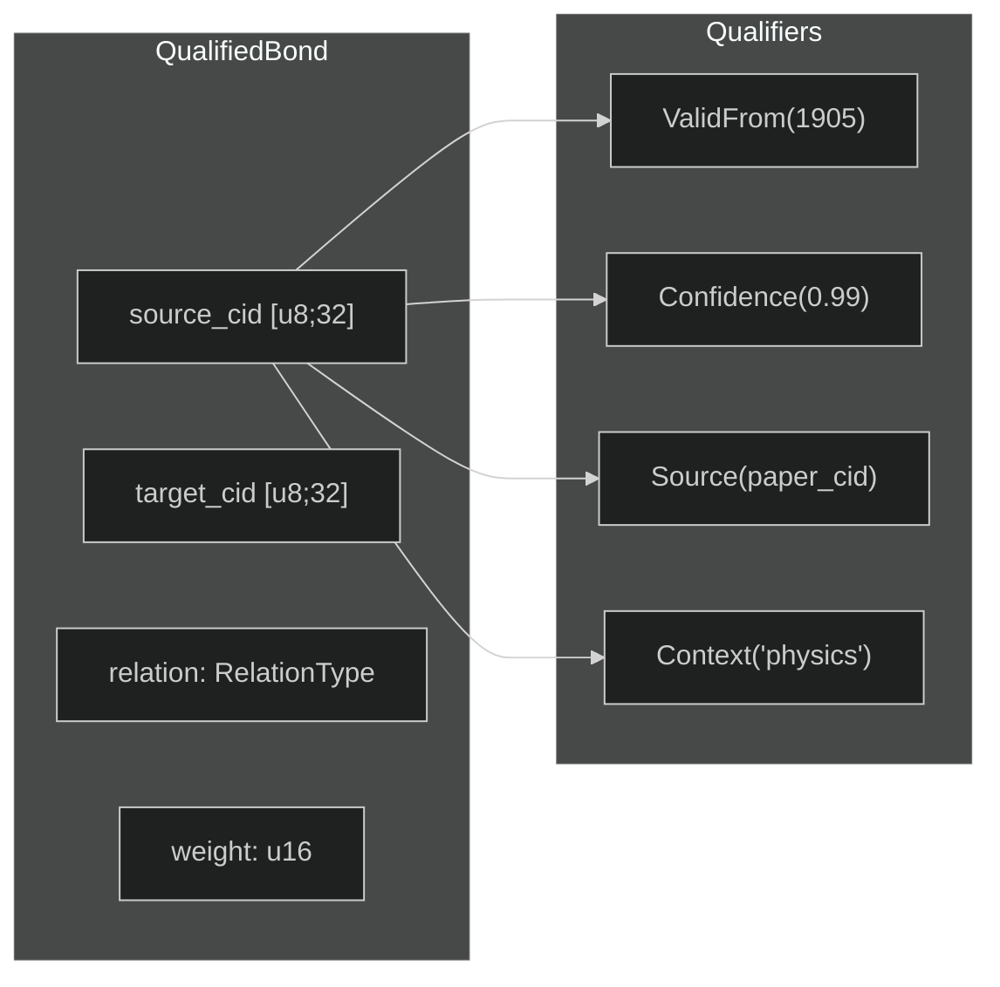
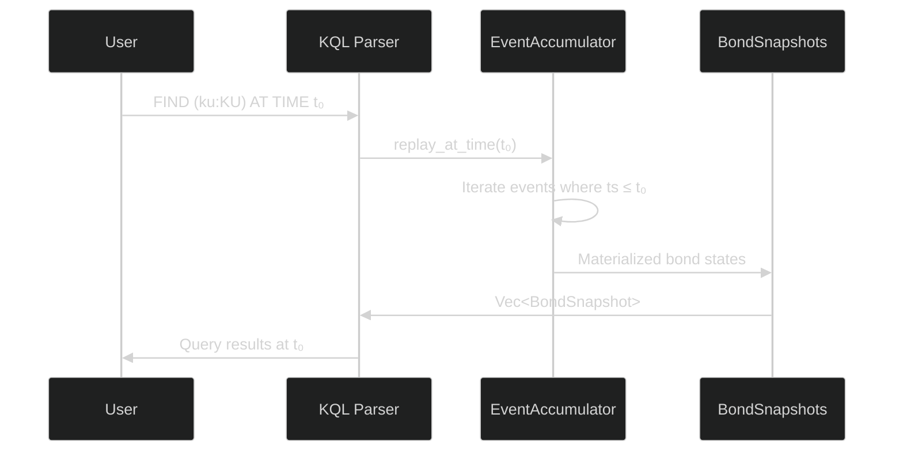

> *"Knowledge without temporal context is knowledge without meaning."*

# 6. Temporal Knowledge and Bond Qualifiers

Knowledge graphs that treat edges as static, eternal assertions inevitably fail to model the real world. Scientific consensus shifts, political alliances dissolve, and even physical constants are periodically refined. In OBKG, we treat **temporal context** not as an afterthought but as a first-class dimension of every bond. This chapter presents two complementary mechanisms—**event-sourced bond history** (§6.1) and **bond qualifiers** (§6.2)—that together endow the knowledge graph with full temporal awareness. We then describe how **graph versioning** (§6.3) enables time-travel queries across the distributed network, and close with a formal model of **knowledge evolution** (§6.4) grounded in the epistemology of Kuhn [1] and the causal reasoning framework of Pearl [2].

---

## §6.1 Event-Sourced Bond History

Traditional knowledge graphs store only the latest state of an edge. OBKG instead adopts the **event sourcing** pattern [3]: every mutation to a bond is captured as an immutable, timestamped event. The current state of any bond can be reconstructed by replaying its event stream from the beginning—or from the most recent compaction snapshot.

### 6.1.1 The Four Bond Events

We define exactly four event types in the `BondEvent` enum, each carrying the full bond key `(source_cid: [u8; 32], target_cid: [u8; 32], relation: RelationType)` and a `timestamp: u64` (Unix seconds):

```rust
pub enum BondEvent {
    Created {
        source_cid: [u8; 32],
        target_cid: [u8; 32],
        relation: RelationType,
        weight: u16,
        creator: Creator,
        evidence: Vec<Vec<u8>>,
        timestamp: u64,
    },
    Reinforced {
        source_cid: [u8; 32],
        target_cid: [u8; 32],
        relation: RelationType,
        old_weight: u16,
        new_weight: u16,
        timestamp: u64,
    },
    Weakened {
        source_cid: [u8; 32],
        target_cid: [u8; 32],
        relation: RelationType,
        old_weight: u16,
        new_weight: u16,
        reason: WeakeningReason,
        timestamp: u64,
    },
    StateChanged {
        source_cid: [u8; 32],
        target_cid: [u8; 32],
        relation: RelationType,
        old_state: EdgeState,
        new_state: EdgeState,
        timestamp: u64,
    },
}
```

The **Created** variant captures the genesis of a bond, including the creator identity and evidence CIDs. **Reinforced** and **Weakened** record weight adjustments, preserving both old and new values for audit. The **Weakened** variant additionally records a `WeakeningReason`—one of `Decay`, `Contradiction`, `LowEngagement`, `ImmuneResponse`, or `ManualOverride`—providing causal attribution for every weakening event. Finally, **StateChanged** tracks lifecycle transitions between `Active`, `Weakened`, and `Deprecated` states.

```mermaid
%%{init: {'theme': 'dark'}}%%
stateDiagram-v2
    [*] --> Created: BondEvent::Created
    Created --> Active: initial state
    Active --> Reinforced: BondEvent::Reinforced
    Reinforced --> Active: weight updated
    Active --> Weakened: BondEvent::Weakened
    Weakened --> Active: if re-reinforced
    Active --> Deprecated: BondEvent::StateChanged
    Weakened --> Deprecated: BondEvent::StateChanged
    Deprecated --> [*]: terminal
```

### 6.1.2 CBOR Serialization

Every `BondEvent` is serialized to **CBOR** (Concise Binary Object Representation) via the `ciborium` crate, yielding a compact, self-describing binary envelope suitable for both on-disk persistence and P2P wire transmission:

```rust
impl BondEvent {
    pub fn to_cbor(&self) -> Vec<u8> {
        let mut buf = Vec::new();
        ciborium::into_writer(self, &mut buf)
            .expect("BondEvent CBOR serialization should not fail");
        buf
    }

    pub fn from_cbor(bytes: &[u8]) -> Result<Self, String> {
        ciborium::from_reader(bytes)
            .map_err(|e| format!("BondEvent CBOR deserialization failed: {e}"))
    }
}
```

We chose CBOR over JSON for its $\approx 40\%$ size reduction on typical bond events, and over Protocol Buffers for schema-free evolution—critical when qualifier keys may be extended by domain-specific applications (§6.2).

### 6.1.3 The EventAccumulator

The **EventAccumulator** is an in-memory, append-only log that assigns monotonically increasing sequence numbers to each event:

```rust
pub struct EventAccumulator {
    events: Vec<BondEvent>,
    next_seq: u64,
}

impl EventAccumulator {
    pub fn append(&mut self, event: BondEvent) -> u64 {
        let seq = self.next_seq;
        self.events.push(event);
        self.next_seq += 1;
        seq
    }

    pub fn events_range(&self, from_seq: u64, to_seq: u64) -> &[BondEvent] {
        let start = from_seq as usize;
        let end = (to_seq as usize).min(self.events.len());
        if start >= self.events.len() { return &[]; }
        &self.events[start..end]
    }
}
```

The key complexity guarantees are:

| Operation | Complexity | Notes |
|:---|:---|:---|
| `append` | $O(1)$ amortized | Vec push with sequence increment |
| `events_range` | $O(1)$ | Slice view, no allocation |
| `events_for_ku` | $O(n)$ | Linear scan filtering by CID |
| `events_in_time_range` | $O(n)$ | Linear scan filtering by timestamp |
| `replay_at_time` | $O(n)$ | Full replay with HashMap accumulation |
| `compact` | $O(n)$ | Split-off at cutoff boundary |

### 6.1.4 Time-Travel Replay

The `replay_at_time(target_time)` method reconstructs the complete bond state at any historical timestamp by replaying all events up to that point:

```rust
pub fn replay_at_time(&self, target_time: u64) -> Vec<BondSnapshot> {
    let mut bonds: HashMap<([u8; 32], [u8; 32], u8), (u16, EdgeState)> = HashMap::new();
    for event in &self.events {
        if event.timestamp() > target_time { continue; }
        match event {
            BondEvent::Created { source_cid, target_cid, relation, weight, .. } => {
                bonds.insert(
                    (*source_cid, *target_cid, *relation as u8),
                    (*weight, EdgeState::Active),
                );
            }
            BondEvent::Reinforced { source_cid, target_cid, relation, new_weight, .. } => {
                if let Some(entry) = bonds.get_mut(&(*source_cid, *target_cid, *relation as u8)) {
                    entry.0 = *new_weight;
                }
            }
            // Weakened and StateChanged follow the same pattern...
        }
    }
    // Collect into Vec<BondSnapshot>
}
```

A critical design decision: we use `continue` (not `break`) when encountering events beyond `target_time`, correctly handling out-of-order events that may arrive via P2P replication.

### 6.1.5 Compaction

As the event log grows, we apply **compaction** to split the log at a cutoff timestamp, discarding events older than the cutoff and producing a `CompactionReport`:

```rust
pub fn compact(&mut self, cutoff_timestamp: u64) -> CompactionReport {
    let total_before = self.events.len() as u64;
    let split_idx = self.events.iter()
        .position(|e| e.timestamp() > cutoff_timestamp)
        .unwrap_or(self.events.len());
    let events_removed = split_idx as u64;
    self.events = self.events.split_off(split_idx);
    CompactionReport {
        snapshot_seq: self.next_seq.saturating_sub(1),
        events_removed,
        events_retained: self.events.len() as u64,
        snapshot_size_bytes: total_before * 128, // ~128 bytes per event estimate
    }
}
```

The $\approx 128$ bytes-per-event estimate accounts for the CID pair (64 bytes), relation and weight fields (4 bytes), timestamp (8 bytes), and CBOR framing overhead. This parallels the **OBT Account-Chain** pattern from §3.2, where transaction history is periodically checkpointed to bound replay cost.

---

## §6.2 Bond Qualifiers (Wikidata-Inspired)

While event sourcing captures *how* a bond changed over time, **bond qualifiers** capture *contextual metadata* about what a bond means. Inspired by Wikidata's qualifier system [4], we attach typed key-value pairs to any bond, enabling statements like *"Vaccine–[Prevents]→Disease with Confidence(0.95), Source(paper_cid), ValidFrom(2021)"*.

### 6.2.1 The QualifierKey Enum

We define eight well-known qualifier keys plus an extensible `Custom` variant:

```rust
#[repr(u8)]
pub enum QualifierKey {
    ValidFrom   = 0,   // Temporal scope: bond valid from timestamp
    ValidUntil  = 1,   // Temporal scope: bond valid until timestamp
    Confidence  = 2,   // Creator's confidence [0.0, 1.0]
    Source      = 3,   // Evidence CID reference
    Context     = 4,   // Microtheory/domain restriction
    Location    = 5,   // Geographic scope
    Language    = 6,   // Language version
    Rank        = 7,   // Priority among parallel bonds
    Custom      = 255, // Domain-specific extension
}
```

The `#[repr(u8)]` discriminant ensures a single-byte wire representation. The `Custom(255)` variant is paired with an optional `custom_key_id: Option<u16>`, supporting up to 65,535 domain-specific qualifier types without modifying the core enum.

### 6.2.2 Typed Qualifier Values

The **QualifierValue** enum provides six typed variants, covering the common data types needed for knowledge graph annotation:

```rust
pub enum QualifierValue {
    Timestamp(u64),    // Unix seconds
    Float(f64),        // Confidence, score
    Integer(i64),      // Rank, count
    Cid([u8; 32]),     // Reference to another KU
    Text(String),      // Context name, language code
    Bool(bool),        // Binary flag
}
```

### 6.2.3 BondQualifier and Factory Methods

Each **BondQualifier** combines a key, an optional custom key ID, and a typed value. We provide ergonomic factory methods with built-in validation:

```rust
pub struct BondQualifier {
    pub key: QualifierKey,
    pub custom_key_id: Option<u16>,
    pub value: QualifierValue,
}

impl BondQualifier {
    pub fn valid_from(timestamp: u64) -> Self {
        Self::new(QualifierKey::ValidFrom, QualifierValue::Timestamp(timestamp))
    }
    pub fn valid_until(timestamp: u64) -> Self {
        Self::new(QualifierKey::ValidUntil, QualifierValue::Timestamp(timestamp))
    }
    pub fn confidence(value: f64) -> Self {
        Self::new(QualifierKey::Confidence,
            QualifierValue::Float(value.clamp(0.0, 1.0)))  // clamped!
    }
    pub fn source(cid: [u8; 32]) -> Self {
        Self::new(QualifierKey::Source, QualifierValue::Cid(cid))
    }
    pub fn context(name: &str) -> Self {
        Self::new(QualifierKey::Context, QualifierValue::Text(name.to_string()))
    }
    pub fn rank(r: i64) -> Self {
        Self::new(QualifierKey::Rank, QualifierValue::Integer(r))
    }
    pub fn custom(key_id: u16, value: QualifierValue) -> Self {
        Self { key: QualifierKey::Custom, custom_key_id: Some(key_id), value }
    }
}
```

Note the **confidence clamping**: `value.clamp(0.0, 1.0)` ensures the confidence score always lies in $[0, 1]$, preventing invalid probability values at the type level.

### 6.2.4 QualifiedBond: Builder Pattern and Temporal Scoping

The **QualifiedBond** struct wraps a bond triple with zero or more qualifiers, using a fluent builder pattern:

```rust
pub struct QualifiedBond {
    pub source_cid: [u8; 32],
    pub target_cid: [u8; 32],
    pub relation: RelationType,
    pub weight: u16,
    pub qualifiers: Vec<BondQualifier>,
}

impl QualifiedBond {
    pub fn with_qualifier(mut self, q: BondQualifier) -> Self {
        self.qualifiers.push(q);
        self
    }
}
```

This enables expressive construction:

```rust
let bond = QualifiedBond::new(einstein_cid, relativity_cid, RelationType::AuthoredBy, 9500)
    .with_qualifier(BondQualifier::valid_from(1905))
    .with_qualifier(BondQualifier::confidence(0.99))
    .with_qualifier(BondQualifier::context("physics"));
```

The `is_valid_at(timestamp)` method implements **temporal scope checking**, treating missing bounds as open intervals:

```rust
pub fn is_valid_at(&self, timestamp: u64) -> bool {
    let valid_from = self.get_qualifier(QualifierKey::ValidFrom)
        .and_then(|q| match &q.value {
            QualifierValue::Timestamp(t) => Some(*t),
            _ => None,
        })
        .unwrap_or(0);           // No ValidFrom → valid from epoch

    let valid_until = self.get_qualifier(QualifierKey::ValidUntil)
        .and_then(|q| match &q.value {
            QualifierValue::Timestamp(t) => Some(*t),
            _ => None,
        })
        .unwrap_or(u64::MAX);    // No ValidUntil → valid forever

    timestamp >= valid_from && timestamp <= valid_until
}
```

### 6.2.5 Size Estimation

The `estimated_size()` method computes the serialized footprint of a qualified bond:

```rust
pub fn estimated_size(&self) -> usize {
    // Base: source(32) + target(32) + relation(1) + weight(2) = 67 bytes
    32 + 32 + 1 + 2 +
    self.qualifiers.iter().map(|q| {
        // Per qualifier: key(1) + custom_key_id(2) + value
        1 + 2 + match &q.value {
            QualifierValue::Timestamp(_) => 8,
            QualifierValue::Float(_)     => 8,
            QualifierValue::Integer(_)   => 8,
            QualifierValue::Cid(_)       => 32,
            QualifierValue::Text(s)      => 2 + s.len(),
            QualifierValue::Bool(_)      => 1,
        }
    }).sum::<usize>()
}
```

For a bond with a confidence qualifier and a short context string, the overhead is approximately 20 bytes beyond the 67-byte base—a modest cost for rich contextual annotation.

### 6.2.6 Comparison with Existing Systems

**Table 6.1** compares OBKG's qualifier model with Wikidata [4] and YAGO's SPOTL [5]:

| Feature | Wikidata | YAGO SPOTL | OBKG Qualifiers |
|:---|:---|:---|:---|
| **Qualifier model** | Property → Value pairs | Subject-Predicate-Object-Time-Location | Key-Value with typed variants |
| **Temporal scope** | P580/P582 properties | Explicit T dimension | `ValidFrom` / `ValidUntil` keys |
| **Confidence** | Not native | Not native | `Confidence` key, clamped $[0,1]$ |
| **Source attribution** | P248 (stated in) | Provenance metadata | `Source` key → CID reference |
| **Context/domain** | Not native | Not native | `Context` key for microtheories |
| **Extensibility** | Open property model | Fixed SPOTL schema | `Custom(u16)` with 65K namespace |
| **Size efficiency** | JSON-LD (~500+ bytes) | RDF quads (~200 bytes) | 67B base + 11-35B per qualifier |
| **Content-addressed** | No (Wikidata IDs) | No (URIs) | Yes (`[u8; 32]` CIDs) |



---

## §6.3 Graph Versioning

In a distributed P2P knowledge graph, multiple peers may concurrently modify the same bond. We employ three mechanisms to maintain consistency without centralized coordination.

### 6.3.1 VectorClock-Based Version Tracking

Each peer maintains a **vector clock** $VC = \{p_1: c_1, p_2: c_2, \ldots, p_n: c_n\}$ where $p_i$ is a peer identifier and $c_i$ is its local event counter. When peer $p_j$ modifies a bond, it increments $c_j$ and attaches the updated vector clock to the event. This enables detection of **concurrent modifications** (neither vector dominates the other) versus **sequential updates** (one vector dominates) [6].

The partial ordering defined by vector clocks:

$$VC_a \leq VC_b \iff \forall i: VC_a[i] \leq VC_b[i]$$

$$VC_a \parallel VC_b \iff \neg(VC_a \leq VC_b) \wedge \neg(VC_b \leq VC_a)$$

When concurrent modifications are detected ($VC_a \parallel VC_b$), OBKG applies a **last-writer-wins** strategy using the timestamp as tiebreaker, but preserves both events in the log for later reconciliation.

### 6.3.2 BLAKE3 Content-Addressed Snapshots

Compaction snapshots (§6.1.5) are hashed with **BLAKE3** to produce a content-addressed identifier. This enables:

1. **Deduplication**: Identical graph states on different peers hash to the same CID
2. **Integrity verification**: Any peer can verify a snapshot by recomputing its hash
3. **Efficient synchronization**: Peers exchange snapshot CIDs to identify divergence points

The snapshot CID is computed as: $\text{CID}_{\text{snap}} = \text{BLAKE3}(\text{CBOR}(\text{Vec}<\text{BondSnapshot}>))$

### 6.3.3 KQL Time-Travel Queries

The KQL parser (§7.2) supports temporal clauses that leverage the event accumulator:

```sql
-- Query the graph state at a specific timestamp
FIND (ku:KU) AT TIME 1719792000
    WHERE ku.epistemic_status = "Corroborated"

-- Query bonds that were active during a time range
FIND (a:KU)-[b:Causes]->(c:KU) DURING 1704067200 1719792000
    WHERE b.weight > 5000
```



---

## §6.4 Knowledge Evolution

Knowledge is not static—it evolves through paradigm shifts, evidential accumulation, and causal reasoning. We map two foundational epistemological frameworks onto OBKG's graph mechanisms.

### 6.4.1 Kuhn's Paradigm Shift Model

Thomas Kuhn's model of scientific revolutions [1] describes knowledge evolution through five phases. We map each phase to concrete OBKG state transitions:

| Kuhn Phase | OBKG Mapping | Bond Mechanism |
|:---|:---|:---|
| **Pre-paradigm** | `EpistemicStatus::Rumor` | Initial bond creation with low weight |
| **Normal Science** | `EpistemicStatus::Observation` → `Corroborated` | Reinforcement events accumulate weight |
| **Anomaly** | `EpistemicStatus::Anomaly` | Refutes bonds appear; conflicting evidence |
| **Crisis** | `EpistemicStatus::Contested` | Multiple competing paradigms; bond weights diverge |
| **Revolution** | `EpistemicStatus::Axiom` (new) | `Supersedes` bonds created; old paradigm deprecated |

```mermaid
%%{init: {'theme': 'dark'}}%%
stateDiagram-v2
    direction LR
    PreParadigm: Pre-paradigm<br/>EpistemicStatus::Rumor
    NormalScience: Normal Science<br/>EpistemicStatus::Corroborated
    Anomaly: Anomaly Detection<br/>Refutes bonds appear
    Crisis: Crisis<br/>EpistemicStatus::Contested
    Revolution: Revolution<br/>Supersedes bonds

    [*] --> PreParadigm: Created event
    PreParadigm --> NormalScience: Reinforced events
    NormalScience --> NormalScience: Corroboration loop
    NormalScience --> Anomaly: Weakened (Contradiction)
    Anomaly --> Crisis: Multiple refutations
    Crisis --> Revolution: Supersedes bond
    Revolution --> NormalScience: New paradigm established
```

The transition from **Normal Science** to **Anomaly** is triggered by `BondEvent::Weakened` with `reason: WeakeningReason::Contradiction`. The **Revolution** phase materializes as a `Supersedes` bond connecting the new paradigm KU to the old, with the old paradigm's bonds automatically deprecated via `BondEvent::StateChanged`.

### 6.4.2 Pearl's Ladder of Causation

Judea Pearl's three-rung ladder of causation [2] maps naturally onto OBKG's graph operations:

| Rung | Question | OBKG Operation | Mechanism |
|:---|:---|:---|:---|
| **1. Association** | *"What is?"* | Bond traversal | `outgoing_bonds()`, graph pattern matching |
| **2. Intervention** | *"What if I do?"* | Causal bond chains | `Causes`, `Enables`, `Prevents` relation types |
| **3. Counterfactual** | *"What if I had done?"* | Event replay | `replay_at_time(t)` with hypothetical modifications |

**Rung 1 (Association)** is the default mode of graph traversal—following bonds to discover correlations. **Rung 2 (Intervention)** leverages the typed relation system: `Causes`, `Enables`, and `Prevents` bonds form directed causal chains that can be traversed distinctly from mere associative bonds (§4.3, Spreading Activation). **Rung 3 (Counterfactual)** is uniquely enabled by event sourcing: we can replay the event log up to time $t$, inject a hypothetical modification, and observe the resulting graph state—a form of "what-if" analysis that would be impossible in a snapshot-only knowledge graph.

The formula for counterfactual weight estimation:

$$w_{\text{cf}}(t) = w_0 \cdot \prod_{i \in \text{events}(t)} \Delta_i \cdot \exp(-\lambda \cdot (t - t_i) / 86400)$$

where $\Delta_i$ is the weight modification factor of event $i$, and $\lambda$ is the per-relation decay rate from §4.2.

---

## References

[1] T. S. Kuhn, *The Structure of Scientific Revolutions*. Chicago: University of Chicago Press, 1962.

[2] J. Pearl, *Causality: Models, Reasoning, and Inference*, 2nd ed. Cambridge University Press, 2009.

[3] M. Fowler, "Event Sourcing," martinfowler.com, 2005. [Online]. Available: https://martinfowler.com/eaaDev/EventSourcing.html

[4] D. Vrandečić and M. Krötzsch, "Wikidata: A free collaborative knowledgebase," *Communications of the ACM*, vol. 57, no. 10, pp. 78–85, 2014.

[5] F. M. Suchanek, G. Kasneci, and G. Weikum, "YAGO: A core of semantic knowledge," in *Proc. 16th International Conference on World Wide Web (WWW '07)*, 2007, pp. 697–706.

[6] L. Lamport, "Time, clocks, and the ordering of events in a distributed system," *Communications of the ACM*, vol. 21, no. 7, pp. 558–565, 1978.

[7] J. F. Allen, "Maintaining knowledge about temporal intervals," *Communications of the ACM*, vol. 26, no. 11, pp. 832–843, 1983.

[8] Open Spaced Repetition, "Free Spaced Repetition Scheduler (FSRS)," 2022. [Online]. Available: https://github.com/open-spaced-repetition/fsrs4anki

[9] T. Berners-Lee, "Linked Data," W3C Design Issues, 2006. [Online]. Available: https://www.w3.org/DesignIssues/LinkedData.html

[10] P. Leach, M. Mealling, and R. Salz, "A Universally Unique IDentifier (UUID) URN Namespace," IETF RFC 4122, 2005.
