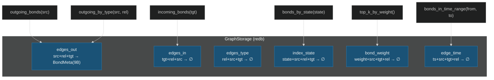
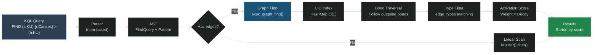
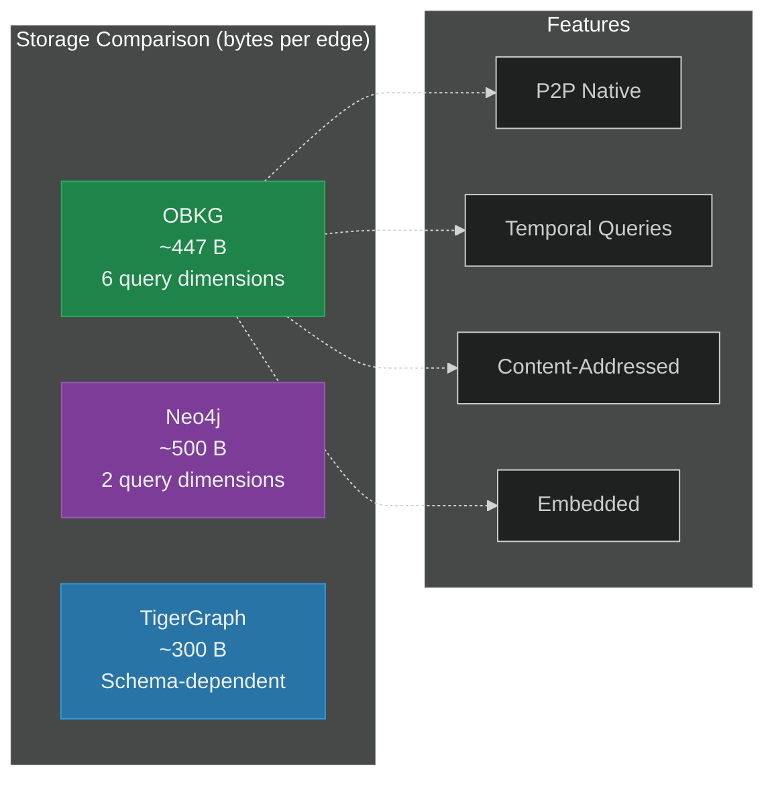

> *"The purpose of a storage system is not merely to remember, but to remember efficiently."*

# 7. Persistent Storage and Graph Query Extensions

The OneBrain Knowledge Graph must persist millions of bonds across peer restarts, support sub-millisecond lookups by source, target, type, state, weight, and time, and expose these capabilities through a query language that feels as natural as SQL. This chapter presents our **six-table persistent index** (§7.1), the **KQL graph query extensions** (§7.2) that surface graph traversal, temporal filtering, and distributed scope management, and a **scalability analysis** (§7.3) demonstrating that the design remains practical from personal knowledge bases (10K bonds) to research-scale deployments (1M+ bonds).

---

## §7.1 Six-Table Persistent Index

### 7.1.1 Design Philosophy: Index-Based Adjacency

Traditional graph databases like Neo4j employ **index-free adjacency** [1]: each node contains a physical pointer to its neighbors, enabling $O(1)$ edge traversal. This works well for single-machine databases but fails fundamentally in a **P2P network** where nodes are identified by content-addressed CIDs (`[u8; 32]`) and may reside on any peer in the swarm. Physical pointers cannot cross network boundaries.

We therefore adopt an **index-based** design where every query is served by a prefix scan on a sorted B+-tree table [2]. The key insight is that by carefully constructing **composite byte keys** with the most-selective dimension as the leading prefix, we achieve $O(1)$ seek + $O(k)$ scan where $k$ is the number of matching results—equivalent to index-free adjacency for local queries, while remaining compatible with content-addressed distributed storage.

### 7.1.2 The GraphStorage Struct

The `GraphStorage` struct wraps a **redb** database [3]—a pure-Rust, ACID-compliant embedded key-value store with B+-tree indexing. The entire module is feature-gated behind `#[cfg(feature = "storage")]` to keep the core crate dependency-free:

```rust
pub struct GraphStorage {
    db: Database,
}

impl GraphStorage {
    pub fn open(path: &Path) -> Result<Self, StorageError> {
        let db = Database::create(path)
            .map_err(|e| StorageError::DatabaseError(format!("{}", e)))?;

        // Ensure all 6 tables exist on first open
        let txn = db.begin_write()?;
        {
            let _ = txn.open_table(TABLE_EDGES_OUT)?;
            let _ = txn.open_table(TABLE_EDGES_IN)?;
            let _ = txn.open_table(TABLE_EDGES_TYPE)?;
            let _ = txn.open_table(TABLE_INDEX_STATE)?;
            let _ = txn.open_table(TABLE_BOND_WEIGHT)?;
            let _ = txn.open_table(TABLE_EDGE_TIME)?;
        }
        txn.commit()?;

        // Schema versioning via OBS schema registry
        obs_schema::redb_schema::ensure_schema(
            &db, &obs_schema::graph_storage_registry()
        )?;

        Ok(Self { db })
    }
}
```

### 7.1.3 The Six Tables

Each of the six tables is optimized for a specific query pattern. The **primary table** (`edges_out`) stores the full `BondMeta` value; the remaining five are **secondary indices** with empty values, serving purely as sorted key sets for prefix-scan queries.

**Table 7.1**: OBKG Six-Table Index Architecture

| Table | Key Layout | Key Size | Value | Purpose |
|:---|:---|:---:|:---|:---|
| `edges_out` | `src(32) + rel(1) + tgt(32)` | 65 B | `BondMeta` (9 B) | Primary outgoing edge index |
| `edges_in` | `tgt(32) + rel(1) + src(32)` | 65 B | empty | Reverse (incoming) index |
| `edges_type` | `rel(1) + src(32) + tgt(32)` | 65 B | empty | Type-filtered traversal |
| `index_state` | `state(1) + src(32) + rel(1) + tgt(32)` | 66 B | empty | Lifecycle state filter |
| `bond_weight` | `weight(2 BE) + src(32) + tgt(32) + rel(1)` | 67 B | empty | Weight-ordered ranking |
| `edge_time` | `ts(4 BE) + src(32) + tgt(32) + rel(1)` | 69 B | empty | Temporal range queries |

The **BondMeta** value stored in `edges_out` is a compact 9-byte big-endian struct:

```rust
/// Layout: [weight:2][creator:1][state:1][decay:1][timestamp:4]
pub struct BondMeta {
    pub weight: u16,
    pub creator: Creator,
    pub state: EdgeState,
    pub decay: DecayRate,
    pub timestamp: u32,
}

impl BondMeta {
    pub fn to_bytes(&self) -> [u8; 9] {
        let mut buf = [0u8; 9];
        buf[0..2].copy_from_slice(&self.weight.to_be_bytes());
        buf[2] = self.creator as u8;
        buf[3] = self.state as u8;
        buf[4] = self.decay as u8;
        buf[5..9].copy_from_slice(&self.timestamp.to_be_bytes());
        buf
    }
}
```

### 7.1.4 Composite Key Construction

Each table has a dedicated key builder function that constructs a fixed-size byte array with dimensions ordered for optimal prefix scanning:

```rust
/// Build a 65-byte key: src(32) + rel(1) + tgt(32)
fn make_out_key(src: &[u8; 32], rel: RelationType, tgt: &[u8; 32]) -> [u8; 65] {
    let mut k = [0u8; 65];
    k[..32].copy_from_slice(src);
    k[32] = rel as u8;
    k[33..65].copy_from_slice(tgt);
    k
}

/// Build a 69-byte key: timestamp(4 BE) + src(32) + tgt(32) + rel(1)
fn make_time_key(ts: u32, src: &[u8; 32], tgt: &[u8; 32], rel: RelationType) -> [u8; 69] {
    let mut k = [0u8; 69];
    k[0..4].copy_from_slice(&ts.to_be_bytes());
    k[4..36].copy_from_slice(src);
    k[36..68].copy_from_slice(tgt);
    k[68] = rel as u8;
    k
}
```

Note the use of **big-endian** encoding for numeric fields (`weight`, `timestamp`). This is critical: redb sorts keys lexicographically, and big-endian encoding preserves numeric ordering under lexicographic comparison. A weight of `8000` (`0x1F40`) sorts correctly after `5000` (`0x1388`) only in big-endian form.



### 7.1.5 Atomic Multi-Table Updates

Every bond mutation touches all six tables within a **single redb write transaction**, ensuring atomicity. The `insert_bond` method first checks for an existing bond to clean stale secondary index entries, then writes all six entries:

```rust
pub fn insert_bond(
    &self, src: &[u8; 32], tgt: &[u8; 32],
    rel: RelationType, meta: &BondMeta,
) -> Result<(), StorageError> {
    let meta_bytes = meta.to_bytes();
    let out_key = make_out_key(src, rel, tgt);
    let in_key = make_in_key(tgt, rel, src);
    let type_key = make_type_key(rel, src, tgt);
    let state_key = make_state_key(meta.state, src, rel, tgt);
    let weight_key = make_weight_key(meta.weight, src, tgt, rel);
    let time_key = make_time_key(meta.timestamp, src, tgt, rel);

    let txn = self.db.begin_write()?;
    {
        let mut out_table = txn.open_table(TABLE_EDGES_OUT)?;
        // Remove stale secondary indices if bond already exists
        if let Some(old_guard) = out_table.get(out_key.as_slice())? {
            let old_meta = BondMeta::from_bytes(/* ... */);
            // Remove old weight, time, state index entries
        }
        // Insert into all 6 tables
        out_table.insert(out_key.as_slice(), meta_bytes.as_slice())?;
        txn.open_table(TABLE_EDGES_IN)?.insert(in_key.as_slice(), &[] as &[u8])?;
        txn.open_table(TABLE_EDGES_TYPE)?.insert(type_key.as_slice(), &[] as &[u8])?;
        txn.open_table(TABLE_INDEX_STATE)?.insert(state_key.as_slice(), &[] as &[u8])?;
        txn.open_table(TABLE_BOND_WEIGHT)?.insert(weight_key.as_slice(), &[] as &[u8])?;
        txn.open_table(TABLE_EDGE_TIME)?.insert(time_key.as_slice(), &[] as &[u8])?;
    }
    txn.commit()?;
    Ok(())
}
```

The `remove_bond` method mirrors this: it reads `BondMeta` from `edges_out` to reconstruct all secondary keys, then removes all six entries atomically. The `update_bond_state` method is optimized to touch only `edges_out` (updated meta) and `index_state` (old key removed, new key inserted).

### 7.1.6 Query Methods

The core query methods exploit **prefix scanning**—starting a range scan at the prefix and breaking when the prefix no longer matches:

```rust
pub fn outgoing_bonds(&self, src: &[u8; 32])
    -> Result<Vec<(RelationType, [u8; 32], BondMeta)>, StorageError>
{
    let txn = self.db.begin_read()?;
    let table = txn.open_table(TABLE_EDGES_OUT)?;
    let mut results = Vec::new();
    for result in table.range::<&[u8]>(src.as_slice()..)? {
        let (key, value) = result?;
        let k = key.value();
        if !k.starts_with(src) { break; }  // prefix exhausted
        if k.len() != 65 { continue; }
        let rel = RelationType::from_u8(k[32]);
        let mut tgt = [0u8; 32];
        tgt.copy_from_slice(&k[33..65]);
        let meta = BondMeta::from_bytes(/* value.value() */);
        results.push((rel, tgt, meta));
    }
    Ok(results)
}
```

The `outgoing_by_type` method narrows the prefix to 33 bytes (`src(32) + rel(1)`), and `bonds_in_time_range` leverages the big-endian timestamp prefix to efficiently scan temporal windows:

```rust
pub fn bonds_in_time_range(&self, from: u32, to: u32)
    -> Result<Vec<([u8; 32], [u8; 32], u32)>, StorageError>
{
    let txn = self.db.begin_read()?;
    let table = txn.open_table(TABLE_EDGE_TIME)?;
    let start = from.to_be_bytes();
    let mut results = Vec::new();
    for result in table.range::<&[u8]>(start.as_slice()..)? {
        let (key, _) = result?;
        let k = key.value();
        let ts = u32::from_be_bytes([k[0], k[1], k[2], k[3]]);
        if ts > to { break; }  // past upper bound
        // Extract src and tgt from key bytes...
        results.push((src, tgt, ts));
    }
    Ok(results)
}
```

---

## §7.2 KQL Graph Extensions

The Knowledge Query Language (KQL) extends beyond the basic FIND/CREATE/UPDATE operations described in prior work with graph-specific constructs for traversal, temporal queries, and distributed scope management.

### 7.2.1 Graph Pattern Syntax

KQL supports **Cypher-inspired** [4] graph patterns with typed, directed edges:

```
FIND (a:KU)-[r:Extends]->(b:KU) WHERE a.trust_score > 7000
```

The parser recognizes three edge directions:
- **Outgoing**: `-[r:Type]->`
- **Incoming**: `<-[r:Type]-`
- **Undirected**: `-[r:Type]-`

Edge patterns support **pipe-separated multi-type** filtering and **variable-depth traversal**:

```sql
-- Multi-type edge filter
FIND (a:KU)-[r:Extends|Supplements]->(b:KU) WHERE r.weight > 5000

-- Variable-depth path (2 to 5 hops)
FIND (a:KU)-[*2..5 r:Causes]->(b:KU) LIMIT 20
```

### 7.2.2 Temporal Query Clauses

The parser supports two temporal clauses integrated with the EventAccumulator (§6.1):

```sql
-- Point-in-time query: reconstruct graph state at timestamp
FIND (ku:KU) AT TIME 1719792000
    WHERE ku.epistemic_status = "Corroborated"

-- Range query: find bonds active during interval
FIND (a:KU)-[b:Causes]->(c:KU) DURING 1704067200 1719792000
    WHERE b.weight > 5000

-- History query: retrieve bond event history
FIND HISTORY (ku:KU) WHERE ku.concept_id = 42
```

The `AT TIME` clause triggers `EventAccumulator::replay_at_time(timestamp)`, materializing the graph state at the specified moment. The `DURING` clause filters bonds whose `ValidFrom`/`ValidUntil` qualifiers (§6.2) overlap the specified interval. The `FIND HISTORY` clause returns the full event log for matching bonds.

### 7.2.3 SCOPE-Aware Distributed Queries

Every KQL query carries a **scope** directive that controls the search radius across the P2P network:

```sql
-- Local-only: search this peer's store
FIND (ku:KU) WHERE ku.weight > 8000 SCOPE local

-- Cluster-wide: query via super-peer routing
FIND (ku:KU)-[r:Corroborates]->(target) SCOPE cluster

-- Global: flood the entire network
FIND (ku:KU) WHERE ku.epistemic_status = "Axiom" SCOPE global
```

| Scope | Strategy | Latency | Completeness |
|:---|:---|:---|:---|
| `local` | Local store scan | $< 1\text{ms}$ | Peer-local only |
| `neighbors` | 1-hop broadcast | $\sim 10\text{ms}$ | Immediate neighbors |
| `cluster` | Super-peer routing | $\sim 50\text{ms}$ | Cluster-complete |
| `dht` | Kademlia lookup | $\sim 100\text{ms}$ | Key-specific |
| `semantic` | Embedding similarity | $\sim 200\text{ms}$ | Approximate top-k |
| `global` | Network flood | $\sim 500\text{ms}$ | Best-effort global |
| `auto` | Escalation ladder | Adaptive | Progressive refinement |

The `auto` scope (default) implements a **progressive escalation** strategy: start with `local`, and if fewer than the requested `LIMIT` results are found, automatically widen to `neighbors`, then `cluster`, continuing until the result set is satisfied or `global` is reached.

### 7.2.4 Integration with Spreading Activation

Graph traversal queries integrate with the **Spreading Activation** mechanism (§4.3) for relevance-ranked results. When a FIND query follows edge patterns, each traversed bond's weight contributes to an activation score:

$$A(v) = \sum_{u \in \text{neighbors}(v)} w(u, v) \cdot A(u) \cdot d$$

where $w(u,v)$ is the normalized bond weight and $d \in [0,1]$ is the decay factor per hop. Results are returned sorted by activation score rather than insertion order, ensuring that strongly-connected, heavily-reinforced paths rank highest.



### 7.2.5 Example Queries

```sql
-- Traverse outgoing causal bonds with weight threshold
FIND (ku:KU)-[b:Causes]->(target:KU)
    WHERE b.weight > 5000
    LIMIT 10

-- Temporal query: graph state at specific moment
FIND (ku:KU) AT TIME 1719792000
    WHERE ku.epistemic_status = "Corroborated"

-- Edge filtering across cluster scope
FIND (a:KU)-[r:Corroborates]->(b:KU)
    WHERE r.weight > 8000
    SCOPE cluster

-- Multi-hop path query with depth control
FIND (start:KU)-[*1..3 r:Extends|DerivedFrom]->(end:KU)
    WHERE start.concept_id = 42
    RETURN COUNT(end) AS chain_length

-- Bond history for audit trail
FIND HISTORY (ku:KU)
    WHERE ku.trust_score < 3000
    SCOPE local
```

---

## §7.3 Scalability Analysis

### 7.3.1 Per-Bond Storage Overhead

Each bond occupies space in all six tables. We compute the total per-bond overhead:

| Component | Bytes | Count | Subtotal |
|:---|:---:|:---:|:---:|
| `edges_out` key | 65 | 1 | 65 |
| `edges_out` value (BondMeta) | 9 | 1 | 9 |
| `edges_in` key | 65 | 1 | 65 |
| `edges_type` key | 65 | 1 | 65 |
| `index_state` key | 66 | 1 | 66 |
| `bond_weight` key | 67 | 1 | 67 |
| `edge_time` key | 69 | 1 | 69 |
| B+-tree overhead (~10%) | — | — | ~41 |
| **Total per bond** | | | **~447** |

The raw key+value cost is 406 bytes; adding $\approx 10\%$ B+-tree node overhead (internal pointers, page alignment) yields $\approx 447$ bytes per bond. This is competitive with Neo4j's $\approx 500$ bytes per relationship [1] while providing six query dimensions versus Neo4j's two (forward/reverse adjacency).

### 7.3.2 Storage Projections

**Table 7.2**: Projected storage requirements at various scales

| Scale | Bonds | Bond Storage | Entities (70 B each) | Total | Notes |
|:---|---:|---:|---:|---:|:---|
| Personal | 10,000 | ~4.5 MB | 700 KB | **~5 MB** | Single-user knowledge base |
| Team | 100,000 | ~45 MB | 7 MB | **~52 MB** | Small team collaboration |
| Research | 1,000,000 | ~450 MB | 70 MB | **~520 MB** | Research group scale |
| Enterprise | 10,000,000 | ~4.5 GB | 700 MB | **~5.2 GB** | Department-level deployment |

These projections assume an average entity (KU) size of 70 bytes (CoreDNA header + 2–3 instructions in varint encoding). At the personal scale (10K bonds), the entire knowledge graph fits comfortably in an L3 cache. At research scale (1M bonds), the database remains well within the capacity of any modern SSD.

### 7.3.3 Query Performance

The prefix-scan design ensures that query cost depends on **result set size**, not total database size:

| Query Type | Complexity | Key Prefix | Notes |
|:---|:---|:---|:---|
| `outgoing_bonds(src)` | $O(k)$ | 32 bytes | $k$ = outgoing degree |
| `incoming_bonds(tgt)` | $O(k)$ | 32 bytes | $k$ = incoming degree |
| `outgoing_by_type(src, rel)` | $O(k)$ | 33 bytes | $k$ = type-filtered degree |
| `bonds_in_time_range(from, to)` | $O(k)$ | 4 bytes | $k$ = bonds in range |
| `stats()` | $O(N)$ | full scan | $N$ = total bonds |

For a node with 50 outgoing bonds in a database of 1M total bonds, `outgoing_bonds()` performs a single B+-tree seek ($O(\log N)$) followed by 50 sequential reads—effectively constant-time relative to database size.

### 7.3.4 Comparison with Graph Database Systems

| Feature | OBKG (redb) | Neo4j [1] | TigerGraph [5] |
|:---|:---|:---|:---|
| **Adjacency model** | Index-based (B+-tree) | Index-free adjacency | Index-based (compressed) |
| **Per-edge storage** | ~447 bytes | ~500 bytes | ~300 bytes |
| **Query dimensions** | 6 (out, in, type, state, weight, time) | 2 (out, in) | Varies by schema |
| **Temporal queries** | Native (edge_time table) | Plugin (APOC) | Limited |
| **Distribution model** | P2P (content-addressed) | Leader-follower | Distributed partitioned |
| **Embedded** | Yes (redb) | No (server) | No (server) |
| **Rust-native** | Yes | No (Java) | No (C++) |
| **ACID transactions** | Yes (redb) | Yes | Yes |
| **Content-addressed** | Yes (BLAKE3 CIDs) | No | No |

OBKG's six-table design trades ~20% additional storage versus a minimal two-index scheme for the ability to serve any of six query patterns without secondary index construction. This is a deliberate design choice: in a P2P system where peers may go offline at any time, pre-built indices eliminate the latency of on-demand index construction.



---

## References

[1] Neo4j, Inc., "The Neo4j Graph Database," neo4j.com, 2023. [Online]. Available: https://neo4j.com/docs/

[2] D. Comer, "The ubiquitous B-tree," *ACM Computing Surveys*, vol. 11, no. 2, pp. 121–137, 1979.

[3] C. Olson, "redb: An embedded key-value store written in pure Rust," 2023. [Online]. Available: https://github.com/cberner/redb

[4] N. Francis et al., "Cypher: An evolving query language for property graphs," in *Proc. ACM SIGMOD*, 2018, pp. 1433–1445.

[5] TigerGraph, Inc., "TigerGraph: A Native Parallel Graph Database," 2022. [Online]. Available: https://www.tigergraph.com/

[6] H. Chu, "Lightning Memory-Mapped Database (LMDB)," Symas Corporation, 2023. [Online]. Available: https://www.symas.com/lmdb

[7] Facebook, Inc., "RocksDB: A Persistent Key-Value Store for Fast Storage Environments," 2023. [Online]. Available: https://rocksdb.org/

[8] S. Harris and A. Seaborne, "SPARQL 1.1 Query Language," W3C Recommendation, 2013. [Online]. Available: https://www.w3.org/TR/sparql11-query/

[9] J. Benet, "IPFS—Content Addressed, Versioned, P2P File System," arXiv:1407.3561, 2014.

[10] S. P. Huynh, "Knowledge Query Language (KQL): A Domain-Specific Language for the OneBrain Knowledge Graph," OneBrain Technical Report, 2026.
