> *"The mark of a well-designed system is not the elegance of its parts, but the grace of their composition."*

# 8. Cross-Pillar Integration

The previous chapters presented the OBKG's internal mechanisms in isolation — embeddings, decay, STDP, dream consolidation, federated learning, and storage. Each was designed as a self-contained module with clearly defined inputs and outputs. In this chapter we shift perspective from **mechanism** to **composition**: how do thirteen new modules integrate with the five existing OneBrain pillars without breaking a single line of their code?

The answer lies in a strict **Adapter Pattern** first proven during the OBT (Pillar 5) integration and now applied again for the OBKG (Pillar 7). We detail the four integration modules — `obkg_bridge.rs`, `obkg_orchestrator.rs`, `obkg_rewards.rs`, and `graph_gossip.rs` — that together provide a complete read–compute–reward–gossip pipeline connecting OBKG to the rest of the OneBrain architecture.

---

## §8.1 Design Principle: Composition Over Modification

The central engineering constraint of the OBKG integration can be summarised in a single sentence:

> **Pillar 7 builds bridges; it doesn't break foundations.**

Every graph-level capability introduced in chapters 3–7 was designed so that existing KU Core (P1), OBP Network (P2), KQL (P3), PoMV (P4), and OBT (P5) modules require **zero modifications**. New functionality is delivered exclusively through **additive modules** that read from existing types and produce new outputs. This approach follows the precedent set by OBT integration (§3.6), which connected the token economy to the lifecycle layer through the same adapter pattern [1].

### Table 8.1 — Impact on Existing Pillars

| Pillar | Description | Code Modified | New Code Added |
|--------|-------------|:-------------:|----------------|
| **P1** KU Core | Knowledge Unit runtime, epigenetics, lifecycle | ✗ None | +3 modules (`obkg_bridge`, `obkg_orchestrator`, `obkg_rewards`) |
| **P2** OBP Network | Peer-to-peer transport, DHT, gossip | ✗ None | +1 module (`graph_gossip`) |
| **P3** KQL | Query language, graph storage | ✗ None | +1 module (`graph_storage`) |
| **P4** PoMV | Proof of Meaningful Value consensus | ✗ None | ✗ None |
| **P5** OBT | Token economics, minting pipeline | ✗ None | ✗ None |

**Total: 0 modified files, 5 new additive modules.**

The zero-modification guarantee is enforced structurally: every integration module depends on public types from P1–P5 via `use` imports; no module holds mutable references to core structs beyond what the existing API already exposes. The composition forms a one-way dependency graph:

```mermaid
%%{init: {'theme': 'dark', 'themeVariables': {'primaryColor': '#1a1a2e', 'primaryTextColor': '#e0e0e0', 'primaryBorderColor': '#0f3460', 'lineColor': '#e94560', 'secondaryColor': '#16213e', 'tertiaryColor': '#0f3460'}}}%%
graph LR
    subgraph Existing["Existing Pillars (unmodified)"]
        P1["P1 — KU Core"]
        P2["P2 — OBP Network"]
        P3["P3 — KQL"]
        P4["P4 — PoMV"]
        P5["P5 — OBT"]
    end

    subgraph New["P7 — OBKG (additive only)"]
        B["obkg_bridge"]
        O["obkg_orchestrator"]
        R["obkg_rewards"]
        G["graph_gossip"]
        S["graph_storage"]
    end

    P1 -->|"reads KuRuntime, Bond, Epigenetics"| B
    B --> O
    O -->|"composes KuLifecycle"| P1
    O -->|"PoMV scores"| P4
    R -->|"GraphContributionScore"| P5
    G -->|"wire protocol 0xB0–0xB3"| P2
    S -->|"redb persistence"| P3

    style Existing fill:#0f3460,stroke:#e94560,stroke-width:2px
    style New fill:#16213e,stroke:#00d2ff,stroke-width:2px
```



As Gamma et al. [1] formalised: the Adapter pattern converts the interface of a class into another interface clients expect, letting classes work together that otherwise could not. In our context, the "classes" are entire subsystem pillars, and the "interfaces" are the type-safe Rust structs and traits that flow between them.

---

## §8.2 Read-Only Bridge (`obkg_bridge.rs`)

The **OBKG Bridge** module is the single point of contact between existing P1 types (`KuRuntime`, `Bond`, `Epigenetics`) and the OBKG engine inputs (`BondEvent`, `BondMeta`, `EntityEmbedding`, `AccessRecord`, `CoAccess`, `ConsolidationCandidate`). It contains **12 pure adapter functions** organised into six functional groups. Every function is read-only: it borrows `&KuRuntime` or `&HashMap<[u8; 32], KuRuntime>` and returns new OBKG-typed values without mutation.

### §8.2.1 Bond Conversion (Group 1)

The first group converts P1 `Bond` structs into OBKG `BondEvent` and `BondMeta` types:

```rust
/// Convert a Bond creation into a BondEvent.
pub fn bond_to_created_event(
    source_cid: &[u8; 32],
    bond: &Bond,
    timestamp: u64,
) -> BondEvent {
    BondEvent::Created {
        source_cid: *source_cid,
        target_cid: cid_from_bond_target(&bond.target_cid),
        relation: bond.relation,
        weight: bond.weight,
        creator: bond.creator,
        evidence: bond.evidence.clone(),
        timestamp,
    }
}
```

The helper `cid_from_bond_target` handles the type mismatch between P1's variable-length `Vec<u8>` target CIDs and OBKG's fixed `[u8; 32]` CIDs. It copies up to 32 bytes from the source, zero-padding shorter CIDs — a **zero-copy** approach where possible, with minimal allocation:

```rust
pub fn cid_from_bond_target(target: &[u8]) -> [u8; 32] {
    let mut cid = [0u8; 32];
    let len = target.len().min(32);
    cid[..len].copy_from_slice(&target[..len]);
    cid
}
```

The `collect_bond_metas` function iterates over a single KU's bonds and returns `(source, target, relation, BondMeta)` tuples suitable for the `RelationTable` and `DecayRunner`. For batch collection across all KUs, `collect_all_bonds` builds a `HashMap` keyed by the `(source_cid, target_cid, RelationType)` triple — the canonical bond identity used throughout the OBKG engine.

### §8.2.2 Embedding Bridge (Group 2)

Entity embeddings are initialised deterministically from a KU's content-addressed CID:

```rust
pub fn ku_to_entity_embedding(ku: &KuRuntime) -> ([u8; 32], EntityEmbedding) {
    (ku.cid, EntityEmbedding::from_seed(&ku.cid))
}
```

Because `from_seed` is a pure function of the CID bytes, the same KU always produces the same initial embedding regardless of when or where the conversion occurs. This **deterministic seeding** property is critical for federated consistency (§7): two nodes that hold the same KU must agree on its initial embedding vector before federated averaging begins.

### §8.2.3 Dream Engine Bridge (Group 3)

The dream engine (§6) requires `AccessRecord` structs that encode which bonds have been recently accessed. Since P1's `Bond` type does not track access counts directly, the bridge uses **bond weight as a proxy for access frequency**:

```rust
pub fn build_access_log(
    kus: &HashMap<[u8; 32], KuRuntime>,
    min_weight: u16,
) -> Vec<AccessRecord> {
    // Filters by min_weight, converts weight → access_count proxy
    // access_count = (weight / 100).max(1)
    // last_access  = bond.created_at
}
```

The `min_weight` threshold parameter prevents low-relevance bonds from polluting the dream engine's replay queue, acting as a noise gate analogous to the synaptic strength threshold below which biological neurons do not fire [2].

### §8.2.4 STDP Bridge (Group 4)

The `build_co_accesses` function generates `CoAccess` records from bond pairs within the same KU that were created within a **24-hour temporal window** (`delta_t.abs() < 86400.0`). The delta-t between bond creation timestamps serves as the spike timing interval for STDP (§4):

```rust
pub fn build_co_accesses(
    kus: &HashMap<[u8; 32], KuRuntime>,
) -> Vec<CoAccess> {
    // For each KU, for each pair (i, j) of bonds:
    //   delta_t = created_at[j] - created_at[i]
    //   if |delta_t| < 86400: emit CoAccess
}
```

The 24-hour window mirrors the biological observation that synaptic consolidation occurs primarily for co-activated neurons within a single circadian cycle [3].

### §8.2.5 Consolidation Bridge (Group 5)

`build_consolidation_candidates` prepares KU metadata for the dream engine's consolidation phase. Since `CoreDnaHeader` does not carry a timestamp field, the function estimates KU age from the **earliest bond creation timestamp** — a pragmatic proxy that avoids modifying the immutable DNA header:

```rust
pub fn build_consolidation_candidates(
    kus: &HashMap<[u8; 32], KuRuntime>,
    now_secs: u64,
) -> Vec<ConsolidationCandidate> {
    // age_hours = (now - earliest_bond.created_at) / 3600
    // pomv_score = ku.epi.pomv_score()
    // bond_count = ku.epi.bonds.len()
}
```

### §8.2.6 Diff Detection (Group 6)

The final group implements **snapshot diffing** for the orchestrator's tick pipeline. `diff_bonds` returns bonds present in the current snapshot but absent from the previous one; `removed_bonds` returns the inverse:

```rust
pub fn diff_bonds(
    previous: &HashMap<(…), BondMeta>,
    current:  &HashMap<(…), BondMeta>,
) -> Vec<(…, BondMeta)> {
    current.iter()
        .filter(|(key, _)| !previous.contains_key(key))
        .map(|(key, meta)| (key.0, key.1, key.2, *meta))
        .collect()
}
```

Together, `diff_bonds` and `removed_bonds` enable the event-sourcing model (§3.3): the orchestrator detects structural changes per tick and emits `BondEvent::Created` or state-change events accordingly.

### Table 8.2 — Adapter Function Catalog

| # | Function | Source Type | Target Type | Purpose |
|---|----------|-------------|-------------|---------|
| 1 | `bond_to_created_event` | `&Bond` | `BondEvent::Created` | Convert bond creation to event |
| 2 | `cid_from_bond_target` | `&[u8]` | `[u8; 32]` | Normalise variable-length CIDs |
| 3 | `collect_bond_metas` | `&KuRuntime` | `Vec<(src, tgt, rel, BondMeta)>` | Extract bonds from single KU |
| 4 | `collect_all_bonds` | `&HashMap<…, KuRuntime>` | `HashMap<…, BondMeta>` | Batch bond collection |
| 5 | `collect_bonds_for_decay` | `&HashMap<…, KuRuntime>` | `Vec<((src,tgt), Bond)>` | Prepare bonds for DecayRunner |
| 6 | `ku_to_entity_embedding` | `&KuRuntime` | `([u8;32], EntityEmbedding)` | Deterministic embedding init |
| 7 | `collect_entity_embeddings` | `&HashMap<…, KuRuntime>` | `Vec<(cid, EntityEmbedding)>` | Batch embedding collection |
| 8 | `build_access_log` | `&HashMap<…, KuRuntime>` | `Vec<AccessRecord>` | Dream replay queue |
| 9 | `build_co_accesses` | `&HashMap<…, KuRuntime>` | `Vec<CoAccess>` | STDP timing pairs |
| 10 | `build_consolidation_candidates` | `&HashMap<…, KuRuntime>` | `Vec<ConsolidationCandidate>` | Dream consolidation input |
| 11 | `diff_bonds` | Two `HashMap<…, BondMeta>` | `Vec<(src, tgt, rel, BondMeta)>` | Detect new bonds |
| 12 | `removed_bonds` | Two `HashMap<…, BondMeta>` | `Vec<(src, tgt, rel)>` | Detect deleted bonds |

---

## §8.3 Orchestrator (`obkg_orchestrator.rs`)

While the bridge translates types, the **ObkgOrchestrator** composes engines. It is the central coordinator that wraps `KuLifecycle` (P1) and layers on all graph-level subsystems without modifying the lifecycle's behaviour. The design follows the Decorator pattern [1]: the orchestrator delegates core operations to `KuLifecycle` and intercepts the data flow to inject graph-level processing at each step.

### §8.3.1 Composition Structure

The orchestrator holds seven components:

```rust
pub struct ObkgOrchestrator {
    /// The underlying KU lifecycle manager.
    pub lifecycle: KuLifecycle,
    /// Event accumulator for bond lifecycle tracking.
    pub event_log: EventAccumulator,
    /// RotatE relation embedding table.
    pub relation_table: RelationTable,
    /// Orchestrator configuration.
    config: ObkgConfig,
    /// Dream engine for offline graph restructuring.
    dream_engine: DreamEngine,
    /// STDP engine for spike-timing-dependent plasticity.
    stdp: StdpEngine,
    /// Current bond snapshot: (source, target, relation) → BondMeta.
    bond_snapshot: HashMap<([u8;32], [u8;32], RelationType), BondMeta>,
    /// Monotonically increasing tick counter.
    tick_count: u64,
}
```

Each component corresponds to an OBKG chapter: `EventAccumulator` (§3.3), `RelationTable` (§3.4), `DreamEngine` (§6), `StdpEngine` (§4), and `bond_snapshot` (§3.3). The `KuLifecycle` itself is untouched — it is held as a public field so callers can still access it directly if needed.

### §8.3.2 Configuration

The `ObkgConfig` struct centralises all tuneable parameters:

```rust
pub struct ObkgConfig {
    pub dream: DreamConfig,         // Dream engine parameters
    pub stdp_tau: f64,              // STDP time constant (default: 3600s)
    pub stdp_a_plus: f64,           // LTP amplitude (default: 0.1)
    pub stdp_a_minus: f64,          // LTD amplitude (default: -0.05)
    pub dream_interval_ticks: u64,  // Dream cycle interval (default: 10)
    pub default_bond_weight: u16,   // Ingest bond weight (default: 5000)
}
```

The `with_defaults()` constructor provides sensible defaults for all parameters, allowing callers to bootstrap an OBKG-enabled system with a single line:

```rust
let orch = ObkgOrchestrator::with_defaults(lifecycle);
```

### §8.3.3 Five-Step Tick Pipeline

The orchestrator's `tick()` method implements the core processing loop. Each tick advances the graph state through five sequential stages:

```mermaid
%%{init: {'theme': 'dark', 'themeVariables': {'primaryColor': '#1a1a2e', 'primaryTextColor': '#e0e0e0', 'primaryBorderColor': '#0f3460', 'lineColor': '#e94560', 'secondaryColor': '#16213e', 'tertiaryColor': '#0f3460'}}}%%
graph TD
    T["tick(now, niche_stats)"] --> S1
    S1["① lifecycle.tick()
    PoMV scoring + epistemic transitions"] --> S2
    S2["② DecayRunner::run_decay()
    Time-based bond weight reduction"] --> S3
    S3["③ STDP placeholder
    Callers invoke process_stdp() explicitly"] --> S4
    S4{"④ tick_count % dream_interval == 0?"}
    S4 -->|Yes| S4a["DreamEngine::run_dream_cycle()
    Replay → Associate → Prune"]
    S4 -->|No| S5
    S4a --> S5
    S5["⑤ EventAccumulator.append()
    Log all generated BondEvents"] --> R
    R["Return ObkgTickResult"]

    style T fill:#0f3460,stroke:#e94560,stroke-width:2px
    style R fill:#0f3460,stroke:#00d2ff,stroke-width:2px
    style S4 fill:#16213e,stroke:#e94560,stroke-width:2px
```



**Stage 1 — Lifecycle Tick.** The orchestrator delegates to `lifecycle.tick(now, niche_stats)`, which computes PoMV scores (§P4) and manages epistemic state transitions. The returned `Vec<([u8; 32], PomvScore)>` is passed through unmodified.

**Stage 2 — Decay Pass.** All bonds in the `bond_snapshot` are converted to `(source_target_pair, Bond)` tuples and fed to `DecayRunner::run_decay()` (§5). The decay report's events are applied to the bond snapshot — weakened bonds have their weights updated; bonds reaching weight zero transition to `EdgeState::Deprecated`.

**Stage 3 — STDP.** The tick itself uses an empty co-access list as a placeholder. Real STDP processing is exposed via `process_stdp(&mut self, co_accesses: &[CoAccess])`, which callers invoke explicitly with data from `build_co_accesses()` (§8.2.4). This separation keeps the tick deterministic while allowing callers to control when STDP data is computed.

**Stage 4 — Dream Cycle.** The dream engine runs every `dream_interval_ticks` ticks (default: 10). When triggered, it executes the full replay–associate–prune cycle (§6). The `DreamReport` is included in the tick result only when a dream cycle actually ran; otherwise it is `None`.

**Stage 5 — Event Logging.** Every `BondEvent` generated in stages 2–4 is appended to the `EventAccumulator`, maintaining the complete event-sourced history required for audit and replay (§3.3).

### §8.3.4 Tick Result

The `ObkgTickResult` struct captures the full output of a single tick:

```rust
pub struct ObkgTickResult {
    pub pomv_scores: Vec<([u8; 32], PomvScore)>,  // From stage 1
    pub decay_report: DecayReport,                 // From stage 2
    pub stdp_updates: Vec<StdpUpdate>,             // From stage 3
    pub dream_report: Option<DreamReport>,         // From stage 4
    pub new_bonds_detected: usize,                 // Diff count
    pub tick_number: u64,                          // Current tick
}
```

This flat, serialisable struct enables downstream consumers — the reward module (§8.4), the gossip layer (§8.5), and external monitoring — to process tick results without coupling to the orchestrator's internal state.

### §8.3.5 Garbage Collection

The orchestrator extends P1's garbage collection with **orphan bond cleanup**:

```rust
pub fn gc(&mut self, now: u64) -> ObkgGcResult {
    // 1. Snapshot CIDs before GC
    let cids_before = self.lifecycle.kus.keys().copied().collect();
    // 2. Delegate to lifecycle.gc() — removes dead KUs
    let kus_removed = self.lifecycle.gc(now);
    // 3. Find removed CIDs
    let removed_cids = cids_before.difference(&cids_after);
    // 4. Clean orphaned bonds: src or tgt CID no longer exists
    let orphaned_keys = self.bond_snapshot.keys()
        .filter(|(src, tgt, _)| !cids_after.contains(src)
                             || !cids_after.contains(tgt));
    // Remove orphaned bonds from snapshot
}
```

This two-phase GC ensures referential integrity: after lifecycle GC removes a KU, any bonds that referenced it as source or target are purged from the bond snapshot. The `ObkgGcResult` reports `kus_removed`, `orphaned_bonds_cleaned`, and `removed_cids` for monitoring.

---

## §8.4 Reward Scoring (`obkg_rewards.rs`)

The OBKG–OBT bridge closes the loop between graph activity and token economics. The `obkg_rewards` module contains pure functions that read graph metrics and produce a normalised **`GraphContributionScore`** suitable for the OBT minting pipeline (§3.6 of the OBT paper [5]).

### §8.4.1 Four-Dimensional Scoring

The contribution score evaluates a node's graph activity across four orthogonal dimensions, each normalised to `[0.0, 1.0]` and capped to prevent gaming:

$$\text{total} = 0.35 \times \text{bond} + 0.25 \times \text{dream} + 0.20 \times \text{fedr} + 0.20 \times \text{health}$$

The weights sum to exactly `1.0`, a property enforced by a dedicated unit test:

```rust
const W_BOND: f64 = 0.35;
const W_DREAM: f64 = 0.25;
const W_FEDR: f64 = 0.20;
const W_HEALTH: f64 = 0.20;

#[test]
fn weights_sum_to_one() {
    let sum = W_BOND + W_DREAM + W_FEDR + W_HEALTH;
    assert!((sum - 1.0).abs() < 1e-9);
}
```

### Table 8.3 — Scoring Dimensions

| Dimension | Weight | Formula | Saturation Cap | Source |
|-----------|:------:|---------|:--------------:|--------|
| **Bond richness** | 0.35 | `0.5 × (active_count / 100) + 0.5 × (weight_sum / 500K)` | 1.0 | `BondMeta` index |
| **Dream contribution** | 0.25 | `(reinforced + associations + pruned) / 200` | 1.0 | `DreamReport` |
| **FedR participation** | 0.20 | `0.5 × (coverage / 33) + 0.5 × (triples / 10K)` | 1.0 | `RelationDelta` |
| **Graph health** | 0.20 | `active_bonds / total_bonds` (empty graph = 1.0) | 1.0 | `BondMeta` active ratio |

### §8.4.2 Bond Richness

The bond richness score rewards nodes that maintain a diverse, well-weighted bond index. It combines two sub-metrics at equal weight:

```rust
pub fn bond_richness_score(
    bonds: &HashMap<(…), BondMeta>,
) -> f64 {
    let (active_count, weight_sum) = bonds.values().fold(
        (0u64, 0u64),
        |(cnt, wsum), meta| {
            if meta.state == EdgeState::Active {
                (cnt + 1, wsum + meta.weight as u64)
            } else { (cnt, wsum) }
        },
    );
    clamp01(0.5 * (active_count as f64 / 100.0)
          + 0.5 * (weight_sum as f64 / 500_000.0))
}
```

Deprecated bonds are explicitly excluded — only `EdgeState::Active` bonds contribute. This incentivises active graph maintenance over passive bond accumulation.

### §8.4.3 Dream Contribution

The dream contribution score measures a node's participation in offline consolidation by summing three dream phase actions:

```rust
pub fn dream_contribution_score(report: &DreamReport) -> f64 {
    let total_actions = report.bonds_reinforced as f64
        + report.associations_created as f64
        + report.bonds_pruned as f64;
    clamp01(total_actions / 200.0)
}
```

All three phases — **replay** (reinforcement), **association** (creative discovery), and **pruning** (graph hygiene) — contribute equally. The cap of 200 actions prevents nodes from gaming the score by running unnecessarily aggressive dream cycles.

### §8.4.4 FedR Participation

This dimension rewards nodes that contribute to the federated embedding learning process (§7):

```rust
pub fn fedr_participation_score(delta: &RelationDelta) -> f64 {
    let coverage = delta.deltas.len() as f64 / 33.0;
    let triple_ratio = delta.triple_count as f64 / 10_000.0;
    clamp01(0.5 * coverage + 0.5 * triple_ratio)
}
```

**Relation coverage** (how many of the 33 relation types have training deltas) rewards breadth; **triple count** rewards volume. A node that trains on many relation types with substantial data scores highest.

### §8.4.5 Graph Health

The simplest dimension: the ratio of active bonds to total bonds:

```rust
pub fn graph_health_score(
    bonds: &HashMap<(…), BondMeta>,
) -> f64 {
    if bonds.is_empty() { return 1.0; }
    let active = bonds.values()
        .filter(|m| m.state == EdgeState::Active)
        .count() as f64;
    clamp01(active / bonds.len() as f64)
}
```

An empty graph returns `1.0` (no degradation). A graph with many weakened or deprecated bonds scores lower, incentivising proactive bond maintenance and timely GC.

### §8.4.6 Integration with OBT Minting

The `compute_graph_contribution` function composes all four dimensions into a single `GraphContributionScore`:

```rust
pub fn compute_graph_contribution(
    bonds: &HashMap<…, BondMeta>,
    dream: &DreamReport,
    fedr: &RelationDelta,
) -> GraphContributionScore {
    let total = W_BOND * bond_richness_score(bonds)
              + W_DREAM * dream_contribution_score(dream)
              + W_FEDR  * fedr_participation_score(fedr)
              + W_HEALTH * graph_health_score(bonds);
    GraphContributionScore { bond_richness, dream_contribution,
                             fedr_participation, graph_health, total }
}
```

The resulting `total` field is a `f64` in `[0.0, 1.0]` that feeds directly into the OBT minting pipeline [5] as an additional signal alongside PoMV scores (§P4). Nodes that actively maintain healthy graphs, participate in federated learning, and run dream consolidation earn proportionally more OBT tokens.

---

## §8.5 Graph Gossip Protocol (`graph_gossip.rs`)

The final integration module extends the OBP wire protocol (P2) with four new message types in the `0xB0–0xB3` range, dedicated to OBKG graph-level communication. These messages carry federated learning deltas, graph health statistics, and dream reports across the peer-to-peer network.

### §8.5.1 Message Types

### Table 8.4 — Graph Gossip Wire Format

| Code | Type | Direction | Key Fields | Approx. Size |
|:----:|------|-----------|------------|:------------:|
| `0xB0` | **FedRDeltaPush** | Trainer → DHT neighbors | `peer_id`, `epoch`, `triple_count`, `deltas`, `signature` | ~2 KB |
| `0xB1` | **FedRDeltaPull** | Learner → Trainer | `requester_id`, `min_epoch` | ~36 B |
| `0xB2` | **GraphStatsMessage** | Node → Gossip ring | bond counts, `fedr_epoch`, `last_dream_at` | ~48 B |
| `0xB3` | **DreamReportMessage** | Node → Neighbors | `bonds_reinforced`, `associations_created`, `bonds_pruned` | ~32 B |

### §8.5.2 FedR Delta Push (`0xB0`)

The largest and most critical message type carries federated embedding deltas from a trainer node to its DHT neighbors:

```rust
#[derive(Debug, Clone, Serialize, Deserialize)]
pub struct FedRDeltaPush {
    pub peer_id: [u8; 32],       // Ed25519 public key
    pub epoch: u64,              // Training epoch number
    pub triple_count: u64,       // Triples used in training
    pub deltas: HashMap<u8, ([i8; 32], [i8; 32])>,  // Quantised deltas
    pub timestamp: u64,          // Unix millis, UTC
    pub signature: Vec<u8>,      // Ed25519 over BLAKE3(peer_id ‖ epoch ‖ …)
}
```

The `deltas` map uses the **relation type ID** as key, with each value being a pair of quantised 32-dimensional vectors `(head_delta, tail_delta)` encoded as `i8` arrays. This **int8 quantisation** reduces bandwidth by 4× compared to `f32` vectors while preserving sufficient precision for gradient averaging (§7). The Ed25519 signature over `BLAKE3(peer_id ‖ epoch ‖ triple_count ‖ deltas_cbor)` ensures authenticity and prevents delta injection attacks [8].

### §8.5.3 FedR Delta Pull (`0xB1`)

A compact request message for nodes that missed epochs:

```rust
pub struct FedRDeltaPull {
    pub requester_id: [u8; 32],  // Ed25519 public key
    pub min_epoch: u64,          // Earliest epoch needed
    pub timestamp: u64,          // Unix millis, UTC
}
```

At approximately 36 bytes, this is the lightest message in the protocol. A learner sends it to a known trainer to request all deltas from `min_epoch` onwards, enabling **catch-up synchronisation** for nodes that were offline during one or more training epochs.

### §8.5.4 Graph Stats (`0xB2`)

Periodically broadcast to the gossip ring, this message provides a global health snapshot:

```rust
pub struct GraphStatsMessage {
    pub peer_id: [u8; 32],
    pub total_bonds: u64,
    pub active_bonds: u64,
    pub weakened: u64,
    pub deprecated: u64,
    pub ku_count: u64,
    pub fedr_epoch: u64,
    pub last_dream_at: u64,
    pub timestamp: u64,
}
```

Neighbors aggregate these statistics to build a network-wide view of graph health — enabling adaptive strategies such as increasing dream frequency when the network-wide active-bond ratio drops below a threshold.

### §8.5.5 Dream Report (`0xB3`)

Broadcast after a dream consolidation cycle completes:

```rust
pub struct DreamReportMessage {
    pub peer_id: [u8; 32],
    pub bonds_reinforced: u64,
    pub total_weight_added: f64,
    pub associations_created: u64,
    pub bonds_pruned: u64,
    pub timestamp: u64,
}
```

This message serves dual purposes: (a) informing neighbors about local graph restructuring so they can anticipate changed bond patterns, and (b) providing evidence for the reward scoring module (§8.4.3) that the node actively participates in consolidation.

### §8.5.6 Serialisation and Dispatch

All four message types use **CBOR serialisation** via the `ciborium` crate [6], providing compact binary encoding with self-describing structure. Each type implements `to_cbor()` and `from_cbor()` methods:

```rust
impl FedRDeltaPush {
    pub fn to_cbor(&self) -> Vec<u8> {
        let mut buf = Vec::new();
        ciborium::into_writer(self, &mut buf)
            .expect("CBOR serialization should not fail");
        buf
    }

    pub fn from_cbor(data: &[u8]) -> Result<Self, String> {
        ciborium::from_reader(data)
            .map_err(|e| format!("CBOR decode error: {e}"))
    }
}
```

The unified `GraphGossipMessage` enum provides single-dispatch routing:

```rust
pub enum GraphGossipMessage {
    FedRPush(FedRDeltaPush),   // 0xB0
    FedRPull(FedRDeltaPull),   // 0xB1
    Stats(GraphStatsMessage),  // 0xB2
    Dream(DreamReportMessage), // 0xB3
}
```

The `dispatch_graph_message(msg_type: u8, payload: &[u8])` function matches on the wire code and deserialises the appropriate variant. The companion `is_graph_gossip_message(code: u8)` performs a simple range check `(0xB0..=0xB3).contains(&code)` to route messages at the OBP transport layer before attempting deserialisation.

### §8.5.7 Security Properties

All graph gossip messages carry Unix millisecond timestamps for ordering and freshness checks. The `FedRDeltaPush` message additionally carries an **Ed25519 signature** [8] over the concatenated hash of the message fields, preventing:

- **Delta injection**: A malicious node cannot forge embedding updates for another peer.
- **Replay attacks**: Epoch numbers and timestamps enable receivers to reject stale or duplicated deltas.
- **Tampering**: Any modification to the delta payload invalidates the signature.

The lighter messages (`0xB1`–`0xB3`) rely on transport-level authentication provided by the OBP network layer (P2) rather than per-message signatures, balancing security against overhead for non-critical telemetry data.

---

## §8.6 Summary

The cross-pillar integration demonstrates that a complex, biologically-inspired knowledge graph can be grafted onto an existing multi-pillar architecture with **zero modifications** to the original codebase. The four integration modules — bridge, orchestrator, rewards, and gossip — follow a consistent pattern:

1. **Read** existing types through public APIs (bridge)
2. **Compose** engines around existing lifecycle managers (orchestrator)
3. **Score** graph activity for the token economy (rewards)
4. **Gossip** graph-level telemetry across the peer network (gossip)

This pattern is reproducible: future pillars can follow the same adapter-based approach, composing over the existing architecture rather than modifying it.

---

## References

[1] E. Gamma, R. Helm, R. Johnson, and J. Vlissides, *Design Patterns: Elements of Reusable Object-Oriented Software*. Addison-Wesley, 1994.

[2] M. Fowler, *Patterns of Enterprise Application Architecture*. Addison-Wesley, 2002.

[3] G. Tononi and C. Bhatt, "Sleep and the price of plasticity: from synaptic and cellular homeostasis to memory consolidation and integration," *Neuron*, vol. 81, no. 1, pp. 12–34, 2014.

[4] OneBrain Foundation, "OneBrain KU Core: Knowledge Unit Architecture and Lifecycle," OneBrain Technical Paper Series, 2025.

[5] OneBrain Foundation, "OneBrain Token (OBT): Incentive Mechanisms for Decentralised Knowledge," OneBrain Technical Paper Series, 2025.

[6] `ciborium` — CBOR serialization for Rust. [Online]. Available: https://crates.io/crates/ciborium

[7] `redb` — Embedded key-value store for Rust. [Online]. Available: https://crates.io/crates/redb

[8] D. J. Bernstein, N. Duif, T. Lange, P. Schwabe, and B.-Y. Yang, "High-speed high-security signatures," *Journal of Cryptographic Engineering*, vol. 2, no. 2, pp. 77–89, 2012.
