> *"The best knowledge graphs are not built — they grow."*

# 10. Conclusion and Future Work

This paper has presented the **OneBrain Knowledge Graph (OBKG)**, a bio-inspired, decentralized knowledge graph that addresses four fundamental deficiencies of existing systems: temporal blindness, centralized control, epistemic flatness, and biological inertness. In this concluding chapter, we summarize our contributions (§10.1), argue for the necessity of *living* knowledge graphs (§10.2), candidly enumerate our limitations (§10.3), outline future work across three time horizons (§10.4), and reflect on the broader impact of epistemic-first, bio-inspired knowledge infrastructure (§10.5).

---

## §10.1 Summary of Contributions

We set out to answer a fundamental question: *Can a knowledge graph be made to learn, forget, dream, and evolve — as biological neural networks do?* Our answer is seven concrete contributions, each grounded in implemented, tested code.

### Table 10.1: Summary of Contributions

| # | Contribution | Section | Key Metric |
|---:|:---|:---:|:---|
| 1 | Bio-inspired 4-layer architecture | §3 | 13 modules, 8,515 LOC |
| 2 | STDP for adaptive bond weights | §4.1 | $\Delta w = A_{\pm} \cdot w \cdot e^{-|\Delta t|/\tau}$ |
| 3 | Dream Mode offline restructuring | §4.4 | 3-phase: Replay → Associate → Prune |
| 4 | RotatE int8 embeddings | §5.2 | 64 bytes/entity, 4× compression |
| 5 | FedR federated training | §5.4 | ~2 KB/round, privacy-preserving |
| 6 | Unified decay framework | §4.5 | 34 types → 4 tiers (∞ to 7d) |
| 7 | Comprehensive evaluation | §9 | 217 tests, 0 failures |

These seven contributions collectively address the four deficiencies identified in §1.1:

```mermaid
%%{init: {'theme': 'dark', 'themeVariables': {'primaryColor': '#1a1a2e', 'primaryTextColor': '#e0e0e0', 'primaryBorderColor': '#0f3460', 'lineColor': '#e94560', 'secondaryColor': '#16213e', 'tertiaryColor': '#0f3460', 'fontSize': '14px'}}}%%
graph LR
    subgraph Deficiencies["❌ Deficiencies"]
        D1["D1: Temporal<br/>Blindness"]
        D2["D2: Centralized<br/>Control"]
        D3["D3: Epistemic<br/>Flatness"]
        D4["D4: Biological<br/>Inertness"]
    end

    subgraph Contributions["✅ OBKG Contributions"]
        C6["C6: Unified Decay<br/>(4 tiers)"]
        C5["C5: FedR<br/>(~2 KB/round)"]
        C1["C1: 4-Layer<br/>Architecture"]
        C2["C2: STDP<br/>(Hebbian)"]
        C3["C3: Dream Mode<br/>(3 phases)"]
        C4["C4: RotatE int8<br/>(64 B/entity)"]
    end

    D1 --> C6
    D2 --> C5
    D2 --> C1
    D3 --> C1
    D4 --> C2
    D4 --> C3
    D4 --> C4

    style Deficiencies fill:#1a1a2e,stroke:#e94560,stroke-width:2px
    style Contributions fill:#16213e,stroke:#0f3460,stroke-width:2px
    style D1 fill:#2d1b36,stroke:#ff6b9d,stroke-width:1px,color:#e0e0e0
    style D2 fill:#2d1b36,stroke:#ff6b9d,stroke-width:1px,color:#e0e0e0
    style D3 fill:#2d1b36,stroke:#ff6b9d,stroke-width:1px,color:#e0e0e0
    style D4 fill:#2d1b36,stroke:#ff6b9d,stroke-width:1px,color:#e0e0e0
    style C1 fill:#1a2332,stroke:#4ecdc4,stroke-width:1px,color:#e0e0e0
    style C2 fill:#1a2332,stroke:#4ecdc4,stroke-width:1px,color:#e0e0e0
    style C3 fill:#1a2332,stroke:#4ecdc4,stroke-width:1px,color:#e0e0e0
    style C4 fill:#1a2332,stroke:#4ecdc4,stroke-width:1px,color:#e0e0e0
    style C5 fill:#1a2332,stroke:#4ecdc4,stroke-width:1px,color:#e0e0e0
    style C6 fill:#1a2332,stroke:#4ecdc4,stroke-width:1px,color:#e0e0e0
```

Contribution C7 (Comprehensive Evaluation, §9) spans all four deficiencies, validating each mechanism through 217 tests with zero failures.

---

## §10.2 Discussion: Why Knowledge Graphs Must Be Alive

The dominant paradigm in knowledge graph engineering treats knowledge as a **static commodity** — facts are inserted, occasionally updated, and queried. This paradigm inherits from the database tradition, where data integrity and ACID transactions are paramount. But knowledge is not data. Data records what *is*; knowledge captures what we *believe to be true, and why*. The distinction is epistemic, and it demands a fundamentally different engineering approach.

Consider a single triple: `(Drug_X, treats, Disease_Y)`. In a conventional knowledge graph, this triple exists as an immutable assertion. But in reality, the relationship between Drug_X and Disease_Y evolves continuously. A Phase I clinical trial might suggest efficacy (epistemic status: `Hypothesis`). A Phase III trial might confirm it (`PeerReviewed`). A post-market surveillance report might reveal adverse effects that weaken the association. A new meta-analysis might restore confidence. Throughout this lifecycle, the *fact* does not change — Drug_X either treats Disease_Y or it does not — but our *confidence* in the fact, and the *evidence supporting it*, fluctuate dramatically. OBKG's **BondType**, **EpistemicStatus**, and **decay tiers** encode this lifecycle directly into the bond wire format, making epistemic evolution a first-class operation rather than an afterthought.

The biological metaphor strengthens this argument. Neuroscience has established that biological memory is not a static recording but an active process of continuous reconstruction [4]. Hebb's rule — "neurons that fire together wire together" [8] — describes how repeated co-activation strengthens synaptic connections, a mechanism we implement as **STDP** (§4.1). Ebbinghaus's forgetting curve [7] demonstrates that memories decay exponentially without rehearsal, which we implement as **exponential bond decay** (§4.5). Rasch and Born's work on sleep consolidation [4] shows that the brain replays, reorganizes, and prunes memories during sleep, which we implement as **Dream Mode** (§4.4). These are not loose analogies. Each biological mechanism has a precise mathematical formulation — $\Delta w = A_{\pm} \cdot w \cdot e^{-|\Delta t|/\tau}$ for STDP, $w(t) = w_0 \cdot e^{-\lambda t}$ for decay — that translates directly into executable code.

Thomas Kuhn's *The Structure of Scientific Revolutions* [5] argues that knowledge does not accumulate linearly but undergoes discontinuous **paradigm shifts** — periods where the existing framework of understanding is replaced by a fundamentally new one. A living knowledge graph can model this process. When accumulating evidence pushes a bond's epistemic status from `Established` to `Disputed`, and subsequently to `Deprecated`, the graph is performing a local paradigm shift. When Dream Mode discovers that a cluster of bonds is internally inconsistent and prunes the weakest members, it is enacting what Kuhn calls "crisis" — the recognition that the existing structure is inadequate. No static triple store can capture these dynamics. Knowledge graphs must be alive because knowledge itself is alive.

---

## §10.3 Limitations

We present five candid limitations of the current OBKG implementation. Honesty about limitations is not a weakness of a research contribution — it is a prerequisite for credibility.

**Limitation 1: Single-node testing.** All 217 tests run on a single node in a single process. While the **FedR** wire protocol is fully implemented (§5.4) and the **gossip** message formats are serialization-tested (§9.2), we have not conducted end-to-end multi-node testing. Distributed FedR convergence, multi-node Dream scheduling, and Merkle-CRDT synchronization (§7) have not been verified across network partitions, variable latencies, or Byzantine failure scenarios. Closing this gap requires a multi-node test harness that we have designed but not yet built.

**Limitation 2: RotatE int8 accuracy.** Our int8 quantization retains 95–98% of float32 accuracy (§9.3), with a maximum per-dimension quantization error of $\pm 0.0123$ radians. For most knowledge graph applications — link prediction, anomaly detection, entity clustering — this precision is sufficient. However, applications requiring sub-radian angular precision, such as fine-grained medical ontology embeddings where semantically similar but clinically distinct entities occupy nearby regions of the embedding space, should use float16 or float32 representations. We provide the quantization as an option, not a requirement.

**Limitation 3: Dream Mode $O(n^2)$.** The Association phase of Dream Mode computes pairwise RotatE scores between replayed entities, yielding $O(n^2)$ complexity where $n$ is the replay count. With our current cap of $n = 50$, this produces $\binom{50}{2} = 1{,}225$ comparisons — manageable in under 200 ms. However, for graphs with millions of active entities where a larger replay window would be desirable, a **sampling strategy** or **locality-sensitive hashing** approach is needed to identify candidate pairs without exhaustive comparison. Approximate nearest-neighbor methods (e.g., HNSW [1]) could reduce this to $O(n \log n)$.

**Limitation 4: No real-world benchmarks.** We evaluate OBKG on synthetic test data constructed to exercise specific algorithmic properties (§9.4). Standard link prediction metrics — Mean Reciprocal Rank (MRR), Hits@1, Hits@10 — on established benchmarks such as **FB15k-237**, **WN18RR**, and **YAGO3-10** are cited from the RotatE literature [1], not from OBKG-specific runs. The gap between "our RotatE implementation passes correctness tests" and "our RotatE implementation achieves competitive MRR on FB15k-237" is significant. Bridging this gap is the most important near-term evaluation priority.

**Limitation 5: Storage integration gap.** The `graph_storage` module (§3.2) provides persistent indexing with 6 tables and 27 tests, built on the **redb** embedded key-value store. However, this storage layer is not yet wired to the distributed gossip layer. Bond mutations flow through `EventAccumulator` in memory and are persisted locally, but do not automatically replicate to peers. The full pipeline — gossip → event → storage → replication — requires the Merkle-CRDT synchronization layer described in §7, which is designed but not yet implemented.

---

## §10.4 Future Work

We organize future work into three horizons, reflecting increasing ambition and decreasing certainty.

### §10.4.1 Near-Term (Next Release)

1. **End-to-end distributed FedR over QUIC transport.** Connect `graph_gossip` to `graph_fedr` with real network I/O, enabling multiple nodes to exchange relation deltas over QUIC streams. Validate convergence under packet loss, reordering, and variable latency.

2. **Dream Mode scheduling in the node runtime loop.** Integrate the `DreamEngine` with the node's main event loop, triggering consolidation cycles during low-activity periods (analogous to biological sleep occurring during rest). Define heuristics for "low activity" — e.g., fewer than $k$ bond mutations in the last $\Delta t$ ticks.

3. **ObkgOrchestrator integration with graph_storage persistence.** Ensure that every `tick()` mutation — decay updates, STDP adjustments, dream results — is durably persisted through `graph_storage`, so that node restarts do not lose accumulated knowledge evolution.

### §10.4.2 Medium-Term

1. **Merkle-CRDT bond synchronization across nodes (§7).** Implement the Merkle-CRDT design for conflict-free replicated data types applied to bond state. When two nodes independently modify the same bond, the CRDT merge function should produce a deterministic, semantically meaningful result (e.g., taking the higher epistemic status, the more recent timestamp, or the higher weight).

2. **MST (Merkle Search Tree) state consistency checking.** Deploy Merkle Search Trees for efficient diff-and-sync between graph partitions. Two nodes should be able to identify divergent bonds in $O(\log n)$ message exchanges rather than transferring complete state.

3. **Temporal KQL extensions.** Extend the Knowledge Query Language with Allen's interval algebra predicates — `BEFORE`, `DURING`, `OVERLAPS`, `MEETS`, `STARTS`, `FINISHES` — enabling temporal reasoning over bond event histories. Add `COUNTERFACTUAL` queries that replay events from a specified point with modified conditions, answering "What if?" questions.

4. **Real-world dataset benchmarks.** Run OBKG's int8 RotatE pipeline on **FB15k-237**, **WN18RR**, and **YAGO3-10**, reporting MRR, Hits@1, Hits@3, and Hits@10 against float32 baselines. This is essential for positioning OBKG's embedding quality relative to the state of the art.

### §10.4.3 Long-Term

1. **GNN integration.** Incorporate Graph Neural Networks — specifically **R-GCN** [2] and **CompGCN** — alongside RotatE. While RotatE captures relational rotations in complex space, GNNs capture neighborhood structure through message passing. The combination would enable OBKG to learn both local (node-level) and global (graph-level) representations.

2. **Pearl's causal ladder.** Implement the three rungs of Pearl's causal hierarchy [6] — association, intervention, and counterfactual — using OBKG's event log as the evidential basis. Counterfactual queries ("What would have happened if bond X had not existed?") can be answered by replaying the event log from a specified point with the target bond removed, and observing the downstream effects on STDP propagation and dream consolidation.

3. **Neuromorphic processing.** Replace the periodic `tick()` model with true **event-driven spike activation**, where bond access events trigger asynchronous cascades of STDP updates and spreading activation without a global clock. This aligns more closely with biological neural processing and could enable more natural real-time knowledge adaptation.

4. **Reaction-Diffusion patterns.** Apply Turing's reaction-diffusion model to graph topology, where bond weights serve as concentrations of activating and inhibiting signals. Self-organizing patterns would emerge naturally — clusters, boundaries, and gradients — enabling automatic community detection and knowledge domain segmentation without explicit clustering algorithms.

---

## §10.5 Broader Impact

The OneBrain Knowledge Graph is not merely a technical contribution — it is a statement about how knowledge should be organized, governed, and evolved in an interconnected world.

**Knowledge as a shared, living, democratic resource.** Today, the world's most comprehensive knowledge graphs — Google Knowledge Graph, Apple's knowledge infrastructure, Amazon's product graph — are proprietary assets locked within corporate silos. OBKG envisions a future where knowledge is a **commons**: decentralized, collectively maintained, and accessible to all. The federated architecture ensures that no single entity controls the canonical state. Each node is sovereign over its local knowledge while contributing to and benefiting from the collective intelligence of the network. This is not merely an architectural preference — it is a philosophical commitment to knowledge as a public good.

**Epistemic-first design combats misinformation.** In an era of information warfare, algorithmic amplification of falsehoods, and eroding trust in institutions, the ability to distinguish well-supported knowledge from speculation is critical. OBKG's **EpistemicStatus** ladder makes this distinction explicit and machine-readable. Every bond carries its epistemic provenance — is this a hypothesis, a corroborated finding, or a peer-reviewed fact? — enabling downstream consumers to filter, weight, and reason about knowledge quality. When confidence levels, sources, and evidence are transparent, misinformation cannot hide behind the false authority of "being in the knowledge graph."

**Federated training preserves privacy while enabling collective intelligence.** The FedR protocol (§5.4) demonstrates that nodes can collaboratively improve shared knowledge representations without exposing their local data. Entity embeddings — which could reveal what a node knows — never leave the local machine. Only relation deltas (~2 KB per round) are exchanged. This privacy-by-design is not an afterthought but a core architectural property, critical for medical knowledge sharing (where patient data must remain local), legal knowledge management (where case details are confidential), and personal knowledge assistants (where individual thought patterns are intimate).

**Bio-inspired mechanisms ensure the graph adapts, evolves, and self-heals.** Static systems accumulate entropy — stale facts persist, irrelevant connections clutter query results, and the gap between the graph's state and reality widens over time. OBKG's bio-inspired mechanisms counteract this entropy through three self-maintaining processes: **decay** removes stale knowledge (the forgetting curve as garbage collection), **STDP** strengthens useful patterns and weakens unused ones (Hebbian learning as relevance tuning), and **Dream Mode** discovers latent structure and prunes inconsistencies (sleep consolidation as offline optimization). Together, these mechanisms ensure that the knowledge graph is not a static artifact that degrades over time, but a living system that continuously adapts to the evolving landscape of human knowledge.

*The OneBrain Knowledge Graph (OBKG) is implemented as part of the OneBrain project. Source code is available in the `ku-core`, `ku-net`, and `ku-kql` crates. Research documents, specifications, and related papers can be found in `docs/research/knowledge_graph/` and `docs/paper/obkg/`. OBKG is the seventh pillar of a ten-pillar architecture for decentralized knowledge sharing.*

---

## References

[1] Z. Sun, Z.-H. Deng, J.-Y. Nie, and J. Tang, "RotatE: Knowledge graph embedding by relational rotation in complex space," in *Proceedings of the 7th International Conference on Learning Representations (ICLR)*, 2019.

[2] A. Hogan, E. Blomqvist, M. Cochez, C. d'Amato, G. de Melo, C. Gutierrez, S. Kirrane, J. E. L. Gayo, R. Navigli, S. Neumaier, A.-C. Ngonga Ngomo, A. Polleres, S. M. Rashid, A. Rula, L. Schmelzeisen, J. Sequeda, S. Staab, and A. Zimmermann, "Knowledge graphs," *ACM Computing Surveys*, vol. 54, no. 4, pp. 1–37, 2021.

[3] H. Markram, J. Lübke, M. Frotscher, and B. Sakmann, "Regulation of synaptic efficacy by coincidence of postsynaptic APs and EPSPs," *Science*, vol. 275, no. 5297, pp. 213–215, 1997.

[4] B. Rasch and J. Born, "About sleep's role in memory," *Physiological Reviews*, vol. 93, no. 2, pp. 681–766, 2013.

[5] T. S. Kuhn, *The Structure of Scientific Revolutions*. Chicago: University of Chicago Press, 1962.

[6] J. Pearl, *Causality: Models, Reasoning, and Inference*, 2nd ed. Cambridge: Cambridge University Press, 2009.

[7] H. Ebbinghaus, *Über das Gedächtnis: Untersuchungen zur experimentellen Psychologie*. Leipzig: Duncker & Humblot, 1885.

[8] D. O. Hebb, *The Organization of Behavior: A Neuropsychological Theory*. New York: Wiley, 1949.
